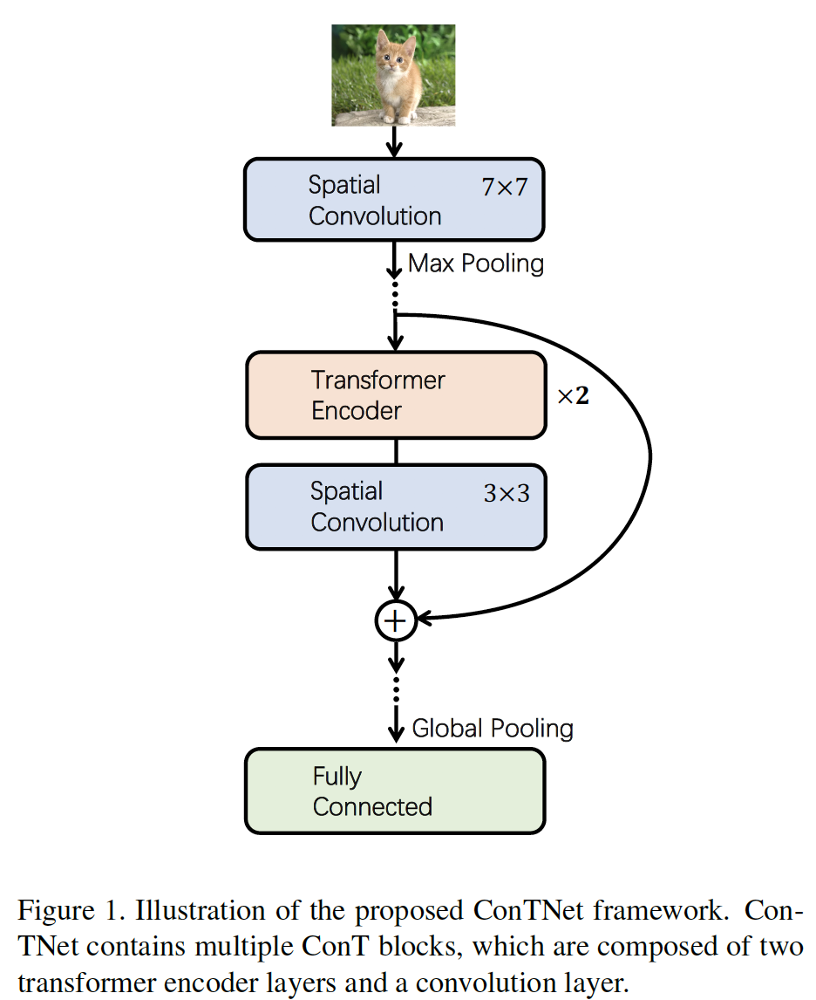
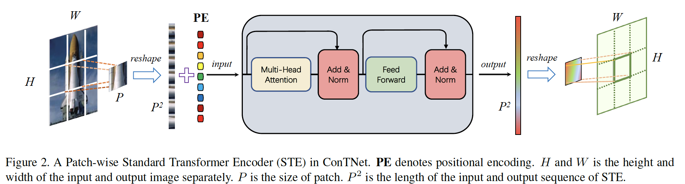
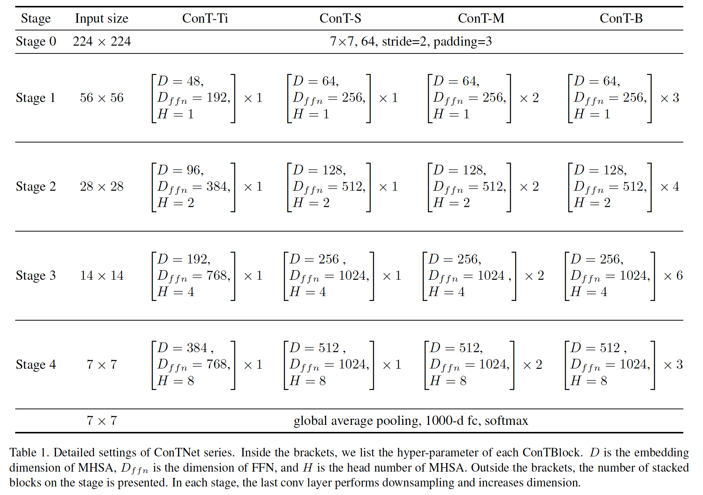

## ConTNet: Why not use convolution and transformer at the same time?

​		本文提出ConTNet（Convolution-Transformer Network），其将卷积网络架构与transformer结合以提供大型感受野。与最近提出的基于 Transformer 的模型（例如 ViT、DeiT）不同，这些模型对超参数敏感，并且在中等规模数据集（例如 ImageNet1k）上从头开始训练时极其依赖一堆数据增强，ConTNet [50] 可以像普通的 ConvNets（例如 ResNet）一样优化并保持出色的鲁棒性。ConTNet 在 ImageNet 上达到了 81:8% 的 top-1 准确率，这与 DeiT-B 相同，但计算复杂度不到 40%。 在 COCO2017 数据集上，ConTNet-M 作为 Faster-RCNN（提高 2.6%）和 Mask-RCNN（提高 3.2%）的主干也优于 ResNet50。  代码将在 https://github.com/yanhaotian/ConTNet 发布。

### 1. 引言

​		一般的视觉transformer对如学习率、训练epoch数、数据增强等训练设置高度敏感。

​		本文主要关注CN中如下挑战：（1）由于卷积的局部性，ConvNets 在大的感受野方面存在缺陷，导致下游任务的性能下降。（2）基于transform儿的模型需要特殊的训练设置或上千万的图像作为预训练数据集，这是阻碍其广泛使用的实际限制。

​		为了克服这些挑战，本文为视觉任务提出一种新颖的**Con**volutional-**T**transformer **Network**（ConTNet）。ConTNet通过堆叠ConT块实现，如图1。ConT块将标准的transformer编码器（standard transformer encoder：STE）视为与conv层相同的独立组件。具体而言，如图2所示，将特征划分为相同大小的几个补丁，并且将每个补丁摊平为（超）像素序列，接下来送入STE。最后，将补丁嵌入调整为特征图，并将它们馈入接下来的卷积层或STE。

### 3. ConTNet

#### 3.1.网络架构

​		ConTNet由标准transformer编码器 (STE) 和空间卷积组成，它们看似交替堆叠。 更准确地说，迈向 ConTNet 的第一步是建立一个相对较浅的 ConvNet，它有处理具有不同大小和通道特征图的四个阶段。然后，通过在相邻的卷积层之间插入STE来扩展ConTNet。进行这样的扩展是为了捕获对卷积层学习的局部表示进行补充的全局特征。

​		为了系统地将 STE 嵌入到 ConvNet 中，我们设计了一个模块，通过将它们成对分组，使 STE 与 conv 层完全集成。每个ConT块包含两个STE和一个核大小为$3 \times 3$的卷积层。在我们的实现中，划分补丁的空间尺寸依次设置为7和14。受ResNet的启发，我们构建shortcut连接来实现残差学习$y = f(x) + x$。ConTNet仍然是4阶段风格的层次网络，因为它需要适合下游任务，特别是目标检测和分割。在每个阶段中，最后的步长为2的卷积进行下采样以及增加通道数。当在ImageNet数据集上训练时，每个阶段的特征图的大小分别为$[56,28,14,7]$，每个阶段的通道数由大多数ConvNets中使用的流行设置$[64,128,256,512]$确定。每个阶段中的多头自注意力的头数设置为$[1,2,4,8]$以保持单个头注意力的通道数为64。值得注意的是，除了顶部和底部卷积层，ConTNet的核大小为$3 \times 3$。网络的顶部是核大小为$7 \times 7$的卷积和MaxPooling，其遵循ResNet的实践。最后一阶段中最后的卷积层的核大小为$1\times1$，从而节约参数。

#### 3.2. Patch-wise Standard Transformer Encoder

​		以$\mathbf{x}_{1d} \in \mathbb{R}^{N \times C}$作为输入，单头注意力的值为：

$$A = \mbox{softmax}\Big(\frac{(\mathbf{W}_1\mathbf{x}_{1d})(\mathbf{W}_k\mathbf{x}_{1d})^T}{\sqrt{D_h}}\Big)(\mathbf{W}_v\mathbf{x}_{1d}),\tag{5}$$

其中$\mathbf{W}_q,\mathbf{W}_k,\mathbf{W}_v \in \mathbb{R}^{C \times D_h}$，$D_h$通常设置为$D/h$。$D$为嵌入维度，$h$为头数。通过串联单个注意力得到多头注意力：

$$A_{mh} =[A_1;A_2;\cdots;A_h]\mathbf{W}_{mhsa},\tag{6}$$

$$MHSA(\mathbf{x}_{1d}) = LN(A_{mh} + \mathbf{x}_{1d}),\tag{7}$$

其中$W_{mhsa}\in\mathbb{R}^{D \times C}$为聚合多个注意力值的权重，$LN()$为Layernorm[1]，其在残差连接之后使用。然后，将MHSA的输出馈入FFN：

$$FFN(\mathbf{x}_{1d}) = LN(\mathbf{W}_2\mathbf{W}_1\mathbf{x}_{1d} + \mathbf{x}_{1d}),\tag{8}$$

其中$\mathbf{W}_1\in\mathbb{R}^{C \times D_{ffn}}$和$\mathbf{W}_w \in \mathbb{R}^{D_{ffn} \times C}$都为线性变换。

**Using STE like a kernel：**在 ConTNet 中，STE 在图像上滑动并将每个分割的补丁转换成一个新的补丁，它就像一个过滤器，核大小和步幅都等于补丁大小。我们发现这种类似核的操作有两个有利的特性。具体来说，patch-wise STE是权重共享的，具有平移等方差性和计算效率。通过我们的操作获得了相对粗略的逐块平移等方差，而不是像素级平移平移等方差。对于每个补丁，一些工作试图在对 2D 形状图像执行自注意力机制时对像素级平移等方差进行建模。为了缓解这个问题，我们选择简单而有效的方法：将参数共享的学习PE添加到每个分割补丁，其记录补丁中每个像素坐标，并避免转置等方差问题。与$9C^2$参数和计算复杂度为$9C^2HW$（假设输入和输出有相同的通道）的核大小为$3 \times 3$的卷积层相比，STE有$2D_{mhsa}D_{ffn}+4D_{mhsa}^2 + P^2D_{mhsa}$参数以及计算复杂度为$2D_{mhsa}D_{ffn}HW + 4D_{mhsa}^2HW+(HW)/P^2$。当MHSA的维度$D_{mhsa}$和输入通道数$C_{in}$相等以及FFN的维度$D_{ffn}$等于$D_{mhsa}$的四倍时，增加的参数为$3C^2 + P^2C$，增加的计算复杂度为$3C^2HW + (HW)/P^2$。

**利用STE和卷积层交替捕获特征：**

#### 

