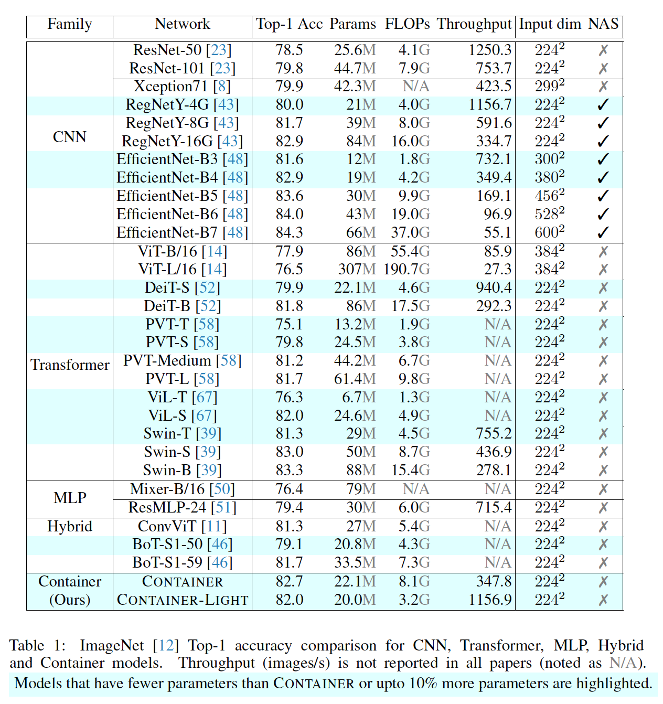
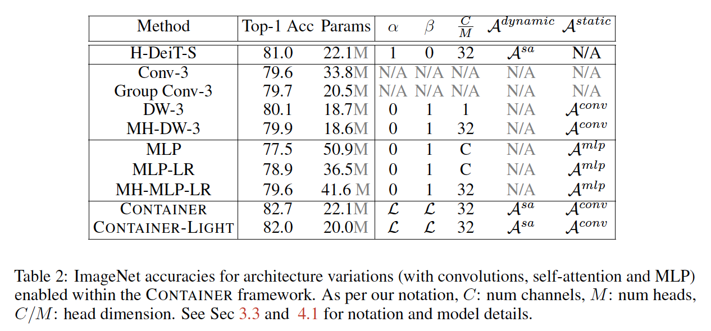
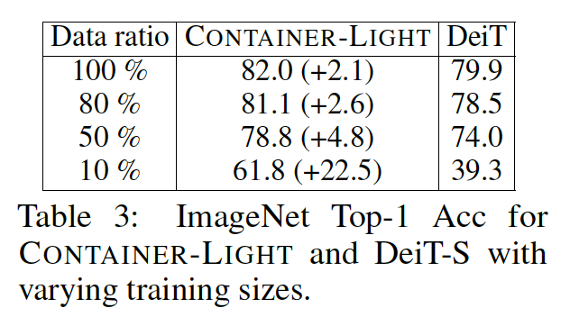
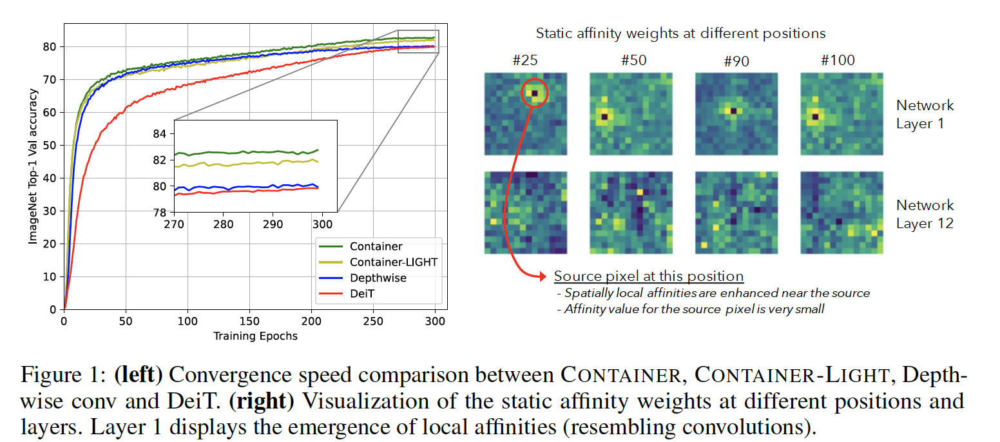
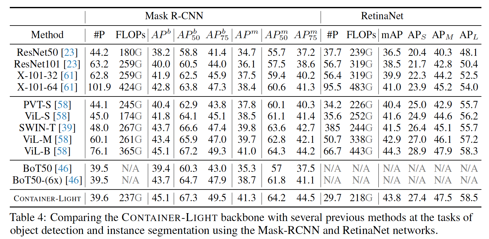
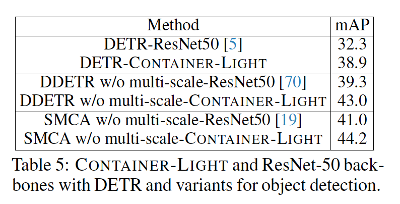
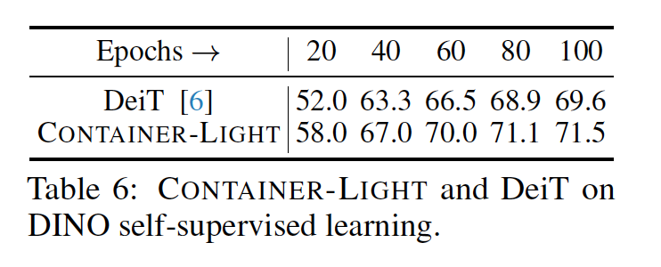
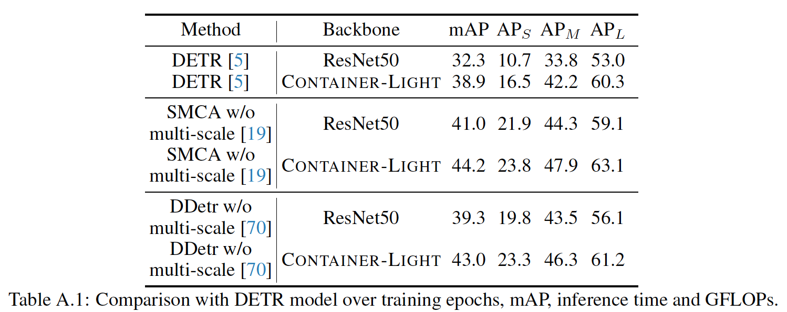
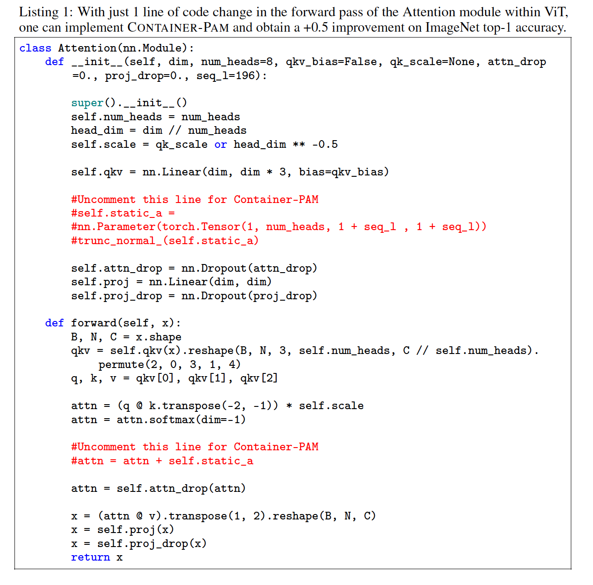

## Container: Context Aggregation Network

### 1	引言

​		表面上，CNNs [34, 8, 61, 23]、Vision Transformers (ViTs) [14, 52] 和 MLP-mixers [50] 通常表示为不同的架构。然而，退一步分析这些方法会发现它们的核心设计非常相似。这些方法中许多都采用级联的神经网络块。每个块通常包含聚合模块和融合模块。聚合模块在模块输入上的预定义上下文窗口中共享和累积信息（例如，Transformer 编码器中的自注意力操作），而融合模块结合位置特征并产生模块输出（例如，ResNet 中的前馈层）。

​		本文中，我们证明许多流行架构的主要差异源于其聚合模块的变化。这些差异实际上可以表示为聚合器内的亲和矩阵（`或者翻译为相似矩阵`）（affinity matrix）的变体，该矩阵用于确定查询向量与其上下文之间的信息传播。例如，在ViTs[14、15]中，这种亲和矩阵使用键和查询计算动态生成；但是在Xception架构[8]（其采用深度卷积）中，亲和矩阵示静态的——不管位置如何，亲和权重都相同，并且不管大小如何，它们在所有输入图像上都相同。最后，MLP-Mixer [50] 还使用了一个静态亲和矩阵，该矩阵在输入的范围内变化。

​		沿着这种统一观点，我们提出了 CONTAINER（上下文聚合网络），这是一个用于多头上下文聚合的通用构建块。CONTAINER块包含基于聚合的静态亲以及动态亲和，其使用可学习的混合系数组合。这保证CONTAINER块处理长范围信息，同时是仍利用局部卷积操作的归纳偏置。CONTAINER块易于实现，可以很容易地替代到许多当今的神经架构中，并产生高性能的网络，同时收敛速度更快，数据效率更高。

​		我们提出的CONTAINER架构使用22M参数在ImageNet上获得82.7%的top-1准确率，与有相当参数量的DeiT-S[52]提高了+2.8点。它收敛更快，与 300 个epoch相比，仅在 200 个epoch内就达到了 DeiT-S 的 79.9% 的准确率。

​		我们还提出一种更有效的模型，称为CONTAINER-LIGHT，其早期仅使用静态亲和矩阵，但是在计算的后面阶段使用静态和动态亲和矩阵的可学习混合。与处理大型输入上不高效的ViTs相比，CONTAINER-LIGHT可以扩展到下游任务，例如需要高分辨率输入图像的检测和实例分割。使用CONTAINER-LIGHT骨干和12个epoch训练，RetinaNet能够获得43.8mAP，同时Mask R-CNN在边界框预测上获得45.1mAP和在实例掩膜预测上获得41.3mAP，与ResNet-50骨干相比，分别提高7.3、6.9和6.6。最近的 DETR 及其变体 SMCA-DETR 和 Deformable DETR [5、19、70] 也受益于 CONTAINER-LIGHT 并实现了 38.9、43.0 和 44.2 mAP，比其 ResNet-50 主干基线显着提高。

​		CONTAINER-LIGHT是数据高效的。我们的实验表明，仅使用10%的训练数据它便可以获得61.8的ImageNet Top-1准确率，明显比DeiT的39.3准确率高。在 DINO 自监督训练框架 [6] 下，与 DeiT (69.6) 相比，CONTAINER-LIGHT 收敛速度也更快，并实现了更好的 kNN 精度 (71.5)。

​		CONTAINER统一和框架使我们能够轻松地复现过去的几个模型，甚至只需更改一些代码和参数即可扩展它们。我们扩展多个过去的模型，并表现出改进的性能——例如，我们产生Hierarchical DeiT模型，它是一种多头MLP-Mixer，并且将静态亲和矩阵添加到DeiT架构。最后，我们分析了包含静态和动态亲和力的 CONTAINER 模型，并展示了在网络的早期层中出现了类似卷积的局部亲和力。

​		总之，我们的贡献包括：（1）视觉输入流行架构的统一视图——CNN、Transformer 和 MLP-mixer，（2）新颖的网络块——CONTAINER，其通过可学习的参数和相应的架构使用静态和动态亲和矩阵的混合，在图像分类中取得了很好的效果以及（3）一种高效的扩展——在检测分割上具有强结果的CONTAINER-LIGHT。

### 3	方法

​		在本节中，我们首先提供当前神经网络中常用的邻域/上下文聚合模块的概括视角。然后，我们回顾三种主要架构——Transformer、Depthwise Convolution和最近提出的MLP-Mixer，并证明它们是我们的概括视角的一种特例。然后，我们在3.3节中展示了我们的 CONTAINER 模块，在3.5节中，介绍其高效版本——CONTAINER-LIGHT。

#### 3.1	Contextual Aggregation for Vision	

​		考虑到输入图像$X \in \mathbb{R} ^{C \times H \times W}$，其中$C$和$H \times W$分别表示输入图像的通道和空间维度。首先将输入图像摊平为token序列$\{X_i \in \mathbb{R}^C | i = 1, \cdots, N\}$，其中$N = HW$，并输入到网络。视觉网络通常堆叠多个具有残差连接的构建块，定义为：

$$\mathbf{Y} = \mathcal{F}(\mathbf{X},\{\mathbf{W}_i\}) + \mathbf{X}. \tag{1}$$

这里，$\mathbf{X}$和$\mathbf{Y}$为考虑层的输入和输出向量，$\mathbf{W}_i$为可学习参数。$\mathcal{F}$决定信息是如何跨$\mathbf{X}$聚合以在特定位置计算特征。我们首先定义一个亲和矩阵$\mathcal{A} \in \mathbb{R}^{N \times N}$，其表示上下文聚合的领域。式（1）可以重写为：

$$\mathbf{Y} = (\mathcal{A}\mathbf{V})\mathbf{W}_1 + \mathbf{X}, \tag{2}$$

其中$\mathbf{V} \in \mathbb{R}^{N \times C}$为由线性映射$\mathbf{V} = \mathbf{XW}_2$获得的$\mathbf{X}$的变换。$\mathbf{W}_1$和$\mathbf{W}_2$为可学习参数。$\mathcal{A}_{ij}$为$X_i$和$X_j$之间的亲和值。将亲和矩阵与$\mathbf{V}$相乘会根据亲和值在特征之间传播信息。

​		这种上下文聚合模块的建模能力可以通过引入多个亲和矩阵来增加，允许网络有多个途径来获取跨$\mathbf{X}$的上下文信息。令$\{\mathbf{V}^i \in \mathbb{R}^{N \times \frac{C}{M}}| i =1,\cdots, M\}$为$\mathbf{V}$的切片，其中$M$为亲和矩阵的数量，也称为头的数量。式（2）的多头版为：

$$\mathbf{Y} = \mbox{Concat}(\mathcal{A}_i\mathbf{V}_1, \cdots,\mathcal{A}_M\mathbf{V}_M)\mathbf{W}_2 + \mathbf{X},\tag{3}$$

其中$\mathcal{A}_m$表示每个头中的亲和矩阵。不同的$\mathcal{A}_m$可能 不同特征空间中的不同关系，因此，与单头版相比，能够增加上下文聚合的表示能力。值得注意的是，使用亲和矩阵的上下文聚合仅传播空间信息；亲和矩阵乘法内不发生跨通道信息交换，也没有非线性激活函数。

#### 3.2	The Transformer, Depthwise Convolution and MLP-Mixer

​		Transformer、depthwise卷积和最近提出的MLP-Mixer是计算机视觉中使用的三种不同构建块。这里，我们证明它们可以在上述上下文聚合框架内通过定义不同类型的关联矩阵来表示。

**Transformer**	在Transformer的自注意力机制中，通过投影的查询-键对之间的相似性来建模亲和矩阵。利用$M$个头，头$m$中的亲和矩阵$\mathcal{A}_m^{sa}$可以写为：

$$\mathcal{A}_m^{sa} = \mbox{Softmax}(\mathbf{Q}_m\mathbf{K}_m^T/\sqrt{C/M}),\tag{4}$$

其中$\mathbf{K}_m$、$\mathbf{Q}_m$分别为头$m$中的相应的键和查询。自注意力中的亲和矩阵是动态生成的，并且可以捕获实例级信息。但是，这引入二次方计算，对于高分辨率特征，其需要繁重的计算。

**Depthwise Convolution**	卷积算子并行地融合空间和通道信息。这与上述定义的上下文聚合块不同。但然而，作为组卷积的极端情况的深度卷积 [30] 执行解藕卷积。考虑上下文聚合块的头数等于通道大小$C$，我们可以给丁1维核$Ker \in \mathbb{R}^{C \times 1 \times k}$定义卷积亲和矩阵：

$$\mathcal{A}_{mij}^{conv} = \begin{cases}Ker\big[m,0,|i-j|\big] & |i - j \le k| \\ 0 & |i -j|>k\end{cases},\tag{5}$$

其中$\mathcal{A}_{mij}$为头$m$中$X_i$和$X_j$之间的亲和值。与从 self-attention 获得的亲和矩阵（其值取决于输入特征）相反，卷积的亲和值是静态的（它们不依赖于输入特征）、稀疏的（只涉及局部连接并在亲和矩阵之间共享）。

**MLP-Mixer**	最近提出的MLP-Mixer不依赖卷积或自注意力算子。MLP-Mixer的核心是转置MLP操作，其可以表示为$\mathbf{X} = \mathbf{X} + (\mathbf{V}^T \mathbf{W}_{MLP})^T$。我们可以将亲和矩阵定义为：

$$\mathcal{A}^{mlp} = (\mathbf{W}_{MLP})^T, \tag{6}$$

其中$\mathbf{W}_{MLP}$表示可学习参数。这种简单的公式表明转置MLP算子为单个特征组上的上下文聚合算子，具有密集的亲和矩阵。与自注意力和深度卷积相比，转置MLP亲和矩阵是静态的、密集的而没有参数共享。

​		上述简单统一反应Transformer、深度卷积和MLP-Mixer之间的相似性和差异。这些构建块中的每一个都可以通过不同的公式化不同的亲和力矩阵来获得。 这一发现使我们为视觉任务创建了一个强大而高效的构建块——CONTAINER。

#### 3.3	The CONTAINER Block

​		如3.2节描述的，先前的架构要么采用静态生成的亲和矩阵，要么使用采用动态生成的亲和矩阵——其中每一个都提供了独特的优势和特征。我们提出的构建块称为CONTAINER，其通过可学习参数组合两种类型的亲和矩阵。单头CONTAINER定义为：

$$\mathbf{Y} ((\alpha \begin{matrix}Dynamic\\ \overbrace{\mathcal{A}(\mathbf{X})}\end{matrix} + \beta\begin{matrix} Static \\ \overbrace{\mathcal{A}}\end{matrix})V)W_2 + \mathbf{X} \tag{7}$$

$\mathcal{A}(\mathbf{X})$为从$\mathbf{X}$动态生成，$\mathcal{A}$为静态亲和矩阵。现在，我们介绍CONTAINER块的一些特例，$\mathcal{L}$表示可学习参数。

- $\alpha = 1$、$\beta = 0$、$\mathcal{A}(x) = \mathcal{A}^{sa}$：具有自注意力（表示为sa）的普通Transformer块。
- $\alpha = 0$、$\beta = 1$、$M=C$、$\mathcal{A} = \mathcal{A}^{conv}$：深度卷积块。在深度卷积中，每个通道由不同的静态亲和矩阵。当$M \ne C$时，产生的块可以视为Multi-head Depthwise Convolution块（MH-DW）。MH-DW共享核权重。
- $\alpha = 0$、$\beta = 1$、$M=1$、$\mathcal{A} = \mathcal{A}^{mlp}$：MLP-Mixer块。当$M \ne 1$时，我们称其为Multi-head MLP（MH-MLP）。MH-MLP将通道划分为$M$组，并且进行独立的转置MLP以捕获多种静态token关系。
- $\alpha = \mathcal{L}$、$\beta = \mathcal{L}$、$\mathcal{A}(x)=\mathcal{A}^{sa}$、$\mathcal{A} = \mathcal{A}^{mlp}$：CONTAINER块融合动态和静态信息，但是静态亲和类似MLP-Mixer矩阵。我们称这个块为CONATINER-PAM（Pay Attention to MLP）。
- $\alpha = \mathcal{L}$、$\beta = \mathcal{L}$、$\mathcal{A}(x)=\mathcal{A}^{sa}$、$\mathcal{A} = \mathcal{A}^{conv}$：CONTAINER块融合动态和静态信息，但是静态亲和类似深度卷积矩阵。这种静态亲和包含局部约束，它是平移不变的，使其更适合视觉任务。我们的实验中默认使用这种配置。

​        CONTAINER块易于实现，并且可以轻松地切换到已有的神经网络。上述版本的 CONTAINER 提供了结果架构及其性能的变化，并表现出不同的优点和局限性。 CONTAINER 块的计算成本与普通 Transformer 相同，因为静态和动态矩阵是线性组合的。

#### 3.5	The CONTIANER-LIGHT network	

​		我们还提出一种高效版，称为CONTAINER-LIGHT，其使用与CONTAINER相同的基本架构，但是在前3个阶段中关闭了动态亲和矩阵。在计算的早期阶段没有计算繁重动态注意力有助于有效地扩展模型以处理大图像分辨率并在下游任务（例如检测和实例分割）上实现卓越的性能。

$$\mathcal{A}_m^{\mbox{CONTIANER-LIGHT}} = \begin{cases}\mathcal{A}_m^{conv} & \mbox{Stage = 1, 2, 3} \\\alpha\mathcal{A}_m^{sa} +\beta \mathcal{A}_m^{conv} & \mbox{Stage = 4}\end{cases},\tag{8}$$

$\alpha$和$\beta$时可学习参数。在网络阶段1、2、3中，CONTIANER-LIGHT将关闭$\mathcal{A}_m^{sa}$。

### 4	实验

#### 4.1	图像分类

**Top-1 Accuracy**	表1比较集中使用CNN、Transformer、MLP、Hybrid和我们提出的CONTAINER系列的高性能模型。

**数据有效性**

**收敛速度**	见图1左

**Emergence of locality**	见图1右

#### 4.2	Detection with RetinaNet

#### 4.4	Detection with DETR

#### 4.5	Self supervised learning

### 附录

#### A	实验设置

##### A.1	ImageNet分类

​		所有模型的训练设置与DeiT相同。在8张16G V100 GPU上，以每张GPU处理128张图像来训练MLP和CONTAINER-LIGHT。Transformer和CONTAINER在8张80G 100 GPU上训练，并且每张GPU处理128张图像。数据增强为颜色扰动、随机擦除和mixup。使用AdamW优化器。使用如下公式计算学习率：

$$lr = \frac{lr_{base} \times Batch \times N_{GPU}}{512} \tag{9}$$

其中基学习为$5 \times e^{-4}$。我们使用余弦学习策略，并在前5个epoch中进行warm up，总共训练300个epoch。

##### A.2	Detection with RetinaNet

​		训练13个epoch，学习率从0.0001开始，并在第8个epoch和11个epoch时减小10倍。使用AdamW优化器，并将权重衰减设置为0.05。没有使用梯度裁剪。在前500迭代中使用warm up。利用8张V100 GPU训练，每张GPU处理2张图像。与DETR相似，冻结BN参数。

##### A.3	Detection and Segmentation with Mask-RCNN

​		在8张GPU上训练Mask-RCNN模型，每张GPU处理两张图像。使用AdamW优化模型，学习设置为0.0001，权重衰减设置为0.05。在前500次迭代中使用warm up。冻结所有层的BN参数。

##### A.4	Detection with DETR

​		为了提高DETR的收敛速度和性能，SMCA-DETR提出一种空间调节的co-attention机制，其可以提高DETR的收敛速度。Deformable DETR通过可变形编码器和解码器获得快速收敛。我们在没有膨胀的 DETR、没有多尺度的 SMCA 和没有多尺度的Deformable DETR 上比较了 CONTAINER-LIGHT 和 ResNet 50。DETR个SMCA-DETR利用8张GPU优化，每张GPU2幅图像，Deformable DETR使用8张GPU，每张GPU处理4张图像。所有模型使用AdamW优化器和权重裁剪优化。DETR、SMCA-DETR和Deformable DETR都使用原始代码中的默认参数设置。

##### A.5	Self-supervised Learning DINO

​		DINO是最近提出的自监督学习框架。我们采用DINO中的默认训练设置来测试CONTAINER-LIGHT在自监督学习上的性能。我们比较使用DINO的ViT-S/16模型。基线模型和 CONTAINER-LIGHT 使用具有余弦计划的学习率和权重衰减训练100个epoch。 热身结束时的学习率为 0.0005，而结束时的权重衰减将保持恒定为 0.4。 每个 GPU 的批次大小设置为 64。我们报告 kNN 精度作为评估自监督模型性能的指标。

#### B	1 line code for Container-PAM

