## CvT: Introducing Convolutions to Vision Transformers

### 摘要

​		本文中，我们提出一种新的架构，称为Convolutional vision Transformer（CvT），其通过将卷积引入ViT中以产生两种设计的最佳效果，从而提高了Vision Transformer（ViT）的性能和效率。这通过两种主要修改来完成：包含新卷积令牌（token）嵌入的Transformer层次结构，以及利用卷积投影的卷积Transformer块。这些改变将卷积神经网络的理想特性（即平移、尺度和畸变的不变性）引入ViT架构，同时保留Transformer的优点（即动态注意力、全局上下文和更好的泛化能力）。我们通过进行广泛的实验来验证CvT，表明该方法与ImageNet-1k上的其他Vision Transformer和ResNet相比，具有更少的参数和更低的FLOP，可实现最新的性能。此外，当在更大的数据集（例如ImageNet-22K）上预训练，并在下游任务上微调时，仍能维持性能增益。在ImageNet-22k上预训练，我们的CvT-W24在ImageNet-1K验证集上获得87.7%的top-1准确率。最后，我们的结果表明位置嵌入编码（已有的Vision Transformer中的关键组件）可以在我们的模型中被安全移除，其简化更高分辨率视觉任务的设计。代码见https://github.com/leoxiaobin/CvT。

### 1. 引言

​		Transformers[31、10]最近在自然语言处理（NLP）[32]中主导了广泛的任务。Vision Transformer（ViT）[11]是第一个完全依赖于Transformer架构的计算机视觉模型，可以在大尺度上获得具有竞争力的图像分类性能。ViT设计采用具有最小修改的来自语言理解的Transformer架构[10]。首先，将图像划分为不重叠的块（例如$16\times16$）。然后，将这些块视为token（类似NLP中的token），并加上特殊的位置编码以表示粗糙的空间信息，并输入重复的标准Transformer层以建模全局相关性进行分类。

​		尽管Vision Transformer在大尺度上获得成功，在使用较少量的数据进行训练时，其性能仍低于类似大小的卷积神经网络（CNN）副本（例如ResNets [15]）。一个可能的原因可能是ViT缺乏CNN体系结构固有的某些理想属性，这些属性使CNN特别适合解决视觉任务。例如，图像有强壮的2D局部结构：空间相邻的像素通常高度相关。CNN架构通过使用_局部感受野_、_共享权重_和_空间子采样_来迫使捕获这种局部结构，并因此还获得一定程度的平移、缩放和畸变不变性。此外，卷积核的分层结构学习视觉模式，这些模式在不同的复杂性级别上考虑了局部空间上下文，从简单的低级边缘和纹理到高阶语义模式。

​		本文中，我们假设可以将卷积策略性地引入到ViT结构中，以提高性能和鲁棒性，同时保持较高的计算和存储效率。为了验证我们的假设，我们提出一种新的架构，称为Convolutional vision Transformer（CvT），该架构在浮点运算（FLOP）和参数方面都将卷积固有地有效地整合到了Transformer中。

​		CvT设计将卷积引入ViT架构的两个核心部分。首先，我们将Transformer分为_multiple stage_，其构成Transformer的层次结构。每个阶段的开始包含一个_convolutional token embedding_，其在2D-reshaped的token图（即将平坦的token序列重塑为空间网格）带进行带步长的重叠卷积操作。这允许模型不仅捕获局部信息，还渐进式地减小序列长度，同时增加跨阶段的token特征的维度，实现空间下采样，同时增加特征图数量，这与CNN中所完成的相似。其次，用我们提出的卷积投影取代了在Transformer模块中每个自注意力块之前的线性投影，该卷积投影在2D-reshaped token图上采用了$s \times s$深度可分离卷积[5]运算。这允许模型进一步捕获局部空间上下文，并减小注意力机制中的语义模糊。它还可以管理计算的复杂性，因为卷积的步幅可用于对键和值矩阵进行二次采样，以将效率提高4倍或更多，而性能下降最少。

​		总之，我们提出的CvT利用CNN的所有好处：局部感受野、共享权重和空间下采样，同时保留Transformer的所有优势：动态注意力、全局上下文融合和更好的泛化。我们的结果表明，当使用ImageNet-1k对CvT进行预训练时，此方法可实现最先进的性能，同时又轻巧高效：与基于CNN的模型（例如ResNet）和以前的基于Transformer的模型（例如ViT、DeiT）相比，CvT可以提高性能，同时使用更少的FLOPS和参数。此外，当在更大尺度预训练（例如在公开的ImageNet-22k数据集上）上评估时，CvT获得最佳性能。最后，我们证明，在这种新设计中，我们可以为token丢弃位置嵌入，而没有衰减模型性能。这不仅简化架构设计，还使其易于适应各种视觉任务至关重要的输入图像的可变分辨率。

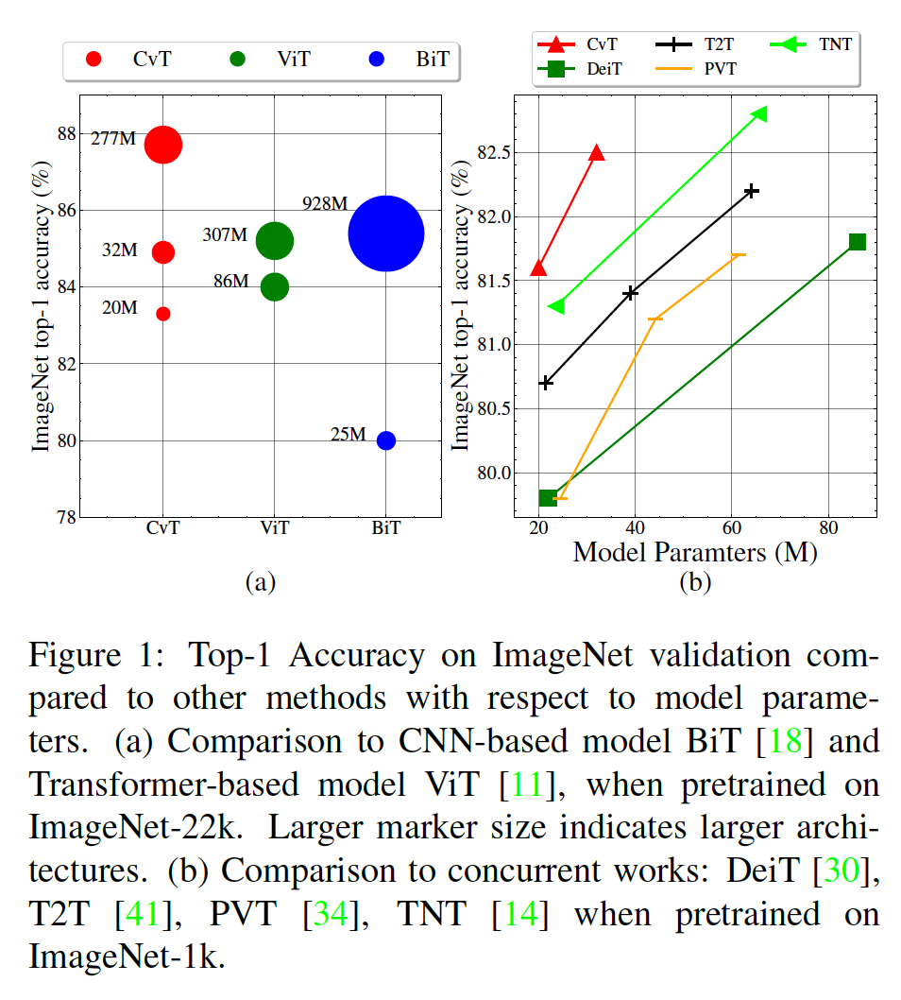

### 2. 相关工作

​		在自然语言建模中，仅依靠自我注意机制来捕获全局依赖关系的Transformer已经占据主导地位[31、10、25]。最近，基于Transformer的架构以被视为视觉识别任务（例如分类、目标检测、分割、图像增强、图像生成、视觉处理和3D点云处理）中的可行的替代。

**Vision Transformers**	Vision Transformer（ViT）率先证明，当数据足够大（例如 ImageNet-22k、JFT-300M））时，纯的Transformer架构可以在图像分类方面达到最先进的性能（例如ResNets [15]、EfficientNet [29]）。具体而言，ViT将每幅图像分解为具有固定长度的token序列（即非重叠的补丁），然后使用多个标准的Transformer层（其包含Multi-Head Self-Attention Module（MHSA）和Position-wise Feed-forward module（FFN））来建模这些token。DeiT进一步为ViT探索数据高效的训练和蒸馏。在这项工作中，我们研究如何将CNN和Transformer结合以高效的方式为图像分类建模局部和全局依赖。

​		为了在Vision Transformer中更好地建模局部上下文，一些当前工作已引入设计变化。例如，Conditional Position encoding Visual Transformer（CPVT）[6]利用条件位置编码（conditional position encoding：CPE）替换ViT中使用的预定义位置嵌入，其保证Transformer在没有插值的情况下处理任意大小的输入图像。Transformer-iN-Transformer（TNT）[14]利用处理补丁嵌入的外部Transformer块和对像素嵌入之间的关系进行建模的内部Transformer块，对补丁级和像素级表示进行建模。Token-to-Token（T2T）[41]主要通过将滑动窗口中的多个token拼接为一个token来改善标记化。但是，此操作从根本上不同于卷积，尤其是在归一化化细节上，并且多个token的串联极大地增加了计算和存储的复杂性。PVT[34]为Transformer纳入多阶段设计（没有卷积），其与CNN中的多尺度相似，适合密集预测任务。

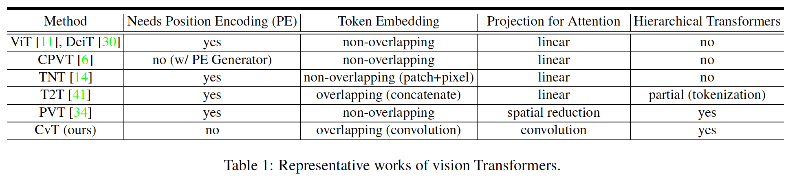

​		与这些当前工作相比，这项工作旨在通过将具有图像域特定感知偏差的卷积引入到Transformer架构中来实现两全其美。表1给出上述代表性工作和我们的工作在主干中的位置编码、token嵌入类型、投影类型和Transformer结构方面的关键差异。

**Introducing Self-attentions to CNNs**	自注意力机制已广泛用于视觉任务中的CNN。在这些工作中，设计非局部网络用于通过全局注意力捕获长期依赖。与在空间相邻输入特征上采用固定聚合权重的卷积层相比，局部关系网络[17]基于局部窗口内像素/特征之间的组成关系（相似性）来调整其权重聚合。如此的自适应权重聚合将几何先验引入网络，这对于识别任务很重要。最近，BoTNet[27]提出一种简单而强力的主干架构，其在ResNet的最后三个瓶颈块中将空间卷积替换为全局注意力，并在图像识别中获得强健性能。相反，我们的工作方向相反：将卷积引入“Transformer”中。

**Introducing Convolutions to Transformers**	在NLP和语音识别中，通过使用卷积层[38]代替多头注意力，或并行[39]或顺序地添加[13]以捕获局部关系，卷积已被用于修改Transformer块。其他先前的工作[37]提出通过残差连接将注意力图传播到后续图层，该残差连接首先通过卷积进行转换。与这些工作不同，我们提出将卷积引入到Vision Transformer的两个主要部分：第一，将已有的注意力操作中的Position-wise Linear Projection替换为Convolutional Projection；第二，使用我们的分层多级结构来实现不同分辨率的2D重塑token图，类似于CNN。与以前的工作相比，我们独特的设计具有明显的性能和效率优势。

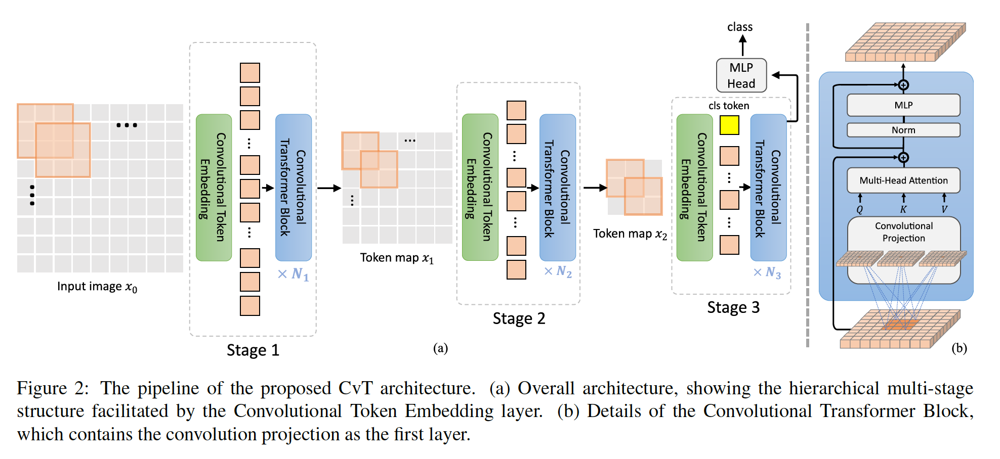

### 3. Convolutional vision Transformer

​		CvT的整体流水线如图2所示。我们将两个基于卷积的操作引入到Vision Transformer架构，即Convolutional Token Embedding和Convolutional Projection。如图2（a）所示，采用来自CNN的多阶段层次设计[20、15]，其中，这项工作共计使用三个阶段。每个阶段包含两个部分。第一，与_Convolutional Token Embedding_层对应的输入图像（或2D reshaped token map），它实现为具有重叠块的卷积，其中token被重塑为2D空间网格作为输入（重叠程度可以通过步长控制）。并将额外的Layer Normalization用于token。这允许每个阶段渐进式地减少token数量（即特征分辨率），同时增加token的宽度（即特征维度），因此获得空间上的下采样，并增加表示的丰富性，这与CNN的设计相似。与其他基于Transformer的架构不同，我们没有将ad-hod位置嵌入加到token。接着，堆叠的所提出的卷积Transformer块包括每个阶段的其余部分。图2（b）展示了Convlutional Transformer Block的架构，其中将Depth-wise Separable Convolution操作（称为_Convolutional Projection_）分别用于查询、键和值嵌入，而不是ViT中标准的逐位置的线性映射。此外，分类token仅在最后阶段添加。最后，在最后阶段输出的分类token上使用一个MLP（即完全连接）Head来预测该类。

​		我们首先详细阐述所提出的卷积token嵌入层。接着，我们展示如何为Multi-Head Self-Attention模块进行Convolutional Projection，以及在管理计算成本上的高效设计。

#### 3.1. Convolutional Token Embeeding

​		CvT中的这种卷积运算旨在通过类似于CNN的多级层次方法，对从低级边缘到高阶语义基元的局部空间上下文进行建模。

​		形式上，从前一阶段给定2D图像或2D-reshaped输出token图$x_{i-1} \in \mathbb{R}^{H_{i-1}\times W_{i-1}\times C_{i-1}}$作为阶段$i$个输入，我们学习一个函数$f(\cdot)$，其将$x_{i-1}$映射到新的通道大小为$C_i$的token $f(x_{i-1})$，其中$f(\cdot)$为核大小为$s \times s$、步长为$s - o$和$p$填充的的2D卷积运算。新的token图$f(x_{i-1}) \in \mathbb{R}^{H_i \times W_i \times C_i}$的高和宽分别为：

$$H_i = \lfloor \frac{H_{i-1} + 2p -s}{s-o} + 1 \rfloor, W_i = \lfloor \frac{W_{i-1} +2p -s}{s-o} +1\rfloor.\tag{1}$$

然后将$f(x_{i-1})$展开为$H_iW_i\times C_i$，并且使用Layer Normalization归一化以作为阶段$i$的后续Transformer块的输入。

​		_Convolutional Token Embedding_层允许我们通过变化卷积操作的参数调整token特征维度和每个阶段token的数量。以这种方式，每个阶段中，我们渐进式地减小token特征的长度，同时增加token特征的维度。类似于CNN的特征层，这使token能够在越来越大的空间覆盖区上表示越来越复杂的视觉模式。

#### 3.2. Convolutional Projection for Attention

​		提出_Convolution Projection_层的目的是为了获得局部空间上下文的额外建模，并通过允许对$K$和$V$矩阵进行欠采样来提供效率优势。

​		本质上，所提出的具有_Convolution Projection_的Transformer块是原始Transformer块的推广。虽然先前工作[13、39]尝试将额外的卷积模块添加到Transformer块进行语音识别和自然语言处理，但是它们产生更复杂的设计和额外的计算成本。相反，我们提出利用depth-wise separable convolution替换Multi-Head Self-Attention（MHSA）的position-wise linear projection，构成_Convolutional Projection_层。

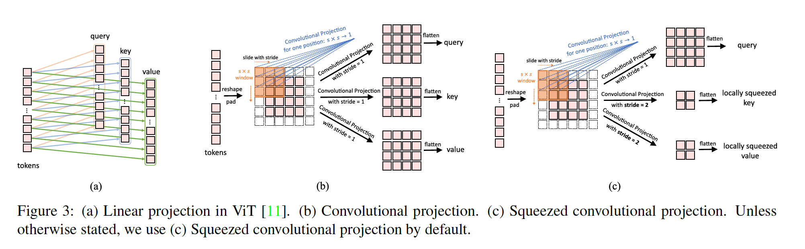

##### 3.2.1	实现细节

​		图3（a）展示Vit中使用的原始的position-wise projection，图3（b）展示我们提出的$s \times s$ _Convolutional Projection_。如图3（b）所示，首先将token调整为2Dtoken图。接着，使用核大小为$s$的depth-wise separable convolution实现Convolution Projection。最后，将映射后的token展开为1D以用于后续处理。这可以表示为：

$$x_i^{q/k/v} = \mbox{Flatten}(\mbox{Conv2d}(\mbox{Reshape2D}(x_i), s)),\tag{2}$$

其中$x_i^{q/k/v}$为层$i$中的$Q/K/V$矩阵的token输入，$x_i$为Convolutional Projection之前的不变token，$\mbox{Conv2d}$为通过如下形式实现的depth-wise separable convolution：$\mbox{Depth-wise Conv2d} \rarr \mbox{BatchNorm2d} \rarr \mbox{Point-wise Conv2d}$，$s$称为卷积核大小。

​		产生的具有卷积投影的新Transformer Block是原始Transformer Block设计的推广。原始位置线性投影层可以使用核大小为$1\times1$的卷积层轻松实现。

#### 3.2.2	Efficiency Considerations

​		我们的卷积投影层的设计有两个主要的效率优势。

​		第一，我们利用高效的卷积。直接将标准的$s\times s$卷积用于Convolutional Projection需要$s^2C^2$参数和$\mathcal{O}(s^2C^2T)$ FLOP，其中$C$为token通道维度，$T$为处理的token数量。相反，我们将标准的$s\times s$卷积划分为depth-wise separable convolution[16]。以这种方式，与原始的逐位置线性映射相比，所提出的Convolutional Projection中的每一个仅引入额外的$s^2C$参数和$\mathcal{O}(s^2CT)$ FLOP，相对于模型的全部参数和FLOP，这可以忽略不计。

​		第二，我们利用所提出的Convolutional Projection来减少MHSA操作的计算成本。$s\times s$卷积映射允许通过使用大于1的步长来减少token的数量。图3（c）展示了Convolutional Projection，其中使用步长大于1的卷积下采样键和值投影。我们为键和值投影使用的步长为2，而查询的步长为1。以这种方式，键和值的token长度减小4倍，后面的MHSA操作的计算成本减小4倍。这会带来最小的性能损失，因为图像中的相邻像素/补丁往往在外观/语义上具有冗余性。此外，所提出的卷积投影补偿了由分辨减小引起的信息损失。

#### 3.3. Methodological Discussions

**移除位置嵌入：**对每个Transformer块引入卷积投影，再加上卷积token嵌入，使我们能够通过网络对局部空间关系进行建模。正如我们的实验所证明的（第4.4节），这种内置属性允许从网络中删除位置嵌入而不会影响性能，从而简化了具有可变输入分辨率的视觉任务的设计。

**与当前工作的关系：**最近，另外两项相关的并行工作也提出通过将CNN的元素合并到“Transformer”中来改善ViT。Token-to-Token ViT[41]实现一种渐进式的tokenization，然后使用基于Transformer主干，其中token的长度是固定的。相比之下，我们的CvT通过多阶段过程实现渐进式的tokenization，其中每个阶段包含卷积token嵌入和卷积Transformer块。随着每个阶段中的token长度的减小，token的宽度（特征维度）会相应增加，这允许在每个特征空间分辨率下增加表示的丰富性。此外，T2T将相邻token连接为一个新token，从而导致内存和计算的复杂性增加，而我们使用卷积token嵌入直接执行上下文学习而无需连接，同时提供了控制步长和特征尺寸的灵活性。为了管理复杂性，T2T必须考虑在后续主干中采用比ViT更小的隐藏尺寸和MLP大小的deep-narrow架构。相反，我们通过将position-wise线性投影替换为我们的卷积投影来改变先前的Transformer模块。

​		PVT[34]克服了将ViT移植到各种密集预测任务中的困难。在ViT中，输出特征为具有低分辨率的单尺度。此外，计算和内存成本相对较高，即使是常用的输入图像大小。为了处理这个问题，PVT和我们的CvT将CNN的金字塔结构纳入Transformer结构。与PVT相比，PVT仅在空间上对投影中的特征图或键/值矩阵进行下采样，而我们的CvT则采用大步长卷积来实现此目标。我们的实验（第4.4节）证明局部相邻信息的融合在性能上起着重要作用。

### 4. 实验

​		本节中，我们在大尺度图像分类数据集上评估CvT模型，并将其迁移到下游数据集。此外，我们通过消融研究来验证所提出架构的设计。

#### 4.1 设置

​		对于评估，我们使用具有1.3M图像和1k类别的ImageNet数据集，以及它具有22K类和14M图像的超集ImageNet-22K。我们进一步将ImageNet-22k上预训练的模型迁移到下游任务，包括CIFAR-10/100、Oxford-IIIT-Pet、Oxford-IIIT-Flower，并遵循[18、11]。

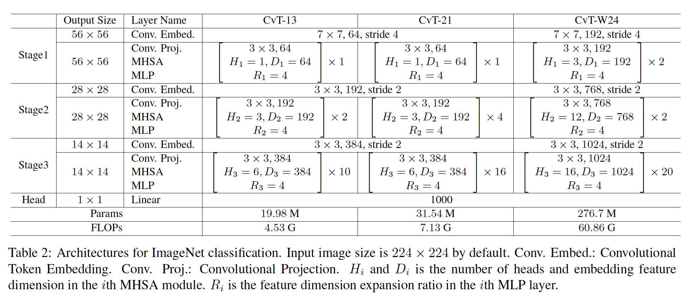

**模型变体**	我们通过改变每个阶段的Transformer块和使用的隐藏特征维度来实例化不同参数和FLOP的模型，如表2所示。采用三个阶段。我们定义CvT-13和CvT-21作为基模型，其参数分别为19.98M和31.54M。CvT-X表示共有$X$个Transformer Block的Convolution vision Transformer。此外，我们在每个阶段使用较宽的模型进行试验，该模型具有较大的token维度，即CvT-W24（$W$表示Wide），产生298.3M个参数，以验证所提出架构的伸缩能力。

**训练**	为CvT-13使用权重衰减为0.05的AdamW优化器，为CvT-21和CvT-W24使用权重衰减0.1。我们利用0.02的初始学习率和2048的批大小训练模型300个epoch，并使用余弦学习率衰减调度器。我们采用与ViT相同的数据集增强和正则化方法。除非其他说明，所有模型利用$224 \times 224$的输入大小训练所有ImageNet模型。

**微调**	我们采用ViT的微调策略。使用momentum为0.9的SGD优化器微调。如ViT[30]，我们在$224 \times 224$的输入分辨率上预训练模型，并在$384 \times 384$的分辨率上微调。我们以512的总批大小微调每个模型，在ImageNet-1k上微调20000步，CIFAR-10和CIFAR-100上为10000步，Oxford-IIIT-Pet和Oxford-IIIT-Flower-102上为500步。

#### 4.2. 与SOTA的比较

​		我们将我们的方法与SOTA分类方法（包括基于Transformer和ImageNet、ImageNet Real和ImageNet V2数据集上代表性的基于CNN的方法）进行比较，如表3所示。

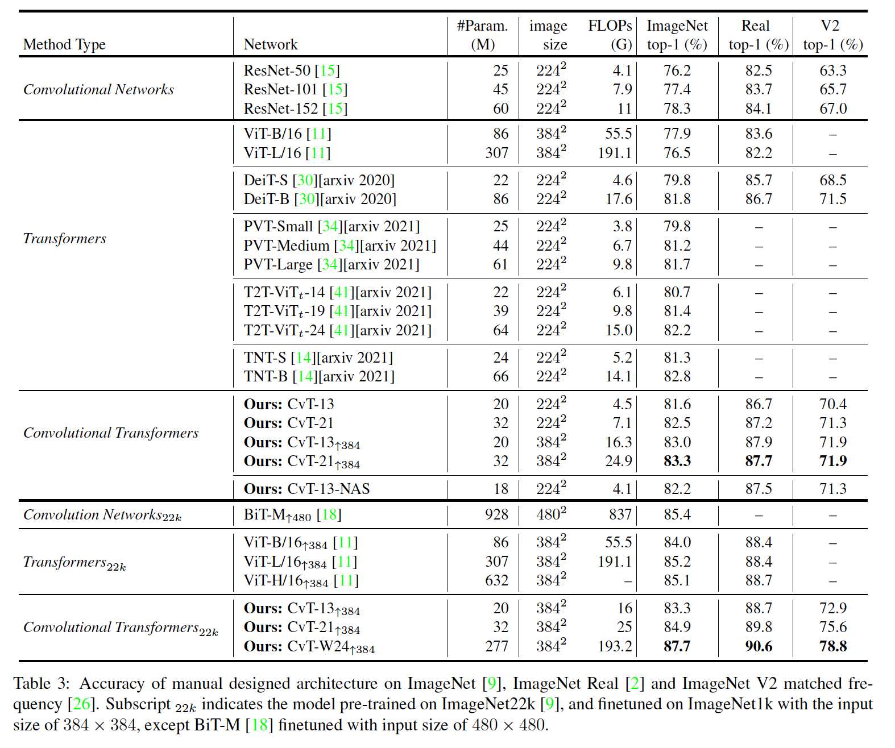

#### 4.3. Downstream task transfer

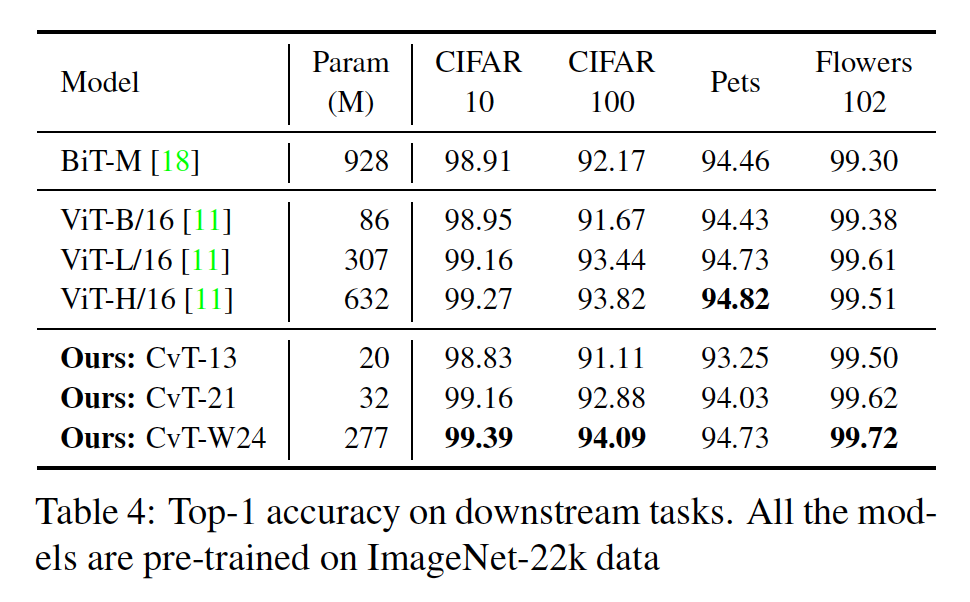

#### 4.4. 消融研究

**Removing Position Embedding**

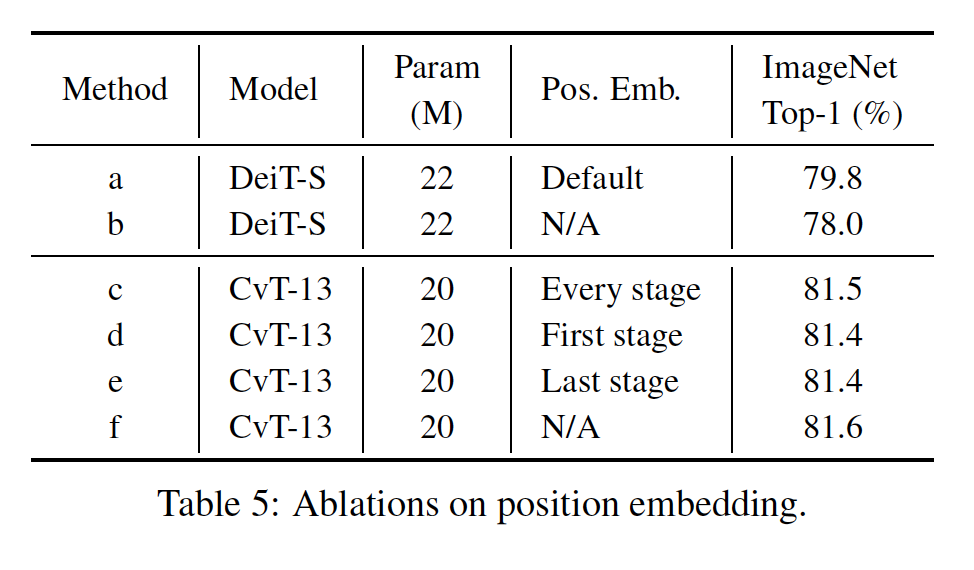

**Convolutional Token Embedding**

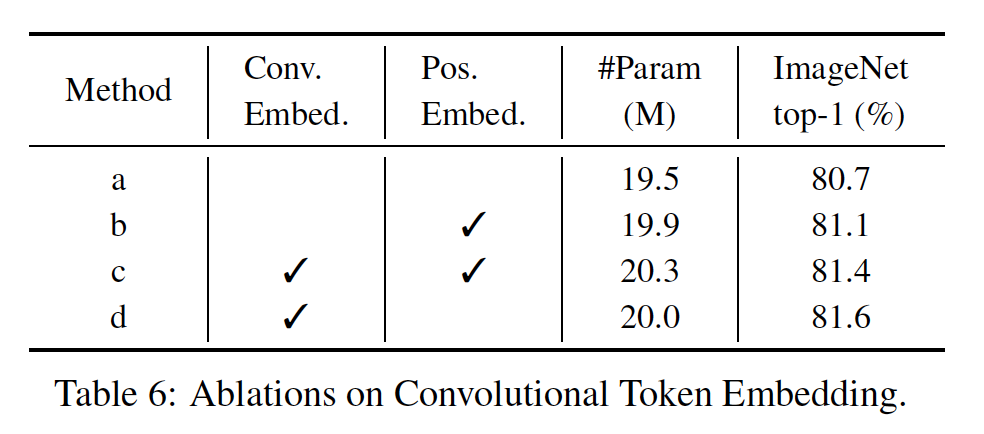

**Convolutional Projection**

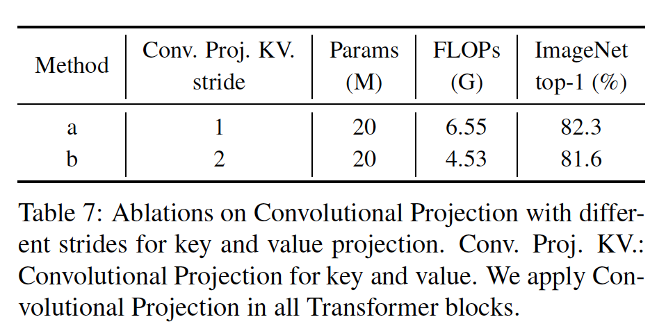

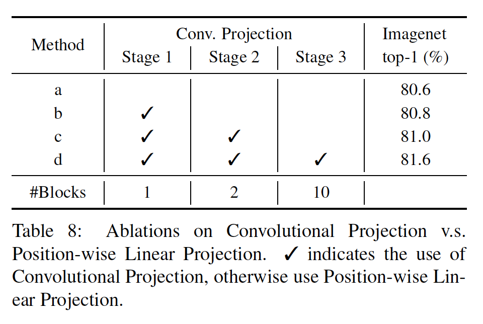