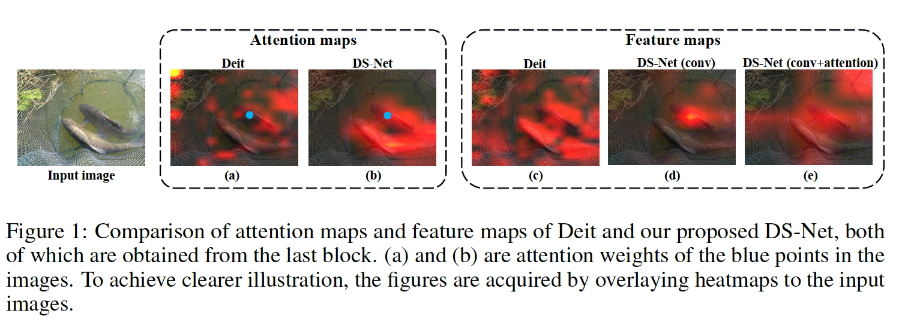

##	Dual-stream Network for Visual Recognition

###	摘要

​		具有卓越全局表示能力的 Transformer 在视觉任务中取得了有竞争力的结果，但未能考虑输入图像中的高级局部模式信息。本文中，我们提出一种通用的Dual-stream Network（DS-Net）来充分利用局部和全局特征的表示能力进行图像分类。我们的DS-Net可以同时计算细粒度和集成特征，并高效地融合它们。具体而言，我提出用一种Intra-scale Propagation模块处理每个块中的不同分辨率，以及一种Inter-Scale Alignment模块来进行两个尺度上的跨特征信息交互。此外，我们还设计一种Dual-strem FPN（DS-FPN）来进一步增强下游密集预测的上下文信息。没有花里胡哨的操作，提出的DS-Net 在 ImageNet-1k 上的 top-1 准确度方面比 Diet-Small 高 2.4%，并实现了优于其他 Vision Transformer 和 ResNet 的最先进性能。在目标检测和实例分割方面，DS-Net-Small 在 MSCOCO 2017 上的 mAP 分别比 ResNet-50 高 6.4% 和 5.5%，并且超越了之前的最先进方案，这显着证明了它有潜力成为视觉任务的一般骨干。 代码将很快发布。

### 1	引言

​		局部的卷积不能充分利用目标级信息，其妨碍CNN的进一步提高。已有模型的一些缺点仍待解决。首先，上述方法（CvT、PVT、ContNet等）要么依次进行卷积和注意力机制，要么仅在注意力机制中卷积映射替换线性映射，这明显不能称为最理想的设计。此外，这两个操作的矛盾属性（卷积的局部模式和全局模式的注意力）可能引起训练期间的模棱两可，这最大限度地防止了他们的优点融合。此外，自注意力理论上可以通过构建所有对的交互来捕获长范围信息，但是很可能注意力可能会被高分辨率特征图中的相邻细节混淆和干扰，无法建立目标级全局模式（见图 1（a））。最后，由于序列长度的二次计算复杂度，self-attention 的计算成本是无法承受的。尽管 PVT [35] 和 APNB [44] 对键-查询特征进行了下采样以提高自注意力算子的效率，但它们都放弃了图像的细粒度局部细节，这极大地损害了它们的性能。

​		本文中，我们通过引入Dual-stream Network（DS-Net）来解决这个问题。DS-Net采用Dual-stream Blocks（DS-Blocks），其生成不同分辨率的两种特征图，并且通过两个并行分支保留局部和全局信息。这里，我们提出Intra-scale Propagation模块来处理两个特征图。具体而言，高分辨率特征用于提取细粒度局部模式，而低分辨率特征总结长范围全局模式。考虑到低分辨率特征自身包含更多整体信息，自注意力机制更容易捕获目标级模式，而不是被琐碎的细节淹没（见图 1（b））。这种双流架构解藕局部和全局表示，这有助于最大化它们的优点，因此与 Deit 基线相比产生更好的表示（见图 1 中的（c）和（e））。此外，自注意力的低分辨率特征图急剧减小内存成本和计算复杂度。在并行处理双流后，我们基于DS-Blocks末端的co-attention机制提出Inter-scale Alignment模块，其不仅在像素位置不对齐，在语义上也不对齐。因此，这个模块设计用于建模复杂的跨尺度关系，并自适应地融合局部和全局模式。

​		此外，我们将DS-Blocks用于Feature Pyramid Network以进步特征精炼，称为DS-FPN。以这种方式，多级特征能够从局部和全局视角提取上下文信息，从而提高下游任务的性能。这表明，我们的Dual Stream设计不仅可以用作图像识别的即插即用构建块，还可以用于其他视觉任务。

​		这项工作的贡献如下：

1. 我们提出一种新颖的Dual-Stream Network（称为DS-Net），其在DS-Block中保留局部和全局特征。独立传播最大限度地发挥了卷积和自注意力的优势，从而消除了训练过程中的冲突。
2. 我们提出Intra-scale Propagation和Inter-scale Alignment机制以在不同分辨率特征中和之间获得有效信息，因此生成图像的更好表示。
3. 我们引入Dual-stream Feature Pyramid Network（DS-FPN）来增强下游密集任务的上下文信息，并以少量额外成本获得更好性能。
4. 在没有花里胡哨的情况下，提出的 DS-Net 在 ImageNet-1k 上的 top-1 精度方面明显优于 Deit-small 基线，并在图像分类和下游任务上实现了优于其他视觉transformer和基于 CNN 的网络的最先进性能，包括目标检测和实例分割。

### 3   方法

#### 3.1	Dual-scale Representation

​		

​		我们的关键思想是将局部特征保持在相对较高的分辨率以保留局部细节，同时以较低分辨率（图像大小的 1/32）表示全局特征以保留全局模式。具体而言，在每个DS-block中，在通道维度上，我们将输入特征图划分为两个部分。一个用于提取局部特征，表示为$f_l$，另一用于总结全局特征，表示为$f_g$。值得注意的是，我们通过使用适当的因子对$f_g$ 进行下采样来保持网络中所有阶段的$f_g$大小不变，即$\frac{W}{32}\times\frac{H}{32}\times\frac{C_i}{2}$，其中$W$和$H$为输入图像的宽和高，$C_i$表示当前阶段输入特征的通道数。借助$f_l$的高分辨率，局部模式可以为后续提取保留很多，但由于$f_g$的低分辨率，对非局部和目标级信息的探索大有裨益。

#### 3.2	Intra-scale Propagation

​		局部和全局特征是来自两个完全不同角度的一幅图像的表示。前者关注细粒度细节，特别是微型目标检测和像素级定位，而后者旨在建模长范围部分之间的目标级关系。因此，给定两种尺度的特征$f_l$和$f_g$，我们执行Intra-scale Propagation模块来并行处理它们。

**Local representation**	对于大小为$W_i \times H_i \times C_l$的高分辨率的$f_l$，其中$C_l$等于$\frac{C_i}{2}$，我们执行$3 \times 3$的深度卷积来提取局部特征，并获得$f_L$：

$$f_L = \sum_{m,n}^{M,N}W(m,n)\odot f_l(i+m,j+n),\tag{1}$$

其中$W(m,n),(m,n)\in(-1,0,1)$表示卷积滤波器，$W(m,n)$和$f_l(i,j)$都是$\frac{C_i}{2}$维向量，$\odot$表示逐元素乘法。通过逐深度卷积的能力，$f_L$能够包含输入图像的细粒度细节。

**Global representation**	对于具有固定大小$\frac{W}{32}\times\frac{H}{32}\times\frac{C_i}{2}$的低分辨率表示$f_g$，如3.1节所示，我们首先将$f_g$摊平为长度为$l_g$的序列，$l_g$为$\frac{W}{32}$与$\frac{H}{32}$的乘积，其中每个元素为$\frac{C_i}{2}$为向量。通过如此，序列中的每个向量被视为没有空间信息的可视化token。这里，不同token对之间的依赖与它们在特征图中的位置无关，其与卷积完全不同。然后，我们总结全局信息并通过自注意力机制对目标级耦合关系进行建模：

$$f_Q = W_Q f_g, f_K = W_K f_g, f_V = W_vf_g, \tag{2}$$

其中$W_Q,W_K,W_V$分别表示生成查询、键和值的矩阵。通过计算$f_Q$和$f_V$之间的相似性，我们获得从$f_g$的不同位置聚合信息的注意力权重。最终，我们计算注意力权重和$f_V$之间的加权和，因此获得整体特征：

$$f_G = \mbox{softmax}(\frac{f_Qf_K^T}{\sqrt{d}})f_V,\tag{3}$$

其中$d$等于$\frac{\frac{C_i}2}{N}$，$N$表示注意力头的数量，DS-Net中，我们将四个阶段的注意力头数量分别设置为1、2、5、8。

​		双流架构以两种方式解藕细粒度和整体特征，其明显消除训练起价的模棱两可。此外，Intra-scale Propagation模块通过两种特定领域的有效机制分别处理具有双重分辨率的特征图，最大限度地提取局部和全局特征。

#### 3.3	Inter-scale Alignment

​		两种尺度表示的精妙融合对于 DS-Net 的成功至关重要，因为它们捕获了一张图像的两个不同方面。为了处理这个问题，一种朴素的想法是使用双限行插值上采样低分辨率表示，然后在简单地按位置串联它们之后，通过$1 \times 1$卷积融合双尺度表示。如此朴素的融合明显不够好。此外，通过两种尺度特征的可视化，我们观察到低分辨率中的全局特征和高分辨率中的局部特征事实上是不对齐的，见图1中的（b）和（d）。因此，考虑到两种表示的关系没有被显式探索，预定义一个固定的策略来融合它们是没有说服力的，例如串联、按元素加法或乘积。受到[10、26]的启发，我们提出了一种新的基于共同注意的尺度间对齐模块，其尺度间对齐模块的方案如图2所示。这种模块旨在捕获每个局部-全局token对之间的相互关系，并且以可学习和动态的方式双向传播信息。这种机制促使局部特征自适应地探索它们与全局信息的关系，使其更具代表性和信息量，反之亦然。

​		给定提取的大小为$W_i \times H_i \times \frac{C_i}{2}$的局部特征$f_L$以及大小为$l_g \times \frac{C_i}{2}$的全局特征$f_G$，我们首先将$f_L$摊平成长度为$l_l$的序列（$l_l$为$W_i$和$H_i$的乘积），其中每个元素为$\frac{C_i}{2}$维向量。现在，$f_L$和$f_G$有相同的格式，但是长度不同。然后，我们在两个序列上进行如下的co-attention：

$$\begin{align}Q_L &= f_L W_Q^l, &K_L &= f_G W_K^l, &V_L&=f_GW_V^l, \\ Q_G&=f_GW_Q^g, &K_G&=f_GW_K^g,&V_G&=f_GW_V^g,\end{align}\tag{4}$$

其中$W$的大小全为$\frac{C_i}2 \times dim$，$dim$为超参数。因此，我们得到局部和全局表示的变换特征。然后，我们计算每对$f_L$和$f_A$之间的相似性以获得相应的注意力权重：

$$W_{G \rarr L} = \mbox{softmax}(\frac{Q_L K_G^T}{\sqrt{d}}), W_{L\rarr G} = \mbox{softmax}(\frac{Q_G K_L^T}{\sqrt{d}}).\tag{5}$$

$W_{G \rarr L}$和$W_{L \rarr G}$的大小分别为$l_l \times l_g$和$l_g \times l_l$。在最后一个维度上进行非线性函数softmax。$W_{G \rarr L}$反映全局特征中不同token对局部token的重要性。相似地，全局特征也能通过$W_{L \rarr G}$从局部特征中提取有用信息。与可能带来约束的固定融合策略不同，信息传递的内容和方式由这里的特征本身自动确定。然后，我们可以获得混合特征为：

$$h_L = W_{G \rarr L}V_G, h_G = W_{L \rarr G} V_L, \tag{6}$$

其中$h_L$和$h_G$的大小分别为$l_l \times dim$和$l_g \times dim$。然后，我们在混合的特征后添加$1 \times 1$卷积层以进一步融合通道，并将它们分别调整为$W_i \times H_i \times \frac{C_i}{2}$和$\frac{W}{32} \times \frac{H}{32} \times \frac{C_i}{2}$。

​		这样的双向信息流能够识别局部和全局token之间的跨尺度关系，从而使双尺度特征高度对齐并相互耦合。之后，我们可以安全的上采样低分辨率表示$h_G$，并将他与高分辨率的$h_L$串联，以及为逐通道双尺度信息融合执行$1 \times 1$卷积。在阶段4的最后一个块的末端，我们添加全连接层作为分类器以进行分类。

#### 3.4	Dual-stream Feature Pyramid Network

​		[39, 25] 已经探索了将上下文信息引入特征金字塔网络（FPN）[18]。但是，先前方法由于它们复杂的架构和利用高分辨率特征图，通常造成极大的额外内存和计算成本。这里，我们将我们的Dual-stream设计用于FPN（称为Dual-stream Feature Pyramid Networks（DS-FPN）），这通过简单地将DS-Block添加到每个特征金字塔尺度。以这种方式，DS-FPN能够在所有尺度上以略为增加的成本更好地获得非局部模式和局部细节，这进一步提高了后续目标检测和分割头的性能。这表明我们的DS-Net不仅可以作为骨干，还可以作为许多其他视觉架构的即插即用构建块。

​		图3（b）展示RetinaNet中的我们的DS-FPN流水线。与图3（a）中的FPN相似，我们将来自主干的各种尺度的图像特征作为输入，并通过自上而下的聚合方法输出固定通道数的相应细化特征图。我们的结构包含自下而上的路径、Dual-stream侧连接和自上而下的路径。自下而上和自上而下的路径遵循FPN的设计，但是这里的侧连接采用DS-Block通过 Intra-scale Propagation 和 Inter-scale Alignment 在双尺度上处理特征。

​		具体而言，我们将自下而上路径的特征图表示为$\{C_2, C_3, C_4\}$，其中由于$C_1$的低语义和高分辨率，将其忽略。在通过侧DS-Blocks处理并与来自自上而下路径的上采样特征聚合后，我们获得最终的$\{F_2, F_3, F_4\}$。当需要额外的特征输出时，FPN利用步长为2的$3 \times 3$卷积以从$C_4$上获得$F_5$，而DS-FPN采用$2 \times 2$的补丁嵌入来下采样图像，并遵循DS-Block以生成双尺度特征。

### 4	实验

#### 4.1	消融研究

**设置**	我们在每个块的开头将特征在通道维度上分为两部分。我们进行实验来探索合适的划分比例。我们使用$\alpha$来表示$f_g$（全局特征）通达数量与全部的通道数量之比。当$\alpha=0$时，进行depth-wise卷积，当$\alpha$等于1时，仅进行自注意力。值得注意的是，在实验中，我们选择DS-Net-T作为测试模型，其在每个块的末端简单地串联$f_L$和$f_A$，没有Inter-scale Alignment模块。

#### 4.2	图像分类

**设置**	使用AdamW优化器训练300epoch。初始学习率设置为$1e-3$，采用余弦学习率调度。

#### 4.3	目标检测和实例分割

**设置**	使用ImageNet-1K预训练的权重初始化骨干，其他层采用Xavier初始化。我们在常用检测器（RetinaNet、Mask R-CNN和Cascade Mask R-CNN）上评估DS-Net。作为标准的1倍调度（12个epoch），我们采用初始学习率为$1e-4$的AdamW优化器，在第8和第11个epoch时乘以0.1。我们设置了 0.1的随机丢弃路径正则化和 0.05 的权重衰减。训练和鹅池叔图像调整到$800 \times 1333$。

#### 4.4	Dual-stream Feature Pyramid Networks

**设置**	DS-FPN 的实验在 DS-Net-T 和 Swin Transformer [22] 上实现，用于 MSCOCO 2017 [20] 上的目标检测和实例分割，通过用 DS-FPN 替换原始 FPN。训练设置和方案与上面提到的相同，都是1倍调度（12 epochs）和 AdamW 优化器，初始学习率为 1e-4。 同样，主干用预训练的权重初始化，DS-FPN 用新添加的头从头开始训练

**消融研究**	在表5中，我们报告了在 Retinanet 上将 DS-Blocks 与 FPN 与 DS-Net-T 主干相结合的几种不同设计的结果。实验了DS-Blocks插入位置，“Last”表示替换最后的$3 \times 3$卷积层、“Lateral”将它们装配在侧连接上。更具体地说，“$\mbox{Lateral}_{rev}$”将内部的通道对齐$1\times1$卷积层从最后的位置移到第一个位置，“$\mbox{Lateral}_{extra}$”在额外的特征输出上添加DS-Blocks。

