## Training data-efficient image transformers & distillation through attention

### 摘要

​		最近，纯粹基于注意力的神经网络被证明可以解决图像理解任务，例如图像分类。这些高性能的视觉transformer使用大型基础设施对数亿张图像进行了预训练，从而限制了它们的使用。

​		在这项工作中，我们仅通过在 Imagenet 上训练来生产有竞争力的无卷积transformer。我们在不到 3 天的时间内在一台计算机上训练他们。我们的参考视觉transformer（86M 参数）在没有外部数据的情况下在 ImageNet 上达到了 83.1%（单裁剪）的 top-1 准确率。

​		更重要的是，我们将特定的teacher-student策略引入到transformer。它依赖于蒸馏令牌，确保学生通过注意力向老师学习。我们展示了这种基于令牌的蒸馏的兴趣，尤其是在使用 convnet 作为老师时。 这导致在 Imagenet（我们获得高达 85.2% 的准确率）和迁移到其他任务时的结果可与convnets竞争。

### 1	引言

​		ViT利用大型私有标签数据集（JFT-300M）训练，其需要足够的数据才能很好地泛化，ViT的训练需要大量计算资源。本文的方法花费两到三天即可在单个8-GPU节点上完成训练（预训练53小时，20小时的可选微调时间），同时在相似参数量和效率的情况下，获得与convnet相当结果。它使用ImageNet作为单独训练集。使用我们的数据高效图像transformer (DeiT)，我们报告了比以前的结果有很大的改进，见图 1。

​		本文还处理了另一个问题：如何蒸馏这些模型？我们引入基于token的策略，特定于transformer并由 DeiT⚗ 表示，并表明它有利于取代通常的蒸馏。

​		本文的贡献如下：

- 我们证明，我们的不包含卷积层的神经网络可以在没有外部数据的情况下在 ImageNet 上获得与现有技术相比具有竞争力的结果。它们是在三天内在单个4-GPU节点上学习的。 我们的两个新模型 DeiT-S 和 DeiT-Ti 参数更少，可以看作是 ResNet-50 和 ResNet-18 的对应物。
- 我们引入了一种基于蒸馏令牌的新蒸馏过程，它与类令牌的作用相同，只是它旨在再现教师估计的标签。 两个令牌通过注意力在transformer中进行交互。 这种针对transformer的策略明显优于普通蒸馏。
- 有趣的是，通过我们的蒸馏，图像transformer从 convnet 中学到的比从另一个具有相当性能的transformer中学到的更多。
- 我们在 Imagenet 上预学习的模型在转移到不同的下游任务（例如细粒度分类）时，在几个流行的公共基准上具有竞争力：CIFAR-10、CIFAR-100、Oxford-102 flowers、Stanford Cars和 iNaturalist-18/19。

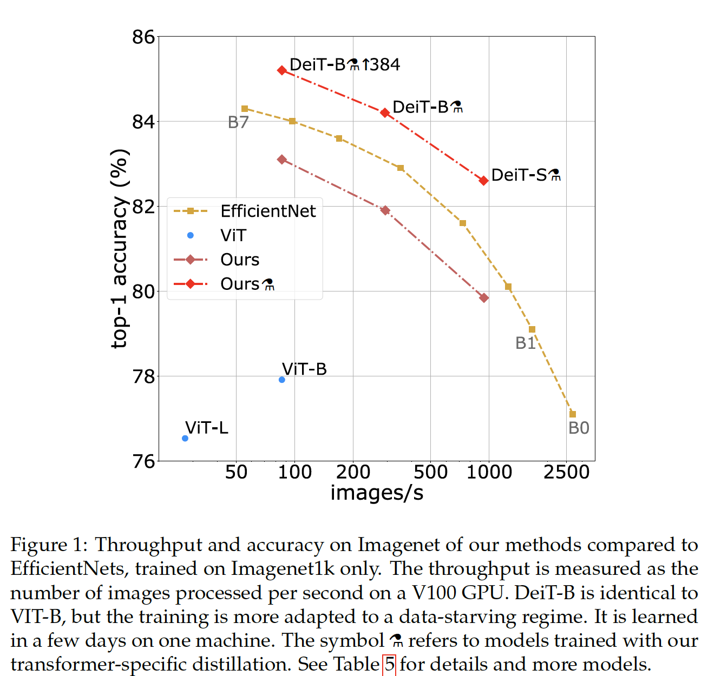

### 3    Vision transformer:  overview

​		注意机制基于具有$(key,value)$向量对的可训练联想记忆。使用内积将query向量$q \in \mathbb{R}^d$与一组$k$个key​向量（打包成矩阵$K \in \mathbb{R}^{k \times d}$）进行匹配。然后利用softmax缩放内积以及归一化以获得$k$个权重。注意力的输出为一组$k$个value向量（打包成$V \in \mathbb{R}^{k \times d}$）的加权和。对于$N$个查询向量序列（打包成$Q \in \mathbb{R}^{N \times d}$），它产生一个输出矩阵（大小为$N \times d$）：

$$\mbox{Attention}(Q,K,V) = \mbox{Softmax}(QK^\top/\sqrt{d})V,\tag{1}$$

其中将softmax函数用于输入矩阵的每一行，并且$\sqrt{d}$项提供合适的归一化。

​		[52]中，提出自注意力层。查询、键和值矩阵本身使用具有约束$k = N$线性变换$W_Q,W_K,W_V$从$N$个输入向量序列（打包到$X \in \mathbb{R}^{N\times D}$中）计算的：$Q = XW_Q$、$K = XW_K$、$V = XW_V$，其表示所有输入向量之间注意力。

​		最后，通过考虑$h$个注意力“头”定义多头自注意力层，即将$h$个自注意力函数用于输入。每个头提供大小为$N \times d$的序列。这些$h$序列被重新排列成一个 $N \times dh$ 序列，该序列被一个线性层重新投影到$N\times D$中。

**Transformer block for images**	为了获得如[52]中的完整transformer，我们在MSA层的顶部添加Fead-Forward Network（FFN）。该 FFN 由两个由 GeLu激活分隔的线性层组成 [23]。第一个线性层将维度从$D$扩展到$4D$，第二个层将维度从$4D$减小到$D$。由于跳跃连接和层归一化，MSA 和 FFN 都作为残差算子运行 [3]。

​		为了获得transformer来处理图像，我们的工作构建在ViT模型之上。它是一种简单而优雅的架构，可以将输入图像处理为一系列输入标记。将固定大小的RGB图像分解为固定的$16 \times 16$像素的$N$个补丁（$N = 14 \times 14$）。每个补丁都用一个线性层投影，该层保留了其整体尺寸 $3\times16\times16 = 768$。

​		上述的transformer块对于补丁嵌入的顺序是不变的，因此没有考虑它们的相对位置。位置信息被归纳为固定或可学习的位置嵌入。它们在第一个transformer块之前添加到补丁令牌中，然后被送入堆叠的transformer块中。

**The class token**是可学习的向量，附加到第一层之前的补丁标记上，通过transformer层，然后用线性层投影以预测类。这种类token继承自NLP，并且与计算机视觉中用于预测类别的典型池化层不同。因此，transformer处理维度为$D$的$(N+1)$个token的批次，其中仅类向量被用于预测输出。这种架构迫使自注意力在补丁token和类token之间传播信息：在训练时监督信号仅来自类嵌入，而补丁token是模型唯一的变量输入。

**Fixing the positional encoding across resolutions**	Touvron等[50]证明最好使用较低的训练分辨率并以较大的分辨率微调网络。这加快了完整的训练并提高了流行的数据增强方案下的准确性。当增加输入图像的分辨率时，我们保持补丁大小不变，因此输入补丁的数量$N$确实会发生变化。由于transformer块的架构和类token，模型和分类器不需要修改就能处理更多的token。相比之下，模型需要适应位置嵌入，因为它们有 N 个，每个补丁一个。 Dosovitskiy等[15] 在更改分辨率时插入位置编码，并证明该方法适用于随后的微调阶段。

### 4	Distillation through attention

​		本节中，我们假设我们有一个强图像分类器作为教师模型。它可以是convent或者混合分类器。我们处理如何利用这种教师学习transformer的问题。如我们将在第5节中看到的，通过比较准确率和图像吞吐两之间的平衡，用transformer替换卷积神经网络可能是有益的。本节涵盖蒸馏的两个轴：硬蒸馏与软蒸馏，以及经典蒸馏与蒸馏令牌。

**soft distillation**	[24、54]最小化教师模型的softmax和学生模型的softmax之间的Kullback-Leibler散度。

​		令$Z_t$为教师模型的logits，$Z_s$为学上模型的logits。令$\tau$表示蒸馏的温度（temperature），$\lambda$为ground-truth标签$y$上的KL散度损失和交叉熵损失，$\psi$表示softmax函数。蒸馏目标为

$$\mathcal{L}_{\mbox{global}} = (1 - \lambda)\mathcal{L}_{CE}(\psi(Z_2),y) + \lambda \tau^2 KL(\psi(Z_s/\tau),\psi(Z_t/\tau)).\tag{2}$$

**Hard-label distillation**	我们引入蒸馏的变体，其中我们采用教师的硬决策作为true label。令$y_t = \arg\max_cZ_t(c)$为教师的硬决策，与这个硬标签蒸馏相关的目标函数为：

$$\mathcal{L}_{global}^{hardDistill} = \frac{1}{2}\mathcal{L}_{CE}(\psi(Z_s),y)+\frac{1}{2}\mathcal{L}_{CE}(\psi(Z_s), y_t).\tag{3}$$

​		对于给定的图像，与教师相关的硬标签可能会根据特定的数据增强而改变。我们将看到这种选择比传统的方法更好，同时是免参数的，并且概念上更简单：教师预测$y_t$起着与true label $y$相同的角色。

​		还值得注意的是，硬标签也可以利用标签平滑转换为软标签，其中true label的概率为$1 - \varepsilon$，而余下的$\varepsilon$在余下的类上共享。在我们的使用true label的所有实验中，我们将这个参数固定为$\varepsilon = 0.1$。

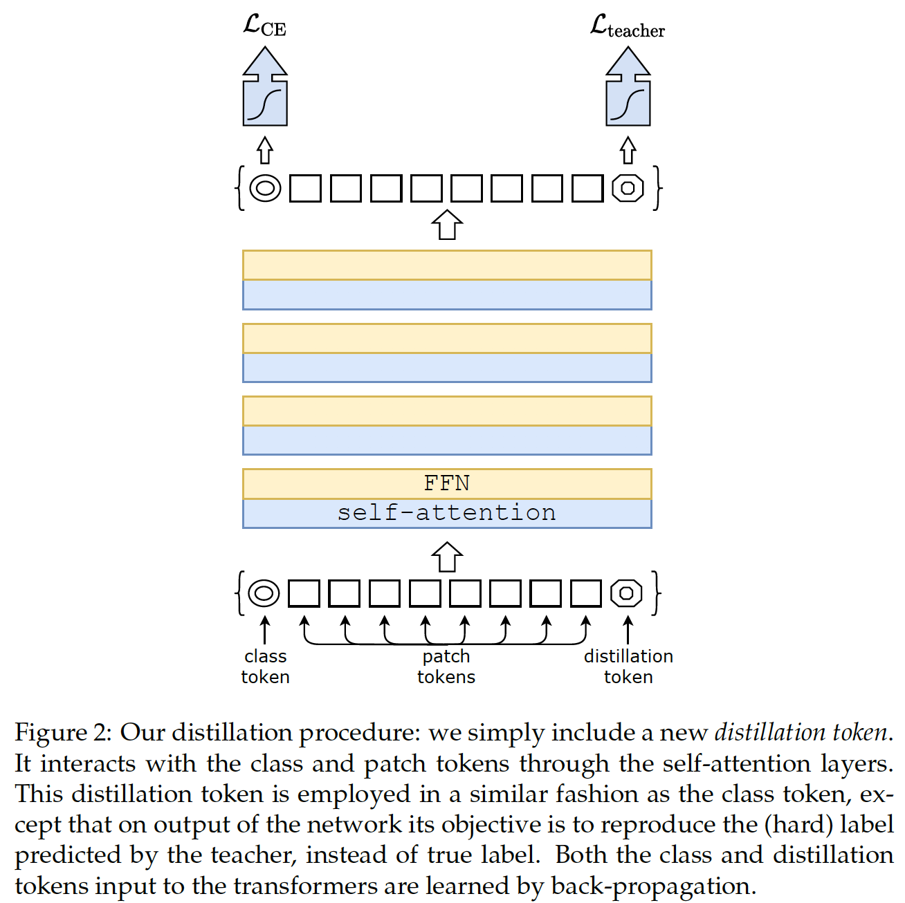

**Distillation token**	现在，我们聚焦我们的提议，其图2所示。我们添加新的token——distillation token——来初始化嵌入（补丁和类token）。我们的蒸馏令牌与类令牌的使用类似：它通过自注意力与其他嵌入进行交互，并在最后一层之后由网络输出。 它的目标由损失的蒸馏部分给出。蒸馏嵌入允许我们的模型从教师的输出学习，就像在常规蒸馏中一样，同时保持对类嵌入的补充。

​		有趣的是，我们观察到学习到的类和蒸馏令牌收敛到两个不同的向量：这些令牌之间的平均余弦相似性等于0.06。随着在每一层计算类和蒸馏嵌入，它们通过网络逐渐变得更加相似，一直到最后一层，它们的相似度很高（$\cos=0.93$），但仍然低于 1。这是意料之中的，因为它们旨在产生相似但不相同的目标。

​		与简单地添加与同一目标标签相关联的额外类令牌相比，我们验证了我们的蒸馏令牌向模型添加了一些东西：代替教师伪标签，我们试验了具有两个类令牌的transformer。即使我们随机且独立地初始化它们，训练期间它们会收敛到相同的向量（$\cos = 0.999$），并且也输出几乎相同的嵌入。这种额外的类令牌没有给分类性能带来任何东西。相比之下，我们的蒸馏策略提供的性能改进比普通的蒸馏基线更明显，如5.2节的实验验证的。

**Fine-tuning with distillation**	我们在更高分辨率的微调阶段使用true label和教师预测。我们使用相同目标分辨率的教师模型，通常通过 Touvron 等[50] 的方法从较低分辨率的教师那里获得。我们还仅使用真实标签进行了测试，但这会降低教师的收益并导致性能降低。

**Classification with our approach: joint classifiers**	在测试时，transformer产生的类或蒸馏嵌入都与线性分类器相关联，并且能够推断图像标签。然而，我们的参考方法是这两个独立头的后期融合，我们将两个分类器的 softmax 输出相加以进行预测。 我们在第 5 节中评估了这三个选项。

### 5	实验

#### 5.1	Transformer模型

​		本文的Transformer与Dosovitskiy等的完全相同，区别在于训练册了和蒸馏令牌。对于预训练，没有使用MLP头，而是仅使用线性分类器。将这个模型称为Deit。ViT-B（本文的DeiT-B）的参数固定为$D=768$、$h=12$和$d=D/h=64$。本文引入两种更小的模型，称为DeiT-S和DeiT-Ti，每个模型仅改变头的数量，并保持$d$固定。表1给出本文的模型。

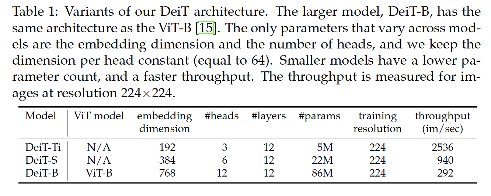

#### 5.2	蒸馏

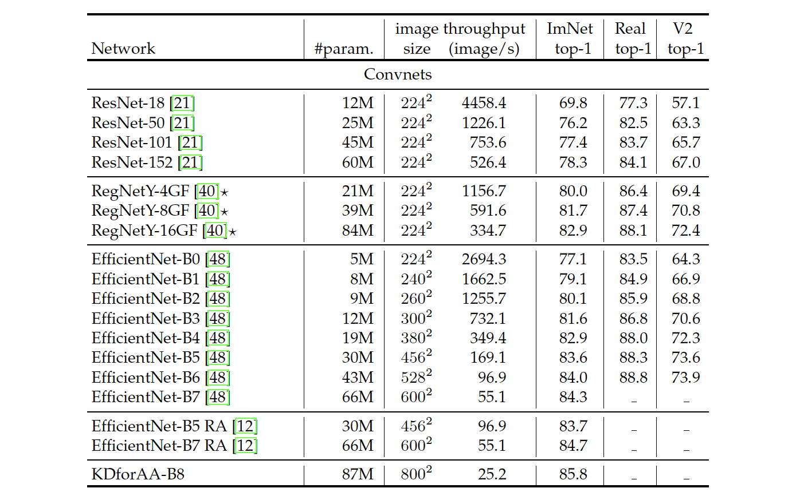

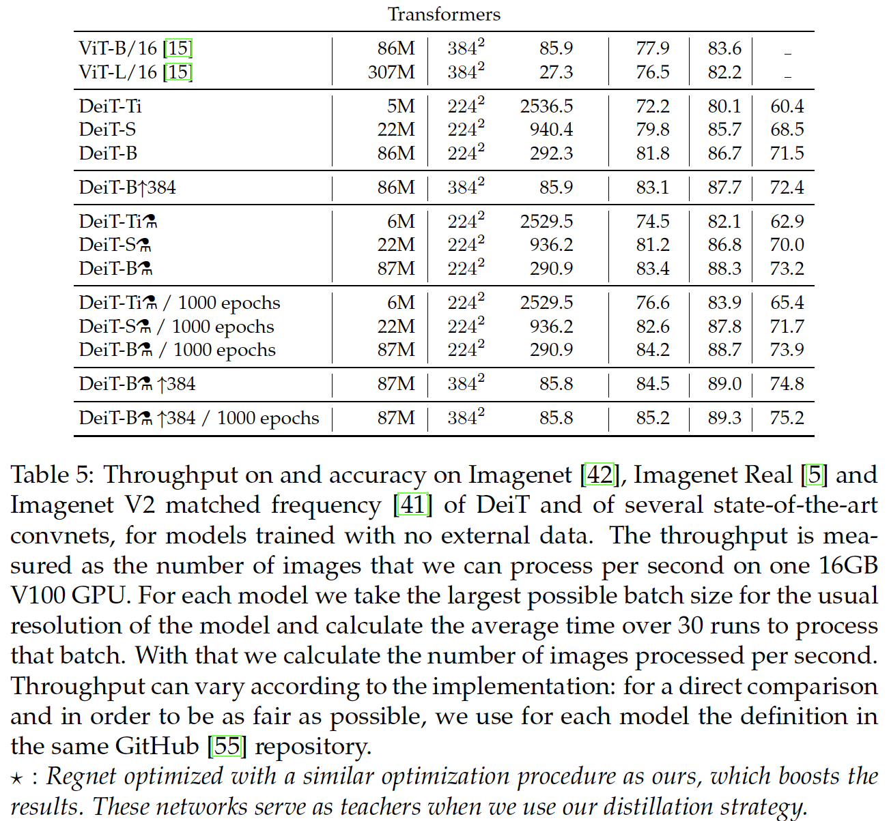

**Convnets teachers**	使用convnets教师的性能比使用transformer更好。表2比较不同教师架构的结果。

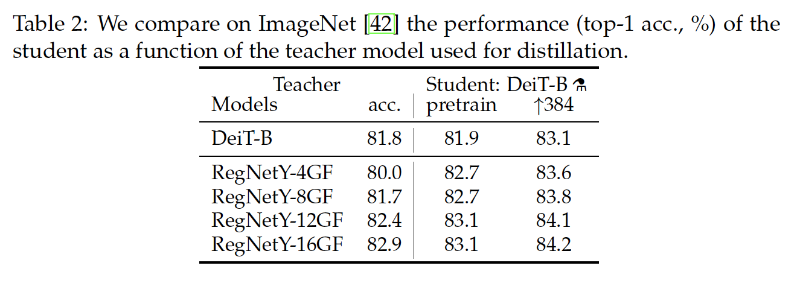

**蒸馏方法的比较**

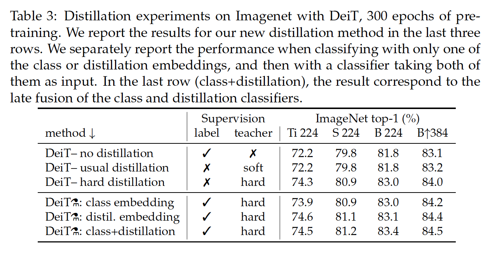

**Agreement with the teacher & inductive bias?**

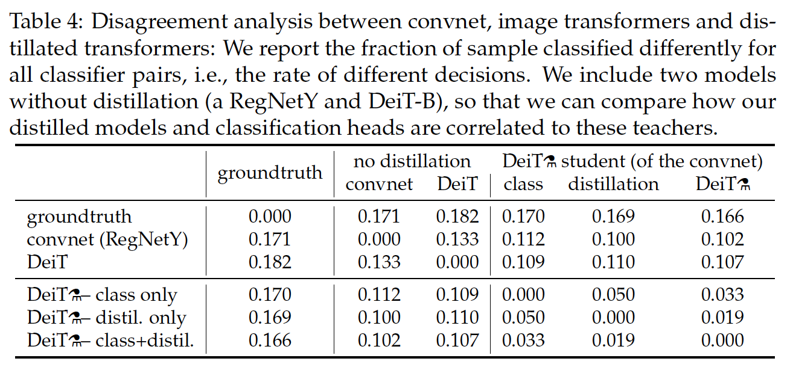

#### 5.3	Efficiency vs accuracy: a comparative study with convnets

### 6	训练细节&消融研究

**初始化和超参数**	Transformer对于初始化相对敏感。在测试基础实验中的几个选项后，它们中的一些没有收敛，我们遵循Hanin和Rolnick[20]，利用截断的标准分布初始化权重。

​		表9给默认情况使用的所有草参数。对于蒸馏，我们遵循Cho等[9]的推荐来选择参数$\tau$和$\lambda$。对于常用（soft）蒸馏，我们采用典型值$\tau = 3.0$和$\lambda =0.1$。

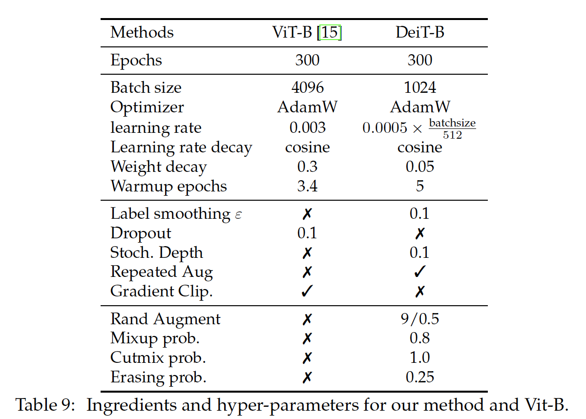

**数据增强**	与集成更多先验（例如卷积）的模型相比，transformer需要大量数据。因此，我们利用相同大小的数据训练transformer，我们依赖大量数据增强。我们评估几种强数据增强，目的是达到数据高效的训练制度。

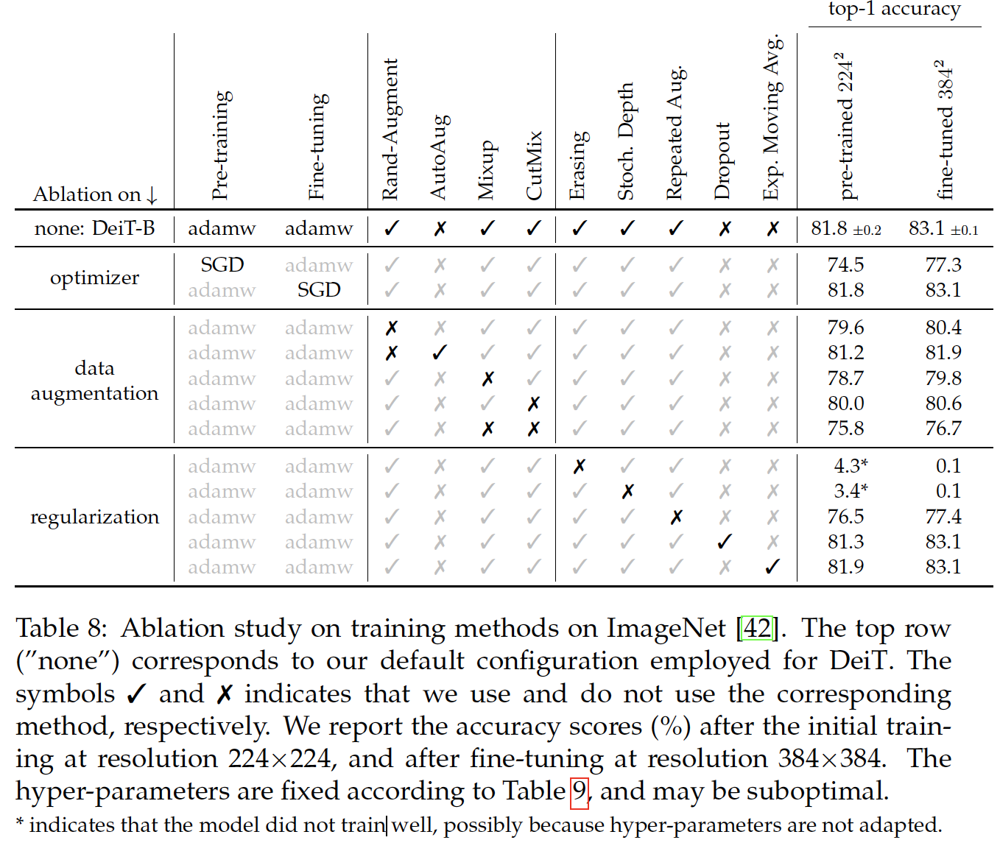

**正则化&优化器**	在交叉验证期间，我们尝试3中不同的学习率（$5\times10^{-4}$、$3\times10^{-4}$、$5\times10^{-5}$）和3中权重衰减（0.03、0.04、0.05）。我们batch-size缩放学习率：$\mbox{lr}_{\mbox{scaled}} = \frac{\mbox{lr}}{512} \times \mbox{batchsize}$。

**Exponential Moving Average**	使用EMA。

**不同分辨率上的微调**	与邻居相比，由于来自邻居的向量的双线性插值减少了它的“$l_2$-范数”。这些低范数向量不适合于训练的transformer，如果直接采用而没有任何形式的微调会明显降低性能。因此，在使用 AdamW [36] 或 SGD 微调网络之前，我们采用了近似保留向量范数的双三次插值。这些优化器在微调阶段具有相似的性能，请参见表 8。

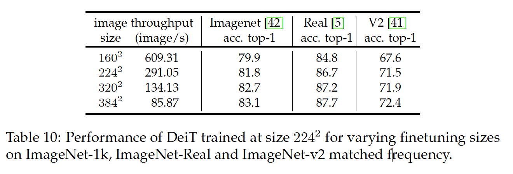

