## EfficientNetV2: Smaller Models and Faster Training

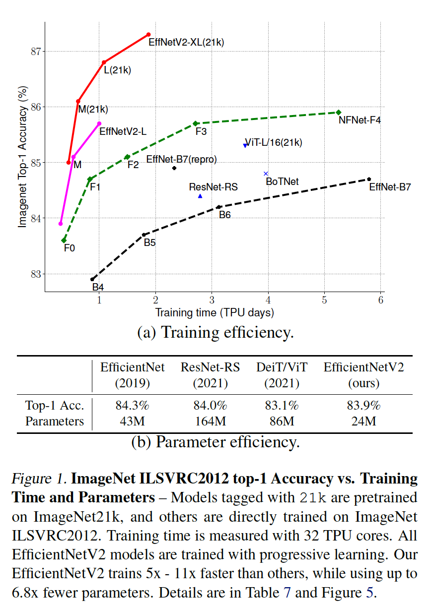

### 1. 引言

​		本文中，我们使用训练感知的神经架构搜索（NAS）和伸缩来提高训练速度和参数效率。鉴于 EfficientNets (Tan & Le, 2019a) 的参数效率，我们首先系统地研究 EfficientNets 中的训练瓶颈。我们的研究表明，在EfficientNets中：（1）训练非常大的图像很慢；（2）早期层中的深度卷积很慢；（3）每个阶段相同的缩放不是最优的。基于这些观察，我们设计利用额外操作（如Fused-Conv）丰富的搜索空间，并使用训练感知的NAS和伸缩来联合优化模型准确率、训练速度和参数大小。我们发现的网络（称为EfficientNetV2）训练速度比先前的模型快4倍（图3），同时参数量小6.8倍。

​		训练期间，我们可以同渐进地增加图像大小来进一步加速训练。许多先前工作（例如progressive resizing （Howard, 2018）、FixRes （Touvron等, 2019）和Mix&Match （Hoffer等, 2019））已在训练中使用更小的图像大小，但是它们通常为所有图像保持相同的正则化，这造成准确率的下降。我们认为为不同图像大小保持相同的正则化是不理想的：对于相同的网络，小图像大小导致小的网络容量，因此需要弱正则化；反之，大图像大小需要更强的正则化来防止过拟合。基于这些见解，我们**提出一种称为_progressive learning_的改进方法：在早期训练epoch中，我利用小图像大小和弱正则化（如dropout和数据增强）训练网络，然后逐渐增加图像大小，并添加更强正则化**。基于渐进式调整大小 (Howard, 2018)，但通过动态调整正则化，我们的方法可以加快训练速度，而不会导致准确率下降。

​		利用改进的渐进学习，EfficientNetV2在ImageNet、CIFAR-10、CIFAR-100、Cars和Flower数据集上获得强结果。在ImageNet上，我们获得85.7%的top-1准确率，同时训练快了3-9倍，比先前的模型小6.8倍（图1）。EfficientNetV2和渐进学习也使在更大的数据集上训练模型更简单。例如，ImageNet21K比ImageNet ILSVRC2012大约10倍，但是EfficientNetV2EfficientNetV2 可以使用 32 个 TPUv3 内核的中等计算资源在两天内完成训练。通过ImageNet21K上的预训练，EfficientNetV2在ImageNet ILSVR2012上获得87.3%的top-1准确率，比最近提出的ViT-L/16好2.0%，同时训练快5-11倍。

​		我们的贡献如下：

- 我们介绍了 EfficientNetV2，这是一个新的更小、更快的模型系列。 通过我们的训练感知 NAS 和伸缩发现，EfficientNetV2 在训练速度和参数效率方面都优于以前的模型。
- 我们提出了一种改进的渐进学习方法，该方法可以根据图像大小自适应地调整正则化。 我们证明它可以加快训练速度，同时提高准确性。
- 与现有技术相比，我们在 ImageNet、CIFAR、Cars 和 Flowers 数据集上表现出了快 11 倍的训练速度和高达 6.8 倍的参数效率。

### 3. EfficientNetV2 Architecture Design

#### 3.1. Review of EfficientNet

​		EfficientNet (Tan & Le, 2019a) 是一系列针对 FLOP 和参数效率进行了优化的模型。它利用NAS来搜索基线EfficientNet-B0，其在准确率和FLOPs上更好的平衡。然后，利用复合伸缩策略来放大基线模型以获得一系列模型B1-B7。虽然最近的工作声称在训练或推理速度方面取得了巨大进步，但它们在参数和 FLOP 效率方面通常比 EfficientNet 差（表 1）。 在本文中，我们的目标是在保持参数效率的同时提高训练速度。

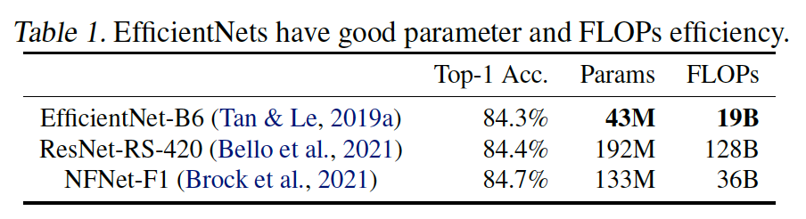

#### 3.2. Understanding Training Efficiency

​		我们研究 EfficientNet (Tan & Le, 2019a) 的训练瓶颈，以下也称为 EfficientNetV1，以及一些提高训练速度的简单技术。

**Training with very large image sizes is slow：**如前面工作指出的，EfficientNet的大型图像大小导致显著的内存使用。由于GPU/TPU的总内存是固定的，我们不得不利用更小的批大小来训练这些模型，其急剧减慢了训练。一种简单的改进是使用FixRes，其使用比推理更小的图像大小训练。如表2所示，更小的图像大小产生更少的计算，并确保大批量，因此将训练速度提高2.2倍。值得注意的是，如（Touvron等2020；Brock等2021）指出的，使用更小的图像进行训练也产生略好的准确率。但与（Tourvon等2019）不同，在训练后，没有微调任何层。

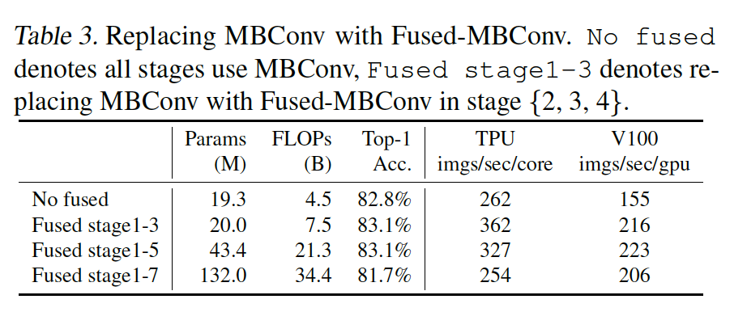

​		在第 4 节中，我们将探索一种更高级的训练方法，通过在训练期间逐步调整图像大小和正则化。

**Depthwise convolutions are slow in early layers：**EfficientNet的另一训练瓶颈来自大量的深度卷积。深度卷积有更少参数和FLOP，但是它们通常没有充分利用现代加速器。最近，Fused-MBConv 在 (Gupta & Tan 2019) 中提出，后来在 (Gupta & Akin 2020、Xiong 等2020、Li 等2021) 中使用，以更好地利用移动或服务器加速器。它利用单个常规conv3x3替换MBConv中的深度conv3x3和扩展conv1x2，如图2所示。为了系统比较这两个构建块，我们逐渐将 EfficientNetB4 中的原始 MBConv 替换为 Fused-MBConv（表 3）。当在早期的1-3阶段中使用Fused-MBConv，Fused-MBConv可以利用参数和FLOP上的小型开销来提高训练速度，但是如果利用Fused-MBConv替换所有块，那么它会显著增加参数量和FLOP，同时也建模训练。找到这两个构建块 MBConv 和 Fused-MBConv 的正确组合非常重要，这促使我们利用神经架构搜索来自动搜索最佳组合。

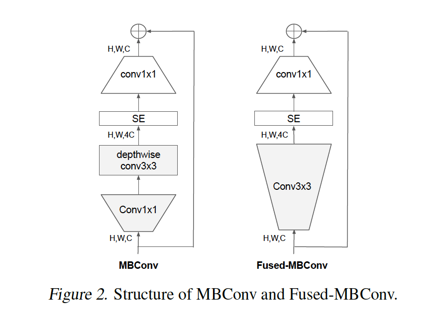

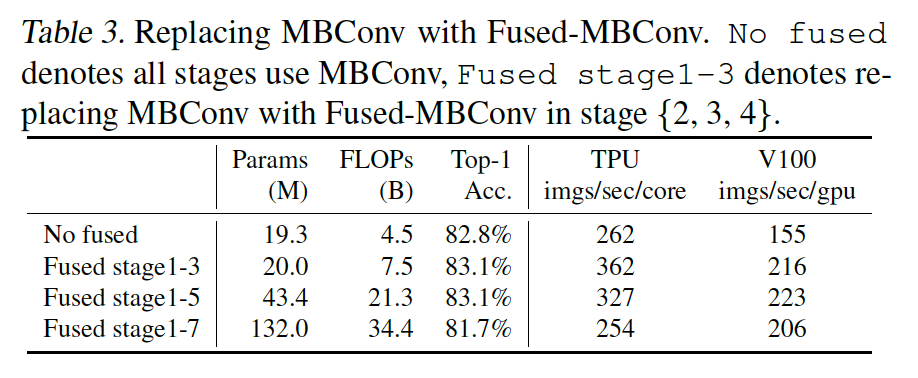

**Equally scaling up every stage is sub-optimal：**EfficientNet 使用简单的复合缩放规则同等地扩展所有阶段。例如，当深度系数为2时，网络中的所有阶段都会将层的数量加倍。但是，这种阶段对训练速度和参数效率的贡献不是相同的。本文中，我们将使用非均匀的伸缩策略来向后面的阶段添加更多层。此外，EfficientNets 积极扩大图像大小，导致大量内存消耗和缓慢训练。 为了解决这个问题，我们稍微修改了缩放规则并将最大图像尺寸限制为较小的值。

#### 3.3. Training-Aware NAS and Scaling

​		为此，我们已经学习了多种设计选择来提高训练速度。 为了寻找这些选择的最佳组合，我们现在提出了一个具有训练感知的 NAS。

**NAS Search：**我们的训练感知 NAS 框架主要基于之前的 NAS 工作（Tan等2019；Tan & Le 2019a），但旨在共同优化现代加速器的准确率、参数效率和训练效率。具体而言，我使用EfficientNets作为骨干。我们的搜索空间是一个类似于 (Tan等2019) 的基于阶段的分解空间，它的设计空间包括卷积运算类型 {MBConv、Fused-MBConv}、层数、核大小{3x3、5x5}、扩展率{1、4、5}。另一方面，通过如下方式见效搜索空间：（1）移除不必要的搜索选项，例如pooling skip ops，因为它们在原始的EfficientNets中没有使用；（2）重复使用相同的通道大小，因为它们在（Tan & Le 2019a）中已搜索到。因为搜索空间更小，我们可以应用强化学习 (Tan等2019) 或简单地在规模与 EfficientNetB4 相当的更大的网络上进行随机搜索。具体而言，我们采样1000个模型，并使用见效的图像大小训练每个模型10个epoch。我们的搜索奖励来自模型的准确率$A$、归一化训练设置时间$S$和参数大小$P$，使用简单的加权乘法$A \cdot S^w \cdot P^v$，其中$w = -0.07$和$V=-0.05$为超参数，其根据经验设置。

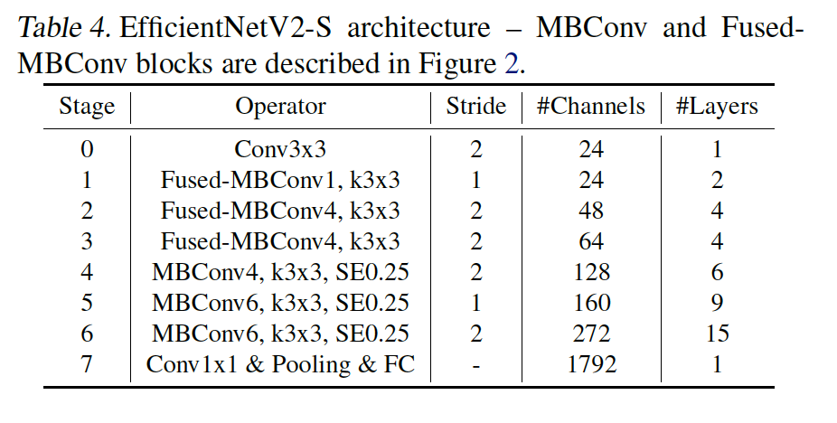

**EfficientNetV2 Architecture：**表4给出搜索到的模型EfficientNetV2-S的架构。与EfficientNet相比，有几个主要区别：（1）第一个区别是 EfficientNetV2 在早期层中广泛使用 MBConv（Sandler 等2018 ；Tan & Le 2019a）和新添加的Fused-MBConv（Gupta 和 Tan，2019 年）。（2）EfficientNetV2 更喜欢 MBConv 的较小扩展率，因为较小的扩展率往往具有较少的内存访问开销。（3）EfficientNetV2 更喜欢较小的 3x3 核大小，但它增加了更多层以补偿较小核大小导致的感受野减少。（4）EfficientNetV2完全删除了原始EfficientNet最后的stride-1阶段，或许是由于它的大参数量和内存访问开销。

**EfficientNetV2 Scaling：**我们使用与 (Tan & Le, 2019a) 类似的复合缩放来扩展 EfficientNetV2-S 以获得 EfficientNetV2-M/L，并进行了一些额外的优化：（1）将最大推理图像大小设置为480，因为非常大的图像通常导致昂贵的内存和训练速度开销；（2）作为启发式方法，我们还逐渐添加更多层到后面的极端（例如表4中的阶段4和阶段5）以增加网络的容量，而不添加太多的运行时开销。

**训练速度比较：**见图3。

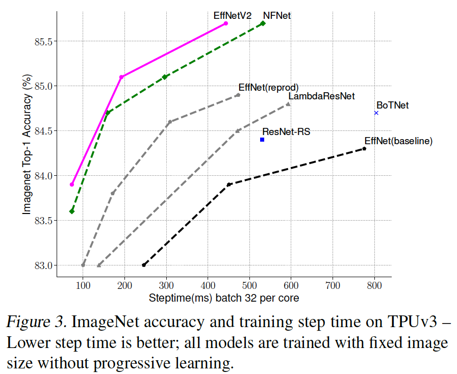

### 4. Progressive Learning

#### 4.1. Motivation

​		如第3节讨论的，图像大小子在训练上起着重要作用。除了FixRes外，许多其他工作在训练期间动态改变图像大小，但是它们通常引起准确率下降。

​		我们假设准确率下降来自不平衡的正则化：当利用不同图像大小训练时，我们也应相应调整正则化强度（而不是使用与前面工作相同的固定正则化强度）。事实上，大型模型需要更强的正则化来克服过拟合是常识：例如，EfficientNet-B7使用比B0更大的dropout和更强的数据增强。本文中，我们认为即使对于相同的网络，较小的图像尺寸导致较小的网络容量，因此需要较弱的正则化；反之，较大的图像大小导致更多的计算和更大的容量，并且因此更容易过拟合。

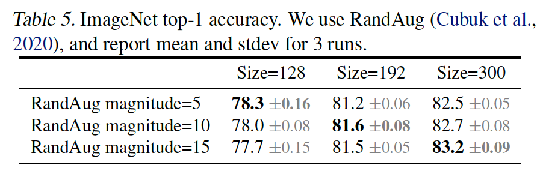

​		为了验证我们的假设，我们利用不同的图像大小和数据增强训练从搜索空间采样的模型（表5）。当图像大小很小时，利用弱数据增强可以获得最佳准确率；但是对于更大的图像，更强的数据增强表现更好。这种见解促使我们在训练期间自适应地调整正则化和图像大小，从而改进了渐进式学习方法。

#### 4.2. Progressive Learning with adaptive Regularization

​		图4展示了我们的改进渐进学习的训练过程：在早期训练epoch中，我们利用更小的图像和弱正则化训练网络，使得网络可以轻松而快速地学习简单的表示。然后，我们逐渐增加图像大小，同时添加更强的正则化使学习更困难。我们的方法建立在 (Howard, 2018) 的基础上，它逐渐改变图像大小，但在这里我们也自适应地调整正则化。

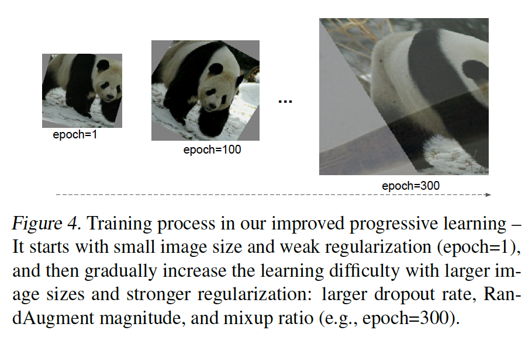

​		形式上，假设整个训练有$N$步，目标图像大小为$S_e$，以及一组正则化强度$\Phi_e = \{\phi_e^k\}$，其中$k$表示一种正则化类型，例如 dropout rate 或 mixup rate 值。我们将训练氛围$M$个阶段，对于每个阶段$1 \le i \le M$，利用图像大小$S_i$和正则化强度$\Phi_i = \{\phi_i^k\}$训练模型。最后阶段$M$会使用目标图像大小$S_e$和正则化$\Phi_e$。为了简化，我们启发式地选择初始图像大小$S_0$和正则化$\Phi_0$，然后使用线性插值来确定每个阶段的值。算法1总结过这个过程。在每个阶段的开始，网络会继承前一阶段的所有权重。与Transformer不同，整个权重（例如位置嵌入）可能依赖输入长度，ConvNet的权重与图像大小是独立的，并因此可以轻松地继承。

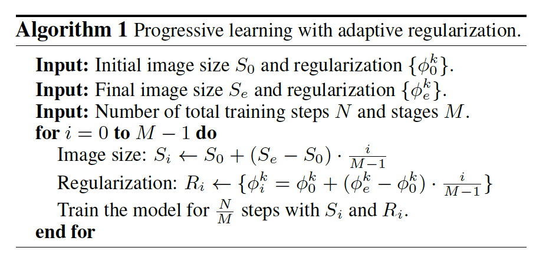

​		改建的渐进学习通常能兼容已有的正则化。为了简化，本文主要研究如下三种类型的正则化：

- **Dropout**：网络级正则化，其通过随机丢弃通道来减少co-adaption。我们将调整dropout rate $\gamma$。
- **RandAugment**：每张图像的数据增强，具有可调整的magnitude $\epsilon$。
- **Mixup**：跨图像数据增强。给丁标签为$(x_i,y_i)$和$(x_j,y_j)$的两张图像，它们利用mixup ratio $\lambda$组合两张图像：$\tilde{x}_i = \lambda x_j + (1 -\lambda)x_i$和$\tilde{y}_i = \lambda y_j + (1 - \lambda)y_i$。训练期间会调整mixup ratio $\lambda$.

### 5. 主要结果

#### 5.1. ImageNet ILSVRC2012

**设置**	在架构搜索或超参数调整期间，我们从训练集中保留25000张图像（大约2%）作为minival进行准确率评估。还使用minival进行early stopping。ImageNet训练设置主要遵循EfficientNets：decay为0.9和momentum为0.9的RMSProp优化器；batch norm momentum为0.99；权重衰减为1e-5。每个模型训练350epoch，总batch size为4096。学习率首先从0预热到0.256，然后每2.4epoch乘以0.97。我们使用0.9999衰减率的指数滑动平均、RandAugment、Mixup和0.8存活概率的随机深度。

​		对于渐进学习，我们将训练过程划分为四个阶段，每个阶段大约87个epoch：早期阶段使用具有弱正则化的小图像大小，而后面阶段使用具有更强正则化的更大图像大小，如算法1描述。表6展示了图像大小和正则化的最小（对于第一个阶段）和最大（对于最后阶段）图像大小和正则化值。为了简化，所有模型使用相同的最小大小和正则化值，但是它们采用不同的最大值，模型越大，一般需要更大的正则化来克服过拟合。遵循（Touvron等2012），训练期间，我们的最大图像大小比推理小大约20%，但是我们在训练后没有微调任何层。

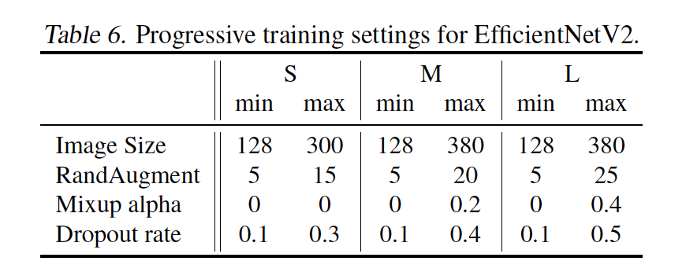

**结果** 见表7。

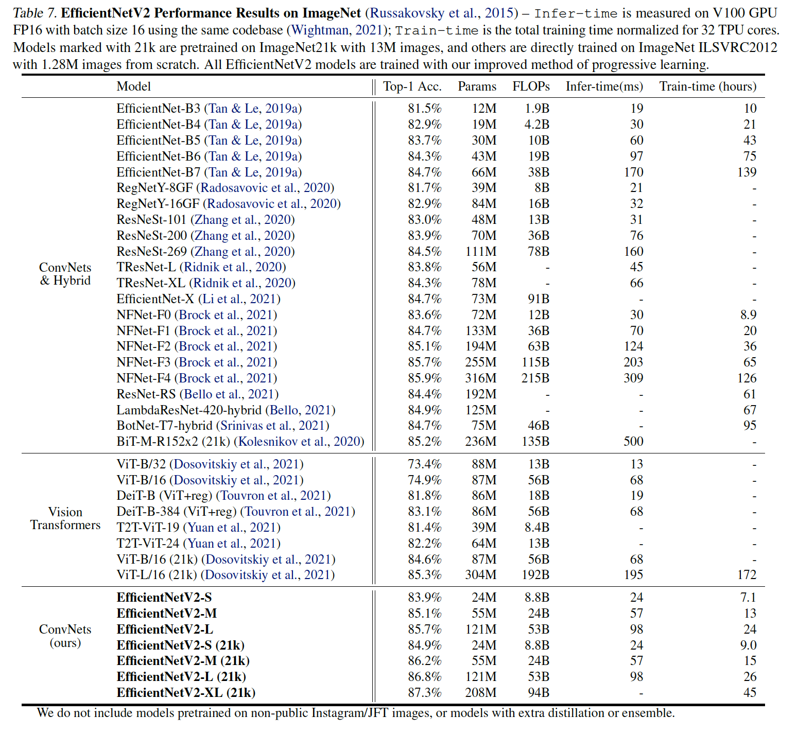

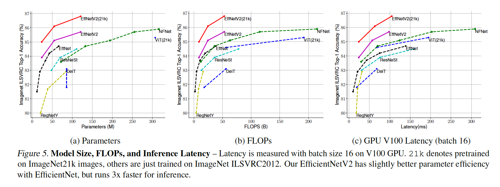

#### 5.2. ImageNet21k

**设置：**ImageNet21k包含大约13M属于21841个类的训练图像。原始ImageNet21k没有train/eval划分，所以我们随机选择100000张图像作为验证集，并使用余下的图像作为训练集。我们主要重复使用与ImageNet ILSVRC2012相同的训练设置，并且做出少量变化：（1）将训练epoch改为60或30以减小训练时间，并使用可以适应不同步骤而无需额外调整的余弦学习率衰减；（2）因为每个张图像有多个标签，在计算 softmax 损失之前，我们将标签归一化为总和为 1。 在 ImageNet21k 上预训练后，每个模型在 ILSVRC2012 上使用余弦学习率衰减微调 15 个epoch。

**结果：**见表7。

​		我们强调几个有趣的观察：

- _在高精度情况下，扩大数据规模比简单地扩大模型规模更有效：_当top-1准确率超过85%时，由于严重的过拟合，很难利用简单的增加模型大小来进一步提高准确率。但是，额外的ImageNet21K预训练可以显著提高准确率。
- _在 ImageNet21k 上进行预训练可能非常有效_。尽管ImageNet21k有超过10倍的数据，我们的训练方法确保我们使用32张TPU cores在两天内完成EfficientNetV2的预训练（而ViT需要数周）。这比在 ImageNet 上训练更大的模型更有效。 我们建议未来对大规模模型的研究使用公共 ImageNet21k 作为默认数据集。

#### 5.3. Transfer Learning Datasets

**设置：**	在四种迁移学习数据集：CIFAR-10、CIFAR-100、Flowers和Cars上评估我们的模型。表9包括这种数据集的统计。

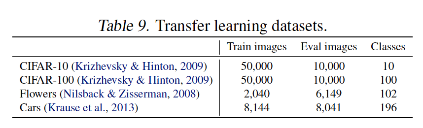

对于这个实验，我们使用ImageNet ILSVRC2012上训练的检查点。为了公平比较，没有使用ImageNet21k。我们的微调设置与 ImageNet 训练大致相同，但有一些类似于（Dosovitskiy 等2021 年；Touvron 等2021 年）的修改：我们使用更小的批大小512，具有余弦衰减的更小初始学习率0.001。对于所有数据集，我们固定训练1000步。由于每个模型都通过很少的步骤进行微调，因此我们禁用了权重衰减并使用了简单的cutout数据增强。

**结果：**见表8。

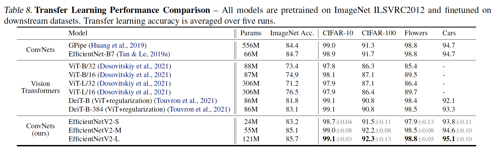

### 6. 消融研究

#### 6.1. 与EfficientNet的比较

​		本节中，我们在相同训练和推理设置下比较EfficientNetV2（简称V2）和EfficientNets（简称V1）。

**相同训练的性能：**表10展示使用相同的渐进学习设置的性能比较。

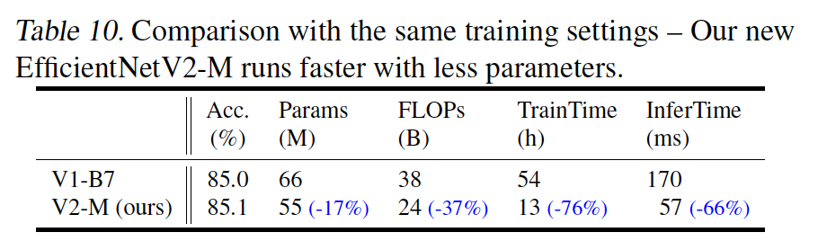

**Scaling Down：**前一节主要关注大规模模型。这里，我们通过使用与 EfficientNet 类似的复合缩放系数缩小我们的 EfficientNetV2-S 来比较较小的模型。为了便于比较，所有模型都在没有渐进式学习的情况下进行训练。 与这些小型 EfficientNets (V1) 相比，我们新的 EfficientNetV2 模型通常更快，同时保持可比的参数效率。

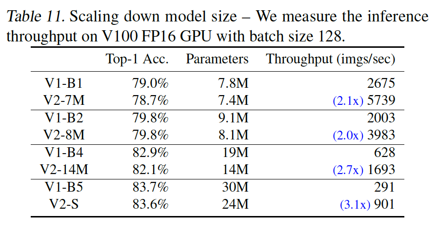

#### 6.2. Progressive Learning for Different Networks

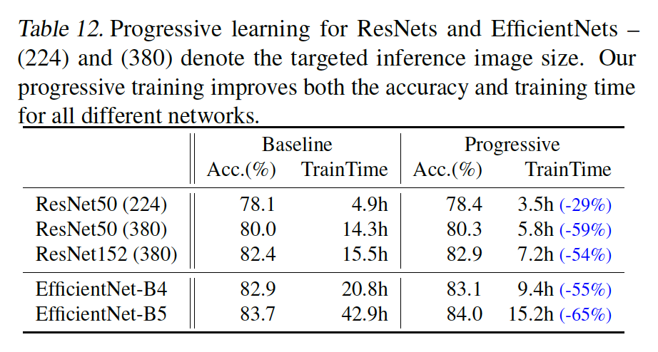

#### 6.3. Importance of Adaptive Regularization

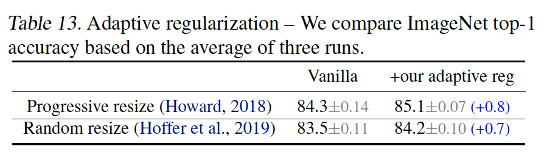

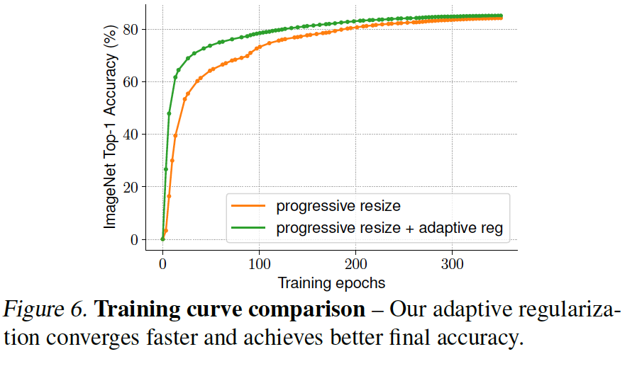