## GhostNet: More Features from Cheap Operations

### 摘要

 		由于有限的内存和计算资源，在嵌入式设备上部署CNN是困难的。特征图上的冗余是这些成功CNN的一个重要特点，但是很少在神经架构设计中得到研究。本文提出一种新颖的Ghost模块来从便宜的操作（cheap operations）中生成更多特征图。基于一组固有的特征图，我们使用一系列便宜成本（cheap cost）的线性变换来生成许多ghost特征图，这些特征图可以完整反映固有特征潜在的信息。所提出的Ghost模块可以作为即插即用的组件来更新已有的卷积神经网络。设计Ghost块以堆叠成Ghost模块，然后建立轻量化的GhostNet。在基准测试上的实验证明，所提出的Ghost模块是基准模型中卷积层的令人印象深刻的替代方案，在ImageNet ILSVRC-2012分类数据集上，我们的GhostNet以相似的计算成本获得比MobileNetV3更高的识别性能（例如75.7%的top-1准确率）。代码见https://github.com/iamhankai/ghostnet。

### 1. 引言

​		深度卷积神经网络在各种计算机视觉任务（例如图像识别[27、12]、目标检测[42、30]和语义分割[36、3]）上均表现出出色的性能。传统的CNN通常需要大量参数和FLOP来获得令人满意的准确率，例如ResNet-50有大约25.6M参数，并需要4.1BFLOP来处理大小为$224\times224$的图像。因此，深度神经网络设计的最近趋势是探索移动设备（例如智能电话和自动驾驶汽车）上可接受性能的便携式高效网络架构。

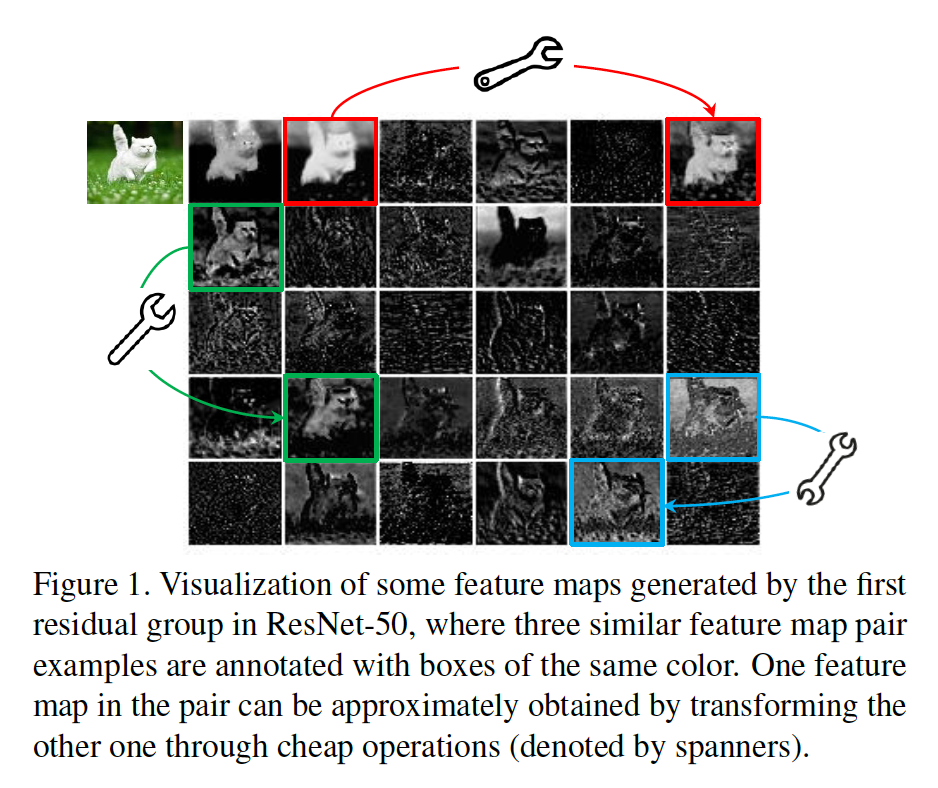

​		过去几年，已提出一系列方法来研究紧凑深度神经网络（例如网络裁剪、低bit量化、知识蒸馏等）。Han等[10]提出裁剪神经网络中不重要的权重。[28]利用$l_1$范数正则化来为高效CNN裁剪滤波器。[40]将权重和激活量化为1-bit数据，从而获得高压缩和加速比。[15]引入知识蒸馏将知识从更大的模型迁移到更小的模型。但是，这些方法的性能通常受到作为其基准的预训练深度神经网络的上限。

​		除了它们之外，高效神经架构有非常高的潜力建立具有更少参数和计算的高效深度网络，并且最近已取得相当大的成功。这类方法还可以给自动搜索方法[58、41]提供新的搜索单元。例如，MobileNet[17、44、16]利用depthwise和pointwise卷积来构建一个单元，其用较大的滤波器近似原始卷积层，并获得相当的性能。ShuffleNet[57、38]进一步利用通道混淆操作来增强轻量化模型的性能。

​		训练好的深度神经网络的特征图中的大量甚至冗余信息通常可以保证对输入数据的全面理解。例如，图1介绍了ResNet-50生成的输入图像的一些特征图，并且存在许多相似的特征图对，例如彼此重影（ghost）。特征图中的冗余可能是成功的深度神经网络的重要特征。与其避免使用冗余的特征图，我们以节省成本的方式来使用这些特征图。

​		本文中，我们引入一种新颖的Ghost模块，以通过使用更少的参数生成更多的特征。具体而言，将深度神经网络的中普通卷积划分为两个部分。第一个部分包含普通卷积，但是它的总数被严格控制。给定来自第一部分的固有特征图，然后使用一系列简单的线性操作来生成更多特征图。在没有改变特征图的大小的情况下，与普通卷积神经网络的参数相比，这个Ghost模块中的整体需要的参数量和计算复杂度已经减少了。基于Ghost模块，我们建立一种高效的神经架构，即GhostNet。我们首先替换基准神经架构中的原始卷积层以证明Ghost模块的有效性，然后在几个基准视觉数据集上验证GhostNet的优越性。实验结果表明，所提出的Ghost模块能够减小通用卷积层的计算成本，同时维持相似的识别性能，并且GhostNet可以比诸如MobileNetV3好，并且在移动设备上进行快速推理。

### 2. 相关工作

​		这里，我们在两个方面回顾已有的轻量化神经网络的方法：模型压缩和紧凑模型设计。

#### 2.1. 模型压缩

​		对于给定的神经网络，模型压缩旨在减小计算量、功效和存储成本。裁剪连接[11、10、49]裁剪掉神经元之间的不重要连接。通道修剪[50、14、28、37、55、19、32]的目标还在于删除无用的通道，以便在实践中更轻松地进行加速。模型量化[40、20、22]利用离散值表示神经网络中的权重或激活以进行压缩和计算加速。具体而言，仅有1-bit的二值化方法[20、40、35]可以通过高效的二值操作极大地加速模型。张量压缩[23、25、7]通过利用权重的冗余和低秩特性来减小参数或计算。知识蒸馏[15、43]利用更多的模型来指导更小的模型，其提高更小模型的性能。这些模型的性能通常依赖给定的预训练模型。基本操作和架构的改进将使它们走得更远。

#### 2.2. 紧凑模型设计

​		由于需要在嵌入式设备上部署神经网络，因此近年来提出了一系列紧凑模型[9、5、17、44、16、57、38、52、53、46]。SqueezNet[9]使用瓶颈方法以少50被参数的代价来获得AlexNet级别的准确率。Xception [5]利用深度卷积运算来更有效地使用模型参数。MobileNets [17]是一系列基于深度可分离卷积的轻型深度神经网络。 MobileNetV2 [44]提出了反向残差块，而MobileNetV3 [16]进一步利用AutoML技术以更少的FLOP实现了更好的性能。ShuffleNet [57]引入了通道混洗操作，以改善通道组之间的信息流交换。 ShuffleNetV2 [38]进一步考虑了目标硬件在紧凑模型设计中的实际速度。 尽管这些模型仅用很少的FLOP即可获得出色的性能，但从未充分利用特征图之间的相关性和冗余性。

### 3. 方法

​		在本节中，我们将首先介绍Ghost模块，以利用一些小的滤波器从原始卷积层生成更多的特征图，然后开发具有高效架构和高性能的新GhostNet。

#### 3.1. 更多特征的Ghost模块

​		深度卷积神经网络[27、45、12]通常包含大量卷积，其产生巨大计算成本。尽管最难的如MobileNet和ShuffleNet的工作已引入深度卷积或混洗操作以使用更小的卷积滤波器（浮点操作）构建高效的CNN，但是余下的$1\times1$卷积层仍占据相当大的内存和FLOP。

​		鉴于如图1所示，主流CNN计算出的中间特征图中存在广泛的冗余，我们提出减少所需的资源，即用于生成它们的卷积滤波器。实践中，给定输入数据$X \in \mathbb{R}^{c \times h \times w}$，其中$c$为输入通达的数量，$h$和$w$分别为输入数据的高和宽，产生$n$个特征图的任意卷积层的操作可以形式化为：

$$Y = X \ast f + b, \tag{1}$$

其中$\ast$为卷积操作，$b$为偏置项，$Y \in \mathbb{R}^{h' \times w' \times n}$为$n$个通道的输出特征图，$f \in \mathbb{R}^{c \times k \times k \times n}$为这一层中的卷积滤波器。此外，$h'$和$w'$为输出数据的高和宽，$k \times k$为卷积滤波器$f$的核大小。这个卷积操作，需要FLOP的数量可以计算为$n \cdot h' \cdot w' \cdot c \cdot k \cdot k$，由于滤波器的数量$n$核通道数量$c$通常非常大（例如256或512），FLOP也是成千上万的。

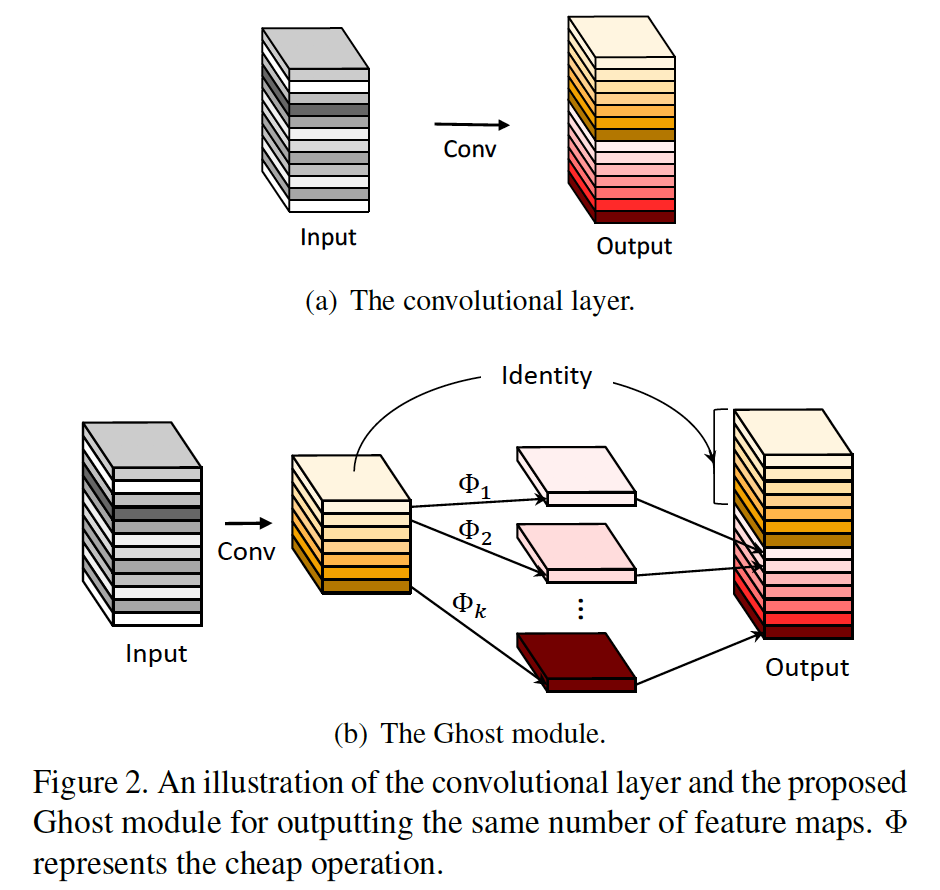

​		根据式（1），要优化的参数数量（以$f$和$b$表示）由输入和输出特征图的尺寸明确确定。如图1中的观察，卷积层的输出特征图通常包含非常多的冗余，并且它们中的一些可能是相互间相似的。我们指出，不必利用大量FLOP和参数一一生成这样的冗余特征图。假设输出特征图是少数具有某些廉价变换的固有特征图的“Ghost”。这些固有特征图通常具有较小的尺寸，并由普通的卷积滤波器生成。具体而言，使用主卷积生成$m$个固有特征图$Y' \in \mathbb{R}^{h' \times w' \times m}$：

$$Y' = X \ast f', \tag{2}$$

其中$f' \in \mathbb{R}^{c \times k \times k \times m}$为使用的滤波器，$m \le n$，并且为了简便，省略偏置项。诸如滤波器大小、步长、填充等的草参数与普通卷积（式（1））中的相同，从而保持输出特征图的空间大小（即$h'$和$w'$）一致。为了进一步获得期望的$n$个特征图，根据如下函数，我们提出在$Y'$中的固有特征上使用一系列便宜的线性操作来生成$s$个ghost：

$$y_{ij} = \Phi_{i,j}(y_i'), \forall i = 1, \cdots, m, j=1,\cdots, s,\tag{3}$$

其中$y_i'$为$Y'$中第$i$个固有特征图，$\Phi_{i,j}$为生成第$j$个ghost特征图$y_{ij}$的第$j$个（最后一个除外）线性操作，也就是说$y_i'$可以有一个活多个ghost特征图$\{y_{ij}\}_{j=1}^s$。最后一个$\Phi_{i,s}$是维持固有特征图的恒等影视，如图2（b）所示。利用式（3），我们可以获得$n=m\cdot s$个特征图$Y = [y_{11}, y_{12}, \cdots, y_{ms}]$作为Ghost模块的输出数据，如图2（b）所示。值得注意的是，线性操作$\Phi$在计算成本远低于普通卷积的每个通道上运行。事实上，Ghost模块中有几种不同线性操作，例如$3 \times 3$和$5 \times 5$线性核，其在实验部分分析。

**与已有方法的区别**	所提出的Ghost模块与已有的高效卷积方案有几个主要差异：i）与[17、9、57]中广泛使用的$1 \times 1$点卷积的单元相比，Ghost模块中的主卷积可以有自定义的核大小。ii）已有的方法采用点卷积来跨通道处理特征，然后利用深度卷积处理空间信息。相比之下，Ghost模块首先采用普通卷积来生成一些固有特征图，然后增加通道。iii）在先前的有效架构中，处理每个特征图的操作仅限于深度卷积或移位操作[17、57、52、24]，而Ghost模块中的线性操作可能具有较大的多样性。iv）此外，Ghost模块中恒等映射与线性变换并行以维持固有的特征图。

**复杂度分析**	由于我们可以利用式（3）中提出的Ghost模块生成与普通卷积层相同数量的特征图，我们可以轻松地将Ghost模块集成到已有的完善设计的神经将中意减小计算成本。这里，我们通过使用Ghost模块进一步分析了内存使用和理论上的加速方面的收益。例如，有1个恒等映射和$m \cdot (s - 1) = \frac{n}{s}\cdot(s-1)$个线性操作，并且每个线性操作的平均核大小等于$d \times d$。理想上，$n \cdot (s - 1)$个线性操作可以有不同形状和参数，但是考虑到CPU或GPU卡的实用性，将无法进行在线推断。因此，为了高效实现，我们建议在一个Ghost模块中采用大小相同（例如$3\times3$或$5\times5$）的线性操作。使用Ghost模块升级普通卷积的理论加速比为

$$\begin{align}r_s &= \frac{n \cdot h' \cdot w' \cdot c \cdot k \cdot k}{\frac{n}{s}\cdot h' \cdot w' \cdot c \cdot k \cdot k + (s-1) \cdot \frac{n}{s}\cdot h' \cdot w' \cdot d \cdot d}\\&= \frac{c \cdot k \cdot k}{\frac{1}{s} \cdot c \cdot k\cdot k + \frac{s-1}{s} \cdot d \cdot d}\\&\approx \frac{s \cdot c}{s + c - 1} \approx s.\end{align}\tag{4}$$

其中$d \times d$与$k \times d$相似的程度，并且$s \ll c$。相似地，压缩比可以计算为

$$r_c = \frac{n \cdot c \cdot k \cdot k}{\frac{n}{s} \cdot c \cdot k \cdot k + \frac{s-1}{s} \cdot d \cdot d} \approx \frac{s \cdot c}{s + c - 1} \approx s.\tag{5}$$

其等于使用建议的Ghost模块的加速比。

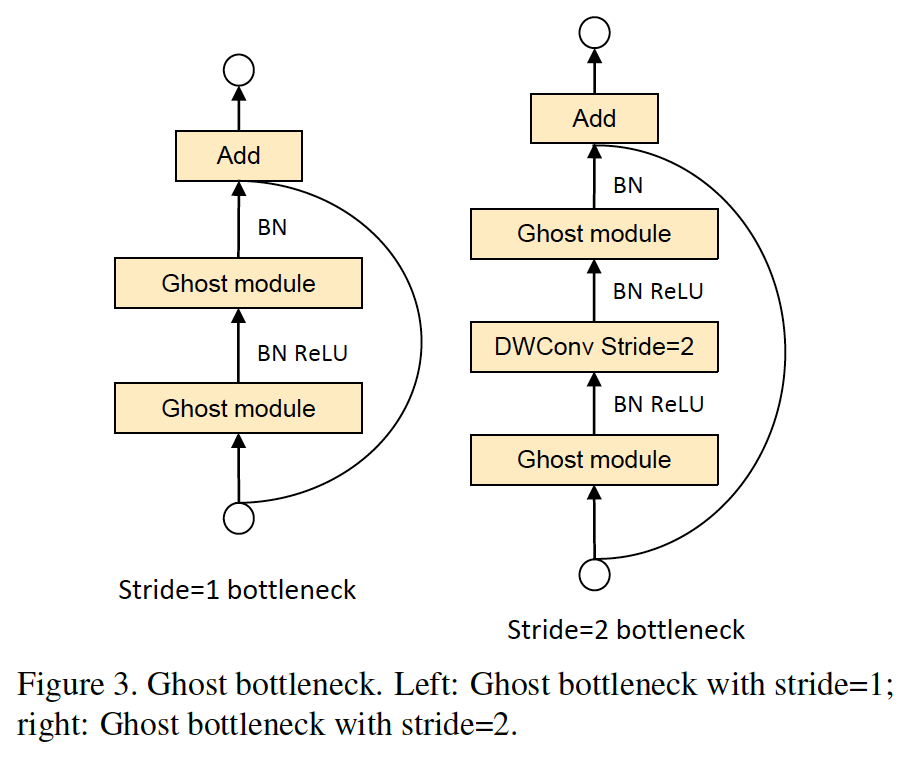

#### 3.2. 构建高效的CNN

**Ghost Bottlenecks**	利用Ghost模块，我们引入专门用于小型CNN的Ghost瓶颈（Ghost Bottlenecks：G-bneck）。如图3所示，Ghost瓶颈块与ResNet中使用的基本残差块相似。所提出的ghost瓶颈主要包含两个堆叠的Ghost模块。第一个Ghost模块作为增加通道数的扩张层。我们将输出通道数和输入通道数之间的比例称为_expansion ratio_。第二个Ghost模块减小通道数量以匹配shortcut路径。然后，连接这两个Ghost模块之间的输入和输出。在每层之后使用BN和ReLU，但是在第二个Ghost模块之后没有使用ReLU，这与MobileNetV2建议的相同。上述的Ghost模块的步长为1。至于步长为2的情况，通过下采样层实现快捷路径，并在两个Ghost模块之间插入步长为2的深度卷积。实践中，为了效率，Ghost模块中的主卷积为点卷积。

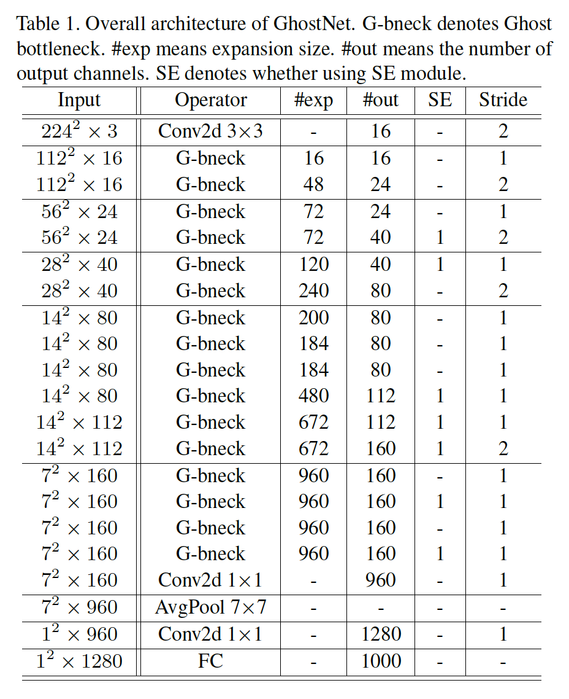

**GhostNet**	在ghost瓶颈的基础之上，我们提出GhostNet，如表1所示。我们遵循MobileNetV3的基本架构[16]的优势，并用我们的Ghost瓶颈替换MobileNetV3中的瓶颈块。GhostNet主要包含具有Ghost模块堆叠的Ghost瓶颈作为构建块。第一层为包含16个滤波器的标准卷积层，然后一系列逐渐增加通道数的Ghost瓶颈。所有Ghost瓶颈都以stride=1进行应用，除了每个阶段的最后一个是stride=2之外。最后，使用全局平均池化和卷积层来将特征图变换为1280维特征向量以进行最终的分类。在一些Ghost瓶颈中也使用squeeze和excite（SE）模块，如表1所示。与MobileNetV3相比，我们没使用hard-swish函数，这是因为hard-swish延迟高。尽管进一步的超参数调整或基于自动架构搜索的Ghost模块将进一步提高性能，但所提供的架构提供了参考的基本设计。

**Width Multiplier**	尽管表7中给定的架构已经可以提供低延迟并保证准确率，但是在某些情况下，我们可能需要在特定任务上使用更小和更快的模型或更高的准确率。为了根据期望的需求定制网络，我们可以简单地在每一层统一将通道数乘以系数$\alpha$。这个因子$\alpha$称为_width multiplier_，因为它可以改变整个网络的宽度。宽度乘数可以通过大约$\alpha^2$二次方控制模型大小和计算成本。通常，更小的$\alpha$产生更低的延迟和更低性能，反之亦然。

### 4. 实验

**数据集和设置**	为了验证提出的Ghost模块和GhostNet架构的有效性，我们在几种视觉数据集上进行实验，包括CIFAR-10、ImageNet ILSVRC 2012数据集和MCOCO目标检测基准测试。

​		利用CIFAR-10数据集分析提出的方法的特性，该数据集包含60000张$32 \times 32$的彩色图像，共有10个类，其中50000张训练图像和10000张测试图像。常用的数据增强方案包括随机裁剪和水平翻转。ImageNet是包含超过1.2M训练图像和50K验证图像的大规模图像数据集，有1000个类。常用数据预处理策略包括随机裁剪和翻转。我们还在MS COCO数据集上进行目标检测实验。

#### 4.1. Ghost模块的效率

##### 4.1.1	Toy Experiments

​		我们在图1中展示了一个图，以指出存在一些相似的特征图对，可以使用一些有效的线性运算来有效地生成这些特征图对。这里，我们首先进行toy实验来观察原始特征图和生成的ghost特征之间的重建误差。以图1的三对（即红、绿和蓝）为例，使用ResNet-50的第一个残差块提取特征。以左边的特征图作为输入，其他特征作为输出，我们使用小型的深度卷积滤波器来学习映射，即它们之间的线性操作$\Phi$。卷积滤波器的大小$d$从1到7，不同$d$的每个对的MSE（mean squared error）值如表2所示。

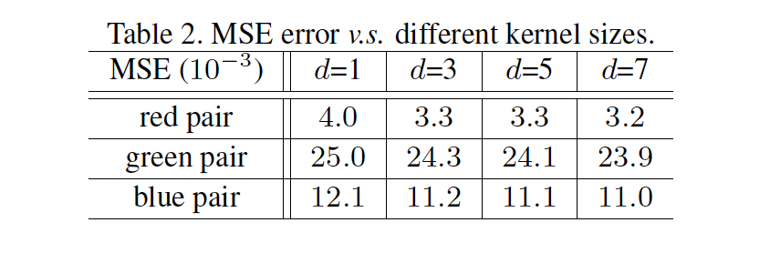

​		在表2中可以发现所有的MSE值都极小，这表明深度神经网络中的特征图之间有强相关，并且这些冗余的特征图可以有几个具有特征图生成。除了上述实验使用的卷积外，我们还可以利用一些其他低成本线性操作来构建Ghost模块，例如仿射变换和小波变换。但是，卷积是当前硬件已经很好支持的一种有效操作，它可以覆盖许多广泛使用的线性操作，例如平滑、模糊、运动等。此外，尽管我们还可以学习相应线性操作$\Phi$的每个滤波器的大小，但是不规则模块会降低计算单元（例如CPU和GPU）的效率。因此，我们建议令Ghost模块中的$d$为固定值，并在以下实验中，利用深度卷积来实现等式3，以构建高效的深度神经网络。

##### 4.1.2	CIFAR-10

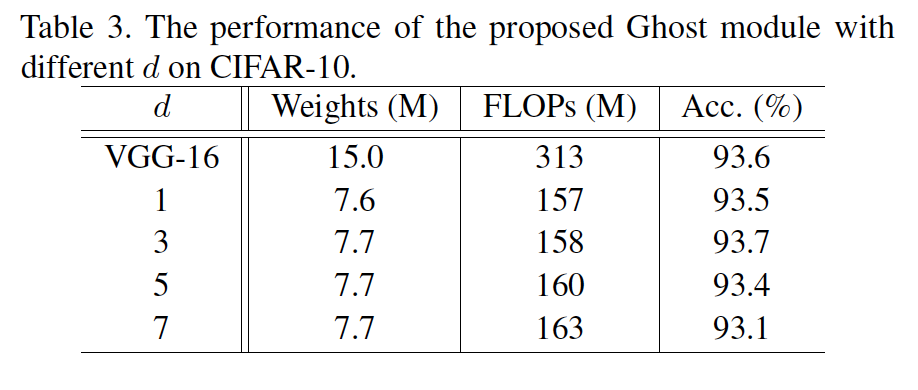

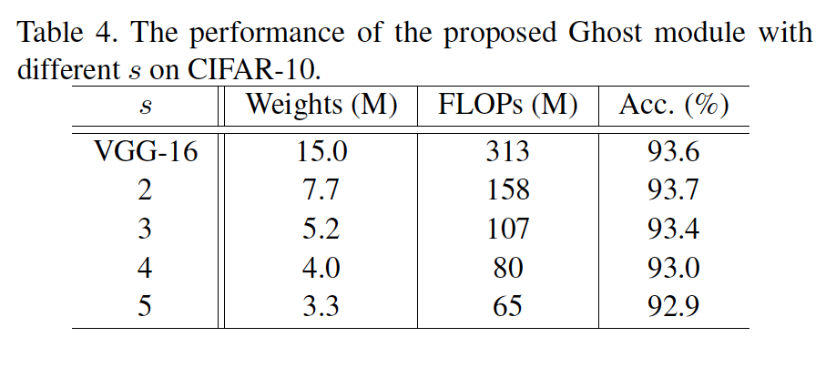

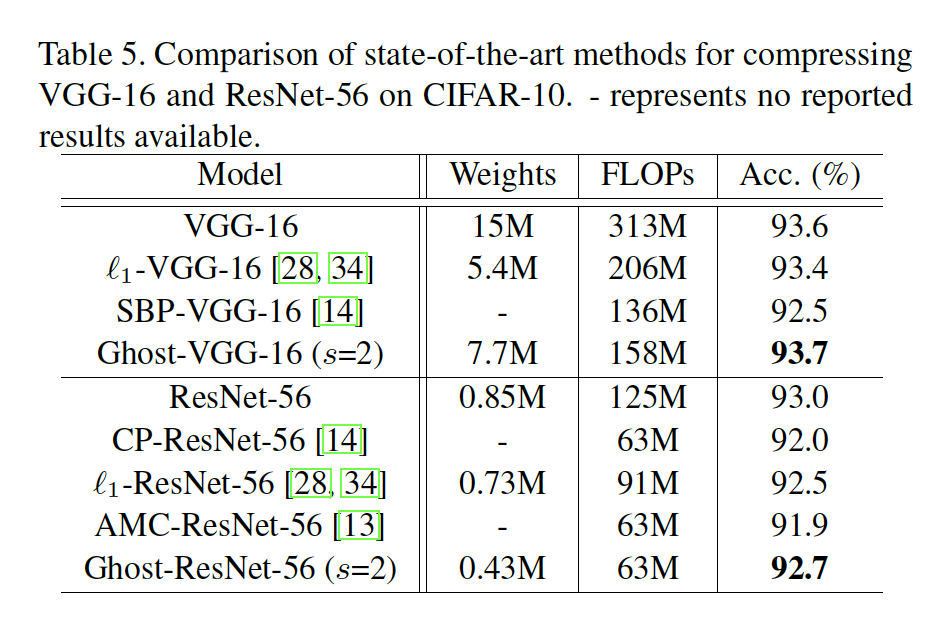

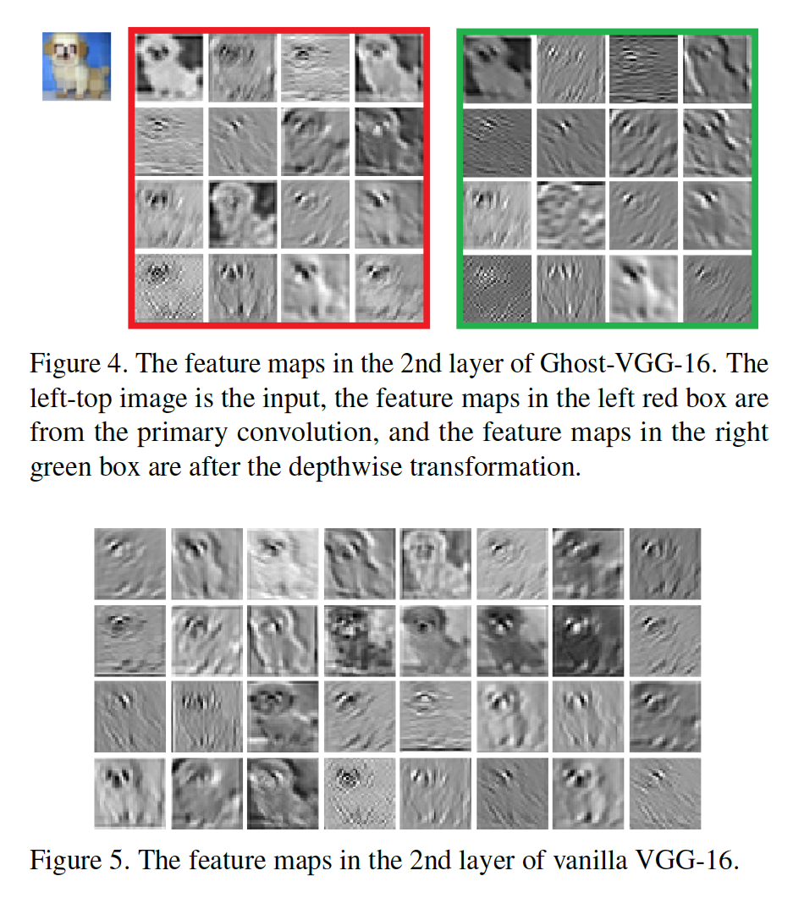

##### 4.1.3	ImageNet上的大模型

​		接下来，我们将Ghost模块嵌入到标准的ResNet-50，并在大规模ImageNet数据集上进行实验。ResNet-50有大约25.6M参数和4.1B FLOP，并且top-5误差为7.8%。我们使用我们的模块来替换ResNet-50中的所有卷积层以获得紧凑模型，并且将它与SOTA模型比较，细节见表6。诸如优化器、学习率和批大小的训练设置完全与[12]中使用的相同。

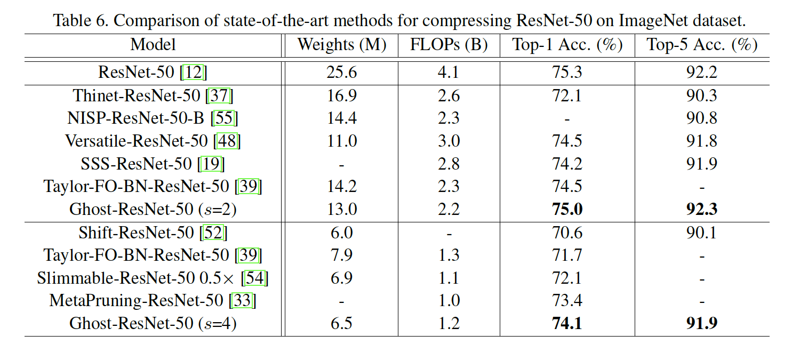

​		根据表6的结果，我们可以看出Ghost-ResNet-50（$s=2$）获得大约两倍的加速和压缩比，同时保持与原始ResNet-50相同的准确率。与最近的SOTA方法（包括Thinet、NISP、Versatile滤波器和Sparse structure selection（SSS））相比，我们的方法在2倍加速设置下获得明显更好的性能。当我们进一步将$s$增加到4时，基于Ghost的模型仅丢失0.3%的准确率，但却获得4倍计算加速比。相比之下，具有相似权重或FLOP的比较方法[52、54]的性能要比我们的低得多。

#### 4.2. GhostNet on Visual Benchmarks

##### 4.2.1	ImageNet Classification

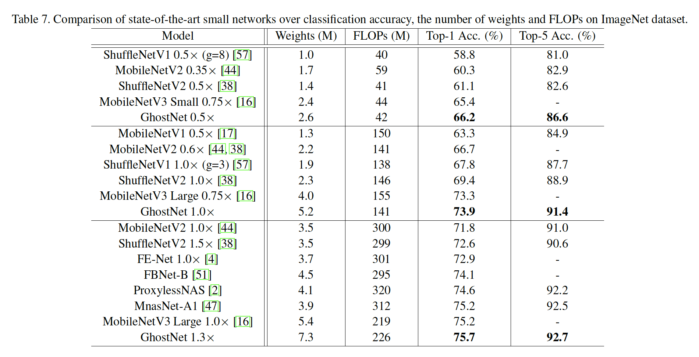

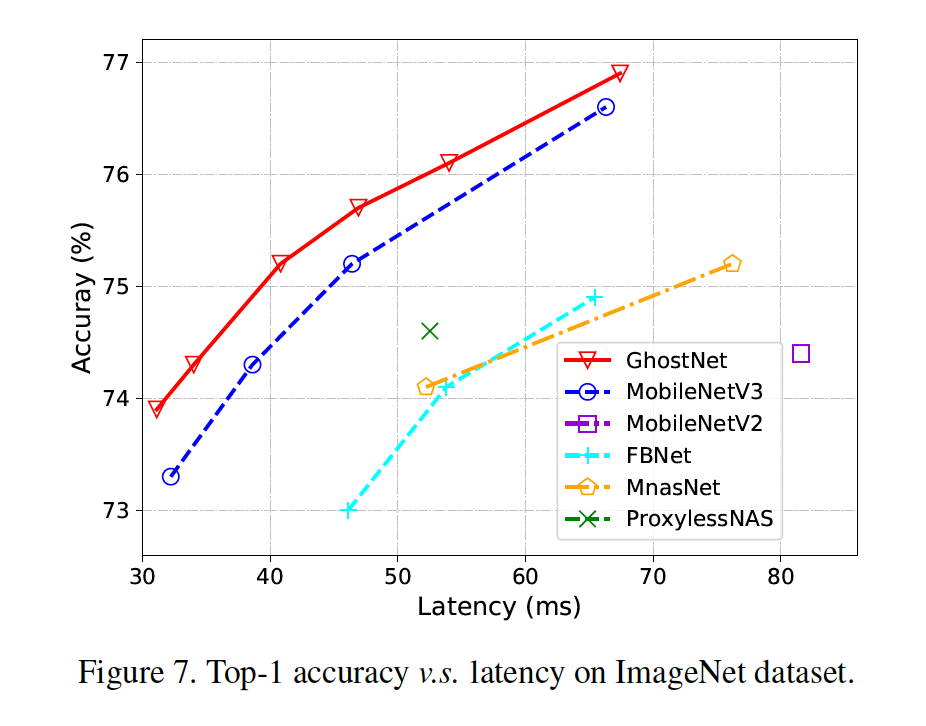

##### 4.2.2	Object Detection

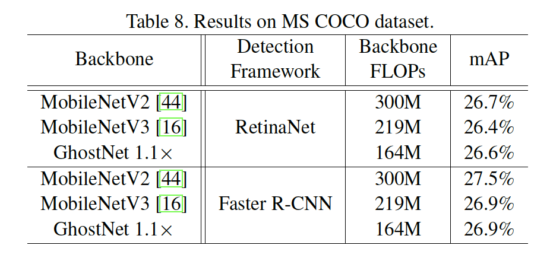