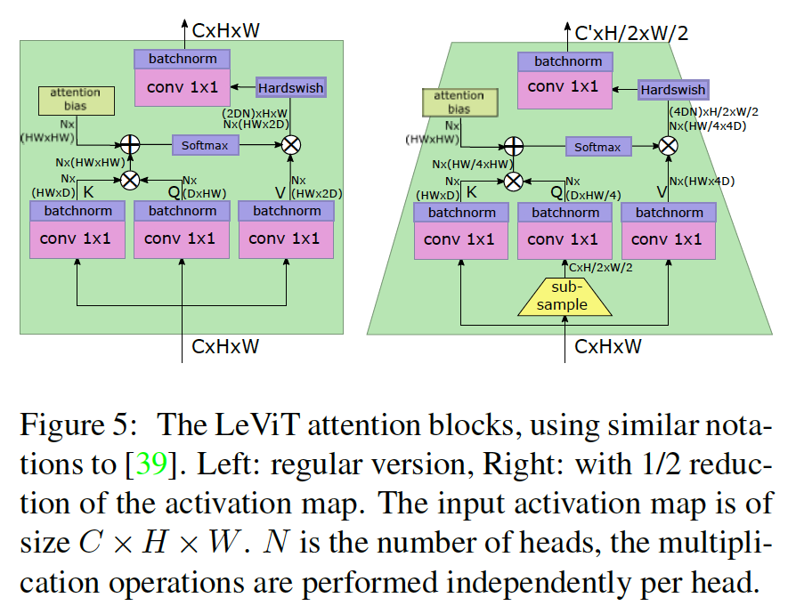

## LeViT: a Vision Transformer in ConvNet’s Clothing for Faster Inference

### 1	引言

​		本文中，我们探索设计空间以在中小型架构领域提供比 ViT/DeiT 模型更好的权衡。我们对优化性能-精度权衡特别感兴趣，例如图1中描述的 Imagenet-1k-val [5] 的吞吐量（图像/秒）性能。

​		虽然许多工作 [6, 7, 8, 9, 10] 旨在减少分类器和特征提取器的内存占用，推理速度同样重要，高吞吐量对应更好的能源效率。在这项工作中，我们的目标是开发一个基于 Vision Transformer 的模型系列，在 GPU、常规 Intel CPU 和移动设备中常见的 ARM 硬件等高度并行架构上具有更好的推理速度。我们的解决方案重新引入了卷积组件，而不是学习类卷积特征的transformer组件。特别地，我们用具有池化的金字塔替换了 Transformer 的统一结构，类似于 LeNet [11] 架构。 因此我们称之为LeViT。

​		对于给定的计算复杂度，transformer 比卷积架构更快的原因是令人信服的。大多数硬件加速器（GPU、TPU）都经过优化以执行大型矩阵乘法。在transformer中，注意力和MLP块主要依赖这些操作。相比之下，卷积需要复杂的数据访问模式，因此它们的操作通常受 IO 限制。 这些考虑对于我们探索速度/精度权衡很重要。

**贡献**	本文的贡献是允许 ViT 模型在宽度和空间分辨率方面缩小的技术：

- 多阶段transformer架构使用注意力作为下采样机制；
- 一个计算效率高的贴片描述符，它减少了第一层中的特征数量；
- 一种学习的、每头平移不变的注意力偏置，取代了 ViT 的位置嵌入；
- 重新设计的 Attention-MLP 模块，可提高给定计算时间的网络容量。

### 3    动机

​		在本节中，我们将讨论 Transformer patch 投影层的类似卷积行为。 然后，我们在标准卷积架构 (ResNet-50) 上对Transformer (DeiT-S) 进行“嫁接（grafting）实验”。 该分析得出的结论将激励我们在第 4 节中进行后续设计选择。

#### 3.1	Convolution in the ViT architecture

​		ViT的贴片提取器是步长为16的$16 \times 16$卷积。此外，贴片提取器的输出乘以学习到的权重以构成第一个自注意力层的$q$、$k$和$v$嵌入，所以我们可以认为这些也是输入的卷积函数。这也是 DeiT [3] 和 PVT [48] 等变体的情况。图2中，我们可视化DeiT注意力权重的第一层，按注意力头分解。这比 Dosovitskiy 等 [2]描述的主成分更直接。人们可以观察到卷积架构固有的典型模式：注意力头专注于特定模式（低频颜色/高频灰度），这些模式类似于 Gabor 滤波器。

​		在卷积掩膜显著重叠的卷积中，掩膜的空间平滑来自重叠：相邻像素接受大致相同的梯度。对于ViT卷积，没有重叠。平滑掩膜很可能是由数据增强引起的：当一个图像出现两次时，稍微平移，相同的梯度通过每个过滤器，因此它学习这种空间平滑度。

​		因此，尽管transformer架构中没有“归纳偏置”，但训练确实产生了类似于传统卷积层的滤波器。

#### 3.2	Preliminary experiment：grafting

​		ViT 图像分类器 [2] 的作者尝试在传统 ResNet-50 之上堆叠transformer层。在这种情况下，ResNet作为transformer层的特征提提取器，并且梯度可以反向传过两个网络。但是，在他们的实验中，transformer层的数量固定（例如ViT-Base为12层）。

​		在这一小节中，我们研究在相似计算负担下混合transformer和卷积网络的潜力：我们探讨了在改变卷积阶段数和变换器层数时获得的平衡。 我们的目标是在控制运行时间的同时评估卷积和transformer混合的变化。

**Grafting**	嫁接结合了 ResNet-50 和 DeiT-Small。 这两个网络具有相似的运行时间。

​		我们裁剪了 ResNet-50 的upper stage，同样减少了 DeiT 层的数量（同时保持相同数量的transformer和 MLP 块）。由于裁剪后的 ResNet 产生比 DieT 消耗的$14\times14$激活更大的激活图，我们在它们之间引入了一个池化层。在初步实验中，我们发现平均池化效果最好。在卷积层和transformer层堆叠之间的接口处引入了位置嵌入和分类标记。 对于 ResNet-50 阶段，我们使用 ReLU 激活单元 [52] 和批量归一化 [53]。

**结果**	表1给出了结果。

### 4	Model

#### 4.1	LeViT的设计原则

​		LeViT 建立在 ViT [2] 架构和 DieT [3] 训练方法之上。我们整合了已被证明对卷积架构有用的组件。第一步是得到可兼容的表示。不考虑分类嵌入的作用，ViT 是处理激活图的层堆叠。确切地说，中间“token”嵌入可以看作传统的FCN架构（$BCHW$格式）中的$C \times H \times W$激活图。因此，应用到激活图的操作（池化、卷积）可以用于DeiT的中间表示。

​		在这项工作中，我们优化了计算架构，不一定要最小化参数数量。使ResNet系列比VGG网络更有效的设计决策之一是在前两个阶段以相对较小的计算预算应用强分辨率降维。当激活图到达 ResNet 的第三大阶段时，其分辨率已经缩小到足以将卷积应用于小的激活图，从而降低了计算成本。

#### 4.2	LeViT组件

**Patch embedding**	第 3 节中的初步分析表明，当对transformer堆叠的输入应用一个小卷积网络时，可以提高精度。

​		在LeViT中，我们选择应用4层$3 \times 3$卷积（步长为2）到输入以进行分辨率降低。通道数为$C=3,32,64,128,256$。这减少了输入到transformer较低层的激活图，而不会丢失显着信息。LeViT-256的补丁提取器以184MFLOP将输入形状从$(3,224,224)$转换到$(256,14,14)$。为了比较，ResNet-18 的前 10 层使用 1042 MFLOP 执行相同的降维。

**No classification token**	为了使用$BCHW$张量格式，我们移除分类token。与卷积网络相似，我们使用最后激活图上的平均池化替换分类token，这产生分类器中使用的嵌入。对训练期间的蒸馏，我们为分类和蒸馏任务训练单独的头。在测试时，我们平均两个头的输出。在实践中，LeViT可以使用$BNC$或$BCHW$张量格式实现，以效率更高的为准。

**Normalization layers and activations**	ViT中的FC层等价于$1\times1$卷积。ViT在每个自注意力层和MLP单元之前使用layer normalization。对于LeViT，每个卷积后跟batch normalization。遵循[54]，与残差连接连接的每个批归一化权重参数都初始化为零。批归一化可以与前面的卷积合并以进行推理，这是相对于层归一化的运行时优势（例如，在 EfficientNetB0 上，这种融合将 GPU 上的推理速度提高了 2 倍）。

**多分辨率金字塔**	卷积架构构建为金字塔，其中训练期间激活图的分辨随着通道数的增加而减小。在第3节中，我们使用ResNet-50阶段来预处理transformer stack。

​		LeViT将ResNet阶段集成到transformer架构中。在阶段中，架构与视觉transformer相似：具有交替 MLP 和激活块的残差结构。接下来，我们回顾了注意力块（图 5）与经典设置 [1] 相比的修改。

**下采样**	在 LeViT 阶段之间，缩小的注意力块（shrinking attention block）减少了激活图的大小：在$Q$变换之前使用子采样，其然后传播到软激活（soft activation）的输出。这将大小为$(C,H,W)$的输入张量映射到大小为$(C',H/2,W/2)$的输出张量，其中$C' > C$。由于尺度上的变化，这种注意力块没有使用残差连接。为了阻止信息的损失，我们将注意力头的数量设置为$C/D$。

**Attention bias instead of a positional embedding**	Transformer 架构中的位置嵌入是一个与位置相关的可训练参数向量，在将它们输入到 Transformer 块之前，将其添加到标记嵌入（token embedding）中。如果它不存在，transformer输出将独立于输入标记的排列。 位置嵌入的消融导致分类精度急剧下降 [55]。

​		然而，位置嵌入仅包含在注意力块序列的输入中。因此，由于位置编码对于高层也重要，它很可能停留在中间表示中并且不必要地使用表示能力。

​		因此，我们的目标是在每个注意力块中提供位置信息，并且在注意力机制中显式注入相对位置信息：我们简单地将attention bias添加到注意力图。一个头$h \in [N]$中的两个像素$(x,y) \in [H] \times [W]$和$(x',y')\in[H] \times [W]$之间的标量注意力值计算为：

$$A_{(x,y),(x',y')}^h = Q_{(x,y),:}\cdot K_{(x',y'),:} + B_{|x-x'|,|y-y'|}^h.\tag{1}$$

第一项为经典的注意力。第二项为平移不变的注意力偏置（attention bias）。每个头有与不同像素偏移对应的$H \times W$个参数。将差异$x-x'$和$y-y'$对称化可鼓励模型使用翻转不变性进行训练。

**Smaller keys**	偏置项减少了键对位置信息进行编码的压力，因此我们相对于$V$矩阵减小了键矩阵的大小。如果键的大小$D \in \{16,32\}$，$V$将有2D通道。限制键的大小减少了计算键乘积$QK^\top$所需的时间。

​		对于下采样层，其中没有残差连接，我们将$V$的维度设置为4D以阻信息损失。

**注意力激活**	在使用常规线性线性组合不同头的输出之前，我们将 Hardswish 激活应用于乘积$A^hV$。这类似于 ResNet 瓶颈残差块，从某种意义上说，$V$是$1\times1 $卷积的输出，$A^hV$ 对应于空间卷积，而映射是另一个$1\times1$卷积。

**Reducing the MLP blocks**	ViT 中的 MLP 残差块是一个线性层，它将嵌入维度增加了 4 倍，应用了非线性并通过另一个非线性将其降低到原始嵌入的维度。对于视觉架构，MLP通常在运行时和参数上比注意力块更加昂贵。对于LeViT，“MLP”为$1\times1$卷积，接着是常用的batch normalization。为了减少那个阶段的计算成本，我们将卷积的膨胀因子从4减小到2。一个设计目标是注意力和 MLP 块消耗大约相同数量的 FLOP。

#### 4.3	The LeViT family of models

​		LeViT 模型可以通过改变计算阶段的大小来产生一系列速度精度权衡。我们通过输入到第一个transformer的通道数来识别它们，例如 LeViT-256 在transformer级的输入上有 256 个通道。表2展示了如何为我们在本文中评估的模型设计阶段。

### 5	实验

#### 5.1	实验背景

**数据集和评估**	我们在 DeiT 工作上对我们的实验进行建模，这与我们的方法最接近。 它建立在 PyTorch [56] 和 Timm 库 [57] 之上。 我们在 ImageNet-2012 数据集上训练并对其验证集进行评估。 我们不探索在这项工作中使用更多的训练数据。

**Resource consumption**	普遍接受的推理速度度量是以乘加运算（又名 FLOP）为单位的，因为浮点矩阵乘法和卷积可以表示为这些。还报告参考硬件上的原始时间。

**硬件**	

- 16GB NVIDIA Volta GPU (峰值性能12 TFLOP/s)。
- 2.0GHz的Intel Xeon 6138 CPU。PyTorch 针对这种配置进行了很好的优化，使用 MKL 和 AVX2 指令（16 个向量寄存器，每个寄存器 256 位）。
- ARM Graviton2 CPU（亚马逊 C6g 实例）。对于手机和其他边缘设备运行的处理器类型来说，这是一个很好的模型。 Graviton2 有 32 个内核，支持带有 32 个 128 位向量寄存器 (NEON) 的 NEON 向量指令集。

​        在 GPU 上，我们对大批量图像运行计时，因为这对应于典型用例； 在 DeiT 之后，我们使用适合内存的最大 2 次幂批量大小。在CPU平台上，我们测量单线程推理时间，模拟多个线程处理不同输入图像流的设置。很难分离硬件和软件的影响，因此我们尝试了几种使用标准 PyTorch 工具（justin-time 编译器、不同的优化配置文件）优化网络的方法。

#### 5.2	Training LeViT

​		我们使用32张GPU在3到5天内训练1000个epoch。这比卷积网络的通常时间表要多，但视觉transformer需要长时间的训练，例如训练1000个epoch的DeiT在300个epoch上又提高了2个点的top-1精度。为了正则化训练，我们使用蒸馏驱动训练，这与DeiT相似。这意味着LeViT使用利用两个具有交叉熵损失的分类头训练。第一个头接受ground-truth类的监督，第二个头来自ImageNet上训练的RegNetY-16GF监督。事实上，LeViT训练由教师推理时间主导。

#### 5.3	Speed-accuracy tradeoffs

​		表 3 显示了我们使用 LeViT 获得的速度-精度权衡，图 1 中绘制了一些显着数字。

#### 5.4 Comparison with the state of the art

#### 5.5	消融研究

## 附录

### A	详细分析

#### A.1	Block timings

### B	Visualizations: attention bias

