## Pyramid Vision Transformer: A Versatile Backbone for Dense Prediction without Convolutions

### 摘要

​		在计算机视觉中，尽管CNN作为骨干获得极大成功，这项工作研究了一个简单的骨干网络，该网络可用于许多无卷积的密集预测任务。与最近提出的专用于图像分类的Transformer模型（例如ViT）不同，我们提出Pyramid Vision Transformer（PVT），其克服了将Transformer移植到各种密集的预测任务上的困难。与现有技术相比，PVT有几个优点。（1）与通常具有低分辨率输出以及高计算和存储成本的ViT不同，PVT不仅可以在图像的密集分区上进行训练以获得高输出分辨率，其对于密集预测很重要，还可以使用渐进式收缩金字塔来减少大型特征图的计算。（2）PVT继承CNN和Transformer的优势，只需替换CNN主干即可使其在各种视觉任务中成为统一的主干，而不会卷积。（3）我们通过进行广泛的实验来验证PVT，表明PVT可以提高许多下游任务的性能，例如目标检测、语义和实例分割。例如，在相当参数量下，RetinaNet+PVT在COCO数据集上获得40.4AP，比RetinaNet+ResNet50（36.3AP）好4.1AP（见图2）。我们希望PVT可以作为像素级预测替代和有用的主干，并促进研究。代码见https://github.com/whai362/PVT。

### 1. 引言

​		卷积神经网络（CNN）在计算机视觉方面取得了非凡的成就，并成为计算机视觉几乎所有任务中一种通用且占主导地位的方法[9、28、11、63、41、15、56、36、14、27、7， 21]。然而，这项工作尝试探索一种新的没有卷积的通用主干网络。我们研究了CNN以外的替代模型，用于除图像分类之外的密集预测任务，例如目标检测，语义和实例分割。

​		受NLP中Transformer成功的启发，许多研究人员尝试探索在计算机视觉中探索Transformer的应用。例如，一些工作[4、64、55、43、17]将视觉任务建模为具有可学习查询的字典查找问题，并将Transformer解码器用作CNN骨干（例如VGG和ResNet）之上的任务特定的头部。尽管一些现有技术已将注意力模块[53、35、61]整合到CNN中，但据我们所知，很少研究探索干净且无卷积的Transformer主干来解决计算机视觉中的密集预测任务。

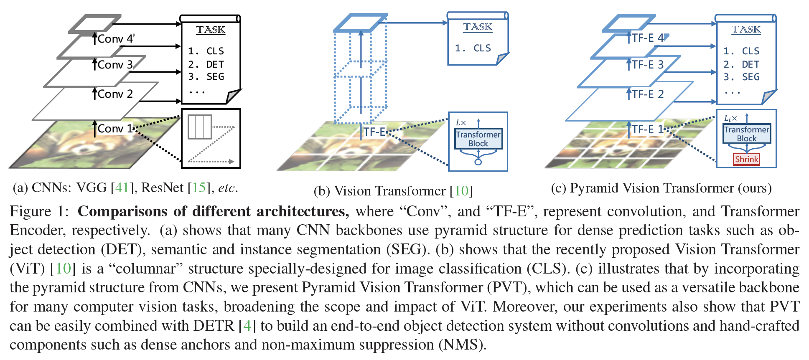

​		最近，Dosovitskiy等[10]将Transformer用于图像分类。这是通过无卷积模型替换CNN主干的有趣且有意义的尝试。如图1（b）所示，ViT具有柱状结构，具有粗糙的图像块（即，以较大的块大小分割图像）作为输入。尽管ViT适用于图像分类，但直接适应像素级的密集预测（例如目标检测和分割）仍是一项挑战，因为（1）它的输出特征图仅有一个尺度，且分辨率低，（2）即使对于普通的输入图像大小（例如，COCO检测基准中800像素的较短边），其计算和存储成本也相对较高。

​		我们补偿上述局限，这项工作提出一种使用Transformer模型的无卷积骨干网络，称为Pyramid Vision Transformer（PVT），其可以视为许多下游任务中的通用主干，这些下游任务包含图像级预测以及像素级密集预测。具体而言，如图1（c）所示，与ViT不同，PVT通过如下三个方面来克服传统Transformer的困难（1）采用细粒度图像块（例如每块$4\times4$）作为输入来学习高分辨率表示，其是密集预测的关键，（2）在网络深度增加时，引入渐进缩小金字塔来减少Transformer的长度，显著减小计算开销，以及（3）采用Spatial-Reduction Attention（SRA）层来进一步降低学习高分辨率特征图的资源成本。

​		整体上，所提出的PVT有如下优点。首先，与传统的随着深度增加感受野野增加的CNN主干相比，PVT始终产生全局感受野（通过所有小补丁上的注意力完成），其比CNN的局部感受野更适合检测和分割。其次，与ViT（见图1（b））相比，由于金字塔结构的进步，我们的方法更易于插入到许多代表性密集预测流水线，例如RetinaNet和Mask-RCNN。接着，利用PVT，我们可以通过将PVT与其他用于不同任务的Transformer解码器（例如用于目标检测的PVT+DETR）结合来构建无卷积流水线。例如，据我们所知，我们的实验提出了第一个端到端目标检测流水线（PVT+DETR），其完全是无卷积的。它在COCO val2017上获得34.7，比基于ResNet50的原始DETR好。

​		这项工作的主要贡献如下：

- 我们提出Pyramid Vision Transformer（PVT），其为第一个设计用于各种无卷积像素级密集预测任务的主干。结合PVT和DETR，我们可以构建没有卷积和手工组件（如密集锚和NMS）的端到端的目标检测系统。
- 通过设计渐进式缩小金字塔（progressive shrinking pyramid）和空间缩减注意（spatial-reduction attention：SRA），我们克服了将Transformer移植到密集像素级预测时遇到的许多困难，这些问题可以减少使用Transformer的资源消耗，使PVT灵活地学习多尺度和高分辨率特征图。
- 我们通过将PVT应用于许多不同的任务来验证PVT，例如图像分类、目标检测和语义分割，并将其与精心设计的ResNets [15]和ResNeXts [56]进行比较。如图2所示，我们看出，与先前的方法相比，具有不同参数量的PVT可以始终提到性能。例如，RetinaNet+PVT-Small在COCO val2017上获得40.4AP，比RetinaNet-ResNet50好4.1AP（40.4 vs. 36.3）。此外，RetinaNet+PVT-Large获得42.6AP，其比RetinaNet+ResNeXt101-64x4d好1.6AP，以及将参数量减少30%。

### 2. 相关工作

#### 2.1. 计算机视觉中卷积主干

​		卷积块是视觉识别中深层神经网络的主力军。标准卷积块和基本卷积块在[23]中首次引入，以区分手写数字。该块包含卷积核，该卷积核具有一定的感受野，可以捕获有利的视觉上下文。为了引入平移不变性，卷积核的权重在整个图像空间共享。随着计算资源（例如GPU）的逐渐改善，在大规模图像分类数据集（例如ImageNet）上成功训练几个卷积块[22、41]的堆栈成为可能。GoogLeNet[46]证明包含过个核路径的卷积算子可以获得非常具有竞争性的性能。多路径卷积块的有效性在Inception系列[47、45]、ResNeXt、DPN[8]、MixNet和SKNet[24]得到进一步验证。此外，ResNet[15]在卷积块中提出skip连接，其使非常深的网络称为可能，并且在计算机视觉领域中获得令人影响深刻的影响。DenseNet[18]引入密集连接拓扑结构，其将每个卷积块连接到它前一个卷积块。最新的进步可以在最新的综述论文[20、40]中发现。

#### 2.2. 密集预测任务

**Preliminary**	密集预测任务旨在在特征图上进行像素级分类或回归。目标检测和语义分割是两种代表性密集预测任务。

**Object Detection**	在深度学习时代，CNN已成为目标检测的主导框架，其包含单阶段检测器（例如SSD、RetinaNet、FCOS、GFL、PolarMask和OneNet）和多阶段检测器（Faster RCNN、Mask RCNN、Cascade RCNN和Sparse R-CNN）。大多数流行的目标检测器构建在高分辨率或多尺度特征图上，从而获得良好的检测性能。最近，DETR和deformable DETR将CNN主干与Transformer解码器组合以构建端到端的目标检测器。如先前的基于CNN的检测器相似，它们还要求高分辨率或多尺度特征进行准确的目标检测。

**Semantic Segmentation**	CNN在语义分割中也起着重要作用。在早期阶段，FCN引入全卷积架构来生成给定任何大小图像的空间分割图。之后，Noh等引入反卷积操作，并在PSACAL VOC2012数据集上获得令人影响深刻的性能。受FCN的启发，提出U-Net专门用于医疗图像分割领域，其在具有相同空间大小的低级和高级特征图之间桥接了信息流。为了探索更丰富的全局上小文表示，Zhao等[62]设计一种具有不同池化尺度的金字塔池化模块，Kirillov等开发一种称为Semantic FPN的轻量级语义分割头部，这项工作基于FPN。DeepLab家族使用膨胀卷积来扩大感受野，同时保持特征图的分辨率。与目标检测方法相似，语义分割也依赖高分辨率或多尺度特征图。

#### 2.3. Self-Attention and Transformer in Vision

​		由于卷积滤波器权重通常在训练后是固定的，因此它们动态地适应输入变化是不灵活的。因此，已提出许多方法通过使用自注意力操作来缓解这个问题。非局部块尝试在空间和时间上建模长期依赖，其已表现出对准确的视频分类的好处。尽管它取得成功，但是非局部算子遭遇高内存和计算成本。Criss-cross[19]通过生成仅通过criss-cross路径的稀疏注意力图来进一步减小复杂度。Ramachandran等提出独立的自注意力提议，以用局部自注意力单元代替卷积层。当将自注意力和卷积操作结合时，AANet获得相当的性能。DETR利用Transformer解码器来将目标检测建模为端到端的具有可学习查询的字典查找问题，其成功地移除了诸如NMS的手工过程。基于DETR，deformable DETR进一步引入可变形注意力层来关注上下文元素中的稀疏集，其获得快速收敛和更好的性能。最近，ViT采用纯粹的Transformer模型，通过将图像视为补丁序列来进行图像分类。DeiT通过使用新颖的蒸馏方法来进一步扩展ViT。与先前的方法不同，本文尝试将金字塔结构引入到Transformer，并设计一种纯Transformer主干进行密集预测任务。

### 3. Pyramid Vision Transformer (PVT)

#### 3.1. 整体架构

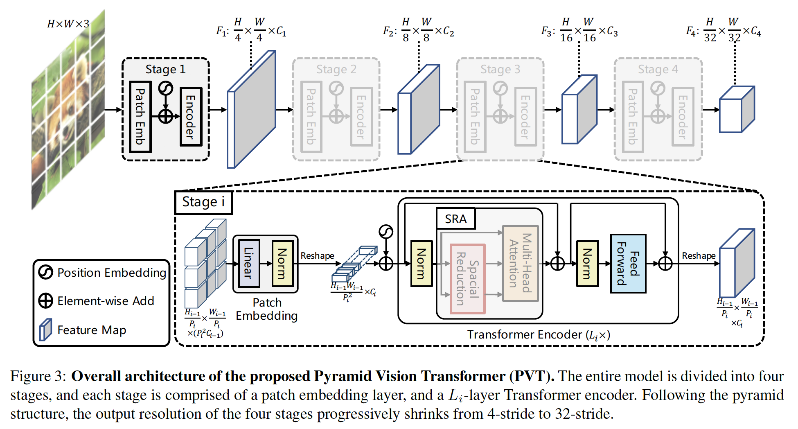

​		我们的目的是将金字塔结构引入Transformer，使得它可以为密集预测任务（例如目标检测和语义分割）生成多尺度特征。PVT的概览如图3描述。与CNN主干形似，我们的模型有四个阶段，它们生成不同尺度的特征图。所有阶段都有相似的架构，其包含一个补丁嵌入层和$L_i$个Transformer编码器层。

​		在第一个阶段中，给定大小为$H \times W \times 3$的输入图像，我们首先将其划分为$\frac{HW}{4^2}$个补丁（与ResNet相同，保持输出特征图的最高分辨率的步长为4），每个补丁的大小为$4\times4\times3$。然后，我们将铺平的补丁馈入线性映射，并得到大小为$\frac{HW}{4^2} \times C_1$的嵌入补丁。之后，将嵌入补丁与位置嵌入一起送入$L_1$层的Transformer编码器，并将输出调整到特征图$F_1$，它的大小为$\frac{H}{4} \times \frac{W}{4} \times C_1$。以这种方式，使用前一层的特征图作为输入，我们获得接下来的特征图$F_2$、$F_3$和$F_4$，它们相对于输入图像的步长分别为8、16和32像素。利用特征金字塔$\{F_1,F_2,F_3,F_4\}$，去噢没得方法可以轻松地用于大多数下游任务，包括图像分类、目标检测和语义分割。

#### 3.2. Feature Pyramid for Transformer

​		与使用卷积步长获得多尺度特征图的CNN主干网络不同，我们的PVT使用_progressive shrinking strategy_以通过补丁嵌入层来控制特征图的尺度。

​		这里，我们将第$i$个阶段的补丁大小表示为$P_i$。在阶段$i$个开始之处，我们首先将输入特征图$F_{i-1} \in \mathbb{R}^{H_{i-1} \times W_{i-1} \times C_{i-1}}$均匀地分为$\frac{H_{i-1}W_{i-1}}{P_i^2}$个补丁，然后将每个补丁铺平，并将其投影为$C_i$维嵌入。在线性投影之后，嵌入补丁的形状可以视为$\frac{H_{i-1}}{P_i} \times \frac{W_{i-1}}{P_i} \times C_i$，其中宽和高比输入小$P_i$倍。

​		以这种方式，我们可以灵活调整每个阶段的特征图的尺度，使其可能构建Transformer的特征金字塔。

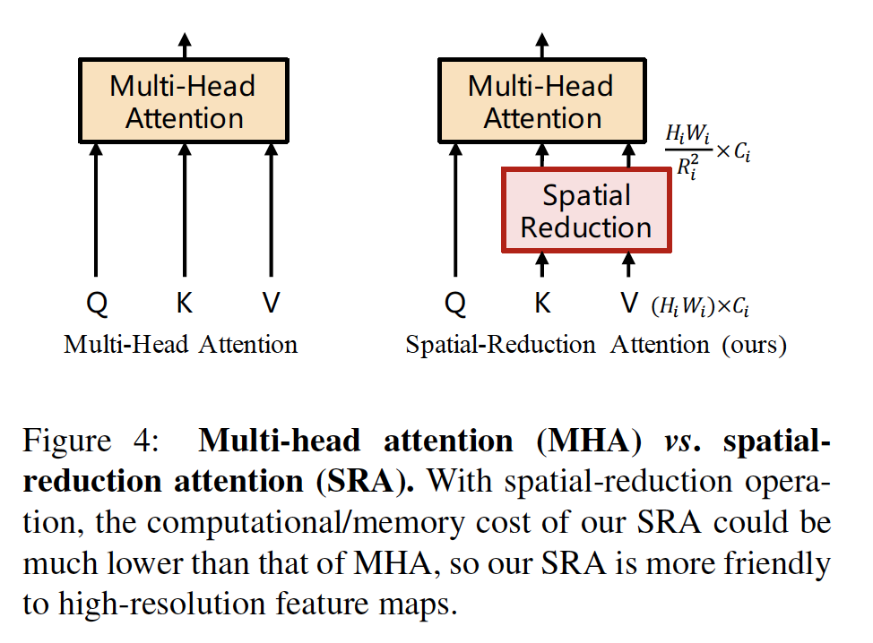

#### 3.3. Transformer Encoder

​		对于阶段$i$中的Transformer编码器，它有$L_i$个编码器层，每个编码器包含一个注意力层和一个前向层。因为我们的方法需要处理高分辨率（例如步长为4）特征图，所以我们提出Spatial-Reduction Attention（SRA）来替换编码器中传统的多头注意力（multi-head attention：MHA）层。

​		与MHA相似，我们的SRA也接受一个查询$Q$、一个键$K$和一个值$V$作为输入，并且输出一个精炼的特征。区别是我们的SRA会在注意操作之前减小$K$和$V$的空间尺度，如图4所示，其极大地减小计算/内存开销。阶段$i$的SRA的细节可以公式化如下：

$$\mbox{SRA}(Q,K,V)=\mbox{Concat}(\mbox{head}_0, \cdots, \mbox{head}_{N_i})W^O, \tag{1}$$

$$\mbox{head}_j = \mbox{Attention}(QW_j^Q, \mbox{SR}(K)W_j^K, \mbox{SR}(V)W_j^V),\tag{2}$$

其中$W_j^Q \in \mathbb{R}^{C_i \times d_{\mathbf{k}}}$、$W_j^K \in \mathbb{R}^{C_i \times d_{\mathbf{head}}}$、$W_j^V \in \mathbb{R}^{C_i \times d_{\mathbf{head}}}$和$W^O \in \mathbb{R}^{h_i \times d_{\mathbf{head}}}$为线性投影侧参数。$N_i$为阶段$i$中Transformer编码器的头数。因此，每个头$d_{\mathbf{head}}$的维度等于$\frac{C_i}{N_i}$。$\mbox{SR}(\cdot)$为spatial-reduction操作，其定义为：

$$\mbox{SR}(\mathbf{x})=\mbox{Norm}(\mbox{Reshape}(\mathbf{x}, R_i)W^S).\tag{3}$$

这里，$R_i$表示阶段$i$中注意力层的reductions ratio。$\mbox{Reshape}(\mathbf{x},R_i)$为将输入$\mathbf{x} \in \mathbb{R}^{(H_iW_i)\times C_i}$重塑为大小为$\frac{H_i W_i}{R_i^2}\times (R_i^2C_i)$的序列的操作。$W_S \in \mathbb{R}^{(R_i^2C_i) \times C_i}$为将输入序列的维度减小到$C_i$的线性投影。$\mbox{Norm}(\cdot)$为layer normalization。与Transformer相似，$\mbox{Attention}$为注意力操作，其计算为：

$$\mbox{Attention}(\mathbf{q},\mathbf{k},\mathbf{v}) =\mbox{Softmax}(\frac{\mathbf{qk}^\top}{\sqrt{d_{\mathbf{head}}}})\mathbf{v}.\tag{4}$$

通过这些公式，我们可以之处我们的$\mbox{Attention}(\cdot)$操作的计算/内存成本比MHA小$R_i^2$倍，因此它可以以有限的资源处理更大的输入特征图/序列。

#### 3.4. Model Details

​		总之，我们的方法的超参数如戏：

- $P_i$：阶段$i$的补丁大小；
- $C_i$：阶段$i$的输出的通道数；
- $L_i$：阶段$i$中编码器层的数量；
- $R_i$：阶段$i$中SRA的reduction ratio；
- $N_i$：阶段$i$中SRA的头数；
- $E_i$：阶段$i$的前馈层的expansion ratio。

遵循ResNet的设计规则，我们（1）在较浅的阶段中使用小输出通道数；（2）在中间阶段中集中主要计算资源。

​		为了替哦那个实力进行讨论，我们描述一系列的不同尺度的PVT模型，称为PVT-Tiny、PVT-Small、PVT-Medium和PVT-Large，见表1。在第4节中将介绍在特定的下游任务中使用这些模型的更多细节。

#### 3.5. 讨论

​		与我们的方法最相关的是ViT[10]。这里，我们详细讨论它们之间的关联和差异。

​		PVT和ViT都是没有卷积操作的纯Transformer。它们之间的主要差异是金字塔结构。与传统的Transformer相似，ViT的输出序列的长度与输入相同，这意味着ViT的输出是单尺度的（见图1（b））。此外，由于有限的资源，ViT的输出是粗粒度的（例如补丁大小为16或32像素），并因此它的输出分辨率相对较低（例如16-stride或32-stride）。因此，ViT难以用于需要高分辨率或多尺度特征图的密集预测任务。

​		我们的PVT通过引入渐进式收缩金字塔，打破了Transformer的常规。它可以生成如传统CNN主干的多尺度特征图。此外，我们还设计了简单而有效的注意力层——SRA，来处理高分辨率特征图并减小计算/内存成本。受益于上述设计，我们的方法相对于ViT具有以下优点：1）更灵活——可以在不同阶段中生成不同尺度、通道的特征；2）更通用——可以很容易地在大多数下游任务模型中插入和起作用；3）对计算/内存更友好——可以处理更高分辨率的特征图。

### 4. 用于下游任务

#### 4.1. 图像级预测

​		图像分类是图像级预测中最具代表性的任务。遵循ViT和DeiT，我们将可学习的分类token附加到最后阶段的输入，然后使用全连接层以在分类token的顶部上进行分类。

#### 4.2. 像素级密集预测

​		除了图像级预测外，需要在特征图傻姑娘进行像素级分类或回归的密集预测在下游任务中也是常见的。这里，我们讨论两个典型任务，即目标检测和语义分割。

**目标检测**	我们将PVT模型用于两个代表性的目标检测方法，即RetinaNet和Mask R-CNN。RetinaNet是广泛使用的单阶段检测器，Mask R-CNN是主流的两阶段实例分割框架之一。实现细节如下：（1）与ResNet相同，我们直接使用输出的特征金字塔$\{F_1,F_2,F_3,F_4\}$作为FPN的输入，然后将精炼的特征图馈入接下来的检测或实例分割头部。（2）在目标检测中，输入可以是任意形状，所以ImageNet上预训练的位置嵌入可能不再有意义。因此，我们根据输入图像，在预训练的位置嵌入上进行双线性插值。（3）检测模型的训练期间，PVT中的所有不会被冻结。

**语义分割**	我们选Semantic FPN作为基线，其是简单的分割方法，而没有特殊操作（例如膨胀卷积）。因此，使用它作为基线可以很好地检查主干的原始有效性。与目目标检测中实现相似，我们将特征金字塔直接馈入语义FPN，并使用双线性插值来调整预训练的位置嵌入。

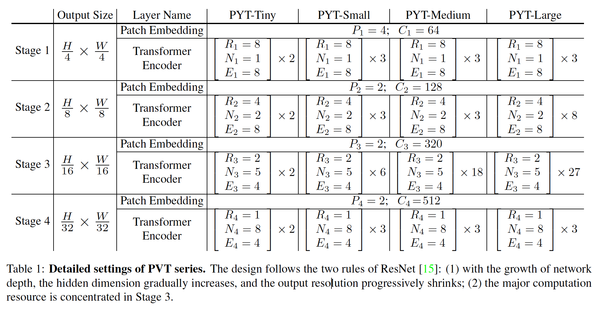

### 5. 实验

​		我们将PVT与两个最具代表性的CNN骨干进行比较，即ResNet和ResNeXt，其在许多下游任务中被广泛采用。

##### 5.1. 图像分类

**实验设置**	我们在ImageNet数据集上进行图像分类实验。为了公平比较，我们遵循DeiT，数据增强包括图像随机裁剪到$224 \times 224$、随机水平翻转和mixup。训练期间使用Label-smoothing正则化。我们使用momentum为0.9的AdamW，mini-batch大小为128，权重衰减为$5 \times 10^{-2}$。初始学习率设置为$1 \times 10^{-3}$，并使用cosine时间表。所有模型在8张V100 GPU上训练300个epoch。为了进行基准测试，我们在验证集上应用了中心裁剪，其中裁剪了224 224个像素，以评估识别精度。

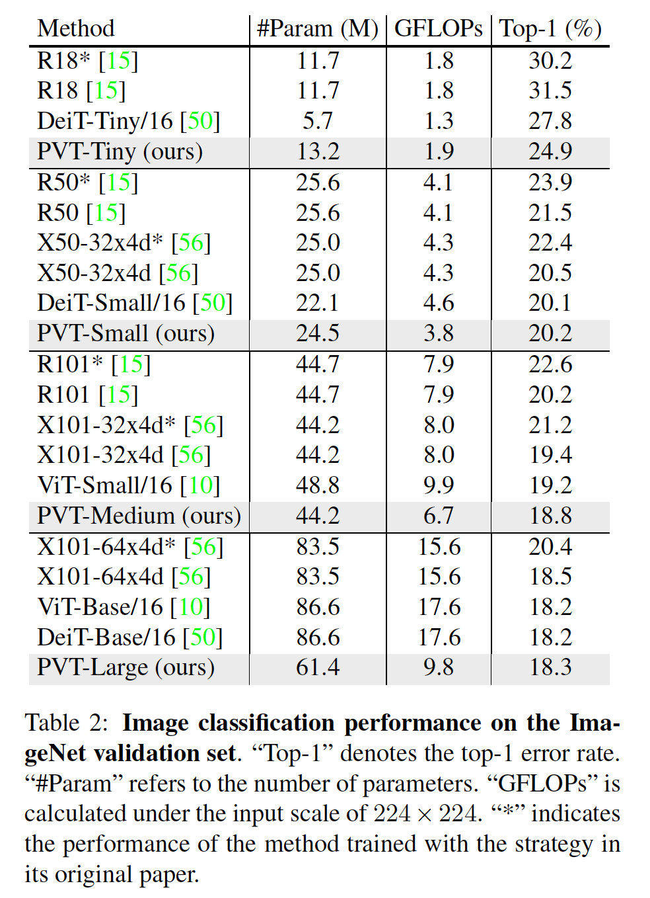

**结果**	在表2中，我们发现PVT模型在相似参数量和计算负担下，比传统CNN主干好。

#### 5.2. 目标检测

**实验设置**	我们在挑战性的COCO基准测试上进行目标检测实验。在COCO train2017上训练所有模型，并在val2017上进行评估。我们在两个标准检测器上评估PVT：RetinaNet和Mask R-CNN。训练期间，我们首先使用ImageNet上预训练的权重来初始化主干，使用Xavier来初始化新添加的层。在8张V100GPU上利用16的批大小训练模型，利用初始学习率为$1 \times 10^{-4}$的AdamW优化。遵循常用的设置，我们采用$1\times$或$3 \times$时间表（即12或36epoch）来训练所有检测模型。将训练图像的短边调整为800像素，而图像的长边不超过1333像素。当使用$3\times$训练时间表时，我们还在$[640,800]$范围内随机调整输入图像的短边。在测试阶段，输入图像的短边固定为800像素。

**结果**	结果见表3。

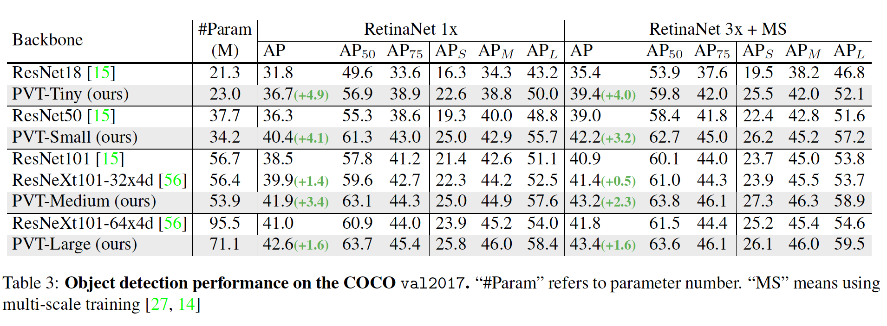

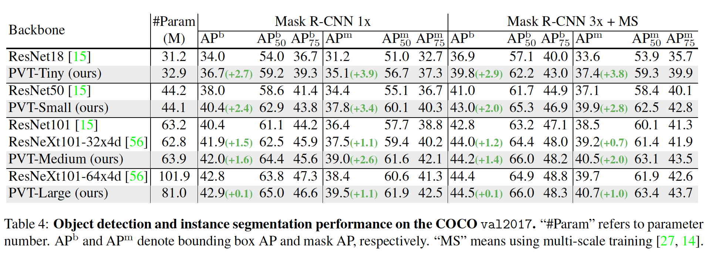

#### 5.3. 语义分割

**实验设置**	我们选择ADE20K，它是一个用于语义分割的挑战性场景解析基准测试。ADE20K包含150种细粒度类别，其中训练、验证和测试集中分别有20210、2000和3352张图像。我们通过将PVT主干用于Semantic FPN来评估它。在训练阶段，主干利用ImageNet上预训练的权重初始化，而其他新添加的层用Xavier初始化。我们利用初始学习率为$1e-4$的AdamW优化模型，并在4张V100GPU上以16的batchsize训练80K迭代。根据指数为0.9的多项式衰减时间表衰减学习率。训练时，我们将图像随机调整和裁剪为$512 \times 512$，测试时，将图像的短边缩放为512。

**结果** 	结果见表5。

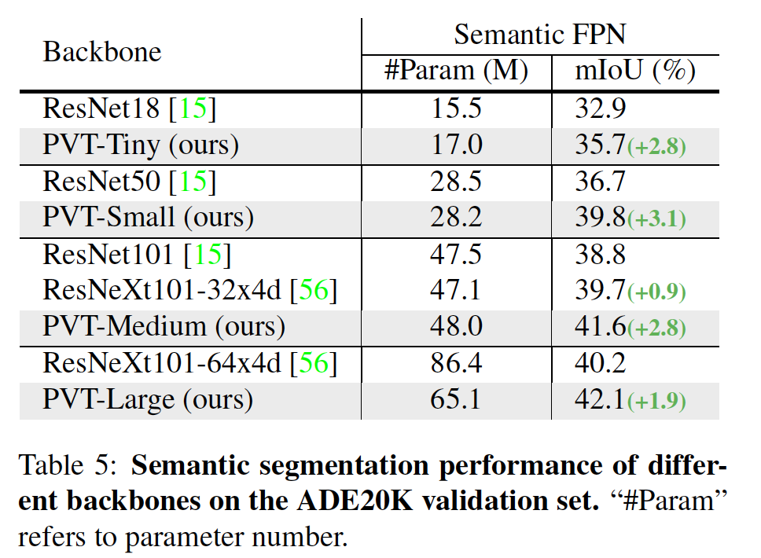

#### 5.4	纯Transformer的密集预测

​		我们利用PVT替换用于检测的DETR和用于分割的Trans2Seg中的ResNet50，构建纯Transformer的密集预测流水线。结果证明，不带卷积的全Transformer在目标检测和语义分割上也能很好地工作。

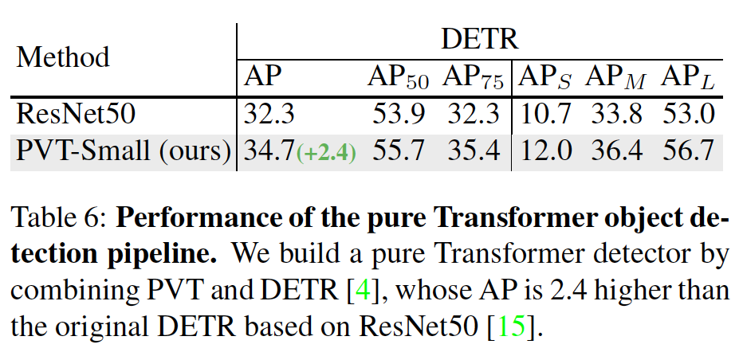

**PVT+DETR**	通过将PVT与DETR结合，我们构建纯Transformer模型进行目标检测，DETR为基于Transformer的检测头部。利用初始学习率$1\times 10^{-4}$在COCO train2017上训练模型50个epoch。学习率在第33个epoch时除以10。我们使用随机翻转和随机缩放作为数据增强。所有其他实验设置与5.2节相同。结果如表6所示，PVT+DETR在COCO val2017上获得34.7AP，比ResNet50+DETR好2.4 AP（34.7 vs 32.3）。

**PVT+Trans2Seg**	通过将PVT与Trans2Seg结合而构建纯Transformer模型进行语义分割，Trans2Seg是基于Transformer解码器的检测头部。根据5.3节的实验设置，我们在ADE20K数据集上进行实验，并进行40K迭代训练、单尺度测试，并将它与ResNet50+Trans2Seg、膨胀率为8和16的DeeplabV3+进行比较，结果见表7。

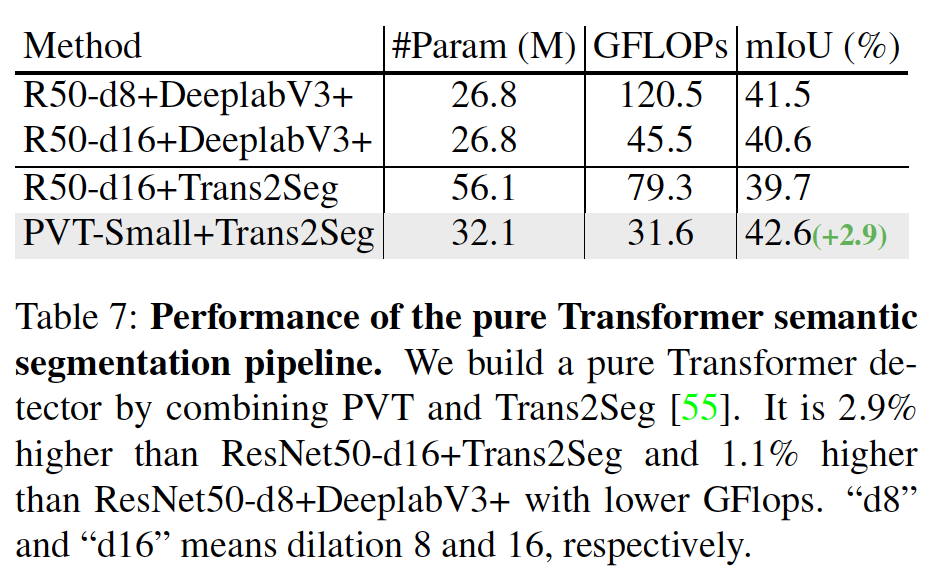

#### 5.5. 消融研究

**金字塔结构**	在将Transformer用于密集预测任务时，金字塔结构时直观重要的。先前的ViT是柱状架构，它的输出是单尺度的。当使用粗糙的图像补丁（例如每块$32 \times 32$）作为输入时，它会引起一个问题，输出的特征分辨率会很低，导致很差的检测性能（COCO val2017上为31.7AP），如表8所示。当使用细粒度的图像补丁（例如每个补丁$4\times4$）作为输入时，ViT将超出GPU的内存（例如32GB）。不同的是，我们的方法通过渐进式缩小金字塔避免了这个问题。我们的方法可以在浅层阶段处理高分辨率特征图，在深层阶段处理低分辨率特征。因此，我们的方法在COCO va2017上获得40.4 AP，比ViT-Samall/32高8.7AP（40.4 vs 31.7）。

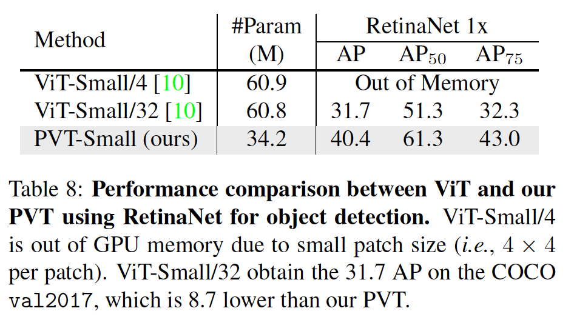

**Deeper vs. Wider**	在以前的工作中，已经广泛讨论了CNN主干网应该更深或更宽的问题[15，58]。这里，我们在PVT中探索这个问题。为了公平比较，我们将PVT-Small的隐藏维度$\{C_1, C_2, C_3, C_4\}$乘以1.4以诗它与深度模型（即PVT-Medium）有相同的参数量。如表9所示，在ImageNet和COCO上，深度模型（即PVT-Medium）始终比宽模型（即PVT-Small-Wide）好。因此，在PVT设计中，变得更深比变得更宽有效。基于这种观察，表1，我们同增加模型深度开发具有不同尺度的PVT模型。

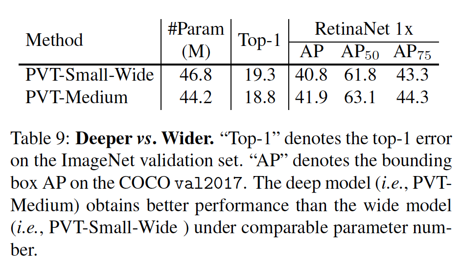

**预训练权重**	大多是密集预测模型（例如RetinaNet）依赖ImageNet上预训练的权重的主干。我们在PVT中讨论这个问题。如图6的顶部，我们绘制RetinaNet-PVT-Small w/（红色曲线）和w/o（蓝色曲线）的验证AP曲线。我们发现有预训练权重的模型 w/ 比没有预训练的模型w/o收敛更好，在$1\times$训练时间表下，它们最终的性能差距达到13.8，在$3 \times$训练时间表和多尺度训练下，差距达到8.4。因此，与基于CNN模型相似，预训练权重还可以帮助基于PVT模型收敛更宽、更好。此外，在图5 的底部，我们还看出基于PVT模型（红色曲线）的收敛速度比基于ResNet的模型（绿色曲线）更快。

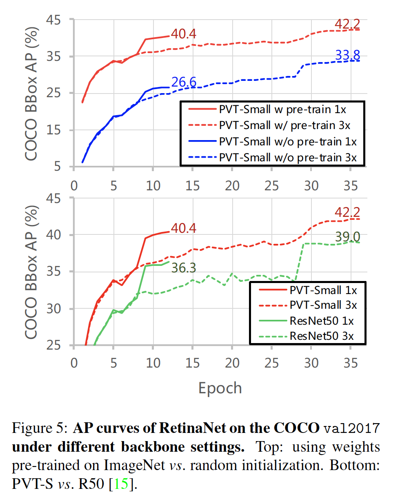

**计算成本**	随着输入尺度的增加，我们的模型的GFLOP增长率比ResNet更大，但是比ViT少，如图6所示，其意味着PVT更适合中间分辨率输入的任务（短边不超过800像素）。在COCO上，输入图像的短边为800像素。在这个条件下，PVT-Small上基于RetinaNet的推理速度比基于ResNet50的速度更慢，图表10。

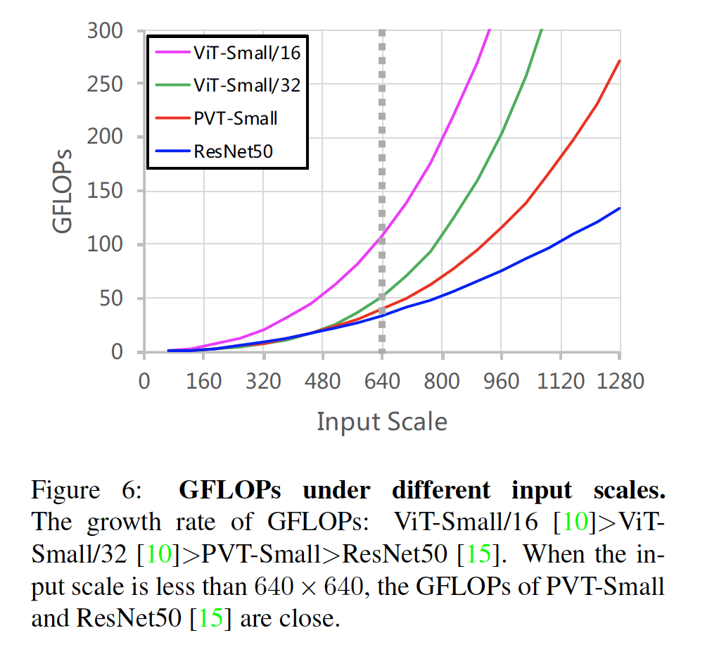

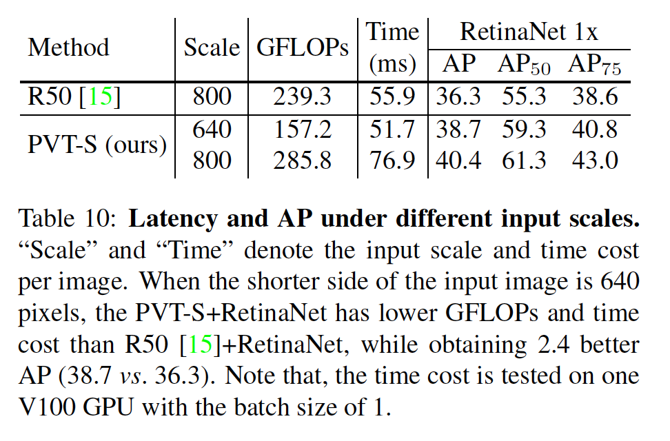

​		针对这个问题的一种直接的解决方案是减小输入尺度。当将输入图像的短边减小到640像素时，基于PVT-Small的模型比基于ResNet50的模型快，但是我们的AP高2.4（38.7 vs 36.3）。另一种可能的解决方案是开发一种具有更低计算复杂度的新颖自注意力层用于视觉任务。这是值得探索的方向，今后我们将一如既往地为此付出努力。