## Rethinking Channel Dimensions for Efficient Model Design

### 摘要

​		在有限的计算成本中设计高效的模型是具有挑战的。我们认为轻量化模型的准确率收到设计习惯的局限：通道维度逐阶段的配置，看起来像网络阶段的分段线性函数。本文中，我们研究一种有效的通道尺寸配置，以实现比传统的更好的性能。为此，我们经验上研究如何通过分析输出特征的阶来恰当地设计单个层。然后，我们通过在计算成本限制下搜索有关通道配置的网络架构来研究模型的通道配置。基于这种研究，我们提出一种简单而有效的通道配置，其可以由层索引参数化。因此，我们在通道参数化之后提出的模型在ImageNet分类和迁移学习任务（包括COCO目标检测，COCO实例分割和细粒度分类）上均取得了卓越的性能。可通过https://github.com/clovaai/rexnet获得代码和ImageNet预训练的模型。

### 1. 引言

​		设计轻量化的网络架构对于研究人员和从业人员都至关重要。设计用于ImageNet分类的流行网络[48、16、21、47]共享相似的设计惯例，其中低维输入通道被几个通道扩展层扩展到超过类的数量。轻量化模型[21、47、20、61、36、50、55、3、51]也遵循这种配置，但是为了计算效率进一步缩放一些通道，其在计算成本和准确率上产生很好的平衡。换句话说，层中通道维度扩展的程度完全不同，其中更早层有更小的通道维度；倒数第二层，在很大程度上超出了类的数量。这是为了通过在较早的层上缩小通道尺寸来实现FLOP效率；在最终特征上获得具有足够通道维度的模型表示性（请参见表1）。

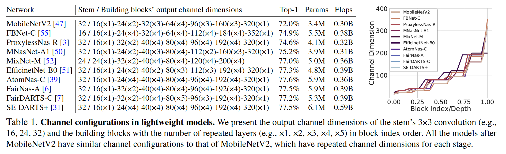

​		这种通道配置首先由MobileNetV2引入，并且成为轻量化网络中配置通道维度的设计惯例，但是在受限的计算成本下如何将通道尺寸调整为最佳状态尚未得到深入研究。如表1所示，甚至基于网络架构搜索（NAS）的模型[55、3、20、50、52、51、39、6、7、31]都是根据惯例设计的，或者在配置附近的少数几个选项中进行了更多探索[11、54] ，并专注于搜索构建块。与设计惯例相比，我们采取了进一步的措施，我们假设通过常规通道配置设计的紧凑型模型可能会由于主要关注FLOP效率而限制了表达能力；比起传统的配置，存在一种更有效的配置。

​		本文中，我们研究轻量化网络的有效通道配置，并且具有额外的准确率增益。受[58、62]的启发，我们推测可以通过输出特征的矩阵秩来估计层的表示性。从技术上讲，我们使用从随机生成的具有随机大小的一堆网络的输出特征计算出的平均秩来研究，以揭示扩展层的合适扩展率范围，并与粗略设计原理建立联系。基于这种原则，我们将继续寻找网络中的整体通道配置。具体而言，我们搜索网络架构以识别产生比前面的惯例更好准确率的通道配置。事实证明，最佳通道配置由网络中的块索引参数化为线性函数。这种参数化与[23、13]中使用的配置相似，并且我们发现参数化在设计轻量模型方面也很有效。

​		基于这种研究，我们根据搜索到的通道参数设置提出了一个新模型。事实证明，对MobileNetV2进行的简单修改可以表现出ImageNet分类的性能显着提高。仅利用新的通道配置，我们的模型比诸如EfficientNets好，EfficientNet的架构通过在TPU上复合缩放来发现的。这强调了我们的通道配置有优于常规的有效性，并可能鼓励NAS领域的研究人员将我们的通道配置应用于网络搜索空间，以进一步提高性能。ImageNet分类上性能改进也很好地迁移到COCO数据集上的目标检测和实例分割以及多种细粒度分类任务。这表明我们的主干可以作为强特征提取器。

​		我们的贡献为：1）设计单个层设计上的研究；2）关于通道配置的网络架构探索，旨在实现简单而有效的参数化；3）使用我们的模型在ImageNet上获得显着结果[46]优于包括基于NAS的模型在内的最新轻量级模型；4）揭示了ImageNet训练的骨干网络具有很高的适用性，可以迁移到多个任务，包括目标检测、实例分割和细粒度分类，这表明我们的模型具有很高的表达力，并且通道配置非常有效。

### 2. 相关工作

​		在出现显著改进ImageNet分类的AlexNet [30]、VGG [48]、GoogleNet [49]和ResNet [16]出现之后，人们提出了更轻的模型，例如[24、21、24]，同时降低了计算预算。使用新算子depthwise convolution（dwconv）[21]，利用进一步有效的架构设计提出几种架构。利用depthwise卷积的优势可以减小大量学习参数，并且表现出明显的FLOP减小。最近，已提出结构化网络架构搜索（NAS）方法来产生轻量化模型[55、11、3、20、50、52、51、54、39、6、7、31]和基于宽度、深度和分辨率的复合缩放的EfficientNet，它们成为SOTA模型。与现有的轻量级模型相比，我们向前迈了一步，我们专注于为倒置瓶颈模块找到有效的通道配置，这是搜索构造块的替代方法。

### 3. 设计扩张层

​		在本节中，我们将研究如何考虑表达能力来合适地设计层，这对于设计整个网络架构至关重要。

#### 3.1. Preliminary

**估计表达能力**	在语言模型中，作者[58]首先强调指出，由于秩不足，softmax层可能会使logit变成整个分类概率。这是由于最终分类器的输入维数较低以及计算对数概率时softmax层的非线性消失。作者提出一种增强表达能力的修改，其提高模型的准确率。这意味着网络可以通过处理某层中表达能力的缺乏得到改进。在模型压缩工作中研究了表达能力的估计[62]。作者通过低秩逼近在层级压缩了模型。 通过计算每个特征的奇异值来研究压缩量。受这些工作的启发，我们推测秩可能与网络的表达能力密切相关，并且研究它可能提供有效的层设计指南。

**Layer designs in practice**	ResNet系列[16、17、57]的瓶颈块使输入通道的维度加倍（即顺序为64-128-256-512），以使最终维度（2048）最终超过类数。最近的高效模型[55、11、3、20、50、52、51、54、39、6、7、31]稳步增加倒置瓶颈中的通道维度；因此，它们通常在倒数第二层中涉及大型扩张层。将stem中的输出维度设置为32，其扩张3维输入。倒置瓶颈和瓶颈块都有预定义扩张率（大多数为6或4）的卷积扩张层。这些层是否设计正确，是否只需要相应地设计一个新模型？

#### 3.2. 实证研究

**Sketch of the study**	我们旨在研究单个扩张层的设计指南，该层扩张输入维度。我们测量了来自不同架构（超过1000个随机大小的网络）的输出特征的秩，并将趋势视为输入维度朝输出维度的变化。秩最初被输入维度约束，但是后面的非线性函数将增加上述输入维度的秩。但是，某个网络无法将秩扩展到接近输出维度，因此该特征将无法充分利用。我们统计上验证设计网络时避免失败的方法。该研究进一步揭示了复杂的非线性函数（例如ELU [8]或SiLU（Swish-1）[18、43]）的影响，以及在设计轻量模型时在何处使用它们。

**Materials**	我们用构建块生成一堆网络，包含1）单个$1\times1$或$3\times3$卷积层；2）内部具有$3\times3$卷积或$3\times3$ depthwise 卷积的倒置瓶颈块。我们有层输出（即特征）$f(\mathbf{WX})$，$\mathbf{W} \in \mathbb{R}^{d_{out} \times d_{in}}$，输入$\mathbf{X} \in \mathbb{R}^{d_{in} \times N}$，其中$f$表示具有归一化层（这里，我们使用BN）的非线性函数[^1]。随机采样$d_{out}$以实现随机大小的网络，在范围$[0.1,1.0]$中为每个通道维度比例（$d_{in} / d_{out}$）成比例地调整$d_{in}$。$N$表示批大小，其中我们设置$N > d_{out} > d_{in}$。我们为每个模型计算_rank ratio_并平均它们（即$\mbox{rank}(f(\mathbf{WX})) / d_{out}$）。倒置瓶颈块类似地作为单个卷积层处理以计算秩[^2]。

[^1]: 我们使用ReLU、ReLU6、LeakyReLU、ELU、SoftPlus、Hard Swish和SiLU（Swish-1）。
[^2]: 我们将倒置瓶颈块的输入和输出表示为第一个$1\times1$卷积的输入和shortcut和瓶颈的加法运算之后的输出。

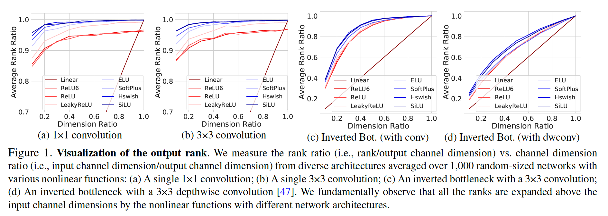

**观察**	图1展示秩相对于输入通道尺寸的平均变化情况。x轴上的维度比例$(d_{in} / d_{out})$表示扩张比例的倒数。我们观察到如下：

（i）__急剧地通道扩张损害秩__ 。如图1所示，这对于单个卷积层和倒置的瓶颈成立。这在1）倒置瓶颈（图1c），2）depthwise卷积（见图1d）的影响更大。

（ii）__非线性扩展秩__。图1展示通过非线性函数将平均秩扩展到输入通道维度之上。 它们以较小的维度比率扩大秩，而复杂的诸如ELU或SiLU的秩更多。

（iii）__非线性是卷积的关键__	非线性扩展$1\times1$和$3\times3$卷积的秩比倒置瓶颈更多（见图1a和1b vs. 图1c和1d）。

**What we learn from the observations**	我们学习到如下：1）设计第一个$1\times1$卷积时，需要使用6个或更小的扩展比率的倒置瓶颈；2）在轻量化模型中，具有深度卷积的每个倒置瓶颈需要更高的通道维度比；3）诸如ELU和SiLU的复杂非线性需要放在$1\times1$卷积或$3\times3$卷积（并非depthwise卷积）之后。基于这一知识，在以下部分中，我们将进行通道维度搜索，以找到整个通道维度的有效通道配置。这是为了揭示表1中所示的常规通道配置方法是否最佳，尽管这些模型在高精度下运行良好。

**Verification of the study**	最后，我们提供了一个实验性备份，以确保我们学到的东西有助于提高准确性。我们训练由两个反向瓶颈（IBs）组成的模型，以调整IB的通道维度比（DR）和每个IB中的第一个$1\times1$卷积。从具有低DR $1/20$的基线开始，我们依次研究了以下模型：1）将第一个$1\times1$卷积的DR增加到1/6； 2）将每个IB的DR从0.22增加到0.8； 3）在每个IB中用SiLU替换第一个ReLU6。表2展示每个因子都能很好地起作用，并且秩和准确率一起提高了。

### 4. Designing with Channels Configuration

#### 4.1. Problem Formulation

​		我们的目标是揭示在计算要求下设计网络的有效通道配置。我们制定以下问题

$$\begin{align}&\max_{c_i,i=1,\cdots,d} \mbox{Acc}(N(c_1,\cdots,c_d)) \\ \mbox{s.t.} &c_1\le c_2 \le \cdots \le c_{d-1} \le c_d, \\&\mbox{Params}(N) \le P, \mbox{FLOPs}(N) \le F\end{align}\tag{1}$$

其中$\mbox{Acc}$表示模型的top-1准确率，$c_i$表示$d$个构建块中第$i$个块的输出通道，$P$和$F$表示目标参数大小和FLOPs。我们涉及$c_i$的单调增加，因为它包含表1所示的通道配置； 我们注意到，在相反的情况下，通道维度不断减小，需要数量难以使用的FLOP。这里，我们的目标不是硬件特定的模型，因此我们关心FLOP，而不是推理延迟。值得注意的是，许多NAS方法[55、3、20、50、52、51、39、6、7、31]根据表1所示的预定义通道配置，使用固定$c_i$搜索网络$N$，但是另一方面，我们在固定网络$N$的同时搜索$c_i$。

#### 4.2. Searching with channel parameterization

​		我们通过搜索观察到了满足各种计算需求的架构形状的总体趋势。除了直接优化等式（1）之外，我们还使用分段线性函数表示每个构建块的通道维度，这可以减少搜索空间。我们将通道维度参数化为$c_i = af(i) + b$，其中$a$和$b$通过搜索得到，从$1,\cdots,d$选择的$f(i)$的子集，使$f(i)$成为分段线性函数。以这种形式，通道参数化包含通用的基于MobileNetV2的通道配置（即逐阶段通道配置），如表1所示。我们采用NAS方法[35、4、31]中所做的CIFAR-10和CIFAR-100数据集[29]来搜索参数化。

​		为了控制其他变量，我们将所有网络设置为在stem中有固定通道维度，即16哥通道的$3\times3$卷积，然后是BN和ReLU[25]，并在倒数第二层具有较大的扩展层。我们使用原始的倒置瓶颈（扩张率为6）作为我们的狗健康，其为轻量化NAS方法的基本块，因此我们没有搜索构建块的扩张率。选择的元素基于上述单层设计的研究。可以通过搜索和训练网络来完成优化。为了快速训练，我们训练每个模型30个周期，并且使用早停策略。每个训练重复三次以平均准确率，从而减小由随机初始化引起的准确率波动

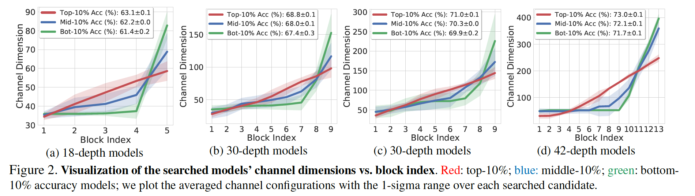

#### 4.3. 搜索结果

​		我们在计算成本的不同约束下执行单个搜索，以提供可靠且可概括的搜索结果。我们分配了四个搜索约束，旨在跨不同目标模型大小进行搜索。在每个搜索之后，我们从100个搜索到的模型收集在准确率方面的前10%、中间10%（即前50%和60%之间的模型）和后10%的模型以分析它们。为此，我们首先在每次搜索的图2中可视化收集的模型的通道配置； 然后，我们在表3中报告这些模型的详细性能统计信息以及性能最好/最差的模型的通道配置。

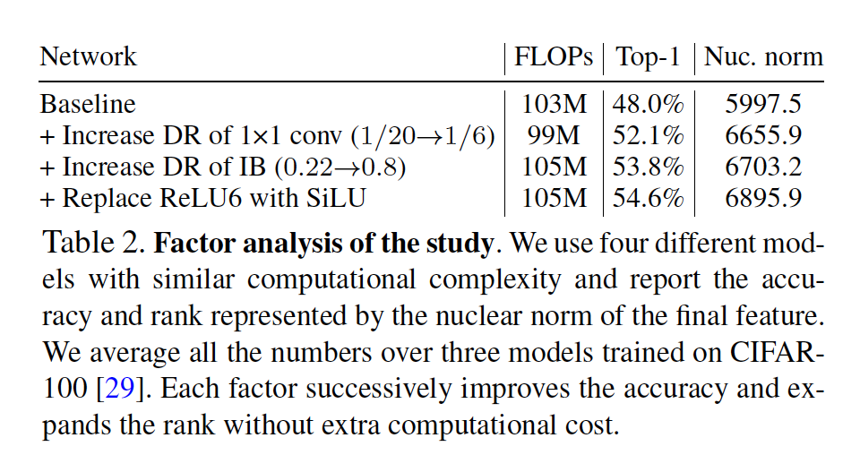

​		图2展示了清楚的倾向，其中通道配置在准确率方面更有效。我们观察到，块索引（标记为红色）线性参数化具有较高的准确性，同时保持了相似的计算成本。如图所示，可以在各种环境中的整个搜索过程中规则地找到该参数化设置。请注意，表3中的最佳模型将通道配置为线性增加，这与线性参数化相同。绿色标记的模型已高度减小输入侧的通道，因此大多数权重参数都放置在输出侧，从而导致精度损失。此外，有趣的是，蓝色标记的模型表示在中间10%准确率的模型，其看起来有相似的通道配置，见表1。它们的常规配置旨在通过限制较早层的通道并在输出附近提供更多通道来获得FLOP效率。我们可以安全地建议我们需要将惯例（蓝色）更改为可以实现更高准确性的新通道配置（红色）。

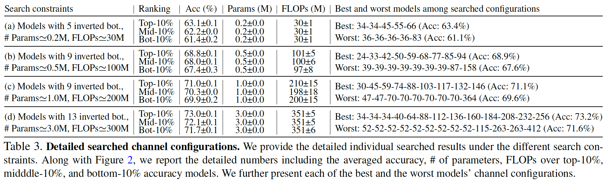

​		在固定网络深度并以不同的计算成本进行搜索时，我们还有图4所示的其他搜索结果； 我们发现相同的线性参数化。此外，我们在计算成本的约束下对CIFAR-10进行了相同的实验，并在图A1中发现了相同的趋势。如前所述，我们认为工作[13、23]的成功可能源于相似的参数化。在训练18深度的模型的案例中，该模型大约有30MFLOP，消耗1.5天来搜索和训练大约100个模型，其中每个模型训练30个epoch，并且重复训练3次。整个搜索的训练成本为$30 \mbox{ MFLOPs} \times \mbox{30 epochs} \times \mbox{3 runs} \times \mbox{100 models} = 2.7 \times \mbox{100 GFLOPs}$，并且这比训练单个ImageNet模型ResNet50 100个周期（4.0GFLOP $\times$ 100 epoch）少。尽管实际训练时间比ResNet50少，但是直接利用ImageNet训练可能是不合适的。我们提供实际计算量的粗略估算。

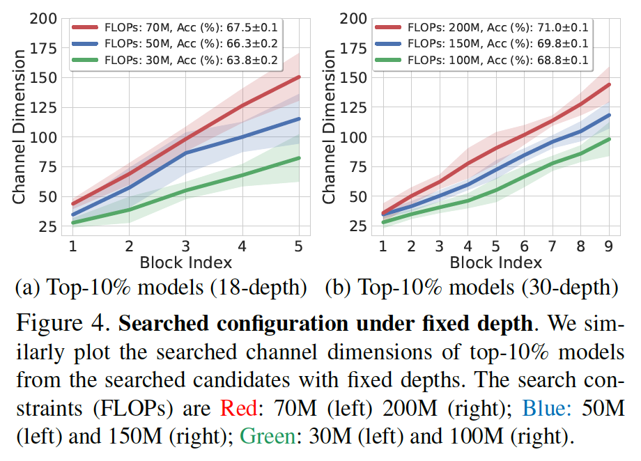

#### 4.4. 网络更新

​		我们基于研究重建已有的模型。从介绍了通道配置约定的基线MobileNetV2 [47]开始，我们仅通过遵循参数化来重新分配倒置瓶颈的每个输出通道维度。我们使用相同的stem设置（即具有BN和ReLU6的$3 \times 3$卷积）和扩张率为6的倒置瓶颈。我们在倒数第二层中使用相同的大型扩张层。为了与前面提到的轻量化模型MobileNetV3、MixNet、EfficientNet、AtomNas、FairNas、FairDARTS、DART+比较，我们进一步将ReLU6替换为SiLU，并在倒置瓶颈中使用SE。

​		基于第3节的研究，我们仅替换每个倒置瓶颈中的第一个$1\times1$卷积之后的ReLU6，因为我们观察到更小维度比的层需要更多的处理，第二个depthwise卷机的通道维度比为1，所以我们没有替换这里的ReLU6。由于保留了ReLU6，因此可以进一步实现模型设计的简便性并受益于更快的训练速度。使用另一种非线性函数（诸如ELU）表现出相似的准确率增益（见表A2），但是我们使用SiLU（Swish-1）以与前面提到的使用SiLU的轻量化模型比较。

​		注意，仅利用这些简单的修改，在许多实验中，我们的模型就比基于NAS的方法好，其表明通道配置的重要性。我们称我们的模型Rank Expansion Networks（ReXNet），如第6节中观察到的实际秩扩张。此外，我们在MobileNetV1 [21]上建立了带有线性参数化的另一个模型，与基线72.5％相比，该模型显示出较大的精度提高（+ 2.3pp）。我们称这个模型为ReXNet（plain）。ReXNet的详细模型描述见附录B。

### 5. 实验

#### 5.1. ImageNet分类

**Training on ImageNet**	我们使用随机梯度下降（SGD）和最小批量大小（在四个GPU上为512）的标准数据增强[49]在ImageNet数据集[46]上训练模型。将学习率初始化为0.5，并且使用余弦学习率衰减。权重衰减设置为1e-5。表4展示与流行的轻量化模型的性能比较，其中报告的模型都利用$224 \times 224$的图像大小训练和评估。

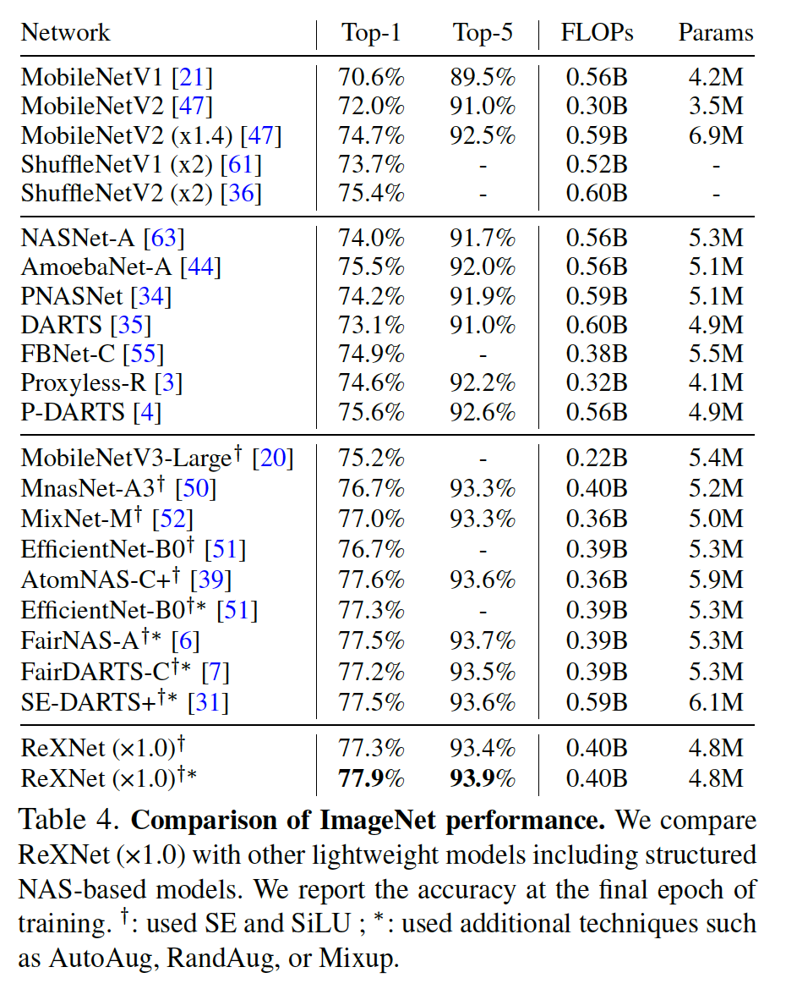

​		此外，我们使用RandAug [10]训练我们的模型，以与使用诸如Mixup[60]、AutoAug [9]和RandAug [10]的额外正则化（在表4中用$\ast$表示）的基于NAS模型进行公平比较，我们的模型将包括EfficientNet-B0（利用AutoAug）、FairNas-A、FairDARTS-C和SE-DARTS内的所有模型至少提高了+ 0.4pp6。令人吃惊的是，我们的模型不需要进一步搜索，但是它要么比基于NAS的模型好，要么与给予NAS的模型相当。

**与EfficientNet比较**	我们将ReXNets与EfficientNets [51]进行了模型可扩展性与性能的比较。为此，我们采用宽度乘子的概念进行缩放。请注意，与使用$224\times224$至$600\times600$分辨率训练的EfficientNets不同，我们所有模型都是以固定分辨率$224\times224$训练的。我们不使用FixResNet [53]这样的方法来执行额外的训练。

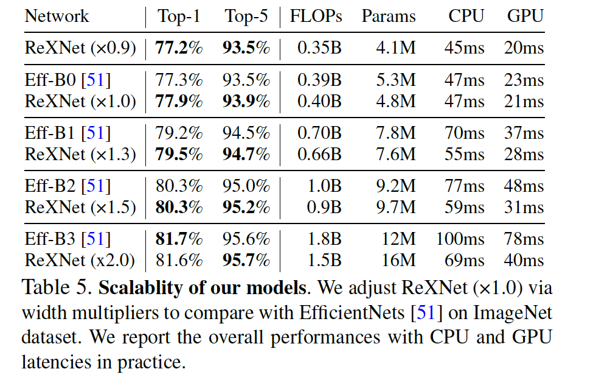

​		表5显示了我们的乘数从×0.9调整到×2.0的模型，并具有明显的精度增量（请参阅附录B.3中的更多模型）。我们衡量CPU和GPU推理时间以展示效率，我们平均Intel Xeon CPU E5-2630上以批大小1允许100次的平均延迟，以及V100 GPU上以64的批大小允许100次的平均延迟。图3展示了我们模型与EfficientNets相比的计算效率， 随着模型大小的增加，我们发现我们的模型比EfficientNets快得多。注意，ReXNet（x2.0）在CPU和GPU上分别快1.4倍和2.0倍，而准确率几乎相同，并以相似的速度降EfficientNet-B1的top-1准确率提高2.5pp。这种优势可能来自固定的分辨率和网络深度，可以对所有模型进行训练和推断，从而可以减少内存访问时间。

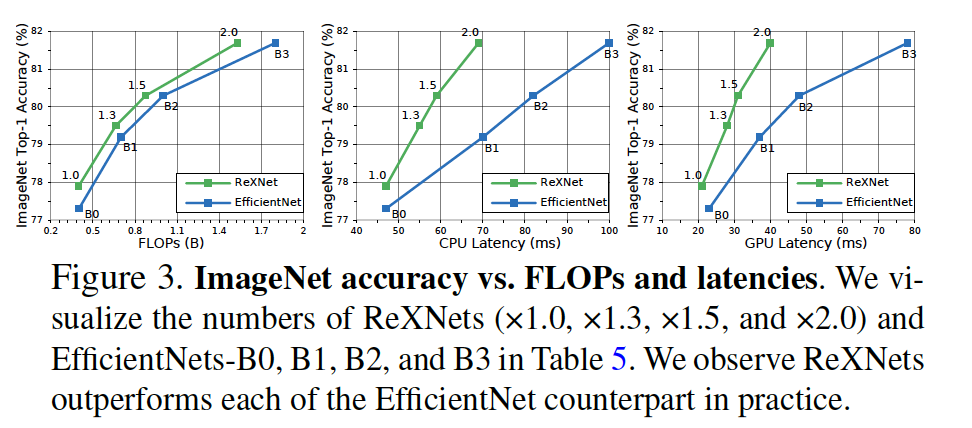

#### 5.2. COCO目标检测

**训练SSDLite**	

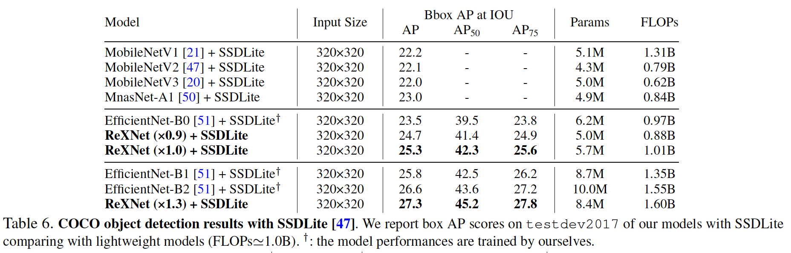

**训练Faster RCNN**

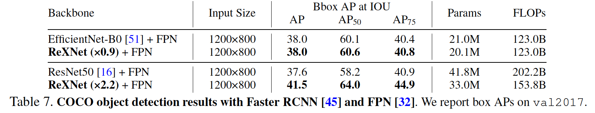

#### 5.3. 细粒度分类

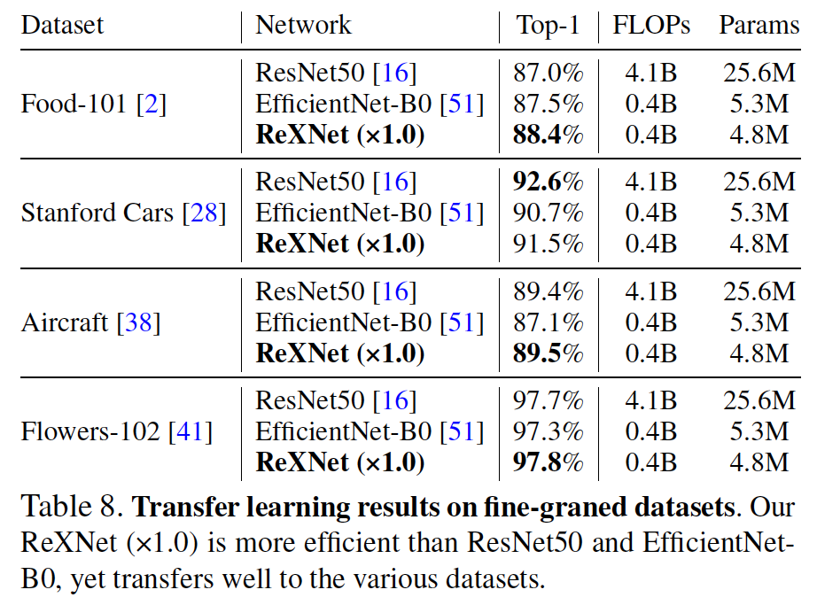

#### 5.4. COCO实例分割

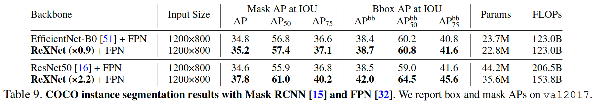

### 6. 讨论

**Fixing network depth and searching models** 	我们通过在不同约束条件下搜索新模型来进一步验证线性通道参数化。我们将网络深度固定为18和30，并针对18深度模型使用30M、50M和70M的FLOP约束； 对于30深度模型，分别为100M、150M和200M。最终，图4显示所有前10％的模型具有相同的形状，这些形状是线性函数，但是由于FLOP不同而具有不同的斜率。 这表明，针对各种计算需求，线性通道配置的性能优于常规配置。

**Rank Visualization**	我们通过分析训练模型的秩来研究模型的表现力。 该分析旨在了解线性参数化如何影响秩。我们以两种方式可视化从训练后的模型计算出的秩： 我们从第4节中的18个深度模型中显示了准确度与秩（以nuclear norm表示）的分布，然后，通过可视化从ImageNet验证集中的图像特征计算出的归一化为$[0,1]$的奇异值的累积分布，我们将MobileNetV2与ReXNet（×0.9）进行了比较。 如图5所示，我们观察到1）精度更高的模型具有更高的秩； 2）ReXNet明显扩大了基线范围内的秩。

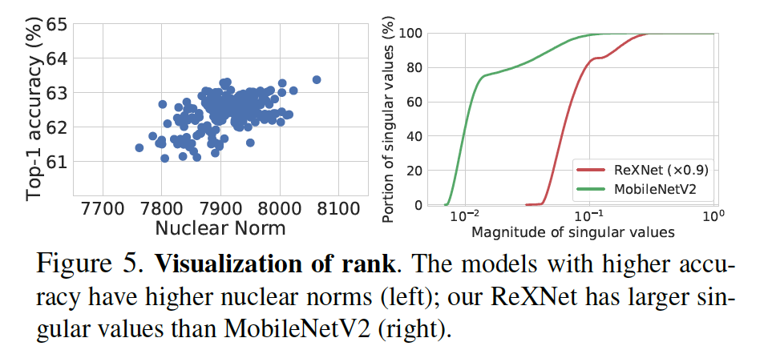

### 附录

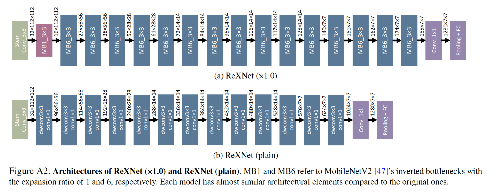		