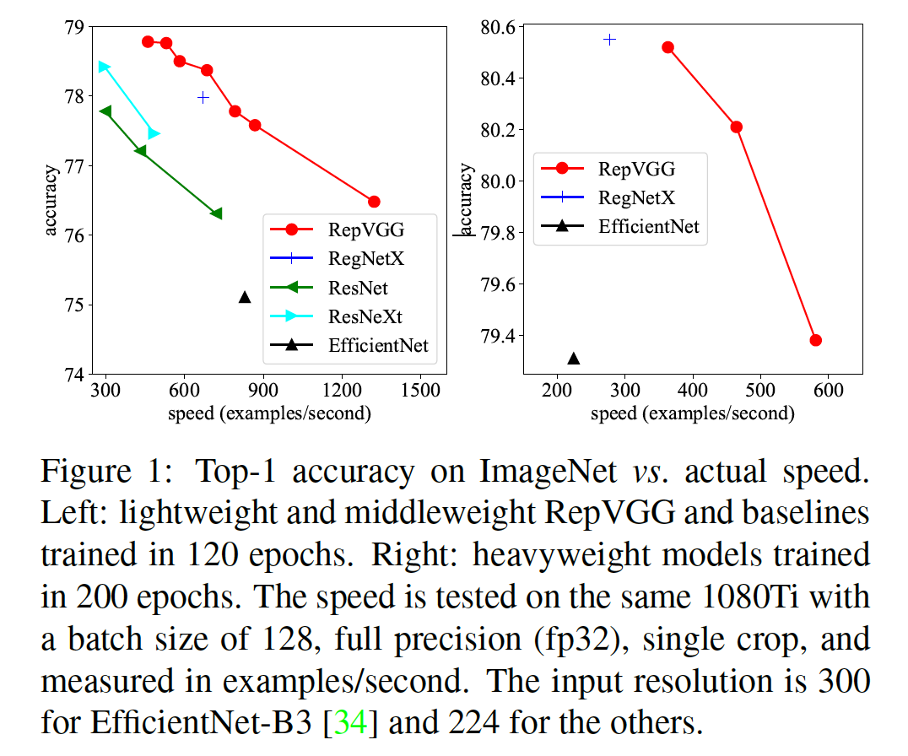
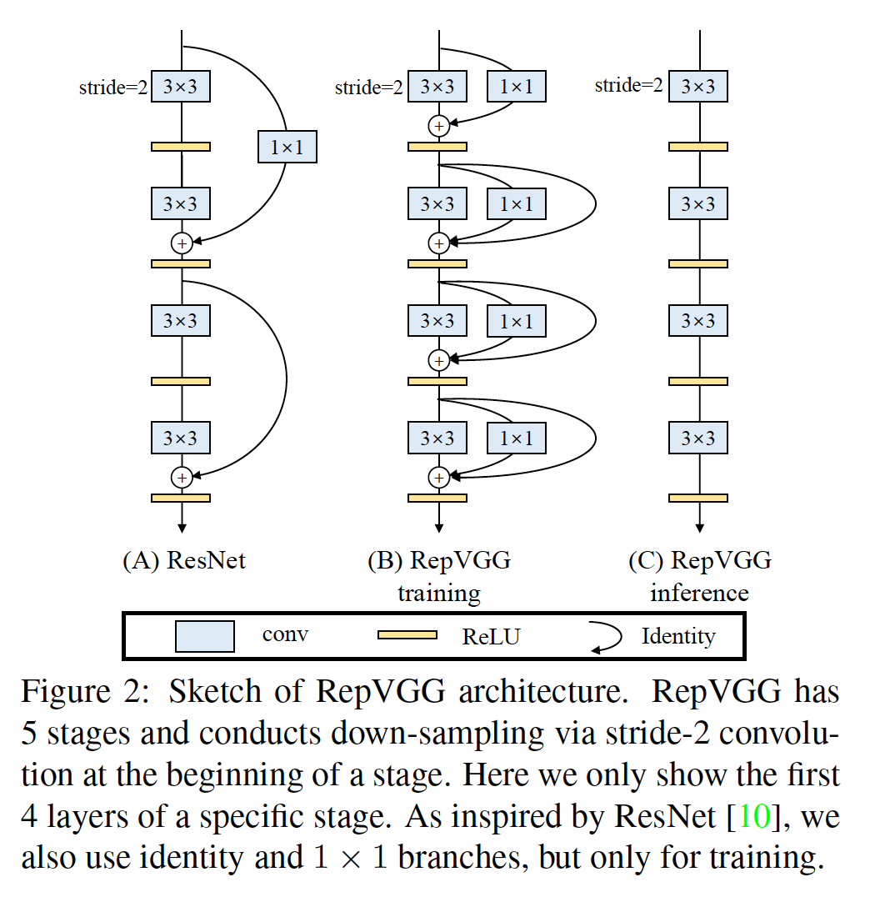
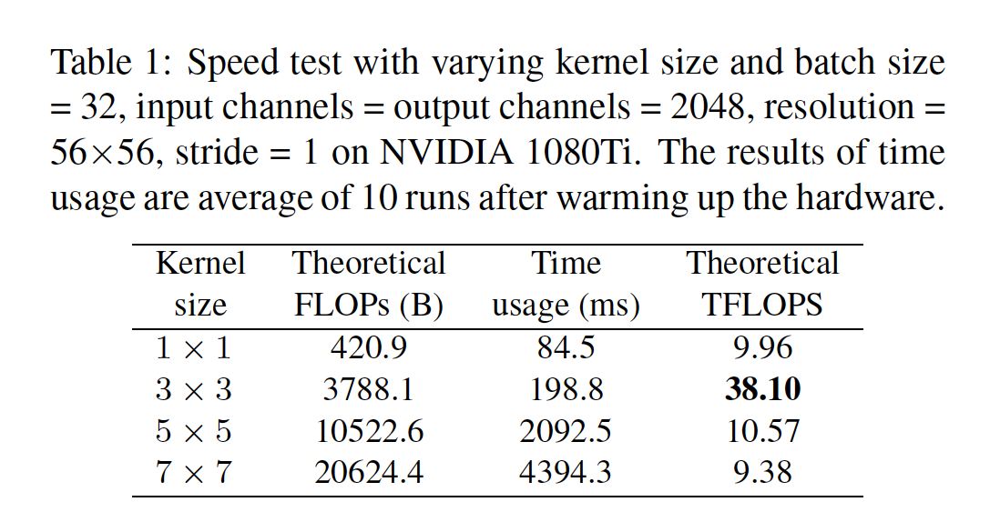
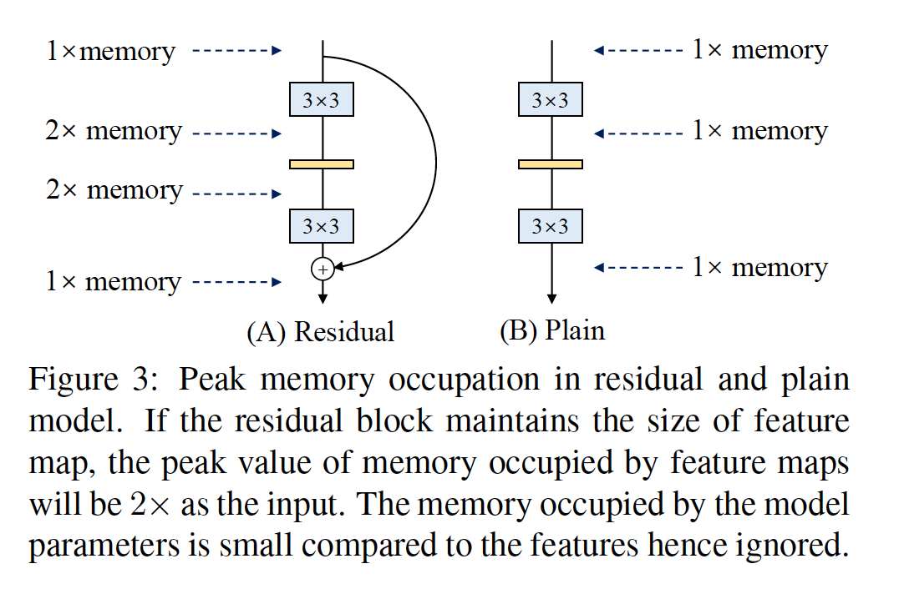
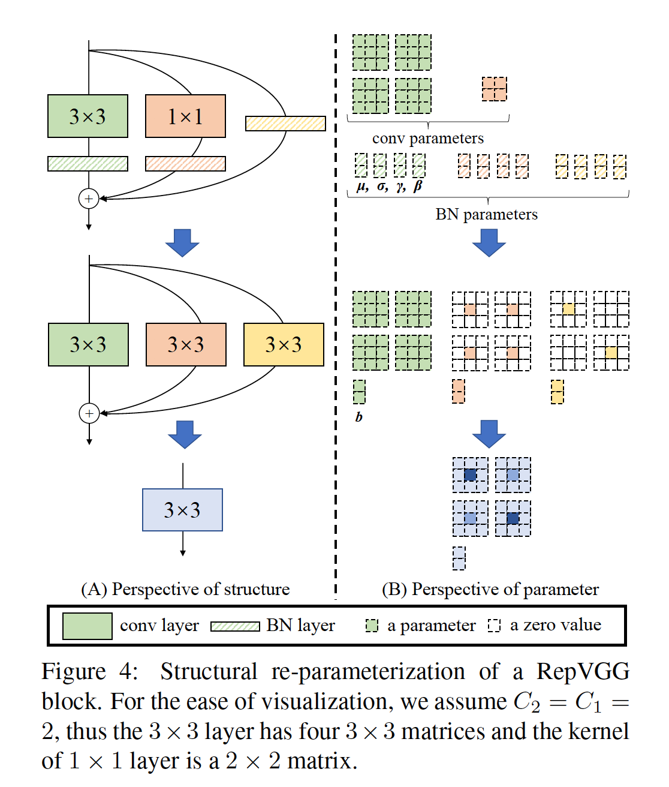
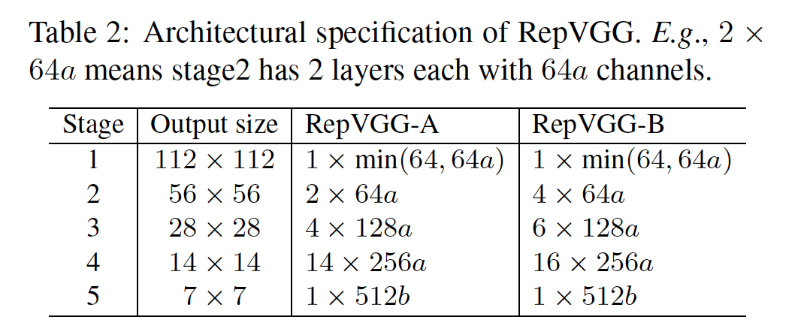
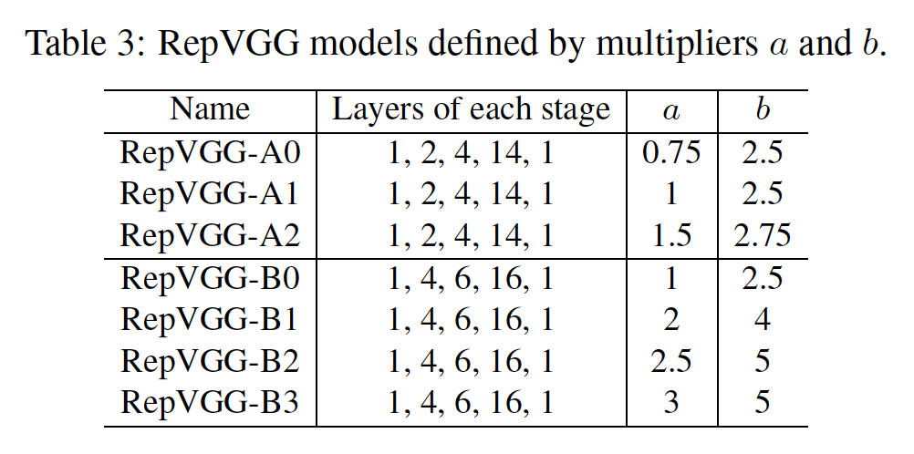
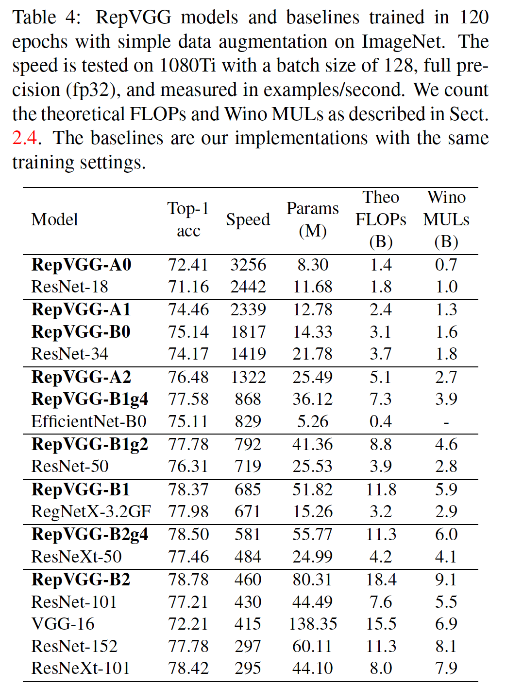
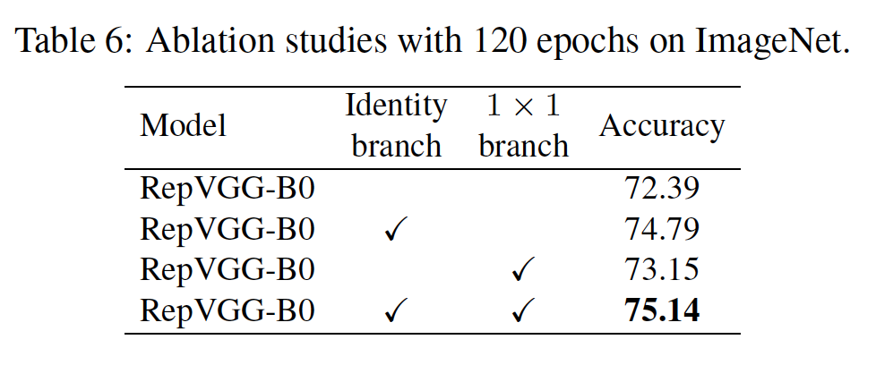
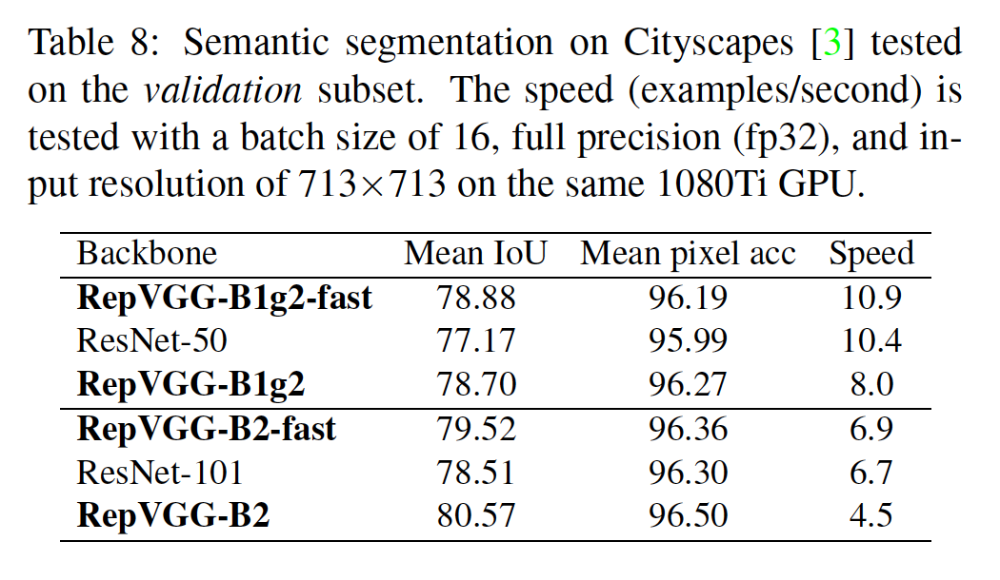

## RepVGG: Making VGG-style ConvNets Great Again

### 摘要

​		我们提出了一个简单而强大的卷积神经网络架构，它具有类似于VGG的推理时间主体，该主体仅由$3\times3$卷积和ReLU的堆栈组成，而训练时间模型具有多分支拓扑。如此的训练时间和推理时间架构的解藕由结构化的重参数化（re-parameterization）技术，使得模型称为RepVGG。在ImageNet上，RepVGG达到80%的top-1准确率，据我们所知，其为平坦模型第一次达到这一水平。在NVIDIA 1080Ti GPU上，RepVGG模型比ResNet-50快83%，比ResNet-101快101%，具有更高的准确率，并且与EfficientNet和RegNet等最新模型相比，显示出良好的精度-速度折衷。代码和训练模型见https://github.com/megvii-model/RepVGG。

### 1. 引言

​		ConvNets已成为许多任务的主流解决方案。VGG[30]利用包含堆叠conv、ReLU和池化的简单架构在图像识别中获得巨大成功。有了Inception [32、33、31、17]、ResNet [10]和DenseNet [15]，许多研究兴趣都转移到了设计良好的体架构上，从而使模型变得越来越复杂。通过自动化[43、28、22]或手工[27]架构搜索，或者在基架构上搜索复合缩放策略[34]。

​		尽管许多复杂的ConvNet都比简单的ConvNet提供更高的准确性，但缺点也很明显。1）复制的多分支设计（例如ResNet中的残差加法，Inception中的分支拼接）使模型难以实现和自定义，减慢推理和减小内存使用。2）一些组件（例如Xception和MobileNets中的depthwise conv，以及ShuffleNets中的通道打乱。有如此多的因素影响推理速度，FLOPs的数量不能准确地反映实际速度。尽管一些新颖的模型有比老版本（如VGG和ResNet-18/34/50）更低的的FLOPs，它们的运行速度可能不会更快（表3）。因此，在学术和工业上，VGG和原始的ResNets仍大量用于真实世界的应用。

​		本文中，我们提出RepVGG，一种VGG风格的架构，其优于许多复杂的模型（表1）。RepVGG有如下优势：

- 模型有与VGG风格的平坦（即前向过程）拓扑结构，而没有任何分支，即每一层仅采用它的前一层的输出作为输入，并该层的输出仅传入下一层。
- 模型的主体仅使用$3 \times 3$ conv和ReLU。
- 没有自动搜索[43]、手动优化[27]、复合缩放[34]或其他繁琐的设计，就可以实例化具体的架构（包括特定的深度和层宽）。

​    平坦的模型达到多分支架构同等水平的性能是具有挑战性的。一种解释是，多分支拓扑结构（例如ResNet）使模型隐式地集成多个更浅层的模型[35]，使得训练多分支模型可以避免梯度消失问题。

​		因为多分支架构的好处都是为训练，而缺点不是推理所需的，所以我们提出_通过结构化的重参数化解藕训练时的多分支与推理时的平坦架构_，其意味着通过变换网络的参数将一种架构转换到另一种。具体而言，网络结构与一组参数耦合，例如，conv层由四阶内核张量表示。如果某个结构的参数可以转换为与另一种结构耦合的参数集，那么我们可以利用后者等价的替换前者，使得整体网络架构被改变。

​		具体而言，我们使用恒等映射和$1 \times 1$分支构建训练时的RepVGG，其受ResNet的启发，但是以不同的方式实现，该方式可以通过结构化的重参数化移除分支（图2、4）。训练之后，我们利用简单的代数方法进行变换，如恒等分支可以视为退化的$1\times1$ conv，后者可以进一步视为退化的$3 \times 3$ conv，这样我们就可以使用原始$3 \times 3$卷积核、恒等映射和$1\times1$分支以及批归一化（BN）[17]层的训练参数来构建单个$3\times3$卷积核。因此，变换后的模型有$3 \times 3$ conv层的堆叠，保存它用来测试和部署。

​		值得注意的是，推理时的RepVGG的主体仅包含单一类型的操作：$3 \times 3$ conv和ReLU，其使RepVGG在通用计算设备（如GPU）上快速运行。更好的是，RepVGG允许专用硬件实现更高的速度，因为给定芯片尺寸和功耗，我们需要的操作类型越少，我们可以集成到芯片上的计算单元就越多。即一个专用于RepVGG的推理芯片可以具有大量的$3\times3$-ReLU单元和更少的存储单元（因为普通拓扑在存储方面很经济，如图3所示）。我们的贡献总结如下：

- 我们提出RepVGG，与最先进的技术相比，这种简单的架构具有良好的速度精度折衷。
- 我们提出使用结构重新参数化将训练时的多分支拓扑与推理时的平坦架构解耦。
- 我们在图像分类和语义分割上证明RepVGG的有效性，以及效率和实现的容易性。

### 2. 相关工作

#### 2.1. From Single-path to Multi-branch

​		在VGG[30]将ImageNet分类的top-1准确率提高到70%之上后，在使ConvNets复杂化以实现高性能方面有许多创新，例如，现代的GoogLeNet [32]和后来的Inception模型[33、31、17]采用了精心设计的多分支体架构，ResNet [10]提出了简化的两分支结构， DenseNet [15]通过将较低层与大量较高层连接起来，使拓扑结构变得更加复杂。神经架构搜索（NAS）[43、28、22、34]和手工设计空间设计[27]可以生成具有更高性能的ConvNets，但是要花费大量计算资源或人力资源。一些NAS生成的大型模型甚至无法在普通GPU上训练，因此限制其应用。除了实现不便外，复杂的模型可能减少并行程度，因此减慢推理速度。

#### 2.2. 单路径模型的有效训练

​		已经进行了一些尝试来训练没有分支的ConvNets。但是，现有技术主要试图使非常深的模型以合理的精度收敛，但是没有比复杂的模型获得更好的性能。因此，方法和结果模型既不简单也不实际。例如，提出一种初始化方法[36]来训练极深的平坦ConvNets。借助基于均场理论（mean-field-theory-based）的方案，训练10000层网络再MNIST上获得99%的准确率，在CIFAR-10上获得82%的准确率。尽管这些模型不切实际（即使LeNet-5 [19]在MNIST上可以达到99.3％的准确度，而VGG-16在CIFAR-10上也可以达到93％以上的准确度），但是理论上的贡献是有见地的。最近的工作[24]结合几种技术，包括Leaky ReLU、max-norm和仔细的初始化。在ImageNet上，具有147M参数的平坦ConvNet可以达到75.6% top-1准确率，其比报告的基线（ResNet-101、76.6%、45M参数）低2%。

​		值得注意的是，本文不仅说明了简单模型可以很好地收敛，而且也没有打算训练像ResNets这样的非常深的ConvNet。相反，我们的目标是建立一个具有合理深度和有利的精度-速度平衡的简单模型，可以通过最常见的组件（例如常规conv和BN）和简单的代数简单地实现该模型。

#### 2.3. Model Re-parameterization

​		DiracNet[38]是与我们的方法相关的重参数化。它通过将卷积核编码为$\hat{W} = \mbox{diag}(\mathbf{a})I + \mbox{diag}(\mathbf{b})W_{\mbox{norm}}$，其中$\hat{W}$为用于卷积（一个四阶张量可以视为）的最终权重，$\mathbf{a}$和$\mathbf{b}$为学习到的向量，$W_{\mbox{norm}}$为归一化的可学习核。与具有相当数量参数的ResNet是相比，DiracNet的top-1准确率在CIFAR-100低2.29%（78.46% vs. 80.75%），在ImageNet上低0.62%（DiracNet-34的72.21% vs. ResNet-34的72.83%）。DiracNet与我们的方法的不同之处在于：1）我们的_结构_重新参数化是通过实际的数据流通过一个具体的结构实现的，该结构随后可以转换为另一个结构，而DiracNet仅使用conv核的另一个数学表达式来简化优化。即结构重参数化的平坦模型是实际训练时多分支模型，但是DiracNet不是。2）DiracNet的性能比正常参数化的平坦模型高，但是比相当的ResNet低，而RepVGG模型大幅优于ResNets。Asym Conv Block（ACB）[9]采用不对称的conv来强化常规conv的“skeleton”，从某种意义上说，其可以视为另一种形式的结构重参数化，其将训练的模型转换一个conv。与我们的方法相比，差异是ACB设计用于组件级改进，并且可以用作任何架构中conv层的直接替代，而我们的结构重参数化对于训练平坦的ConvNets至关重要，如4.2节所示。

#### 2.4. Winograd Convolution

​		RepVGG仅使用$3 \times 3$卷积，因为GPU和CPU上的某些现代计算库（例如NVIDIA cuDNN [1]和Intel MKL [16]）对其进行了高度优化。表1展示在1080Ti GPU上，利用cuDNN 7.5.0测试理论上的FLOPs、实际运行时核计算密度（以Tera FLoating-point Operations Per Second，TFLOPs）。它证明$3 \times 3$卷积的理论计算密度大约为其他卷积的4倍，这表明总的理论FLOP不能替代不同架构中的实际速度。加速$3 \times 3$ conv的经典算法是Winograd算法[18]（仅如果步长尾1），如cuDNN核MKL的库都很好的支持。例如利用标准的$F(2\times2,3\times3)$ Winograd，$3 \times 3$卷积的乘法数量（multiplications：MULs）减小到原始的$\frac{4}{9}$。因为乘法远比加法耗时，我们计算MULs以测量具有Winograd支持的计算成本（表4、5中表示为Wino MULs）。注意，特定的计算库和硬件确定是否为每个算子使用Winograd，因为小规模的卷积可能由于内存开销而无法加速。

### 3. Building RepVGG via Structural Re-param

#### 3.1. Simple is Fast, Memory-economical, Flexible

​		使用简单ConvNets有至少三种理由：它们快速、内存经济和灵活。

​		**Fast**	许多最近的多分支架构的FLOP比VGG低，但是可能速度并不比VGG快。例如VGG-16的FLOP是EfficientNet-B4快8.4倍，但是在1080Ti上的速度比EfficientNet-B3快1.8倍（表4），其意味着前者的计算密度是后者的15倍。除了通过Winograd卷积带来的加速，FLOP之间的差异和速度可以归功于两个主要因素，它们对速度有很大影响，但FLOP并未考虑这些因素：内存访问成本（MAC）和并行度[23]。例如，尽管分支加法或拼接需要的计算可以忽略，但是MAC是显著的。此外，在分组卷积中，MAC构成了大部分时间使用。另一方面，在相同的FLOP下，具有高并行度的模型的速度远比其他具有低并行度的模型快。因为多分支结构广泛用于Inception和自动生成的架构，其使用多个小型的算子，而不是少量大型操作。前面的工作[23]报告了，碎片操作（即一个构建块中单个卷积或池化操作的数量）的数量为13，其对于具有强并行计算能力的设备（如GPU）是不友好的，并引入诸如内核启动和同步的额外开销。相比之下，ResNet中的碎片数量为2或3，并且我们使它为1，即单个卷积。

​		**Memory-economical**	多分支拓扑是内存无效的，因为需要保持每个分支的结果直到加法或拼接，这明显提高的内存占用的峰值。例如残差块的输入需要保留到加法，如图3所示。假设该块保持特征图的大小，则内存占用的峰值为输入的2倍。相比之下，普通拓扑允许操作完成后立即释放特定层的输入所占用的内存。当设计专门的硬件时，普通ConvNets允许深度内存优化，并减小内存单元成本，使得我们可以集成更多的计算单元到芯片。

​		**Flexible**	多分支拓扑对架构规范施加了约束。例如，ResNet需要将卷积层组织为残差块，其限制了灵活性，因为每个残差块的最后的卷积层不得不产生生成相同形状的张量，否则shortcut加法将没有意义。更糟糕的是，多分支拓扑限制了通道裁剪的使用[20、12]，其为删除一些不重要通道的使用技术，并且一些方法可通过自动发现每层中合适的宽度来优化模型。但是，多分支模型使裁剪变得棘手，并导致明显的性能下降或低加速比[6、20、8]。相比之下，普通的架构允许我们根据我们的需要自由的配置每个卷积层，并进行裁剪以获得性能-效率的平衡。

#### 3.2. Training-time Multi-branch Architecture

​		Plain ConvNets有许多强项，但是一个致命的弱点是：性能不佳。例如，具有现代组件（如BN[17]），VGG-16可以在ImageNet上达到72%的top-1准确率，其似乎已经过时了。我们的结构重参数化方法受ResNet启发，其显式的构建shortcut分支来将信息流建模为$y = x + f(x)$，并使用残差块来学习$f$。当$x$的维度和$f(x)$不匹配时，它变为$y = g(x) + f(x)$，其中$g(x)$为由$1\times1$卷积实现的卷积shortcut。ResNet成功的一种解释是，如此的多分支架构使模型成为多个更浅层模型的隐式集成[35]。具体而言，有$n$个块，模型可以解释为$2^n$个模型的集成，因为每个块分支流入两个路径。

​		因为多分支拓扑有推理的缺点，但是分支似乎有益于训练[35]，我们使用多分支来是多个模型仅为训练时集成。为了使大多数成员变得更浅或更简单，我们使用ResNet风格的恒等（仅当维度匹配时）和$1\times1$分支，使得构建块训练时的信息流为$y = x + g(x) + f(x)$。我们简单地堆叠几个如此的构建块来构建训练时模型。根据与[35]相同的观点，模型称为具有$n$个如此块的$3^n$个成员的集成。在训练之后，它等价于转换为$y = h(x)$，其中$h$有单个卷积层实现，并且通过一系列代数方法从训练好的参数推到它的参数。

#### 3.3. Re-param for Plain Inference-time Model

​		本小节中，我们描述如何将训练好的块转换为单个$3 \times 3$卷积层以进行推理。注意，我们在加法之前，我们在每个分支中使用BN（图4）。形式上，我们使用$W^{(3)}\in\mathbb{R}^{C_2 \times C_1 \times 3 \times 3}$来表示$C_1$个输入通道和$C_2$个输出通道的的$3\times3$卷积层的核，并且$W^{(1)} \in \mathbb{R}^(C_2 \times C_1)$为$1\times1$分支的卷积核。我们使用$\bold{\mu}^{(3)}, \sigma^{(3)},\gamma^{(3)},\beta^{(3)}$分别表示$3\times3$卷积层后的BN层的累计均值、标准差核学习到的缩放因子和偏置项。使用$\bold{\mu}^{(1)}, \sigma^{(1)},\gamma^{(1)},\beta^{(1)}$分别表示$1\times1$卷积层后的BN层的累计均值、标准差核学习到的缩放因子和偏置项。使用$\bold{\mu}^{(0)}, \sigma^{(0)},\gamma^{(0)},\beta^{(0)}$分别表示恒等分支后的BN层的累计均值、标准差核学习到的缩放因子和偏置项。令$M^{(1)} \in \mathbb{R}^{N \times C_1 \times H_1 \times W_1}$、$M^{(2)} \in \mathbb{R}^{N \times C_2 \times H_2 \times W_2}$分别为输入和输出，$\ast$为卷积操作。如果$C_1 = C_2$、$H_1=H_2$、$W_1 = W_2$，我们有

$$\begin{align}M^{(2)} &= bn(M^{(1)} \ast W^{(3)}, \mu^{(3)},\sigma^{(3)}, \gamma^{(3)}, \beta^{(3)}) \\ &+ bn(M^{(1)} \ast W^{(1)}, \mu^{(1)},\sigma^{(1)}, \gamma^{(1)}, \beta^{(1)}) \\ &+ bn(M^{(1)} \ast W^{(0)}, \mu^{(0)},\sigma^{(0)}, \gamma^{(0)}, \beta^{(0)}).\end{align}\tag{1}$$ 

否则，我们简单地使用非恒等分支，因此上书等式仅有前两项。这里$bn$为推理时的BN函数，形式上，对于$\forall 1 \le i \le C_2$，

$$bn(M,\mu,\sigma,\gamma,\beta)_{:,i,:,:} = (M_{:,i,:,:}-\mu_i)\frac{\gamma_i}{\sigma_i} + \beta_i.\tag{2}$$

​		我们首先将每个BN及其前一层卷积层转换为具有偏置向量的卷积。令$\{W',b'\}$为从$\{W,\mu,\sigma,\gamma,\beta\}$转换的核和偏置项，我们有

$$W'_{i,:,:,:} = \frac{\gamma_i}{\sigma_i}W_{i,:,:,:}, b_i' = -\frac{\mu_i\gamma_i}{\sigma_i} + \beta_i.\tag{3}$$

​		然后，很容易验证$\forall 1 \le i \le C_2$，有

$$bn(M \ast W, \mu,\sigma,\gamma,\beta)_{:,i,:,:} = (M\ast W')_{:,i,:,:} + b_i'.\tag{4}$$

​		上述变换还用于恒等分支，因为恒等映射可以视为以单位矩阵作为核的$1 \times 1$卷积。在如此的变换之后，我们将有一个$3 \times 3$核、两个$1\times1$核以及三个偏置向量。然后，我们通过加上这三个偏置向量获得最终偏置，最后一个3x3内核，方法是将1x1内核添加到3x3内核的中心点，可以很容易地实现，方法是先将两个1x1内核零填充到3x3，然后将三个内核加起来，如图4所示。注意，此类转换的等效条件要求$3\times3$和$1\times1$层具有相同的步长，并且后者的填充配置应比前者少一个像素。例如对于将输入填充一个像素的$3 \times 3$层，其为最常用的情况，$1 \times 1$层应当有padding=0。

#### 3.4. Architectural Specification

​		表2展示RepVGG的规格，包括深度和宽度。RepVGG是VGG风格的，从某种意义上说，它采用简单的拓扑并大量使用$3\times3$卷积，但是它不像VGG那样使用max pooling，因为我们希望主体仅具有一种类型的操作。在5个阶段中，我们都使用$3 \times 3$卷积层，并且阶段的第一层以stride = 2下采样。对于图像分类，我们使用全局平均池化，接着是全连接层作为头部。对于其他任务，特定于任务的头部可用于任何层产生的特征。

​		我们根据如下三种简单的指导决定每个阶段的层数：1）第一阶段以高分辨率运行，这非常耗时，因此我们仅使用一层来降低延迟。2）最后一阶段应当有更多通道，因此我们仅使用一层来节约参数。3）我们遵循ResNet及其最新变体[10、27、37]（例如，ResNet-101在其$14 \times 14$分辨率阶段使用69层），将最多的层放到倒数第二个阶段（在ImageNet上具有$14\times14$的输出分辨率）。我们令五个阶段分别有1、2、4、14、1层，从而构建称为RepVGG-A的实例。我们还构建更深的RepVGG-B，其在阶段2、3和4中比RepVGG-A多两层。我们使用RepVGG-A来完成与其他轻量和中量模型（ResNet-18/34/50）比较，并且RepVGG-B越高性能的模型比较。

​		我们通过均匀缩放$[64,128,256,512]$的经典宽度设置（例如VGG和ResNets）来确定层宽度。我们使用乘子$a$来缩放前四个阶段，$b$缩放最后一个阶段，并且通常设置$b>a$，因为我们期望最后一层有更丰富的特征用于分类或其他下游任务。因为RepVGG在最后阶段仅有一层，更大的$b$既没有明显增加延迟，也没有增加参数量。具体而言，阶段2、3、4、5的宽度分别为$[64a,128a,256a,512b]$。为了避免大型特征图上的大卷积，如果$a<1$，我们缩小阶段1，但是，$a>1$时，我们不放大它，使得阶段1的宽度为$\min(64,64a)$。

​		为了进一步减小参数和计算，我们可以选择groupwise $3 \times 3$卷积层与密集层的交互以牺牲准确率提高效率。具体而言，我们将RepVGG-A的第3、5、7、......、21层以及RepVGG-B的额外的第23、25和27层的组数为$g$。为简单起见，我们将此类层的$g$全局设置为1、2或4，而无需逐层调整。我们不使用相邻的逐层卷积层，因为那样会禁用通道间的信息交换并带来副作用[40]：某个通道的输出只能从一小部分输入通道中得出。注意，$1 \times 1$分支应当与$3 \times 3$卷积相同的$g$。

### 4. 实验

​		在本节中，在ImageNet上，我们将RepVGG的性能与其他基线进行比较，通过一系列消融研究和比较证明结构重新参数化的重要性，并验证RepVGG在语义分割上的泛化性能[41]。

#### 4.1. RepVGG for ImageNet Classification

​		我们将RepVGG与经典和最先进的模型进行比较，其中包括ImageNet-1K [5]上的VGG-16 [30]、ResNet [10]、ResNeXt [37]、EfficientNet [34]和RegNet [27]，其中包含用于训练的128万张高分辨率图像和用于1000个类的50K验证图像。 我们分别使用EfficientNet-B0 / B3和RegNet-3.2GF / 12GF作为中量级和重量级最新模型的代表。 我们改变乘数$a$和$b$来生成一系列RepVGG模型以与基线进行比较。 如表3中总结。

​	我们首先将RepVGG与最常用的基准ResNets [10]进行比较。为了与ResNet-18比较，对于RepVGG-A0，我们设置$a=0.75,b=2.5$。对于ResNet-34，我们使用更宽的RepVGG-A1。为了使RepVGG的参数量略少于ResNet-50，我们构建$a=1.5,b=2.75$的RepVGG-A2。为了与其他更大模型比较，我们构建宽度递增的更深的RepVGG-B0/B1/B2/B3。对于具有交错groupwise层的RepVGG模型，我们将g2/g4附加到模型名后作为后缀。

​		对于训练轻量和中量模型，我们仅使用简单的数据增强流水线，包括随机裁剪和左右翻转，遵循PyTorch的示例[26]。我们在8张GPU使用256的全局batchsize，学习率初始化为0.1，并且使用余弦退火策略训练120个epoch，momentum系数为0.9的SGD，以及卷积和全连接层的权重核上使用$10^{-4}$的权重衰减。对于重量级模型，包括RegNetX-12GF、EfficientNet-B3和RepVGG-B3，我们使用5个周期的热启动，并使用余弦学习率训练200个周期、label smoothing和mixup、Autoaugment的数据增强流水线、随机裁剪和翻转。RepVGG-B2及其g2/g4变体在两种设置上训练。我们先在1080Ti GPU上以128个批次的大小测试每个模型的速度，方法是先送入50个批次以预热硬件，然后记录50个批次的时间使用情况。为了公平比较，我们在相同GPU上测试所有模型，并还将基线的所有conv-BN序列转换卷积+偏置（式3）。

​		如表4和图1所示，RepVGG表现出良好的准确率-速度的平衡。例如，RepVGG-A0在准确率和速度方面比ResNet-18好1.25%和33%，RepVGG-A1比ResNet-34好0.29%/64%，RepVGG-A2比ResNet-50好0.17%/83%。具有交错groupwise层（g2/g4），RepVGG模型会进一步加速，而准确性会适当降低。例如，RepVGG-B1g4比ResNet-101好0.37%/101%，RepVGG-B1g2速度式ResNet-152的2.66倍，且有相同的准确率。尽管参数量不是我们主要考量，但是上述的RepVGG模型比ResNet在参数上更有效。与经典的VGG-16相比，RepVGG-B2仅有VGG-16 58%的参数，允许速度快10%，准确率高6.57%。与用RePr [25]（一种基于修剪的精心设计的训练方法）训练的VGG模型（据我们所知，它是精度最高（74.5％）的类VGG模型）相比，RepVGG-B2的准确率也要好4.28％。

​		与最先进的基准相比，RepVGG考虑到其简单性也显示出良好的性能：RepVGG-A2比EfficientNet-B0好1.37％/ 59％，RepVGG-B1比RegNetX-3.2GF好0.39％，并且运行稍微快一点。

​		值得注意的是，RepVGG模型以200个epoch达到了80％以上的精度（表5），这是平原模型首次据我们所知赶上最新技术。

#### 4.2. Structural Re-parameterization is the Key

​		本节中，我们验证我们的结构重参数化技术的意义（表6）。使用上述相同的简单训练设置，从头开始训练所有模型120个epoch。首先，我们通过从RepVGG-B0的每个块中删除恒等和/或$1\times1$分支来进行消融研究。

​		然后，我们构建了一系列变体和基线，用于在RepVGG-B0上进行比较（表7）。 同样，所有模型都在120个时期内从头开始训练。

- **Identity w/o BN**删除恒等分支中的BN。
- **Post-addition BN**删除三个分支中的BN层，并将BN层附加在加法之后。即，BN的位置从加法前（pre-addition）更改为加法后（post-addition）。
- **+ReLU in branches**将ReLU插入每个分支（在BN之后和加法之前）。因为如此的块不能被转换为单个卷积层，没有实际用途，我们仅希望了解更多的非线性是否会带来更高的性能。
- **DiracNet** [38]采用了经过精心设计的卷积核重新参数化，如第2.2节所述。 我们使用其官方PyTorch代码构建层以替换原始的$3\times3$卷积。
- **Trivial Re-param**为通过将单位核直接加到$3 \times 3$核的更简单的卷积核参数化，其可以视为DiracNet（$\hat{W} = I + W$[38]）的退化版。
- **Asymmetric Conv Block**（ACB）[9]可以视为结构重参数化的另一种形式。我们将其与ACB进行比较，以查看结构重新参数化的改进是否归因于组件级的超参数化（即，额外的参数使每个$3\times3$卷积更强）。
- **Residual Reorg**通过以类似于ResNet的方式重新组织每个阶段来构建每个阶段（每个块2层）。具体而言，结果模型在第一和最后阶段具有一个$3\times3$层，在stage2、3、4具有2、3、8个残差块，并使用与ResNet-18 / 34一样的快捷方式。

#### 4.3. 语义分割

​		我们验证了ImageNet预训练的RepVGG在Cityscapes [3]上的语义分割的泛化性能，其中包含5K精细注释的图像和19个类别。我们使用PSPNet框架、一个以0.01为基学习率和指数为0.9的多项式学习率、权重衰减为$10^{-4}$、8个GPU的全局批大小为16、40个epoch。为了公平比较，我们仅将ResNet-50/101骨干改为RepVGG-B1g2/B2，并保持其他设置相同。

​		遵循PSPNet-50/101[41]的官方设置，其在ResNet-50/101的后两个阶段中使用膨胀卷积，我们也在RepVGG-B1g2/B2的后两个阶段中的所有$3\times3$卷积层中使用膨胀。由于当前的$3 \times 3$膨胀卷积的实现效率不高（尽管与$3\times$常规卷积有相同的FLOP），所以如此的修改会减慢推理速度。为了更容易比较，我们构建另外两种具有PSPNet（在表8中表示为_fast_），其仅在后5层（即stage4的最后4层和stage5的唯一层）上进行膨胀，使得PSPNets的运行速度要比ResNet-50 / 101骨干网的运行速度快。

