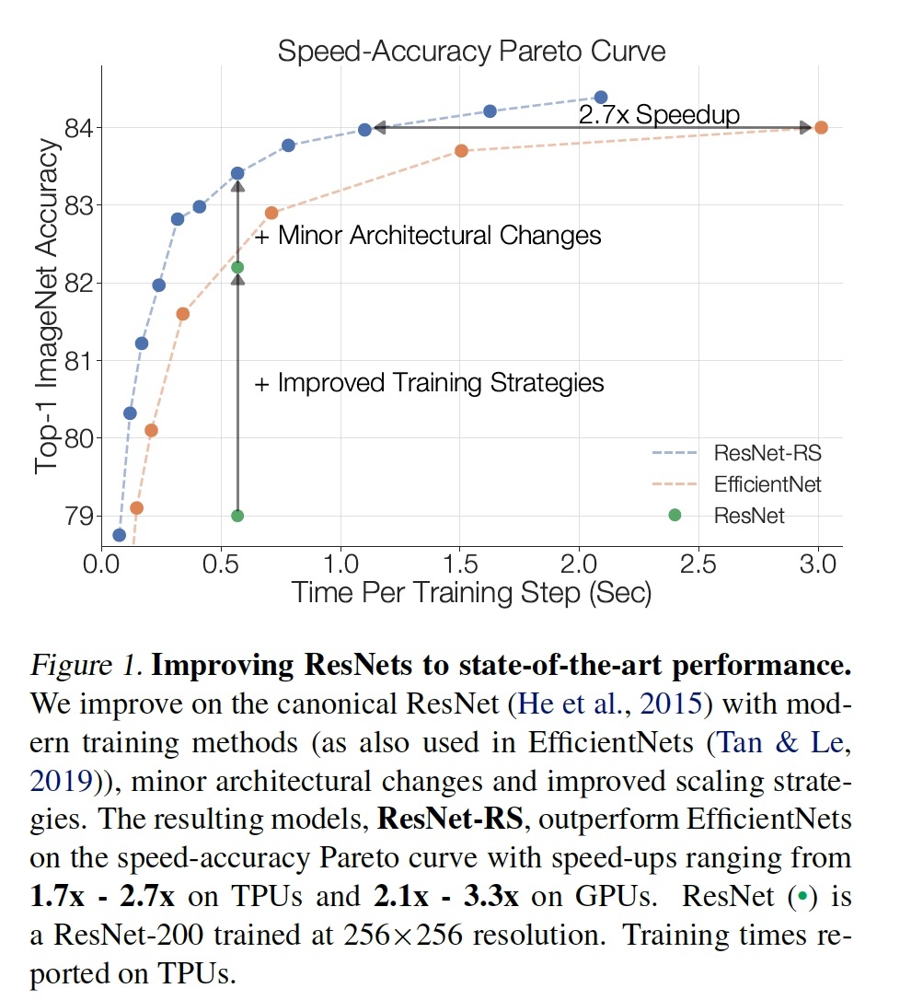

## Revisiting ResNets: Improved Training and Scaling Strategies

### 摘要

​		新颖的计算机视觉架构独树一帜，但是模型架构的影响通常与训练方法和扩展策略的同时更改混为一谈。我们的工作回顾经典的ResNet（He等人，2015年），并研究了这三个方面，以期弄清它们之间的关系。或许令人吃惊的是，我们发现训练和缩放测量可能比架构的更改更重要，此外，产生的ResNet匹配SOTA模型。我们证明，最佳性能的缩放策略取决于训练方案，并提供了两种新的缩放策略：（1）在可能发生过拟合的方案中缩放模型深度（否则宽度缩放更可取）； （2）提高图像分辨率的速度比以前建议的要慢（Tan＆Le，2019）。使用改进的训练和缩放策略，我们设计一族ResNet架构（ResNet-RS），其在TPU上比EffcientNets块1.7倍到2.7倍，同时在ImageNet上获得相似的准确率。在大尺度半监督学习设置中，ResNet-RS获得86.2%的top-1 ImageNet准确率，同时比EfficientNet-NoisyStudent块4.7倍。训练技术提高一系列下游任务（一流的SOTA自监督算法）的性能，并扩展到Kinetics-400的视频分类上。我们建议从业者使用这些简单的经过修订的ResNets作为将来研究的基准[^1]。

[^1]: 代码见 https://github.com/tensorflow/tpu/tree/master/models/official/resnet/resnet_rs。

### 1. 引言

​		视觉模型的性能是架构、训练方法和缩放策略的产物。但是，研究通常强调架构改变。新颖的架构是许多进步的基础，但通常会与训练方法和超参数的详细信息的其他关键更改（同时很少公开）同时引入。此外，有时将通过现代训练方法增强的新架构与具有过时训练方法的旧架构进行比较（例如ResNet-50，ImageNet Top-1的准确度为76.5％（He等2015））。我们的工作处理这些问题，并在流行的ResNet架构上实证研究_训练方法_和_缩放策略_。

​		我们调查今天广泛使用的现代训练和正则化技术，并将它们用于ResNet（图1）。在此过程中，我们遇到了训练方法之间的相互作用，并显示了与其他正则化技术结合使用时减少权重衰减值的好处。表1中对训练方法的补充研究揭示了这些决策的重大影响：通过_改进的训练方法_将标准ResNet的79.0%的top-1 ImageNet准确率提高到82.2%（+3.2%）。通过两种小型和常用的架构改进（ResNet-D和Squeeze-and-Excitation）将准确率进一步提高到83.4%。图1在速度精确度Pareto曲线。

​		我们提供缩放视觉架构上的新观点和实践建议。虽然先前的工作从小型模型（Tan＆Le，2019）或从少量epoch的训练（Radosavovic等2020）推断缩放规则，但我们通过在整个训练期间（例如350个epoch而不是10个epch）中详尽地训练各种规模的模型来设计缩放策略。通过这样做，我们发现了性能最佳的缩放策略与训练机制之间的强依赖性（例如epoch、模型大小、数据集大小）。这些较小的方案中的任何一个都错过了这些依赖性，从而导致次优的缩放决策。我们的分析产生一种新的_缩放策略_，总结如下总结为（1）在可能发生过拟合时缩放模型深度（否则缩放宽度是更好的选择）和（2）缩放图像分辨率的速度比以前的工作要慢（Tan＆Le，2019）。

​		使用改进的训练和缩放策略，我们设计重缩放（re-scaled）的ResNet（ResNet-RS），如图1所示，这些模型针对各种模型尺寸进行了训练。ResNet-RS模型在训练期间使用更少的内存，并且在TPU上比流行的EfficientNets快1.7倍到2.7倍（GPU上快2.1倍到3.3.倍）。在大尺度半监督训练设置中，相比EfficientNet-B5，当在ImageNet和额外的130M伪标签图像的联合训练上，ResNet-RS在TPU上获得4.7倍的训练加速（在GPU获得5.5倍加速）。

​		最后，我们将通过一系列实验来测试改进的训练和扩展策略的泛化能力。我们首先使用我们的缩放策略来设计EfficientNet的更快版——EfficientNet-RS，其改善原始速度-准确率的帕累托曲线。接着，我们证明，改进的训练策略在一系列下游任务上的表现与自监督算法（SimCLR（Chen等，2020a）和SimCLRv2（Chen等，2020b））相媲美或优于后者。改进的训练策略也能扩展到视频分类。将训练策略用于Kinetics-400数据集上的3D-ResNet上产生从73.4%到77.4%的改进。

​		通过合并较小的架构更改（自2018年以来使用）以及改进的训练和扩展策略，我们发现ResNet架构为视觉研究设定了最先进的基准。这一发现凸显了区分这些因素中的每一个的重要性，以便了解哪些架构比其他架构的性能更好。

​		我们的贡献如下：

- 对正则化技术及其相互影响的实证研究，得出的正则化策略无需更改模型架构即可实现强大的性能（+ 3％top-1精度）。
- 一种简单的缩放策略：（1）当可能发上过拟合时，缩放模型深度（否则倾向缩放模型宽度）以及（2）缩放图像分辨率比先前的工作更慢（Tan & Le，2019）。缩放策略改进ResNets和EfficientNet时的速度-准确率帕累托曲线。
- **RetNet-RS**：通过应用训练和扩展策略，ResNet架构的Pareto曲线比TPU上的EfficientNets（GPU上的2.1x-3.3x）快1.7倍至2.7倍。
- 使用额外的130M伪标签图像对ResNet-RS进行半监督训练可达到86.2％的top-1 ImageNet准确率，而在TPU上（对应GPU上为5.5x）要比对应的EfficientNet-NoisyStudent快4.7倍（Xie等2020）。

- ResNet检查点表明，在对各种计算机视觉任务进行微调时，SimCLR（Chen等2020a）和SimCLRv2（Chen等2020b）的最新自监督表现都可以与之媲美或胜过 。
- 通过扩展我们的训练方法和架构改变到视频分类实现3D ResNet-RS。产生模型将top-1 Kinetics-400的准确率提高了4.8％。

### 2. Characterizing Improvements on ImageNet

​		自从AlexNet在ImageNet上取得突破以来，人们提出各种各样的改进来进一步提高图像识别的性能。这些改进大致沿四个正交轴出现：_架构_、_训练/正则化方法_、_缩放策略_和_使用额外的训练数据_。

**架构**	受到最多关注的工作可能是新颖的架构。自AlexNet以来的引人注目的方案包括VGG、ResNet、Inception和ResNeXt。用于设计架构的自动搜索策略进一步推动了最先进技术的发展，尤其是NasNet-A（Zoph等2018）、AmoebaNet-A（Real等2019）和EfficientNet（Tan和Le 2019）。也有采用超越标准ConvNets用于图像分类的努力，例如将自注意力用于视觉域，或者使用入lambda层的替代方案。

**训练和正则化方法**	训练和正则化方法方面的创新推动了ImageNet的进步。当训练模型更多epoch时，诸如dropout、label smoothing、stochastic depth、dropblock和数据增强的正则化策略已显著提高泛化能力。虽然在短期的非正在训练设置中对架构进行基准测试有助于与以前的工作进行公平的比较，但尚不清楚在较大规模和改进的训练设置下是否能够持续保持体架构的改进。例如，RegNet架构在短时间的非正在训练设置中表现出比基线强大的加速性能，但未在最新的ImageNet设置中进行过测试（最佳top-1为79.9％）。

**缩放策略**	增加模型的维度（例如宽度、深度和分辨率）已成为另一种提高质量的成功轴。纯粹的缩放已被证明可以改善神经语言模型的性能（Kaplan等，2020），从而刺激了更大模型的设计，包括GPT-3（Brown等，2020）和Switch Transformer（Fedus等，2021）。相似地，计算机视觉中的缩放已被证明是有用的。Huang等（2018）设计并训练了557M参数的模型（AmoebaNet），其获得84.4%的 top-1 ImageNet准确率。通常，ResNet体系结构通过增加层次（深度）来扩大规模：以层数为后缀的ResNet已从ResNet-18前进到ResNet-200，甚至更深（He等2016； Zhang等2020； 贝洛2021）。相反，Wide ResNets和MobileNets缩放宽度。增加图像分辨率已成为可靠的进步源。因此，随着训练预算的增长，图像分辨率也随之提高：EfficientNet使用600图像分辨率（Tan＆Le，2019）、ResNeSt（Zhang等人，2020）和TResNet（Ridnik等2020）都使用448图像分辨率。为了系统化这些启发式方法，EfficientNet提出了复合缩放规则，该规则建议平衡网络深度，宽度和图像分辨率。但是，7.2节证明这种缩放策略不仅对于ResNets，对于EfficientNets也是次优的。

**额外训练数据**	进一步提高准确率的另一种流行方式是在额外的数据源（完全标签、弱标签或无标签）上训练。在大尺度数据集上预训练已显著推进SOTA，ViT和NFNets最近分别获得88.6%和89.2%的ImageNet准确率。Noisy Student（一种半监督学习方法）通过使用130M额外无标签图像上的伪标签获得88.4%的ImageNet top-1准确率。Meta pseduo-labels（一种改进的半监督学习技术）最近保持ImageNet SOTA（90.2%）。我们在表4结算半监督学习结果，并在第8节中讨论如何将我们的训练和缩放策略迁移到大型数据。

### 3. 改进ResNets的工作

​		改进的训练方法与ResNet的架构更改相结合，通常产生了具有竞争力的ImageNet性能。He等（2018）通过修改stem和下采样块，同时也使用label smoothing和mixup获得79.2% top-1 ImageNet准确率（比ResNet-50基线提高3%）。Lee等（2020）利用额外的架构修改（例如SE、selective kernel和anti-alias 下采样），同时也使用label smoothing、mixup和dropblock，获得81.4%的准确率。Ridnik等（2020）对ResNet架构进行了几处架构修改，并采用了改进的训练方法，以在速度-精度Pareto曲线上胜过EfficientNet-B1至EfficientNet-B5模型。

​		但是，大多数工作都很少强调确定强大的扩展策略。相比之下，我们仅考虑自2018年以来常规使用的轻量级架构更改，而是专注于训练和缩放策略以构建模型的帕累托曲线。 我们改进的训练和扩展方法使ResNet的速度比TPU上的EfficientNets快1.7倍至2.7倍。 我们的缩放比例改进与上述方法正交，我们希望它们是可加的。

### 4. 方法

#### 4.1. 架构

​		我们的工作研究ResNet架构，以及两种广泛采用的架构ResNet-D和Squeeze-and-Excitation。这种架构更改在许多架构中得到使用，包括TResNet、ResNeSt和EfficientNets。

**ResNet-D**将如下四种调整结合到原始的ResNet架构。第一，将stem中的$7 \times 7$卷积替换为3个$3 \times 3$卷积。第二，在下采样块的残差路径中，前两个卷积的步长大小被切换。第三，在下采样块中，skip connection中的步长为2的$1\times1$卷积被替换为步长为2的$2\times2$平均池化和无步长的$1\times1$卷积。第四，删除不长为2的$3\times3$最大池化层，并在接下来的瓶颈块中的第一个$3\times3$卷积中使用下采样。我们将这些修改绘制在图6中。

**Squeeze-and-Excitation**（Hu等2018）通过跨整个通道的交互，通过平均池化来平均整个特征图的信号来重新对通道加权。对于所有实验，我们基于原始实验，使用0.25的Squeeze-and-Excitation比例。我们有时会使用原始的没有SE的ResNet实现（称为ResNet）来比较不同的训练方法。 在这种情况下，表标题中会使用清晰的符号。

#### 4.2. 训练方法

​		我们研究正则化和数据集增强方法，其通常用于SOTA分了模型和半/自监督学习。

**Matching the EfficientNet Setup**	我们的训练方法非常接近EfficientNet，其中我们训练350个epoch，但是有一些差异（1）我们使用余弦学习率调度，而不是指数衰减，这样没有额外超参数；（2）在所有模型中，我们使用RandAugment，而EfficientNets最初是通过AutoAugment进行训练的。我们使用RandAugment重新运行EfficientNets B0-B4，发现它没有提供任何性能改进，并使用Cubuk等人（2019）[^2]的RandAugment结果报告了EfficientNet B5和B7；（3）为了简单起见，我们使用Momentum优化器，而不是RMSProp。有关我们的训练设置和EfficientNet之间的比较，请参阅附录C中的表10。

[^2]:这使得我们与EfficientNet-B6的比较更加细微，因为如果与RandAugment一起运行，B6的性能最有可能提高0.1-0.3％top-1（基于从B5和B7获得的改进）。

**正则化**	我们使用权重衰减、标签平滑、dropout和随机深度进行正则化。Dropout时计算机视觉中常用技术，我们将其用于全局平均池化后的输出上。随机深度以指定的概率丢弃网络中的每一层（周围具有残留连接），该概率是该层深度的函数。

**数据增强**	我们使用RandAugment数据集增强作为额外的正则化器。训练期间，我们将RandAugment独立地用于一系列随机图像变换（例如translate、shear、颜色扰动）。如更早提到的，原始的EfficientNet使用AutoAugment，这是一个学习到的增强过程，性能略逊于RandAugment。

**超参数调整**	为了为不同正则化和训练方法选择超参数，我们使用包含ImageNet训练集的2％（1024个中的20个分片）的留一验证集。这称为$\mbox{minival-set}$，并且原始的ImageNet验证集称为$\mbox{validation-set}$。所有ResNet-RS模型的超参数见附录B的表8。

### 5. Improved Training Methods

#### 5.1. Additive Study of Improvements

​		我们在表1中提供了有关训练，正则化方法和架构更改的附加研究。基线ResNet-200获得79.0%的top-1准确率。通过单独的训练方法而没有任何架构变化，我们将它的性能提高到82.2%（+3.2%）。当添加两种常用而简单的架构更改（Squeeze-and-Excitation和ResNet-D）时，我们将一般将性能提高到83.4%。单独使用训练方法带来$3/4$的总改进，其证明它们在ImageNet上的关键影响。

#### 5.2.	Importance of decreasing weight decay when combining regularization methods

​		表2突出显示了将正则化方法结合在一起时改变权重衰减的重要性。当使用RandAugment和label smoothing时，不再需要默认的1e-4的权重衰减。但是，当我们进一步添加dropout和/或随机深度时，性能可能衰减，除非我们进一步减少权重衰减。直觉是，因为权重衰减作为正则化器，当与其他技术结合时，为了不过度正则化，必须减小它的值。此外，Zoph等人（2020a）提出证据表明增加数据增强会缩小权重的L2范数，这使得权重衰减的某些影响变得多余。其他工作使用较小的权重衰减值，但没有指出使用更多的正则化时的影响（Tan等2019; Tan＆Le2019）。

### 6. Improved Scaling Strategies

​		前一节证明训练方法的显著影响，现在我们展示缩放策略也有相似的重要性。为了确定缩放趋势，我们在ImageNet上进行大量实验，其中宽度乘子$[0.25,0.5,1.0,1.5,2.0]$、深度为$[26,50,101,200,300,350,400]$、分辨率为 $[128,160,224,320,448]$。我们训练这些架构350个周期，模拟最先进的ImageNet模型的训练设置。我们随着模型的大小增加正则化以限制过拟合。正则化和模型超参数见附录E。

**FLOPs do not accurately predict performance in bounded data regime**	先前关于缩放定律的工作观察到了在无界数据体制下误差和FLOP之间的幂定律（Kaplan等，2020； Henighan等，2020）。为了测试这是否也在我们的场景成立，我们所有缩放配置下的ImageNet误差和FLOP，见图2。对于较小的模型，我们观察到误差和FLOP之间的总体幂律趋势，而对缩放比例配置的依赖性较小（即深度与宽度与图像分辨率之间的关系）。但是，对于大型模型，这种趋势被打破。此外，对于固定数量的FLOP，我们观察到ImageNet性能的巨大变化，尤其是在较高的FLOP机制中。因此，即使在控制相同数量的FLOP时，精确的缩放配置（即深度、宽度和图像分辨率）也会对性能产生很大影响。

**The best performance scaling strategy depends on the training regime**	接下来，我们直接查看目标硬件上的延迟[^3]，以确定可改善速度精度Pareto曲线的缩放策略。图3给出了在四个图像分辨率和三个不同的训练方式（10、100和350个epoch）上按宽度或深度缩放的模型的精度和时延。我们观察到，最佳表现的缩放策略，尤其是缩放深度和/或宽度，在很大程度上取决于训练方案。

[^3]: FLOP不是现代硬件上延迟的好指示器。更多详细讨论见7.1节。

#### 6.1. Strategy #1 - Depth Scaling in Regimes Where Overfitting Can Occur

**Depth scaling outperforms width scaling for longer epoch regimes**	在350个epoch设置（图3右侧）中，我们观察到深度缩放在所有图像分辨率上明显好于宽度缩放。缩放宽度可能会过拟合，即使正则化程度提高，有时也会影响性能。我们假设这是由于缩放宽度时参数的较大增加。 ResNet架构在所有块组中保持常量FLOP，并每个块组将参数量乘以4。缩放深度，尤其在更早层，因此相比缩放宽度，引入更少的参数。

**Width scaling outperforms depth scaling for shorter epoch regimes**	相比之下，当训练10个epoch时（图3左），宽度缩放更好。对于100个epoch（图3中），最佳性能的缩放策略在深度缩放和宽度缩放之间变化，其以来图像分辨率。缩放策略对训练体制的依赖性揭示了外推缩放规则的陷阱。我们指出，当在大尺度数据集（例如300M图像上训练约40epoch）上训练少量epoch时，先前的工作也选择缩放宽度，与我们的实验结果一致，即在较短的epoch内缩放宽度是可取的。特别地，Kolesnikov等（2019）训练具有4倍的滤波器乘子的ResNet152，而Brock等（2021）以约1.5倍的滤波器乘子缩放宽度。

#### 6.2. Strategy #2 - Slow Image Resolution Scaling

​		在图2中，我们还观察到更大的图像分辨率产生递减结果。因此，我们提出比先前工作更渐进地增加图像分辨率。这与EfficientNet提出的复合缩放规则（导致非常大型模型（例如EfficientNet-B7的600epoch，EfficientNet-L2的800epoch））比较。其他工作（诸如ResNeSt）和TResNet将图像分辨率放大到448。 我们的实验表明，更慢的缩放不仅改进ResNet架构，还可以提高基于速度精度的EfficientNets（第7.2节）。

#### 6.3. Two Common Pitfalls in Designing Scaling Strategies

​		我们的缩放分析在缩放策略的先前研究中发现了两个常见的陷阱：

**（1）Extrapolating scaling strategies from small-scale regimes**	在小尺度方案中（例如在小模型上或训练时期很少的情况下）发现的缩放策略可能无法泛化到更大的模型或更长的训练迭代中。先前的工作未能从最佳模型的缩放策略和训练机制之间建立依赖关系，后者从小型模型（Tan＆Le2019）或更短的训练epoch（Radosavovic等2020）推断出缩放规则。因此，我们不建议仅在小规模范围内生成缩放规则，因为这些规则可能会分解。

**（2）Extrapolating scaling strategies from a single and potentially sub-optimal initial architecture**	从次优的初始架构开始，可能会使缩放结果产生偏差。例如，由围绕EfficientNet-B0的小网格搜索得出的复合缩放规则，该规则是通过使用固定FLOP预算和特定图像分辨率的架构搜索获得的。但是，因为这种分辨率对于FLOP预算来说是次优的，产生的缩放策略可能是次优的。相比之下，我们的工作通过在不同宽度、深度和图像分辨率上训练模型来设计缩放策略。

#### 6.4. 改进的缩放策略的总结

​		对于一项新任务，我们建议在整个训练epoch中跨不同尺度运行一小部分模型，以直观了解哪些维度在整个模型缩放中最有用。尽管这种方法看起来更昂贵，但我们指出，通过不搜索架构可以抵消成本。

​		对于图像分类，缩放策略总结为（1）在可能放生过拟合的方案中缩放深度（否则，更倾向于缩放宽度），以及（2）放慢图像分辨率缩放。实验表明将这些缩放策略用于ResNets（ResNet-RS）和EfficientNets（EfficientNet-RS），其产生比EfficientNets更好的加速。我们注意到，在最近的工作中也采用了类似的缩放策略，这些工作可以通过LambdaResNets（Bello，2021）和NFNets（Brock等2021）等EfficientNets获得较大的提速。

### 7. 利用改进的训练和缩放策略进行实验

#### 7.1. ResNet-RS on a Speed-Accuracy Basis

​		使用改进的训练和缩放策略，我们设计ResNet-RS，跨越大范围模型尺度的重缩放ResNet家族（实验和架构细节见附录B和D）。图4在速度-准确的Pareto曲线上比较EfficientNet和ResNet-RS。我们发现ResNet-RS匹配EfficientNet的性能，同时在TPU上前者比后者快1.7倍-2.7倍。由于与ResNets相比，EfficientNets大大减少了参数数量和FLOP，因此在EfficientNet上进行如此大的加速可能是不直观的。接下来，我们讨论更少参数量和更少FLOP（EfficientNet）为什么在训练中更慢以及更加内存敏感。

**FLOPs vs Latency**	虽然FLOP提供评估计算要求的硬件无关度量，但是它们可能不是训练和推理的实际延时的指示。在自定义硬件架构（例如TPU和GPU）上，FLOP是一种特别糟糕的代理，因为操作通常受内存访问成本的限制，并且在现代矩阵乘法单元上具有不同级别的优化（Jouppi等2017）。与ResNet的瓶颈模块（在较小的激活方法上使用密集卷积）相比，EfficientNets中使用的倒置瓶颈（Sandler等2018）采用depthwise卷积和较大的激活，并且具有较小的计算与内存比（操作强度）。这使EfficientNet与ResNet相比，在现代加速器上效率更低。表3展示了这一点：在TPUv3硬件加速器上，ResNet-RS的FLOP是EfficientNet-B6的1.8倍，但是速度快了2.7倍。

**Parameters vs Memory**	参数计数并不一定决定训练过程中的内存消耗，因为内存通常由激活的大小决定[^4]。EfficientNets中使用的大型激活还引起更大的内存开销，与我们重新缩放的ResNets相比，使用大图像分辨率会加剧这种情况。与EfficientNet-B6相比，ResNet-RS模型具有比EfficientNet-B6多3.8倍的参数，而与ImageNet的精度类似，其消耗的内存却少了2.3倍（表3）。我们强调，由于诸如操作布局分配和内填充之类的编译器优化，内存消耗和延迟都与软件和硬件堆栈（TPUv3上的TensorFlow）紧密相关。

[^4]: 激活通常在训练期间存储，因为它们需要在反向传播中使用。推理时，激活可以被丢弃，并且参数量是实际内存开销的更好代理。

#### 7.2. 改进EfficientNets的效率

​		第6节的缩放分析反应，缩放图像分辨率会导致收益递减。这表明在EfficientNets中提倡的缩放规则是次优的，它不依赖于模型缩放而增加了模型的深度、宽度和分辨率。我们将慢图像分辨率缩放策略（策略2）用于EfficientNet，并在不更改宽度或深度的情况下，以降低的图像分辨率训练多个版本。对于图像分辨率224或者更小，RandAugment的幅度设置为10，对于大于320的图像分辨率设置为20，其他情况设置为15。其他所有参数与原始的EfficientNet相同。图5展示了重新缩放后的EfficientNets（EfficientNet-RS）在速度精度Pareto曲线上比原始EfficientNets有了显着改进。

#### 7.3. Semi-Supervised Learning with ResNet-RS

​		当我们在大型半监督学习设置中扩展到更大的数据集时，我们将测量ResNet-RS的性能。我们在结合1.2M有标注的ImageNet图像和130M伪标签图像的组合上训练ResNets-RS，与Noisy Student有相似的形式。我们使用与Noisy Student相同的130M伪标注图像，其中伪标签是从EfficientNet-L2模型生成的，其ImageNet准确度为88.4％。在标签和伪标签上联合训练模型，并且训练超参数保持相同。表4揭示ResNet-RS模型在半监督学习设置中也非常强大。我们获得86.2%的top-1 ImageNet准确率，同时在TPU上比对应的Noisy Student EfficientNet-B5模型快4.7倍（GPU上快5.5倍）。

#### 7.4. ResNet-RS的迁移学习

​		现在，我们研究改进的监督训练策略是否对于迁移学习产生更好的表示，并将它们与自监督学习算法比较。最近的自监督学习算法宣称抑制监督学习的迁移学习性能，并且创建更通用的表示。但是，自监督算法对于训练方法作出几种改变（例如更多epoch进行训练、数据增强），使得难以与有监督的学习进行比较。表5将改进的监督学习策略（表示为RS）的迁移学习性能与自监督的SimCLT和SimCLRv2进行比较。为了与SimCLR的训练设置紧密匹配并提供公平的比较，我们将RS训练策略限于其原始方法的一部分。具体而言，我们采用数据增强（RandAugment）、标签平滑、dropout、减小的权重衰减和余弦学习率衰减训练400epoch，但是没有使用随机深度或者权重的指数滑动平均。我们选择该子集以使其与SimCLR的训练设置非常匹配：更长的训练、数据增强和用于对比损失的温度参数。我们使用普通的ResNet架构，而没有使用ResNet-D修改或Squeeze-and-Excite，其匹配SimCLR和SimCLRv2架构。

​		我们在五种下游任务上评估迁移学习的性能：CIFAR-100、Pascal Detection & Segmentation、ADE Segmentation和NYU Depth。我们发现，即使当限制到更小的子集时，改进的训练策略改善迁移性能。改进的监督表示（RS）在5/10的下游任务上比SimCLR好，在8/10的任务上比SimCLRv2好。此外，改进的训练策略明显比标准监督ResNet表示好，这突出当与自监督学习相比时，使用现代训练技术的必要。虽然自监督学习可以用于无标签数据，我们的结果对以下观点提出了挑战，即当标签可用时，自监督算法比监督学习能产生更多通用表示。

#### 7.5. Revised 3D ResNet for Video Classification

​		最后，我们将训练策略应用于Kinetics-400视频分类任务，并使用3D ResNet作为基线体系结构（Qian等2020年）（有关实验详细信息，请参见附录G）。 表6给出了对RS训练方法和架构改进的补充研究。

​		训练策略扩展到视频分类，产生从73.4%到77.4%的改进（+4.0%）。ResNet-D和Squeeze-and-Excitation架构改变进一步将性能提高到78.2%（+0.8%）。与我们在图像分类上研究相似（表1），我们发现大多数改进在没有架构改变下获得。没有模型缩放，3D ResNet-RS-50仅比Kinetics-400上报告的最佳数量（80.4%）少2.2%。

### 4. 讨论

**为什么要区分训练方法和架构带来的改进，为什么很重要？** 训练方法可以比架构更加任务特定（task-specific）（例如数据增强在小数据集上更有帮助）。因此，来自训练方法的改进不一定像架构改进一样普遍。将新提出的架构与训练改进打包在一起，使架构之间的准确比较变得困难。如果不加以控制，训练策略所带来的重大改进可能会掩盖架构差异。

**应当如何比较不同架构？** 因为训练方法和尺度通常提高性能，当比较不同架构时，控制两个方面至关重要。可以通过不同的指标来实现尺度控制。虽然许多工作报告参数量和FLOP，我们认为延迟和内存开销通常更相关。我们的实验结果再次强调FLOP和参数不是延迟或内存开销的代表。

**改进的训练策略是否可以跨不同任务迁移？** 答案取决于可用的域和数据集大小。此处研究的许多训练和正则化方法未用于大规模预训练（例如300M图像）中（Kolesnikov等2019; Dosovitskiy等2020）。但是数据增数据对于小型数据集或训练许多epoch很有用，但是扩展方法的细节可能与任务相关（例如，尺度抖动而不是表6中的RandAugment）。

**缩放策略是否可以跨不同任务迁移？** 最佳表现的缩放策略依赖训练方案，并且是否过拟合是一个问题，如第6节讨论的。当在ImageNet上训练350个epoch时，我们发现缩放深度工作很好，而当训练较少epoch时（例如10个epoch），缩放宽度更适合。这与在大规模数据集上训练几个epoch时采用宽度缩放的工作是一致的（Kolesnikov等2019）。 我们不确定我们的缩放策略如何应用于需要更大图像分辨率（例如检测和分割）的任务，并将其留待以后的工作。

**架构改变是否有用？** 是的，但是训练方法和缩放策略可以有更大的影响。简单性通常是制胜法宝，尤其是考虑到定制硬件上出现的非同寻常的性能问题。通过扩展在可用硬件上进行了优化的更快、更简单的架构（例如卷积而不是GPU / TPU的深度卷积），可以克服降低速度和增加复杂性的架构更改。我们预见到，未来的成功架构将通过与硬件的协同设计出现，特别是在诸如手机之类的资源紧缩的情况下（Howard等2019）。

**应当如何分配计算预算以产生最佳的视觉模型？** 我们建议从简单的架构开始，该架构在可用硬件上有效（例如GPU / TPU上的ResNets），并训练多个模型以收敛，并以不同的图像分辨率、宽度和深度构建帕累托曲线。请注意，该策略与Tan＆Le（2019）不同，Tan＆Le（2019）分配了很大一部分计算预算来确定可扩展的最佳初始架构。然后，他们进行小型网格搜索，以找到所有模型尺度中使用的复合缩放系数。 RegNet（Radosavovic等2020年）在仅训练10个epoch时进行了大部分研究。

### B.  帕累托曲线中所有ResNet-RS模型的详细信息

**超参数**	表8介绍训练ResNet-RS模型用到的训练和正则化超参数。我们随着模型的尺度增加正则化。值得注意的是，与EfficientNet相比，我们有更少的超参数。我们对表7中两个最大模型（分辨率为320的ResNet-RS-350和分辨率为320的ResNet-RS-420）的minival-set进行early stopping。对于每种其他模型，我们简单地报告最终准确率。表9中，我们介绍两种ResNet-RS模型在ImageNet test-set上的top-1准确率。我们没有观察到过拟合信号。

### C. ResNet-RS训练和正则化方法

​		表10显示了ResNets\ResNet-RS和EfficientNets在训练和正则化方法上的差异。总体而言，我们与EfficientNet的培训设置非常匹配，同时进行了一些小的简化：使用余弦学习率而不是指数衰减、使用动量代替RMSProp。 两种简化都减少了超参数的总数，因为（1）余弦衰减没有与之相关的超参数，并且（2）Momentum的超参数比RMSProp小。

### D. ResNet-RS的架构细节

​		我们提供ResNet-RS架构改变的更多细节。我们重申ResNet-RS是以下各项的组合：改进的缩放策略、改进的训练方法、ResNet-D修改（He等2018）和Squeeze-Excitation模块（Hu等2018）。表11显示了我们整个工作中使用的所有ResNet深度的块布局。ResNet-50至ResNet-200使用He等（2015）的标准块配置。 ResNet-270及更高版本主要缩放c3和c4中的块数，我们尝试使它们的比率大致保持恒定。 从经验上我们发现，在较低级中添加块会限制过拟合，因为较低层中的块具有明显更少的参数，即使所有块的FLOP数量相同。图6展示我们的ResNet-RS模型中使用的ResNet-D架构更改。

### E. Scaling Analysis Regularization and Model Details

**350个epoch模型的正则化**	表12中列出了用于各种滤镜乘数（在所有图像分辨率和深度范围内）的dropout rate。

**10和100epoch的正则化**	我们没有使用RandAugment、Dropout、Stochastic depth或标签平滑。使用Flip和裁剪，以及4e-5的权重衰减。

**ResNet-300和ResNet-400的块分配**	对于ResNet-101和ResNet-200，我们使用表11中烤熟的块疯跑。对于ResNet-300，我们的块分配为$[4-36-54-4]$，对于ResNet-400，为$[6-48-72-6]$。