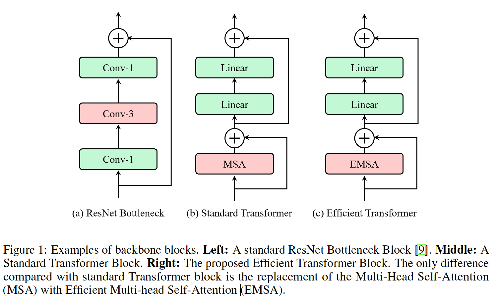
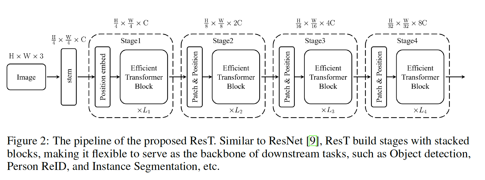
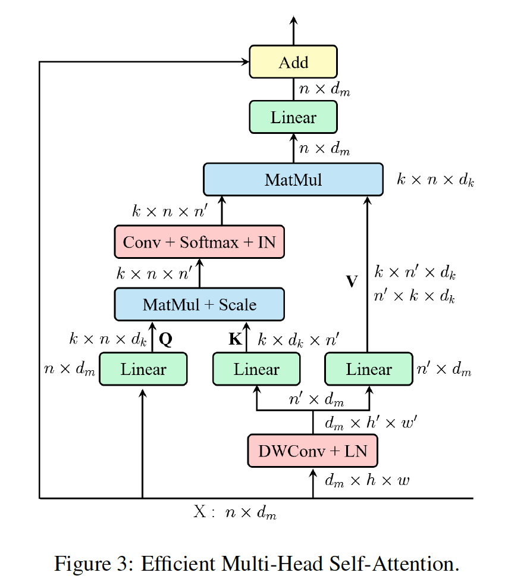
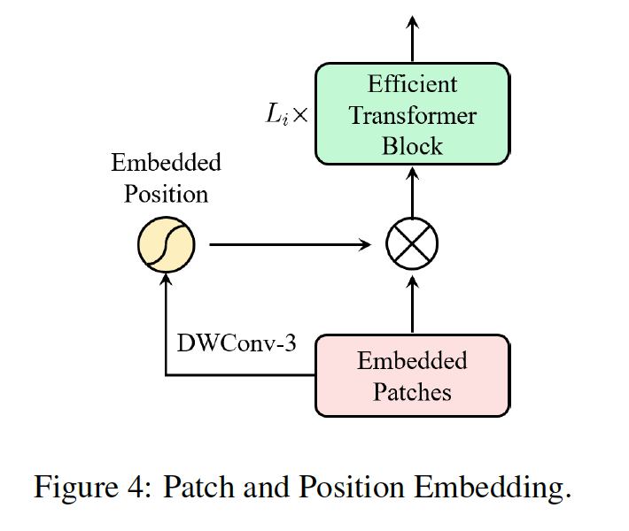
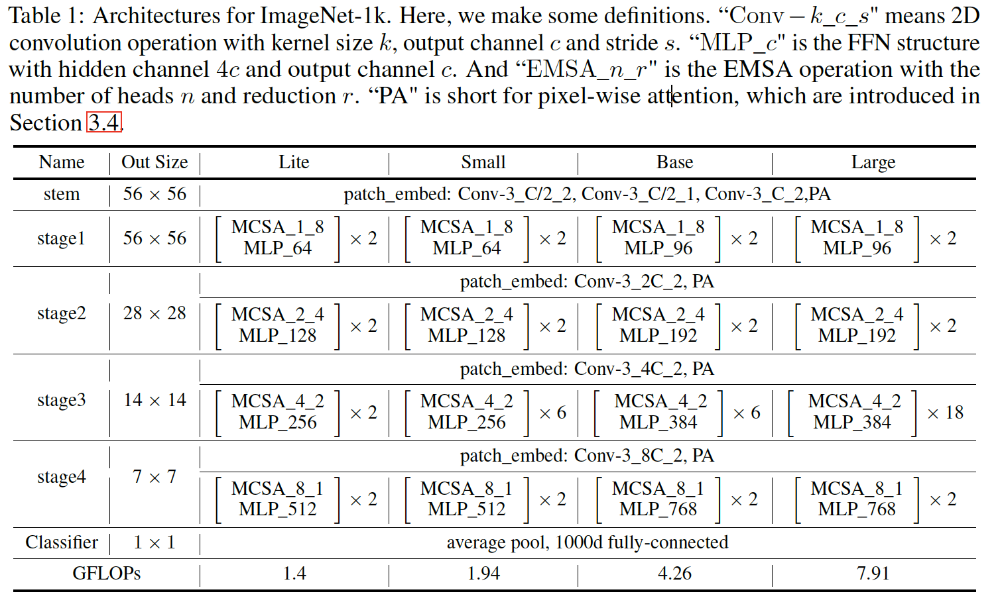
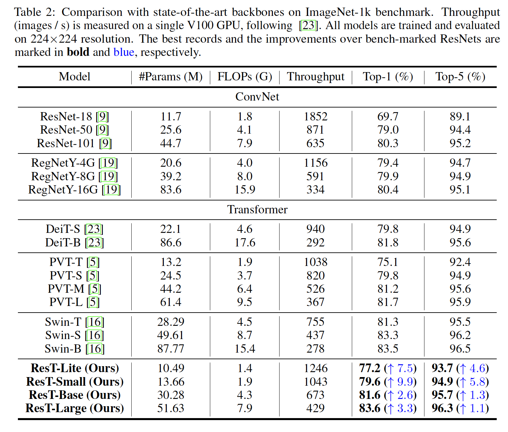
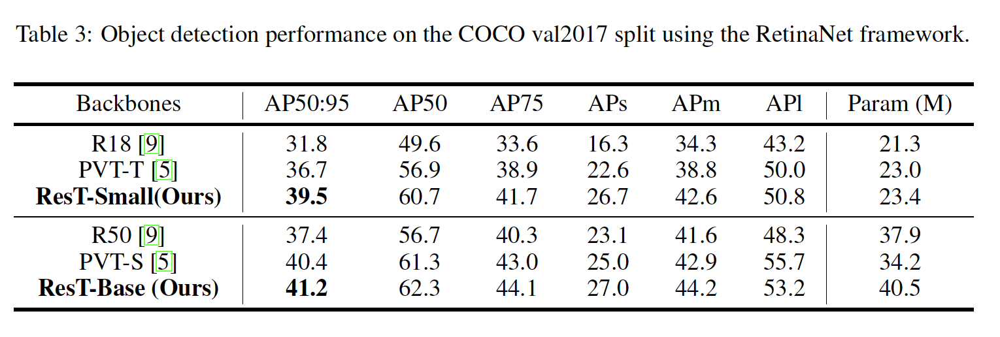
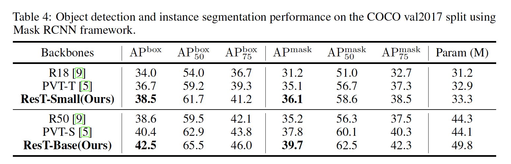
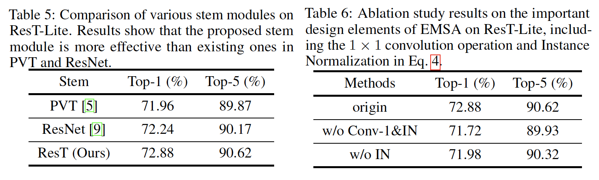
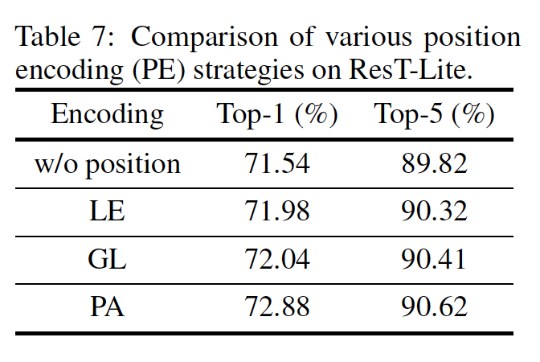

## ResT: An Efficient Transformer for Visual Recognition

### 摘要

​		本文提出一种高效的多尺度视觉Transformer（称为ResT），其能够作为图像识别的通用主干。与已有的Transformer方法不同，已有的方法利用标准的Transformer块来以固定分辨率处理原始图像，我们的ResT有几个优势：（1）构建内存高效的多头自注意力，其通过简单的depth-wise卷积压缩内存，并在保持多头的多样性能力的同时，跨注意力头维度映射交互；（2）将位置编码构建为空间注意力，其更灵活，并且可以处理任意大小的输入图像，而没有插值或微调；（3）与其在每个阶段开始时直接标记化，我们将补丁嵌入设计为在令牌映射上具有步幅的堆叠的重叠卷积操作。我们在图像分类和下游任务上全面验证了 ResT。实验结果表明，所提出的ResT可以大幅领先最近的SOTA骨干，这表明ResT的有作为强骨干的潜力。代码和模型见https://github.com/wofmanaf/ResT。

### 1	引言

​		

​		CNN由于其参数共享、局部信息聚合和维度规约，而通常更快。但是，由于CNN的有限和固定感受野，CNN在需要对远程依赖进行建模的场景中，CNN 块可能不太有效。例如，在实例分割中，能够从大邻域收集和关联场景信息对于学习跨对象的关系非常有用 [20]。而Transformer骨干能捕获这种长距离信息。

​		尽管表现出潜力超过CNN，但是Transformer骨干有四个主要缺点：（1）由于现有的 Transformer 主干直接对原始输入图像中的块进行标记化，因此很难提取形成图像中一些基本结构（例如角和边缘）的低级特征。（2）Transformer块中MSA的内存和计算与空间或通道维度成二次方，导致大量的训练和推理开销。（3）MSA中的每个头仅负责输入token的一个子集，这可能会损害网络的性能，特别是当每个子集中的通道维度太低时，使得查询和键的点积无法构成信息函数。（4）现有 Transformer 主干中的输入标记和位置编码都是固定尺度的，不适合需要密集预测的视觉任务。

​		本文提出一种高效的通用目的的骨干ResT（以 ResNet [9] 命名），可以解决上述问题。如图2所示，ResT 共享与 ResNet 完全相同的流水线，即用于提取低级信息和加强局部性的茎模块，然后是四个阶段来构建层次特征图，最后是用于分类的头模块。每个阶段包含补丁嵌入、位置编码模块和具有特定空间分辨率和通道维度的多个Transformer块。补丁嵌入模块通过分层扩展通道容量同时通过重叠卷积操作降低空间分辨率来创建多尺度特征金字塔。与只能处理固定比例图像的传统方法不同，我们的位置编码模块被构造为空间注意力，它以输入标记的局部邻域为条件。如此，所提出的方法更灵活，并能处理任意大小的输入图像，而没有插值或微调。此外，为了提高MSA的效率，我们构建高效的多头自注意力（efficient multi-head self-attention：EMSA），其通过简单的depth-wise卷积操作压缩内存。我们通过跨注意力头维度上投影交互来补偿每个头的输入标记的短长度（short-length）限制，同时保持多头的多样性能力。

​		在模型大小与 ResNet-18 (69.7%) 和 PVT-Tiny (75.1%) 相似的情况下，ResT-Small 在 ImageNet-1k 上获得了 79.5% 的 Top-1 准确率。

### 3 ResT

#### 3.1	Rethinking of Transformer Block

​		标准的 Transformer 模块由 MSA 和 FFN 两个子层组成。在每个子层周围采用残差连接。在MSA和FFN之前，使用LN。对于标记输入$\mbox{x}' \in \mathbb{R}^{n \times d_m}$，其中$n$、$d_m$分别表示空间维度、通道维度。每个Transformer块的输出为：

$$\mbox{y} = \mbox{x}' + \mbox{FFN}(\mbox{LN}(\mbox{x}')), \mbox{ and } \mbox{x}' = \mbox{x} + \mbox{MSA}(\mbox{LN}(\mbox{x}))\tag{1}$$

**MSA**	MSA首先将一组映射用于输入而获得查询$\mathbf{Q}$、键$\mathbf{K}$和值$\mathbf{V}$，每个包含$k$个将$d_m$维输入映射到$d_k$维空间线性层（即head），其中$d_k = d_m / k$为头部维度。为了描述的方便，我们假设$k=1$，MSA简化为单头自注意力（single-head self-attention：SA）。token序列之间的全局关系定义为：

$$\mbox{SA}(\mathbf{Q,K,V}) = \mbox{Softmax}(\frac{\mathbf{QK}^T}{\sqrt{d_k}})\mathbf{V} \tag{2}$$

然后串联每个头的输出值，并将线性映射以构成最终输出。MSA的计算成本为$\mathcal{O}(2d_m n^2 + 4d_m^2n)$，其为输入标记与空间维度或通道维度的二次方。

**FFN**	FFN用于特征变换和非线性。它包含具有非线性激活的两个线性层。第一层将输入的通道维度从$d_m$扩展到$d_f$，第二层将维度从$d_f$减小到$d_m$：

$$\mbox{FFN}(\mbox{x}) = \sigma(\mbox{x}\mathbf{W}_1 + \mathbf{b}_1)\mathbf{W}_2 + \mathbf{b}_2 \tag{3}$$

其中$\mathbf{W}_1 \in \mathbb{R}^{d_m \times d_f}$和$\mathbf{W}_2 \in \mathbb{R}^{d_f \times d_m}$分别为两个线性层的权重，$\mathbf{b}_1 \in \mathbb{R}^{d_f}$和$\mathbf{b}_2 \in \mathbb{R}^{d_m}$为偏置项，$\sigma(\cdot)$为激活函数GELU。在标准的Transformer块中，将通道维度扩大4倍，即$d_f = 4 d_m$。FFN的计算成本为$8nd_m^2$。

#### 3.2	Efficient Transformer Block

​		如上面分析的，MSA有两个缺点：（1）MSA 的计算根据输入 token 与 $d_m$ 或 $n$ 成二次方缩放，导致大量的训练和推理开销；(2）MSA中的每个头仅负责输入token的一个子集，其可能妨碍网络的性能，特别是当每个子集中的通道维度（即$d_k$）过低时，使查询和键的点撑不再能够构成信息匹配函数。

​		为了修复这些问题，我们提出一种高效的多头自注意力模块（如图3所示）。这里，我们作为一些解释：

（1）与MSA相似，EMSA首先采用一组投影来获得查询$\mathbf{Q}$。

（2）为了压缩内存，将2D输入token $\mbox{x} \in \mathbb{R}^{n \times d_m}$沿通道维度调整为3D（即$\hat{\mbox{x}} \in \mathbb{R}^{d_m \times h \times w}$），然后馈入depth-wise卷积操作以将宽度和高度减小$s$倍。为了简化，$s$根据EMSA头数量$k$自适应设定，即$s = 8 / k$。核大小、步长核填充分别为$s+1$、$s$和$s/2$。

（3）空间规约后的新token图$\hat{\mbox{x}} \in \mathbb{R}^{d_m \times h / s \times w /s}$被调整为2D，即$\hat{\mbox{x}}\in\mathbb{R}^{n' \times d_m}$、$n' = h/s \times w/s$。然后，将$\hat{\mbox{x}}$馈入两组映射以得到键$\mathbf{K}$和值$\mathbf{V}$。

（4）之后，我们采用式（4）来在查询$\mathbf{Q}$、键$\mathbf{K}$和值$\mathbf{V}$上计算注意力函数。

$$\mbox{EMSA}(\mathbf{Q,K,V}) = \mbox{IN}(\mbox{Softmax}(\mbox{Conv}(\frac{\mathbf{QK}^T}{\sqrt{d_k}})))\mathbf{V} \tag{4}$$

这里，$\mbox{Conv}(\cdot)$为标准的$1\times1$卷积操作，其建模不同头之间的交互。因此，每个头的注意力函数可以独立与所有键和查询。然而，这将削弱 MSA 联合处理来自不同位置的不同表示子集的信息的能力。为了保留这种多样能力，我们为点乘矩阵（Softmax之后）添加Instance Normalization。

（5）最后，然后将每个头的输出值串联并线性投影以形成最终输出。

​		ESMA的计算成本$\mathcal{O}(\frac{2d_mn^2}{s^2} + 2d_m^2n(1+\frac{1}{s^2}) + d_mn\frac{(s+1)^2}{s^2} + \frac{k^2n^2}{s^2})$，远低于原是的MSA（假设$s>1$），特别是在更低阶段，其中$n$倾向更高。同时，我们在EMSA之后添加FFN以进行特征变换和非线性。每个高效Transformer块的输出为：

$$\mbox{y} = \mbox{x}' + \mbox{FFN}(\mbox{LN}(\mbox{x}')), \mbox{ and } \mbox{x}' = \mbox{x} + \mbox{EMSA}(\mbox{LN}(\mbox{x}))\tag{5}$$

#### 3.3	补丁嵌入

​		ViT将3D图像$\mbox{x} \in \mathbb{R}^{h \times w \times 3}$划分为$p \times p$的补丁大小。这些块被展平为2D，然后映射到大小为$c$的隐嵌入，即 $\mbox{x} \in \mathbb{R}^{n \times c}$，其中$n = hw /p^2$。但是，这种直接的标记化不能捕获低级特征信息（例如边缘和角）。此外，ViT中token的长度在不同块中都是固定的，使其不适合诸如需要多尺度特征图表示的目标检测和实例分割下游视觉任务。

​		这里，我们构建多尺度骨干（称为ResT）进行密集预测。如上所述，每个阶段中的高效 Transformer 模块在相同的尺度上运行，在通道和空间维度上具有相同的分辨率。 因此，补丁嵌入模块需要逐步扩展通道维度，同时降低整个网络的空间分辨率。

​		与ResNet相似，采用stem模块（或者第一个补丁嵌入模块）来缩小高度和宽度维度，缩减因子为4。为了利用少量参数高效地捕获低级特征信息，这里，我们引入一种简单而高效的方式，即堆叠步长分别为2、1和2的$3 \times 3$标准卷积层（所有卷积填充1）。将Batch Normalization和ReLU激活用于前两层。在阶段2、3和4中，采用补丁嵌入模块将来将空间维度下采样4倍，并将通道维度增加2倍。这可以由步长为2的标准$3 \times 3$卷积完成。例如，阶段2中的补丁嵌入模块将分辨率从$h/4 \times w/4 \times c$变为$h/8 \times w /8 \times 2c$。

#### 3.4	位置编码

​		位置编码对于利用序列的顺序来说至关重要。在ViT中，将一组可学习的参数添加到输入token以编码位置。令$\mbox{x} \in \mathbb{R}^{n \times c}$为输入，$\theta \in \mathbb{R}^{n \times c}$为位置参数，然后将编码的输入表示为

$$\hat{\mbox{x}} = \mbox{x} + \theta \tag{6}$$

但是，位置的长度与输入token长度完全一致，限制了应用场景。

​		为了解决这个问题，新的位置编码需要根据输入标记具有可变长度。让我们仔细看看等式 6，求和操作很像为输入分配像素权重。假设$\theta$与$\mbox{x}$相关，然后式（6）可以修改为

$$\hat{\mbox{x}} = \mbox{x} + \mbox{GL}(\mbox{x})\tag{7}$$

其中$\mbox{GL}(\cdot)$为分组数为$c$的组线性操作。

​	除了式（7）外，还可以通过更灵活的注意力机制获得逐像素权重。这里，我们提出一种简单而有效的逐像素注意力（pixel-wise attention：PA）模块来编码位置。具体而言，PA使用$3 \times 3$卷积（填充1）操作来获得逐像素权重，并使用sigmoid函数缩放。具有PA的位置编码可以表示为：

$$\hat{\mbox{x}} = \mbox{PA}(\mbox{x}) = \mbox{x}\ast \sigma(\mbox{DWConv}(\mbox{x}))\tag{8}$$

由于通过卷积操作获得每个阶段的输入token，我们可以将位置编码嵌入到补丁嵌入模块。阶段$i$的整个结构如图4所示。值得注意的是，PA可以通过任何空间注意力模块替换，从而使 ResT 中的位置编码灵活。

#### 3.5	线性头

​		分类头由最后阶段的输出特征图上的全局平均池化层执行，然后是线性分类器。用于ImageNet-1k的ResT的详细架构见表1，其包含4个模块，即ResT-Lite、ResT-Small、ResT-Base和ResT-Large，其分别以 ResNet-18、ResNet-18、ResNet-50 和 ResNet-101 为基准。

### 4	实验

#### 4.1	ImageNet-1k上的图像分类

**设置**	对于图像分类，设置主要遵循[23]。具体而言，我们使用 AdamW [17] 优化器和余弦衰减学习率调度器训练 300 个 epochs ，并且5 个 epochs 进行线性预热、batch-size为2048（使用8张GPU，每张GPU256张图像）、初始学习率为5e-4、权重衰减为0.05以及使用最大范数为5的梯度裁剪。在训练中，我们使用大多数增强和正则化策略，包括RandAugment、Mixup、Cutmix、Random erasing和随机深度。对于更大的模型，采用递增的随机深度增强，即ResT-Lite、Res-Small、ResT-Base和ResT-Large分别使用0.1、0.1、0.2、0.3。对于验验证集上的测试，将输入图像的短边调整到256，然后使用$224 \times 224$的中心裁剪进行评估。结果见表2。

#### 4.2	COCO上的目标检测和实例分割

**设置**	我们使用两种代表性框架评估ResT的性能：RetinaNet和Mask RCNN。对于这些两个框架，我们使用相同的设置：多尺度训练（将图像的短边调整到480和800之间，同时图像的长边不超过1333）、AdamW优化器（初始学习率为1e-4、0.05的权重衰减、16的batch-size）和1倍调度（12epoch）。报告验证划分上的结果。

#### 4.3	消融研究

​		在本节中，我们使用 ImageNet-1k 图像分类报告了所提出的 ResT 的消融研究。 为了彻底研究重要的设计元素，我们仅采用 [9] 中最简单的数据增强和超参数设置。具体来说，输入图像被随机裁剪为$224 \times 224$，随机水平翻转。 ResT-Lite 的所有架构都使用 SGD 优化器（权重衰减 1e-4 和动量 0.9）训练 100 个时期，从初始学习率 $0.1 \times batch\_size/512$开始（线性预热为 5 epochs）并每 30 个 epochs 将其减少 10 倍。 此外，使用 2048 的批量大小（使用 8张GPU，每张GPU有256张图像）。

**不同类型的stem模块**	这里，我们测试三种类型的stem模块：（1）PVT中第一个嵌入补丁嵌入模块，即步长为4的$4 \times 4$卷积操作且没有填充；（2）ResNet中的stem模块，即一个步长为2和填充为3的$7 \times 7$卷积层，接着是$3 \times 3$最大池化层；（3）ResT中提出的stem模块，即三个步长为2、1和2的$3\times3$卷积层（填充全为1）。结果见表5。

**EMSA中的消融研究**	除了内存压缩外，EMSA添加两个重要的元素到标准的MSA，即一个$1\times1$卷积操作来建模不同头之间的交互，并利用Instance Normalization（IN）来保留不同头的多样性。这里，我们验证这两种设置的有效性。结果见表6。

**不同类型的位置编码**	在3.4节中，我们介绍三类位置编码类型，即固定长度（fixed length）的原始可学习参数（LE）、分组线性模式（group linear mode：GL）和PA模式。在每个阶段的开始时将这些编码和输入补丁token相加/乘。结果见表7。

