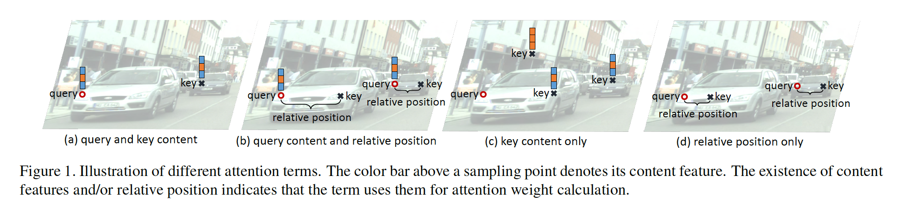
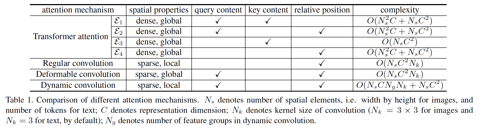
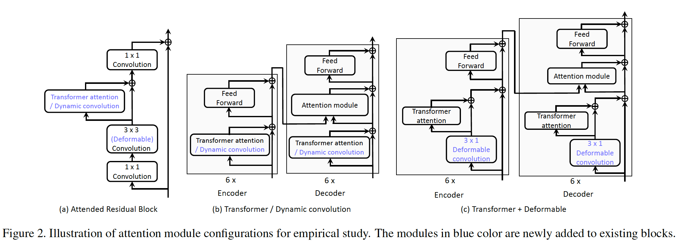
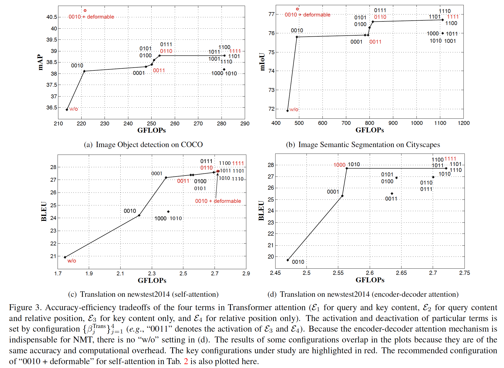
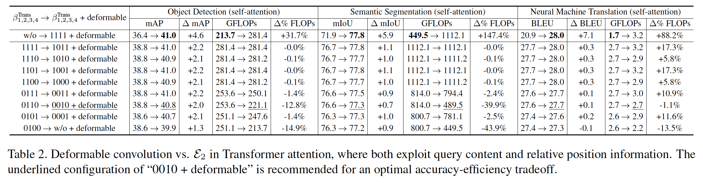
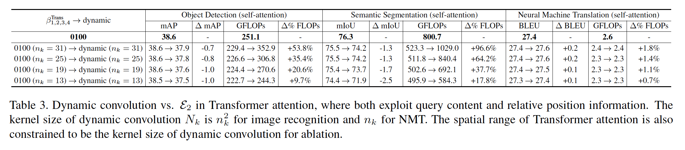

## An Empirical Study of Spatial Attention Mechanisms in Deep Networks

### Abstract

​		注意力机制已成为深度神经网络中流行的组件，但很少有研究探讨不同的影响因素以及从这些因素计算注意力的方法如何影响性能。为了更好地理解注意力机制，我们提供了一项经验研究，可以消除广义注意力公式中的各种空间注意力元素，包括占主导地位的Transformer注意力以及流行的可变形卷积和动态卷积模块。在各种应用中进行的研究得出了有关深层网络中空间注意力的重要发现，其中一些与传统理解背道而驰。例如，我们Transformer注意中的查询和键（query、key）对于自注意力是可忽略的，但是对于编码器-解码器（encoder-decoder）注意力是至关重要的。另一方面，可变形卷积与键内容显着性的适当组合可实现最佳的自注意力准确率-效率平衡。

### 1. Introduction

​		注意力机制确保神经网络更加关注输入的相关元素，而不是无关部分。它们首先在NLP中被研究，其中encoder-decoder注意力模块用于促进神经机器翻译[2、31、16]。在计算给定查询元素（例如输出句子中的目标单词）的输出时，根据查询对某些键元素（例如输入句子中的源单词）进行优先排序。后来，提出自注意力模块，用于建模句子内部（intra-sentence）关系[7、29、33、34、41]，其中键和查询均来自同一组元素。在里程碑论文[41]中，提出Transformer注意力模块，其取代过去的工作，并大大超越他们的表现。注意模型在NLP中的成功导致其在计算机视觉中应用，其中Transformer注意力的不同变体用于识别任务（例如目标检测和语义分割[22、43、19、24、51、15]），其中查询和键是视觉元素（例如图像像素或感兴趣区域）。

​		在确定为给定查询分配特定键的注意力权重时，通常只考虑输入的一些属性。一个是查询内容，对于自注意力的情况，查询内容可能是图中查询像素上的特征，或者语句中的单词的特征。另一个是键的内容，其中键可能是查询局部领域中的像素，或语句中的其他单词。第三个是查询和键的相关位置。

​		基于这些输入属性，有四个可能的注意因素，可从中确定键相对于查询的注意权重，因为这些因素必须考虑有关键的信息。具体而言，这些因素是（1）查询和键的内容、（2）查询内容和相关位置、（3）仅键内容和（4）仅相关位置。在最新的Transformer注意力版本[11]中，注意力权重表示为四项（$\varepsilon_1,\varepsilon_2,\varepsilon_3,\varepsilon_4$）之和，一个对应注意力因素中的每项，如图1所示。这些项所涉及的依存关系的本质各不相同。例如，前两者（$\varepsilon_1,\varepsilon_2$）对查询内容敏感，而后两者（$\varepsilon_3,\varepsilon_4$）不关心查询内容，但是它们分别主要捕获显著的键元素和利用全局位置偏差。尽管注意力权重可以基于这些因素分解，但是它们在各种推理问题中的相对重要性尚未在文献中进行过仔细研究。此外，诸如可变形卷积[10、52]和动态卷积[44]之类的流行模块，尽管看似与Transformer的注意力正交，但它们也采用了专注于输入某些部分的机制。这些模块是否都可以从统一的角度来看，以及它们的运行机制如何不同，也尚未得到探讨。

​		在这项工作中，我们将Transformer注意力、可变形卷积和动态卷积模块视为空间注意力的各种实例化，涉及注意力因子的不同子集并以不同方式解释这些因子。为了弄清不同注意力因素和机制的影响，我们提出了对空间注意的实证研究，其中注意力机制的各种要素在广义注意公式中被消除。这项研究是针对各种应用应用进行的，即神经机器翻译、语义分割和目标检测。根据这项研究，我们发现：1）在Transformer注意力模块中，查询敏感项（query-sensitive terms）（特别是针对查询和键内容项）在自注意力中起着起次要作用。 但是在编码器-解码器的注意力中，查询和键内容项至关重要。2）尽管可变形卷积仅基于查询内容和相关位置项利用注意力机制，但是它在图像识别上比Transformer更加高效。3）在自注意力中，查询内容&相关位置与键内容是最重要的。可变形卷积和Transformer注意中仅键内容的恰当组合比Transformer注意模块具有更高的准确性，并且图像识别任务的计算开销要低得多。

​		本文的观察挑战当前空间注意力机制中的通用理解。例如，**广泛认为，它们的成功主要归因于查询敏感注意力，特别是查询和键内容**。这种理解可能源自神经机器翻译中encoder-decoder注意力模块中的最初成功。因此，在一些最近的变体[43、24、48、15]（例如如non-local block[43]和criss-cross注意力模块[24]）仅保留查询和键内容，而移除所有其他项。这些模块仍然在自注意力应用中有效，这增强了这种认识。然而，我们研究认为这种理解是错误的。**我们发现这些仅包含查询敏感项的注意力模块实际上与仅包含查询无关项的注意力模块表现相当。**我们的研究进一步认为，这种衰退可能是由于注意力模块的设计，而不是自注意力固有的特点，因为发现了可变形卷积可以在图像识别任务中有效且高效地利用查询内容和相对位置。

​		这种实证分析认为，深度网络中的空间注意力机制有很大的提升空间。

### 2. Related Work

​		**基于注意力模块的发展与应用。**近年来，自然语言处理领域的注意力机制正在稳步发展[2、31、16、41、38、11]。从神经极其翻译[2]中注意力模块的引入开始，已使用不同的注意力因子以及基于这些因子的权重分配函数。在[31]中，推荐编码查询和键内容向量的内积计算注意力权重，并将绝对空间位置作为注意力因素。在[16]中，权重分配还考虑了在高维向量中编码的空间位置的内积。Transformer[14]的标志工作设置了新的标准，并且其最近的版本为了更好的泛化能力使用相关位置而不是绝对位置。在本文中，我们对来自该系列工作的Transformer注意[11]的最新实例进行了实证研究。

​		受到它们在NLP任务中成功的启发，注意机制也已用于计算机视觉应用中，例如对象之间的关系推理[3、37]、图像标题[46]、图像生成[50、47]、图像识别[22、43、19、24、51、15 ]和视频识别[53、45]。在视觉方面，键和查询指的是视觉元素，但除此之外，大多数这些工作都使用类似于Transformer注意力的表述。由于不同的注意力模块元素的效果可能会因目标应用程序而异，因此我们对三种受注意力建模影响较大的任务进行了实证研究，这些任务分别是NLP中的神经机器翻译以及计算机视觉中的目标检测和语义分割。

​		除了Transformer注意力外，还有卷积的各种变体，例如可变形卷积[10、52]和动态卷积[44]，它们也可以看作是使用不同注意力权重函数对注意力因子子集进行操作的注意力机制类型。它们也包括在研究中以供检查。

​		值得一提的是，空间注意力的对偶形式，称为逐通道特征注意力。由于不同的特征通道对不同的语义概念进行编码，因此这些工作试图通过激活/反激活某些通道来捕获这些概念之间的相关性。与此同时，在空间域中，利用分配到相关空间位置的特征通道上相同的注意力权重，建模不同空间位置的元素之间的关系。逐通道特征关注的发展已经集中在某些图像识别任务上，例如语义分割和图像分类。在本文中，我们的实证研究专门测试为广泛应用而设计的空间注意机制。

​		**空间注意力机制的分析。**尽管，在神经网络中，空间注意力机很流行，但是很少有其相关的研究。这项研究主要是通过可视化或分析整个学习模块对仅在NLP任务上的注意力权重来进行的[17、40、18、25]。许多工作[17、40、18]认为encoder-decoder注意力上注意力权重分配起着与传统方法[1、8、30、6]中的词对齐相似的作用。这些工作中隐含的基本假设是，具有较高关注权重的输入元素负责模型输出。然而，最近的研究对此假设提出质疑[25]，发现注意力权重与特征重要性度量之间的相关性不强，而counterfactual注意力权重配置并未在预测中产生相应的变化。

​		在本文中，我们对NLP和计算机视觉任务上的空间注意模块的元素进行了首次全面的实证研究。仔细区分了不同的注意因素和权重分配函数，它们的效果由最终性能对这些任务的直接衡量。

### 3. Study of Spatial Attention Mechanisms

​		为了促成我们的研究，我们开发了一种通用注意的公式，该公式能够表示各种模块设计。然后，我们证明如何在此公式中表示主要的注意力机制，以及如何使用此公式针对不同的注意力模块元素进行消融。

**Generalized attention formulation**

​		给定查询元素和一组键元素，注意力函数根据衡量query-key对匹配度的注意力权重自适应地聚合键内容。为了允许模型关注不同表示子空间和不同位置的键内容，多个注意力函数（head）的输出利用可学习的权重线性聚合。令$q$为具有内容$z_q$的查询元素建立索引，而$k$为内容为$x_k$的键元素建立索引。然后，多头注意力特征$y_q$为：

$$y_q = \sum_{m=1}^M W_m [\sum_{k\in\Omega_q}A_m(q, k, z_q, x_k) \odot W_m'x_k],\tag{1}$$

其中$m$为注意力头部的索引，$\Omega_q$指定查询的支持键区域，$A_m(q,k,z_q,x_k)$表示第$m$个注意头部中的注意力权重，而$W_m$和$W_m'$使可学习权重。通常，注意力权重在$\Omega_q$中归一化，即$\sum_{k\in\Omega_q}A_m(q, k, z_q, x_k) = 1$。

​		在encoder-decoder注意力中，键和查询来自两组不同的元素，其中，在大多数应用中，着两组元素需要正确地对齐。例如，在神经机器翻译中，键和查询元素分别对应输入和输出语句中的单词，其中正确的翻译需要合适的对齐。与此同时，在自注意力中，键和查询来自相同的元素集合。例如，键和查询都是输入或输出语句中的单词。在如此场景中，自注意力机制期望捕获元素间的内部关系，并且查询和键内容通常通过相同的特征集合（即$x=z$）建模。

**Transformer attention**

​		在大多数Transformer注意力模块[1]的最新实例中，每个query-key对的注意力权重计算为四项$\{\varepsilon_j\}_{j=1}^4$，其基于不同的注意力因素，如

$$A_m^{Trans}(q, k, z_q, x_k) \varpropto \exp(\sum_{j=1}^4 \varepsilon_j), \tag{2}$$

通过$\sum_{k\in\Omega_q}A_m(q, k, z_q, x_k) = 1$归一化，其中支持键区域$\Omega_q$跨域键元素（例如整个输入语句）。默认情况下，本文使用8个注意力头。

​		$\varepsilon_1$和$\varepsilon_2$项对于查询内容很敏感。$\varepsilon_1$衡量查询和键内容的匹配度，$\varepsilon_1=z^\top U_m^\top V_m^Cx_k$，其中$U_m$、$V_m^c$分别是查询和键内容的可学习嵌入矩阵。它使网络可以在内容方面将更多的精力集中在与查询匹配的键上。一种可能的结果是相似查询和键内容之间的关系，如图1（a）。对于$\varepsilon_2$项，它是基于查询内容和相关位置，$\varepsilon_2=z_q^\top U_m^\top V_m^R R_{k-q}$，其中$R_{k-q}$同将相关位置$k-q$映射到一个高维表示来编码这个位置，这种映射根据不同波长的[41]的sine和cosine函数计算（对于2维图像数据，我们单独编码x轴相关的位置$R_{k-q}^X$和y轴相关的位置$R_{k-q}^Y$，并拼接它们形成最终的编码$R_{k-q}=[R_{k-q}^X, R_{k-q}^Y]$。）。$V_m^R$是编码相关位置$R_{k-q}$的可学习嵌入矩阵。这一项允许网络根据查询内容自适应地确定在哪里分配高注意力权重。如图1（b）所示，这可能有助于将外观与图像识别中的空间变换区分开。

​		$\varepsilon_3$和$\varepsilon_4$项与查询内容不相关。$\varepsilon_3$仅涉及键内容，$\varepsilon_3=u_m^\top V_m^C x_k$，其中$u_m$是可学习向量。它捕获应针对该任务集中的突出关键内容，并且与查询无关，如图1（c）所示。至于$\varepsilon_4$，它仅涉及相关位置，$\varepsilon_4=v_m^\top V_m^RR_{k-q}$，其中$v_m$是可学习的向量。它捕获键和查询元素之间的全局位置偏差，如图1（d）所示。

​		人们普遍认为，对查询敏感的优先级，尤其是查询和键内容匹配项$\varepsilon_1$，是成功获得Transformer注意力的关键。因此，在一些最近的变体[43、24、48、15]中，仅保留$\varepsilon_1$，同时移除其他项。

​		在Transformer注意力汇总，式（1）中$W_m$和$W_m'$是可学习的。$W_m'$将$x_k$的特征映射到相对较低的维度以减小计算开销，$W_m$将聚合特征映射回与$y_q$相同的维度。

**Regular and deformable convolution**

​		常规和可变形的卷积可视为空间注意机制的特殊实例，其中涉及注意因素的子集。

​		在常规卷积中，给定一个查询内容，根据预先确定的与查询对应的位置偏移，采用固定数量的键元素（例如$3\times3$）。根据式（1）的观点，规则卷积的注意力权重可以表示为

$$A_m^{\mbox{regular}}(q,k)=\begin{cases}1 &\mbox{ if }k=q+p_m \\ 0 &\mbox{ else},\end{cases} \tag{3}$$

其中每个采样的关键元素都有一个单独的注意力头（例如$3\times 3$个常规卷积对应于9个注意力头），而$p_m$表示第$m$个采样位置的偏移。此外，式（1）中的权重$W_m'$ 固定不变，留下$W_m$作为可学习的权重。在常规的卷积中，仅涉及相关位置，而没有用于使内容适应注意力的可学习参数。支持键区域$\Omega_q$被严格限制到以查询位置为中心的局部窗口中，并通过卷积核大小确定。

​		在可变形卷积[10、52]中，添加可学习的偏移来跳针键元素的采样位置，以及捕获空间变换。基于查询内容预测可学习偏移，因此对于输入是动态的。它还可以纳入通用注意力公式作为自注意力的特殊实例，其中注意力权重为

$$A_m^{\mbox{deform}}(q,k,x_q)=G(k,q+p_m+w_m^\top x_q),\tag{4}$$

其中$p_m$还表示预先确定的偏移，$w_m^\top x_q$根据可学习向量$w_m$将查询内容$x_q$映射到可变形的偏移（遵循[10]，$w_m$的学习率设置为其他参数的0.1倍以稳定训练）。$G(a,b)$为$N$为空间中线性插值核，其可以分解为1维的线性插值$G(a,b)=\prod_{n=1}^Ng(a_n, b_n)$，其中$a_n$和$b_n$分别表示$a$和$b$的第$n$维，而$g(a_n,b_n)=\max(0, 1-|a_n-b_n|)$。与常规卷积相似，式（1）中的权重$W_m'$固定不变。

​		在可变形卷积中，注意力因素是查询内容和相关位置。由于引入可学习的偏移，支持键区域$\Omega_q$可以跨越所有输入元素，而将非零权重分配给执行双线性插值的关键元素稀疏集合。

**Dynamic convolution**

​		最近，提出了动态卷积[44]来代替自我注意中的Transformer注意模块，它被认为更简单、更有效。它基于具有共享动态核权重的深度可分离卷积[21]，该动态权重是基于查询内容进行预测的。在深度可分离卷积中，将标准卷积分解为逐深度卷积和称为逐点卷积的$1\times1$卷积，从而减小计算和模型大小。在逐深度卷积中，在每个输入通道上使用单个滤波器，其对于所有位置是固定的。在动态卷积中，逐深度卷积的核权重从输入特征上动态地预测，然后通过softmax进行归一化。对于计算成本，输入通道分为几个组，其中每个组共享相同的动态核权重。在[44]的系统中，在动态卷积模块之前应用了称为门控线性单元（gated linear unit: GLU）[12]的正交模块，以提高精度。我们包括GLU以尊重原始设计。

​		动态卷积还可以利用最小的修改纳入式（1）的通用注意力公式，其中每个输入特征通道都有一个独立的注意力头部。它可以表示为

$$y_q=\sum_{c=1}^{C_{in}}W_c[\sum_{k\in\Omega_q}A_c^{\mbox{dynamic}}(q,k,x_q) \cdot x_{k,c}], \tag{5}$$

其中$c$枚举输入特征的通道（共计$C_{\mbox{in}}$通道），$x_{k,c}$表示$x_k$的第$c$个通道的特征值，$W_c$是$1\times1$逐点卷积的权重。$A_c^{\mbox{dynamic}}(q,k,x_q)$是通过逐通道卷积的动态核描述的注意力权重：

$$A_c^{\mbox{dynamic}}(q,k,x_q)=\begin{cases}K_{j,c} &\mbox{ if } k=q+p_j \\ 0 &\mbox{ else},\end{cases} \tag{6}$$

其中$p_j$表示动态核中的第$j$个采样位置，$K_{j,c}$为相应的核权重。将零注意力权重分配给核之外的键。根据输入特征预测和权重$K_{j,c}$，并在相同组的通道间共享：

$$K_{j,c}=K_{j,g}^{\mbox{share}} \propto \exp(d_{j,g}^\top x_q), g=\lceil\frac{c}{C_{in}/N_g}\rceil.\tag{7}$$

输入被分为$N_g$组（默认为$N_g=16$）。$K_{j,g}^{\mbox{share}}$表示第$g$组的动态核权重，$d_{j,g}$是相应的可学习向量。$K_{j,g}^{\mbox{share}}$由$\sum_{j=1}^{N_k}K_{j,g}^{\mbox{share}}=1$归一化，其中$N_k$表示动态核中元素的数量。

**Comparing attention mechanisms**

​		表1比较了上面讨论的三种注意力机制。Transformer注意力可从查询和键中获取全面的内容和位置信息。$\varepsilon_1$、$\varepsilon_2$、$\varepsilon_3$和$\varepsilon_4$需要与查询和键元素量乘积成比例的计算，因为它们涉及对每个查询-键对的遍历。$\varepsilon_3$仅捕获键内容，因此涉及到与键元素数量成线性关系的计算。在神经机器翻译中，键和查询元素通常是一个句子中的几十个单词，因此$\varepsilon_1$、$\varepsilon_2$、和$\varepsilon_4$的计算开销与$\varepsilon_3$相当。在图像识别中，键和查询元素包含图像中大量像素。$\varepsilon_1$、$\varepsilon_2$、和$\varepsilon_4$的计算开销远高于$\varepsilon_3$。注意，当将这四项放到一起时，一些计算开销可以在它们之间共享。

​		与$\varepsilon_3$相似，可变形卷积还基于查询内容和相关位置。但是可变形卷积仅为每个查询采样键元素的系数集合，并且复杂度与查询元素量是线性关系。因此，可变形卷积的速度比用于图像识别的$\varepsilon_2$快得多，并与用于机器翻译的$\varepsilon_2$相当。

​		动态卷积也依赖查询内容和相关位置。通过动态卷积核分配键元素的注意力权重，其基于查询内容。非零注意力权重仅在动态核覆盖的局部区域中存在。计算开销与核大小和查询元素量的乘积成比例。与$\varepsilon_3$相比，如果核大小远小于键元素量，计算开销明显更低。

​		我们试图进一步区分不同注意因素的影响，并促进与使用这些因素子集的空间注意力的其他实例的比较。因此，将手动切换引入Transformer注意力模块，其保证确保可以手动激活/不激活特定的项。这表示为

$$\hat{A}_m^{\mbox{Trans}}(q,k,z_q,x_k) \propto \exp(\sum_{j=1}^4 \beta_j^{\mbox{Trans}}\varepsilon_j), \tag{8}$$

其中$\{\beta_j^{\mbox{Trans}}\}$取$\{0,1\}$中的值来控制相应项的激活，并且$\hat{A}_m^{\mbox{Trans}}(q,k,z_q,x_k)$由$\sum_{k\in\Omega_q}\hat{A}_m^{\mbox{Trans}}(q,k,z_q,x_k)=1$归一化。

**Incorporating attention modules into deep networks**

​		我们将不同的注意力机制纳入深度网络以研究它们的影响。在插入模块中有不同的设计选择，例如是否以串联或并联的形式连接它们，在主干网络的哪里放置该模块。我们凭经验观察到，对于不同的、经过深思熟虑的设计，结果非常相似。 在本文中，我们选择图2中的设计选择。

​		对于目标检测和语义分割，选择ResNet-50作为主干，并且仅涉及自注意力机制。将Transformer注意力模块用于残差块的$3\times3$卷积的输出。为了在不破坏初始行为的情况下插入经过预训练的模型，Transformer注意模块包括一个残差连接，并且其输出乘以初始化为零的可学习标量，如[43]所示。合并动态卷积的形式相同。为了利用可变形卷积，将残差块中的$3\times3$常规卷积替换为其可变形的副本。产生的架构称为“Attended Residual Block”，如图2（a）所示。

​		在神经机器翻译（neuron machine translation: NMT）任务重，网络架构遵循Transformer基模型[41]，其中涉及自注意力和encoder-decoder注意力机制。与原始论文不同，我们使用式（2）中的最新相对位置版本[11]更新Transformer注意力模块中的绝对位置嵌入。 由于可变形卷积和动态卷积都捕获自注意力，因此将它们仅添加到Transformer中捕获自注意力的块中。对于动态卷积，我们直接将Transformer注意力模块替换为动态卷积，如[44]，图2（b）为这个架构。对于它可变形卷积副本，因为Transformer模块没有使用任何空间卷积（核大小大于1），所以我们在输入Transformer注意力模块之前插入可变形卷积单元（核大小为3）。产生的架构称为“Transformer + Deformable”，如图2（c）所示。

### 4. Experiments and Analysis

#### 4.1. Experimental settings

**Image Object Detection**

​		在COCO2017[28]训练集的118K张图像上训练模型。在COCO2017验证集的5K张图像上完成评估。通过不同边界框IoU下的标准的平均AP得分（mAP）衡量准确率。

​		选择具有FPN的Faster R-CNN作为基线系统。ImageNet预训练的ResNet-50作为主干。在ResNet-50的最后两个阶段（conv4和conv5阶段）中使用图2（a）的attended residual block。在Transformer注意力中，相对位置编码的尺寸与内容特征嵌入的尺寸相同，具体而言，在conv4和conv5阶段分别为256-d和512-d。

​		基于开源的mmdetection[5]代码进行实验。超参数设置严格遵循FPN[27]。使用5个尺度和3个纵横比的锚。在训练和推理时分别以0.7的非最大抑制阈值生成2k和1k区域提议。在SGD训练时，采样256个锚框（正负之比为$1:1$）和512个区域提议（正负之比为$1:3$）来反响传播它们的梯度。在我们的实验中，在8张GPU上、以每张GPU 2幅图像的batch_size训练网络12个周期。学习率初始化为0.02，在第8和11个周期时除以10。权重衰减和momentum参数分别设置为$10^{-4}$和0.9。

**Image Semantic Segmentation**

​		模型在Cityscapes训练集的精细标注的5000张图像上训练模型。在验证集的500张图像上完成评估。使用标准的平均IoU得分（mIoU）衡量语义分割准确率。

​		CCNet [24]用于语义分割，它使用ImageNet预训练的ResNet-50，并且没有[24]中提出的纵横注意模块（criss-cross attention module），它是Transformer注意力的一种变体。如目标检测所做的，在最后两个阶段使用图2（a）中的attended residual module。按照[24]中的做法，在ResNet-50输出之后放置一个额外的Transformer注意力/动态卷积模块，以提高性能。

​		超参数的设置严格遵循CCNet论文[24]中的超参数。在SGD训练期间，通过随机缩放（从0.7到2.0）、随机裁剪（$769\times769$像素）和随机水平翻转来增强训练图像。在我们的实验中，在8张GPU、每张GPU一幅图像的batch_size训练网络60k次迭代。采用“poly”学习率策略，其中初始学习率设置为0.05，每次迭代乘以$(1-\frac{\mbox{iter}}{\mbox{iter}_{\mbox{max}}})^{0.9}$。同步批归一化[35]放置在每个新添加的具有可学习权重的层之后。权重衰减和momentum参数分别设置为$10^{-4}$和0.9。

**Neural Machine Translation（NMT）**

​		在标准的WMT 2014 英语-德语数据集上训练模型，包含大约4.5M语句对。句子使用字节对编码[4]进行编码，共享的源目标词汇约37k。评估在英语到德语的newstest2014上进行。准确率是通过标准的双语评估研究（bilingual evaluation understudy: BLEU）分数来衡量的[32]。

​		具有相关位置编码[11]的Transformer基模型[41]用作主干。实验基于开源的fairseq [14]代码库进行。超参数遵循[41]中的原始设置。我们使用$\beta_1=0.9$、$\beta_2=0.98$以及$\epsilon = 10^{-9}$的AdamOptimizer。在我们的实验中，在8个GPU上训练100K迭代。每个训练批包含30K源token和30K目标token。初始学习率设置为$10^{-7}$，在$\mbox{iter}_{\mbox{warmup}}=4000$次迭代后线性增加到0.001，然后每次迭代乘以${\frac{\mbox{iter}}{\mbox{iter}_{\mbox{warmup}}}}^{-0.5}$。不采用权重衰减。训练期间，使用0.1的标签平滑[39]。

#### 4.2. Effects of various attention-based modules

**Disentanglement in Transformer attention**

​		我们首先尝试在Transformer注意力模块中分解这四项的影响。通过手工设置式（8）中的$\{\beta_j^{\mbox{Trans}}\}_{j=1}^4$

来控制单项的激活/不激活。针对$\{\beta_j^{\mbox{Trans}}\}_{j=1}^4$的所有16种可能配置对网络进行训练和测试。在这组实验中，不涉及其他注意力机制。因此，对于目标检测和语义分割任务，$3\times 3$卷积是图2（a）的网络中的常规卷积。对于NMT任务，使用图2（b）的网络架构。在图2（a）和（b）中的“Transformer注意力/动态卷积”选项中使用了Transformer 注意力。注意，对于NMT任务，自注意力和encoder-decoder模块都使用Transformer注意力模块。为了减小实验复杂度，学习自注意力时，编码器-解码器注意力中的Transformer注意力模块将保留为完整版本（$\beta_j^{\mbox{Trans}}=1, j = 1, \cdots,  4$，此配置缩写为“1111”）。

​		图3绘制了不同$\{\beta_j^{\mbox{Trans}}\}_{j=1}^4$配置下的准确率-效率平衡曲线，其中准确率-效率包络曲线由相连的线段表示。请注意，此处仅计算来自正在研究的Transformer注意力模块的计算开销，而没有计算来自网络其他部分的开销。根据曲线，我们做出如下总结：

​		（1）**在自注意力中，与查询无关项相比，查询敏感项的作用较小。**特别是，查询和键内容对准确性的影响可以忽略不计，而在图像识别任务中却在计算上占很大比重。总的来说，从Transformer注意力模块带来的准确性增益很大（从删除Transformer注意力模块的配置（“ w / o”）到使用Transformer注意力的完整版本的配置（“ 1111”））。可以看出，查询无关项带来的增益（从配置“w/o”到“00011”）远比查询敏感项（从配置“0011”到“1111”）带来的增益大。特别是，查询和键内容（由$\beta_1^{\mbox{Trans}}$控制）带来的性能增益可以忽略。将其移除（从配置“1111”到“0111”）仅产生很小的准确率衰减，同时，在图像识别任务中，减小了相当可观的计算开销。

​		（2）**在encoder-decoder注意力中，查询和键内容是至关重要的。**不激活它（由$\beta_1^{\mbox{Trans}}$控制）会产生明显的准确率衰减，而仅使用查询和键内容（配置“ 1000”）可提供与完整版本（配置“ 1111”）几乎相同的准确性。这是因为NMT中的键步骤是使源句子和目标句子中的单词对齐。 遍历查询和键内容对于此类对齐至关重要。

​		（3）**在自注意力中，仅查询内容&相关位置与键内容的注意力因素是最重要的。**相应的配置“ 0110”提供非常接近完整版本（配置“ 1111”）的精度，同时在图像识别任务中节省了大量的计算开销。还值得注意的是，还值得注意的是，仅捕获键信息的键内容可以在不增加额外开销的情况下有效地提高性能。

​		我们的发现与普遍认为查询敏感的项（尤其是查询和键内容）对于Transformer注意力的成功至关重要相矛盾。实验结果认为这仅对于encoder-decoder注意力场景为真。在自注意力场景中，查询和键内容甚至可以移除。

**Deformable convolution vs. $\varepsilon_2$ in Transformer attention**

​		这里，我们比较可变形卷积和式（2）中来自Transformer注意力的$\varepsilon_2$。因为可变形卷积设计用于捕获自注意力，所以我们将实验限制到自注意力场景。注意，当在NMT任务中使用可变形卷积时，网络架构为图2（c）中的“Transformer + Deformable”。

​		表2比较了不同设置下的可变形卷积和$\varepsilon_2$。我们发现：

​		（1）**对于目标检测和语义分割，可变形卷积的准确率和效率远大于$\varepsilon_2$。**而对于NMT，可变形卷积在准确性和效率上均与$\varepsilon_2$项相当。这种优势在图像上很明显的，其中设计大量像素。在准确率方面，可变形卷积中的双线性采样基于特征图局部线性的假设。该假设在局部图像内容逐渐变化的图像上比在单词突然变化的语言上更好。

​		（2）**可变形卷积和仅使用键内容项的组合（“0010+deformable”）传递最好的准确率-效率平衡。**准确率与使用可变形卷积和整个注意力模块（“ 1111 + deformable”）相当，而开销仅比仅可变形卷积（“ w / o + deformable”）高。该发现与“Disentanglement in Transformer attention”的发现（3）一致。它进一步表明，查询内容&相对位置以及键内容的重要性仅是自注意力的因素。配置“0010+deformable”也绘制在图3中。

**Dynamic convolution vs. $\varepsilon_2$ in Transformer attention**

​		我们在自注意力场景中比较这两个实例。对于图像识别任务，网络架构为图2（a），对于NMT，网络架构如图2（b），其中要么利用仅使用$\varepsilon_2$的Transformer注意力，要么使用动态卷积。

 

​		表3展示这些结果。我们发现，对于NMT，动态卷积以降低的计算成本实现了与$\varepsilon_2$项相当的精度。然而，动态卷积对于目标检测和语义分割不是有效的，因此准确率较低。为了进一步研究动态卷积中核大小的影响，我们还将$\varepsilon_2$ 的空间范围限制到与动态卷积相同的大小。对于动态卷积和$\varepsilon_2$项，精度都随着空间范围的缩小而降低。但是值得注意的是，但值得注意的是，在图像识别任务中，$\varepsilon_2$项在相同的空间范围内仍超过动态卷积，而计算开销更小。动态卷积在图像识别任务中的准确性较差，可能是因为动态卷积最初是为NMT设计的，并且某些设计选择可能不适用于图像识别。