## Swin Transformer: Hierarchical Vision Transformer using Shifted Windows

### 摘要

​		本文提出一种新的视觉Transformer（称为Swin Transformer），其可以用作计算机视觉的通用主干。两个领域之间的差异，例如与文字中的文字相比，视觉实体尺度存在巨大差异以及图像中像素的高分辨率，带来了使Transformer从语言适应视觉方面的挑战。为了处理这些差异，我们提出一种层次的Transformer，它的表示利用移动窗口（shifted windows）计算。通过将自注意力限制到非重叠的局部窗口，同时允许跨窗口连接，移动窗口方案带来更高的效率。这种层次架构能在不同尺度灵活建模，并且有与图像大小对应的线性计算复杂度。Swin Transformer的这些品质使其可与多种视觉任务兼容，包括图像分类（ImageNet-1K的准确度为86.4 top-1准确率）和密集的预测任务，例如目标检测（COCO test-dev上为58.7 box AP和51.1 mask AP）和语义分割（ADE20K val上为53.5 mIoU）。在COCO上，它的性能大幅领先SOTA 2.7 box AP和2.6 mask AP，在ADE20K领先SOTA 3.2 mIoU，证明基于Transformer模型作为视觉骨干的潜力，该代码和模型将在https://github.com/microsoft/Swin-Transformer上公开提供。

### 1. 引言

​		CNN已长期主导计算机视觉中的建模。从AlexNet [38]及其在ImageNet图像分类挑战中的革命性性能开始，CNN架构通过更大的规模[29、73]、更广泛的连接[33]和更复杂的卷积形式[67， 17、81]。利用CNN作为不同视觉任务的骨干网络，这些架构上的进步导致了性能的提高，从而极大地提升了整个领域。

​		另一方面，自然语言处理（NLP）中网络架构的发展走了一条不同的道路，如今取而代之的流行的架构是Transformer [61]。Transformer专为序列建模和转导任务而设计，以其对建模数据中长期依赖关系的注意力而著称。它在语言领域的巨大成功促使研究人员研究其对计算机视觉的适应性，最近它在某些任务上表现出了可喜的成果，特别是图像分类[19]和联合视觉语言建模[46]。

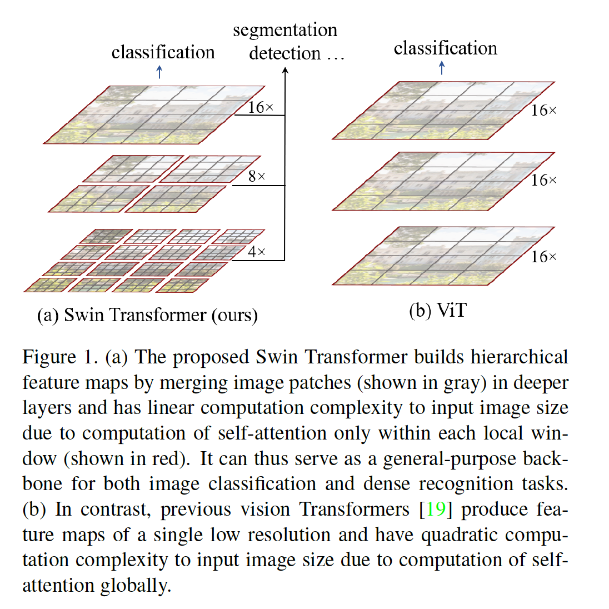

​		本文中，我们探索扩展Transformer的能力，使得它可以作为计算机视觉的通用目标的骨干，正如它在NL中完成的以及CNN在视觉中所做的工作。我们观察到将语言域的的高性能迁移到视觉域的重大挑战可以通过两种方式之间的差异来解释。差异之一涉及尺度。与语言Transformer中作为处理的基本元素的单词令牌（token）不同，视觉元素可以在尺度可以发生很大的变化，这是在诸如目标检测之类的任务中引起关注的问题[41、52、53]。在已有的基于Transformer的模型[61、19]中，标记全是固定尺度的，该属性不适合这些视觉应用。另一个区别是与文本段落中的单词相比，图像中像素的分辨率要高得多。存在许多视觉任务，例如语义分割，需要在像素级别进行密集的预测，这对于Transformer在高分辨率图像上来说是棘手的，因为其自注意力的计算复杂度是图像大小的平方。为了克服这些问题，我们提出一种通用目的的Transformer骨干，称为Swin Transformer，其构建层次特征图，并且具有与图像大小对应的线性计算复杂度。如图1（a）所示，Swin Transformer通过从小尺寸的补丁（以灰色勾勒出轮廓）开始并逐渐合并相邻的补丁到更深的Transformer层中来构造层次结构表示。利用这些层次特征图，Swin Transformer模型可以方便地利用先进技术及性诸如特征金字塔网络（FPN）或U-Net的密集预测。通过在分割图像非重叠窗口（以红色标记）中局部地计算自注意力获得线性计算复杂度。每个窗口中的补丁数量是固定的，因此，计算复杂度与图像的大小成线性关系。这些度量使Swin Transformer适合作为不同视觉任务的通用目的的骨干，而以前的基于变形金刚的架构[19]却产生单一分辨率的特征图，并且具有二次复杂度。

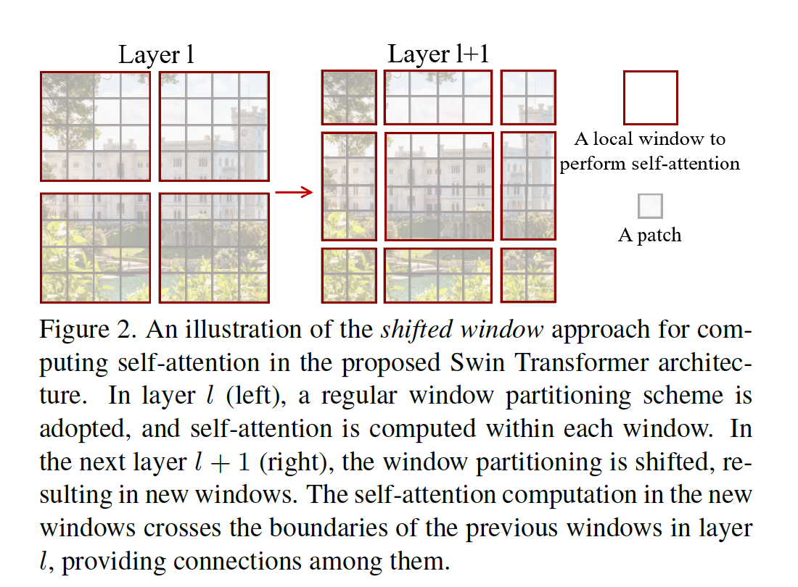

​		Swin Transformer的关键设计元素是其在连续的自注意力层之间移动（shift）窗口分区，如图2所示。移动的窗口与前一层的窗口连接，在它们之间提供了连接，从而显着增强了建模能力（请参见表4）。就实际延迟而言，此策略也是有效的：窗口中的所有查询补丁共享相同的键集[^1]，这有助于硬件中的内存访问。相比之下，早期的基于滑动窗口的自注意力方法[32、49]由于不同的查询像素有不同的键集，这在在通用硬件上遭遇低延迟[^2]。我们的实验证明，所提出的_shifted window_方法的延迟远低于滑动窗口的方法，在建模能力上也相似（见表5和表6）。

[^1]: 查询（query）和键（key）是自注意力层中的投影向量。
[^2]: 尽管存在在通用硬件上实现基于滑动窗口的卷积层的有效方法，但是由于其在整个特征图中共享核权重，因此基于滑动窗口的自注意力层在实践中很难进行有效的内存访问。

​		所提出的Swin Transformer在图像分类、目标检测和语义分割的识别任务上获得强力性能。在这三个任务上以相似的延迟获得明显优于ViT/DeiT和ResNe（x）t模型的性能。在COCO test-dev集上的58.7 box AP和51.1 mask AP比先前的最佳结果好2.7 box AP（没有外部数据的Copy-paste[25]）和2.6 mask AP（DetectoRS）。在ADE20K语义分割上，它在验证集上获得53.5mIoU，比先前的SOTA（SETR[78]）好3.2mIoU。它在ImageNet-1K图像分类上还获得86.4%的top-1准确率。

​		我们相信，跨计算机视觉和自然语言处理的统一架构可以使这两个领域受益，因为它将促进视觉和文本信号的联合建模，并且可以更深入地共享来自这两个领域的建模知识。我们希望Swin Transformer在多种视觉问题上的出色表现可以将这一信念带入社区中，并鼓励对视觉和语言信号进行统一建模。

### 2. 相关工作

**CNN and variants**	CNN是整个计算机视觉中的标准网络模型。虽然CNN已存在几十年，但是直到AlexNet的引入，CNN才开始流行并成为主流。从此，提出更深更有效的卷积神经架构来进一步推动计算机视觉中的深度学习浪潮，路人VGG、GoogLeNet、ResNet、DenseNet、HRNet和EfficientNet。除了这些架构的进步外，已有改进单独的卷积层的工作，例如depth-wise卷积和可变形卷积。虽然CNN及其变体仍是计算机视觉应用的主要骨干架构，我们突出类似Transformer架构用于视觉和语言之间统一建模的出色潜力。我们的工作在几个基本视觉识别任务上获得出色性能，并且我们希望它有助于建模的转变。

**Self-attention based backbone architecture**	受NLP领域中自注意力层和Transformer架构成功的启发，一些工作采用自注意力层来替换流行的ResNet中的一些或者全部空间卷积。在这些工作中，注意力是在每个像素的局部窗口内计算的，以加快优化速度[32]，并且与相应的ResNet架构相比，它们获得了更好的精度/ FLOP折衷。但是，它们高昂的内存访问造成它们的实际延迟明显高于卷积网络。相与其使用滑动窗口，我们提出连续层之间的_shift_窗口，其运行在通用硬件上更高效的实现。

**Self-attention/Transformers to complement CNNs**	这项工作的另一条线是利用自注意力层或Transformer来增强标准的CNN架构。通过提供对远距离依赖性或异构交互进行编码的能力，自注意力层可以实现骨干[64、6、68、22、71、54]或头部网络[31、26]。最近，Transformer中的encoder-decoder设计已用于目标检测和实例分割任务[7、12、82、55]。我们的工作探索将Transformer用于基本视觉特征提取的方法，并补充了这些工作。

**Transformer based vision backbone**	与我们的工作最相关的是Vision Transformer（ViT），及其追随者[60、69、14、27、63]。ViT的先驱工作直接将Transformer架构用于非重叠的中间尺寸的图像补丁，以进行图像分类。与卷积网络相比，它在图像分类上获得令人影响深刻的速度-准确率的平衡。虽然ViT需要大规模训练数据集（例如JFT-300M），但是DeiT引入几种训练策略，其也允许ViT有效的使用更小的ImageNet-1K数据集。ViT在图像分类上的结果令人鼓舞，但是由于ViT的低分辨率特征图和图像大小二次方的计算复杂度，所以它的架构不适合用作密集视觉任务或输入图像分辨率很高时的通用目的的主干网络。有一些将ViT模型应用于通过直接上采样或反卷积的密集目标检测和语义分割的视觉任务，但性能相对较低[2、78]。与我们的工作同时进行的是一些修改ViT架构[69、14、27]以获得更好的图像分类的方法。经验上，我们发现我们的Swin Transformer架构在图像分类的这些方法之中获得最佳的速度-准确率平衡，即使我们的工作关注通用目的的性能，而不是专门用于分类。另一项同时进行的工作[63]探索了类似的思路，以在T然送父母热上构建多分辨率特征图。它的复杂度仍是图像大小的二次方，而我们的复杂度与图像大小是线性关系，并且还是局部运算，这已被证明在建模视觉信号中的高相关性是有益的。我们的方法是有效的，在COCO目标检测和ADE20K语义分割上均达到了SOTA。

### 3. Method

#### 3.1. 整体架构

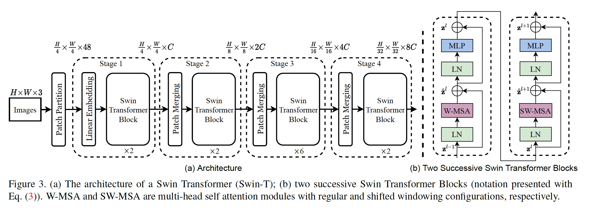

​		Swin Transformer架构的概览见图3，其展示了tiny版（Swin-T）。它首先通过使用类似ViT的补丁分割模块将输入RGB图像划分为非重叠的不同。将每个补丁视为一个“token”，并且它的特征被设置为元素的RGB值的串联。在我们的视线中，我们使用$4\times4$的补丁大小，因此每个补丁的特征维度为$4\times4\times3=48$。将线性嵌入层用在这些原始的特征上已将它映射到任意维度（表示为$C$）。

​		将几个修改的自注意力计算的Transformer块（Swin Transformer blocks）用于这些补丁token。Transformer块保持token的数量（$\frac{H}{4}\times\frac{W}{c}$），并且与线性嵌入一起称为“Stage 1”。

​		为了产生层次的表示，随着网络变深，通过补丁融合层减小token的数量。第一个补丁融合层将每组$2\times2$相邻补丁的特征串联起来，并且在$4C$维串联特征上应用线性层。这将token的数量减小$2\times2=4$倍（$2\times$下采样分辨率），并且将输出维度设置为$2C$。之后使用Swin Transformer块，并且分辨率维持在$\frac{H}{8}\times\frac{W}{8}$。补丁融合和特征变换表示为“Stage 2”。这一过程重复两次，作为“Stage 3”和“Stage 4”，并且输出分辨率分别为$\frac{H}{16}\times\frac{W}{16}$和$\frac{H}{32}\times\frac{W}{32}$。这些阶段联合产生层次表示。与典型的卷积网络（例如VGG和ResNet）有相同的特征分辨率。因此，所提出的架构可以方便地替换已有的用于视觉任务的骨干网络。

**Swin Transformer block**	Swin Transformer是通过将Transformer块中的标准多头自主力（MSA）模块替换为基于位移窗口的模块（在第3.2节中进行了描述）而其他各层保持不变而构建的。如图3（b）所示，Swin Transformer块包含基于位移窗口的MSA模块，接着是2层MLP，并且层之间有GELU。在每个MSA模块和每个MLP之前使用LayerNorm，并在每个模块之后使用残差连接。

#### 3.2. Shifted Window based Self-Attention

​		标准的Transformer架构[61]及其图像分类的适应[19]都进行全局自注意力，其中计算令牌与所有其他令牌之间的关系。全局计算导致与token数量成二次方的计算复杂度，使其不适用于需要大量令牌进行密集预测或表示高分辨率图像的许多视觉问题。

**Self-attention in non-overlapped windows**	为了高效建模，我们提出在局部窗口中计算自注意力。窗口被布置为以不重叠的方式均匀地划分图像。假设买个窗口包含$M\times M$个补丁，在$h\times w$补丁的图像上，全局MSA模块的计算复杂度和基于窗口MSA的计算复杂度为：

$$\Omega(MSA) = 4hwC^2 + 2(hw)^2C,\tag{1}$$

$$\Omega(W-MSA)=4hwC^2 + 2M^2hwC, \tag{2}$$

其中前者与补丁数量$hw$成二次方，当$M$固定（默认设置为7）时，后者是线性的。对于大型$hw$来说，全局自注意力计算通常是负担不起的，而基于窗口的自注意力是可伸缩的。

**Shifted window partitioning in successive blocks**	基于窗口的自注意力模块缺乏跨窗口的连接，这限制了它的建模能力。为了引入跨窗口连接，同时维持非重叠窗口的高效计算，我们提出移位的窗口分区方法，该方法在连续的Swin Transformer块中的两个分区配置之间交替。

​		如图2所示，第一个模块使用常规的分区策略，该策略从左上角像素开始，将$8\times8$的特征图划分为$2\times2$个大小为$4\times4$（$M=4$）的窗口。然后，下一个模块采用窗口配置，该窗口配置通过将窗口从规则划分的窗口中平移$(\lfloor \frac{M}{2}\rfloor, \lfloor \frac{M}{2}\rfloor)$像素。

​		利用移位窗口分区方法，连续的Swin Transformer块计算为：

$$\begin{align}\hat{\mathbf{z}}^l &= \mbox{W-MSA}(\mathbf{LN}(\mathbf{z}^{l-1})) + \mathbf{z}^{l-1},\\\mathbf{z}^l&=\mbox{MLP}(\mbox{LN}(\hat{\mathbf{z}}^l))+\hat{\mathbf{z}}^l, \\\hat{\mathbf{z}}^{l+1}&=\mbox{SW-MSA}(\mbox{LN}(\mathbf{z}^l)) +\mathbf{z}^l, \\\mathbf{z}^{l+1}&=\mbox{MLP}(\mbox{LN}(\hat{\mathbf{z}}^{l+1}))+\hat{\mathbf{z}}^{l+1},\end{align}\tag{3}$$

其中$\hat{\mathbf{z}}^l$和$\mathbf{z}^l$分别表示块$l$的（S）W-MSA模块和MLP模块的输出特征；W-MSA和SW-MSA分别表示基于窗口的多头自注意力和移位的窗口分区的自注意力。

​		移位窗口分区方法在上一层中的相邻非重叠窗口之间引入了连接，并被发现在图像分类、目标检测和语义分割方面很有效，如表4所示。

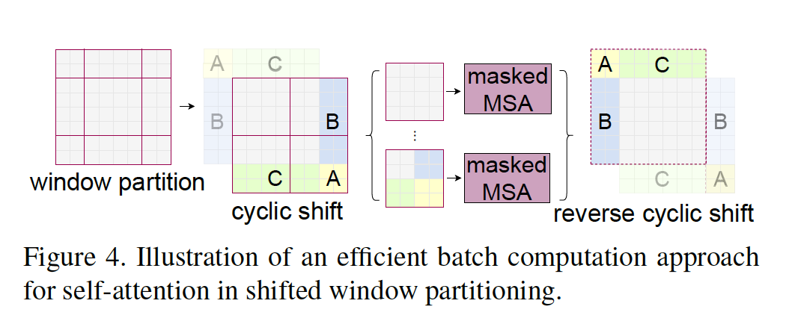

**Efficient batch computation for shifted configuration**	移位窗口分区的一个问题是，它会导致更多窗口，在移位配置中，从$\lceil\frac{h}{M}\rceil \times \lceil\frac{w}{M}\rceil$增加到$(\lceil\frac{h}{M}\rceil +1)\times (\lceil\frac{w}{M}\rceil+1)$，一些窗口会小于$M \times M$（为了使特征图大小$(h,w)$能被窗口大小$(M,M)$整除，如果有需要，在特征图上采用有效填充）。一种朴素的解决方案是将更小的窗口填充到$M\times M$大小，并在计算注意力时，掩膜填充的值。当常规划分中的窗口数量较小（例如$2\times2$）时，这种朴素的解决方案增加的计算相当大（$2\times2\rarr3\times3$，这是掩膜填充前的2.25倍）。这里，我们提出一种利用朝左上循环移位（cyclic-shifting）的_更有效的批计算方法_，如图4所示。在移位之后，批窗口可能包含几个在特征图中不相邻的子窗口，因此采用masking机制来将自注意力计算限制到每个子窗口。利用循环平移，批窗口的数量仍然与常规窗口分区相同，并因此也是高效的。这种方法的低延迟如表5所示。

**Relative position bias**	在计算自注意力时，我们通过将相对位置偏置$B \in \mathbb{R}^{M^2\times M^2}$包含到计算相似性的每个头部中：

$$\mbox{Attention}(Q,K,V)=\mbox{Softmax}(QK^T/\sqrt{d} + B)V,\tag{4}$$

其中$Q,K,V\in\mathbb{R}^{M^2 \times d}$分别为查询、键和值矩阵；$d$为查询/键的维度，$M^2$为窗口中的补丁数量。因为沿轴的相对位置位于$[-M+1,M-1]$中，我们参数化更小尺寸的偏置矩阵$\hat{B}\in\mbox{R}^{(2M-1)\times(2M-1)}$，并且$B$中的值取至$\hat{B}$。

​		我们观察到与没有此偏置项或使用绝对位置嵌入的方法相比有显着改进，如表4所示。进一步将绝对位置嵌入添加到输入（如[19]）会使性能略为下降，因此我们的实现没有采用。

​		预训练中学习到的相对位置偏差还可以用于通过双三次插值法初始化具有不同窗口大小的微调模型[19、60]。

#### 3.3. Architecture Variants

​		我们构建我们的基模型（称为Swin-B），其与ViT-B/DeiT-B有相似的模型大小和计算复杂度。我们还引入Swin-T、Swin-S和Swin-L，它们分别是大约0.25x、0.5x和2x的模型大小和计算复杂度。注意，Swin-T和Swin-S的计算复杂度分别与ResNet-50（DeiT-S）和ResNet-101相似。默认情况下，对于所有实验，窗口大小设置为$M=7$。每个头的查询维度设置为$d=32$，并且每个MLP的膨胀层设置为$\alpha=4$。这些模型变体的架构超参数为：

- Swin-T：$C=96,\mbox{layer numbers}=\{2, 2, 6, 2\}$
- Swin-S：$C=96,\mbox{layer numbers}=\{2, 2, 18, 2\}$
- Swin-B：$C=128,\mbox{layer numbers}=\{2, 2, 18, 2\}$
- Swin-L：$C=192,\mbox{layer numbers}=\{2, 2, 18, 2\}$

其中$C$是第一阶段中隐藏层的通道数。ImageNet图像分类的模型变体大小、理论计算复杂度（FLOP）和吞吐量如表1。

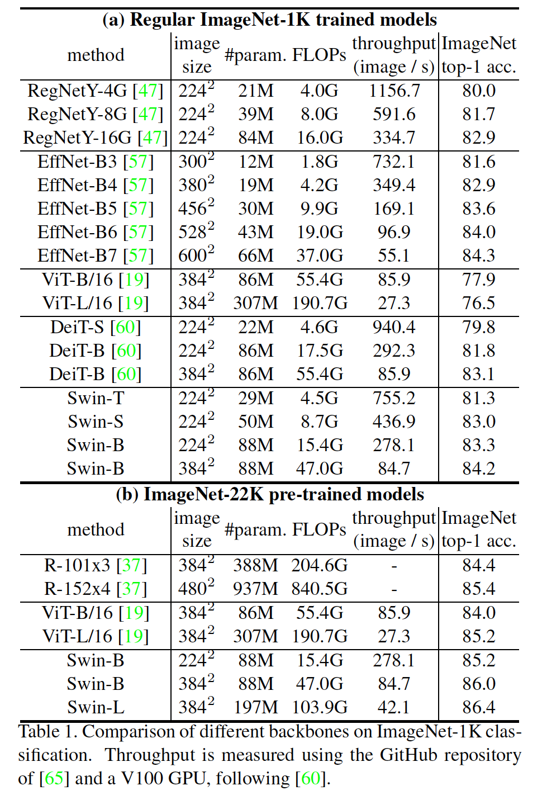

### 4. 实验

​		我们在ImageNet-1K图像分类、COCO目标检测和ADE20K语义分割上进行实验。接下来，我们首先在三个任务上将所提出的Swin Transformer架构与先前的最佳进行比较。然后，我们消融研究Swin Transformer的重要设计。

#### 4.1. ImageNet-1K上的图像分类

**设置**	对于图像分类，我们在ImageNet-1K上对提出的Swin Transformer进行基准测试，ImageNet-1K包含来自1000个类的1.28M训练图像和50K验证图像。报告单个裁剪的top-1准确率。我们考虑两种训啦设置：

- 常规ImageNet-1K训练。这种设置主要遵循[60]。我们使用余弦衰减学习率调度器的AdamW优化器训练300个周期，其中20个周期进行线性预热。批大小为1024，初始学习率为0.001，并且使用0.05的权重衰减。我们在训练中包括[60]的大多数数据增强和正则化策略，但重复的数据增强[30]和EMA [44]不能提高性能。 请注意，这与[60]相反，在后者[60]中，反复增强对于稳定ViT的训练至关重要。
- ImageNet-22K上预训练和ImageNet-1K上微调。我们还在更大的ImageNet-22K数据集上预训练，其包含14.2M图像和22K类。我们使用线性衰减学习速率调度器和5个epoch的线性预热，为60个epoch使用AdamW优化器。批大小为4096，初始学习率为0.001，使用0.01的权重衰减。在ImageNet-1K微调上，我们利用1024的批大小训练30个epoch，常量学习率$10^{-5}$，权重衰减$10^{-8}$。

**常规ImageNet-1K训练上的结果**   表1（a）介绍了与其他骨干的比较，包括基于Transformer和基于ConvNet。

​		与前面的基于Transformer架构（即DeiT）的相比，Swin Transformer明显抑制具有相似复杂度的DeiT架构：使用$224^2$的输入，Swin-T（81.3%）比DeiT-S（79.8%）好1.5%，使用$224^2/384^2$的输入，Swin-B（83.3%/84.2%）比DeiT-B（81.8%/83.1%）好1.5%/1.1%。

​		与最佳的ConvNet（即RegNet和EfficientNet）相比，Swin Transformer获得略为更好的速度-准确率平衡。注意，尽管RegNet [47]和EfficientNet [57]是通过全面的架构搜索获得的，但所提出的Swin Transformer是从标准Transformer改编而成的，具有进一步改进的强大潜力。

**ImageNet-22K预训练的结果**	我们还在ImageNet-22K上对容量更大的Swin-B和Swin-L进行了预训练。在ImageNet-1K图像分类上的微调结果见表1（b）。对于Swin-B，相比在ImageNet-1K上从头训练，ImageNet-22K预训练带来1.8%～1.9%的增益。与ImageNet-22K预训练的最佳结果相比，我们的方法获得明显更好的速度-准确率平衡：Swin-B获得86.0%的top-1准确率，其比ViT的准确率高2.0%，而推理吞吐量相似（84.7 vs. 85.9 image/sec）以及略低的FLOP（47.0G vs. 55.4G）。更大的Swin-L模型获得86.4%的top-1准确率，略好于Swin-B模型的准确率。

#### 4.2. COCO上的目标检测

**设置**	在COCO 2017上进行目标检测和实例分割实验，其包含118K训练、5K验证和20K test-dev图像。使用验证集进行消融研究，并且在test-dev上报告系统级比较。对于消融研究，我们考虑四种典型的目标检测框架：mmdetection中的Cascade Mask R-CNN[28、5]、ATSS[76]、RepPoints v2[11]和Sparse RCNN。对于这四种框架，我们使用相同的设置：多尺度训练（调整输入使得短边在480和800之间，而长边最多为1333）、AdamW优化器（0.0001的初始学习率、0.05的权重衰减和16的批大小）以及3倍时间表（36epoch）。对于系统级比较，我们采用没有instaboost的改进HTC（表示为HTC++）、更强的多尺度训练、6倍时间表（72个epoch）、soft-NMS和ImageNet-22K预训练模型作为初始化。

​		我们将我们的Swin Transformer预标准的ConvNet（例如ResNe(X)t）和先前的Transformer网络（例如DeiT）进行比较。通过仅更改其他设置不变的主干来进行比较。值得注意的是，由于Swin Transformer和ResNe(X)t的层次架构，它们直接适用于上述框架，DeiT仅产生单分辨率的特征图，并且不能直接使用。为了公平比较，我们遵循[78]使用反卷积层为DeiT构建层次特征图。

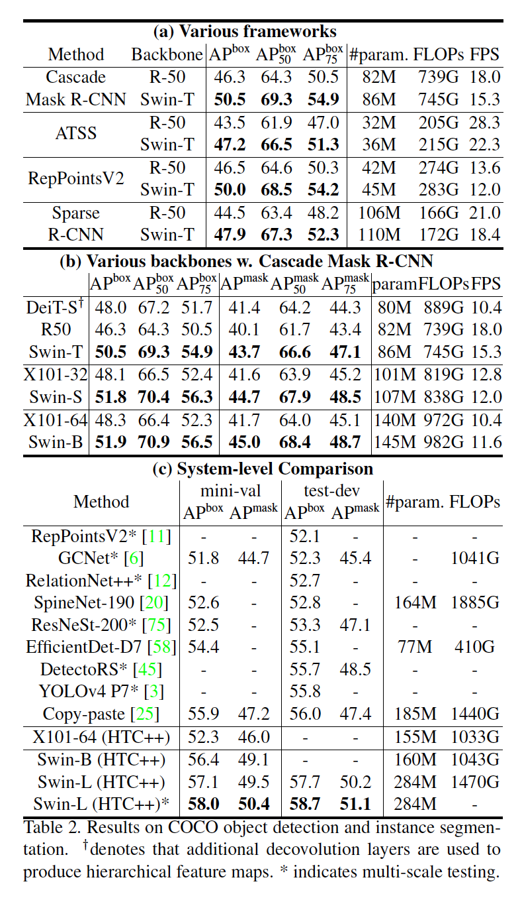

**与ResNe(X)t的比较**	表2（a）列出Swin-T和ResNet在四种目标检测框架上的结果。与ResNet-50相比，我们的Swin-T架构可带来稳定的3.4〜4.2 box AP增益，并且模型尺寸，FLOP和时延稍大。

​		表2（b）使用Cascade Mask RCNN比较了不同模型容量下的Swin Transformer和ResNe(X)t。Swin Transformer获得51.9 box AP和45.0 mask AP的高检测准确率，其比ResNeXt101-64x4d好3.6 box AP和3.3 mask AP，它们有相似的模型大小、FLOP和时延。在使用改进的HTC框架的52.3 box AP和46.0 mask AP的更高基线上，Swin Transformer的增益也很高，分别为4.1 box AP和3.1maskAP（请参见表2（c））。关于推理速度，虽然ResNe(X)t是由高度优化的Cudnn函数构建的，但我们的架构却是通过内置的PyTorch函数实现的，而这些函数并非都进行了优化。 彻底的核优化超出了本文的范围。

**与DeiT的比较**	使用Cascade Mask R-CNN框架的DeiT-S的性能如表2（b）所示。Swin-T的结果是，在类似模型大小（86M与80M）和推理速度（15.3 FPS与10.4 FPS）显着提高的情况下，比DeiT-S高2.5 box AP和2.3 mask AP。 DeiT的较低推理速度主要是由于其对输入图像大小的二次复杂度。

**与前面的最佳比较**	表2（c）比较我们的最佳结果与前面的SOTA模型。我们的最佳模型在COCO test-dev上获得58.7 box AP和51.1 mask AP，比前面的最佳结果好2.7 box AP（没有额外数据集的Copy-paste）和2.6 mask AP（DetectoRS）。

#### 4.3. 在ADE20K上的语义分割

**设置**	ADE20K是广泛使用的语义分割数据集，覆盖150个语义类别。它总共有25K图像，其中20K进行训练、2K进行验证和另外3K进行测试。为了高效率，我们利用mmseg[15]中的UperNet作为我们的基框架。更多细节见附录。

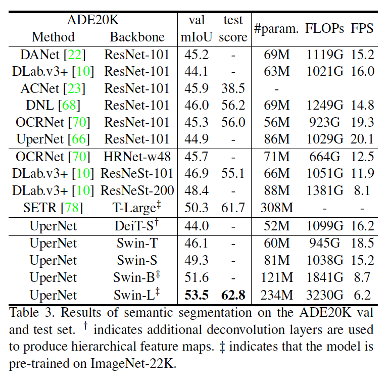

**结果**	表列出不同方法/骨干对的mIoU、模型大小（参数量）、FLOP和FPS。根据这些结果，可以看出，在相似计算成本下，Swin-S比DeiT-S高5.3mIoU（48.3 vs. 44.0）。还比ResNet-101高4.4mIoU，比ResNeSt-101高2.4 mIoU。利用ImageNet-22K预训练的Swin-L模型在验证集上获得53.5mIoU，比前面的最佳模型好3.2mIoU（SETR获得50.3mIoU，SETR的模型更大）。

#### 4.4. 消融研究

​		本节中，我们使用ImageNet-1K图像分类、COOC目标检测上的Cascade Mask R-CNN和ADE20K语义分割上的UperNet，消融所提出的Swin Transformer中的重要设计。

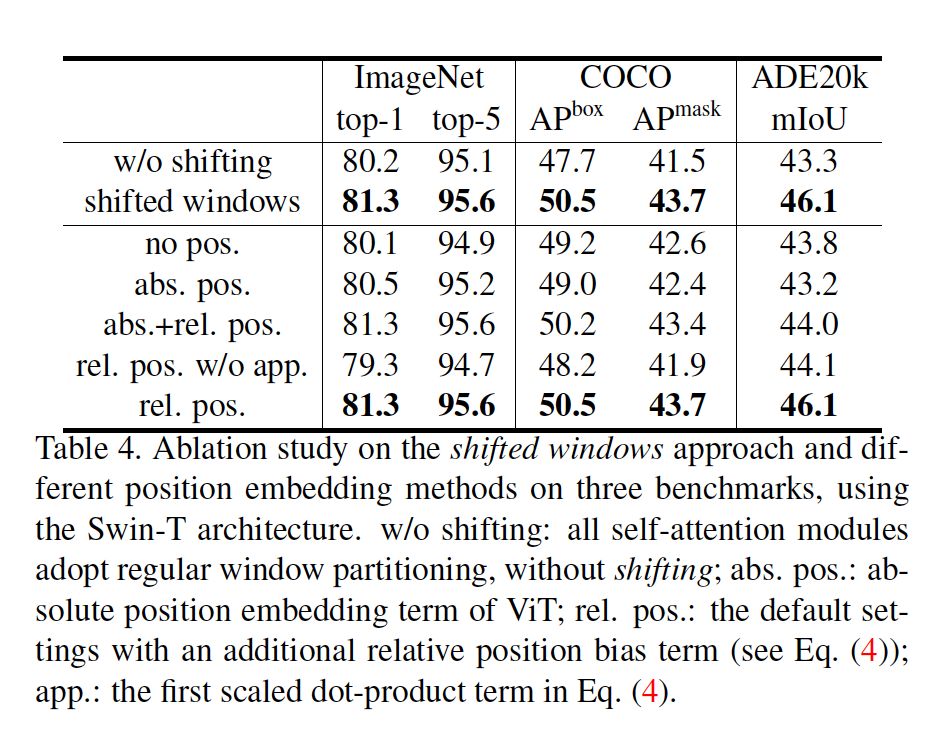

**Shifted windows**	三个任务上的_shifted window_消融分析见表4。带有移动窗口分割的Swin-T在每个阶段都优于基于单个窗口分割的副本，在ImageNet-1K上的准确率比副本好1.1%、在COCO上比副本好2.8 box AP/2.2 mask AP、在ADE20K上比副本好2.8mIoU。这个结果表明使用shifted window来构建前一层中的窗口之间的连接的有效性。_shifted window_的时延也很小，如表5所示。

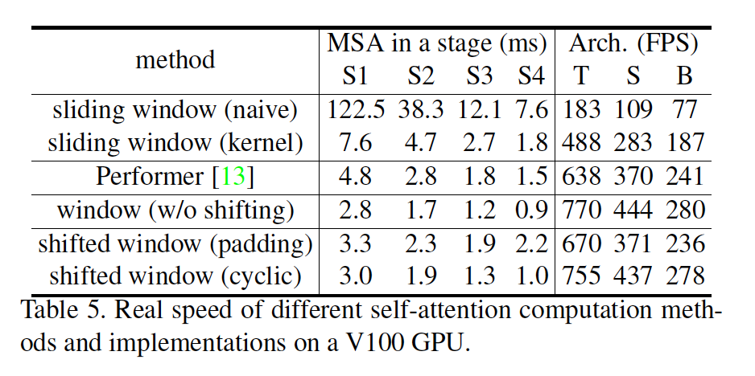

**Relative position bias**	表4展示不同位置嵌入方法的比较。相对没有位置编码和具有绝对位置嵌入的Swin-T相比，具有相对位置偏置（relative position bias）的Swin-T在ImageNet-1K上好1.2%/0.8% top-1准确率、在COCO上好1.3/1.5 box AP和1.1/1.3 mask AP、在ADE20K上好2.3/2.9 mIoU，这表明relative position bias。还应注意，尽管包含绝对位置嵌入（absolute position embedding）可以提高图像分类的准确性（+ 0.4％），但它会损害目标检测和语义分割（COCO上为-0.2box/mask AP，ADE20K上为-0.6 mIoU）。

​		尽管最近的ViT / DeiT模型在图像分类中放弃了平移不变性，尽管长期以来一直证明它对视觉建模至关重要，但我们发现，鼓励一定的平移不变性的归纳偏置（inductive bias）对于通用视觉建模仍然是可取的，特别是对于目标检测和语义分割的密集预测任务。

**不同自注意力方法**	不同自注意力计算方法和实现的真实速度见表5。我们的循环实现比朴素的填充更加硬件有效，特别是对于更深的阶段。综上，它分别在Swin-T、Swin-S和Swin-B带来13%、18%和18%的加速。

​		在四个网络阶段的朴素/核实现中，基于提出的shifted window方法构建的自注意力模块的效率分别比滑动窗口的效率高40.8/2.5、20.2/2.5、9.3/2.1和7.6/1.8。整体而言，基于shifted window的Swin Transformer架构的速度分别比基于滑动窗口的Swin-T、Swin-S和Swin-B的变体快4.1/1.5、4.0/1.5、3.6/1.5倍。 表6比较了它们在三个任务上的准确性，显示出它们在视觉建模方面的准确性相似。

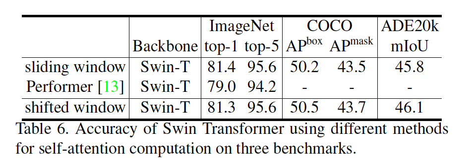

​		与Performer [13]是最快的Transformer架构之一（请参阅[59]）相比，建议的基于偏移窗口的自注意力计算和整个Swin Transformer体系结构要快一些（请参见表5），同时在ImageNet-1K上，与Performer相比，使用Swin-T获得top-1精度增加2.3％（请参见表6）。

#### A1. 详细架构

​		详细架构说明见表7，其中假设所有架构的输入图像大小为$224 \times 224$。“Concat $n\times n$”表示补丁中$n \times n$个相邻特征的串联。该操作导致特征图的下采样率为$n$。"96-d"表示输出维度为96的线性层。“win. sz. $7 \times 7$”表示窗口大小为$7\times7$的多头自注意力模块。

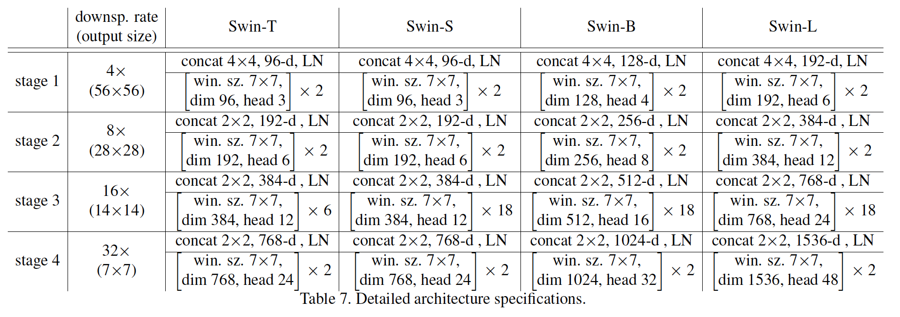

#### A2. 详细的实验设置

##### A2.1. ImageNet-1K上的图像分类

​		通过在最后一阶段的输出特征图上使用全局平均池化层进行图像分类。我们发现这种策略与使用ViT [19]和DeiT [60]中的附加类令牌一样准确。 在评估中，报告了使用单个裁剪的top-1准确率。

**Regular ImageNet-1K training**	训练设置主要遵循[60]。对于所有模型变体，我们采用$224^2$的默认输入图像分辨率。对于诸如$384^2$的其他分辨率，我们微调以$224^2$分辨率训练的模型，而不是从头开始训练，以减少GPU开销。

​		当以$224^2$输入从头训练时，我们采用AdamW优化器训练300个epoch，并使用在20个epoch的线性热启动中使用余弦衰减学习率。使用1024的批大小、0.001的初始学习率、0.05的权重衰减和最大范数为1的梯度裁剪。我们在训练中包括[60]的大多数增强和正则化策略，包括RandAugment [16]、Mixup [74]、Cutmix [72]、随机擦除[79]和随机深度[34]，但不包括重复增强[30] ]和指数移动平均（EMA）[44]，它们不能提高性能。值得注意的是，这与[60]矛盾，[60]中重复增强对于稳定ViT的训练很关键。对于更大的模型还采用随机深度增强，即Swin-T、Swin-S和Swin-B分别为0.2、0.3和0.5。

​		对于更大分辨率输入上的微调，我们采用AdamW优化器训练30 epoch，其中使用常量学习率$10^-5$、权重衰减$10^{-8}$和第一阶段相同的数据增强和正则化，但将随机深度比例设置为0.1。

**ImageNet-22K预训练**	我们还在更大的ImageNet-22K数据集上预训练，该数据集包含14.2M图像和22K类。训练在两个阶段上完成。对于$224^2$输入的第一阶段，我们采用AdamW优化器训练60个epoch，使用具有5个epoch的线性热启动的线性衰减学习率计划表。使用4096的批大小、0.001的初始学习率和0.01的权重衰减。在以$224^2/384^2$输入微调ImageNet-1K的第二阶段，我们以1024的批大小、$10^{-5}$的常学习率和$10^{-8}$的权重衰减训练30个epoch。

##### A2.2. COCO上的目标检测

​		对于消融研究，我们考虑mmdetection中的四种典型目标检测框架：Cascade Mask R-CNN、ATSS、RepPoints v2和Sparse RCNN。对于这四种框架，我们利用相同的设置：多尺度训练（将输入的短边调整到480和800之间，而长边最多为1333）、AdamW优化器（0.0001的初始学习率、0.05的权重衰减和16的批大小）和3x时间表（在27和33个epoch时衰减10倍学习率，共36个epoch）。

​		对于系统级比较，我们采用具有instaboost的改进HTC（表示为HTC++）、更强的多尺度训练（调整输入使得更短边在400和1400像素之间，同时更长边最多为1600）、6x时间表（72个epoch，学习率在63和69个epoch时乘以0.1）、Soft-NMS、以及在最后阶段的输出处附加了一个额外的全局自注意力层，并将ImageNet-22K预训练模型作为初始化。对于所有Swin Transformer模型，我们采用比率为0.2的随机深度。

##### A2.3. ADE20K上的语义分割

​		ADE20K[80]是广泛使用的语义分割数据集，覆盖150个语义类别。它总共有25K图像，其中20K用于训练、2K用于验证、以及另外3K用于测试。我们利用mmsegmentation中的UperNet作为我们的基本框架，因为这个框架效率高。

​		在训练中，我们采用初始学习率为$6\times 10^{-5}$的AdamW优化器、使用线性学习率衰减的时间表和1500次迭代的线性热启动。在8张GPU上，以每张GPU2幅图像训练160K迭代。对于数据增强，我们采用mmsegmentation中的默认设置：随机水平翻转、$[0.5,2.0]$中的随机缩放和随机光度畸变。所有Swin Transformer模型使用比率为0.2的随机深度。Swin-T和Swin-S与之前的方法一样，都是在标准设置下进行训练的，输入为$512\times512$。具有$\ddagger$的Swin-B和Swin-L表示这种模型在ImageNet-22K上预训练，并以$640\times640$的输入训练。

​		在推理时，进行多尺度测试，使用的分辨率是训练中分辨率的[0.5、0.75、1.0、1.25、1.5、1.75]。在报告测试得分时，使用训练图像和验证图像进行训练，这遵循常用实践[68]。

#### A3. 更多实验

##### A3.1. 不同输入大小的图像分类

​		表8列出了从$224^2$到$384^2$的不同输入图像大小的Swin Transformer的性能。一般而言，更大的输入图像导致更好的top-1准确率，但是推理速度更慢。

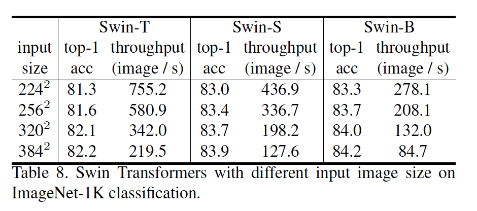

##### A3.2. COCO上ResNe(X)t的不同优化器

​		表9比较了ResNe(X)t骨干在COCO目标检测上的AdamW和SGD优化器。在这项比较中，使用Cascade Mask R-CNN框架。尽管SGD用作Cascade Mask R-CNN框架的默认优化器，但我们通常观察到通过将其替换为AdamW优化器而提高了准确性，尤其是对于较小的骨干网络。 因此，与所提出的Swin Transformer架构相比，我们将AdamW用于ResNe(X)t骨干网络。

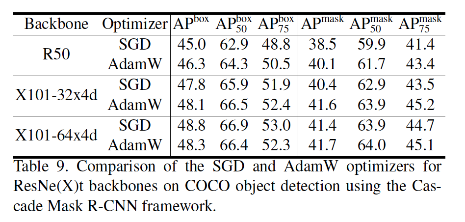