## Tokens-to-Token ViT: Training Vision Transformers from Scratch on ImageNet

### 1. 引言

​		尽管 ViT 证明全transformer架构在视觉任务中很有前景，但在中等规模的数据集（例如 ImageNet）上从头开始训练时，其性能仍然不如类似大小的 CNN（例如ResNets）。我们假设这种性能差距源于 ViT 的两个主要限制：1）通过硬分割（hard split）的输入图像直接标记化（tokenization）不能建模如边缘和线的局部结构，并且为了获得相似性能，它需要比CNN明显更多的训练样本（如JFT-300M）；2）ViT 的注意力主干没有如CNN一样很好地设计用于视觉任务，它包含冗余并导致有限的特征丰富性和模型训练的困难。

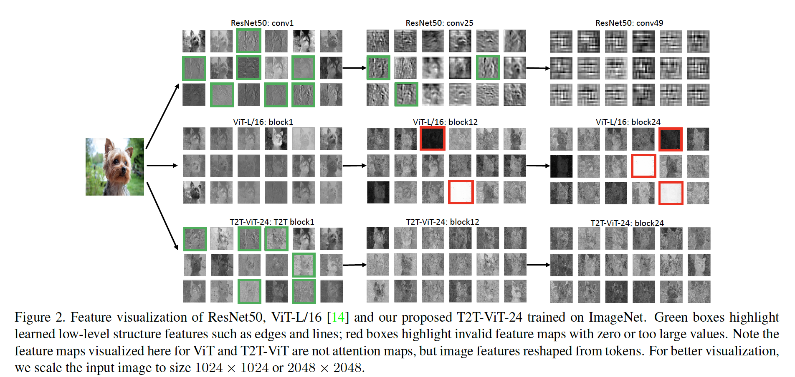

​		为了验证我们的假设，我们进行了一项试点研究，通过图 2 中的可视化来调查 ViTL/16 [14] 和 ResNet50 [17] 的学习特征的差异。我们观察到ResNet的特征渐进地从底层（conv1）到中间层（conv25）捕获期望的局部结构（边缘、线、纹理等）。但是，ViT的特征完全不同：结构信息建模不佳，而全局关系（例如，整条狗）被所有注意力块捕获。这些观察表明，当直接将图像划分为固定长度的token时，普通的ViT忽略局部结构。此外，我们发现ViT中的许多通道有零值（图2中的红色框突出），这意味着ViT骨干不如ResNets有效，并在训练样本不足时，提供有限的特征丰富性。

​		然后我们有动力设计一个新的全transformer视觉模型来克服上述限制。1）我们提出一种用于ViT的渐进标记化模块来将相邻token聚合一个token（即Tokens-to-Token模块），而不是ViT中使用的普通标记化，其可以在token周围建模局部结构信息，并迭代地减小token长度。具体而言，在每个Token-to-Token（T2T）步骤中，transformer层的token输出被重新构建为一幅图像（restructurization），其然后被划分重叠的token（soft split），并且最终通过展开划分的补丁聚合周围的token。因此，周围补丁的局部结构被嵌入到token以输入到下一transformer层。通过迭代地进行T2T，局部结构被聚合到token，token的长度可以通过聚合过程降低。2）为了找出视觉transformer的有效骨干，我们探索从CNN借助一些架构设计来构建transformer层以提高特征丰富性，并且我们发现在 ViT 中具有更少通道但更多层的“deep-narrow”架构设计在相当模型大小和 MAC（Multi-Add）下带来了更好的性能。具体而言，我们研究Wide-ResNets、DenseNet、ResNeXt、Ghost操作和通道注意力。我们发现，在它们之中，deep-narrow结构对于ViT最有效，其明显减少参数量和MAC，而几乎每性能衰退。这也表明CNN的架构工程可以对视觉transformer的架构设计有利。

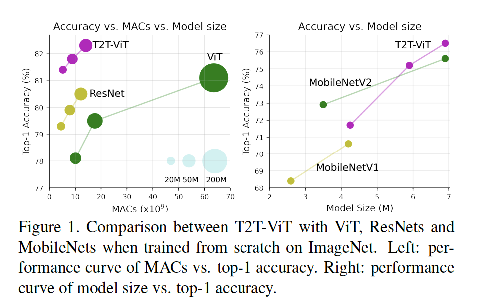

​		基于T2T模块和深浅骨干架构，我们开发Tokens-to-Token Vision Transformer（T2T-ViT），当在ImageNet上训练时，其明显提高性能（图1），并且比普通ViT更轻量。如图1所示，21.M参数和5.2G MAC的T2T-ViT在ImageNet上可以获得81.5% top-1准确率，远高于48.6M参数和10.1G MAC的ViT。这也高于相同大小的流行CNN模型，如25.5M参数的ResNet50（76%-79%）。此外，我们还通过简单地采用更少的层来设计 T2T-ViT 的精简变体，这与 MobileNets [19, 34] 取得了可比的结果（图 1）。

​		总之，我们的贡献为如下三方面：

- 我们第一次通过精心设计的 Transformer 架构（T2T 模块和高效的主干）表明Vision Transformer 在不同复杂度下在 ImageNet 上的表现优于 CNN，而无需在 JFT-300M 上进行预训练。
- 我们为 ViT 开发了一种新颖的渐进式标记化，并展示了其优于 ViT 的简单标记化方法的优势，并且我们提出了一个 T2T 模块，可以为每个标记的重要局部结构进行编码。
- 我们证明CNN 的架构工程可以有益于 ViT 的主干设计，以提高特征丰富度并减少冗余。 通过大量实验，我们发现deep-narrow架构设计最适合 ViT。

### 3. Tokens-to-Token ViT

​		为了克服 ViT 的简单标记化和效率低下的限制，我们提出Tokens-to-Token Vision Transformer（T2T-ViT），其可以渐进地将图像标记化为tokens，并且有高效的骨干。因此，T2T-ViT包含两个主要组件（图4）：1）逐层“Tokens-to-Token module”（T2T模块）来建模图像中的局部结构，并逐渐减小令牌的长度；2）一个高效的“T2T-ViT 主干”从 T2T 模块中提取对令牌的全局注意力关系。在探索几种基于CNN的架构设计后，我们为骨干采用deep-narrow结构以减小冗余，并增加特征丰富性。现在，我们逐个解释这些组件。

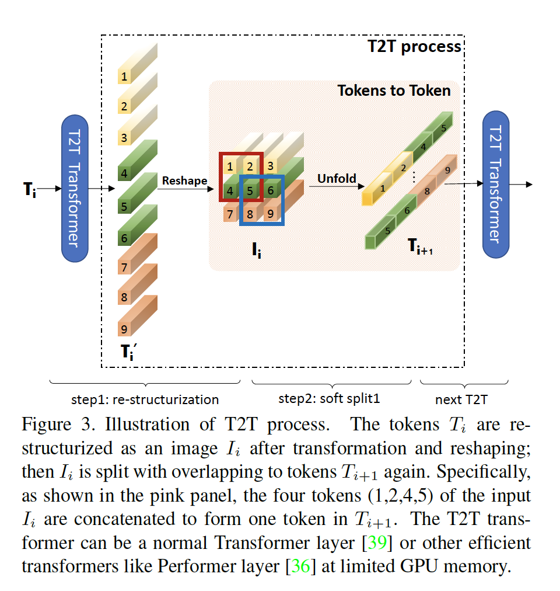

#### 3.1. Tokens-to-Token:  Progressive Tokenization

​		T2T模块旨在克服ViT简单令牌化的局限。它们渐进地将图像结构化为令牌，并建模局部信息，并且以这种方式，令牌的长度可以迭代地减小。每个T2T处理有两个步骤：Restructurization和Soft Split（SS） （图3）。

**Re-structurization**	如图3所示，给定前一transformer层的令牌序列$T$，它通过自注意力块变换（图3的T2T transformer）：

$$T' = \mbox{MLP(MSA}(T)), \tag{1}$$

其中$MSA$表示具有层归一化的多头自注意力，MLP为标准Transformer中具有层归一化的多层感知机。然后，令牌$T'$在空间维度上被调整为一幅图像：

$$I = \mbox{Reshape}(T').\tag{2}$$

这里，“Reshape”将令牌$T' \in \mathbb{R}^{l \times c}$重组为$I \in \mathbb{R}^{h \times w \times c}$，这里$l$为$T'$的长度，$h$、$w$、$c$分别为高、宽和通道，$l = h \times w$。

**Soft Split**	如图3所示，在获得重新结构化的图像$I$，我们在这个图像上使用soft split来建模局部结构信息，并减小令牌的长度。具体而言，为了避免在从重新结构化的图像中生成令牌时损失信息，我们将其拆分为重叠的补丁。因此，每个补丁都与周围的补丁相关，以建立一个先验，即周围令牌之间应该有更强的相关性。每个分割补丁中的令牌拼接为一个令牌（Tokens-to-Token，图 3），因此可以从周围的像素和补丁聚合局部信息。

​		当进行soft split时，每个patch的大小为$k\times k$，在图像上有$s$重叠和$p$个padding，其中$k-s$与卷积运算中的步幅相似。所以，对于重新结构化的图像$I \in \mathbb{R}^{h \times w \times c}$，soft split之后输出令牌$T_0$的长度为

$$l_o = \lfloor \frac{h + 2p -k}{k - s} + 1\rfloor \times \lfloor\frac{w + 2p - k}{k-s} + 1\rfloor.\tag{3}$$

每个split补丁的大小为$k \times k \times c$。我们将空间维度上的所有补丁展开为令牌$T_o \in \mathbb{R}^{l_o \times ck^2}$。在soft split之后，给下一个T2T处理馈入输出令牌。

**T2T模块**	通过迭代地构建上述的Re-structurization和Soft Split，T2T模块可以渐进地减小令牌的长度，并将转换图像的空间结构。T2T模块的迭代过程可以形式化为：

$$\begin{align}T_i' &= MLP(MSA(T_i)), \\ I_i &= Reshape(T_i'), \\ T_{i+1} &=SS(I_i), i =1, \cdots, (n-1).\end{align}\tag{4}$$

对于输入图像$I_0$，我们首先使用Soft Split来将它划分为令牌：$T_1 = SS(I_0)$。在最后的迭代后，T2T模块的输出令牌$T_f$有固定的长度，所以T2T-ViT的骨干可以建模$T_f$上的全局关系。

​		此外，由于T2T模块中的令牌长度比ViT中的常规情况$(16 \times 16)$长，MAC和内存占用很大。为了处理这个局限，在我们的T2T模块中我们将 T2T 层的通道维度设置为小（32 或 64）以减少 MAC，并可选地采用高效的 Transformer，例如 Performer [8] 层，以在有限的 GPU 内存下减少内存使用。我们提供了关于在我们的实验中采用标准 Transformer 层和 Performer 层之间的差异的消融研究。

#### 3.2. T2T-ViT Backbone

​		由于 vanilla ViT 主干中的许多通道无效（图 2），我们计划为我们的 T2T-ViT 找到一个有效的主干，以减少冗余并提高特征丰富度。因此，我们探索ViT的不同架构设计，并借助CNN的一些设计来提高骨干效率以及增强学习到的特征的丰富性。因为每个transformer层有与ResNet相同的skip connection，一种直接的想法时使用与DenseNet的密集连接来增加连通性和特征丰富度，或者使用Wide-ResNet或ResNeXt结构来改变ViT骨干的通道维度和头数。我们探索了从 CNN 到 ViT 的五种架构设计：

1. DenseNet中的密集连接；
2. Wide-ResNets中的deep-narrow vs. shallow-wide结构；
3. 与Squeeze-and-Excitation（SE）Networks相同的通道注意力；
4. 与ResNeXt相似，在多头注意力层中添加更多分裂头（split head）。
5. GhostNet中的Ghost操作。

​        ViT中的这些结构的详细设计见附录。我们对第 4.2 节中的结构迁移进行了广泛的实验。我们实证发现1）通过采用深窄结构（deep-narrow），简单地减少通道尺寸以减少通道中的冗余并增加层深度以提高ViT中的特征丰富度、模型容量和MAC均减小但性能得到提高；2）如SE 块的通道注意力也提高了 ViT，但不如使用 deep-narrow 结构有效。

​		基于这些发现，我们为T2T-ViT骨干设计了深浅架构。具体而言，它有较小的通道量和隐藏维度$d$，但是有更多层$b$。对于来自T2T模块最后层的固定长度$T_f$的令牌，我们将类令牌串联到这个最后的令牌，然后向其中添加Sinusoidal Position Embedding（PE），这与ViT进行分类一样：

$$\begin{align}T_{f_0} &= \big[t_{cls};T_f\big] + E, &E\in\mathbb{R}^{(l+1) \times d} \\T_{f_i} &=\mbox{MLP}(\mbox{MSA}(T_{f_{i-1}})), &i = 1, \cdots, d, \\y &=\mbox{fc}(\mbox{LN}(T_{f_b}))\end{align}\tag{5}$$

其中$E$为Sinusoidal Position Embedding，$\mbox{LN}$为层归一化，$\mbox{fc}$为用于分类的全连接层，$y$为输出预测。

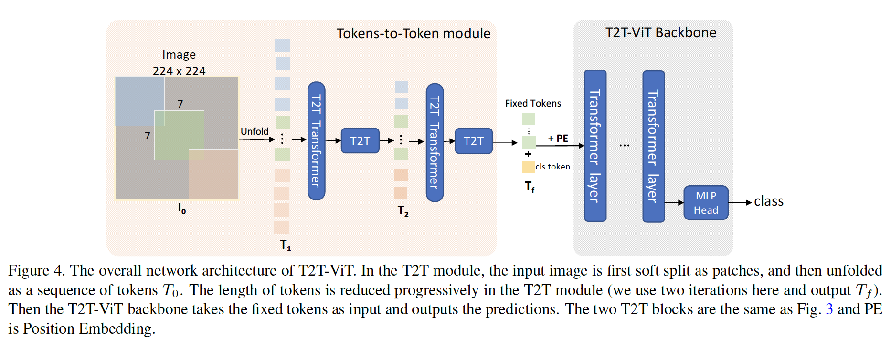

#### 3.3. T2T-ViT Architecture

​		T2T-ViT有两个部分：Tokens-to-Token（T2T）模块和T2T-ViT骨干（图4）。T2T模块有多种可能设计选项。这里，我们设置$n=2$，如图4所示，这意味着T2T模块中有$n+1=3$个soft split和$n=2$个re-structurization。三个soft split的补丁大小为$P=[7,3,3]$，以及重叠为$S=[3,1,1]$，其根据公式（3）将输入图像的大小从$224 \times 224$减小到$14 \times 14$。

​		T2T-ViT骨干以来自T2T模块的固定长度的令牌为输入，这与ViT相同；但是有隐藏维度（256-512）和MLP大小（512-1536）都比ViT小深浅架构设计，而ViT-B/16有12个transformer层和768个隐藏维度，在参数和MAC上比T2T-ViT-14大三倍。

​		为了与常用的手工设计的CNN进行公平比较，我们使T2T-ViT模型的大小与ResNets和MobileNets的大小相当。具体而言，我们设计三个模型：分别与resNet50、ResNet101和ResNet152相当的T2T-ViT-14、T2T-ViT-19和T2T-ViT-24。为了与如MobileNets的小模型比较，我们设计两个精简版模型：分别与MobileNetV1和MobileNetV2相当模型大小的T2T-ViT-7、T2T-ViT-12。两个 lite TiT-ViT 没有像高效卷积 [28] 这样的特殊设计或技巧，只是简单地减少了层深度、隐藏维度和 MLP 比率。 网络详细信息总结在表 1 中。

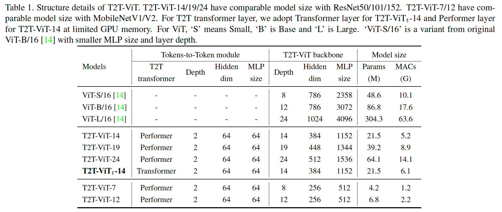

### 4. 实验

#### 4.1. T2T-ViT on ImageNet

使用512或1024的批大小在8张NVIDIA GPU上进行训练。模型训练310epoch，使用AdamW作为优化器以及预先学习率衰减。详细细节见附录。

**T2T-ViT vs. ViT**

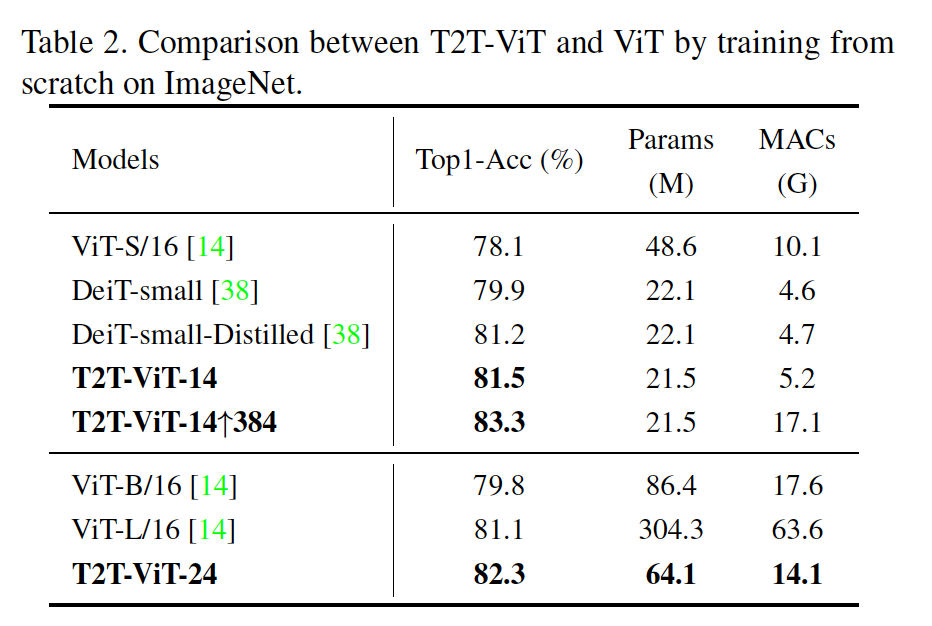

**T2T-ViT vs. ResNet**

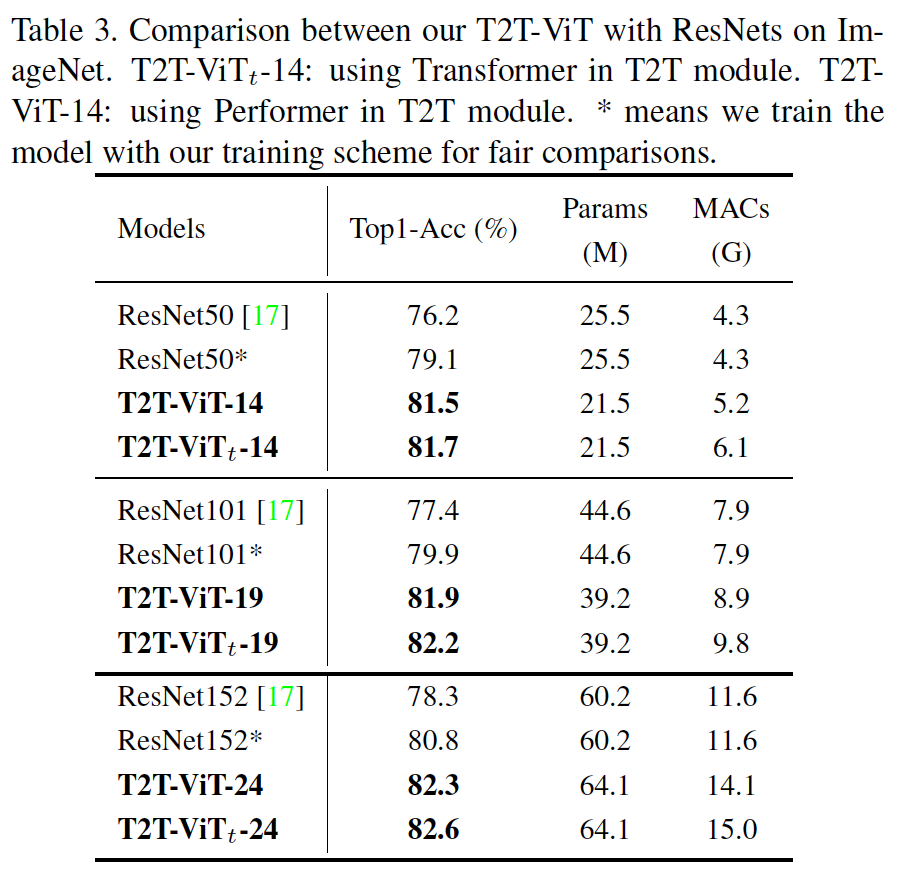

**T2T-ViT vs. MobileNets**

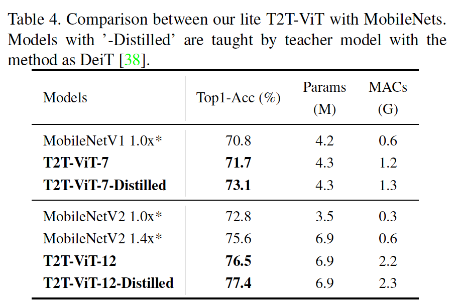

**Transfer learning**

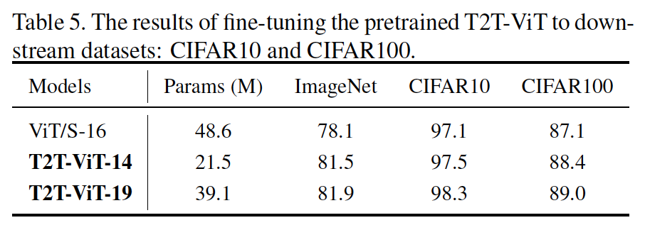

#### 4.2. From CNN to ViT

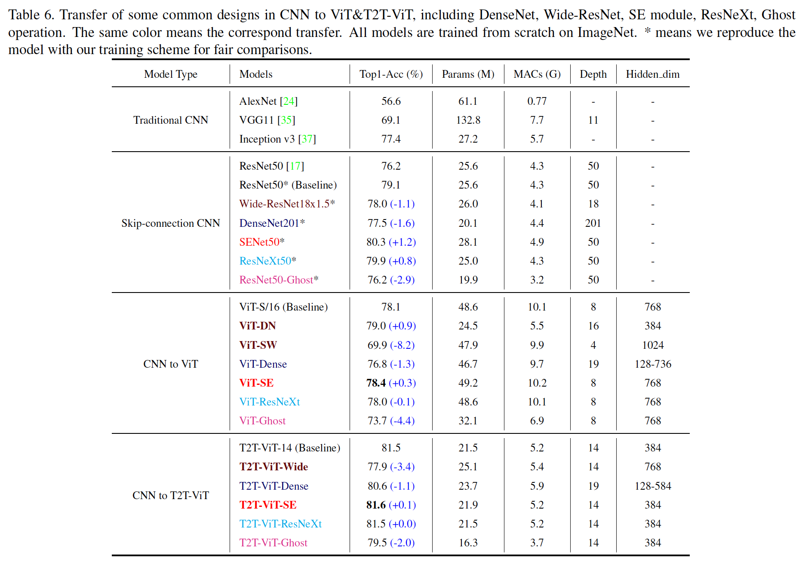

**Deep-narrow structure benefits ViT:**	表6中的ViT-DN（Deep-Narrow）和ViT-SW（Shallow-Wide）为通道维度和层深度中的两种相反设计，其中ViT-DN有384个隐藏维度和16层，ViT-SW有1024隐藏维度和4层。与768个隐藏维度和8层的ViT-S/16的极限模型相比，shadllow-wide模型ViT-SW在性能上减小8.2%，而仅有模型一半大小和MAC的ViT-DN获得0.9%的增加。这些结果验证了我们的假设，即具有shadllow-wide结构的朴素ViT在通道尺寸上是冗余的，并且浅层的特征丰富度有限。

**Dense connection hurts performance of both ViT and T2T-ViT:**	与ResNet50相比，DenseNet201有更少的参数和相当的MAC，同时它的性能更高。但是，密集连接可能损害ViT-Dense和T2T-ViT-Dense（黑蓝色的行）性能。

**SE block improves both ViT and T2T-ViT:**	根据表6红色行，我们发现SENet、ViT-SE和T2T-ViT-SE的性能比对应基线高。SE模块可以提高CNN和ViT的性能，这表明将注意力用于通道对CNN和ViT模型都有利。

**ResNeXt structure has few effects on ViT and T2T-ViT:**	ResNeXts在ResNets中采用多个头，同时Transformer也是多头注意力结构。当采用更多头（如32个）时，我们发现性能几乎没有影响（表6中红色行）。但是，采用大量head会使GPU显存变大，因此在ViT和T2T-ViT中是不必要的。

**Ghost can further compress model and reduce MACs of T2T-ViT:**	比较 Ghost 操作的实验结果（表 6 中的洋红色行），准确率在 ResNet50 上下降了 2.9%，在 T2T-ViT 上下降了 2.0%，在 ViT 上下降了 4.4%。 因此 Ghost 操作可以进一步降低 T2T-ViT 的参数和 MAC，性能下降比 ResNet 小。 但是对于原始的 ViT，它会比 ResNet 造成更多的下降。

#### 4.3. 消融研究

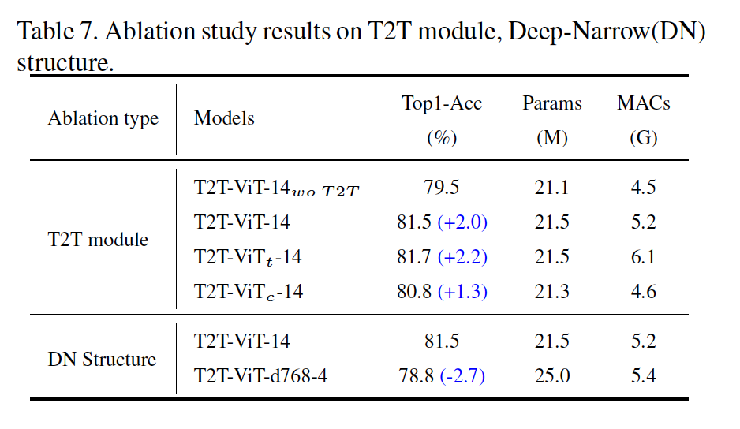

### A. 附录

#### A.1. 从CNN结构迁移到ViT的细节

**从ResNet-Wide到ViT&T2T-ViT**	Wide-ResNets设计为减小ResNets的层深度，并增加其宽度，因此ViT-DN的隐藏层维度为384和层数为16，ViT-SW的隐藏层维度为1024和4层。

**从DenseNet到ViT&T2T-ViT**	ViT-Dense&T2T-ViT-Dense中的每一块都与其前面的块相连，如果每块有$L$个Transformer层，这个块有$T(L+1)/2$个连接，第$l$个层有来自其早期层的$l$个输入。

**从SENet到ViT&T2T-ViT**	

**从ResNeXt到ViT&T2T-ViT**	简单地增加头数

**从Ghost-CNN到ViT&T2T-ViT**

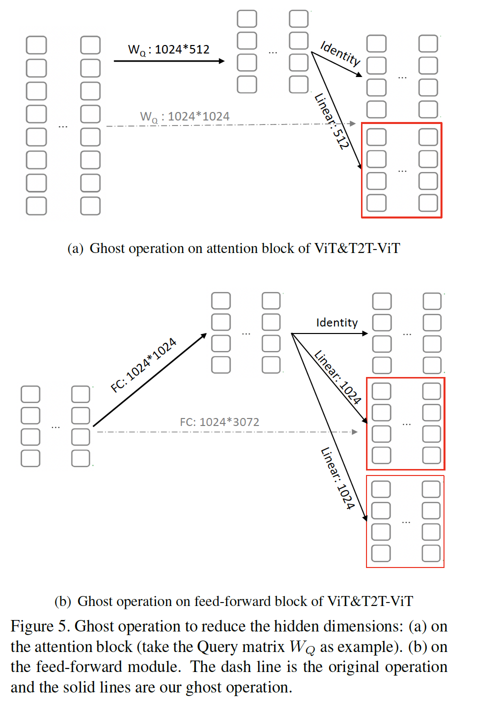

#### A.2. 实验设置的细节

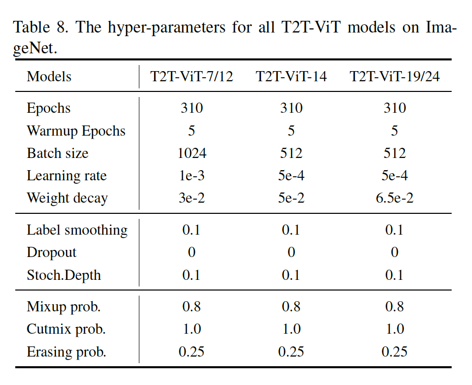

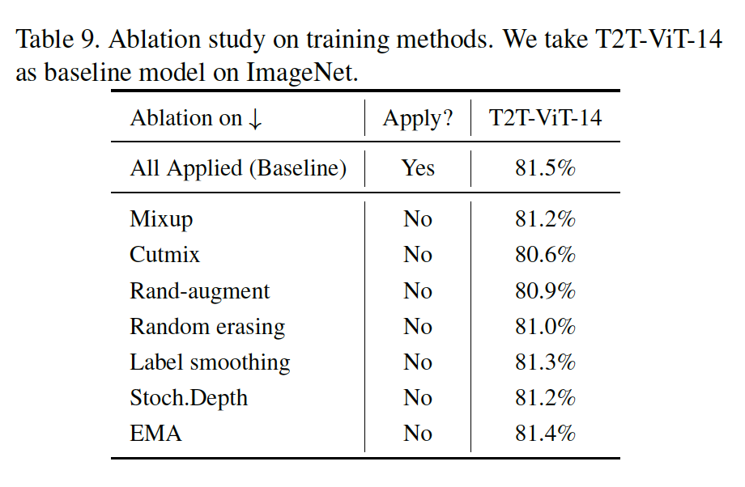

