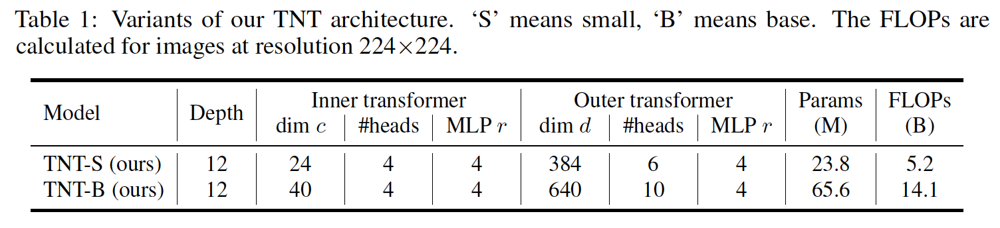

## Transformer in Transformer

### 1	引言

​		在ViT中，图像被划分为贴片序列，每个贴片被简单地转换为向量（嵌入）。通过普通的transformer块处理这些嵌入。通过如此，在几乎没有修改的情况下，ViT可以通过标准的transformed处理图像。这种设计也影响了后续的工作，包括DeiT、ViT-FRCNN、IPT和SETR。但是，这些视觉Transformer忽略贴片内的局部关系和结构信息，这对于视觉识别很重要。通过将贴片映射到向量，空间结构会崩溃，并且难以学习。

​		

​		本文中，我们提出一种新颖的Transformer-iN-Transformer（TNT）架构用于视觉识别，如图1所示。具体而言，将一幅图像划分为贴片序列，每个补丁reshape为（super）像素序列。通过从贴片和像素的线性变换分别获得贴片嵌入和像素嵌入，然后将它们馈入一堆 TNT 块中进行表征学习。在TNT块中，有两种transformer块，其中outer transformer块建模贴片嵌入之中的全局关系，inner transformer块提取像素嵌入的局部结构信息。通过将像素嵌入线性投影到贴片嵌入空间中，将局部信息添加到贴片嵌入中。为了保留空间信息，引入了贴片级和像素级位置嵌入。最后，类token用于使用MLP头进行分类。通过提出的TNT模型，我们可以建模图像的全局和局部结构信息，并改善特征的表示能力。ImageNet基准测试和下游任务上的实验表明我们的方法在准确率和FLOP上的优越性。例如，我们的TNT-S仅需5.2B FLOP便获得81.3% ImageNet top-1准确率，其比有相似计算成本的DeiT高1.5%。

### 2	方法

#### 2.1	Preliminaries

​		我们首先简要描述transformer种的基本组件：MSA、MLP、LN。

#### 2.2	Transformer in Transformer

​		给丁一张2D图像，我们将它均匀地划分为$n$个贴片$\mathcal{X} = [X^1,X^2,\cdots,X^n] \in \mathbb{R}^{n \times p \times p \times 3}$，其中$(p,p)$为每个图像贴片的分辨率。ViT[10]仅使用标准Transformer来处理贴片序列，这破坏了贴片的局部结构，如图1（a）所示。相反，我们提出Transformer-iN-Transformer（TNT）架构来学习图像中全局和局部信息。在TNT中，每个贴片通过像素展开[26]和线性映射进一步转换为目标尺寸$(p',p')$，贴片张量序列为：

$$\mathcal{Y}_0 = [Y_0^1, Y_0^2,\cdots,Y_0^n] \in \mathbb{R}^{n \times p' \times p' \times c},\tag{4}$$

其中$Y_0^i \in \mathbb{R}^{p' \times p' \times c}, i = 1,2,\cdots,n$，并且$c$为通道数。特别地，我们将每个贴片张量$Y_o^i$视为像素贴片序列：

$$Y_0^i = [y_0^{i,1}, y_0^{i,2},\cdots,y_0^{i,m}] \tag{5}$$

其中$m = p'^2$和$y_0^{i,j} \in \mathbb{R}^c, j = 1,2,\cdots,m$。

​		在TNT中，我们有两个数据流，其中一个数据流跨贴片运行，另一个处理每个贴片中的像素。对于像素嵌入，我们利用transformer块来探索像素见的关系：

$$\begin{align}Y_l^{'i} &= Y_{l-1}^i + MSA(LN(Y_{l-1}^i)), \tag{6} \\ Y_l^i &= Y_l^{'i} + MLP(LN(Y_l^{'i})) \tag{7}.\end{align}$$

其中$l = 1,2,\cdots,L$为第$l$层的索引，$L$为层的总数。变换后的所有贴片张量为$\mathcal{Y} = [y_l^1,y_L^2,\cdots,Y_l^n]$。这可以视为inner transformer block，表示为$T_{in}$。这一过程通过计算任意两个像素之间的交互来构建像素之间的关系。例如，在人脸贴片中，属于眼睛的像素与眼睛的其他像素更相关，而额头像素缺乏交互。

​		对于贴片级别，我们创建贴片嵌入内存来存储贴片级表示：$\mathcal{Z}_0 = [Z_{class}, Z_0^1,Z_0^1,\cdots, Z_0^n] \in \mathbb{R}^{(n+1)\times d}$，其中$Z_{class}$为与ViT相似的类标记，它们都初始化为0。在每层中，贴片张量通过线性映射转换为贴片嵌入域，并且添加到贴片嵌入中：

$$Z_{l-1}^i = Z_{l-1}^i + Vec(Y_{l-1}^i)W_{l-1} + b_{l-1},\tag{8}$$

其中$Z_{l-1}^i \in \mathbb{R}^d$，$Vec(\cdot)$将输入展开为一个向量，$W_{l-1}\in\mathbb{R}^{mc\times d}$和$b_{l-1} \in\mathbb{R}^d$分别为权重和偏置。我们使用标准transformer块来转换贴片嵌入：

$$\begin{align}\mathcal{Z}_l^{'i} &= \mathcal{Z}_{l-1}^i + MSA(LN(\mathcal{Z}_{l-1}^i)), \tag{9} \\ \mathcal{Z}_l^i &= \mathcal{Z}_l^{'i} + MLP(LN(\mathcal{Z}_l{'i})).\tag{10}\end{align}$$

​		outer transformer block $T_{out}$用于构建贴片嵌入之中的关系。总之，TNT块的输入和输出包括像素嵌入和贴片嵌入，如图1（b）所示，所以TNT可以表示为：

$$\mathcal{Y}_l,\mathcal{Z}_l = TNT(\mathcal{Y}_{l-1}, \mathcal{Z}_{l-1}).\tag{11}$$

在TNT块中，inner transformer block用于建模像素之间的关系进行局部特征提取，而outer transformer block从贴片序列中捕获固有信息。通过堆叠TNT块$L$次，我们构建transformer-in-transformer网络。最后，分类标记用作图像表示，并应用全连接层进行分类。

**Position encoding**	空间信息时图像识别的重要因素。对于贴片嵌入和像素嵌入，我们都添加相关位置编码以保留空间信息，如图2所示。这里致用标准的1D可学习位置编码。具体而言，每个贴片都分配有一个位置编码：

$$\mathcal{Z}_0 \larr \mathcal{Z}_0 + E_{patch}, \tag{12}$$

其中$E_{patch} \in \mathbb{R}^{(n+1)\times d}$为贴片位置编码。至于贴片中的像素，将像素位置编码添加到每个像素嵌入：

$$Y_0^i \larr Y_0^i + E_{pixel}, i = 1,2, \cdots, n \tag{13}$$

其中$E_{pixel} \in \mathbb{R}^{m \times c}$为像素位置编码，其跨贴片共享。以这种方式，贴片位置编码可以维持全局空间信息，而像素位置编码用于保留局部相关位置。

#### 2.3	复杂度分析

​		标准transformer块包括两个部分，即多头自注意力和多层感知机。MSA的FLOP为$2nd(d_k + d_v) + n^2(d_k + d_v)$，MLP的FLOP为$2nd_vrd_v$，其中$r$为MLP中隐藏层的维度膨胀比例。综上所述，标准Transformer块的FLOP为

$$\mbox{FLOPs}_T = 2nd(d_k + d_v) + n^2(d_k + d_v) + 2nddr.\tag{14}$$

由于$r$通常设置为4，并且输入、键（查询）和值的维度通常设置相同，FLOP的计算可以简化为

$$\mbox{FLOPs}_T = 2nd(6d + n).\tag{15}$$

参数量为

$$\mbox{Params}_T = 12dd.\tag{16}$$

TNT块包含三个部分：inner transformer block $T_{in}$、outer transformer block $T_{out}$和线性层。$T_{in}$和$T_{out}$的计算复杂度分别为$2nmc(6c+m)$和$2nd(6d+n)$。线性层的FLOP为$nmcd$。总之，TNT块的FLOP为

$$\mbox{FLOPs}_{TNT} = 2nmc(6c + m) + nmcd + 2nd(6d + n).\tag{17}$$

相似地，TNT块的参数复杂度为

$$\mbox{Params}_{TNT} = 12cc + mcd + 12dd. \tag{18}$$

尽管我们在TNT块中添加两个组件，但由于实际上$c \ll d$以及$\mathcal{O}(m) \approx \mathcal{O}(n)$，所以FLOP的增加很小。例如，在ViT-B/16的配置中，有$d=768$和$n=196$。在TNT-B的结构中，相应设置$c=12$和$m=64$。根据式（15）和式（17），我们可以得到$FLOPs_T = 1446M$和$FLOPs_{TNT} = 1603M$。TNT与标准transformer块的FLOP之比为1.09。相似地，参数之比大约为1.08。利用计算和内存成本的小幅增加，我们的 TNT 块可以有效地对局部结构信息进行建模，并在准确性和复杂性之间实现更好的权衡，如实验所示。

#### 2.4	网络架构

​		我们遵循ViT和DeiT的基本配置构建TNT架构。贴片大小设置为$16 \times 16$。默认情况下，展开的贴片大小$p'$设置为 4，其他大小值在消融研究中进行评估。如表1所示，TNT网络的有两个不同模型大小的变体，即TNT-S和TNT-B。它们分别包含23.8M和65.6M参数。处理$224 \times 224$的图像的FLOP分别为5.2B和14.1B。

**Operational optimizations**	受用于CNN的squeeze-and-excitation（SE）网络的启发，我们提出将逐通道注意力用于transformer。我们使用平均所有贴片（像素）嵌入，并使用两层MLP来计算注意力值。注意力乘以所有嵌入。SE模块仅带来少量额外参数，但是能够执行逐维度注意力进行特征增强。

### 3	实验

#### 3.1	数据集和实验设置

**数据集**	ImageNet ILSVRC2012。采用与DeiT相同的增强策略，包括随机裁剪、随机剪辑、Rand-Augment [8]、Mixup [37] 和 CutMix [36]。

​		除了ImageNet，我们还通过迁移学习测试下游任务，以评估 TNT 的泛化。 使用的视觉数据集的详细信息如表 2 所示。数据增强策略与 ImageNet 相同。

**实现细节**	我们使用DeiT提供的训练策略。除了常用设置[14]之外，主要的先进技术包括AdamW [21]、标签平滑[29]、DropPath [19]、重复增强[16]。 为了更好地理解，我们在表 3 中列出了超参数。 所有模型均使用 PyTorch [26] 实现，并在 NVIDIA Tesla V100 GPU 上进行训练。

#### 3.2	TNT on ImageNet

#### 3.3	消融研究

**Effect of position encodings**	

**Number of #heads**	标准transformer中的头数在多个工作[23、24]中得到研究，并且视觉任务[10、31]中推荐的头宽度为64。在我们的模型的outer transformer block中的头宽度设置为64。inner transformer block的头数为需要研究的另一个超参数。我们评估了inner transformer块中头数的效果（表 6）。 我们可以看到适当数量的头（例如 2 或 4）可实现最佳性能。

**Transformed patch size $(p',p')$**	在TNT中，输入图像分为$16 \times 16$的补丁，并且每个补丁进一步转换为大小为$(p',p')$以提高计算效率。这里，我们测试TNT-S架构中超参数$p'$的影响。如表7所示，我们可以看出$p'$的值在性能上有轻微影响，默认情况下，为了效率，除非特别说明，我们使用$p'=4$。

#### 3.4	可视化

#### 3.5	迁移学习

