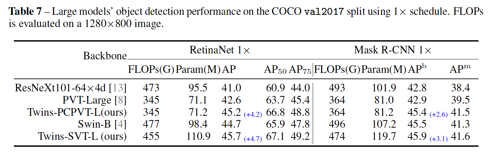
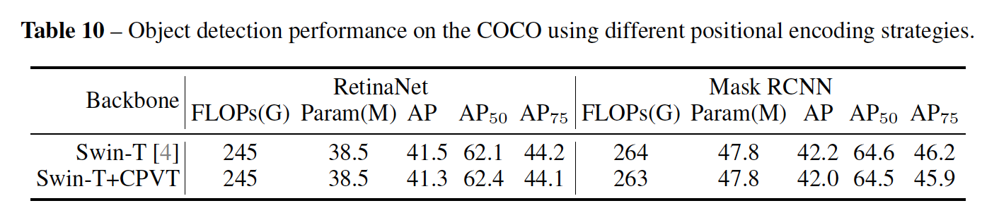

## Twins: Revisiting the Design of Spatial Attention in Vision Transformers

代码见https://git.io/Twins。

### 1. 引言

​		将transformer用于视觉任务的一个主要问题是transformer中空间自注意力的操作引起的繁重计算复杂度，它在输入图像的像素数量上呈二次方增长。一种解决方法是局部分组的自注意力（或在最近的 Swin Transformer [4] 中的非重叠窗口中的自注意力），其中输入在空间上分组为非重叠窗口，并且标准自注意力仅在每个子窗口内计算。尽管它可以明显减小复杂度，但是它缺乏不同窗口之间的连接，并且产生有限的感受野。足够大的感受野是性能的关键，特别是对于诸如图像分割和目标检测的密集预测任务。Swin提出一种平移窗口操作来处理这个问题，其中这些局部窗口的边界随着网络的深入而逐渐移动。尽管有效，但移位的窗口可能具有不均匀的大小。当使用现代深度学习框架（倾向于相等大小的窗口）实现时，不均匀的窗口难以实现。PVT[8]提出另一种解决方案。与标准的自注意力操作（其中每个查询利用所有输入token计算注意力权重）不同，在PVT中，每个查询斤利用输入token的子采样版计算注意力。理论上，它的计算复杂度仍是二次方，但是它在实践中已是可管理的。

​		从一个统一的角度，前面提到的视觉transformer中的核心是如何设计空间注意力。因此，本文中，我们回顾视觉transformer中空间注意力的设计。第一个发现是，PVT中全局子采样注意力高度有效，并且通过适用的位置编码 [9]，其性能与最先进的视觉transformer相当（例如 Swin ）。这产生我们的第一个提出的架构，称为Twins-PCPVT。在这之上，我们进一步提出仔细设计而简单的空间注意力（carefully-designed yet simple spatial attention）来替换PVT中缺乏有效全局子采样的注意力。我们的注意力机制受广泛使用的可分离按深度卷积的启发，因此我们称其为spatially separable self-attention（SSSA）。SSSA包含两种类型的注意力操作——（i）locally-grouped self-attention（LSA）和（ii）global sub-sampled attention（GSA），其中LSA捕获细粒度和短距离信息，GSA处理长距离和全局信息。两种注意力操作仅需几行代码就可以利用矩阵乘法高效而轻松地实现。这产生提出的第二个版本的transformer架构，称为Twins-SVT。

### 3	我们的方法：Twins

#### 3.1	Twins-PCPCVT

​		PVT引入金字塔多阶段设计来更好地处理诸如目标检测和语义分割的密集预测任务。它继承了ViT和DeiT中的绝对位置编码设计。所有层使用全局注意力机制，并且依赖空间规约来减小处理整个序列的计算成本。令人惊讶的是，最近提出的基于移动局部窗口的 Swin transformer [4] 的性能比 PVT 好得多，即使在密集预测任务中，足够大的感受野对良好性能更为重要。

​		本文中，我们惊奇地发现不太受欢迎的性能仅仅是由于 PVT 中使用的绝对位置编码 [8]。如CPVT[9]所示，在处理不同大小输入时，绝对位置编码遇到困难。此外，这种位置编码野打乱了translation invariance。相反，Swin transformer利用相对位置编码，其解决了上述问题。这里，我们证明这是Swin优于PVT的根本原因，并且我们证明如何使用合适的位置编码，PVT实际上可以获得与Swin transformer相当，甚至更好的性能。

这里，我们使用CPVT中提出的条件位置编码（conditional position: CPE）来替换PVT中的绝对位置编码。CPE以输入为条件，并且可以自然而然地避免绝对嵌入的上述问题。位置编码生成器（position encoding generator：PEG）（生成CPE）放在每阶段的第一个编码器块之后。我们使用PEG的最简单格式，即没有BN的2D depth-wise卷积。对于图像级分类，遵循CPVT，我们移除类token，并在阶段的末尾使用全局平均池化。对于其他视觉任务，我们遵循PVT的设计。Twins-PCVT继承了PVT和CPVT的优势，这使得它很容易有效地实现。我们的大量实验结果表明，这种简单的设计可以匹配Swin transformer的性能。我们还尝试利用Swin中的CPE替换相对PE，但是，它没有产生明显的性能提高。我们推测这可能是有由于Swin中使用移位窗口。

**架构设置**	表1给出Twins-PCVT设置的细节，其与PVT相似。因此，Twins-PCPVT的FLOPs和参数量与[8]相似。

#### 3.2	Twins-SVT

​		由于高分辨率输入，视觉transformer在密集预测任务中受到沉重的计算复杂性的严重影响。给定$H \times W$分辨率的输入，维度为$d$的自注意力的复杂度为$\mathcal{O}(H^2W^2d)$。这里，我们提出空间上可分离的自注意力（spatially separable self-attention:  SSSA）来缓解这种挑战。SSSA由locally-grouped self-attention（LSA）和global sub-sampled attention（GSA）。

**Locally-grouped self-attention（LSA）**	受可分离卷积设计以实现高效推理的启发，我们首先将 2D 特征图等划分到子窗口中，使自注意力通信仅发生在每个子窗口内。具体来说，特征图被分为$m \times m$子窗口。不是一般性，我们假设$H \% m =0$和$W\%n=0$。每个组包含计算成本为$\mathcal{O}(\frac{H^2W^2}{m^2n^2}d)$的$\frac{HW}{mn}$个元素。总成本为$\mathcal{O}(\frac{H^2W^2}{mn}d)$。如果我们使用$k_1 = \frac{H}{m}$、$k_2=\frac{W}{n}$，成本可以计算为$\mathcal{O}(k_1k_2HWd)$，当$k_1\ll H$以及$k_2 \ll W$时，这明显更有效，如果$k_1$和$k_2$固定，则与$HW$呈线性增长。

​		尽管局部分组的自注意力机制是计算友好的，但图像被划分为不重叠的子窗口。因此，我们需要一种机制来进行不同子窗口之间的交流，如Swin一样。否则，信息始终局限于局部处理，因此感受野仅为$k_1 \times k_2$，如我们的实验，这明显衰退性能。这类似于我们无法用 CNN 中的深度卷积替换所有标准卷积的事实。

**Global sub-sampled attention（GSA）** 一种简单的解决方案时在每个局部注意力块之后添加额外的标准全局自注意力层，其可以保证跨组的信息交换。但是，这种方法使计算复杂来到$\mathcal{O}(H^2W^2d)$。

​		在这里，我们使用单个代表来总结每个$m \times n$子窗口的关键信息，代表用于与其他子窗口（作为 self-attention 的键）进行通信，这可以将成本急剧减小到$\mathcal{O}(mnHW) = \mathcal{O}(\frac{H^2W^2}{k_1k_2})$。这本质上相当于使用子采样的特征图作为注意力操作的键，因此，我们称其为全局子采样注意力（global sub-sampled attention：GSA）。如果我们如可分离卷积（depth-wise + point-wise）一样交替使用LSA和GSA。总计算成本为$\mathcal{O}(\frac{H^2W^2d}{k_1k_2}+k_1k_2HWd)$。我们有$\frac{H^2W^2d}{k_1k_2}+k_1k_2HWd \ge 2HWd\sqrt{HW}$。当$k_1 \cdot k_2 = \sqrt{HW}$时，获得最小值。我们注意到分类中流行的输入为$H=W=224$。不是一般性，我们使用正方形子窗口，即$k_1 = k_2$。因此，对于$H=W=224$，$k_1=k_2=15$接近全局最小。但是，我们的网络设计包含可变分辨率的多个阶段。阶段1的特征为为$56 \times 56$，当$k_1 = k_2 = \sqrt{56}\approx 7$时，获得最小值。理论上，我们可以标定每个阶段的最优$k_1$和$k_2$。为简单起见，我们在任何地方都使用$k_1 = k_2 = 7$。

​		至于子采样函数，我们研究了几个选项，包括平均池化、深度步长卷积和常规步长卷积。经验结果表明，常规跨步卷积在这里表现最好。 形式上，可分离的transformer块可以写为

$$\begin{align}\hat{\mathbf{z}}_{ij} &= LSA(LayerNorm(\mathbf{z}_{ij}^{l-1})) + \mathbf{z}_{ij}^{l-1}, \\\mathbf{z}_{ij}^l&=FFN(LayerNorm(\hat{\mathbf{z}}_{ij}^l))+\hat{\mathbf{z}}_{ij}^l, \\\hat{\mathbf{z}}^{l+1} &=GSA(LayerNorm(\mathbf{z}^l)) + \mathbf{z}^l, \\\mathbf{z}^{l+1}&=FFN(LayerNorm(\hat{\mathbf{z}}^{l+1})) + \hat{\mathbf{z}}^{l+1},\\i&\in\{1, 2, \cdots, m\}, j\in\{1,2,\cdots,n\}\end{align}\tag{1}$$

其中LSA表示子窗口中的局部分组自注意力，GSA表示与来自每个子窗口$\hat{\mathbf{z}}_{ij}\in\mathcal{R}^{k_1\times k_2\times C}$的代表性键（由子采样函数生成）交互的全局子采样注意力。LSA和GSA与标准自注意力一样有多个头。LSA的PyTorch代码见算法1。

​		同样，我们使用 CPVT [9] 的 PEG 来编码位置信息并动态处理可变长度的输入。 它被插入在每个阶段的第一个块之后。

**Model variants**	Twins-SVT的详细配置见表2。我们尽量使用与 Swin [4] 中类似的设置，以确保良好的性能归功于新的设计范式。

**与PVT的比较**	PVT完全利用如DeiT的全局注意力，而我们的方法利用具有LSA和GSA的类似空间上可分离的设计，其更加有效。

**与Swin的比较**	Swin 利用基于局部窗口的注意力，其中连续平移窗口。这种用于引入不同补丁之间的交流，并增加感受野。但是，这一过程相对复杂，并且不易于在诸如移动设备上优化速度。我们的方法更加简单，并且对于已有的方法很友好，因为构建在常用的支持操作之上。才，我们的局部-全局设计可以更好的利用全局上下文，这种上下文在许多视觉任务中起着重要作用。

​		最后，人们可能会注意到我们的两种变体的网络配置（例如深度、隐藏层维度、头的数量和MLP的膨胀比例）略为不同。这种偏向是因为我们想要对最近提出的两种著名transformer PVT和Swin进行公平比较。PVT倾向更更薄更深的设计，而 Swin 更宽更浅。Twins-PCPVT设计用于与PVT比较，并证明位置编码设计可以极大地提升性能，并且使它与如Swin等SOTA模型相当的性能。另一方面，Twins-SVT 展示了一种新范式的潜力，即空间可分离的自注意力与最近的 Transformer 相比具有很强的竞争力。

### 4	实验

#### 4.1	ImageNet-1K上的分类

​		使用AdamW优化器以1024的批大小训练300 epoch。初始学习率设置为0.001，并在300 epochs中利用余弦策略衰减到0。在前5个epoch中使用线性热启动，以及与[2]相同的正则化设置。请注意，我们没有使用 [26, 28] 中的额外技巧，从而进行公平的比较，尽管它可能会进一步提高我们方法的性能。我们为小型、基和大型模型分别使用0.2、0.3、0.5的递增随机深度增强。我们使用最大范数5.0的梯度裁剪来稳定训练过程，其对于大型模型的训练尤其重要。

#### 4.2	ADE20K上的语义分割

**Experiments with Twins-PCPVT**	为了公平比较，使用Semantic FPN框架，并与PVT完全相同的训练设置。使用AdamW以16的批大小训练80K步。学习率初始划为$1\times10^{-4}$，通过通过幂系数为0.9的“poly”策略。对于骨干使用0.2的drop-path正则化，并且整个网络的权重衰减为0.0005。值得注意的是，对于大型模型，使用0.4的drop-path正则化。对于Swin，我们使用它们的官方代码和训练模型。结果见表4。

**Experiments with Twins-SVT**	Swin[4]使用UperNet框架评估它的性能。我们使用与[4]完全相同的训练设置，并且没有调整超参数。我们使用AdamW优化器训练所有模型160K次迭代，全局批大小为16。初始学习率为$6 \times 10^{-5}$，并线性见到0。并在前1500次迭代中使用warmup。此外，对于骨干，我们使用0.2的drop-path正则化，整个网络的权重衰减设置为0.01。比较结果见表4。

#### 4.3	COCO上目标检测和分割

#### 4.4	消融研究

**LSA和GSA块的配置**	基于小型模型评估不同LSA和GSA的组合，并在表8中介绍结果。仅有局部分组注意力的模型难以获得全局性能，因为这种设置具有有限和小感受野。最后阶段中的额外全局注意力层可以将分类性能提高3.6%。Local-Local-Gobal（简称LLG）也获得好性能，但是这项工作没有使用这种设计。

**Sub-sampling functions**	我们进一步研究不同子采样函数对性能的影响。具体而言，我们基于“小”模型比较常规步长卷积、可分离卷积和平均池化，并在表9中给出结果。

**位置编码**	对于Swin-T，我们替换为CPVT中的位置编码，并且RetinaNet和Mask RCNN的检测性能见表10。

