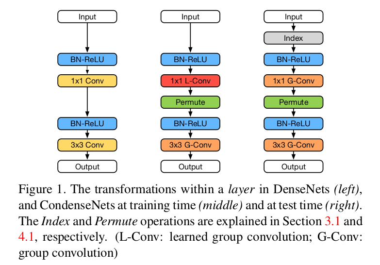

CondenseNet: An Efficient DenseNet using Learned Group Convolutions
=

# 1. Introduction
卷积网络(CNNs)在图像分类等视觉识别任务中的高精度[12,19,38]，激发了将这些网络部署到计算资源有限的平台上的愿望，例如在机器人、自动驾驶汽车和移动设备上。不幸地是，多数准确的深度 CNN，如赢得 ImageNet 和 COCO 挑战的，都设计用于计算资源丰富的场景。因此，这些模型不能用于在低计算设备上记性实时推理。

这个问题激发了计算上有效的 CNN 的改进，例如剪枝冗余连接、使用低精度或量化权重、或使用更有效的网络架构。这些努力产生实质上的改进： 为了获得与VGG 在 ImageNet 上可比的准确率，ResNet 减小了计算量 5 倍，DenseNets 减小 10 倍，MobileNet 和 ShuffleNet 减小 25 倍。在移动设备上进行深度学习的典型设置是在多 gpu 机器上训练CNNs，但在计算能力有限的设备上部署CNNs。因此，良好的模型运行在训练期间快速并行化，但测试时应当是紧凑的。

最仅的工作表明 CNN 中有许多冗余。逐层连接模式强制网络在整个网络中复制早期层的特征。DenseNets 架构通过直接将每一层与之前的所有层连接起来，从而减少了对特征复制的需求，这引入了特性重用。尽管更加有效，但是我们假设，当早期的特征在后面的层中不需要时，密集连接会引入冗余。我们提出一种新的方法来剪掉层与层之间的冗余连接，然后引入更加高效的架构。与先前的剪枝方法相比，我们的方法方法在在训练过程中自动学习稀疏网络，并产生规则的连接模式，其可以使用组卷积有效实现。具体而言，我们一层的滤波器分成多个组，并在训练期间主机那移除每个组中较为不重要的连接。重要的是，传入特征组不是预定义的，而是学习得到的。产生的模型称为 CondenseNet ，其可在 GPU 上有效地训练，并在移动设备上具有高推理速度。

我们的图像分类实验表明，CondenseNet 由于其他替代网络。与 DenseNets 相比，在可比的准确率水平下， CondenseNet 仅使用 DenseNets 计算量的 $1/10$ 。在 ImageNet 数据集上，275M FLOPs 的 CondenseNet 获得 29% 的 top-1 误差，这与需要两倍计算的 MobileNet 的误差相当。

# 3. CondenseNets

组卷积在许多深层神经网络架构中工作良好[43,46,47]，这些架构是按层连接的。对于密集架构，组卷积能够用于 $3 \times 3$ 卷积层（见图 1 左）。然而，初步实验表明 $1 \times 1$ 卷积层中组卷积的朴素改变导致准确率的急剧下降。我们推测这是由于这样的事实： $1 \times 1$ 卷积层的输入是前面层生成的特征图的拼接。因此，它们在两个方面不同于卷积层的典型输入：1.它们有内在的顺序，2.它们有更多的多样性。将这些特征分配给不相交组的困难阻碍了网络中特征的有效重用。实验中，我们在执行组卷积之前随机排列输入特征图表明这减小准确率上的负面影响——但是即使随机排列，$1 \times 1$ 卷积层中的组卷积使 DenseNets 的准确率比具有相当计算成本的更小的 DenseNets 的准确率低。

DenseNets 表明将早期特征作为后期特征的输入对有效的特征重用是重要的。尽管每个后续层都不是需要所有先前特征，但是很难预测特征应当用于哪个点。为了处理这个问题，我们开发了一种方法，其在训练期间自动学习输入特征分组。学习组结构允许每个滤波器组选择它自身最相关的输入结合。此外，我们允许多个组共享输入特征，也允许特征被所有组忽略。注意，在 DenseNets 中，即使输入特征被特定层的所有组忽略，它仍能被不同层的一些组利用。为了将其与规则的组卷积区别，我们称之为 _learned group convolution_ 。

## 3.1. Learned Group Convolution
我们通过多个阶段学习组卷积，如图 3 和图 4 。训练迭代的前半部分有 _condensing_ 阶段组成。这里，我们重复训练具有稀疏诱导正则化的网络进行固定次数的迭代，然后删除不重要的低权重滤波器。训练的第二部分由 _optimization_ 极端组成，其中我们在分组固定后学习滤波器。当执行剪枝时，我们确保来自相同组的滤波器共享稀疏模式。因此，一旦训练完成(测试阶段)，就可以使用标准的组卷积来实现稀疏层。因为组卷积可以通过学的深度学习库高效实现，这在理论上和实际上都产生较高的计算节约。我们接下来介绍细节。

**Filter Groups.** 我们以标准标准卷积开始，其滤波器由大小为 $O \times R \times W \times H$ 的 4 维张量组成，其中 $O, R, W \mbox{和} H$ 分别表示输出通道数、输入通道数、滤波器核的宽和高。因为，我们关注 DenseNets 中的 $1 \times 1$ 卷积层，4 为张量减小为 $O \times R$ 的矩阵 $F$ 。我们考虑本文中的简单案例。但是，我们的方法可以稳定地用于较大的卷积核。在训练之前，我们首先将滤波器（或者，等价地，输入特征）划分为相对大小的 $G$ 组。我们将这些组的滤波器权重表示为 $F^1, F^2, \cdots, F^G$ ；每个 $F^g$ 大小为 $\frac{O}{G} \times R$ ，而 $F_{ij}^g$ 对应组 $g$ 中第 $i$ 个输出的第 $j$ 个输入的权重。因为输出特征没有明显的顺序，这种随机分组不会对层的质量产生负面影响。

**Condensation Criterion.** 训练过程中，我们逐渐扫描每个组中较为不重要的输入特征的子集。第 $j$ 个传入的特征图对于滤波器组 $g$ 的重要性是通过组内所有输出之间的权值的平均绝对值来计算的，即 $\sum_{i=1}^{O/G} |F_{i,j}^g|$ 。换句话说，如果 $F^g$ 的某列的 $L_1-\mbox{范数}$ 比其他列的 $L_1-\mbox{范数}$ 小，那么我们移除该列（通过将其置为 0 ）。卷积层中的这种结果结构上是稀疏的： 来自相同组的滤波器始终接收相同的特征集合作为输入。

**Group Lasso.** 为了减小因权重剪枝引起的准确上的负面影响，通常使用 $L_1$ 正则化来减小稀疏化。在 CondenseNets 中，我们鼓励相同组的卷积滤波器使用出入特征的相同子集，即我们引入组级稀疏。为此，我们在训练期间使用如下的 _group-lasso_ 正则化：

$$\sum_{g=1}^G \sum_{j=1}^R \sqrt{{\sum_{i=1}^{O/G}F_{i,j}^g}^2}$$

group-lasso 正则化同时将 $F^g$ 中的所有列推向零，因为平方根项被其列中的最大元素主导。这就导致了我们所追求的组级稀疏性。

**Condensation Factor.** 
