## Designing Network Design Spaces

### 摘要

​		本文中，我们提出一种新的网络设计范式。我们的目标是帮助增进对网络设计的理解，并发现可在各种设置之间泛化的设计原则。我们不着重于设计单个网络实例，而是设计可参数化网络总体的网络设计空间。整个过程类似于经典的网络手动设计，但提升到设计空间级别。使用我们的方法，我们探索网络设计的结构方面，并得出一个低维设计空间，该空间由简单的常规网络组成，我们称之为RegNet。RegNet参数化的核心见解非常简单：良好网络的宽度和深度可以用量化的线性函数来解释。我们分析RegNet的设计空间，并得出与当前网络设计实践不符的有趣发现。RegNet设计空间提供简单而快速的网络，这些网络可以在各种各样的FLOP下正常工作。在可比的训练设置和FLOP之下，RegNet模型优于流行的EfficientNet模型，而在GPU上的速度提高5倍。

### 1. 引言

​		深度卷积神经网络是视觉识别的引擎。在过去的几年中，更好的架构已在各种视觉识别任务中取得长足的进步，包括LeNet[15]、AlexNet [13]、VGG [26]和ResNet [8]。这项工作提高神经网络的有效性以及我们对网络设计的理解。特别地，上述工作序列分别证明卷积、网络和数据大小、深度和残差的重要性。这些工作的结果不仅是特定的网络实例，而且是可以泛化并应用于多种设置的设计原理。

​		尽管手动网络设计已经取得了长足的进步，但是手动寻找经过优化的网络可能是一个挑战，特别是随着设计选择数量的增加。处理这种局限的流行方法是神经架构搜索（NAS）。给定可能网络的固定搜索空间，NAS自动在搜索空间中找出良好的模型。最近，NAS受到了广泛关注，并显示出出色的效果[34、18、29]。

​		尽管NAS的有效性，但该范例仍有局限性。搜索的结果是将单个网络实例调整为特定设置（例如硬件平台）。在一些情况下是足够的；但是，它不能发现加深我们的理解并允许我们推广到新设置的网络设计原则。特别地，我们的目的是找出易于理解、构建和泛化的简单模型。

​		在这项工作中，我们提出新的网络设计范式，其结合手工设计和NAS的优势。我们不着重于设计单个网络实例，而是设计可以参数化网络总体的设计空间。像手动设计一样，我们的目标是可解释性，并发现描述简单、运行良好且可跨设置泛化的网络的**一般设计原则**。与NAS相似，我们的目标是利用半自动化过程来帮助实现这些目标。

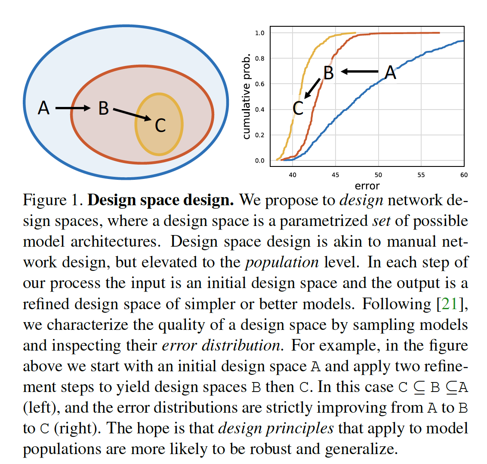

​		我们采用的一般策略是在保持或改善其质量的同时，逐步设计初始的、相对不受限制的设计空间的简化版本（图1）。整体过程类似手工设计，提升到总体水平，并通过网络设计空间的分布估计来指导[21]。

​		作为该范式的试验平台，我们的重点是探索网络结构（例如宽度、深度、组等），并假设标准模型族包括VGG [26]、ResNet [8]和ResNeXt [31]。我们从一个相对不受约束的设计空间开始，我们将其称为AnyNet（例如，宽度和深度在各个阶段之间自由变化），然后应用“human-in-the-loop”方法得出由简单的“常规”网络组成的低维设计空间， 我们称之为RegNet。RegNet设计空间的核心是简单的：通过**quantized linear function**确定阶段宽度和深度。与AnyNet相比，RegNet设计空间具有更简单的模型，更易于解释，并且具有较高的良好模型集中度。

​		我们使用ImageNet [3]上的单个网络块类型在低计算量、低周期的情况下设计RegNet设计空间。然后，我们证明RegNet设计空间可以泛化到更大的计算机制、调度长度和网络块类型。此外，设计空间设计的重要属性是它更具可解释性，可以带来我们可以学习的见解。我们分析RegNet设计空间，并得到与当前网络设计实践不符的有趣发现。例如，我们发现最佳模型的深度在各种计算方式下（20个block）是稳定的，并且最佳模型没有使用瓶颈或倒置瓶颈。

​		我们在不同设置下比较top RegNet模型与现有网络。首先，REGNET模型在移动环境中出奇地有效。我们希望这些简单的模型可以作为未来工作的强壮基线。其次，REGNET模型在所有指标上都大大优于标准RESNE(X)T [8，31]模型。我们着重介绍固定激活的改进，由于激活数量会极大地影响加速器（如GPU）的运行时间，因此具有很高的实用价值。接下来，我们将其与各种计算体系中最新的EefficientNet [29]模型进行比较。在可比的训练设置和FLOPs下，RegNet模型优于EfficientNet模型，而在GPU上有5倍加速。我们进一步在ImageNetV2[24]上测试泛化能力。

​		我们注意到网络网络结构可以说是可以考虑的一种最简单的设计空间设计形式。专注于设计更丰富的设计空间（例如包括算子）可能会带来更好的网络。然而，结构可能仍是如此设计空间中的核心组件。

​		为了促进未来的研究，我们将发布此工作中介绍的所有代码和预训练的模型（https://github.com/facebookresearch/pycls）。

### 2. 相关工作

​		**手工网络设计**	AlexNet [13]的引入将网络设计推向蓬勃发展的研究领域。接下来几年，提出改进的网络设计，例如VGG、Inception、ResNet、ResNeXt、DenseNet和MobileNet。这些网络背后的设计过程主要是手动的，着重于发现提高精度的新设计选择，例如使用更深的模型或残差。我们同样拥有发现新设计原则的目标。 实际上，我们的方法类似于手动设计，但在设计空间级别执行。

​		**自动网络设计**	最近，网络设计过程已从手动探索转变为更流行的NAS网络化自动化设计。NAS已被证明是找出良好模型的有效工具，例如[35、23、17、20、18、29]。NAS的大部分工作都集中在搜索算法上，即在固定的手动设计的搜索空间（我们称为设计空间）内有效地找到最佳的网络实例。相反，我们的重点是设计新颖设计空间的范式。这两部分是相互补充的：**更好的设计空间可以提高NAS搜索算法的效率，并且还可以通过丰富设计空间来带来更好的模型**。

​		**Network scaling**	手动和半自动网络设计通常都专注于为特定机制（例如，与ResNet-50相当的FLOP数量）寻找性能最佳的网络实例。由于该过程的结果是单个网络实例，因此尚不清楚如何使该实例适应不同的机制（例如更少的FLOP）。一种常用实践是应用网络扩展规则（network scaling rule），例如不同的网络深度、宽度、分辨率或所有三方面的联合。相反，我们的目标是发现适用于各种方案的通用设计原则，并允许在任何目标方案中有效调整最佳网络。

​		**Comparing networks**	鉴于存在大量可能的网络设计空间，因此必须使用可靠的比较指标来指导我们的设计过程。最近，[21]的作者提出一种用于比较和分析从设计空间采样的网络种群的方法。这种分布级别的视角与我们寻找通用设计原则的目标完全一致。我们采用这种方法论并证明它可以作为设计空间设计过程的有用工具。

​		**参数化**	我们最终的量化线性参数化与以前的工作有相似之处，例如如何设置stage宽度[26、7、32、11、9]。但是，有两个关键差异。**第一，我们提供一项实证研究，证明我们所做的设计选择是合理的。第二，我们深入了解以前无法理解的结构设计选择（例如，如何设置每个阶段中的模块数量）。**

### 3.  Design Space Design

​		我们的目的是为视觉识别设计更好的网络。我们不是在特定的设置下设计或搜索单个最佳模型，而是研究模型总体的行为。我们旨在发现可以用于并改进整个模型总体的通用设计原则。这样的设计原则可以提供对网络设计的见解，并且更有可能泛化到新的设置（与针对特定场景调整的单个模型不同）。

​		我们依赖Radosavovic等[21]引入的网络_设计空间_的概念。设计空间是巨大（可能无限）的模型架构总体。来自[21]的核心见解是，我们可以从设计空间中对模型进行采样，从而产生模型分布，并且可以使用经典统计中的工具来分析设计空间。我们注意到这与架构搜索不同，其中目标是从空间中找到单一最佳模型。

​		在这项工作中，我们提出设计一个不受限制的初始设计空间的渐进简化版本。我们称这一过程为_design space design_。设计空间设计类似于顺序手动网络设计，但提升到总体水平。具体而言，在我们设计过程的每个步骤中，输入都是一个初始设计空间，而输出是一个完善的设计空间，每个设计步骤的目的都是发现能够产生更简单或更有效模型的设计原则。

​		我们首先在第3.1节中描述用于设计空间设计的基本工具。接着，在3.2节中，我们将我们的方法用于设计空间（称为AnyNet），其允许不受约束的网络结构。在3.3节中，在设计一系列设计步骤之后，我们获得仅包含规则网络结构（我们称为RegNet）的简化设计空间。最后，因为我们的目标不是为单个设置设计一个设计空间，而是发现可以推广到新设置的网络设计的一般原则，所以在第3.4节中，我们测试RegNet设计空间到新设置的推广。

​		相对于AnyNet设计空间，RegNet设计空间为：（1）在其允许的网络配置尺寸和类型方面进行简化；（2）包含更高集中的顶级性能模型；（3）更易于分析和解释。

#### 3.1. Tools for Design Space Design

​		我们首先概述用于设计空间设计的工具。为了评估和比较设计空间，我们使用Radosavovic等[21]引入的工具，他们建议通过从设计空间中采样一组模型并描述产生的模型误差分布来量化设计空间的质量。这种方法背后的关键直觉是比较分布比使用搜索（手动或自动）以及比较两个设计空间中发现的最佳模型更加具鲁棒性和有用。

​		为了获得模型的分布，我们从设计空间采样并训练$n$个模型。为了提高效率，我们主要是在低计算量、低周期的训练制度中如此做。特别地，在本节中，我们使用400 million FLOP（400MF），并在ImageNet数据集上训练每个采样模型10个周期。我们注意到，虽然我们训练许多模型，但是每个模型运行很快：在400MF上训练10个周期的100个模型在FLOPS大致等同于在4GF下训练100个周期的单个ResNet-50 [8]模型。

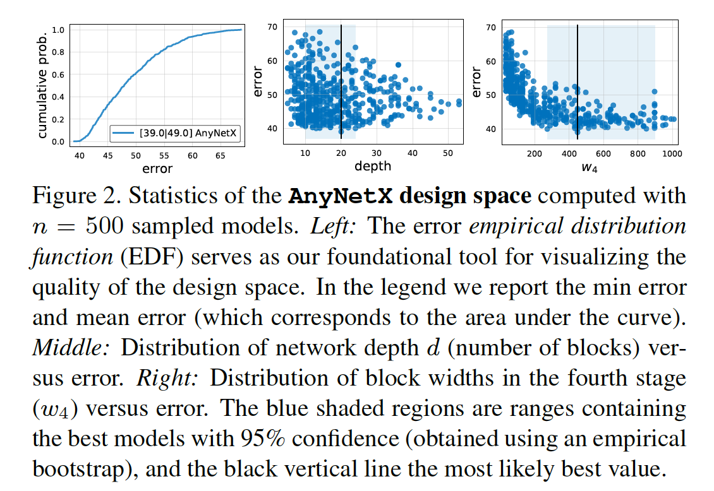

​		如[21]，我们分析设计空间质量的主要工具是error_empirical distribution function（EDF）_。具有误差$e_i$的$n$个模型的error EDF为：

$$F(e) = \frac{1}{n}\sum_{i=1}^n \mathbf{1}[e_i < e]. \tag{1}$$

$F(e)$给出误差小于$e$的模型的比例。我们在图2（左）中给出来自AnyNetX设计空间（在第3.2节中描述）的n = 500个采样模型的错误EDF。

​		给定训练过的模型的总体，我们可以绘制和分析各种网络属性与网络错误的关系，请参见图2（中）和（右），以了解来自AnyNetX设计空间的两个示例。这种可视化效果给出复杂的高维空间的一维投影，并且可以帮助您获得对设计空间的见解。对于这些图形，我们使用_empirical boostrap_[5]来估计最佳模型可能落入的范围。

​		总之：（1）我们生成通过对设计空间中的$n$个模型进行采样和训练而获得的模型分布，（2）我们计算并绘制误差EDF以总结设计空间的质量，（3）我们可视化设计空间的不同属性，并使用empirical bootstrap来增加见解，（4）我们使用这些见解完善设计空间。

[

​		empirical boostrap: 给定模型统计量$x_i$（例如深度）和相应误差$e_i$的$n$个对$(x_i, e_o)$，我们计算_empirical boostrap_：（1）替换25% pair的采样，（2）在样本中选择最小误差的pair，（3）重复这一过程$10^4$倍，（4）计算最小$x$值的95％CI。中值给定最可能的最佳值。

]

#### 3.2. The AnyNet Design Space

​		我们接下来介绍初始AnyNet设计空间。我们的重点是探索假设标准、固定网络块（例如残差瓶颈块）的神经网络的结构。在我们的术语中，网络的结构包括诸如块数（即网络深度）、块宽度（即通道数）以及其他块参数（如瓶颈比例或组宽）之类的元素。网络的结构确定整个网络计算图中的计算、参数和内存的分布，并且是确定其准确性和效率的关键。

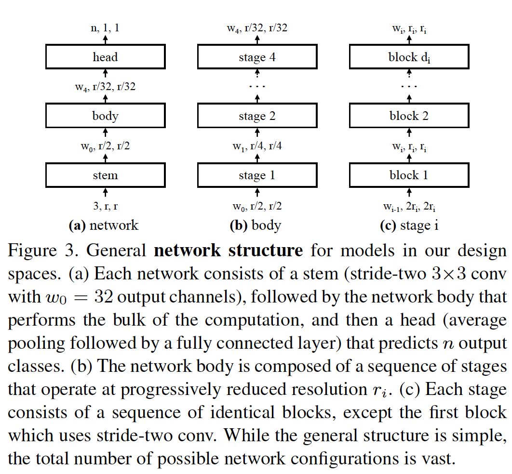

​		AnyNet设计空间中的网络的基本设计是简单直接的。给定一个输入图像，一个网络由一个简单的stem，一个执行大量计算的网络body以及一个预测输出类别的最终网络head组成，参见图3a。我们保持stem和head固定，并且尽可能简单，我们关注网络body的结构，这是确定网络计算和准确性的关键。

​		网络body包括4个以逐渐降低的分辨率运行的阶段，见图3b（我们在§3.4中探讨了变化的阶段数）。每个阶段包含一系列相同的块，见图3c。总之，对于每个阶段$i$，自由度包含块$d_i$的数量、块宽度$w_i$和任何其他块参数。尽管通用结果很简单，但是AnyNet设计空间中的可能网络的数量是不同的。

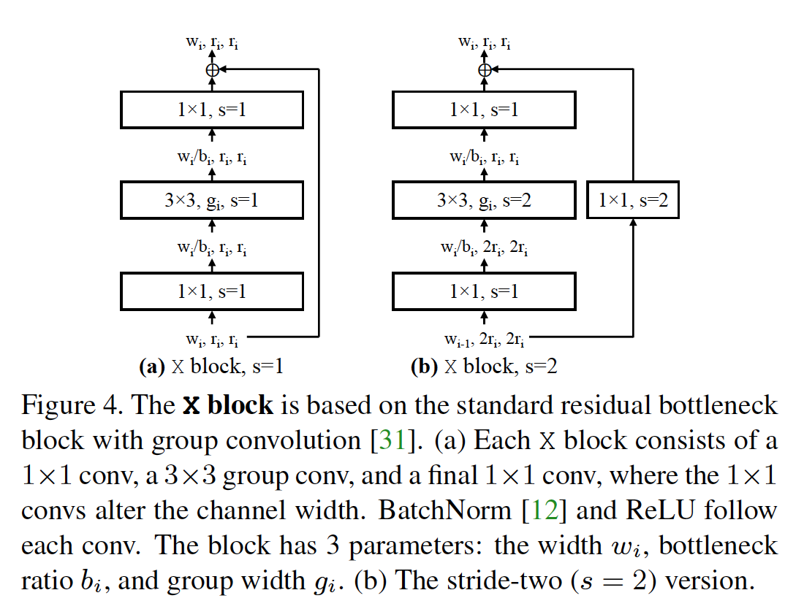

​		我们的大多数实验都使用带有组卷积的标准残差瓶颈块[31]，如图4所示。我们称这种块为X block，用它构建的AnyNet称为AnyNetX（其他块在3.4节中讨论）。尽管X block非常初级，但我们证明在优化网络结构时它可能出奇地有效。

​		AnyNetX设计空间有16个自由度，因为每个网络包含4个阶段，每个阶段$i$有4个参数：块$d_i$的数量、块宽度$w_i$、瓶颈比例$b_i$和组宽度$g_i$。为了获得有效模型，我们对能整除8的$d_i \le 16$、$w_i \le 1024$、$b_i \in \{1, 2， 4\}$和$g_i \in \{1, 2, \cdots,21\}$（我们在后面测试这些范围）。我们重复采样，直到在目标复杂度范围内（360MF至400MF）获得n = 500个模型，并对每个模型训练10个周期【第3节中的设置完全遵循[21]。我们使用动量为0.9的SGD，1个GPU上的mini-batch大小为128、初始学习率为0.05的半周期余弦调度、权重衰减为$5\cdot10^{-5}$。通常，10个周期足以获得鲁棒性的总体统计量。】。AnyNetX的基本统计量如图2所示。

​		在AnyNetX设计空间中有$(16\cdot128\cdot3\cdot6)^4\approx 10^{18}$可能的模型配置。我们将探索是否存在一些通用的设计原则来帮助我们理解和完善这个设计空间，而不是从这$\sim10^{18}$种配置中寻找单个最佳模型。为此，我们采用设计空间的方法。在这个方法的每个步骤中，我们的目的是：

1. 为了简化设计空间的结构，
2. 为了提高设计空间的可解释性，
3. 为了提高或维持设计空间的质量，
4. 为了维持设计空间中模型的多样性。

我们现在将这个方法用于AnyNetX设计空间。

​		$\mathbf{AnyNetX}_{\mathbf{A}}$	为了清楚起见，我们将不受限制的初始$\mbox{AnyNetX}$设计空间称为$\mbox{AnyNetX}_\mbox{A}$。

​		$\mathbf{AnyNetX}_{\mathbf{B}}$	我们首先针对$\mbox{AnyNetX}_\mbox{A}$设计空间的所有阶段$i$测试共享的瓶颈比例$b_i = b$，然后将所得的设计空间称为$\mbox{AnyNetX}_\mbox{B}$。和前面一样，我们在相同的设置下从$\mbox{AnyNetX}_\mbox{B}$采样并训练500个模型。$\mbox{AnyNetX}_\mbox{A}$和$\mbox{AnyNetX}_\mbox{B}$的EDFs（如图5（左）所示）在平均情况和最佳情况下几乎相同。这表明耦合$b_i$时准确率没有损失。除了更简单之外，$\mbox{AnyNetX}_\mbox{B}$还更易于分析，例如参见图5（右）。

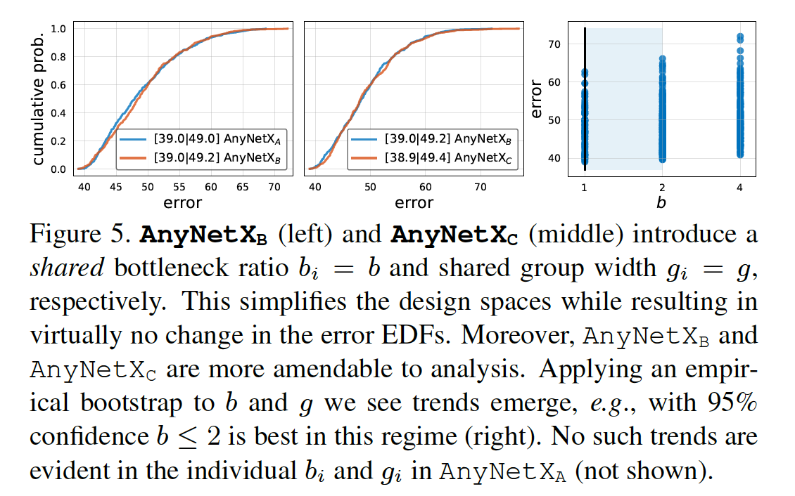

​		$\mathbf{AnyNetX}_{\mathbf{C}}$	我们的第二个优化步骤紧随第一步。以$\mbox{AnyNetX}_\mbox{B}$开始，我们还为所有阶段使用共享的组宽度$g_i = g$以获得$\mbox{AnyNetX}_\mbox{C}$。与前面的相同，EDF几乎没有变化（见图5（中））。总体而言，$\mbox{AnyNetX}_\mbox{C}$的自由度比$\mbox{AnyNetX}_\mbox{A}$少6个，并将设计空间大小减小近四个数量级。有趣的是，我们发现$g>1$是最佳的（没有展示）；我们将在第4节中更详细的分析。

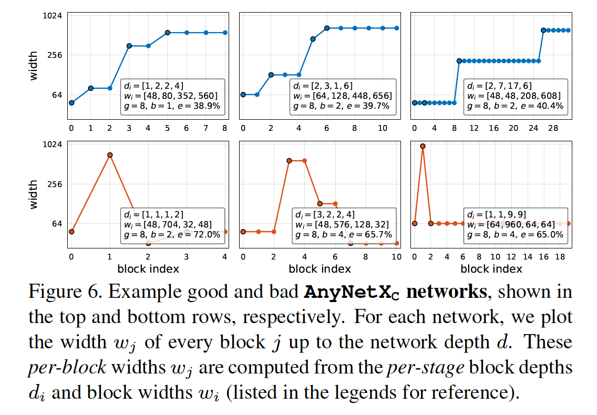

​		$\mathbf{AnyNetX}_{\mathbf{D}}$	接下来，我们在图6中检查$\mbox{AnyNetX}_\mbox{C}$的好坏网络的典型网络结构。出现一种模式：良好的网络宽度越来越大。我们测试$w_{i+1} \ge w_i$的设计原则，并将具有此约束的设计空间称为$\mbox{AnyNetX}_\mbox{D}$。在图7（左）中，我们看出这实质上改进了EDF。我们将很快讨论其他用于控制宽度的选项。

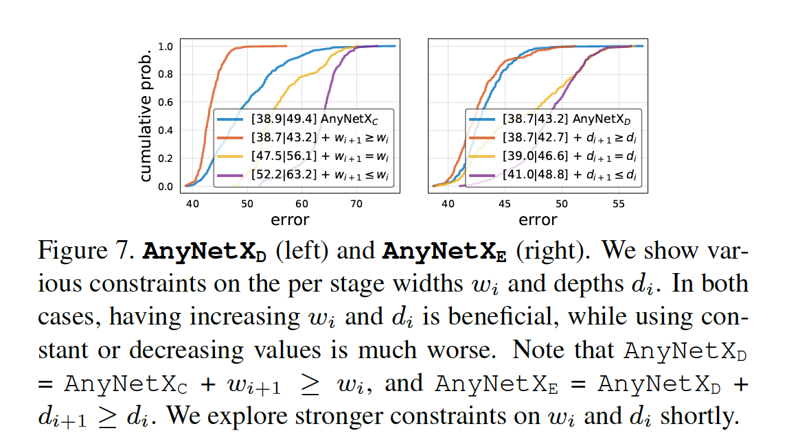

​		$\mathbf{AnyNetX}_{\mathbf{E}}$	在进一步检查许多模型（未展示）之后，我们观察到另一个有趣的趋势。除阶段宽度$w_i$随$i$增加外，对于最佳模型而言平台深度$d_i$同样倾向于增加，尽管不一定要在最后阶段。尽管如此，我们在图7（右）中用$d_{i + 1} \ge d_i$测试一个设计空间变体$\mbox{AnyNetX}_\mbox{E}$，并看到它也改善了结果。最后，我们注意到$w_i$和$d_i$的约束分别将设计空间减少$4 !$，并且$\mbox{AnyNetX}_\mbox{A}$累计减少$O(10^7)$。

#### 3.3.  The RegNet Design Space

​		为了进一步了解模型结构，我们在一个图中展示$\mbox{AnyNetX}_\mbox{E}$的最佳20种模型，请参见图8（左上）。对于每个模型，我们绘制每block$j$的每块（per-block）的宽度$w_j$到网络深度$d$（我们分别使用$i$和$j$来索引阶段和块）。请参阅图6，以获取我们模型可视化的参考。

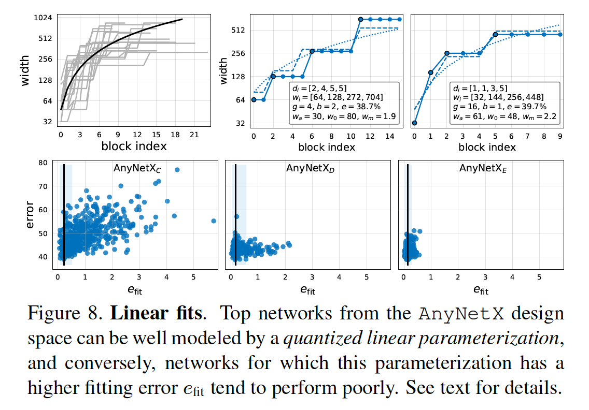

​		尽管各个模型（灰色曲线）存在显着差异，但总体上会出现一种模式。特别地，在相同的图中，我们展示$0 \le j \le 20$范围内的线$w_j = 48 \cdot (j+1)$（黑色实线，请注意$y$轴是对数的）。值得注意的是，这种平凡的线性拟合似乎可以解释顶级模型的网络宽度增长的总体趋势。但是请注意，此线性拟合为每个块分配不同的宽度$w_j$，而各个模型具有量化的宽度（逐段常函数：piecewise constant function）。

​		要查看类似的模式是否适用于各个模型，我们需要一种策略来将线量化为分段常数函数。受对$\mbox{AnyNetX}_\mbox{D}$和$\mbox{AnyNetX}_\mbox{E}$的观察的启发，我们提出如下方法。首先，我们为块宽度（block width）引入线性参数化（linear parameterization）：

$$u_j = w_0 + w_a \cdot j \mbox{  for  } 0 \le j < d \tag{2}$$

这种参数化有三个参数：深度$d$、初始宽度$w_0 > 0$和斜率（slope） $w_a > 0$ ，以及为每块$j < d$生成不同的块宽度$u_j$。为了量化$u_j$，我们引入额外的参数$w_m > 0$，其按照如下方式控制量化。首先，根据公式（2）给出的$u_j$，我们为每个块$j$计算$s_j$，使得下式成立：

$$u_j = w_0 \cdot w_m^{s_j} \tag{3}$$

然后，为了量化$u_j$，我们只需对$s_j$四舍五入（表示为$\lfloor s_j\rceil$），并通下式计算量化的每块宽度$w_j$：

$$w_j = w_0 \cdot w_m^{\lfloor s_j\rceil} \tag{4}$$

我们可以通过简单地计算常数宽度的块数，将每块$w_j$转换为每阶段格式，即每阶段$i$的块宽度$w_i=w_0 \cdot w_m^i$以及块的数量$d_i = \sum_j \mathbf{1}[\lfloor s_j\rceil=i]$。当仅考虑四阶段网络时，我们忽略产生不同阶段数的参数组合。

​		我们通过拟合$\mbox{AnyNetX}$的模型来测试此参数化。特别地，在给定模型的情况下，我们通过将$d$设置为网络深度并在$w_0$、$w_a$和$w_m$上执行网格搜索以最小化预测到观察到的每块宽度的平均对数比（以$e_{fit}$表示）来计算拟合。图8（右上）给出$\mbox{AnyNetX}_{\mbox{E}}$的两个顶部网络的结果。量化的线性拟合（虚线）是这些最佳模型（实线）的良好拟合。

​		接着，我们在图8（下）中绘制从$\mbox{AnyNetX}_{\mbox{C}}$到$\mbox{AnyNetX}_{\mbox{E}}$的网络拟合误差$e_{fit}$与网络误差图。首先，我们注意到每个设计空间最佳模型都有良好的线性拟合。确切的说是，可以在0附近产生一个狭窄的$e_{fit}$带，其中可能包含每个设计空间中的最佳模型。其次，我们注意到，平均而言，从$\mbox{AnyNetX}_{\mbox{C}}$到$\mbox{AnyNetX}_{\mbox{E}}$的$e_{fit}$有所提高，这表明线性参数化自然会强化对$w_i$和$d_i$相关约束的增加。

​		为了进一步测试线性参数化，我们设计一个设计空间，其仅包含诸如线性结构的模型。特别地，我们通过6个参数（$d$、$w_0$、$w_a$、$w_m$（以及$b$、$g$）描述网络结构。给定这些，我们通过式（2）-（4）生成块的宽度和深度。我们产生的设计空间为RegNet，因为它仅包含简单、常规的模型。我们与前面一样采样$d<64$、$w_0$、$w_a < 256$、$1.5 \le w_m \le 3$以及$b$与$g$（基于$\mbox{AnyNetX}_{\mbox{E}}$上的$e_{fit}$设置的范围）。

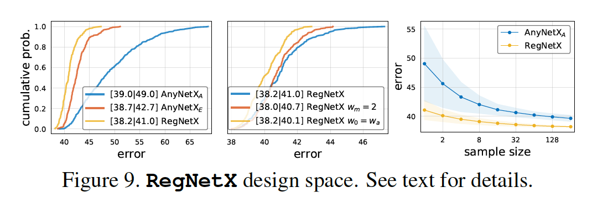

​		$\mbox{RegNetX}$的误差EDF如图9（左）所示。$\mbox{RegNetX}$中的模型在保持最佳模型的同时，比$\mbox{AnyNetX}$具有更好的平均误差。在图9（中）中，我们测试两个进一步的简化。第一，使用$w_m=2$（两个阶段之间加倍宽度）略为提高EDF，但是，我们注意到使用$w_m\ge2$更好（见后面）。第二，我们测试设置$w_0=w_a$，进一步将线性参数简化到$u_j=w_a \cdot (j+1)$ 。有趣的是，这样表现更好。但是，为了维持模型的多样性，我们不施加任何限制。最后，在图9（右）中，我们展示$\mbox{RegNetX}$的随机搜索效率要高得多； 在大约32个随机模型中搜索可能会产生好的模型。

​		表1给出设计空间大小的总结（对于RegNet，我们通过量化其连续参数来估计大小）。在设计$\mbox{RegNetX}$中，我们将原始的$\mbox{AnyNetX}$的设计空间的维度从16减小到6维，并且大小接近10个数量级。但是，我们注意到RegNet仍然包含许多可以针对各种设置进行调整的模型。

#### 3.4. Design Space Generalization

​		我们仅在单个块类型的低计算量、低周期段训练方案中设计RegNet设计空间。但是，我们的目标不是为单个设置设计设计空间，而是发现可以泛化到新设置的通用网络设计原则。

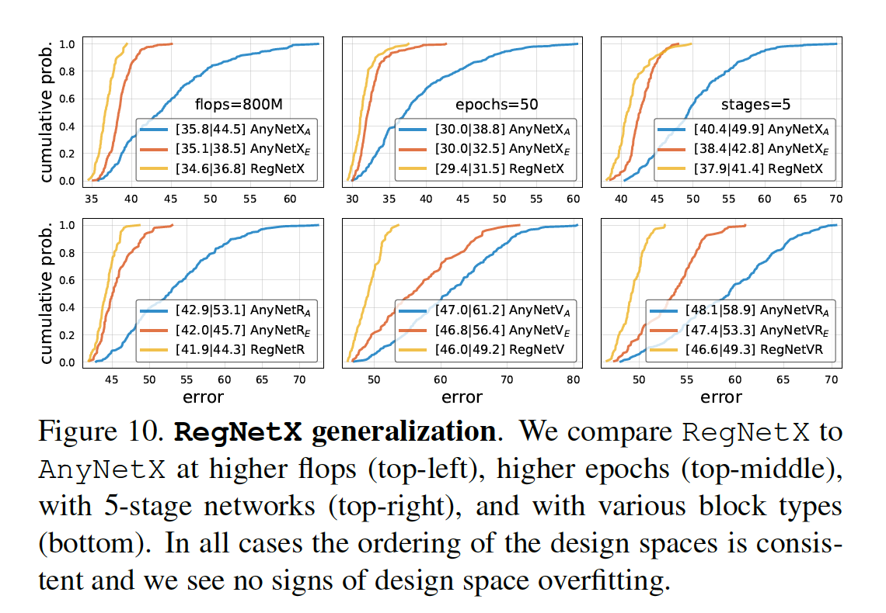

​		在图10中，我们将$\mbox{AnyNetX}$的设计空间与在更高的FLOPs、更高的周期、5阶段网络和各种块类型（在附录中进行了描述）下的$\mbox{AnyNetX}_{\mbox{A}}$和$\mbox{AnyNetX}_{\mbox{E}}$进行比较。在所有情况下，设计空间的顺序是一致的，有$\mbox{AnyNetX} > \mbox{AnyNetX}_{\mbox{E}}>\mbox{AnyNetX}_{\mbox{A}}$。换句话说，我们没有看到过拟合信号。这些结果令人鼓舞，因为它们表明RegNet可以推广到新的设置。5阶段结果证明RegNet的常规结果可以泛化到更多阶段，其中$\mbox{AnyNetX}_{\mbox{A}}$有更多的自由度。

### 4.  Analyzing the RegNetX Design Space

​		接下来，进一步分析$\mbox{RegNetX}$的设计空间，并回顾常用的深度网络设计选择。我们的分析产生与流行做法不符的令人惊讶的见解，这使我们能够通过简单的模型获得良好的结果。

​		由于$\mbox{RegNetX}$设计空间高度集中良好的模型，对于以下结果，我们切换为对较少的模型进行采样（100个），但以0.1的学习率对它们进行更长的训练（25个周期）（请参阅附录）。

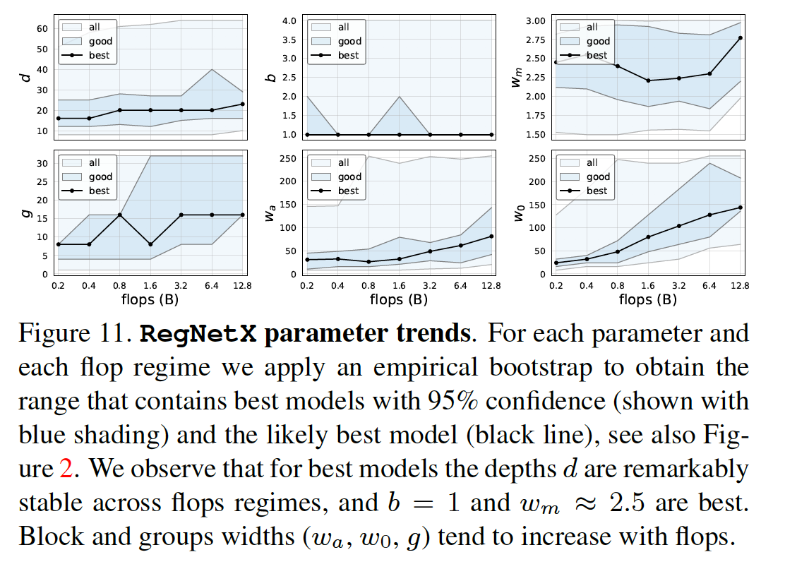

​		**RegNet trends**	我们在图11中展示FLOP的$\mbox{RegNetX}$参数的趋势。值得注意的是，最佳模型的深度在各个方案中保持稳定（左上），最佳深度约为20块（60层）。这与使用更高FLOP的模型的常用实践形成对比。我们还观察到最佳模型使用的瓶颈比率b为1.0（中上），这可以有效地消除瓶颈（通常在实践中使用）。接着，我们观察到良好模型的宽度乘子$w_m$约为2.5（右上），与流行的跨阶段将宽度加倍的方法相似但不相同。余下的参数$(g,w_a,w_0)$随复杂度增加（下）。

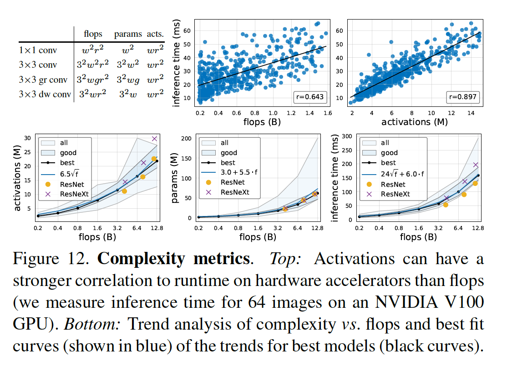

​		**复杂度分析**	除了FLOPs和参数，我们分析网络激活，其定义为所有卷积层的输出张量的大小（在图12（左上）中列出常用卷积操作的复杂度衡量）。虽然不是常用的网络复杂度测量方法，但是激活会严重影响内存有限的硬件加速器（例如GPU、TPU）上的运行时，例如图12（上）。在图12（下），我们观察到，对于总体中的最佳模型，激活随FLOP的均方根增长、参数线性增加，并且运行时间最好同时使用线性项和平方根项进行建模，这是因为其对FLOPs和激活的依赖性。

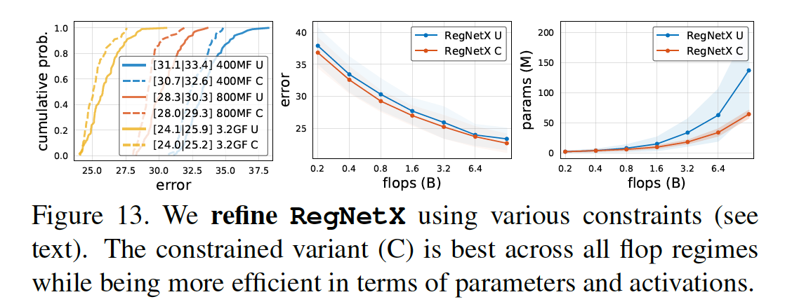

​		**RegNetX 约束**	使用这些发现，我们细化$\mbox{RegNetX}$的设计空间。第一，基于图11（上），我们设置$b=1$、$d\le40$和$w_m \ge 2$。第二，我们限制参数和激活，遵循图12（下）。这产生快速、低参数、低内存的模型，而没有影响准确率。在图13中，我们测试具有这些约束的$\mbox{RegNetX}$，并观察到受约束的版本在所有FLOP情况下都比较好。我们在第5节中使用这个版本，并进一步将深度限制为$12 \le d \le 28$（也见附录D）。

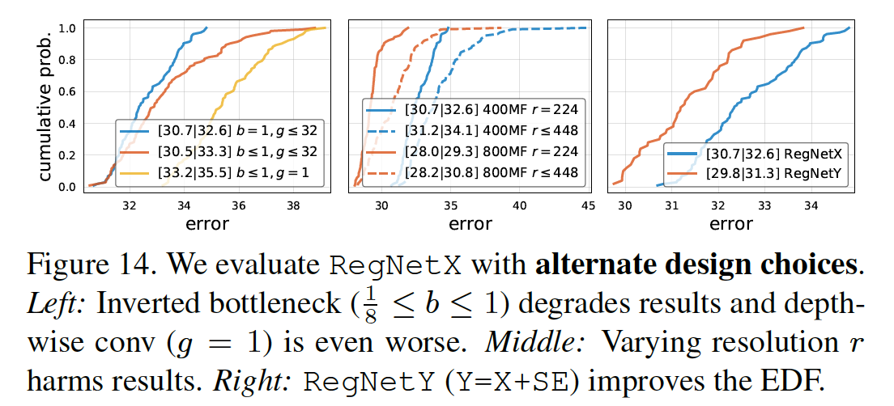

​		**替代设计选项**	现代移动网络通畅采用[25]中提出的inverted bottleneck（$b<1$）以及depthwise卷积（$g=1$）。在图14（左）中，相对于$b = 1$和$g\ge1$，我们观察到inverted bottleneck略为衰减EDF，而depthwise卷积的效果甚至更差（参见附录的进一步分析）。接下来，受[29]的启发，[29]发现缩放输入图像的分辨率可能会有所帮助，我们在图14中测试了不同的分辨率（中）。与[29]相反，对于$\mbox{RegNetX}$，我们发现$224 \times 224$的固定分辨率是最好的，即使在更高的FLOP下。

​		**SE** 最好，我们评估具有流行的Squeeze-and-Excitation（SE）操作[10]的$\mbox{RegNetX}$（我们称$\mbox{X+SE}$为$\mbox{Y}$，称对应产生的设计空间为$\mbox{RegNetY}$）。在图14（右）中，我们可以看出$\mbox{RegNetY}$产生好的增益。

### 5. 与已有网络的比较

​		现在，我们将RegNetX和RegNetY设计空间中各种复杂程度的top模型与ImageNet上的最新技术进行比较[3]。我们使用小写字母表示单个模型，例如 REGNETX。我们还为模型添加FLOP后缀，例如 400MF。对于每个FLOP，我们从RegNet参数$(d,g,w_m,w_a,w_0)$的25个随机设置中选择最佳模型，并对5个顶级模型进行重新训练500个周期，以获得可靠的误差估计。

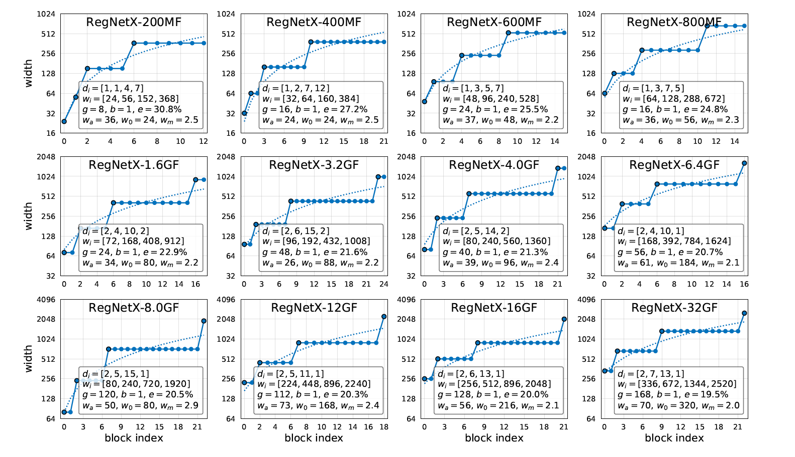

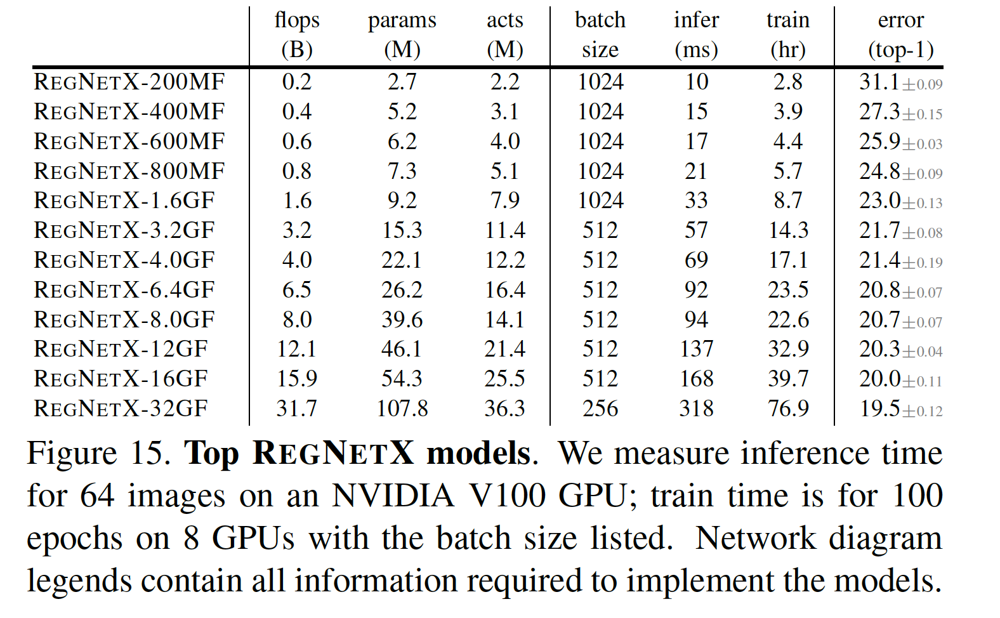

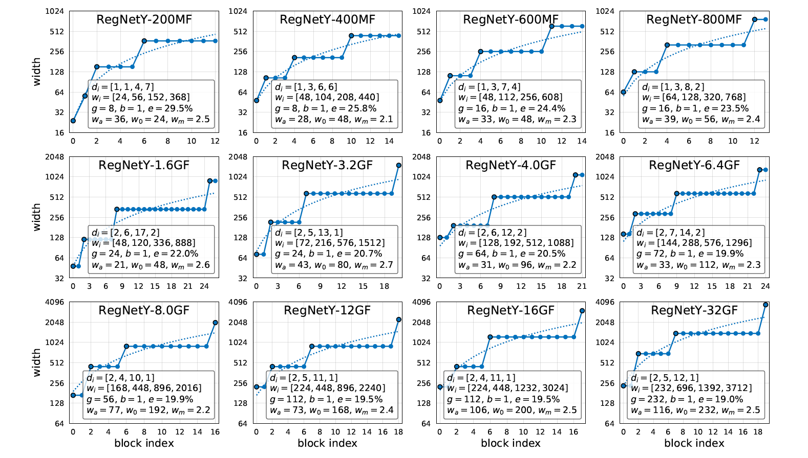

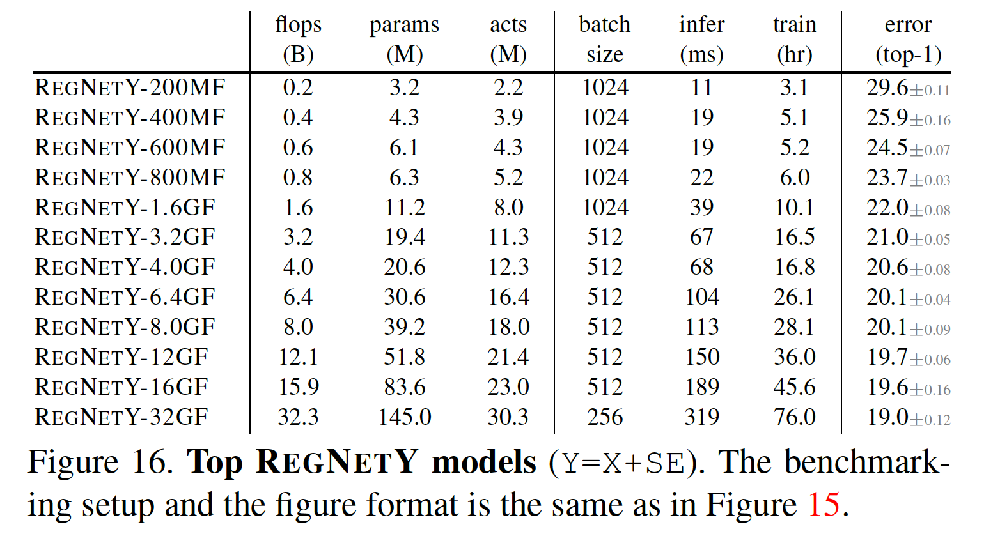

​		图15和图16分别给出每个FLOP下的顶级REGNETX和REGNETY模型。除了简单的线性结构以及第4节中分析的趋势，我们观察到一种有趣的模式。即，**更高FLOP的模型在第3个阶段中有大量的块，而在最后一阶段中有少量块。这与标准的RESNET模型的设计相似**。此外，我们观察到**组宽度$g$随复杂度增加，但是，对于大模型，深度$d$饱和**。

​		我们的目标是进行公平实验，并提供简单而易于复现的基线。我们注意到，除了更好的体系结构以外，最近报告的网络性能的许多提高都基于对训练设置和正则化方案的增强（请参见表7）。因为我们的重点是评估网络架构，所以我们在相同的训练设置下进行精心控制的实验。特别地，为了与经典工作进行公平比较，我们没有使用任何训练时强化。

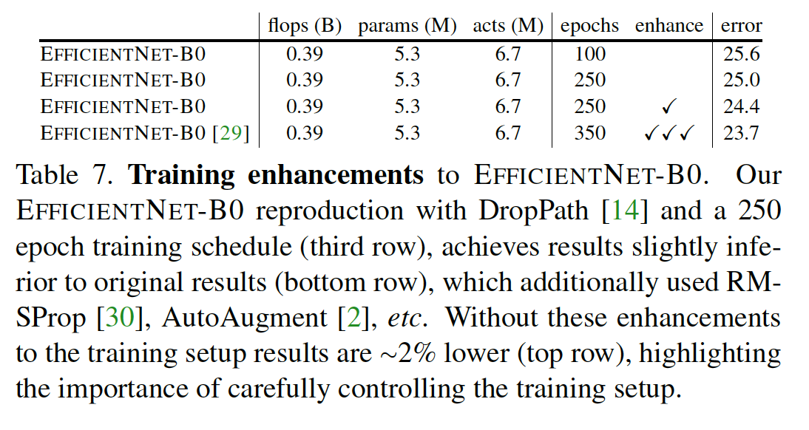

#### 5.1. State-of-the-Art Comparison: Mobile Regime

​		许多最近的网络设计工作关注移动场景（～600MF）。在表2中，我们比较600MF的REGNET模型与已有的移动网络。考虑到通过人工设计[9、25、19]和NAS [35、23、17、18]寻找更好的移动网络的大量工作，我们注意到REGNETS在这种情况下非常有效。

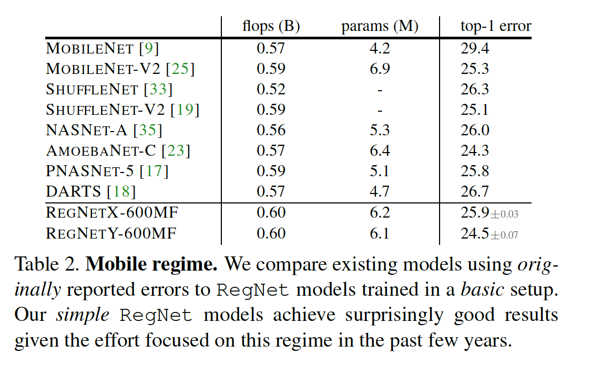

​		我们强调，REGNET模型使用我们的基本100个周期调度，除了权重衰减外没有任何正则化，而大多数移动网络使用具有各种增强功能的较长调度，例如深度监督[16]、抠图[4]、DropPath [14]、自动增强[2] ]等等。因此，我们希望通过简短的训练计划而获得的强大成果而无需增强，可以作为将来工作的简单基准。

#### 5.2. Standard Baselines Comparison: ResNe(X)t

​		接着，我们比较RegNetX与标准的ResNet和ResNeXt。本实验中的所有模型都来自完全相同的设计空间，前者是手动设计的，后者是通过设计空间设计获得的。为了公平比较，在相同训练设置下（我们的标准RegNet训练设置），比较RegNet和ResNe(X)t。我们注意到，这产生改进的ResNe(X)t基线，并突出精心控制训练设置的重要性。

​		在图17和表3中给出比较结果。整体上来说，我们可以看出，通过单独优化网络结构，RegNetX模型在所有复杂度度量下，都给出客观的改进。我们强调，良好的REGNET模型可用于各种计算方案，包括在没有良好RESNE（X）T模型的低计算方案中。

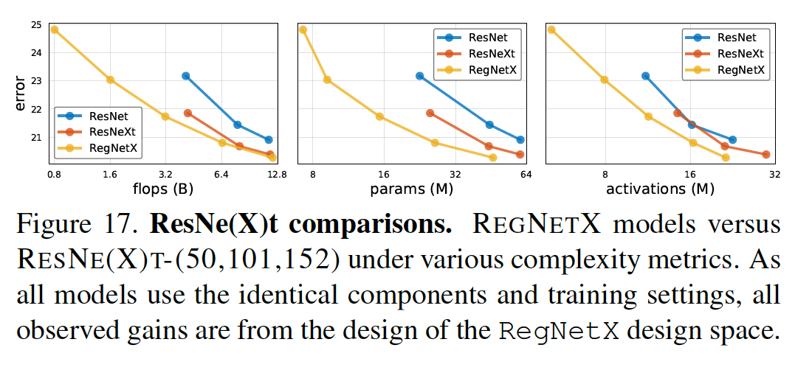

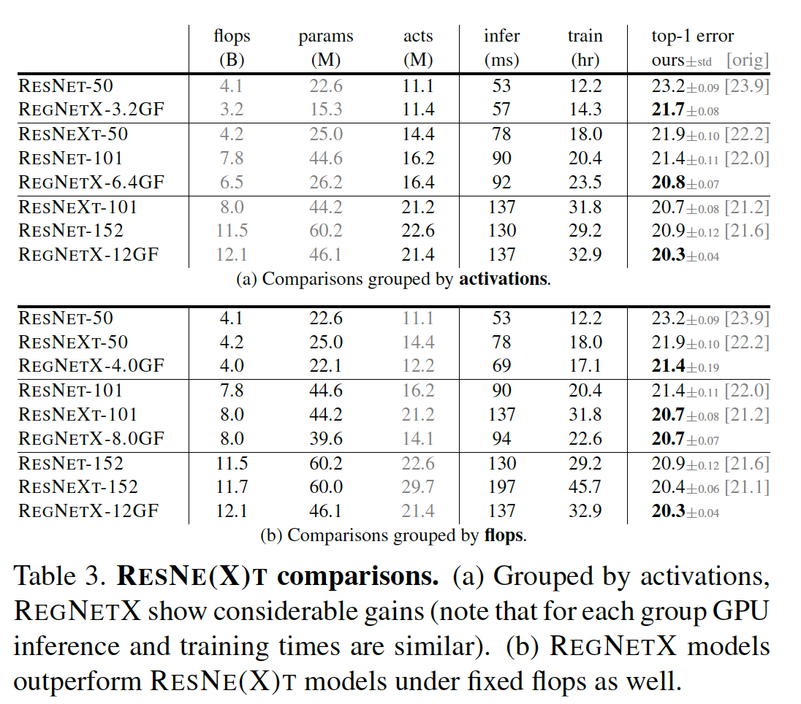

​		表3a给出按激活分组的比较（这些激活可以强烈影响加速器（如GPU）的运行时间）。此设置对于模型训练时间是瓶颈的研究社区特别感兴趣，并且将来可能会在现实世界中有更多的用例，尤其是当加速器在推理时间（例如，在自动驾驶汽车中）获得更多使用时。给定固定的推理或训练时间预算，REGNETX模型非常有效。

#### 5.3. State-of-the-Art Comparison: Full Regime

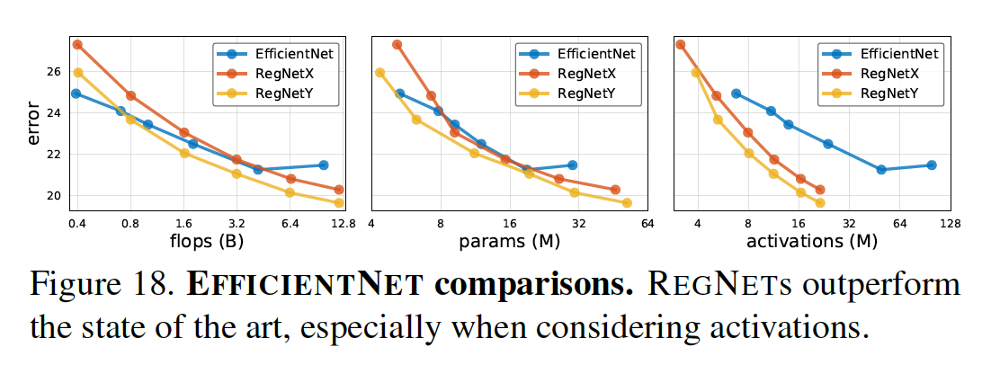

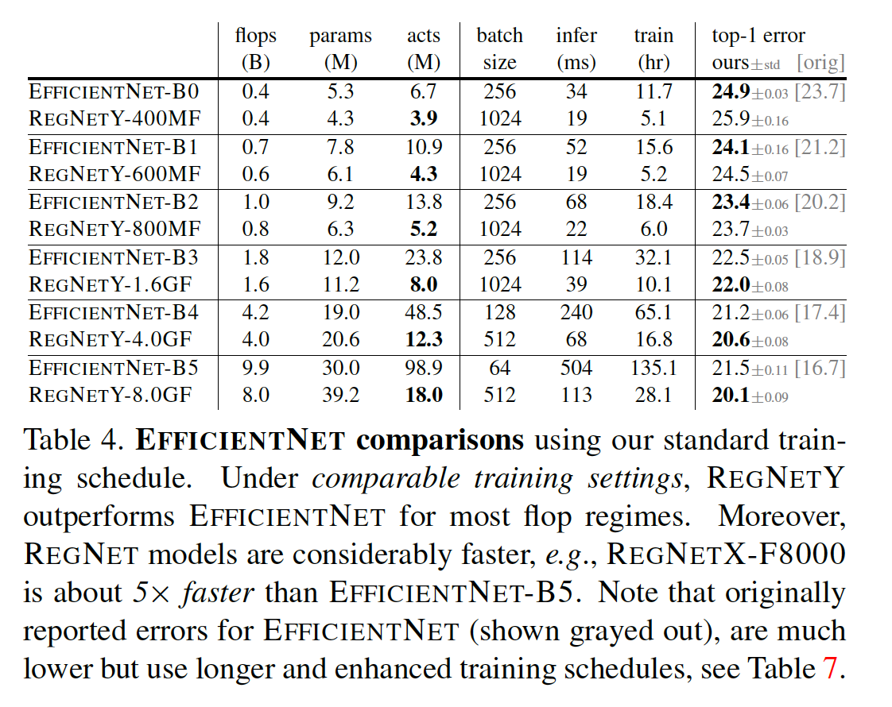

### Appendix A: Test Set Evaluation

​		在主要论文中，我们对ImageNet [3]验证集执行了所有实验。 在这里，我们在ImageNetV2 [24]测试集（原始测试集不可用）上评估我们的模型。

​		**评估设置**	为了研究ImageNet上开发的模型的泛化能力，[24]的作者遵循原始的过程收集新的测试数据集（ImageNetV2）。他们发现总体模型排名在新的测试集上得到保持。 但是，绝对误差会增加。 我们在ImageNetV2测试集上重复第5节的比较。

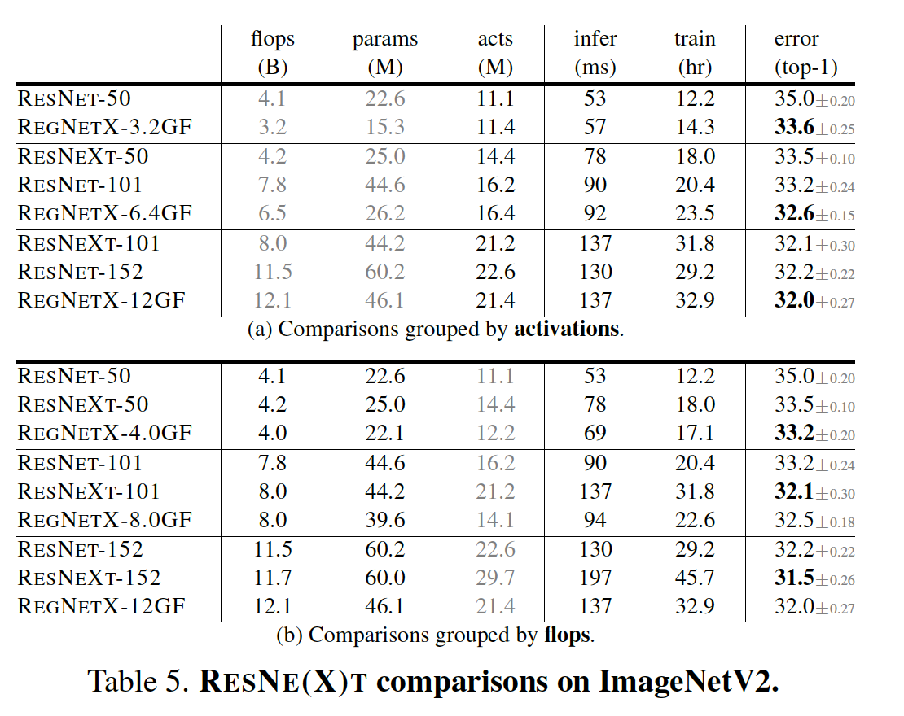

​		**ResNe(X)t比较**	在表5中比较ResNe(X)t模型。我们观察到，虽然模型排名通常是一致的，但它们之间的差距却在缩小。尽管如此，RegNetX模型仍然具有可比性，并且可以跨越FLOP提供良好的模型，包括在良好RESNE(X)T模型的低计算可用的情况下。使用RegNetY可以获得最佳结果。

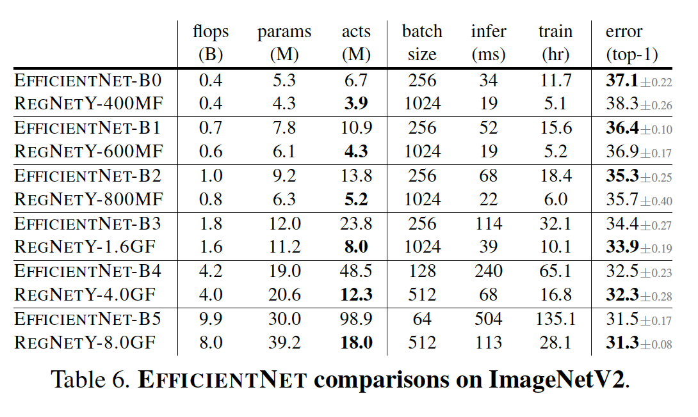

​		**EfficientNet比较**	我们在表6中比较EfficientNet模型。与前面的一样，我们观察到模型排名通常是一致的，但是差距减小。整体而言，结果证实，REGNET模型的性能与最新的EFFICIENTNET相当，而在GPU上的速度提高5倍。

### Appendix B:  Additional Ablations

​		在本节中，我们进行额外的消融实验来进一步支持或补充主要文本的结果。

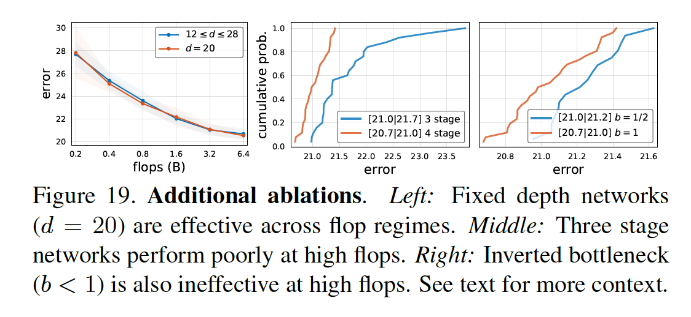

​		**Fixed depth**	在第5节中，我们观察到我们的顶级模型的深度相当稳定（大约为20个块）。在图19（左）中，我们跨越FLOP使用固定深度（$d = 20$）进行比较。为了比较我们的最佳结果，我们训练每个模型100个周期。令人吃惊的是，我们发现**固定深度网络可以在所有FLOP上，在平均货最佳情况下都能匹配可变深度网络的性能**。确切的说是，这些固定深度的网络可以匹配我们的最佳结果。

​		**Fewer stages**	在第5节中，我们观察到高FLOP的顶级REGNET模型在第四阶段有更少的块（一两个）。因此，我们在6.4GF上测试3阶段网络，每个网络训练100个周期。在图19（中）上，我们展示结果，并观察到3阶段网络表现相当糟糕。但是，我们注意到可能需要进行其他更改（例如在stem或head中进行更改），以使三阶段网络正常运行（留给以后的工作）。

​		**Inverted Bottleneck**	在第4节中，我们观察到，使用Inverted Bottleneck（$b<1$）衰减性能。因为我们的结果是低计算的，在图19（右）中，我们在6.4GF和100周期上重新测试。令人吃惊的是，我们发现$b<1$进一步衰减结果。

​		**Swish vs. ReLU**	许多最近方法采用Swish[22]激活函数，例如[29]。在图20中，我们研究具有Swish和ReLU的RegNetY。我们法相在低FLOP下，Swish比ReLU好，但是ReLU在更高的FLOP下性能更好。有趣的是，如果$g$限制为1（depthwise conv），Swish远好于ReLU。这表明depthwise conv和Swish的交互作用良好，尽管根本原因尚不清楚。

### Appendix C:  Optimization Settings

​		我们的基本训练设置遵循[21]，如第3节讨论的。为了调整RegNet模型的学习率$lr$和权重衰减$wd$，我们进行一项研究，描述在图21中。基于此，对于第4节和第5节中的所有模型，我们设置$lr=1$、$wd=5\cdot10^{-5}$。为了能够以100个周期更快地训练最终模型，我们将GPU的数量增加到8个，同时保持每个GPU的图像数量不变。当缩放batch_size时，我们使用线性缩放规则调整$lr$，并使用5个周期的warmup。

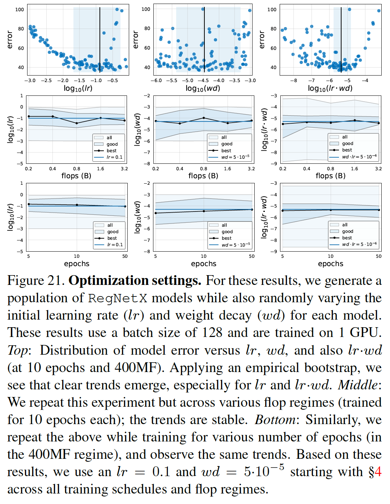

​		为了确保公平比较，我们重复为EfficientNet重复相同的优化，见图22。有趣的是，在复杂度范围内，学习率和权重衰减仍保持稳定。最后，在表7中，我们报告了增强训练对EFFICIENTNET-B0的巨大影响。对于较大的模型，差距可能更大（见表4）。

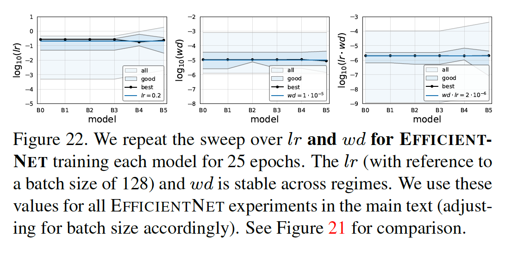

### Appendix D:  Implementations Details

​		我们以其他实现细节结束。

​		**Group width compatibility**	当为模型采样宽度$w$和分组宽度$g$时，我们可能以不兼容的值结束（即$w$不能被$g$整除）。为了处理这个问题，我们采用简单的测量。即，如果$g>w$，我们设置$g=w$，否则四舍五入$w$以使其被$g$整除。最终的$w$与原始$w4最多可以相差$1/3$（省略证明）。对于具有瓶颈结构的模型，我们将此策略改为应用于瓶颈宽度（并相应地调整宽度）。

​		**Group width ranges**	如第4节中所述，我们注意到总体趋势是，在较高的计算下，好的模型的组宽度更大。为了解决这个问题，我们逐渐调整组的宽度范围以适应更高的计算方式。例如，在3.2GF时，我们使用$16\le g \le 64$，并允许任意的$g$被8整除，而不是采样$g \le 32$。

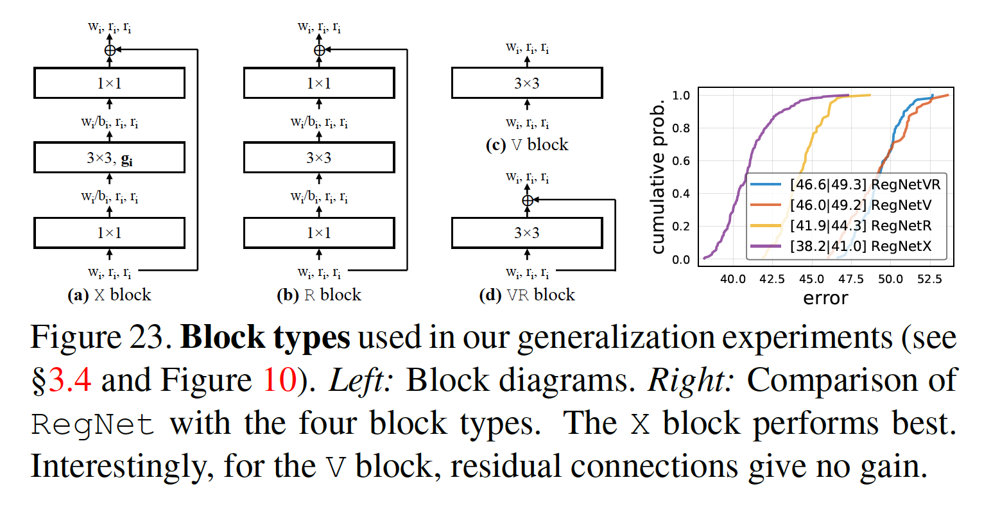

​		**Block types**	在第3节中，我展示，RegNet设计空间可概括为不同的块类型。我们描述这些额外块类型（见图23）：

1. $\mbox{R}$块：与X块相同，除了没有分组，
2. $\mbox{V}$块：仅有单个$3\times3$卷积的基本块，
3. $\mbox{VR}$块：$\mbox{V}$块加残差连接。

​        我们注意到良好的参数值可能在块类型上有差异。例如，与$\mbox{X}$块相比，对于$\mbox{R}$块，使用$b>1$比使用$b=1$更好。我们的方法对此有鲁棒性。

​		**Y块细节**	为了获得$\mbox{Y}$块，我们在$\mbox{X}$块的$3\times3$卷积之后添加SE操作，并且我们使用的SE缩放比例为$1/4$。我们对这些选择进行实验，但发现它们的表现相当（未显示）。