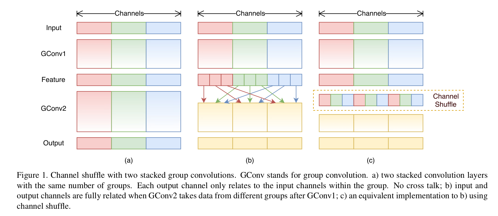
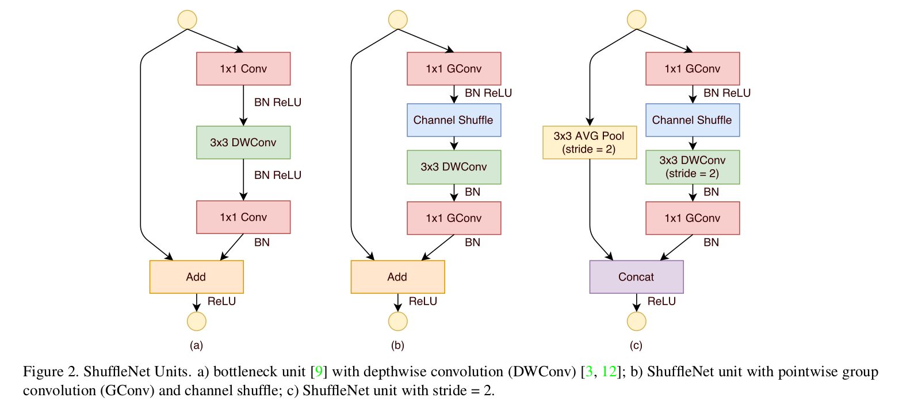
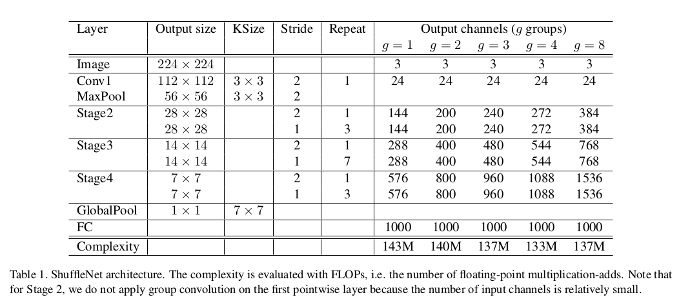
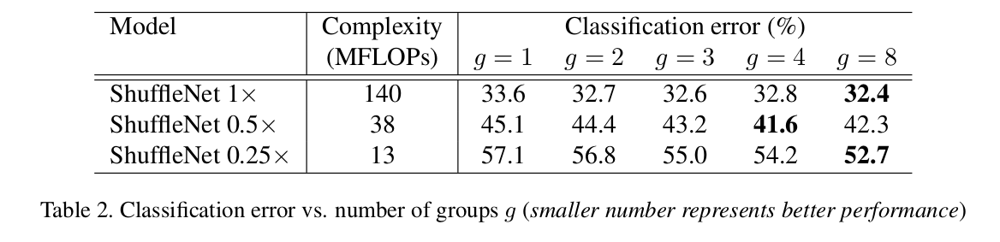
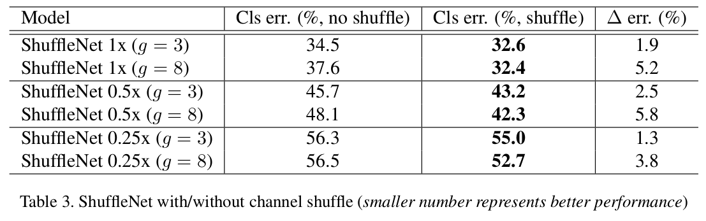
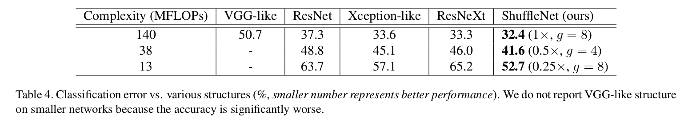
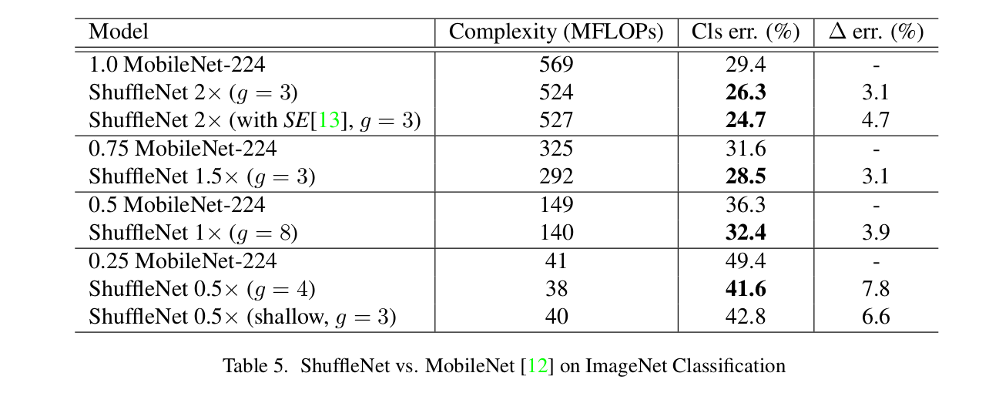
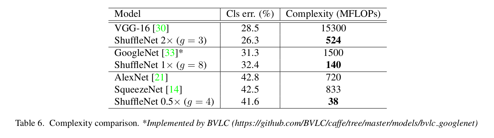
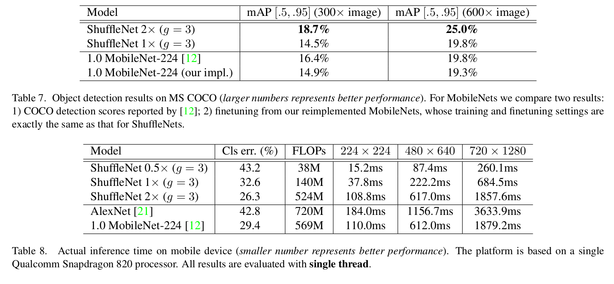

ShuffleNet: An Extremely Efficient Convolutional Neural Network for Mobile Devices
=

# 3. Approach
## 3.1. Channel Shuffle for Group Convolutions
现代卷积神经网络通常由相同结构的重复构建块组成。在他们之中，如 Xception 和 ResNeXt 的最佳网络将高效的深度可分离卷积或组卷积引入到构建块以处理表达能力和计算成本之间的权衡。然而，我们注意到两种设计都没有完全考虑 $1 \times 1$ 卷积，其需要相当客观的复杂度。例如，ResNeXt 中，仅 $3 \times 3$ 层具有组卷积。因此，对于 ResNeXt 的每个残差单元，Pointwise 卷积占据 93.4% 的 Mult-Add 操作（如[40]建议的 cardinality = 32）。在小型网络中，昂贵的 pointwise 卷积导致有限的通道数来妈祖复杂度约束，其可能显著损害准确率。

为了处理这个问题，一个直截了当的解决方案是也在 $1 \times 1$ 层应用通道稀疏的连接，例如组卷积。通过确保每个卷积操作仅在相应的输入通道上分组，组卷积显著减小计算成本。然而，如果多个组卷积堆叠在一起，有一个副作用：某个通道的输出仅从输入通道的一小部分推导出。图 1（a）展示了两个分组卷积堆叠的场景。显然，某一组的输出只与组内的输入有关。这种属性阻塞通道组之间的信息流并削弱表示。

如果我们允许组卷积以获得不同组的输入数据（如图 1（b）所示），那么输入和输出通道是完全相关。具体地，对于前一个分组层生成的特征图，我们可以先将每个组中的通道划分为几个子组，然后馈入具有不同子组下一层的每个组中。这可以通过 _channe shuffle_ 操作高效而优雅地实现（图1（c））： 假设具有 $g$ 个组的卷积层，其输出有 $g \times n$ 个通道；我们先将输出通道调整为 $(g,n)$ ，然后通过转置和平铺将它们转换为下一层的输入。注意，即使两个卷积有不同数量的组，它仍然有效。此外，channel shuffle 也是可微的，其意味着它能够嵌入网络以进行端到端训练。

Channel Shuffle 操作使得构建具有多个组卷积层的更强力的结构称为可能。在下一节中，我们将介绍一种具有通道混淆和组卷积的高效网络单元。

## 3.2. ShuffleNet Unit

利用通道混淆操作，我们为小型网络提出一种专门设计的新颖的 ShuffleNet 单元。我们从瓶颈单元的设计原则开始（见图2（a））。它是一个残差块。在其残差分支中，对于 $3 \times 3$ 的卷积层，我们在瓶颈特征图上使用计算上经济的 $3 \times 3$ 的 depthwise 卷积。然后，将第一个 $1 \times 1$ 层替换为 pointwise 组卷积，接着是通道混淆操作，以组成 ShuffleNet 单元，如图 2（b）所示。第二个 pointwise 组卷积的目的是恢复通道维度以匹配快捷路径。为了简单起见，我们在第二个 pointwise 组卷积之后不使用通道混淆操作，因为它能够产出可比较的得分。批归一化和非线性的使用与 ResNeXt 和 ResNet 相似。至于具有步长的 ShuffleNet 单元的情况，我们仅作出两种修改（见表2（c））： （i）在快捷路径上添加 $3 \times 3$ 平均池化；（ii）使用通道拼接替换逐元素加法，这很容易扩大通道维度，而几乎没有额外的计算开销。

由于具有通道混淆的 pointwise 组卷积，ShuffleNet 单元的所有组件都可以高效地计算。与 ResNet 和 ResNeXt 相比，我们的结构在相同设置下具有更少的复杂度。例如，给定输入大小 $c \times h \times w$ 和瓶颈通道 $m$ ，ResNet 单元需要 $hw(2cm + 9m^2)$ FLOPs，而 ResNeXt 单元需要 $hw(2cm + 9m^2)$ FLOPs，而我们的 ShuffleNet 单元仅需 $hw(2cm + 9m)$ FLOPs ，其中 $g$ 表示卷积组的数量。换句话说，给定计算预算，ShuffleNet 可以使用更宽的特征图。我们发现这对小型网络至关重要，因为小型网络通常具有不充分的通道数来处理信息。

此外，在 ShuffleNet Depthwise 卷积仅在瓶颈层的特征图上执行。尽管 depthwise 卷积通常有较低的理论计算复杂度，但是我们发现它很难在低功耗设备上高效实现，这可能会导致计算/内存访问比其他密集操作更差。[3]也提到了这种缺点，它有一个基于TensorFlow[1]的运行时库。在 ShuffleNet 单元中，为了尽可能的阻止开销，我们直觉上仅在瓶颈层中使用 depthwise 卷积。

## 3.3. Network Architecture

基于ShuffleNet单元，我们在表1中展示了整个ShuffleNet架构。所提出的网络主要由 ShuffleNet 堆叠成的三个阶段组成。每个阶段的第一个构建块使用的步长为 2 。一个阶段中的其他超参数仍然相同，而对于下一个阶段，输出通道数加倍。与[9]相似，我们设置每个 ShuffleNet 单元的瓶颈通道数为输入通道数的 $1/4$ 。我们的意图是尽可能提供一个参考设计，尽管我们发现进一步的超参数调整可能产生更好的结果。

在 ShuffleNet 单元中，组数 $g$ 控制 pointwise 卷积的连接稀疏程度。表 1 探索不同组数，以及我们采用的确保整体计算成本大致不变的输出通道（$\sim$ 140 MFLOPs）。显然，对于给定的复杂度限制，更大的组数产生更多的输出通道（因此有更多的卷积滤波器），这有助于编码更多的信息，由于有限的对应输入通道，可能导致单个卷积滤波器的衰退。在第4.1.1节中，我们将研究这个数字受到不同计算约束的影响。

为了自定义期望复杂度的网络，我们可以简单地将缩放因子 $s$ 用于通道数。例如，我们将表 1 中的网络表示为 “ShuffleNet $1 \times$” ，然后，“ShuffleNet $s \times$” 表示将 “ShuffleNet $1 \times$” 中的滤波器数放大 $s$ 倍，因此整体复杂度为 “ShuffleNet $1 \times$” 的 $s^2$ 倍。

# 4. Experiments
我们主要在 ImageNet 2012 分类数据集上评估模型。我们遵循多数 ResNeXt 中使用的训练设置和超参数，但有两点除外：（i）我们设置权重衰减为 $4e-5$ 而不是 $1e-4$ ，并使用线性衰减学习率策略（从 0.5 减少到 0 ）；（ii）在数据预处理中，我们使用稍微不那么激进的尺度增强。相似的修改参见 MobileNet ，因为小网络通常遭遇欠拟合而不是过拟合。花费两天在 4 个 GPU 上训练模型 $3 \times 10^5$ 次迭代，它的批大小为 1024 。为了基准测试，我们比较 ImageNet 验证集上的单裁剪的 top-1 性能，即从 $256 \times$ 的输入图像上裁剪 $224 \times 224$ 的中心，并评估分类准确率。我们对所有模型使用完全相同的设置，以确保公平的比较。

## 4.1. Ablation Study
ShuffleNet 的核心思想是 pointwise 组卷积和通道混淆操作。本节中，我们分别评估它们。

## 4.1.1 Pointwise Group Convolutions
为了评估 Pointwise 组卷积的重要性，我们比较相同复杂度下，组数从 1 到 8 的 ShuffleNet 模型。如果组数为 1 ，没有 pointwise 组卷积，然后 ShuffleNet 单元变为 “类似 Xception” 结构。为了更好的理解，我们也缩放网络的宽度以得到三种不同的复杂度，并分别比较它们的分类性能。结果如图 2 所示。

### 4.1.2 Channel Shuffle vs. No Shuffle
混淆操作的目的是为了使多组卷积层的跨组信息流。表 3 比较有/没有通道混淆操作的 ShuffleNet 结构的（组数设置为 3 或 8）性能。

## 4.2. Comparison with Other Structure Units
最近主要卷积单元 VGG[30]、 ResNet[9]、 GoogleNet[33]、ResNeXt[40] 和 Xception[3] 追求先进的结果与大型模型(例如 $\ge 1$ GFLOGs)，但并不完全探索低复杂度约束。

为了公平比较，我们使用表 1 中综合网络架构。我们将阶段 2-4 的 ShuffleNet 单元替换为其他结构，然后调整通道的数量，以确保复杂性保持不变。 我们探索的这些结构包括：
- VGG-like. 遵循 VGG 网络的设计原则，我们使用两层 $3 \times 3$ 卷积作为基本的构建块。与 VGG 不同，我们在每个卷积层后添加批归一化以是端到端训练更容易。

- ResNet. 我们采用我们实验中的“瓶颈”设计，其在[9]中被证明是有效的。与[9]相同，_bottleneck ratio_ 为 $1:4$ 。

- Xception-like. 在[3]中提出的原始结构涉及到不同阶段的花哨设计或超参数，很难在小型模型上进行公平的比较。相反，我们从 ShuffleNet上移除 pointwise 组卷积和通道洗牌操作（也设置 $g=1$）。派生结构与[3]中“深度可分离卷积”的思想相同，在这里称为类似于 Xception 的结构。

- ResNeXt. 我们使用[40]建议的 $cardinality=16$ 和 $bottleneck ratio = 1:2$ 的设置。我们也探索了其他设置，如 $bottleneck ratio = 1:4$ ，也得到相似的结果。

我们使用完全相同的设置来训练这些模型。结果如表4所示。

## 4.3. Comparison with MobileNets and Other Frameworks

## 4.4. Generalization Ability

