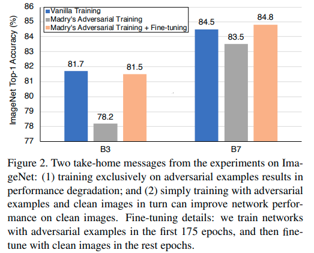
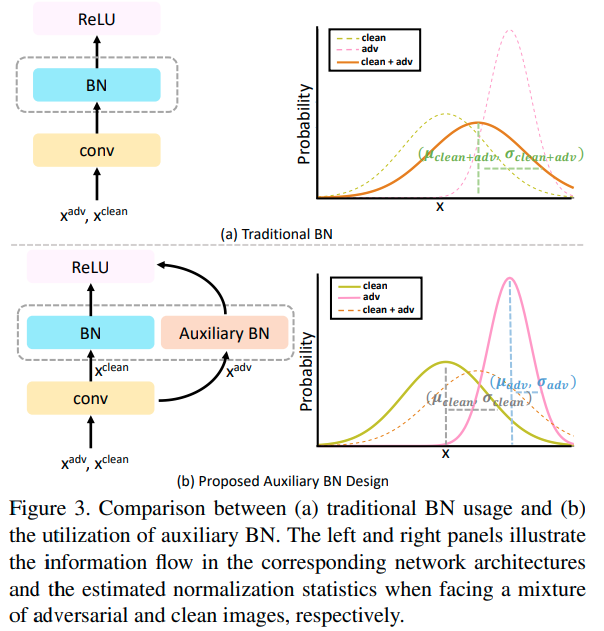
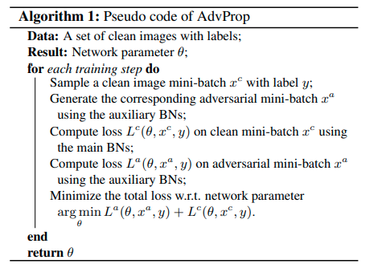

### Adversarial Examples Improve Image Recognition

#### 摘要
对抗样本常被视为是ConvNet的威胁。这里我们提出一种相反的观点：如果利用正确的方式，对抗样本可以用于改进图像识别模型。我们提出AdvProp来阻止过拟合，其为将对抗样本视为额外样本的增强对抗训练方案。我们的方法的关键是针对对抗样本使用单独的辅助批归一化，因为他们与常规样本有不同的底层分布。

我们证明AdvProp在各种图像识别任务上改进模型，并且当模型更大时性能更好。例如，通过将AdvProp应用到ImageNet的EfficientNet-B7上，我们获得了明显的改进，ImageNet提高了0.7%、ImageNet-C提高6.5%、ImageNet-A提高7%，Stylized-ImageNet提高4.8%。借助增强的EfficientNet-B8，我们的方法无需额外数据即可达到最新的85.5％ImageNet top-1 精度。这一结果甚至超过了使用35亿Instagram图像（大约是ImageNet的3000倍）以及约9.4倍参数的最佳模型[20]。

#### 1. Introduction
通过向图像添加不可察觉的扰动来制作对抗性示例，可能会导致卷积神经网络（ConvNets）做出错误的预测。对抗性样本的存在不仅揭示了ConvNets有限的泛化能力，而且还对这些模型的实际部署构成了安全威胁。自从首次发现ConvNets容易受到对抗性攻击[27]以来，已经做出了许多努力[5、15、29、19、13、31]以提高网络的健壮性。

本文中，我们不是关注防御对抗样本，而是将我们的注意力转移到利用对抗样本提高准确率。先前的工作表明使用对抗样本训练可以增强模型泛化能力，但是这是局限于某种特定场景——这一改进在全监督设置[5]的小型数据集（例如MNIST）或者在半监督设置下的更大数据集[21,22]上观察到。与此同时，最近的工作[15,13,31]也认为在大型数据集（例如ImageNet）上利用监督学习使用对抗样本训练的模型，在干净的图像上会产生性能衰减。总之，如何有效地使用对抗样本来帮助视觉模型仍是一个开放问题。

我们观察到所有先前模型都是联合干净图像和对抗样本训练，而灭有区别，即使它们服从不同的潜在分布也没有区别。我们假设干净样本和对抗样本之间的不匹配是先前工作[15,13,31]中引起性能衰退的关键因素。

本文中，我们提出AdvProp（Adversarial Propagation的简称），它是利用简单而高度有效的双批归一化方法来弥补分布不匹配的新训练方案。具体而言，我们使用两个批归一化统计量，一个用于干净的图像，另一个作为辅助用于对抗样本。这两个批归一化在归一化层恰当的解耦两个分布，以进行准确的统计估计。我们证明这种分布解耦是只管重要的，保证我们能够使用对抗样本成功地改进模型，而不是使性能衰减。

据我们所知，我们的工作是第一个证明，在大型数据集的全监督设置下，对抗样本可以改进模型的性能。例如，使用AdvProp训练的EfficientNet-B7 [28]在ImageNet上可达到85.2％的top-1准确性，比其普通版本高0.8％。在扭曲图像上测试模型时，AdvProp的改进更为显著。如图1所示，AdvProp帮助EfficientNet-B7分别在ImageNet-C[7]、 ImageNet-A [8]和Stylized-ImageNet[4]上提高了9.0%、7.0%和5.0% 。

由于AdvProp有效地防止了过拟合并在较大的网络中具有更好的性能，因此我们遵循[28]中类似的复合缩放规则，开发了一个名为EfficientNet-B8的较大网络。利用我们所提出的AdvProp，EfficientNet-B8在没有任何额外数据的情况下，在ImageNet上获得了85.5%的top-1准确率。这一结果优于[20]中报告的最佳模型，该模型使用35亿的Instagram图像（大约为ImageNet的3000倍）预训练，并且需要的参数量是EfficientNet-B8的9.4倍。

#### 3. A Preliminary Way to Boost Performance
Madry等人[19] 将对抗训练制定为最小-最大游戏，并仅在对抗样本上训练模型，以有效提高模型的鲁棒性。然而，如[19,31]，如此训练的模型通常不能很好的泛化到干净图像。我们通过使用PGD攻击在ImageNet上训练中型模型（EfficientNet-B3）和大型模型（EfficientNet-B7）来验证这个结果——两个对抗训练的模型获得远低于它们普通副本的准确率。例如，如此对抗训练的EfficientNet-B3在干净图像仅获得78.2%的准确率，而普通训练的EfficientNet-B3准确率为81.7%（见图2）。

我们假设如此的模型衰减主要是由分布不匹配（distribution mismatch）引起的——对抗样本和干净图像服从两个不同的域，因此仅在一个域上训练不能很好地迁移到其他域。如果可以适当地弥补此分布不匹配，那么即使使用对抗样本进行训练，也可以减轻干净图像的性能衰减。为了验证我们的假设，我们因此测试一种简单的策略——首先使用对抗样本预训练模型，然后使用赶干净图像微调。

该结果如图2。如期望的，这种简单的微调策略（标记为浅橘黄色）始终产生远高于Madry对抗训练基线（标记为灰色）的准确率，例如EfficientNet-B3de准确率相对于基线增加了3.3%。有趣的是，当与仅使用干净图像的标准的普通训练设置（标记为蓝色）相比，这种微调策略有时甚至有助于网络获得更好的性能，例如EfficientNet-B7的准确率增加了0.3%，在ImageNet上获得84.8%的准确率。

上面的观察结果传递一个有希望的信号——如果恰当地利用，对抗样本对模型的性能有利。但是，我们注意到这种方法通常无法提高性能，例如，尽管经过训练的EfficientNet-B3明显优于Madry对抗训练基准，但仍略低于（-0.2％）原始训练环境下的准确率。因此，引发一个自然的问题：是否可以更有效地从对抗样本中提取有价值的特征并进一步提高模型性能？

#### 4. Methodology
##### 4.1. Adversarial Training
我们首先回忆原始的训练设置，目标函数为

$$
\arg\min_{\theta} \mathbb{E}_{(x,y) \sim \mathbb{D}}[L(\theta, x, y)]  \tag{1}
$$

其中 $\mathbb{D}$ 是潜在的数据分布， $L(\cdot,\cdot,\cdot)$ 是损失函数， $\theta$ 是网络参数， $x$ 是具有真实标签的 $y$ 的训练样本。

鉴于Madry对抗训练框架[19]，它使用故意扰动的样本训练网络，而不是使用原始样本训练，

$$
\arg\min_{\theta} \mathbb{E_{(x,y)\sim \mathbb{D}}}[\max_{\epsilon \sim \mathbb{S}}L(\theta, x+\epsilon,y)], \tag{2}
$$

其中 $\epsilon$ 是对抗扰动， $\mathbb{S}$ 为允许的扰动范围。虽然通过如此训练的模型有如[35,32,30]描述的几个良好特性，但是它们不能很好的泛化到干净图像[19,31]。

与Madry的对抗训练不同，我们的主要目标是通过利用对抗样本的正则化能力来提高网络在干净图像上的性能。因此，我们将对抗图像视为额外训练样本，并混合对抗样本和干净图像来训练网络，如[5,15]建议的，
$$\arg\min_{\theta}[\mathbb{E}_{(x,y)\sim\mathbb{D}}(L(\theta,x,y) + \max_{\epsilon\in\mathbb{S}}L(\theta, x+\epsilon, y))] \tag{3}$$
理想看来，如此训练的模型应当受益于已有对抗和干净领域，但是，如[5,15]观察的，直接用公式(3)优化产生的性能通常比原始的训练设置低。我们假设对抗性样本与干净图像之间的分布不匹配会阻止网络准确有效地从两个域中提取有价值的特征。接下来，我们将介绍如何通过辅助批归一化设计恰当的解耦不同分布。

##### 4.2. Disentangled Learning via An Auxiliary BN
批归一化（BN）是许多最佳计算机视觉模型[6,10,26]的基本组件。具体而言，BN通过每个小批量中计算的均值和方差来归一化输入特征。利用BN的一个本质上的假设是输入特征应当来自单个或者相似的分布。如果mini-batch包含来自不同分布的数据，那么归一化行为可能有问题，因此产生不准确的统计量估计。

我们认为对抗样本和干净图像有两个不同的潜在分布，并且公式（3）中的对抗训练框架本质上包含两个成分的混合分布。为了将混合分布分别分解为两个较简单的分布（分别用于干净图像和对抗图像），我们在此提出一个辅助BN，以确保其归一化统计信息专门在对抗样本中执行。具体而言，如图3（b）所示，我们提出的辅助BN通过将单独的BN保留到属于不同域的特征来帮助分解混合分布。否则，如图3（a）所示，简单的维持一组BN统计量产生不准确的统计量估计，其可能导致性能衰退。

这种概念可以推广到多个辅助BN，其中富足BN的数量由训练样本源的数量决定。例如，如果训练数据包含干净图像、扭曲图像和对抗图像，那么应当维持两个辅助BN。

##### 4.3. AdvProp

算法1解释：
首先，在每个mini-batch中，使用辅助BN生成其对抗样本副本来攻击网络；接着，将干净的mini-batch和对抗的mini-batch传入相同的网络，但是使用不同的BN进行损失计算，即干净mini-batch使用主要BN，对抗mini-batch使用辅助BN；最后我们最小化总损失，即梯度更新网络参数。换句话说，除了BN，卷积和其它层使用对抗样本和干净图像联合优化。在测试时，丢弃所有辅助损失，仅使用主要BN进行推理。

这样联合训练比对抗训练基线更加准确，这可能是AdvProp确保网络同时联合学习来自对抗样本和干净样本的有用特征。

#### 5. Experiments
##### 5.1. Experiments Setup
**Architectures** EfficientNet系列，使用衰减为0.9，动量为0.9的RMSProp，批归一化的动量为0.99；权重衰减为1e-5,；初始学习率为0.256，每隔2.4个epoch乘以0.97；使用AutoAugment策略。

**Adversarial Attackers** 使用公式（3）中的对抗样本和干净图像的混合来训练网络。我们选择 $L_{\infty}$ 范数下的 Projected Gradient Descent（PGD）作为默认个的攻击者以实时生成对抗样本。我们尝试了不同扰动大型 $\epsilon$ （从0到1）。我们将攻击者的迭代次数设置为 $n = \epsilon + 1$ ，但 $\epsilon = 1$ 的情况（其中 $n$ 设置为 $1$ ）除外。攻击步长固定为 $\alpha = 1$ 。
