## CSPNet: A New Backbone that can Enhance Learning Capability of CNN

### 摘要

​		神经网络确保诸如目标检测的计算机视觉任务获得最先进性能。但是，如此的成功极度依赖昂贵的计算资源，其妨碍仅有便宜设备的人们从先进技术获益。本文中，我们提出Cross Stage Partial Network（CSPNet），其从网络架构的角度来缓解先前贡献需要严重推理计算的问题。我们将该问题归咎于网络优化中重复的梯度信息。所提出的网络通过集成网络阶段开始和结束的特征来关注梯度的变化，在我们的实验中，这在ImageNet数据集上获相等甚至更好的准确率，并减小20%的计算，在MS COCO目标检测数据集上明显优于最先进方法。CSPNet易于实现，并足以泛化到基于ResNet、ResNeXt和DenseNet的架构。

### 1. 引言

​		已经证明，当神经网络变得更深[8、37、11]、更宽[38]时，特别有效。但是，扩展神经网络架构通常带来非常多的计算，它使诸如目标检测的计算严重的任务对于大多数人来说是不可涉及的。因为真实世界的应用通常需要在小型设备上以较短时间完成，所以轻权重计算逐渐受到更强的关注，这对计算机视觉算法提出严重的挑战。尽管一些方法专门为移动CPU设计[10、30、9、32、41、23]，但它们采用的depth-wise卷积通常与用于边缘计算系统的工业IC设计（如Application-Specific Integrated Circuit：ASIC）不兼容。在这项工作中，我们研究最先进方法（ResNet、ResNeXt和DenseNet）的计算负担。我们进一步开发计算高效的组件，其确保上述网络可以在CPU和移动GPU上部署，而没有牺牲性能。

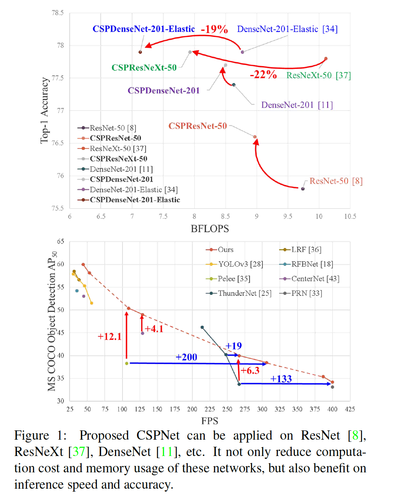

​		在这项研究中，我们引入Cross Stage Partial Network（CSPNet）。设计CSPNet的主要目的是保证这种架构获得更丰富梯度组合，同时减小计算量。通过将基础层的特征图分为两个部分，然后将通过提出的cross-stage hierarchy将它们融合，从而达到这一目的。我们的主要概念是通过划分梯度流将梯度流传过不同网络路径。以这种方式，我们确定传播的梯度信息通过切换concatenation和transition层会有不同较大的相关差异。此外，CSPNet可以极大减小计算数量，并提高推理速度以及准确率，如图1所示。所提出的基于CSPNet的目标检测器处理如下三个问题：

**1）Strengthening learning ability of a CNN** 在轻量化后，已有CNN的准确率被极大地衰减，因为我们希望维持充足的准确率，同时保持轻量化。所提出的CSPNet可以轻松地用于ResNet、ResNeXt和DenseNet。将CSPNet用于上述网络后，计算可以从10%减少到20%，但是在ImageNet的准确率方面，比ResNet、ResNeXt、DenseNet、HarDNet、Elastic和Res2Net好。

**2）Removing computational bottlenecks** 计算瓶颈太大会导致更多的周期来完成推理过程，或者某些算术单元通常会闲置。因此，我们希望我们能在CNN的每层中均匀分布计算量，使得我们可以高效地更新每个计算单元的利用率，并因此减少不必要的能量消耗。值得注意的是所提出的CSPNet是PeleeNet[35]的计算瓶颈减半。此外，在基于MS COCO[17]数据集的目标检测实验中，当在基于YOLOv3的模型上测试时，我们所提出的模型可以有效减少80%的计算瓶颈。

**3）Reducing memory costs**	动态随机存取存储器（Dynamic Random-Access Memory：DRAM）的晶圆制造成本非常昂贵，并且还占用大量空间。如果一个人可以有效地减少内存成本，那么她/它将极大减少ASIC成本。此外，小面积的wafer可以用于不同的边缘计算设备。我们采用cross-channel 池化[6]来压缩特征金字塔生成过程中特征图。以这种方式，当生成特征金字塔时，在PeleeNet上，所提出的CSPNet于所提出的检测器可以减小75%内存。

​		由于CSPNet能够促进CNN的学习能力，因此我们使用更小的模型在GTX 1080Ti上以109FPS的速度获得50%的COCO $\mbox{AP}_{50}$。因为CSPNet可以有效较少大量内存流量，因此我们所提出的方法可以在Intel Core i9-9900K上以52FPS的速度获得40%的COCO $\mbox{AP}_{50}$。此外，由于CSPNet可以明显减少计算瓶颈，Exact Fusion Model（EFM）可以有效减少需要的内存带宽，我们所提出的方法可以在Nvidia Jetson TX2上以49FPS的速度获得42%的COCO $\mbox{AP}_{50}$。

### 2. 相关工作

​		**CNN架构设计**	在ResNeXt[37]中，Xie等首先证明基（cardinality）比宽度和深度维度更有效。由于采用大量重用特征，DenseNet[11]可以明显减少参数量和计算量。并且它拼接所有前面层的特征作为下一个输入，这可以视为最大化基的一种方式。SparseNet[44]将密集连接调整为指数间隔连接，可以有效地提高参数利用率，从而获得更好的结果。通过梯度和组合和开发部分（partial）ResNet（PRN）的概念，Wang等进一步解释为什么高基和稀疏连接可以提高网络的学习能力。为了提高CNN的推理速度，Ma等[23]引入四种指南指导和设计ShuffleNet-V2。Chao等人[2]提出了一种称为Harmonic DenseNet（HarDNet）的低内存流量CNN和一种度量卷积输入/输出（CIO），它是DRAM流量与实际DRAM流量测量成比例的近似值。

​		**实时目标检测器**	最著名的两种实时目标检测器时YOLOv3[28]和SSD[20]。基于SSD，LRF[36]和RFBNet[18]可以在GPU上获得最佳的实时目标检测。最近，基于无锚目标检测器[4、43、13、14、40]已成为主流目标检测系统。这类检测器中的两个是CenterNet[43]和CornerNet-Lite[14]，并且它们在效率执行得非常好。对于CPU或移动GPU上的实时目标检测，基于SSD的Pelee[35]、基于YOLOv3的RPN[33]和基于Light-Head RCNN的ThunderNet[25]在目标检测上表现出令人兴奋的性能。

### 3. 方法

#### 3.1. Cross Stage Partial Network		

​		**Cross Stage Partial Network**   主流CNN架构（例如ResNet、ResNeXt、DenseNet）的输入输出通常是中间层的线性或非线性组合。因此，$k$层CNN的书输出可以表示如下：

$$\begin{align}y &= F(x_0) = x_k \\ &=H_k(x_{k-1},H_{k-1}(x_{k-2}),H_{k-2}(x_{k-2}),\cdots,H_1(x_0),x_0) \tag{1} \end{align}$$

其中$F$为输入$x_0$到目标$y$的映射函数，其也是整个CNN模型。至于$H_k$，它为CNN的第$k$层的运算函数。通常，$H_k$包含卷积层和非线性函数的组合。如果我们以ResNet和DenseNet为例，它们可以由式（2）和式（3）分别表示如下：

$$\begin{align} x_k &= R_k(x_{k-1} + x_{k-1}) \\ &=R_k(x_{k-1}) + R_{k-1}(x_{k-2}) + \cdots + R_1(x_0) + x_0 \tag{2} \end{align}$$

$$\begin{align}x_k &= [D_k(x_{k-1}), x_{k-1}] \\ &=[D_k(x_{k-1}), D_{k-1}(x_{k-2}), \cdots, D_1(x_0), x_0]\end{align} \tag{3}$$

​		在上述两个公式中，$R$和$D$分别表示残差层和密集层的计算算子，并且这些算子通常包含2～3个卷积层。

​		根据上述两个方程中，无论是残差层还是稠密层，构成它们的每个卷积层的输入都接收前一层的输出。在这些情况下，梯度路径的长度可以最小化，并使反向传播中梯度流动更有效。但是，我们还知道这种架构设计将梯度从第$k$层传递到第$k-1$、$k-2$、$\cdots$、$1$层，并使用它来更新权重，其将引起重复的学习冗余信息。

​		近年来，一些研究尝试使用screened $H_k(\cdot)$的输入来提高学习能力和参数利用率。例如，SparseNet[44]使用指数间隔连接来是$H_k$仅直接关联$H_{k-1},H_{k-2},H_{k-4},\cdots,H_{k-2^i},\cdots$。ShuffleNetV2[23]使用切割通道来使$H_k$仅直接于$H_{k-1}$通道的一半关联，并且它的公式可以表示为$S([H_k(x_{k-1}[1:c/2]),x_{k-1}[(c/2+1):c]])$，其中$S$表示$x_{k-1}$的第1到$c/2$个通道。至于PyramidNet[7]和RPN[33]，它们都使用不等通道数的特征图来构建ResNet以获得梯度分流的效果。

​		最佳的方法将它们的关注点放在优化每层中的$H_i$函数上，并且我们提出CSPNet直接优化$F$函数，如下：

$$y = M([x_{0'}, T(F(x_{0''}))])\tag{4}$$

其中沿着通道将$x_0$分为两个部分，它可以表示为$x_0 = [x_{0'},x_{0''}]$。$T$为用于截断$H_1,H_2,\cdots,H_k$的梯度流的过渡函数，$M$为用于混合两个分段部分的过渡函数。接着，我们将举例说明如何将CSPNet集成到DenseNet中，并说明如何解决CNN中重复信息的学习问题。

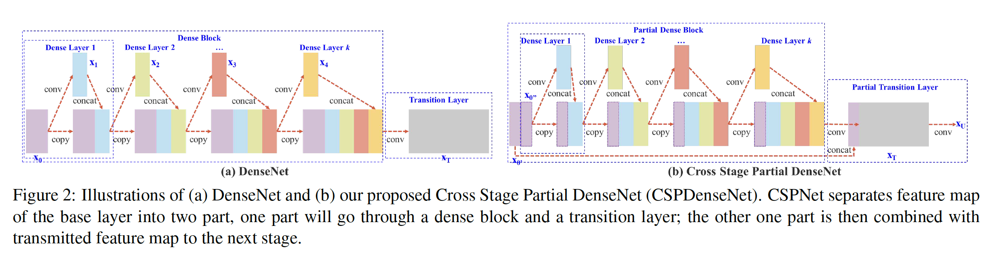

​		**DenseNet**	图2（a）给出Huang等[11]提出的DenseNet的一个阶段。DenseNet的每个阶段包含一个密集块和一个过渡层，并且每个密集块包含$k$个密集层。第$i$个密集层的输出将与第$i$个密集层的输入拼接，并且拼接结果会成为第$i+1$个密集层的输入。表示上述机理的方程式可表示为：

$$\begin{align}x_1 = w_1 &\ast x_0 \\ x_2 = w_2 &\ast [x_0,x_1] \\ &\vdots \\x_k = w_k &\ast [x_0, x_1, \cdots, x_{k-1}] \tag{5}\end{align}$$

其中$\ast$表示卷积操作，$[x_0,x_1,\cdots]$表示拼接$x_0,x_1,\cdots$，$w_i$和$x_i$分别为第$i$个密集层的权重和输出。

​		如果人们利用反向传播来更新权重，权重更新的公式可以写为：

$$\begin{align}x_1' = f_1(&w_1,\{g_0\}) \\ w_2' = f_2(&w_2,\{g_0,g_1\} \\ \vdots \\ w_k' = f_k(&w_k, \{g_0,g_1,\cdots,g_{k-1}\})\tag{6}\end{align}$$

其中$f_i$为第$i$个密集层的权重更新函数，$g_i$表示传播到第$i$个密集层的梯度。我们可以发现大量的梯度信息重复用于更细不同密集层。这将导致不同密集层重复地学习复制的梯度信息。

​		**Cross Stage Partial DenseNet**	所提出的CSPDenseNet的一个阶段的架构如图2（b）所示。CSPDenseNet的一个阶段包含一个部分密集块和一个部分过渡层。在目标密集块中，阶段中基层的特征图在通道上被分为两个部分$x_0 = [x_{0'},x_{0''}]$。$x_{0'}$和$x_{0''}$之间，前者直接连接到阶段的末端，后者通过一个密集块。所有步骤涉及的部分过渡层如下：第一，密集层的输出（$[x_{0''},x_1,\cdots,x_k]$）将经过一个过渡层。第二，过渡层的输出$x_T$将与$x_{0'}$拼接，并经过另一个过渡层，然后生成输出$x_U$。CSPDenseNet的前馈传递方程和权值更新方程分别如式7和式8所示。

$$\begin{align}x_k &= w_k \ast [x_{0''},x_1,\cdots,x_{k-1}] \\ x_T &= w_T \ast [x_{0''},x_1,\cdots,x_k] \\ x_U &= w_U \ast [x_{0'},x_T]\end{align}\tag{7}$$

$$\begin{align}w_k' &= f_k(w_k, \{g_{0''}, g_1,\cdots,g_{k-1} \}) \\ w_T' &= f_T(w_T,\{g_{0''},g_1,\cdots,g_k\}) \\ w_U' &= f_U(w_U,\{g_{0'},g_T\}) \end{align}\tag{8}$$

​		我们可以看出来之密集层的梯度被分开整合。另一方面，没有通过密集层的特征$x_0'$也被分开整合。对于用于更新权重的梯度信息，双方都不包含属于其他边的重复梯度信息。

​		综合说来，所提出的CSPDenseNet保留了DenseNet特征重用特点的优势，但同时通过截断梯度流来防止过多的重复梯度信息。该思想通过设计层次化的特征融合策略实现，并应用于部分过渡层。

​		**Partial Dens Block**	设计的部分密集块的优势为：_1）increase gradient path：_通过切分和融合策略，梯度路径的数量可以加倍。由于跨阶段策略，可以缓解由shying显示特征副本进行拼接的劣势。_2）balance computation of each layer：_通常，DenseNet的基层的通道数远大于growth rate。由于部分密集块中参与密集层运算的底层通道只占原始通道数的一半，因此可以有效地解决近一半的计算瓶颈问题；_3）reduce memory traffic：_假设DenseNet的密集块的基特征图像大小为$w \times h \times c$，growth rate为$d$，共有$m$个密集层。那么，密集块的CIO为$(c \times m) + ((m^2 + m) \times d) / 2$，部分密集块的CIO为$((c \times m) + (m^2 + m) \times d) / 2$。而$m$和$d$通常远小于$c$，部分密集块最多能节省网络内存流量的一半。

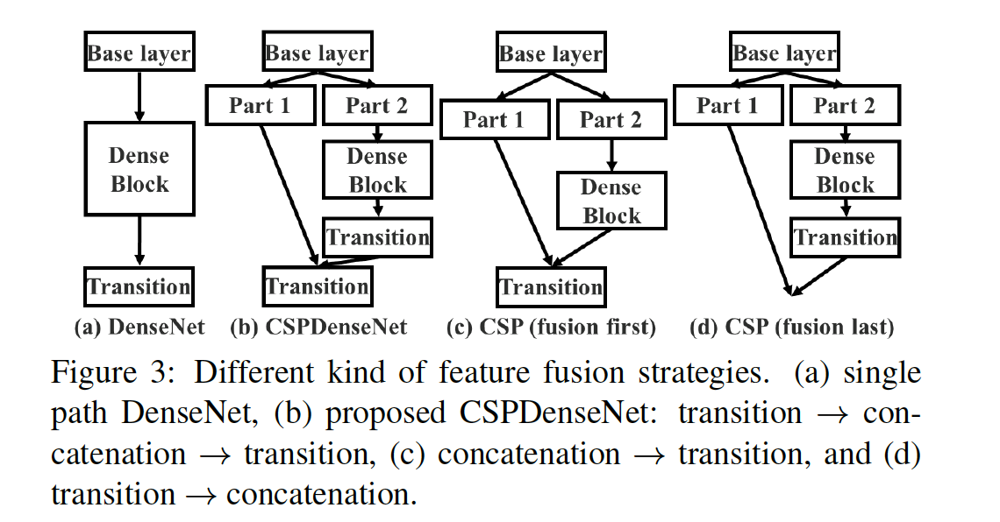

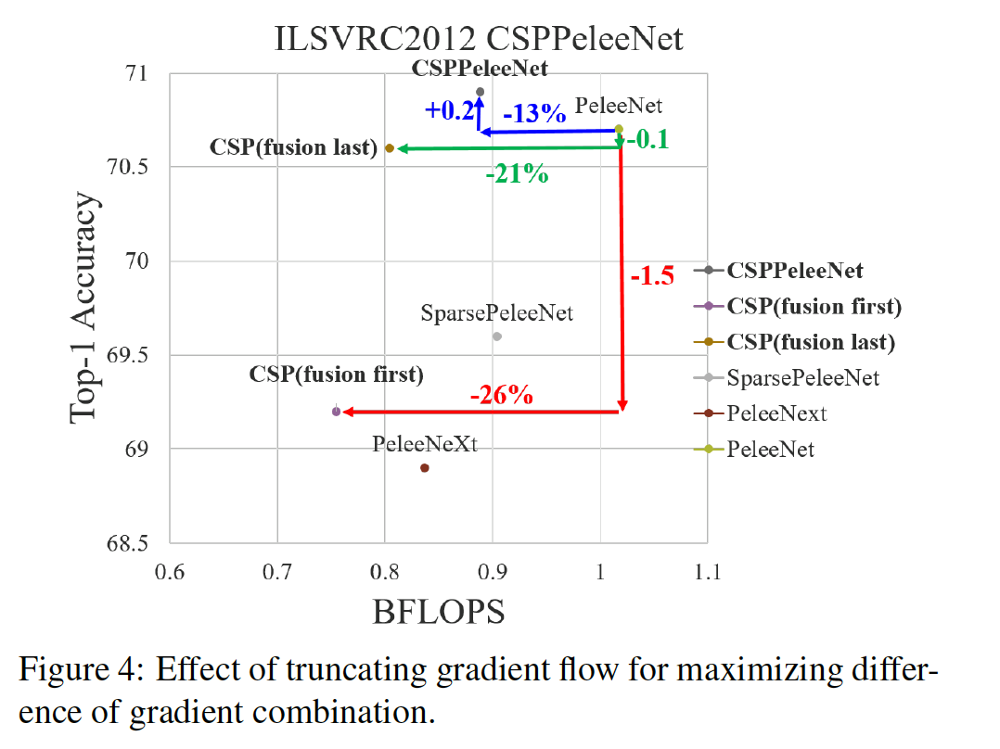

​		**Partial Transition Layer**	设计部分过渡层的目的是最大化梯度组合的差异。部分过渡层是一种层次的特征融合机制，其使用截断梯度流的策略来阻止不同层学习重复的梯度信息。这里，我们设计两种CSPDenseNet变体来证明这类梯度流截断是如何影响网络的学习能力。图3（c）和图3（d）列举了两种不同的融合策略。CSP（fusion first）表示拼接由两部分生成的特征图，然后进行过渡操作。如果采用这种策略，大量梯度信息将得到重用。至于CSP（fusion last）策略，密集块的输出将通过过渡层，然后与part 1的特征图进行拼接。如果采用CSP（fusion last）策略，由于梯度流被截断，梯度信息将不会被重用。如果我们使用图3中的四种架构来进行图像分类，相关结果见图4。可以看出，如果采用CSP（fusion last）策略来进行图像分类，计算成本明显降低，但是top-1准确率仅降低0.1%。另一方面，CSP（fusion first）策略明显降低计算成本，但是top-1准确率降低1.5%。通过使用切割和跨阶段的融合策略，我们能够有效地减少信息集成过程中重复的可能性。根据图4的结果，可见，如果能够有效减少重复的梯度信息，网络的学习能力将得到极大提升。

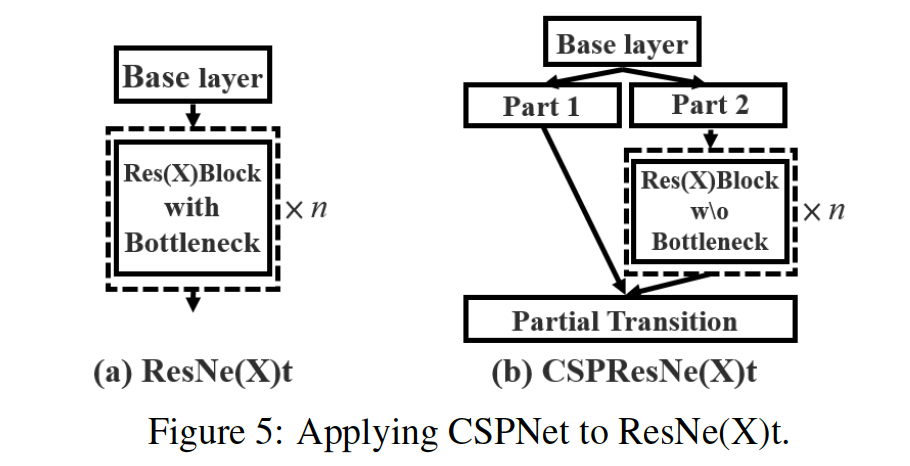

​		**Apply CSPNet to Other Architecture**	CSPNet也可以用于ResNet和ResNeXT，架构如图5所示。因为仅有一半的特征通道通过Res(X)Blocks，所以没有必要再引入瓶颈层。当固定FLoating-point Operations（FLOPs）时，这使Memory Access（MAC）的理论边界更低。

#### 3.2. Exact Fusion Model

​		**Looking Exactly to predict perfectly**	我们提出了EFM来捕捉每个锚的合适的感受野，从而提高了一阶段目标探测器的精度。对于分割任务，由于像素级的标签通常不包含全局信息，为了更好地检索信息，通常考虑更大的补丁[21]。但是，对于如图像分类和目标检测任务，当从图像级别和边界框级别的标签观察时，某些关键信息可能会变得模糊。Li等人[15]发现CNN在学习图像级别的标签时常常会分心，并得出结论，这是两级目标检测器优于单级目标检测器的主要原因之一。

​		**Aggregate Feature Pyramid**	所提出的EFM能够更好地聚合初始特征金字塔。EFM基于YOLOv3[28]，其将一个边界框先验分配给每个ground-truth目标。每个ground-truth边界框与一个超过阈值IoU的锚框对应。如果锚框的大小等于网格单元的感受野，那么对于第$s$个尺度的网格单元，相应的边界框的下界为第$(s-1)$个尺度，上界为$(s+1)$个尺度。因此，EFM集成三个尺度的特征。

​		**Balance Computation**	由于特征金字塔中连接的特征映射数量巨大，因此会带来大量的内存和计算开销。为了缓解这个问题，我们引入Maxout技术来压缩特征图。

### 4. 实验

​		我们使用ImageNet图像分类数据集[3]来验证所提出的CSPNet。并使用MS COCO目标检测数据集[17]来验证所提出的CSPNet和EFM。

#### 4.1. 实现细节

​		**ImageNet**	在ImageNet图像分类实验中，如训练步数、学习率调度、优化器、数据集增强等的所有超参数都遵循Redmon等[28]中定义的配置。对于基于ResNet和基于ResNeXt的模型，我们设置8000000训练步数。至于基于DenseNet模型，我们设置1600000训练步数。我们将初始学习率设置为0.1，并采用polynomial decay learning rate scheduling策略。momentum和weight decay分别设置为0.9和0.005。所有的架构都使用一个GPU以128的批量大小进行通用训练。最后，我们使用ILSVRC2012验证集来验证我们的方法。

​		**MS COCO**	在MS COCO目标检测实验中，所有超参数也遵循Redmon等[28]的设置。我们总共进行50万步训练。我们采用step decay学习调度策略，分别在400000步和450000步乘以0.1。momentum和weight decay 分别设置为0.9和0.0005。所有架构使用单GPU来执行多尺度训练，批大小为64。最后，采用COCO test-dev集来验证我们的方法。

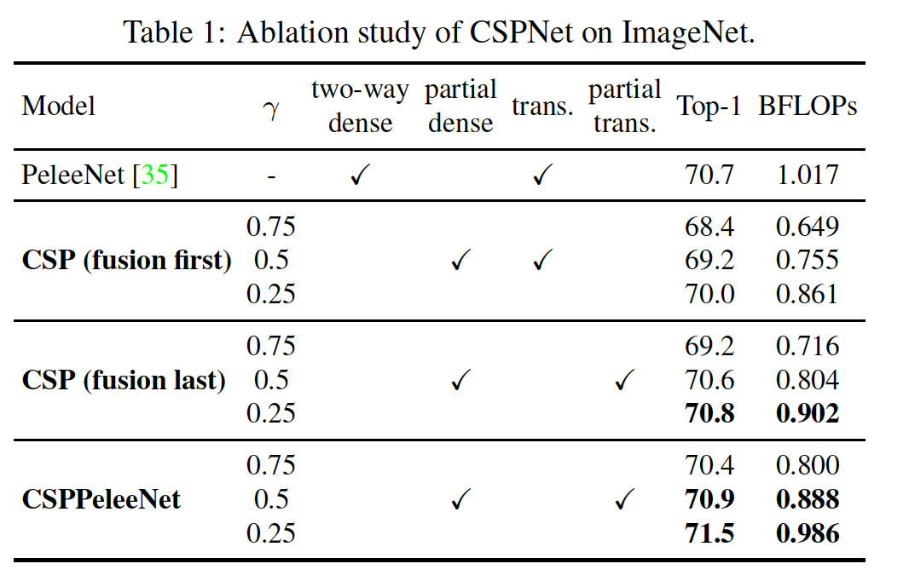

​		**ImageNet上CSPNet的消融研究**	在CSPNet上进行的消融实验中，我们采用PeleeNet[35]作为基线，ImageNet用于验证CSPNet的性能。我们使用不同的partial ratio $\gamma$和特征融合策略进行消融研究。表1给出CSPNet的消融研究的结果。至于CSP（fusion first）和CSP（fusion last），它们被提出用于验证部分过渡的好处。

​		根据CSP（fusion last）的实验结果，设计用于减少冗余信息学习的部分过渡层获得非常好的性能。例如，当计算成本减少21%时，准确率仅衰减0.1%。值得注意的一件事是，当$\gamma = 0.25$时，计算减小11%，但是准确率增加0.1%。与基线PeleeNet相比，所提出的CSPPeleeNet获得最佳性能，它可以减少13%的计算，但是同时将准确率增加0.2%。如果我们将partial ratio调整到$\gamma = 0.25$，我们能够将准确率增加0.8%，计算量减少3%。

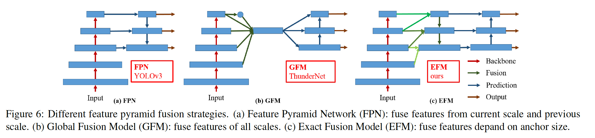

​		**MS COCO上EFM的消融研究**	接着，我们进行EFM的消融研究，并比较3中不同特征融合策略，如图6所示。我们选择PRN[33]和ThunderNet[25]来进行表。具有Context Enhancement（CEM）和Spatial Attention Module（SAM）的PRN和ThunderNet分别为FPN和GFM架构。我们还设计GFM来与所提出的EFM进行比较。此外，GIoU[29]、SPP和SAM也用于EFM。采用CSPeleeNet作为骨干的所有实验结果见表2.

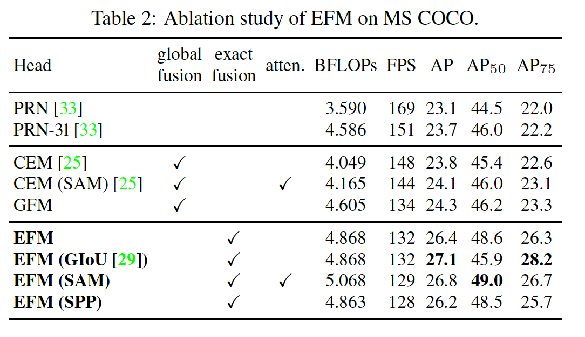

​		如实验结果反应的，所提出的EFM比GFM慢2FPS，但是它的$\mbox{AP}_{50}$增加2.4%。GIoU可以将AP增加0.7%，但是$\mbox{AP}_{50}$显著增加2.7%。对于边缘计算，实际影响因素是目标的数量和位置。因此，我们在后续模型中不使用GIoU训练。SAM可以得到比SPP更好的帧率和AP，因此我们使用EFM（SAM）作为最终架构。

#### 4.3. ImageNet图像分类

​		我们将CSPNet用于ResNet-10、ResNeXt-50、DenseNet-201、PeleeNet和Dense-201-Elastic，并与最佳方法比较。实验结果见表3。

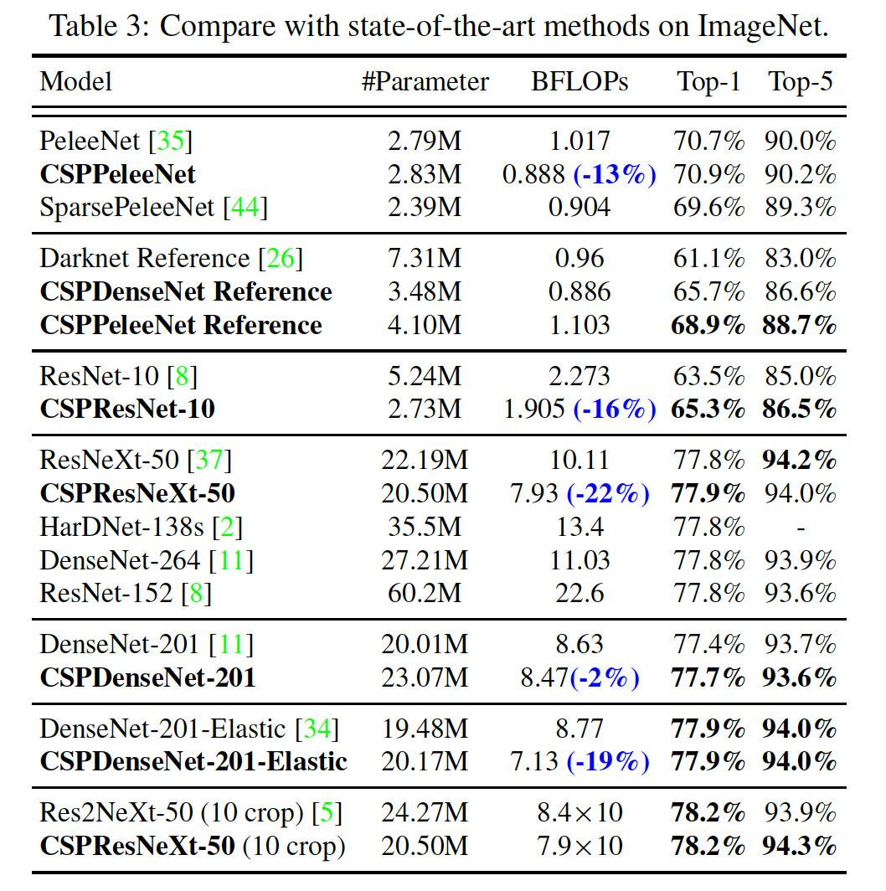

#### 4.4. MS COCO 目标检测

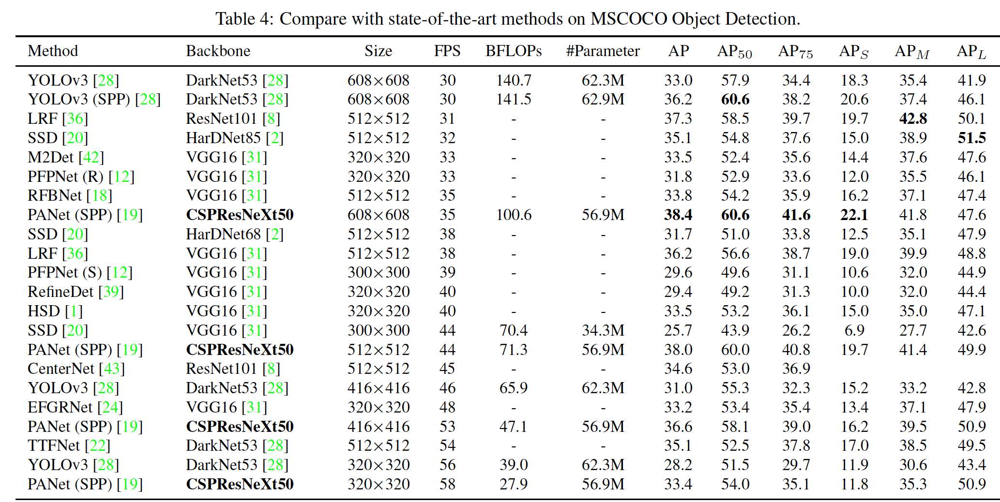

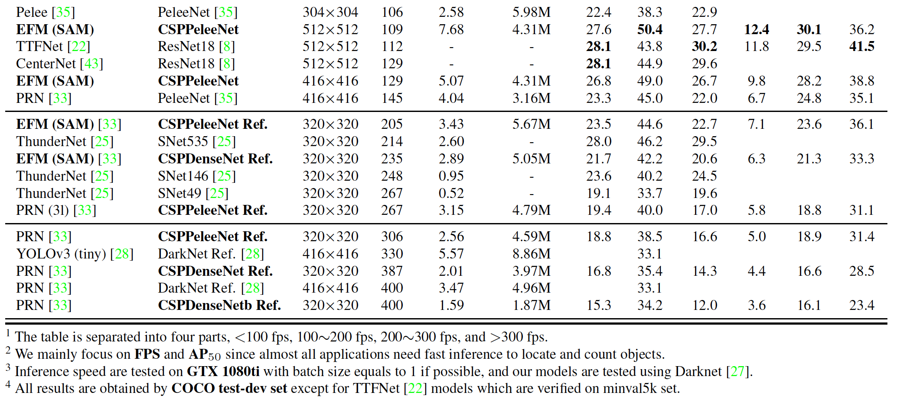

#### 4.5. 分析

​		**计算瓶颈**	图7给出PeleeNet-YOLO、PeleeNet-PRN和所提出的CSPPeleeNet-EFM的每层的BLOPS。当将头部集成到特征金字塔，PeleeNet-YOLO的计算瓶颈发生，而PeleeNet-RPN的计算瓶颈发生在PeleeNet骨干的过渡层。至于所提出的CSPPeleeNet-EFM，它可以平衡综合计算瓶颈，其将PeleeNet骨干的计算减少44%，将PeleeNet-YOLO的是计算瓶颈减少80%。因此，我们可以说所提出的CSPNet可以提供更高利用率的硬件。

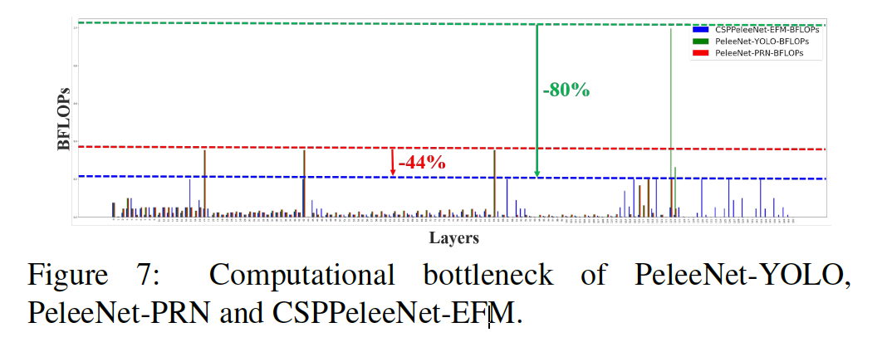

​		**Memory Traffic**	图8展示ResNeXt50和所提出的CSPResNeXt50的每层的大小。所提出的CSPResNeXt（32.6M）的CIO比原始的ResNeXt50（34.4M）低。此外，我们的CSPResNeXt50移除ResXBlock中的瓶颈层，并维持相同的输入和输出通道数，其如Ma等[23]中所示，当FLOPs固定时，这具有最低的MAC和最有效的计算。在计算方面，低CIO和FLOPs保证我们的CSPResNeXt50比朴素的ResNeXt50少22%。

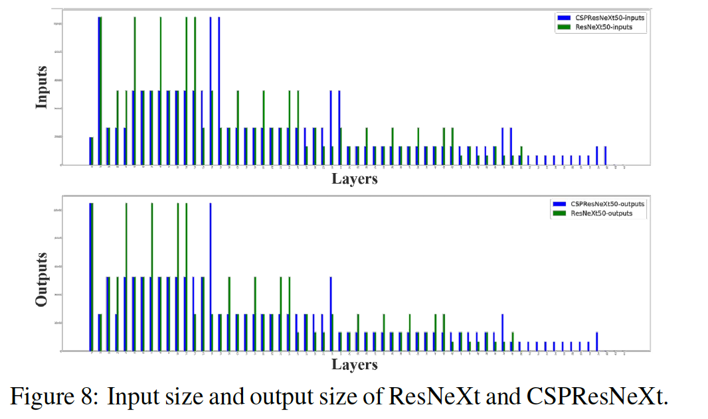

​		**推理帧率**	我们进一步评估所提出的方法是否能够部署在有移动GPU或CPU上的实时检测器上。实验基于NVIDIA Jetson TX2和Intel Core i9-9900K。CPU上的帧率在OpenCV DNN模块上进行。为了公平比价，我们没有采用压缩或量化。结果图表5所示。

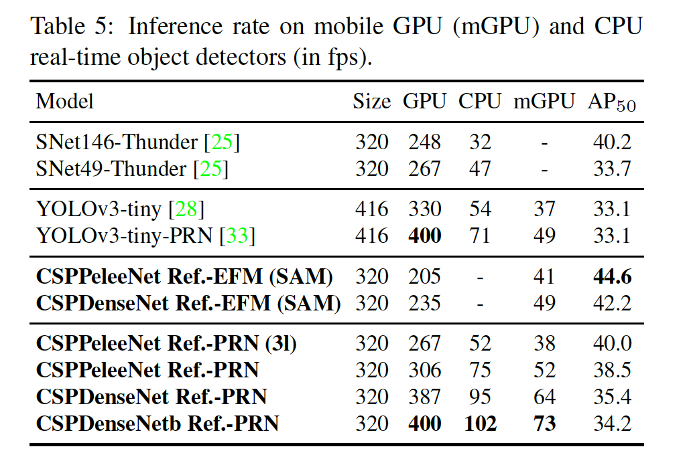