# CNN分类总结

## 1 AlexNet
### 1.1 网络架构

  准确率：top-1 = 37.5%, top = 15.3%  
  参数：$57 \times 10^6$， （5 + 2）层。  
  输入层： $227 \times 227 \times 3$。  
  第一层：（1）卷积核大小(11, 11, 3, 96), strides=4, padding=0，输出大小为(55, 55, 96)（两个GPU）；(2）池化核为(3, 3), strides=2, pddding=0, 输出大小为(27， 27，96)。  
  第三层：（1）卷积核大小为(5, 5, 96, 256), strides=1， padding=0，输出大小为（27, 27, 256）；（2）池化核大小为（3， 3），strides=2，padding=0，输出大小为（13,13,384）。  
  第四层：卷积核大小为（3,3,384,384），strides=1，padding=1，输出大小为（13,13,384）。
  第五层：卷积核大小为（3,3,384,256），strides=1，padding=1，输出大小为（13,13,256）。
  第六层：全连接层，隐藏单元为4096。
  第七层：全连接层，隐藏单元为4096.
  输出层：输出1000个类别的概率。

### 1.2 描述
#### 1.2.1 ReLU
  非饱和非线性修正线性单元$f(x) = max(0, x)$（Rectified Linear Units），相较于饱和非线性（saturating nonlinearities）函数$f(x) = tanh(x) = \frac{e^x - e^{-x}}{e^x + e^{-x}}$ 或$f(x) = (1 + e ^ {-x}) ^ {-1}$， 它在梯度下降训练时收敛速度更快。

#### 1.2.2 多GPU训练
  AlexNet使用了两个GPU进行训练，将网络均分分为两个group，GPU之间的交流仅在某一层完成。例如，第三层的输入来源于第2层的所有特征图，然而，第4层的卷积核只接受位于同一GPU上的第3层特征图的输出。

### 1.2.3 局部响应归一化
  ReLU的一个特性是不需要归一化来防止饱和。然而使用局部响应归一化（local response normalization）有利于模型的泛化（generalization）。使用$a^i_{x, y}$表示核$i$在位置$(x, y)$处的神经元激活，响应归一化激活（response-normalized activity）$b^i_{x, y}$如下计算：
  $$b^i_{x, y} = \left({\frac{a^i_{x, y}}{k + \alpha\sum_{j=max(0, i - n / 2)}^{min(N - 1, i + n / 2)} {(a^j_{x, y})^2}}}\right)^\beta$$
  其中，和是在相同空间位置的n个相邻核映射上计算，并且N是该层中核的数量。参数设置为$k = 2, n = 5, \alpha = 10^{-4}, \beta = 0.75$。在ReLU之后使用归一化。

### 1.2.4 Overlapping Pooling
  在池化层中，当stride < pool_size时，便是重叠池化。而之前的工作多使用strides = pool_size,此时为非重叠池化（non-overlapping Pooling）。

### 1.2.5 Data Augmentation
  数据增强有助于减小过拟合。具体做法为：   
  第一，从$256 \times 256$的图像上随机剪裁$224 \times 224$的子块。测试时，网络预测从图像上提取的$224 \times 224$子块（从图像的四个角和中心出提取），同时使用了水平翻转，最后由得到的10个子块（加上水平翻转）的平均预测结果作为最终的输出。   
  第二，改变训练图像的RGB通道强度。具体地，在整个ImageNet训练集的RGB像素值集合上执行PCA。对每个训练图像添加主成分的倍数，其大小与相应的特征值成正比，并且相应的特征值乘以服从均值为0，标准差为0.1的高斯分布的随机变量。因此，为每个RGB像素值$I_{xy} = [I^R_{xy}, I^G_{xy}, I^B_{xy}]^T$添加如下量化值：
  $$[p_1, p_2, p_3][\alpha_1\lambda_1, \alpha_2\lambda_2, \alpha_3\lambda_3]^T$$
  其中$p_i$和$\lambda_i$分别是第$i$RGB像素值的$3 \times 3$协方差矩阵的特征向量和特征值，$\alpha_i$是前面提到的高斯随机变量。在每个epoch中，$\alpha_i$保持不变，在下一epoch时重新获取。这一操作减少了1%的错误率。

### 1.2.6 Dropout
  以0.5的概率丢弃神经元。在测试时使用全部神经元，但是输出结果乘以0.5。

# 2. Overfeat
## 2.1 网络架构
  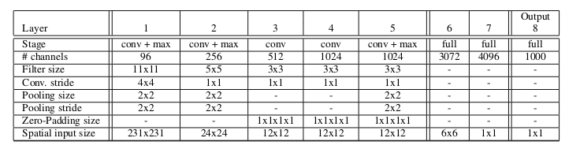
  参数： $140 \times 10^6$  (6 + 2)层。  
  准确率： top-5 = 13.6%， top-1 = 33.9%

# 3. VGG
## 3.1 网络架构
  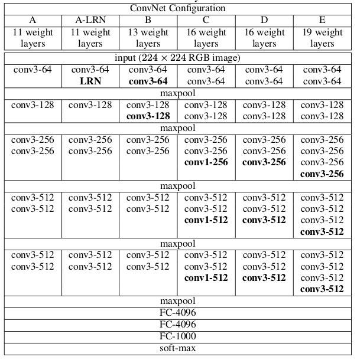
  参数：   
  

## 3.2 描述
### 3.2.1 卷积核
  网络全部使用$3 \times 3$, strides=1，padding=1的卷积核。不再使用LRN层。
### 3.2.2 池化层
  使用$2 \times 2$， strides=2的池化核。
### 3.2.3 全连接层
  dropout rate = 0.5
### 3.2.4 多尺度验证
#### Single Scale Evaluation
  使用单一尺度进行验证，测试图像尺寸，当S固定时，为$Q = S$；当$S\in [S_{min}, S_{max}]$时，$Q=0.5(S_{min} + S_{max})$，S为训练时的输入大小。具体下图    
  
### Multi-Scale Evaluation
  当S固定时，输入大小为$Q={S-32, S, S+32}$；当$S\in[S_{min}, S_{max}]$时，输入大小为$Q={S_{min}, 0.5(S_{min} + S_{max}), S_{max}}$，具体如下图   
  

# 4 GoogleNet
## 4.1 网络架构
  

  参数： $6 \times 10^6$, 22层    
  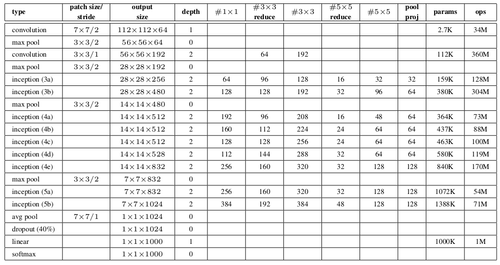
  准确率：    
  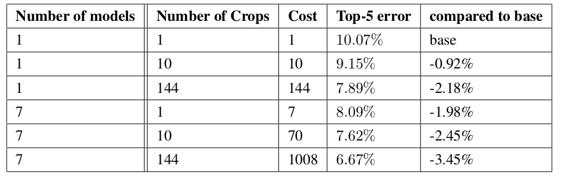

## 4.2 描述
### 4.2.1 更深更宽
  提升网络性能的最直接方法是增加网络的大小，但存在两个缺点：更大意味着更多的参数，将使网络更容易过拟合，特别是训练集有限的情况下；另一个缺点是增加网络的大小将极大地增加计算开销；网络越深越容易出现梯度消失现象。  

  提出两种解决方案：增加网络深度，为避免梯度消失，增加了两个损失层（如网络架构图）；增加网络宽度，使用NIN(Network in Network)的结构。
### 4.2.2 Inception naive version
  
  如上图，使用了不同大小的卷积核，这意味着不同大小的感受野，最后使用concat可以融合不同尺度的特征。   
  采用$1 \times 1$、$3 \times 3$和$5 \times 5$的卷积核，主要是为了方便对齐，同时设置strides=1、padding=0、1、2，便可以使用concat连接特征；由于max-pooling的有效性，也嵌入了max-pooling。   
### 4.2.3 Inception module with dimension reductions
  直接使用$5\times5$卷积会增加网络的计算开销，因此，在$3\times3$、$5\times5$卷积之前使用$1\times1$卷积来降低维度，得到下图的Inception模块：    
  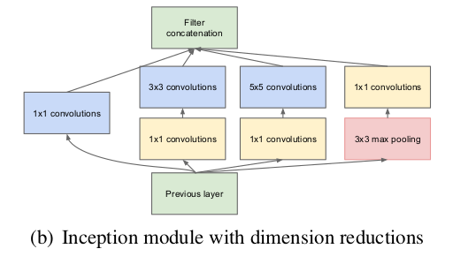

### 4.3 auxiliary classifier
  - 一个$5\times5$池化核、strides=3，对于4a，产生$4\times4\times512$的输出；对于4d产生$4\times4\528$的输出。
  - $1\times1\times128$的卷积用于减少维度，并跟一个ReLU。
  - 1024单元的全连接层，并跟一个ReLU。
  - 70%的比例丢弃输出。
  - 一个线性层和softmax作为分类器。

### 4.4 Data Augmentation
  对图像的各个大小块进行采样，这些块的大小均匀分布在图像面积的8%到100%之间，并且在3/4到4/3之间随机选择高宽比。

### 4.5 测试
  - 使用剪裁的多尺度测试，具体来说，我们将图像调整到4个尺度，其中较短的维度(高度或宽度)分别为256、288、320和352，取这些调整后的图像的左边、中间和右边的方块(对于肖像图像，我们取顶部、中心和底部的方块)。对于每一个方块，我们获取4个角和中心的$224\times224$的块，并与方块以及剪裁区域的镜像一起调整为$224\times224$，总共得到$4\times3\times6\times2=144$。
  - 对所有子块softmax概率求平均以得到最终的概率。

# 5 Inception v2
## 5.1 背景
### 5.1.1 问题
  随着网络的加深，需要通过精心调整学习率、初始化等来加速模型收敛。一方面，当底层网络中参数发生微弱变化时，由于每一层中的线性变换与非线性激活映射，这些微弱变化随着网络层数的加深而被放大（类似蝴蝶效应）；另一方面，参数的变化导致每一层的输入分布会发生改变，进而上层的网络需要不停地去适应这些分布变化，使得我们的模型训练变得困难。上述这一现象叫做Internal Covariate Shift。

### 5.1.2 Internal Covariate Shift
  定义：在深层网络训练过程中，由于网络中参数变化而引起内部节点数据分布发生变化的这一过程被称为Internal Covariate Shift。
  我们定义每一层的线性变换为$Z^l=W^l\times x + b^l$，其中$l$代表层数，非线性变换为$A^l=g^l(Z^l)$，其中$g^l(\cdot)$为第$l$层的激活函数。  
  随着梯度下降的进行，每一层的参数$W^l$与$b^l$都会被更新，那么$Z^l$的分布也就发生了变化，进而$A^l$同样出现的分布的改变。而$A^l$作为第$l+1$层的输入，意味着$l+1$层就需要图不停适应这种数据分布的变化，这一过程称为Inerval Covariate Shift。

### 5.1.3 带来的问题
  - 上层网络需要不停调整来适应输入数据分布的变化，导致网络学习速度变慢。  
  这是由于Interval Covariate Shift导致每层的输出结果分布发生变化，之后的网络层就要不停地取适应这种分布变化。
  - 网络的训练过程容易陷入梯度饱和，减慢网络收敛速度。  
  当我们在神经网络中采用饱和激活函数（saturated activation function）时，例如sigmoid，tanh激活函数，很容易使得模型训练陷入梯度饱和区（saturated regime）。随着模型训练的进行，我们的参数$W^l$会逐渐更新并变大，此时$Z^l=W^lA^{l-1}+b^l$就会随之变大，并且$Z^l$还受到更底层网络参数$W^1,W^2,...,W^{l-1}$的影响，随着网络层数加深，$Z^l$容易陷入梯度饱和，此时梯度接近于0，参数的更新速度就会减慢，进而放慢网络收敛速度。

### 5.1.4 解决方法
  - 白化（Whitening）  
  白化（Whitening）是机器学习里面常用的一种规范化数据分布的方法，主要是PCA白化与ZCA白化。白化是对输入数据分布进行变换，进而达到以下两个目的：  
    - 使得输入特征分布具有相同的均值与方差。其中PCA白化保证了所有特征分布均值为0，方差为1；而ZCA白化则保证了所有特征分布均值为0，方差相同；  
    - 去除特征之间的相关性。  
    通过白化操作，我们可以减缓ICS的问题，进而固定了每一层网络输入分布，加速网络训练过程的收敛（LeCun et al.,1998b；Wiesler&Ney,2011）。
  - Batch Normalization：
  白化主要有以下两个问题：  
    - 白化过程计算成本太高，并且在每一轮训练中的每一层我们都需要做如此高成本计算的白化操作；
    - 白化过程由于改变了网络每一层的分布，因而改变了网络层中本身数据的表达能力。底层网络学习到的参数信息会被白化操作丢失掉。

## 5.2 Batch Normalization
  对于d维的输入$x=(x^{(1), ..., x^{(d)}})$，batch normalization计算如下：  

  Input: Values of $x$ over a mini-batch: $\cal {B}$$=x_{1,...,m}$; Parameters to be learned: $\gamma$,$\beta$  
  Output: {$y_i=BN_{\gamma, \beta}(x_i)$}  

  $u_\cal{B} \leftarrow \frac{1}{m}\sum_{i=1}^{m}x_i$       // mini-batch mean   
  $\sigma_\cal{B}^2 \leftarrow \frac{1}{m}\sum_{i=1}^{m}(x_i-u_\cal{B})^2$    // mini-batch variance   
  $\hat{x}_i\leftarrow\frac{x_i - u_\cal{B}}{\sqrt{\sigma_\cal{B}^2 + \epsilon}}$   // normalize  
  $y_i\leftarrow\gamma\hat{x}_i+\beta \equiv BN_{\gamma,\beta}(x_i)$    // scale and shift    

  训练过程：   
  

## 5.3 优点
  - BN使得网络中每层输入数据的分布相对稳定，加速模型学习；
  - BN使得模型对网络中的参数不那么敏感，简化调参过程，使得网络学习更加稳定（可以使用更大的学习率）；
  - BN允许网络使用饱和性激活函数（例如sigmoid，tanh等），能够缓解梯度消失问题；
  - BN具有一定的正则化效果，可以不再使用dropout。

## 5.4 架构
  参数为：$12 \times 10^6$, 31层
  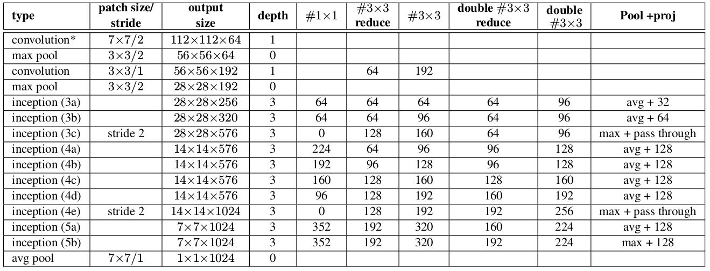
  - Inception v1(GoogleNet)中的$5\times5$卷积层被替换为两个连续的$3\times3$卷积层。这将使网的最大深度增加9个权重层，同时增加了25%的参数，同时增加了30%的计算成本。
  - $28\times28$的Inception模块从2个增加到3个。
  - 在模块内部，有时使用everage-pooling，有时使用max-Pooling。
  - 在任何两个Inception模块之间没有池化层，但是在模块3c、4e中的过滤器连接之前使用了stride-2的卷积/池化层。  
  

## 5.5 结果
  

# 6 Inception V3
## 6.1 网络设计准则
  - _避免表达瓶颈，特别是网络早期。_ 因此，在网络的早起避免过多的压缩。   
  前馈网络可以表示为从输入层到分类器或者回归器的无环图（acyclic graph）。这为信息流定义了清晰的方向。对于任何将输入与输出分离的裁剪，都可以访问通过裁剪传递的信息量。应该避免极限压缩的瓶颈。一般来说，在达到完成手头任务的最终表征（representation）之前，表征的大小应当逐渐增加。理论上，信息的内容不能仅仅通过表征的维度评价，因为它丢弃了如相关结构（correlation structure）这样的重要信息；维度仅仅提供了信息内容的粗糙估计。
  - _高维表征更容易在网络内被局部处理。_ 在卷积网络中增加每个图块的激活允许更多的解耦特征（disentangled features）。所产生的网络训练更快。
  - _空间聚合可以在较低维嵌入上完成，其表示能力不会造成太多的损失。_ 在执行更多展开（例如$\3\times3$）卷积之前，可以在空间聚合之前减小输入表征的维度，这不会造成严重的负面影响。我们假设，如果在空间聚合上下文中使用输出，则相邻单元之间的强相关性会导致维度缩减时信息更少的信息损失。鉴于这些信号应该易于压缩，因此，维度减小甚至促进更快学习。
  - _平衡网络的宽度和深度。_ 网络的最优性能可以通过平衡每个阶段滤波器的数量和网络的深度来达到。同时增加网络的宽度和深度能有利于更高质量的网络。然而，如果两者并行增加，则可以达到恒定计算量的最佳改进。因此，计算预算应该在网络深度和宽段之间以平衡方式进行分配。
## 6.2 基于大滤波器尺寸分解卷积
  GoogLeNet受益于大量使用降维，这可以视为以计算有效的方式分解卷积的特例。在网络中，相近激活的输出是高度相关的，因此，激活在聚合之前减少会导致更具表现力的局部表征。   
  Inception_v1将大卷积核分解成$3\times3$, $5\times5$的卷积核，而Inception_v2进一步将$5\times5$卷积核分解成两个$3\times3$。   
  _不对称卷积：_ 将$3\times3$卷积分解成$1\times3$和$3\times1$，比分解为$2\times2$有更好的效果。本文主要使用   
  
  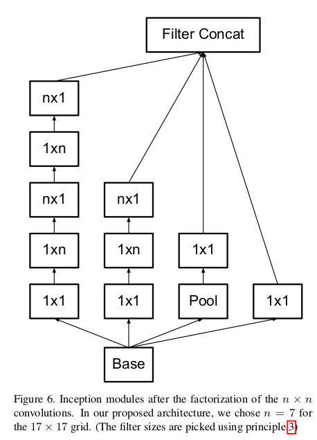
  

## 6.3 辅助分类器
  辅助分类器是用以改善非常深的网络的收敛。最初的动机是将有用的梯度推向较低层，使其立即有用，并通过抵抗非常深的网络中的消失梯度问题来提高训练过程中的收敛。我们发现辅助分类器在训练早期并没有导致改善收敛：在两个模型达到高精度之前，有无侧边网络的训练进度看起来几乎相同。接近训练结束，辅助分支网络开始超越没有任何分支的网络的准确性，达到了更高的稳定水平。
  

## 6.4 有效的网格尺寸减小
  传统上，卷积网络使用一些池化操作来缩减特征图的网格大小。为了避免表示瓶颈，在应用最大池化或平均池化之前，需要扩展网络滤波器的激活维度。例如，开始有一个带有$k$个滤波器的$d \times d$网格，如果我们想要达到一个带有$2k$个滤波器的 $\frac{d}{2} \times \frac{d}{2}$ 网格，我们首先需要用$2k$个滤波器计算步长为1的卷积，然后应用一个额外的池化步骤。这意味着总体计算成本由在较大的网格上使用$2d^2k^2$次运算的昂贵卷积支配。一种可能性是转换为带有卷积的池化，因此导致 $2(\frac{d}{2})^2k^2$ 次运算，将计算成本降低为原来的四分之一。然而，由于表示的整体维度下降到 $(\frac{d}{2})^2k$ ，会导致表示能力较弱的网络，这会产生一个表示瓶颈。我们建议另一种变体，其甚至进一步降低了计算成本，同时消除了表示瓶颈，而不是这样做。我们可以使用两个平行的步长为2的块：$P$和$C$。$P$是一个池化层（平均池化或最大池化）的激活，两者都是步长为$2$，其滤波器组连接如下图所示。   
  

## 6.5 网络架构
  

## 6.6 Regularization via Label Smoothing
### 6.6.1 背景
1、背景

假设有一个分类模型，预测观测样本x属于K个类别的概率。对于观测样本x，采用 $P(y’|x)$ 表示模型对x的预测的概率分布， $q(y|x)$ 表示模型输出y的真实分布。分类器采用交叉熵做为目标函数，使模型预测的概率分布 $P(y’|x)$ 尽量接近真实的概率分布 $q(y|x)$ 。在进行模型训练时，通常采用类似one-hot-to-vec的0或1的方式，对真实分布 $q(y|x)$ 进行编码，即观测样本属于某些类别，则对应类别的 $P(y|x)$ 的值为1，否则为0。这样的编码方式存在两个明显的问题：

- 可能导致过拟合。0或1的标记方式导致模型概率估计值为1，或接近于1，这样的编码方式不够soft，容易导致过拟合。为什么？用于训练模型的training set通常是很有限的，往往不能覆盖所有的情况，特别是在训练样本比较少的情况下更为明显。以神经机器翻译（NMT）为例：假设预测句子“今天下午我们去..”中，“去”后面的一个词。假设只有“去钓鱼”和“去逛街”两种搭配，且真实的句子是“今天下午我们去钓鱼”。training set中，“去钓鱼”这个搭配出现10次，“去逛街”搭配出现40次。“去钓鱼”出现概率真实概率是20%，“去逛街”出现的真实概率是80%。因为采用0或1的表示方式，随着training次数增加，模型逐渐倾向于“去逛街”这个搭配，使这个搭配预测概率为100%或接近于100%，“去钓鱼”这个搭配逐渐被忽略。
- 模型become too confident about its predictions。情况与过拟合比较类似，模型对它的预测过于confident，导致模型对观测变量x的预测严重偏离真实的情况，比如上述例子中，把“去逛街”搭配出现的概率从80%放大到100%，这种放大是不合理的。

### 6.6.2 Label Smoothing
Label Smoothing Regularization（LSR）就是为了缓解由label不够soft而容易导致过拟合的问题，使模型对预测less confident。LSR的方法原理：
假设 $q(y|x)$ 表示label y的真实分布； $u(y)$ 表示一个关于label y，且独立于观测样本x（与x无关）的固定且已知的分布，通过下面公式（1）重写label y的分布 $q(y|x)$ ：
$$q’(y|x)=(1 - \epsilon) * q(y|x) + \epsilon * u(y) （1）$$

其中，$\epsilon \in [0,1]$。把label y的真实分布 $q(y|x)$ 与固定的分布 $u(y)$ 按照1-e和e的权重混合在一起，构成一个新的分布。这相当于对label y中加入噪声，y值有e的概率来自于分布 $u(k)$ 。为方便计算，$u(y)$ 一般服从简单的均匀分布，则 $u(y)=1/K$，K表示模型预测类别数目。因此，公式（1）表示成公式（2）所示：
$$q’(y|x) = (1 - \epsilon) * q(y|x) + \epsilon / K （2）$$
注意，LSR可以防止模型把预测值过度集中在概率较大类别上，把一些概率分到其他概率较小类别上。
从交叉熵的角度，可以得到关于LSR的另一个解释。引入噪声分布 $u(k)$ 之后，模型的交叉熵loss公式变为公式（3）所示。
$$H(q’,p)=-\sum_{k=1}^{K}logp(k)q’(k) =(1-\epsilon)H(q,p)+ \epsilon H(u,p) （3）$$
因此，LSR相当于采用两个losses，即 $H(q,p)$ 和 $H(u,p)$ 来代替原始单一的交叉熵损失函数 $H(q,p)$ 。 $u(k)$ 是往label中加入的、已知的先验分布，按照 $\epsilon / (1 - \epsilon)$ 的概率来偏移（deviation）预测分布p。这种偏移（deviation）可以通过KL距离来获得， $H(u,p)= D_{KL}(u||p)+H(u)$ ，其中，$H(u)$ 是已知且固定的。当u服从均匀分布时，$H(u,p)$ 衡量预测分布p与均匀分布u的不相似程度。  
本文 $K=1000$， $\epsilon = 0.1$。

# 7 ResNet
## 7.1 解决问题
本文围绕“是否学能够在习更好的同时，堆叠更多层？”这个问题展开。回答这个问题的一个障碍是臭名昭组的梯度消失或者爆炸(vanishing/exploding)问题。但是，这个问题使用规范的初始化和中间标准化得到极大改善，这保证数十层的网络可以使用SGD的反向传播开始收敛。   
当更深地网络开始收敛时，一个退化（degradation）问题出现了：随着网络深度增加，准确率达到饱和（saturated）并且逐渐下降。不幸的是，这种退化不是由过拟合引起的，并且在适当的模型添加更多层导致更高的训练误差，这在试验中得到验证。  
退化表明并非所有的系统都易于优化。存在一种构建更深模型的解决方案：添加恒定映射，并且其他层与更浅的模型相同。
使用叫做深度残差学习（deep residual learning）的架构处理这种降级（degradation）问题。与其让少数堆叠层直接适合一个所需的潜在映射，不如明确地让网络层适合残差映射。令 $\cal H(x)$ 为期望的潜在映射，令堆叠的线性层拟合另一个映射 $\cal F(x) := \cal H(x) - x$ 。$\cal F(x)$ 就是残差映射，则需要学习的映射变为 $\cal H(x) = \cal F(x) + x$ 。假设优化残差映射 $\cal F(x)$ 比优化原始映射 $\cal H(x)$ 更加容易（灵感来源图像残差编码）。更加极端的是，如果一个恒定映射已经是最优的，那么将残差变为零比通过堆叠非线性层来拟合一个恒等映射更容易。   
核心是拟合残差。   

如图2表示了使用“shortcut connections”实现的残差块。shortcut直接使用恒等映射，这不会增加额外的参数或者计算复杂度。

## 7.2 网络架构

ResNet50: $23.4 \times 10^6$ ， ResNet101: $42 \times 10^6$。    
准确率： top-5：3.57%， top-1： 19.38%。

## 7.3 shortcut选择
对于shortcut的方式，作者提出了三个选项：
- A. 使用恒等映射，如果residual block的输入输出维度不一致，对增加的维度用0来填充；
- B. 在block输入输出维度一致时使用恒等映射，不一致时使用线性投影以保证维度一致；
- C. 对于所有的block均使用线性投影。    

对这三个选项都进行了实验，发现虽然C的效果好于B的效果好于A的效果，但是差距很小，因此线性投影并不是必需的，而使用0填充时，可以保证模型的复杂度最低，这对于更深的网络是更加有利的。

# 8 Inception-V4, Inception-ResNet
## 8.1 思想
将残差连接和Inception架构结合，充分利用残差和Inception的优势。
- 因为Inception网络可以非常深，可以非常自然的将Inception模块更换为残差连接。这样，就可以把残差的优点加入到Inception模块，并且还可以保留Inception的计算效率的优点
- 除了考虑和残差结合，作者也考虑了，Inception模块本身是不是也可以做到更深，更宽。

## 8.2 Architecture Choices
### 8.2.1 Pure Inception blocks
在早期的Inception模型中，以分区的形式训练网络，其中为了在内存中拟合整个模型，每个副本被分成多个子网络。然而，由于Inception架构是高度可调的，意味着不同层有许多可能的滤波器数调整，这不影响完全训练好的网络的质量。

### 8.2.2 Residual Inception Blocks
在残差版的Inception网络中使用了比原始Inception更便宜（cheaper）的Inception块。每个Inception后跟filter-expansion层（没有激活的 $1 \times 1$的卷积层），用于在加法之前放大滤波器的维度以匹配输入的深度。这对于补偿由Inception块引起的维度减少是必须的。   
本文介绍了两种版本的残差Inception。第一个“Inception-ResNet-v1”大致是Inception-v3的计算成本，而“Inception-ResNet-v2”与新引入的Inception-v4网络的原始成本相匹配（图15是这两种大尺度变体的结构）。我们的残差和非残余Inception变体之间的另一个小的技术差异是，在Inception-ResNet的情况下，我们仅在传统层之上（on the top of the traditional layers）使用批量标准化，而不是在汇总之上(on the top of the summations)。可以合理地期望彻底使用批量标准化应该是有利的，但我们希望保持每个模型副本在单个GPU上可训练。事实证明，具有大激活尺寸的层的内存占用消耗了不成比例的GPU内存。通过删除这些层之上的batch-normalization，能够实质上增加Inception块的数量。   

### 8.2.3 Inception-V4
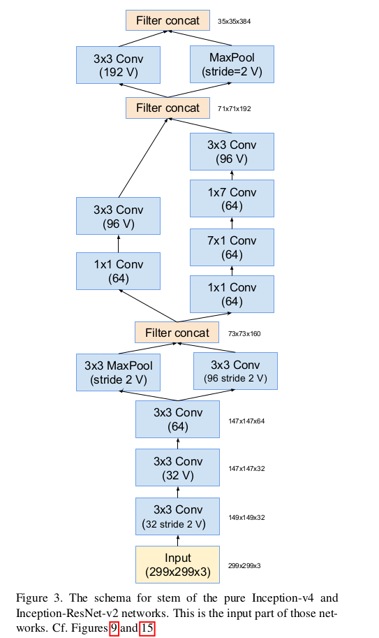     
    
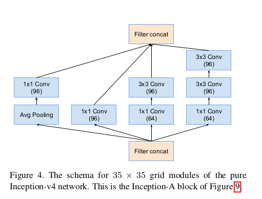   
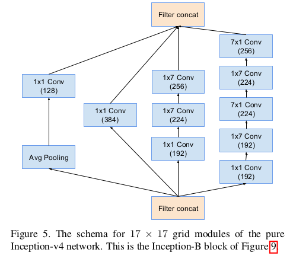    
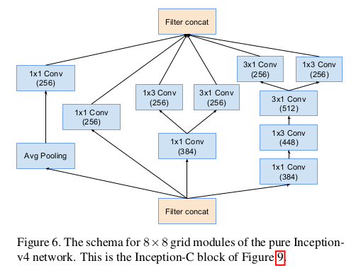   
   
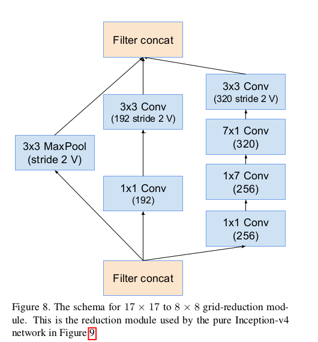

### 8.2.4 Inception-ResNet-V1
   

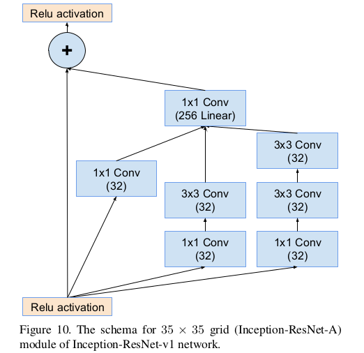    
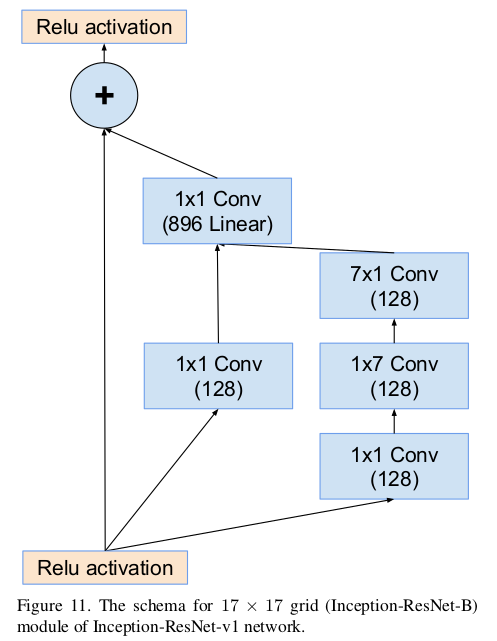    
    

### 8.2.5 Inception-ResNet-V2
与Inception-ResNet-V1相似的结构。   
    
    
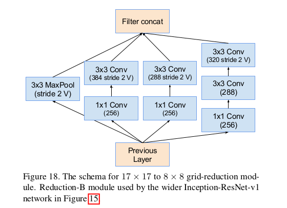   

    
### 8.2.6 Scaling of the Residuals
我们还发现，如果滤波器的数量超过1000，则残差变体开始表现出不稳定性，并且网络开始在早起训练中“死亡”，这意味着在成千上万次迭代后， 平均池化之前的最后一层开始仅产生零。无论是通过降低学习率还是通过向该层添加额外的批标准化，都无法避免这种情况。   
我们发现，在将残差添加到上一层激活之前缩小残差似乎可以稳定训练。通常，我们选择0.1到0.3之间的一些缩放因子来在残差被添加到累积层激活之前对其进行缩放（参见图20）。   
   

# 9 Identity Mappings in Deep Residual Networks
## 9.1 ResNet的回顾
深度残差网络（ResNets）由堆叠的“残差单元”组成。每个单元的表达式为：
$$y_l=h(x_l) + \cal{F}(x_l, \cal{W}_l)$$
$$x_{l+1} = f(y_l)$$
其中 $x_l$ 和 $x_{l+1}$ 是第l的单元的输入和输出，并且  $\cal{F}$ 是残差函数。在ResNet中 $h(x_l) = x_l$ 是恒等映射，$f$ 是ReLU函数。ResNet的核心是学习 $h(x_l)$ 对应的残差映射 $\cal{F}$ ，其关键在于使用恒等映射 $h(x_l) = x_l$。这位反向传播的信息创建了“direct”路径。   
我们的推导揭示了如果 $h(x_l)$ 和 $f(y_l)$ 都是恒等映射，则信号可以在前向和后向传递中从一个单元直接传播到任何其他单元。
  

## 9.2 Analysis of Deep Residual Networks
深度残差网络（ResNets）由堆叠的“残差单元”组成。每个单元的表达式为：
$$y_l=h(x_l) + \cal{F}(x_l, \cal{W}_l) \tag 1$$      
$$x_{l+1} = f(y_l) \tag 2$$
这里， $x_l$ 是第 $l$ 个残差单元的输入特征。 $\cal{W}_l = \lbrace W_{l,k} | {1 \le k \le K}\rbrace$ 是第 $l$ 个残差单元相关联的权重（和偏差）的集合， $K$ 是残差单元的层数（在原始的ResNet中 $K$ 为2或者3）。 $\cal{F}$ 表示残差函数。 $f$ 是逐元素相加后的操作，在原始ResNet中是ReLU。函数 $h$ 设置为恒等映射： $h(x_l) = x_l$ 。  
如果 $f$ 也是恒等映射: $x_{l+1} \equiv y_l$， 将式（2）带入式（1）得：
$$x_{l+1} = x_l + \cal{F}(x_l, W_l) \tag 3$$
递归地有 $x_{l+2} = x_{l+1} + \cal{F}(x_{l+1}, \cal{W}_{l+1})=x_l+\cal{F}(x_l, W_l) + F(x_{l+1}, W_{l+1})$ 等。有：
$$x_L = x_l + \sum_{i=l}^{L-1}\cal{F}(x_i, W_i) \tag 4$$
其中 $L$ 是任意深层单元， $l$ 是任意浅层单元。式（4）展示了一些很好的特性：（i）任意深单元 $L$ 的特征 $x_L$ 能够表示为任意浅单元 $l$ 的特征 $x_l$ 加上形式为 $sum_{i=1}^{L-1}\cal{F}$ 的残差函数，表明模型在任何单元L和l之间处于残差方式。（ii）任意深层单元 $L$ 的特征 $x_L = x_0 + \sum_{i=0}^{L-1}\cal{F}(x_i, W_i)$是所有先前残差函数的输出之和加 $x_0$。   
式（4）也产生了良好的反向传播特性。用 $\varepsilon$ 表示损失函数，跟反向传播的链式规则，有：
$$\frac{\partial \varepsilon}{\partial x_l} = \frac{\partial \varepsilon}{\partial x_L} \frac{\partial x_L}{\partial x_l} = \frac{\partial \varepsilon}{\partial{x_L}}\left(1 + \frac{\partial}{\partial x_l}\sum_{i=l}^{L-1}\cal{F}(x_i, W_i)\right) \tag 5$$   
式（5）表明梯度 $\frac{\partial \varepsilon}{\partial x_l}$ 可以分解为两项：  $\frac{\partial \varepsilon}{\partial{x_L}}$ 不考虑任何权重你层的情况下直接传播信息，而 $\frac{\partial \varepsilon}{\partial x_L}\left(\frac{\partial}{\partial x_l \sum_{i=1}^{L-1}} \cal{F}\right)$ 通过权重层传播。加法项 $\frac{\partial \varepsilon}{\partial{x_L}}$ 确保信息直接传播回任何较浅的单元 $l$。式（5）还表明，对于小批量，梯度 $\frac{\partial \varepsilon}{\partial{x_L}}$ 不太可能被抵消，因为对于小批量中的所有样本，通常 $\frac{\partial}{\partial x_l}\sum_{i=1}^{L-1}$ 不会总是-1。这意味着即使重量任意小，层的梯度也不会消失。   

## 9.3 On the Importance of  Identity Skip Connections
我们考虑一个简单的修改: $h(x_l) = \lambda_l x_l$，以破坏恒等的shortcut：
$$x_{l+1} = \lambda_l x_l + \cal{F}(x_l, W_l) \tag 6$$
其中 $\lambda_l$ 是调制标量（modulating scalar）（为简明起见，仍然假设 $f$ 是恒等映射）。递归地应用这一公式，得到与式（4）相似的公式：
$$x_L = \left(\prod_{i=1}^{L-1 \lambda_i}\right)x_l + \sum_{i=1}^{L-1}\left(\prod_{j=i+1}^{L-1}\lambda_j\right)\cal{F}(x_i, W_l)$$
或者简单地：
$$x_L = \left(\prod_{i=1}^{L-1 \lambda_i}\right)x_l + \sum_{i=1}^{L-1}\hat{\cal{F}}(x_i, W_l) \tag 7$$
其中其中符号 $\cal{F}$ 将标量吸收到剩余函数中。与市（5）相似，有如下形式的反向传播：
$$\frac{\partial \varepsilon}{\partial x_l} = \frac{\partial \varepsilon}{\partial x_L}\left((\prod_{i=1}^{L-1}\lambda_i) + \frac{\partial}{\partial x_l}\sum_{i=1}{L-1}\hat{\cal{F}}(x_i, \cal{W}_i)\right) \tag 8$$
从式（8）可知，当所有的 $\lambda_i \gt 1$时，$\prod_{i=1}^{L-1}\lambda_i$ 会呈指数级增大；如果所有的 $\lambda_i < 1$，呈指数级减小和消失，这阻止来自shortcut的反向传播信号并迫使其流过权重层。实验表明这样导致了优化困难。    
如果将skip连接替换为更复杂的变换（如 $1 \times 1$ 卷积），式（8）中的第一项变为 $\prod_{i=1}^{L-1}h_i'$，其中 $h'$ 是 $h$ 的导数。这样的乘积可能会阻碍信息的传播并妨碍训练过程。  

### 9.3.1 Experiments on Skip Connections
在CIFAR上运行5次，取5次结果的中位数，减少随机变体的影响。   
这一节中考虑 $f=ReLU$ 的情况。比较了图2和表1的变体   
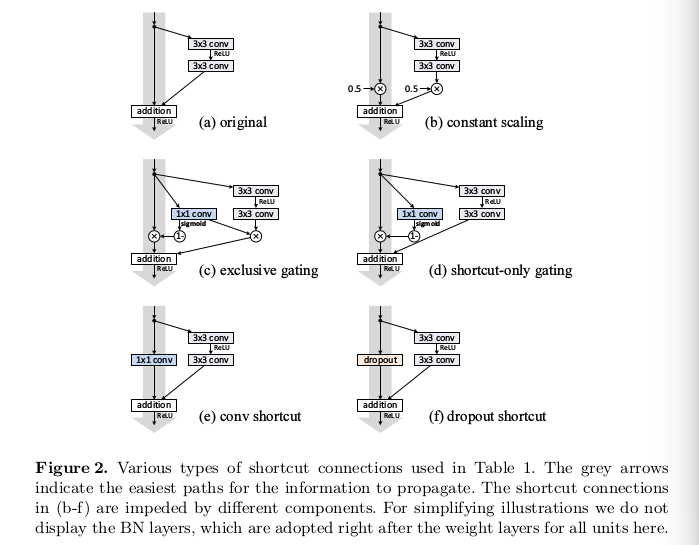   
  
*Constant scaling.* 在所有shortcut中设置 $\lambda = 0.5$ （如图2（b））。进一步研究了缩放 $\cal{F}$ 的两种情况：（i）$\cal{F}$ 没有缩放；（ii）$\cal{F}$ 被 $1 - \lambda = 0.5$ 的常量缩放，这与Highway门相似，但使用的是固定门。前者不能收敛；后者能够收敛，但是测试误差比原始的ResNet高得多。   
*Exclusive gating.* 遵循Highway Networks采用门限机制，门限函数为 $g(x) = \sigma(W_gx + b_g)$，其表示权重 $W_g$ 和偏差 $b_g$ 后跟一个sigmoid函数 $\sigma(x) = \frac{1}{1+e^{-x}}$。 卷积网络 $g(x)$ 使用 $1 \times 1$ 卷积层实现。门限函数通过逐元素乘法调整信号。   
我们研究了[6,7]中使用的“独占”门-- $\cal{F}$ 路径用 $g(x)$ 缩放，快捷路径用 $1-g(x)$ 缩放，如图2（c）。我们发现偏差 $b_g$ 的初始化对训练门限模型至关重要，我们初始化 $b_g$ 的值范围为0到-10，并且使用-1的递减步长。结果如表1。  
得到的结论： 当 $1 - g(x)$ 接近1时，门限shortcut连接更接近恒等映射，这有助于信息传播；但是当 $g(x)$ 趋近0并抑制函数 $\cal{F}$ 。为了单独在快捷方式路径上隔离门控功能的影响，我们将在下一步中研究一种非排他性的门控机制。  
*Shortcut-only gating.* 在这种情况下，函数 $\cal{F}$ 不被缩放；仅shortcut路径通过 $1-g(x)$ 门限，如图2（d）。当初始化的 $b_g$ 为0时（因此最初期望 $1-g(x)$ 为0.5），网络收敛到12.86％的错误的结果（表1）。当初始化的 $b_g$ 负偏置（例如，-6）时，$1-g(x)$ 的值更接近1并且快捷连接几乎是恒等映射。   
*$1 \times 1$ convolutional shortcut.* 使用$1 \times 1$ 的卷积替换恒等映射。这在34层的ResNet中表现良好。但是在有更多的残差单元的情况下，表现不佳。在110层的ResNet中有更差的结果（12.22%）。    
*Dropout shortcut.* 使用dropout（0.5）的恒等shortcut。网络不会收敛大一个较好的结果。Dropout在统计上强加了一个 $\lambda$ 的缩放，在快捷方式上的期望为0.5，并且类似于0.5的恒定缩放，它阻碍了信号传播。

### 9.3.2 Discussions
快捷方式上的乘法操作（缩放，门控，1×1卷积和丢失）可能妨碍信息传播并导致优化问题。

## 9.4 On the Usage of Activation Functions
  
### 9.4.1 Experiments on Activation
本节中，实验了ResNet-110和ResNet-164，使用 $1 \times 1$ 层（降维）、 $3 \times 3$层和  $1 \times 1$ 层（还原维度）。
*BN after addition.*  在将 $f$ 转换为恒等映射之前，我们采用相反的方式在加法后采用BN（图4（b））。 $f$ 包含BN和ReLU。结果比baseline 差。与原始设计不同，现在BN层改变通过快捷方式的信号阻碍了信息传播，这反映在训练开始时减少训练损失的困难（图6左）。   
*ReLU before addition.* 使 $f$ 成为身份映射的一个简单选择是移动ReLU到加法之前（图4（c））。然而，这导致变换 $\cal{F}$ 输出非负输出，然而，直观上要求“残差”函数的值应在 $(-\infty, +\infty)$。结果前向传播信号是单调递增的。这可能会影响表达能力，并且结果比baseline差（7.84%）。   
*Post-activation or pre-activation?* 在原始设计中（式（1）和式（2）），激活 $x_{l+1} = f(y_l)$ 会影响洗衣歌残差单元（$y_{l+1} = f(y_l) + \cal{F}(f(y_l), \cal{W}_{l+1})$）的两个路径。接下来，我们开发了非对称形式，其中激活 $\hat{f}$ 经影响 $\cal{F}$ 的路径： $y_{l+1} = y_l + \cal{F}(\hat{y_l}, W_{l+1})$（表5（a）到（b）），经过重新命名符号，有如下的形式：
$$x_{l+1} = x_l + \cal{F}(\hat{f}(x_l), W_l) \tag 9$$

很容易看出方程（9）类似于方程（4），并且可以启用类似于方程（5）的后向公式。 对于这个新的残差单元，如公式（9）所示，在新的加法后激活成为恒等映射。这种设计意味着如果不对称地采用新的加法后激活 $\hat{f}$ ，则相当于将 $\hat{f}$ 重新表示为下一个残余单元的预激活。   
激活后/预激活之间的区别是逐元素加法的存在引起的。对于具有N层的普通网络，存在N-1个激活（BN / ReLU），并且我们将它们视为后激活还是预激活并不重要。 但是对于通过加法合并的分支层，激活的位置很重要。   
我们实验了两种设计： (i) ReLU-only的预激活（图4（d）），（ii）全部预激活（图4（e）），即BN和ReLU都在权重层之前。（ii）获得最佳性能。

### 9.4.2 Analysis
预激活的影响有两点：（i）优化得到进一步缓解（与基线ResNet相比），因为 $f$ 是恒等映射。（ii）使用BN作为预激活提高了模型的正则化表现，减小过拟合。

# 10 ResNeXt: Aggregated Residual Transfomations for Deep Neural Networks  

## 10.1 Introduction
如VGG、ResNet的简单堆叠规则可以降低过度调整超参数到特定数据集的风险。与VGG网络不同，Inception模型系列[38,17,39,37]已经证明精心设计的拓扑结构能够以较低的理论复杂度实现引人注目的精度。Inception模型的一个重要特性是split-transform-merge（拆分-转换-合并）策略。
在Inception模块中，输入被 $1 \times 1$ 卷积划分成几个低维嵌入，通过特殊滤波器（$3 \times 3$、 $5 \times 5$ 等）集合转换，并通过concatenation合并。可以证明，该体系结构的解空间是在高维嵌入上操作的单个大层（例如，5×5）的解空间的严格子空间。预期Inception模块的分裂变换合并行为接近大而密集层的表示能力，但计算复杂度要低得多。   
尽管准确性很高，但是Inception模型的实现伴随着一系列复杂因素-过滤器数量和大小是针对每个单独的转换而定制的，并且模块是逐步定制的。虽然这些组件的仔细组合可以产生出色的神经网络，但一般不清楚如何使Inception架构适应新的数据集/任务，尤其是在需要许多因素和超参数设计时。   
本文以简单、可扩展的方式探索了split-transform-merge策略。本文的模块执行了一系列变换，每个变换都是一个低维嵌入——要聚合的变换都是相同的拓扑（例如，图1（右））。  
   
本文的模块一共三种，第一种如图1右边的图形。第二中如图3（b）与Inception-ResNet模块相似，它连接多个路径，但是我们的模块不同于所有已有的Inception模块之处是我们的所有模块共享一样的拓扑结构，并因此路径的数量能够简单地孤立为一个因素用以研究。第三种是如AlexNet的group结构，如图3（c）。   
我们的方法表明基数（cardinality）（变换集的大小）是一个具体的，可测量的维度，除了宽度和深度的维度之外，它是至关重要的。实验表明 _增加基数（cardinality）是比更深或更宽更加有效的获得准确率的方式_， 特别是当深度和宽度使现有模型起递减作用时。   
## 10.2 Related Work
- Multi-branch convolutional network. Inception模型是每个分支都仔细定义的成功的多分支结构。ResNet可以认为两分支网络，其中一个是恒等映射。Deep neural decision forests是具有学习分裂功能的树状模式的多分支网络。
- Grouped convolutions. Group卷积的使用追溯到AlexNet。AlexNet分组到两个GPU。组卷积的一个特例是channel-wise卷积，其组的数量等于通道数量。
- Compressing convolutional networks.分解（在空间[6,18]和/或通道[6,21,16]水平）是广泛采用的技术，以减少深度卷积网络的冗余并加速/压缩它们。Ioannou等提出了一种用于减少计算的“根”模式网络，并且根中的分支通过分组卷积来实现。这些方法显示了精度的优雅折衷，具有较低的复杂性和较小的模型尺寸。我们的方法不是压缩，而是一种经验上表现出更强表示能力的架构。
- Ensembling. 平均独立训练网络的集合是在识别竞赛中，提高准确率的一种有效的、广泛采用的解决方案。Veit等人[40]将单个ResNet解释为较浅网络的集合，这是由ResNet的加法行为[15]产生的。我们的方法利用加法来聚合一组变换。但是我么认为将我们的方法视为集成不准确的，因为聚合的成员是联合训练的，而非独立训练的。   

## 10.3 Method
### 10.3.1 Template
我们采用遵循VGG/ResNet的高度模块化设计。我们的网络有残差块的堆叠组成。这些块有相同的拓扑结构，并且主要有受VGG/ResNet启发的两种简单规则：（i）如果产生相同大小的空间映射，所以这些块共享相同的超参数（宽和滤波器大小）；（ii）当每次空间图以因子为2进行下采样时，这些块的宽度乘以因子2。第二条规则确保计算复杂度，FLOPs（floating-point operations，multiply-adds的数量）项对于所有的块都大致相同。   
使用这两条规则，我们仅需要设计一个 $template$ 模块，并且网络中所有模块能够立即确定。所以，这两条规则极大地减小了设计空间，并允许我们关注一些关键因素。网络结构如表1。
  
### 10.3.2 Revisiting Simple Neurons
最简单的人工神经网络执行内积（权重和），这是全连接和卷积层最基本的变换。内积可以被认为是一种形式的聚合变换:
$$\sum_{i=1}^{D} w_ix_i \tag 1$$
其中 $x = [x_1, x_2, ..., x_D]$ 是神经元的D通道输入向量，并且 $w_i$ 是第i个通道的滤波器权重。该操作（通常包括一些输出非线性）被称为“神经元”，见图2。  
  
上述操作可以重新组合为拆分，转换和聚合（splitting、transforming和aggregating）的组合。（i）拆分：向量x被切分成低维嵌入，并且在上面，它是一个单维子空间 $x_i$ 。（ii）Transforming：低维表征被变化，在上面，它是简单的缩放： $w_ix_i$。（iii）Aggregating： 所有嵌入中的变换被聚合为 $\sum_{i=1}^{D}$。
### 10.3.3 Aggregated Transformations
通过上述简单神经云的分析，我们考虑将基本变换 $(w_ix_i)$ 替换为一个更一般的函数，其本身也可以是一个网络。与“Networks-in-Network”相比，结果证明我们的“Network-in-Neuron”在一个新的维度上扩展。   
形式上，我们表示聚合变换为:
$$\cal{F}(x) = \sum_{i=1}^{C}\cal{T}_i(x) \tag 2$$
其中 $\cal{T}_i$ 是任意函数。模拟一个简单的神经元， $T_i$ 可以将 $x$ 映射到一个（可选低维的）嵌入，并变换它。  
在式（2）中， $C$是用于聚合的变换集合的大小。我们称 $C$ 为基数（cardinality）。在式（2）中 $C$ 与式（1）中 $D$在位置上相似。然而宽度维度与简单变换（内积）的数量相关，我们认为基的维度控制更复杂变换的数量。我们通过实验证明，基是一个至关重要的维度，并且比宽度和深度维度更加有效。   
本文中，我们考虑设计变换函数的一种简单方式： 所有的 $T_i$ 有相同的拓扑结构。这扩展了重复相同形状图层的VGG式策略，这有助于隔离一些因素并扩展到任何大量的转换。我们将单个变换 $T_i$ 设置为瓶颈形状的架构[14]，如图1（右）所示。本例中，在每个 $T_i$ 中的第一个 $1 \times 1$层产生一个低维嵌入。   
式（2）中聚合变换变换用作残差函数[14]（图1右）：
$$y = x + \sum_{i=1}^{C}T_i(x) \tag 3$$
其中 $y$ 是输出。   
- Relation to Inception-ResNet. 一些张量操作表明图1（右）中的模块（也如图3（a）所示）等同于图3（b）。
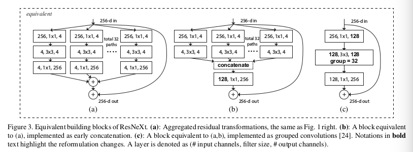  
图3（b）看起来类似于Inception-ResNet [37]块，因为它涉及残差函数中的分支和连接。但是与Inception或Inception-ResNet模块不同，我们在多路径之间共享相同的拓扑。我们的模块在设计每个路径时，要求最小的额外工作。  
- Relation to Grouped Convolutions. 使用分组卷积的符号[24]，上述模块变得更加简洁。这种形式如图3（c）所示。所有的低维嵌入（第一个 $1 \times 1$层）可以被替换为一个单一的、更宽的层（例如 图3（c）中的$1 \times 1, 128-d$）。当分组卷积层将其输入通道分成组时，拆分基本上由分组卷积层完成。图3（c）中的分组卷积层值32组的卷积，它的输入和输出通道都是4维。分组卷积层联结它们作为这一层的输出。图3（c）中的块与原始瓶颈残差块相似，除了图3（c）是一个更宽且稀疏连接的模块。   
我们注意到，只有当块的深度≥3时，重构才会产生非平凡的拓扑。如果块具有深度= 2（例如，[14]中的基本块），则重新构造导致宽的密集模，见图4中的插图。   

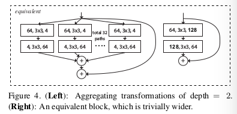  

我们注意到虽然我们提出了表示连接（图3（b））或分组卷积（图3（c））的重构，但这种重构并不总是适用于方程（3）的一般形式，例如，如果转换 $T_i$ 采用任意形式并且是异质的。   

### 10.3.4 Model Capacity
调整基 $C$ 是根据最小化超参数的修改。我们选择调整瓶颈的宽度（如图1（右）），这是因为瓶颈可以从块的输入和输出中孤立出来。这种策略不会引入其他超参数（深度或者块的输入/输出宽度）的改变，因此它有利于我们关注基的影响。    
在图1（左）中，原始的ResNet瓶颈块有 $256 \cdot 64 + 3 \cdot 3 \cdot 64 \cdot 64 + 64 \cdot 256 \approx 70k$ 参数和成比例的FLOP（在相同大小的特征图上）。有瓶颈宽度 $d$ ，图1（右）的模板有：
$$C \cdot (256 \cdot d + 3 \cdot 3 \cdot d \cdot d + d \cdot 256) \tag 4$$
参数和成比例的FLOP。当 $C=32$、$d = 4$时， $式(4) \approx 70k$。表2给出了基 $C$ 和瓶颈宽度 $d$ 的关系。

## 10.4 Implementation details
本文的模型实现了图3（c）的形式。我们在图3（c）中的卷积之后立即执行批量归一化（BN）[17]。处理块的输出之外，ReLU在每个BN后执行，其中块的输出中ReLU在与shortcut相加之后执行。当BN和ReLU按上述方式处理时，图3的三种形式是严格等价的。我们训练了三种形式的网络，并获得相同的结果，而图3（c）更简洁、更快速。

## 10.5 Experiments
### 10.5.1 Experiments on ImageNet-1K
- Cardinality vs. Width. (保持复杂度)
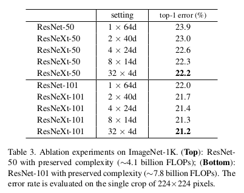   
- Increasing Cardinality vs. Deeper/Wider. 通过增加基 $C$ 或者增加深度或宽度来增加复杂度。以下比较也可以参考ResNet-101基线的2×FLOP来查看。我们比较了以下具有约150亿FLOP的变体。（i）Going deeper 到200层，使用了ResNet-200。（ii）Going wider 通过增加瓶颈宽度实现。（iii）Increasing cardinality 翻倍 $C$ 。
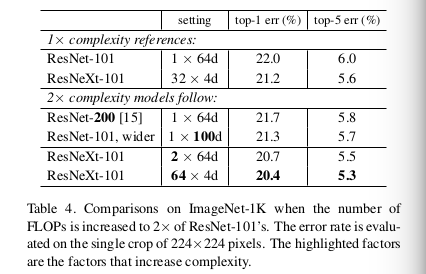

# 11 Dilated Residual Networks
## 11.1 问题
卷积神经网络的特征分辨逐渐减小（至典型的 $7 \times 7$），这样空间敏锐度（acuity）的消除会阻碍准确率的进一步提升，例如例如通过保留可能对正确理解图像很重要的小和薄物体的贡献。这样的保留可能对于手写数字识别不重要，因为其单个对象占据了图像的主导位置，但是可能有助于多个对象的复杂自然场景的分析和对象间必须考虑的相对配置。   
另外，图像分类通常作为预训练模型迁移到其他包含详细场景理解的应用（如检测、分割等），空间敏锐度的损失会显著影响这些任务。   
综上所述，有问题：卷积网络必须粉碎图像才能对其分类吗？本文从ResNet开始，通过使用dilation替换中间子采样层来增加网络输出的分辨率。本文在不增加深度或模型复杂度的情况下，在ImageNet上获得了更高的准确率。

## 11.2 Dilated Residual Networks
本文的关键思想是保持用于分类的卷积神经网的空间分辨率。空间细节的丢失，对分类自然图像有害，并且显著妨碍模型迁移到包含空间细节图像理解的任务。当关键对象在空间上不占优势时，例如，当标记的对象很薄（例如，三脚架）时或者当存在诸如山的大背景对象时，分类任务变得困难。这些案例中，背景相应会抑制来自感兴趣对象的信号。更糟糕的是，如果对象信号在将采样中完全丢失，就没有希望在训练中恢复。但是，如果我们在整个模型中保持高空间分辨率并提供密集覆盖输入域的输出信号，则反向传播可以学习保留较小和较不显着对象的重要信息。    
原始的ResNet包含5组卷积层，每组的第一层执行下采样，即：卷积滤波器仅在偶数行和列处进行评估。使用 $\cal{G}^l, l = 1, ..., 5$。组 $l$ 第 $i$ 层表示为 $\cal{G}_i^l$。为了简化说明，考虑一个理想化的模型，其中每个层由单个特征映射组成：多个特征映射的扩展是直截了当的。令 $f_i^l$ 是与 $\cal{G}_i^l$ 对应的滤波器。在原始ResNet中， $\cal{G}_i^l$ 的输出为
$$(\cal{G}_i^l * f_i^l) = \sum_{a+b=p}\cal{G}_i^l(a)f_i^l(b)  \tag 1$$
其中 $p$ 是 $\cal{G}_i^l$ 中的特征图。    
直接移除下采样层会减小相应层的感受野，如果直接去除2个下采样层，空间分辨率会增加4倍，但是感受相应减少了4倍。由于纹理信息的重要性，这样朴素的方法是不值得的。因此，使用了dilated卷积，增加分辨率的同时，增加更高层的感受野，这足以填补应去除下采样层造成的感受野减小。    
本文关注的是最后两个组的卷积层： $\cal{G}^4$ 和 $\cal{G}^5$ 。原始的ResNet中，在每个组的第一层（$\cal{G}_1^4$ 和 $\cal{G}_1^5$）使用步长： 卷积仅在偶数行和列进行。DRN（dilated residual networks）首先删除 $\cal{G}_1^4$ 和 $\cal{G}_1^5$ 的步长操作，这仅翻倍了输出的分辨率，但在 $\cal{G}^4$ 不影响感受野。不过 $\cal{G}^4$ 之后层的感受野收到影响。因此在这些层中都使用2-dilated卷积：
$$(\cal{G}_i^4 \ast_2 f_i^4) = \sum_{a+2b=p}\cal{G}_i^4(a)f_i^4(b)  \tag 2$$
其中 $i \ge 2$。相同的变换被用于 $\cal{G}_1^5$：
$$(\cal{G}_1^5 \ast_2 f_1^5) = \sum_{a+2b=p}\cal{G}_1^5(a)f_1^5(b)  \tag 3$$
$\cal{G}_5$ 中的后续层遵循已消除的两个跨步层。但是使用膨胀率4的卷积来填补损失的感受野：
$$(\cal{G}_i^5 \ast_4 f_i^5) = \sum_{a+4b=p}\cal{G}_i^5(a)f_i^5(b)  \tag 4$$
其中 $i \ge 2$。最后 $\cal{G}^5$ 之后跟一个全局平均池化，以及1×1卷积，将该向量映射到包含所有类的预测分数的向量。如表1.
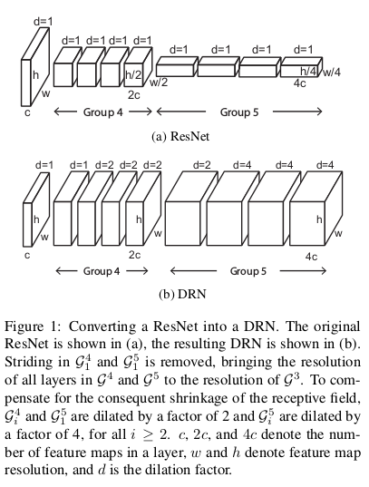    

## 11.3 Degridding
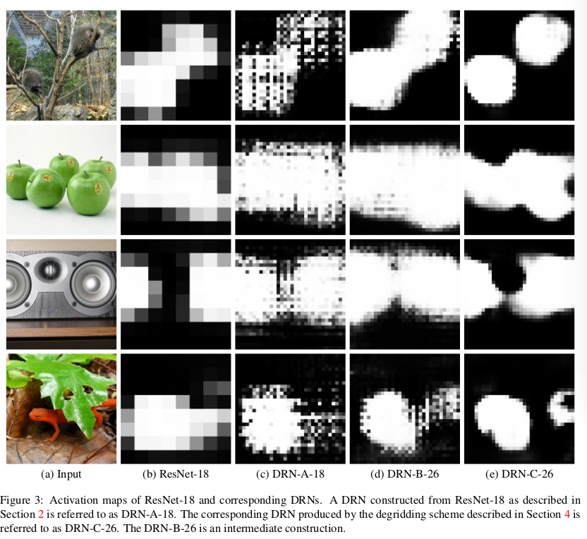
使用膨胀卷积会引起gridding artifacts。这种artifacts如图3（c）。当特征图具有比膨胀卷积的采样率更高的频率内容时，发生网格伪像（gridding artifact）。图4是一个教学示例。图4（a）中，输入特征图有单一的激活像素。2-膨胀卷积（图4（b））导致了在输出中产生相应的网格图案（图4（c））。
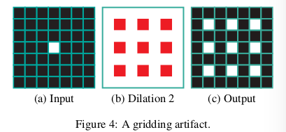   

   
- Removing max pooling. 新的dilated卷积如上图所示。（a）（称为DRN-A）继承了ResNet的结构，我们发现它的最大池化操作会导致高幅度高频激活，如图6（b）所示。这种高频激活可以传播到后面的层并最终加剧网格伪像。因此，使用卷积层替换最大池化层，得到图5（b）的结构。变换的影响如图6（c）.
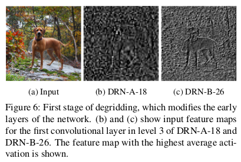  
- Adding layers. 为了消除网格伪像，我们在网络末端添加卷积层，逐渐降低膨胀。具体而言，在DRN-A（图5（a））中的最后4-膨胀层之后，我们添加2-膨胀的残差块，然后是1-膨胀块。
- Removing residual connections. 添加更多层后，由于残差连接的影响，并没有完整消除artifact。为了有效的去除gridding artifacts，删除7和8 level的残差连接。

# 12 Deep Networks width Stochastic Depth

## 12.1 Introduction
许多深度网络面临三个问题： 在反向传播时发生梯度消失，在前向传播时减小特征重用，以及长时间训练。  
- *Vanishing Gradients* 是包含许多层的神经网络的著名的累赘。随着梯度信息的反向传播，重复的乘法或小权重的卷积使得梯度信息在较早的层中无效地变小。几种已存在的方法可以减小这种影响，例如仔细的初始化、隐藏层监督或批归一化。
- *Diminishing feature reuse* 是指在前向过程中类似梯度消失的问题。输入实例的特征或由早期层计算的特征通过与（随机初始化的）权重矩阵的重复乘法或卷积而“消失”，使得后面的层难以识别和学习“有意义的”梯度方向。
- *Long training time* 随着网络的加深，长时间训练是一个严重的问题。

研究人员面临这一个固有的困境： 更短的网络有利于前向和后巷过程信息的高效流动，并且因此能够有效地训练以及合理的训练时间。然而，它的表现力不足以表示计算机视觉应用中常见的复杂概念。非常深的网络有更多的模型复杂度，但是很难训练并且要求更多的 时间和耐心。   
本文观察随机深度从实质上减少了训练时间和测试误差。训练时间的减少归功于更短的前向和后向传播，所以训练时间不再随着整个深度而缩放，而是网络的预期深度（expected depth）更短。作者认为误差的减小有两个因素：1）在训练期间缩短（预期）深度减少了前向传播步骤和梯度计算的链，这增强了向后传播期间的早期层中的梯度； 2）随机深度网络的训练可以被解释为一种不同深度网络的隐式集成（ensemble）。   
同时随机深度训练也可作为一张正则化，即便存在批归一化。  
随机深度与dropout不同，dropout是使网络更薄，而随机深度是使网络更短。有趣的是，当使用Batch Normalization时，dropout将丧失有效性。本文使用CIFAR-10数据实验了不同dropout率，表明当在110层的ResNet上使用batch normalization时，dropout不再改善网络。

## 12.2 Deep Networks with Stochastic Depth
为了在训练期间减少神经网络的有效长度，我们完全随机跳过层。我们通过以与ResNets相同的方式引入跳过连接来实现这一点，但是每个小批量的连接模式是随机改变的。对于每个mini-batch，随机地选择一系列层，并移除它们相应的变换函数，仅保留恒等skip连接。整个过程中，使用ResNet框架。    
_随机深度_ 在训练期间缩小网络深度，同时在测试期间保持不变。通过在训练期间随机丢弃整个ResBlock，并使用skip connections来传递它们的变换。令 $b_\cal{l} \in {0, 1}$ 表示伯努利随机变量，这表明地 $\cal{l}$ 个ResBlock是处理激活（$b_{\cal{l}} = 1$），还是未激活（$b_{\cal{l}} = 0$）。进一步，令ResBlock $\cal{l}$ “存活（survival）”的概率为 $p_{\cal{l}} = Pr(b_{\cal{l}} = 1)$.    
现在，通过函数 $f_{\cal{l}}$ 与 $b_{\cal{l}}$ 的乘积来传递第 $\cal{l}$ 个ResBlock，因此，可得：
$$H_{\cal{l}} = ReLU(b_{\cal{l}}f_l(H_{l-1}) + id(H_{l-1})) \tag 2$$
如果 $b_l = 1$，则式（2）与原始ResNet相同。如果 $b_l = 0$，ResBlock减小为恒等映射：
$$H_l = id(H_{l-1}) \tag 3$$
这种减少源于输入 $H_{l-1}$ 总是非负的这一事实，至少对于我们使用的架构而言。 这是由于前面层的ReLU函数始终是非负的。  

_存活概率（The survival probabilities）_ $p_l$ 是本文训练过程的一个新的超参数。直观上，相邻ResBlock之间应该是相似的值。一种选择是通过设置所有 $l$ 均匀分布的 $p_l = P_L$ 来获得单一的超参数 $p_L$ 。另一种是根据 $l$ 的平滑函数来设置。提出了一个简单的线性衰减规则，从输入 $p_0 = 1$ 到最后一个ResBlock的 $p_L$ ：
$$p_l = 1 - \frac{l}{L}(1 - p_L) \tag 4$$
如图2，线性衰减的存活概率源于我们的直觉，即早期的层提取将被后期层使用的低级特征，因此应该更可靠地存在。 经过实验设置 $p_L = 0.5$。

_期望网络深度（Expected network depth）。_ 在forward-backward传递期间，以概率 $(1-p_l)$ 来绕过变化 $f_l$， 这产生了具有深度减小的网络。使用随机深度，训练期间，有效的ResBlock的数量（$\widetilde{L}$）成为了一个随机变量。它的期望为： $E(\widetilde{L}) = \sum_{l=1}^Lp_l$。   
以 $p_L = 0.5$ 的线性衰减规则下，在训练期间，ResBlock的期望数量减小到 $E(\widetilde{L}) = (3L - 1) / 4$ ，或者当 $L$ 足够大时，$E(\widetilde{L}) \approx 3L / 4$  。对于本文实验中使用的 $L=54$ 的110层网络，$E(\widetilde{L}) \approx 40$ 。换句话说，训练平均数量为40的ResBlock，而在测试期间恢复。

_训练时间节约。_ 当针对特定迭代绕过ResBlock时，不需要执行前向-后向计算或梯度更新。由于前后-后向计算在总的训练时间中占据主导地位，随机深度显著加速训练过程。在上面的计算之后，可以在线性衰减规则下节约大约25％的训练时间，其中 $p_L = 0.5$ 。通过切换到 $p_l$ 的均匀概率或相应地降低 $p_L$，可以获得更多的计算节省。   

_隐式模型集成。_ 除了预测到的加速外，还观察到明显的更低的测试误差。$L$ 层网络的每一层要么激活，要么未激活，结果产生 $2^L$ 种可能的网络组合。每一mini-batch训练 $2^L$ 个网络中的一个。在测试时，所有网络被平均了。

_测试期间的随机深度。_ 这只需对网络进行很小的修改。我们在整个测试过程中保持所有功能都处于活动状态，以便利用具有所有模型容量的全长（full-length）网络。然而，在训练期间，函数 $f_l$ 仅以所有更新中的 $p_l$ 比例激活。因此，需要通过 $f_l$ 参与训练的次数的期望值来重新调整 $f_l$ 的输出。前向传播更新规则变为：
$$ H_l^{Test} = ReLU(p_l f_l(H_{l-1}^{Test}; W_l) + H_{l-1}^{Test}) \tag 5$$
从模型集成的角度来看，更新规则（5）可以被解释为将所有可能的网络组合成单个测试体系结构，其中每个层由其生存概率加权。

## 12.3 Results
设置 $p_l$ 为 $p_0 = 1$ 和 $p_L=0.5$ 的线性衰减规则。使用ResNet的网络构建方案。

- 误差结果：

- 训练时间比较：

- Training with a 1202-layer ResNet:

- Improved gradient strength:

- Hyper-parameter sensitivity:
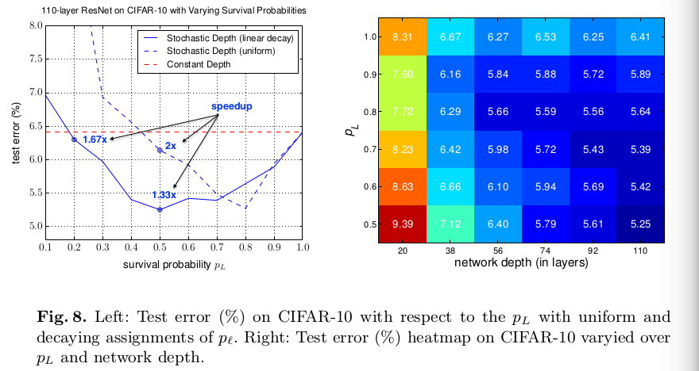
比较了固定存活概率和线性衰减的存活概率，有：
  - 当 $p_L$ 设置合理时，两种规则都产生了更好的结果。
  - 线性衰减规则始终优于均匀规则;
  - 线性衰减规则对 $p_L$ 的波动相对稳健，并且当 $p_L$ 在0.4到0.8的范围内时获得竞争结果; - 即使存活率相当小，例如 $p_L = 0.2$ ，线性衰减的随机深度仍然表现良好，同时训练时间缩短40％。

# 13 Wide Residual Networks
## 13.1 Introduction
训练深度网络面临几个难题：梯度爆炸/消失和衰退（degradation）。因此采用不同技术来训练网络，包括精心设计的初始化策略、更好的优化器、skip连接、知识迁移以及逐层训练。  
ResNet的泛化能力比Inception更好，因此ResNet可以更有效地进行迁移学习。残差连接又能加速网络收敛。ResNet和Highway Networks最大的区别是，后者的残差连接是门控的并且这些门控的权重通过学习得到。   
因此，当前残差网络的研究主要集中在ResNet块中激活的顺序和残差网络的深度上。本文尝试超出这两点的研究。目标是探索更丰富的ResNet块网络体系结构，并彻底检查除激活顺序之外的其他几个不同方面如何影响性能。如下：
- Width vs depth in residual networks. 许多文献表明浅层网络可能比深层网络需要更多的指数级组件。因此，ResNet的作者试图使它们尽可能地薄，有利于增加其深度和更少的参数，甚至引入了一个“瓶颈”块，使ResNet块更薄。    
然而，我们注意到，具有允许训练非常深的网络的恒等映射的残差块同时是残差网络的弱点。当梯度流过网络时，没有什么可以强制它通过残差块权重，并且它可以避免在训练期间学习任何东西，因此可能只有少数几个块可以学习有用的表示，或者很多块共享很少的对最终目标贡献微乎其微的信息。_这个问题就是特征重用问题。_ [14]的作者试图通过在训练期间随机禁用残差块来解决这个问题。这可以视为dropout的一个特例，其中每个残差块有一个恒定的用于dropout的标量权重。这一方法有效地证明了特征重用问题的假设。  
本文的尝试回答深度残差网络可以有多宽以及处理训练问题。本文证明了相对与增加网络深度，是比加宽网络更加有效的提升性能的方式。本文提出的wider deep residual networks相对于[13]的网络，减少了50倍的参数，并且比它快了两倍。16层的wide residual networks获得了与1000层ResNet相同的准确率以及相当的参数量，但是训练快了几倍。
- Use of dropout in ResNet blocks. 本文中，随着残余块的扩大导致参数数量的增加，我们研究了dropout对规范训练的影响并防止过拟合。在[13]中将dropout插入到恒等映射，表明对结果产生负影响。但在Wide Residual Networks中获得了持续增益。  

本文的贡献如下：
- 提出了残差网络架构的详细实验研究，彻底检查了ResNet块结构的几个重要方面。
- 为ResNet块提出了一种新颖的扩展架构，允许残差网络具有显着改进的性能。
- 提出了一种在深度残差网络中使用dropout的新方法，以便在训练期间适当地规范它们并防止过度拟合。
- 展示了我们提出的ResNet架构在几个数据集上实现了最先进的结果，大大提高了残差网络的准确性和速度。

## 13.2 Wide residual networks
具有恒等映射的残差块可表示为如下的形式：
$$x_{l+1} = x_l + \cal{F}(x_l, W_l) \tag 1$$
其中 $x_{l+1}$ 和 $x_l$ 是网络中第 $l$ 个单元的输出和输入， $\cal{F}$ 是残差函数， $\cal{W}_l$ 是块的参数。原始残差网络和pre-activation的残差网络最大的区别是批归一化、激活和卷积的顺序。本文仅考虑增加宽度以及使用“bottleneck”对更薄网络的影响。    
基本上有三种简单的方法来增加残差块的表示能力：
- 在每个块中添加更多的卷积层；
- 通过添加更多的特征平面来加宽卷积层;
- 在卷积层中扩大滤波器的大小。

因为小滤波器十分有效，所以不考虑大于 $3 \times 3$ 的滤波器。让我们还介绍两个因素，加深因子 $l$ 和加宽因子 $k$ ，其中 $l$ 是块中的卷积数，$k$ 是卷积层中特征的数量，因此基线«basic»块对应于 $l = 2，k = 1$ 。图1（a）和1（c）分别显示了basic和“basic-wide”块的示意图。   
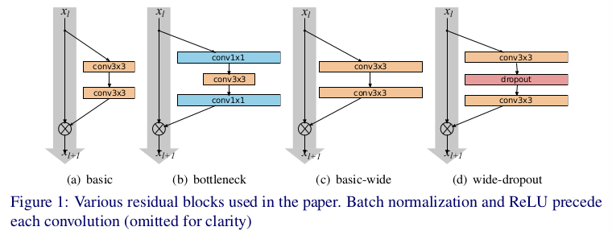   

  
Wide Residual Networks的一般结构如表1：最初的卷积层 $conv1$ ，其后跟这3组（每组大小为 $N$）残差块 $conv2$、$conv3$ 和 $conv4$ ，再跟一个平均池化和最终的分类层。 $conv1$ 的大小在实验中是固定的，同时引入加宽因子 $k$ 缩放残差块的宽度。   

### 13.2.1 Type of convolutions in residual block
令 $B(M)$ 表示残差块结构，其中 $M$ 是具有块中卷积层的核大小的列表。例如： $B(3, 1)$ 表示 $3 \times 3$ 和 $1 \times 1$ 卷积层（总是使用正方形空间核）。并不考虑“bottleneck”，块中的特征平面数量始终相同。我们想回答一个问题：“basic”残差结构的每个3×3卷积层有多重要，以及它们是否可以用计算量较小的1×1层或甚至1×1和3×3的组合，例如 $B(1,3)$ 或 $B(1,3)$ 。这可以增加或减少块的表示能力。 因此，我们尝试以下组合（注意，最后一个组合，即 $B(3,1,1)$ 类似于有效的Network-in-Networks[20]架构）：  
1. $B(3, 3)$ -- 原始的 “basic” 块；
2. $B(3, 1, 3)$ -- 一个额外的 $1 \times 1$ 层；
3. $B(1, 3, 1)$ -- 所有卷积中有相同的维度，“straighted”瓶颈；
4. $B(1, 3)$ - 网络没处都是交替的 $1 \times 1$ - $3 \times 3$ 卷积；
5. $B(3, 1)$ - 与上一个块相似的思想（$3 \times 3$ - $1 \times 1$ 交替）；
6. $B(3, 1, 1)$ - Network-in-Network风格的块。

### 13.2.2 Number of convolutional layers per residual block   
本文也实验了块加深因子 $l$ ， 从而观察它是如何影响性能的。在相同的参数量的情况下，比较了这些网络。在这种案例下，需要构建不同 $l$ 和 $d$ （d表示块的总数）的网络，同时确保网络的复杂度保持大致相同。这意味着，当 $l$ 增加时， $d$ 应该减小。

### 13.2.3 Width of residual blocks
本文也实验了块的加宽因子 $k$ 。虽然参数的数量随着 $l$（加深因子）和 $d$ （ResNet块的数量）线性增加，但参数的数量和计算复杂度是 $k$ 的二次方。然而，加深层宽度比成千上万小核在计算上更加高效，因为GPU在大张量上并行计算更加高效，所以我们对最佳 $d$ 到 $k$ 比率感兴趣。   
称 $k=1$ 的原始残差网络为“thin”，并称 $k > 1$ 的网络为“wide”。 WRN-n-k表示卷积层数为 $n$ ， 加宽因子为 $k$ 的残差网络（例如，40层，并且比原始残差网络宽 $k=2$ 倍的网络称为WRN-40-2）。

### 13.2.4 Dropout in residual blocks
由于加宽增加网络参数量，所以需要研究正则化的方式。剩余网络已经具有提供正则化效果的批量标准化，但是它需要大量数据增强，我们希望避免这种情况，并且它并不总是可行的。我们在残差块的两个卷积之间添加了dropout层（如图1（d）所示），dropout层在ReLU之后扰乱下一个残差块中的批量归一化并防止其过拟合。在非常深的残差网络中，应该有助于处理在不同残差块中强制学习的逐渐减少的特征重用问题。

## 13.3 Experiments results
- Type of convolutions in a  block.
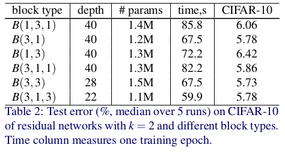   
- Number of convolutions per block
   
  
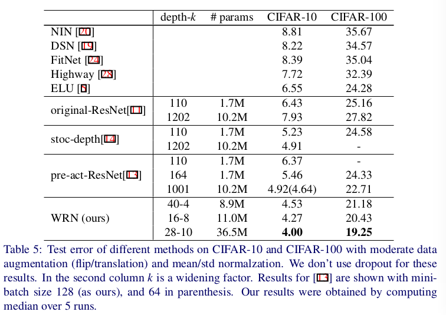   
总结：
  - 同时增加深度和宽度使得参数量变得非常高并且需要更强的正则化;
  - 由于具有与薄网络参数相同数量的参数的宽网络可以学习相同或更好的表示，因此在残差网络中似乎没有来自非常大深度的正则化效果。  
  - 此外，宽网络可以成功学习是薄网络2倍或更多倍的参数，这要求加倍薄网络的深度，使得它们训练的成本不高。

- Dropout in residual blocks. 使用交叉验证获得dropout的概率值，CIFAR为0.3， SVHN为0.4.

### 13.3.1 ImageNet and COCO Experiments

### 13.3.2 Computational efficiency
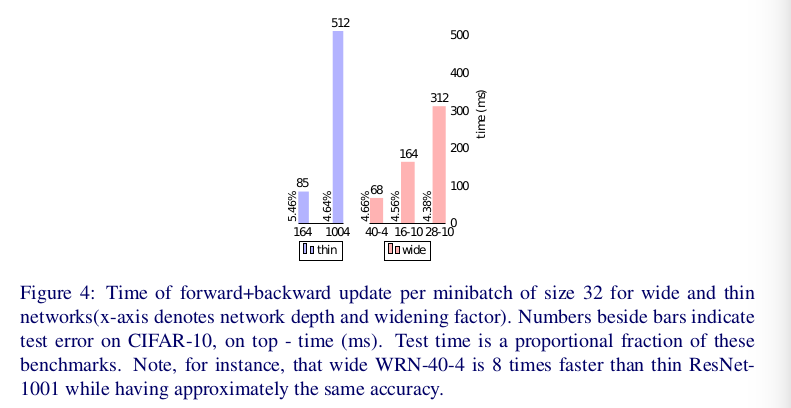

# 14 Densely Connected Convolutional Networks
## 14.1 Introduction
随着CNN变得越来越深，新的研究问题出现： 随着有关输入或梯度的信息通过许多层，它可能在到达网络结束（或开始）时出现消失和“清除（wash out）”的现象。ResNet、Highway Networks、Stochastic depth ResNet、FractalNet等解决上述问题的共同之处： 创建了从早期层到后期层的短路径（short path）。  

本文一种简单的连接模式确保了网络层之间最大信息流动，将所有层（有相同特征图尺寸）直接与其他层连接。为了保持前馈的自然，每一层获得来自前面层的额外输入，并且将它们自己的特征图传递给其所有的后续层，如图1。与ResNet不同，DenseNet在传入层之前不是使用加法，而是通过拼接（concatenating）组合特征。因此，第 $l$ 层有 $l$ 个输入，该输入包含该卷积块中所有前面层的输出。它自己的特征图被传入其后续的 $L - l$ 层。这在 $L$ 层网络中引入了 $\frac{L(L + 1)}{2}$ 个连接，而传统网络架构中仅有 $L$ 个连接。

   

这种密集连接模式的可能反直觉效果是它需要比传统卷积网络更少的参数，因为不需要重新学习冗余特征映射。传统的前馈体系结构可以被视为具有状态的算法，该状态在层与层之间传递。每个层从其前面层读取状态并写入后续层。 它改变了状态，但也传递了需要保留的信息。ResNets使通过加上恒等变换来保留信息。也有认为ResNet的许多层的贡献是非常小的，因此在训练期间可以随机地丢弃。本文提出的DenseNet架构明确区分了添加到网络的信息和保留的信息。DenseNet的层非常窄（例如每层12个滤波器）只为网络的“集体知识”添加一小组特征图，并保持其余的特征图不变--最终的分类器根据网络中的所有特征图作出决策。    

除了更好的参数效率，一个重大的好处是，DenseNet改善了整个网络的信息和梯度的流动，这使得它更容易训练。每一层都可以直接访问损失函数和原始输入信号的梯度，从而导致隐式的深度监督[20]。  

更进一步，密集连接还有正则化效果，它在小数据集上减小了过拟合。   

## 14.2 DenseNets
DenseNets通过 _特征重用_ 利用网络的潜力，产生易于训练和高参数效率的压缩模型。拼接不同层学习的特征图增加了后续层输入的变化并提高效率。与Inception（也使用拼接）相比，DenseNets更加简单和有效。     

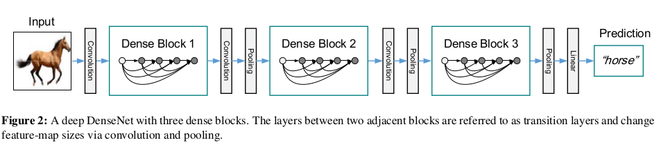

考虑通过卷积网络传递的单个图像 $x_0$ 。网络包含 $L$ 层，每层实现一个非线性变换 $H_l(\cdot)$ ，其中 $l$ 索引该层。 $H_l(\cdot)$ 包含例如Batch Normalization、ReLU、Pooling或者卷积层的符合函数。用 $x_l$ 表示第 $l$ 层的输出。   

**ResNets.**  传统的卷积前馈网络将第 $l$ 层的输出作为第 $l+1$ 层输入，这产生以下层的变换： $x_l = H_l(x_{l-1})$。ResNets将恒等函数作为skip-connection绕过了非线性变换：
$$x_l = H_l(x_{l-1} + x_{l-1}) \tag 1$$
ResNets的一个优势是梯度可以从后面层直接流向更前的层。然而，恒等函数和 $H_l$ 输出的和阻碍了网络中信息的流动。

**Dense connectivity.** 为了进一步提升层之间的信息流动，本文提出了一种不同的连接模式： 引入从任意层到其后续层的直接连接。即， $l$ 层接受所有前面层的特征图 $x_1, ..., x_{l-1}$ 作为输入：
$$x_l = H_l([x_0, x_1, ..., x_{l-1}]) \tag 2$$
其中 $[x_0, x_1, ..., x_{l-1}]$ 拼接为 $0, ..., l-1$ 层产生的特征图。

**Composite function.** 受pre-activation ResNet的启发，定义 $H_l(\cdot)$ 为三种连续操作（BN、ReLU和 $3 \times 3$ 卷积）的复合函数。

**Pooling layers.** 当特征图的尺寸改变时，方程（2）中使用的拼接操作是不可行的。然而，卷积神经网络的一个重要部分是通过下采样来改变特征图的尺寸。为了架构中下采样过程的灵活性，将网络划分成多个密集连接的 *dense blocks* （如图2）。称块之间的层为 *transition layers* ，它完成卷积和池化。过渡层（transition layers）包含BN和 $1 \times 1$ 卷积层，后接一个 $2 \times 2$ 平均池化。  

**Growth rate.** 如果每个函数 $H_l$ 产生 $k$ 个特征图，接下来的第 $l$ 层有 $k_0 + k \times (l-1)$ 个输入特征图，其中 $k_0$ 是输入层的通道数。DenseNet与ResNets的一个重要的区别是，DenseNet可以非常窄（如 $k=12$ ）。称超参数 $k$ 为网络的 *growth rate* 。 对此的一种解释是，每个层都可以访问其块中的所有前面的特征图，因此也可以访问网络的“集体知识（collective knowledge）”。另一种解释是可以将特征图视为网络的全局状态 每个层都将自己的 $k$ 个特征图添加到此状态。增长率（growth rate）规定了每层为全局状态贡献了多少信息。一旦编写，全局状态可以从网络中的任何地方访问，并且与传统网络架构不同，不需要在层与层之间复制它。

**Bottleneck layers.** 尽管每层产生 $k$ 个输出特征图，但是通常仍有很多输入。 $1 \times 1$ 卷积能够在 $3 \times 3$ 卷积层前通过减小输入特征图的数量来引入瓶颈层，并因此改善计算效率。瓶颈层为 BN-ReLU-Conv($1 \times 1$)-BN-ReLU-Conv($3\times3) ，并称之为DenseNet-B。本文中，令 $1 \times 1$ 卷积产生 $4k$ 个特征图。

**Compression.** 为了进一步提高模型的紧凑性，我们可以减少过渡层的特征图数量。如果dense block中包含 $m$ 个特征图，令接下来的过渡层产生 $\lfloor \theta m\rfloor$ 个输出特征图，其中 $0 < \theta \le 1$ 称为压缩因子（compression factor）。当 $\theta = 1$ 时，过渡层中的特征图数量保持不变。称 $\theta < 1$ 的DenseNet为DenseNet-C，本文中设置 $\theta = 0.5$ 。当瓶颈和过渡层都使用 $\theta < 1$ 时，称之为 DenseNet-BC。

**Implementation Details.** 在除ImageNet之外的所有数据集上，本文实验中使用的DenseNet有三个密集块，每个块具有相同数量的层。在进入第一个密集块之前，对输入图像执行（或DenseNet-BC增长率速率的两倍）输出16个通道的卷积。对于核大小为 $3 \times 3$ 的卷积层，输入的每一侧都按零填充一个像素，以保持特征图大小固定。使用 $1 \times 1$ 卷积和 $2 \times 2$ 平均池化操作为过渡层。在最后一个密集块之后，执行一个全局平均池化，然后附加一个softmax分类器。三个密集块的输出特征图大小为 $32 \times 32$、$16 \times 16$ 和 $8 \times 8$ 。尝试了基本的DenseNet结构，配置为 ${L = 40,k = 12}$ ，${L = 100, k = 12}$ 和 ${L = 100, k = 24}$ 。对于DenseNet-BC，网络配置为 ${L = 100, k = 12}$ ， ${L = 250, k = 24}$ 和 ${L = 190, k = 40}$ 。

ImageNet实验时，使用DenseNet-BC结构，其有4个密集块，输入图像为 $224 \times 224$ 。初始卷积层包含 $2k$ 个 $stride = 2$ 的 $7 \times 7$ 卷积核；所有其他层中的特征图的数量也遵循设置 $k$ ，如表1。

## 14.3 Experiments
$weight_decay = 10^{-4}$ ，使用momentum为0.9的Nesterov优化。初始学习率为0.1.

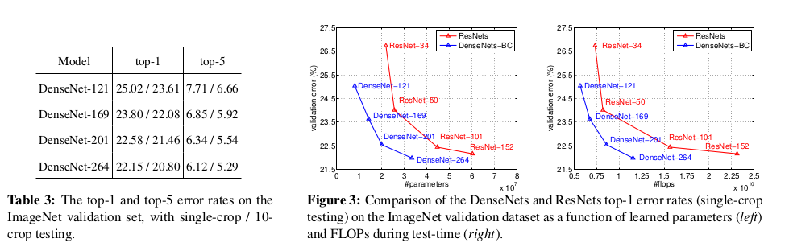

## 14.5 Discussions
**Model compactness.** 作为输入连接的直接结果，任何DenseNet层学习的特征映射都可以被所有后续层访问。这鼓励整个网络中的特征重用，并导致更紧凑的模型。

图4中的左侧两个图显示了一个实验结果，该实验旨在比较DenseNets的所有变体（左）和类似的ResNet架构（中间）的参数效率。

从图3可以看出，DenseNet-BC仅需要ResNet参数的 $1/3$ 。

**Feature Reuse.**
图5显示三个块的特征图（$L=40, k=12$）：

1. 所有层将权重分布在同一块内的许多输入上。 这表明由非常早的层提取的特征实际上直接由整个相同密集块中的深层使用。
2. 过渡层的权重也在前一个密集块内的所有层上扩展它们的权重，表明通过很少的间接从DenseNet的第一层到最后一层的信息流。
3. 第二和第三密集块内的层始终将最小权重分配给过渡层的输出（三角形的顶行），表明过渡层输出许多冗余特征（平均权重低）。 这与DenseNet-BC的强大结果一致，其中这些输出正好被压缩。
4. 虽然的最终分类层也使用了整个密集块的权重，但似乎是最终的集中
特征图，表明网络后期可能会出现更多高级特征。
