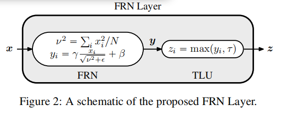
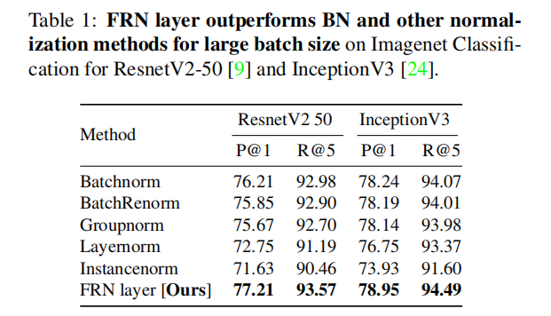
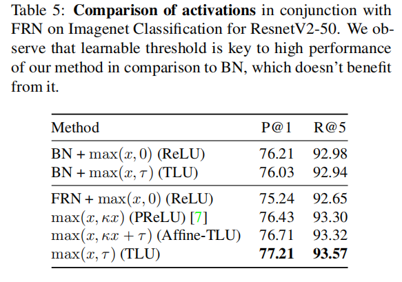

### Filter Response Normalization Layer: Eliminating Batch Dependence in the Training of Deep Neural Networks
#### Abstract

​		批归一化（Batch Normalization：BN）是高度成功并广泛使用的批依赖训练方法。它利用mini-batch中的统计量来规一化激活会引入样本间的依赖，如果mini-batch大小太小或者样本间相互关联，那么可能会损害训练。研究人员提出了几种替代方法（例如Batch Renormalization和Group Normalization（GN））来处理这个问题。但是，它们要么不能匹配大批量的BN的性能，要么在更小批量时仍表现出性能下降，或者在模型架构上引入了人为的约束。本文中，作者提出Filter Response Normalization（FRN）层，它是归一化和激活函数的新颖组合，它可以用作其他归一化和激活的直接替换。本文的方法独立地对每个批次样本中的每个激活图进行操作，从而消除了对其他批次样本或同一样笨通道的依赖性。对于所有批大小，本文的方法在各种设置中都优于BN和所有替代方法。在InceptionV3和ResnetV2-50架构的Imagenet分类中，FRN层在top-1验证精度上的性能要比具有大mini-batch的BN好大约 $0.7-1.0\%$。此外，在小mini-batch中，在相同问题上它的性能比GN好 $>1\%$。对于COCO数据集上的目标检测，FRN层在所有批大小上比其他方法好$0.3-0.5\%$。

#### 1. Introduction

​		批归一化是当前高性能深度神经网络的基石，并在深度学习近期的成功和广泛引用中发挥了重要作用。**BN经常被讨论的缺点是其依赖于足够大的批处理量[11、23、28]。当以小批量进行训练时，BN在目标检测等许多应用中很常见，表现出明显的性能下降。** 这个问题的根源归因于BN对随机mini-batch的依赖导致的训练和测试差异[23]。因此，已经提出了几种旨在缓解由于随机性引起的问题的方法[11，23]或通过消除批处理依赖性来提供替代方法[2，28]。然而，这些方法都不能匹敌大批量下BN的性能（图1）。此外，它们要么在更小的批量上存在性能衰减（如Batch Renormalization），要么引入了模型架构和大小的限制（例如Group Normalization要求层中通道数量时一个理想组大小的倍数，如32）。本文中，作者提出_Filter Response Normalization(FRN)_层——包含归一化和激活函数——来同时消除这些缺点。本文的方法没有任何的批依赖，因为**它独立的操作每个批样本中的每个激活通道（滤波器响应filter response），**并且优于BN以及各种评估设置中广泛采用的替代方案。例如，图1中，在ResNet在ImageNet分类上，所有批量下的FRN层比其他方法好 $1\%$。

​		BN依赖于大批量以各种方式令人望而却步。如Wu和He[28]指出，由于更大批量的使用导致明显更高的内存需求，这妨碍了对更高能力模型的探索。这对需要处理较大输入的任务的性能施加了限制。例如，目标检测和分割使用更大分辨率的输入时，执行得更好；相似地，视频数据本身就倾向更高的维度。因此，这些系统被迫权衡模型能力与训练更大批量的能力。

​		FRN层包含两个新颖的组件：**1）归一化方法（称为Filter Response Normalization（FRN））通过除以每个批样本中的每个滤波器的响应二阶无中心矩的均方根来规范每个滤波器的响应，而没有减去均值；2）逐元素激活（称为Thresholded Linear Unit（TLU））通过学习的整流阈值参数化，允许激活偏离零。** 所提出的FRN层不依赖其他批元素或通道进行归一化，也优于所有批量和各种设置下的BN及其其他替代方案。

​		本文的主要贡献如下：

- Filter Response Normalization（FRN）确保模型利用每个通道的归一化进行训练以获得高精度。
- Thresholded Linear Unit（TLU），一种与FRN一起使用的激活函数，即使在没有任何批次依赖性的大批量情况下，其精度也比BN进一步提高。 我们将此组合称为FRN层。
- 导致FRN和TLU结合成功的一些见解和实践考虑。
- 一项详细的实验研究，比较了各种现实世界架构上针对大图像分类和对象检测任务的流行归一化方法。

#### 2. Related work

​		**减小批归一化中训练-测试的差异的方法：** Ioffe[11]注意到训练和测试期间用于归一化的统计量之间的差异可能是由于小型的mini-batch赵成的随机性和由于非独立同分布（non--iid）造成的偏差引起的。他们提出Batch Renormalization（BR），该方法通过将mini-batch的矩限制到一个特殊的范围来减小这种差异，从而限制了训练期间mini-batch统计量的变化。这个方法的一个关键好处是利用Batch Renormalization训练的模型的测试评估方案与利用BN训练的模型完全一样。另一方面。Evalnorm[23]没有修改训练防范，相反，它建议对评估期间要使用的归一化统计数据进行更正。 该方法的主要优点是不需要重新训练模型。然而，对于小型mini-batch，这两种仍会有性能上的衰减。另一种方法是设计可以通过在GPU上分配较大的批次来执行需要大量输入的任务来规避问题的系统[19]。 但是，这种方法需要大量的GPU基础架构。

​		**避免归一化使用mini-batch的方法：** 几种方法通过完全不依赖随机mini-batch来避开BN所遇到的问题[2，27，28]。相反，归一化统计量根据根据样本自身来计算。Layer Normalization（LN）根据全部层（即使用所有的激活通道）计算归一化统计量。与BN相似，Instance Normalization（IN）独立地计算每个通道的归一化统计量，但是仅样本被归一化，这与BN的使用全部batch相反。IN对于风格迁移十分有用，但是在识别任务上却不成功。Group Normalization（GN）填补这两者之间的中间地带。它计算通道分组上的归一化统计量。理想的分组大小通过实验确定。虽然GN对于更小的批量上没有表现出性能衰减，但是对于更大的mini-batch，它比BN差。此外，由于每个归一化层需要具有由GN确定的理想组大小的倍数的通道数，所以GN需要的组大小会引起网络大小和架构的限制。

​		**其他方法：** Weight Normalization[21]提出了在方向和尺度方面对滤波器进行重新参数化，并报告了加速收敛。Normalization Propagation[1]使用理想化的矩来归一化每一层。有关各种归一化方法的统一观点，请参见Ren等[20]。

#### 3. Approach

​		本文的目标是消除深度神经网络训练中的批差异，而不牺牲大批量时BN的性能。

##### 3.1 Filter Response Normalization with Thresholded Activation

​		为了说明的目的，假设正在处理前馈卷积神经网络。卷积操作后产生的滤波器响应（激活图）是一个形状为$[B,W,H,C]$的$4D$张量 $\textbf{X}$，其中$B$是mini-batch，$W,H$为图的空间范围，$C$为卷积中使用的滤波器数。$C$也称为输出通道数。令$x=\textbf{X}_{b,:,:,c}\in \Bbb{R}^N$（其中 $N=W \times H$）是第 $b$个批中第$c$个滤波器响应的向量。令 $\nu^2=\sum_i x_i^2 / N$为$x$的均方范数。然后，作者提出了RFN：

$$\hat{x}=\frac{x}{\sqrt{\nu^2+\epsilon}}, \tag{1}$$

其中$\epsilon$是很小的正常量，用于避免除以零。

​		本文提出归一化方法的观点：

- 与其他归一化方法相似，**Filter Response Normalization消除了滤波器权重和预激活的缩放效应**。众所周知[21]（Weight Normalization），它可以消除沿权重方向的噪声更新并减小梯度协方差。

- 本文方法的一个主要差异是**在归一化之前没有移除均值，即没有减去均值**。尽管均值减法是批归一化的重要方面，但它是任意的，没有针对与批处理无关的归一化方案的真正理由。

- 本文的归一化是**基于每个通道的**。这确保了在最终模型中所有滤波器（或权重矩阵的行）有相同的相对重要性。

- 咋一看，**Filter Response Normalization与Local Response Normalization相似，不同之处是LRN在同一空间位置的相邻通道上进行归一化，而FRN是空间范围上全局归一化**。

  

  在归一化之后，还做了仿射变换，使得网络可以消除归一化的影响：

  $$y=\gamma \hat{x} + \beta, \tag{2}$$

其中$\gamma$和$\beta$是学习到的参数。

##### 3.1.1 Thresholded Linear Unit（TLU）

FRN缺少均值中心化可能导致激活任意地偏离零。与ReLU一起使用时，这种偏见可能会对学习产生不利影响，并导致性能下降和死单元。作者提出通过将ReLU增加学习阈值 $\tau$ 以产生定义如下的TLU来解决此问题：

​	$$z= \max(y, \tau), \tag{3}$$

由于$\max(y,\tau)=\max(y-\tau,0)+\tau=ReLU(y-\tau)+\tau$，TLU激活的效果与ReLU之前和之后有相同的偏差的效果相同。然而，根据本文的实验，这似乎与在先前和后续层中的偏差并不相同。作者假设TLU的形式更有利于优化。TLU明显改进了使用FRN模型的性能（表5），图2显示了我们提出的FRN层的示意图。



##### 3.2. Gradients of FRN layers

​		本节简要地推导使用FRN层的网络的梯度。由于所有变换逐通道地执行，作者仅推导了每个通道的梯度。假设在网络的某处，激活$x$馈入FRN层，并输出$z$（如公式（1）、（2）和（3））。令$f(z)$网络应用到$z$的映射，具有梯度 $\frac{\partial f}{\partial z}$ 的反向流动。注意，参数$\gamma$、$\beta$和$\tau$是大小为_num_channels_的向量，因策每个通道的更新是标量。

$$\frac{\partial z_i}{\partial \tau}=\begin{cases}0, &\mbox{ if } y_i\ge\tau \\ 1, &\mbox{ otherwise} \tag{4}\end{cases}$$

注意梯度 $\frac{\partial z_i}{\partial y_i}$与上面的公式相同，但是具有相反的情况。然后梯度更新到$\tau$：

$$\frac{\partial f}{\partial \tau}=\sum_{b=1}^{B}(\frac{\partial f}{\partial z_b})^T\frac{\partial z_b}{\partial \tau}, \tag{5}$$

其中$z_b$是第$b$个批点中每个通道激活的向量。$\gamma$和$\beta$的梯度如下：

$$(\frac{\partial f}{\partial \gamma},\frac{\partial f}{\partial \beta})=(\sum_{b=1}^B\frac{\partial f^T}{\partial y_b}\hat{x}_b,\sum_{b=1}^B\frac{\partial f}{\partial y_b}) \tag{6}$$

使用公式(2），可以得出 $\frac{\partial f}{\partial \hat{x}}=\gamma\frac{\partial f}{\partial y}$。最终，从FRN层流回的梯度可以写为：

$$\frac{\partial f}{\partial x}=\frac{1}{\sqrt{\nu^2+\epsilon}}(I-\hat{x}\hat{x}^T)\frac{\partial f}{\partial \hat{x}} \tag{7}$$

作者作出两个关于梯度的总结。公式（5）表明在常规ReLU激活中被抑制的部分梯度现在用于更新 $\tau$ ，并且在某种意义上没有浪费。公式（7）与$x$对应的梯度与$x$正交，因为$(I-\hat{x}\hat{x}^T)$沿$\hat{x}$方向投影了分量。该属性不是我们的标准化所独有的，但众所周知，它有助于减少SGD期间的梯度变化并有益于优化[21]。


##### 3.3. Parameterizing $\epsilon$

​		目前为止的讨论中，作者假设滤波器具有很大的空间范围，大小为$N=W \times H$ 。然而，在如InceptionV3和VGG-A的场景中，某些层产生$1\times1$的激活图。在此设置（N = 1）中，对于的较小值，所提出的归一化公式（如公式（1））变为符号函数（请参见图3），并且几乎在所有位置都具有非常小的梯度。这将始终对学习产生不利影响。相反，较高的 $\epsilon$ 值导致更顺畅的软符号函数变体，更易于学习。对于全连接的模型或产生 $1\times 1$ 激活图的模型，适当的 $\epsilon$ 值至关重要。从经验上看来，作者将如此模型中的$\epsilon$调整为可学习的参数（初始化为 $10^{-4}$）。对于其他模型，使用固定常量 $10^{-6}$。本文的实验中，作者证明了可学习的参数化对于辅助logits头部产生 $1\times1$激活图的InceptionV3和使用全连接层的VGG-A架构是有用的。

​		由于$\epsilon>0$，作者探索了两种替代参数化方法来强制这种限制：绝对值和指数。虽然二者都训练良好，但是绝对值参数化$\epsilon=10^{-6}+|\epsilon_l|$（$|\epsilon_l|$为学习到的参数）一致地产生比经验更好的结果。这种形式的参数化是可取的，因为$\epsilon_l$的梯度大小与$\epsilon$的值无关。

##### 3.4. Mean Centering

​		提出批归一化是为了应对深度神经网络训练期间的内部协方差偏移的影响。这种方案保持数据集上激活的分布的统计量不变，并且事实上，它们选择归一化每步中mini-batch的一阶和二阶矩。包括均值中心化在内的独立于批次的替代方案没有任何特殊考虑的理由，而似乎只是BatchNorm的遗留问题。

​		考虑Instance Normalization（IN）的例子，使用3.1节的符号，IN使用通道统计量 $\mu=\sum_{i}x_i/N$ 和 $\sigma^2=\sum_{i}(x_i-\mu)^/N$ 计算归一化激活：

$$\hat{x}=\frac{x-mu}{\sqrt{\sigma^2+\epsilon}}, \tag{8}$$

随着激活图的大小减少（如在更接近输出的层中，这些层主要受下采样的影响，或由于全连接层的存在，这个问题是常见的），IN产生零激活。Layer和Group Normalization是通过归一化（所有或部分）通道来规避这个问题。由于单个滤波器响应特定通道的激活，跨通道归一化在滤波器更新时会引起复杂的交互。因此，**似乎唯一有原则的方法是分别对激活图的每个通道进行归一化，而不必求助于平均中心化。**

​		不执行均值中心化的一个负面影响是激活可能随意地偏离零，导致ReLU激活不理想。作者通过引入Thresholded Linear Unit（TLU）来缓解这个问题。非中心的归一化与TLU激活的组合优于BN和所有其他替代方法。

##### 3.5. Implementation

​	FRN的实现代码如列表1.

```python
def FRNLayer(x, tau, beta, gamma, eps=1e-6):
	# x: Input tensor of shape [BxHxWxC].
	# alpha, beta, gamma: Variables of shape [1, 1, 1, C].
	# eps: A scalar constant or learnable variable.
	# Compute the mean norm of activations per channel.
	nu2 = tf.reduce_mean(tf.square(x), axis=[1, 2],
		keepdims=True)
	# Perform FRN.
	x = x * tf.rsqrt(nu2 + tf.abs(eps))
	# Return after applying the Offset-ReLU non-linearity.
	return tf.maximum(gamma * x + beta, tau)
```

#### 4. Experiments

​		在两个任务上进行广泛评估实验：1）ImageNet图像分类，2）COCO目标检测。

##### 4.1. Learning Rate Schedule

​		由于FRN并不意味着中心化，因此从经验上发现某些架构对初始学习率的选择更为敏感。设置较高的初始学习率引起较大的更新，这导致训练早期产生较大的激活以及减慢学习过程。这是由于梯度 $\frac{\partial f}{\partial x}$ 的除数 $\frac{1}{\sqrt{\nu^2 + \epsilon}}$ （公式(7））。在采用多个最大池化层的架构（如VGG-A）中会更频繁的发生。我们通过使用学习速率的提升来解决此问题，该学习速率在初始预热阶段将学习速率从0缓慢增加到峰值。由于我们的实验中使用余弦学习率衰减，本文也使用余弦增长策略。

##### 4.2. ImageNet Classification

**数据集：** ImageNet，将图像缩放到 $299 \times 299$，并使用[26]的数据增强。

**模型架构：** 1）ResNetV2-50，2）InceptionV4,3）VGG-A。GN的组大小为32。由于VGG-A在所有层中均未使用32个滤波器的倍数，因此我们将滤波器的数量增加到最接近的倍数。

**训练：**所有模型在8个GPU上使用同步的SGD训练300K步。通过所有GPU上求均值来计算梯度。对于BN，归一化统计量在每个GPU上计算。初始学习率为 $0.1 \times batch\_size/256$，并使用余弦衰减。使用两种分类度量报告结果：1）“Precision@1”使用最高得分的类来衡量准确率（top-1预测），2）“Recall@5”使用top-5得分类来测量准确率。



**与归一化方法的比较：** 表1比较了标准的32张图像/GPU的各种归一化方法与本文所提出的方法。


**每个GPU在少量图像的影响：** 图1和表2给出用于归一化的mini-batch的大小的影响。所有方法在8个GPU上使用五种不同的总批大小16、32、64、128和256，所以分配到每张GPU上的批量为2、4、8、16和32。


**分析FRN和TLU的影响：**


GFRN和LFRN分别为GN和LN中抑制均值中心化并除以非中心的二阶矩（而非方差）。

**具有全连接层的模型：** 


**TLU与相关变体的比较：** 



##### 4.3. Object Detection on COCO

**实验设置：** COCO及其评估方式 $AP$、$AP^{50}$和$AP^{75}$。

**模型：** RetinaNet，使用ResNetV1-101 FPN骨干，并将输入图像调整为 $1024 \times 1024$。

**训练：**  为了简化实验并评估，作者仅在从头训练的模型上比较所有方法。基于[10]的结论来证明这一选择的合理性，即通过更长的训练，从头开始训练的模型可以赶上通过对预训练模型进行微调而训练的模型。本文以微调的基线模型开始训练，训练的最大批大小是64，其在25K训练上获得38.3的AP（$BN^*$,表6），并且接近[18]中报告的39.1的结果。接下来，作者经验上发现，从头训练到125K时，可以获得相似的准确率（表6中的BN）。**本文设置125K作为最大批大小的训练步骤的基数量。** 在8个GPU上训练模型，并总计批大小为 $\{64,32,16\}$，从而每张GPU上有 $\{8,4,2\}$ 张图像。对于更小的批大小 $M$，设置训练 $125000\times64/M$， 并且学习率为 $base\_lr \times M /64$ 。本文报告了使用 $base\_lr \in \{0.01, 0.05, 0.1\}$ 上的最佳性能。所有模型使用动量0.9和权重刷机那$4\times10^{-4}$训练。


**归一化方法的比较：** 如表6 。

**批量的影响：** 

