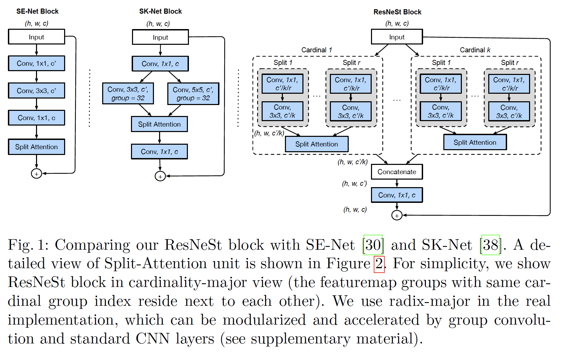
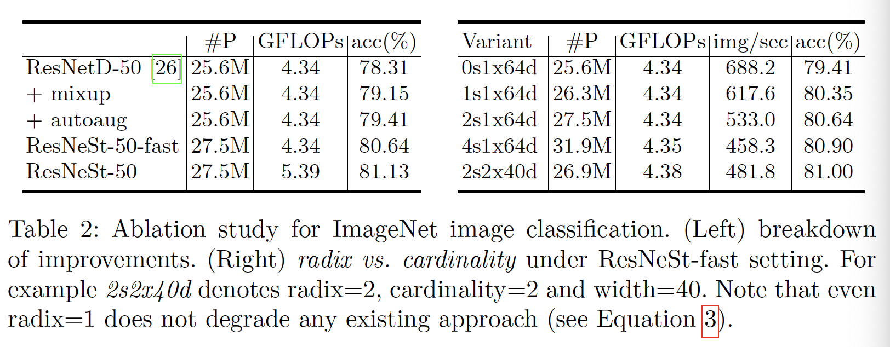
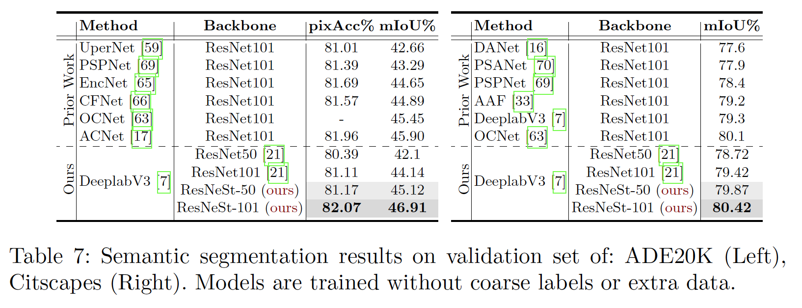
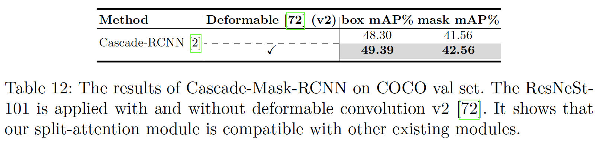

## ResNeSt: Split-Attention Networks

### Abstract 

​		虽然图像分类模型已取得持续进步，但是，由于ResNet变体的简单及模块结构，大多数下游应用（例如目标检测和图像分割）仍采用ResNet变体作为骨干网络。我们提出模块化的*Split-Attention*块，其保证跨越特征图分组的注意力。通过堆叠这些ResNet风格的Split-Attention块，我们获得新的ResNet变体，其称为*ResNeSt*。我们的网络保留了完整的ResNet结构，可直接用于下游任务，而不会引起额外的计算成本。

​		在相似的模型复杂度下，ResNeSt模型比其他网络好。例如，在ImageNet上，使用$224 \times 224$的单一裁剪尺寸，ResNeS获得81.13%的top-1准确率，准确率比先前的ResNet变体好1%。这种改进还有助于下游任务（包括目标检测、实例分割和语义分割）。例如，简单地将ResNet50替换为ResNeSt50，FasterRCNN在MS-COCO上的mAP从39.25%提高到42.33%，DeeplabV3在ADE20K上的mIoU从42.1%提高到45.1%。

### 1	引言

​		图像分类式计算视觉研究中的基础任务。为图像分类训练的网络通常用作为其他应用（例如目标检测、语义分割和姿态估计）设计的神经网络的主干。最近的工作通过大尺度神经架构搜索（NAS）显著提高图像分类的准确率。尽管它们具有最先进的性能，但这些基于NAS的模型通常并未针对在常规/商业处理硬件（CPU / GPU）上训练效率或内存使用情况进行优化[36]。由于过多的内存消耗，这些模型的某些较大版本甚至无法在GPU上进行训练[55]。这限制了基于NAS模型在其他应用上的使用，特别是涉及例如分割的密集预测的任务。

​		最近，大多数的下游应用仍使用ResNet及其变体之一作为主干CNN。它简单而模块化设计可以轻松地用于不同任务。然而，因为ResNet模型最初是设计用于图像分类，所以，由于有限的感受野大小和缺乏跨通道交互（cross-channel interaction），它们并不适合不同下游任务。这意味着，提升给定计算机视觉任务的性能需要“network surgery修改ResNet，以使其对特定的任务更具效率。例如，一些方法添加金字塔模块、引入long-range connection[56（non-local block）]或者使用跨通道特征图注意力[15、65]。尽管在分类任务上，它们具有更好的计算和准确率平衡，但是这些模型不能很好地迁移到其他任务，因为它们孤立的表示不能捕获跨通道的关系。因此，具有跨通道表示的网络是理想的。

​		作为本文的第一个贡献，我们探索ResNet [23]的简单体系结构修改，包括单个网络块内的特征图split attention。更具体地说，我们的每个块姜特征图划分为几个组（沿着通道维度）和更细粒度的subgroup或split，其中每个组的特征表示通过其split（具有基于全局上下文信息的权重选择）的表示的加权组合确定。我们称产生的单元为$Split-Attention$块，其仍然简单和模块化。通过堆叠几个Split-Attention快，我们创建的类ResNet网络称为$ResNeSt$（S表示“split”）。我们的架构需要的计算不比已有的ResNet变体多，并且它易于用作其他视觉任务的主干。

​		第二个贡献是图像分类和迁移学习应用中的大尺度基准测试。我们发现使用ResNeSt主干的模型能够在几个任务（例如图像分类、目标检测、实例分割和语义分割）上获得最佳性能。所提出的ResNeSt比所有的现有ResNet变体好，并且有相同的计算效率，甚至获得比通过NAS搜索产生的最佳CNN模型的速度-准确率好，如图1所示。在MS-COCO实例分割上，我们使用ResNeSt-101主干的单一Cascade-RCNN模型获得48.3%的边界框mAP和41.56%的掩膜mAP。在ADE20K场景解析验证集上，使用ResNeSt-101主干的DeepLabV3模型获得46.9%的mIoU，其比之前的最佳结果好1%。

### 2	相关工作

​		**现代CNN架构**	自AlexNet开始，深度卷积神经网络主导图像分类。随着这种趋势，研究已经从工程手工功能转移到工程网络架构。NIN[40]首先使用全局池化层来替换繁重的全连接层，并将$1\times1$卷积层用于学习特征图通道的非线性组合，这是第一种特征图注意力。VGG-Net[47]提出模块化网络设计策略，它重复堆叠相同类型的网络块，这简化网络设计和下游应用的迁移学习的工作流程。Highway nework[50]引入highway连接，其使信息流向几层，而没有衰减，并有助于网络收敛。在先驱工作的成功基础之上，ResNet引入恒等跳层连接，其缓解梯度消失的难题，并允许网络学习更深的特征表示。ResNet已成为最成功的CNN架构之一，其已用于多种计算机视觉应用。

​		**多路径和特征图注意力**	多路径表示已在GoogLeNet中被证明是成功的，其中每个网络块包含不同的卷积核。ResNeXt在ResNet瓶颈块中采用分组卷积。SE-Net [29]通过自适应地重新校准通道特征响应来引入通道注意机制。SK-Net[38]带来跨越网络分支的特征图注意力。受先前方法的启发，我们的网络将逐通道注意力概括为特征图组表示，可以使用统一的CNN运算对其进行模块化和加速。

​		**Neural Architecture Search**	随着算力的增长，人们的兴趣已从人工设计的体系结构转变为针对特定任务自适应地进行系统搜索的架构。最新的神经架构搜索算法自适应地产生CNN架构，其获得最佳的分类性能，例如AmoebaNet、MNASNet和EfficientNet。尽管它们在图像分类上取得巨大成功，但是元网络结构彼此不同，这使得下游模型难以建立。相反，我们的模型维持ResNet元结构，其可以直接用于许多已有的下游模型。我们的方法也可以增强神经架构搜索的搜索空间，并有潜力提高综合性能，这可以在未来的工作中研究。

### 3	Split-Attention Network

​		现在，我们引入Split-Attention块，该块可在不同的特征图组之间实现特征图的注意力。 稍后，我们将描述我们的网络实例化以及如何通过标准CNN运算加速此架构。

#### 3.1	Split-Attention Block

​		我们的Split-Attention block是一个计算单元，包含特征图分组和split attention 运算。图1（右）描述Split-Attention Block的整体结构。

**Feature-map Group**	如ResNeXt block，特征图的输入可以沿通道维度分为几组，特征图分组的数量由$cardinality$超参数$K$给出。我们称产生的的特征图分组为$cardinal \mbox{ } groups$。我们引入新的$radix$超参数$R$，其决定cardinal group（基分组）中的split数量。然后，沿通道维度将块输入$X$分为$G=KR$组$X=\{X_1,X_2,\cdots,X_G\}$，如图1所示。我们将一系列的变换$\{\mathcal{F_1},\mathcal{F_2},\cdots,\mathcal{F}_G\}$用于每个单独的组，然后每组的中间表示可以表示为$U_i = \mathcal{F}_i(X_i), i \in \{1, 2, \cdots, G\}$。

**Split-Attention in Cardinal Groups** 遵循[30、38]，通过跨越多个split的逐元素加法的融合来获得每个cardinal group。第$k$个cardinal group的表示为$\hat{U}^k=\sum_{i=R(k-1)+1}^{Rk}U_i$。对于$k\in1, 2, \cdots, K$，$\hat{U}^k \in \mathbb{R}^{H \times W \times C / K}$。嵌入逐通道统计量的全局上下文信息可以利用跨越空间维度$s^k\in\mathbb{R}^{C/K}$的全局均值池化聚合。这里，第$c$个组如下计算：

$$s_c^k=\frac{1}{H \times W}\sum_{i=1}^H\sum_{j=1}^W\hat{U}_c^k(i,j).\tag{1}$$

​		cardinal group表示$V^k\in\mathbb{R}^{H \times W \times C/K}$的加权融合使用逐通道的soft attention聚合，其中使用split上的加权组合产生特征图通道。第$c$个通道计算为：

$$V_c^k = \sum_{i=1}^{R}a_i^k(c)U_{R(k-1)+r},\tag{2}$$

其中$a_i^k(c)$表示下式给出的（soft）assignement weight：

$$a_i^k(c)=\begin{cases}\frac{\exp(\mathcal{G}_i^c(s^k))}{\sum_{j=0}^R\exp(\mathcal{G}_j^c(s^k))} &\mbox{if } R > 1, \\ \frac{1}{1 + \exp(-\mathcal{G}_i^c(s^k))} &\mbox{if } R=1,\end{cases}\tag{3}$$

并且映射$\mathcal{G}_i^c$基于全局上下文表示$s^k$确定第$c$个通道的每个split的权重。

**ResNeSt Block**	然后，沿着通道维度拼接cardinal group表示：$V=\mbox{Concat}\{V^1, V^2, \cdots, V^K\}$。如标准的残差块，如果输入和输出特征图的空间维度相同，那么Split-Attention块的最终输出$Y$使用shotcut连接产生：$Y=V + X$。对于具有步长的block，将恰当的变换$\mathcal{T}$用与shortcut connection以对其输出形状：$Y = V + \mathcal{T}(X)$。例如，$\mathcal{T}$可以步长卷积或卷积池化的组合。

**Instantiation，Acceleration，and Computational Costs** 	图（1）（右）给出Split-Attention block的实例化，其中组变换$\mathcal{F}_i$是$1 \times 1$卷积后跟一个$3 \times 3$卷积，以及使用具有ReLU激活的两个全连接层参数化的注意力权重函数$\mathcal{G}$。我们以基（cardinality）为主的视图（具有相同基数索引的特征图组彼此相邻）来绘制此图形，以方便地描述整体逻辑。通过将layout切换到以基为主的视图，可以使用标准CNN层（例如组卷积、组全连接层和softmax操作）轻松加速此块，我们将在补充材料中对其进行详细描述。Split-Attention 块的参数量和FLOPS与具有相同基和通道数量的Residual块大致相同。

**Relation to Existing Attention Methods**	SE-Net[29]首先引入squeeze-and-excitation注意力的思想，其采用全局上下文来预测逐通道注意力因子。当radix=1时，我们的Split-Attention block将squeeze-and-excitation操作用于每个cardinal group，而SE-Net则在整个块的顶部运行，而不管多个组。如SK-Net[38]的工作引入两个网络分支之间的特征注意力，但是它们的操作并未针对训练效率和扩展到大型神经网络进行优化。我们的方法概括了基组设置[60]中关于特征图注意力[29、38]的先前工作，并且其实现在计算上仍然有效。图1给出了与SE-Net和SK-Net块的比较。

### 4	Network and Training

#### 4.1	Network Tweaks

**Average Downsampling**	当迁移学习的下游应用时密集预测任务（如检测或分割）时，保留空间信息至关重要。最近的ResNet实现通常在$3 \times 3$层中使用步长卷积，而不是$1 \times 1$卷积以更好地维持这样的信息[26、30]。卷积层需要处理具有零填充策略的特征图边界框，当迁移到其他密集预测任务时，这通常不是最优的。**与其在在过渡块（其中空间分辨被下采样）中使用步长卷积，我们使用$3 \times 3$核大小的平均池化层。**

**Tweaks from ResNet-D**	我们还采用两种简单而高效的ResNet修改[26]：**（1）第一个$7\times7$的卷积层替换为3个连续的$3 \times 3$卷积层，其与原始的设计具有相同的感受野，以及相似的计算成本。（2）将$2\times2$**平均池化层添加到shortcut connection中，这个池化层位于$1\times1$卷积之前，$1\times1$卷积步长修改为1。

#### 4.2	Training Strategy

**Large Mini-batch Distributed Training**	遵循先前的工作[19、37]，我们使用8个服务器（总共64个GPU）并行训练模型。根据cosine schedule[26、31]调整学习率。我们具有mini-batch大小线性缩放初始学习率。初始学习为$\eta = \frac{B}{256}\eta_{base}$，其中$B$时mini-batch的大小，$\eta_{base}=0.1$。在前5个周期中，使用warm-up策略，将学习率从0逐渐增加到cosine schedule的初始学习率。每个块中最后的BN的$\gamma$初始化为0，如大批量训练[19]建议的。

**Label Smoothing**	标签平滑首先用于改善Inception-V2的训练。回想一下，我们的网络的预测类概率$q$引起的交叉熵损失是针对ground-truth $p$ 计算的，如下所示：

$$l(p, 1) = -\sum_{i=1}^K p_i \log q_i, \tag{4}$$

其中$K$是类的总数，$p_i$是第$i$个类的ground-truth 概率，$q_i$是网络预测的第$i$类的概率。与标准的图像分类相同，我们定义：$q_i = \frac{\exp(z_i)}{\sum_{j=1}^K\exp(z_j)}$，其中$z_i$是网络输出层产生的logits。当提供的标签是类，而不是类概率（硬标签hard label）时，如果$i$等于ground-truth类$c$，那么$p_i=1$，否则$p_i=0$。因此，在这种设置中：$l_{hard}(p, q) = -\log q_c = -z_c + \log(\sum_{j=1}^K\exp(z_j))$。在训练的最后阶段，对于$j \ne c$，logits $z_j$倾向非常小，而$z_c$会被推向其最优值$\infin$，这可能引起过拟合[26、53]。与其分配硬标签作为目标，标签平滑使用平滑的ground-truth概率：

$$p_i =\begin{cases}1-\varepsilon &\mbox{if }i-c, \\ \varepsilon/(K-1) &\mbox{otherwise}\end{cases}\tag{5}$$

$\varepsilon>0$是一个非常小的常量。这样可以减轻网络的过度置信和过拟合。

**Auto Augmentation**	Auto-Augment[11]是一种使用变换后的图像增强训练数据的策略，其中可以自适应地学习变换。引入了16种不同类型的图像抖动变换，从中，一种基于两个连续变换的24种不同组合（例如平移、旋转和色彩抖动）增强了数据。每个变换的度由对应参数（例如旋转角度）控制，并且变换可能会根据概率跳过。尝试不同候选增强策略的搜索返回最好的24的组合。然后，随机选择24个策略中的一个，并将其用于每个样本图像。原始的Auto-Augment实现使用强化学习来搜索这些超参数，并将它们视为离散搜索空间中的分类值。对于连续的搜索空间，首先在搜索之前离散化可能的值。

**Mixup Training**	Mixup是另一种数据增强策略，其生成训练数据中的随机图像对的加权组合。给定两幅图像及其ground-truth标签：$(x^{(i)}, y^{(i)}),(x^{(j)},y^{(j)})$，合成训练样本$(\hat{x}, \hat{y})$为：

$$\begin{align}\hat{x} &= \lambda x^i + (1- \lambda)x^j, \tag{6} \\ \hat{y} &= \lambda y^i + (1 -\lambda)y^j, \tag{7}\end{align}$$

其中每个增强样本都独立地采样$\lambda \sim \mbox{Beta}(\alpha = 0.2)$。

**Large Crop Size**	图像分类研究通常会比较在共享相同裁剪大小的图像上运行的不同网络的性能。ResNet变体[23、26、29、60]通常使用224的固定训练裁剪大小，而Inception-Net家族使用299的训练裁剪大小。最近，EfficientNet方法[55]为更深更宽网络增加输入图像尺寸可能由更好的准确率 vs FLOPS平衡。为了公平比较，当与ResNet变体相比时，使用224的裁剪大小，当与其他方法比较时，使用256的裁剪大小。

**Regularization**	即使对于大型数据集，非常深的神经网络也倾向于过拟合 [68]。 为了防止这种情况，drop-out正则化在训练过程中（但不是在推理过程中）随机掩盖了一些神经元，以形成隐式网络集成[29、49、68]。在具有超过200层的网络的最后的全连接层之前使用0.2的dropout概率的drop层。我们还在网络的最后两个阶段中卷积层中使用DropBlock层。作为dropout的结构化变体，DropBlock[18]随机掩盖掉局部块区域，并且比专门正则化的卷积层更有效。

​		最后，我们还使用权重衰减（即L2正则化），其有助于稳定训练。大型mini-batch训练的先驱工作建议仅将权重衰减用于卷积层和全连接层的权重。我们不对任何其他网络参数进行权重衰减，包括偏差单元、批归一化层的$\gamma$和$\beta$。

### 5	图像分类结果

​		我们首先研究ResNeSt在ImageNet2012数据集上的图像分类性能。作为标准，在训练集上训练网络，在验证集上报告它们的top-1准确率。

#### 5.1	实现细节

​		我们使用数据sharding在ImageNet上进行分布式训练，从而在GPU上平均划分数据。在每次训练迭代中，从相应的shard中采样一小部分训练数据（无替换）。然后，进一步使用标准的变换，包括：随机大小裁剪、随机水平翻转、颜色扰动和改变光照。最后，通过mean/standard-deviation标准化图像数据的RGB。对于mixup训练，我们简单地混合当前的mini-batch及其逆序样本中的每个样本。在每个卷积层之后，ReLU之前使用BN。使用Kaiming Initialization初始化网络权重。在最后的分类层之前插入dropout ratio = 0.2的drop层。利用0.0001权重衰减和0.9的动量、在前5个周期周期进行warm-up的cosine学习率schedule，在270周期后完成训练。ResNeSt-50的mini-batch大小为8192，ResNeSt101位4096，ResNeSt-{200，269}为2048。对于苹果，我们首先沿着短边将每幅图像调整到crop大小的$1/0.875$。

#### 5.2	Ablation Study

ResNeSt是基于ResNet-D模型[26]。mixup训练将ResNet-50的准确率从78.31%提高到79.15%。AutoAugment将准确率进一步提高0.26%。当使用Split-Attention block构成ResNeSt-50-fast模型时，准确率进一步提升到80.64%。**在ResNeSt-fast设置中，在$3 \times 3$卷积之前使用高效的平均下采样以避免引入额外的计算成本。随着将下采样操作移动到卷积层之后，ResNeSt-50获得81.13%的准确率。**

**Radix vs. Cardinality**	我们在不同radix/cardinality的ResNeSt变体中进行消融研究。在每个变体中，我们恰当地调整网络宽度，使得它的计算成本仍与ResNet变体相似。结果见表2，其中$s$表示radix，$x$为cardinality，$d$为网络宽度（$0s$表示在ResNet-D中使用标准的残差块）。根据实验，我们还发现将radix从1连续地增加到4，提高了top-1准确率，同时还增加了延迟和内存使用。尽管我们期望通过更大的radix/cardinality进一步提高准确性，但我们在后续实验中采用了$2s1x64d$设置的Split-Attention，以确保这些块可扩展到更深的网络，并在速度、准确性和内存使用之间取得良好的平衡。

#### 5.3	Comparing against the State-of-the-Art

**ResNet vs Variants**	为了与ResNet变体公平比较，使用$224 \times 224$的裁剪大小训练所有网络（包括ResNeSt），然后使用$224 \times 224$以及$320 \times 320$的中心裁剪评估。遵循先前的实践，我们在基准测试中考虑50层和101层网络。使用平均池化层（而不是步长卷积）作为小采样策略增加了1GFLOPS的计算。为了与匹配的计算成本比较，我们将平均池化操作移到$3\times3$卷积层之前构成$ResNeSt-fast$模型，其中卷积层运行在下采样的特征图之上。我们使用$2s1x64d$（见表2）作为ResNeSt设置，因为它有更好的训练和推理速度、更少的内存使用。与ResNet变体的比较结果见表3。

**Other CNN Models** 比较结果见表4，其中ResNeSt-50采用$256 \times 256$的裁剪大小，ResNeSt-269采用$320\times320$裁剪大小。对于输入大小大于256，采用Bicubic上采样策略。

### 6	迁移学习结果

#### 6.1 目标检测

​		表10中，我们报告了MS-COCO上我们的检测结果。所有模型在具有118K图像的COCO-2017训练集上训练，使用单尺度的标准COCO AP在具有5K图像的COCO-2017验证集（即minival）上评估。我们利用FPN、同步BN和图像尺度增强（从640到800中随机选择图像的短边）训练所有模型。使用1x的学习率schedule。使用Detectron2执行Faster-RCNN和Cascade-RCNN实验。为了进行比较，我们利用ResNeSt替换vanill ResNet，同时使用默认的超参数和检测头部。

​		与使用标准ResNet的基线相比，我们的主干将Faster-RCNN和Cascade-RNN的mAP提升大约3%。这种结果证明，我们的主干具有良好的泛化能力，并能轻松地迁移到下游任务。注意，对于aster-RCNN和Cascade-RNN，我们的ResNeSt比ResNet-101好。详情参见表10。

#### 6.2	实例分割

​		为了探索ResNeSt的泛化能力，我们还将其用于实例分割任务。除了边界框和分类概率外，实例分割还预测目标掩膜。

​		我们评估具有ResNeSt-50和ResNeSt-101的Mask-RCNN和Cascade-Mask-RCNN[2]。所有模型使用FPN和同步BN训练。对于数据增强，将输入图像的短边随机缩放到$(640,672,704,736,768,800)$之一。为了公平地将它与其他方法比较，使用1x的学习率schedule，其他超参数保持不变。我们利用上述的设置重新训练基线，但是使用标准的ResNet。所有实验在COCO-2017数据集上并使用Detectron2训练。对于基线实验，默认使用MSRA版的ResNet的主干，即$1\times1$卷积层具有步长2。在COCO-2017验证集山报告边界框和掩膜mAP。

​		如表6所示，我们的心主干获得更好的性能。

#### 6.3	语义分割

​		使用GluonCV实现的DeepLabV3作为基线方法。这里，将膨胀网络策略用于主干网络，产生8个步长的模型。训练期间使用SyncBN，以及多项式学习率schedule（初始学习率为0.1）。对于评估，上采样网络预测的logit 8倍，以计算每个像素的交叉熵损失。我们使用具有翻转的多尺度评估。

​		我们首先考虑Cityscapes数据集，其包含5K高质量标注的图像。我们在2975张图像上训练每个模型，并在验证图像上报告其mIoU。遵循先前的工作，我们仅考虑19 object/sutff类。我们没有使用任何粗糙标注的图像或额外数据。

​		ADE20K时具有150个object和stuff类、包含20K训练图像、2K验证图像和3K测试图像的大型场景解析数据集。所有网络在训练集上训练120个周期，并在验证集上评估。表7给出像素准确率（pixAcc）和平均交并比（mIoU）。

### Appendix

#### A	Radix-major Split-Attention Block

​		为了易于Split-Attention概念的可视化，我们在主要方法的描述中采用cardinality-major的实现，cardinal索引相同的组在物理上彼此相邻。cardinality-major实现很直接，但是它难以模块化，及使用标准的CNN加速。因此，在实验中，我们采用radix-major的实现。

​		图3给出以基数为主的布局的Split-Attention块概述。首先将输入特征图分为$RK$组，其中每组有一个cardinality-index和一个radix-index。在这种布局中，具有相同radix-index的组在内存中彼此相邻。然后，我们可以在不同split上进行加法操作，使得具有相同cardinality-index不同radix-index的特征图组可以融合到一起。此操作与在主要论文中所述的cardinality-major实现中的每个cardinal组内的各个split之间的融合相同。类似地，**全局池化层在空间维度上聚合，同时保持通道维度独立，这与对每个基数组进行全局池化然后将结果连接在一起相同**。然后，在池化层后添加两个与cardinality相同的组数的全连接层以预测每个split的注意力权重。分组FC层的使用使其同等地将每个FC对分别应用于每个基数组的顶部。

​		利用这种实现，第一个$1\times1$卷积层可以统一到一层，$3\times3$卷积可以使用具有$RK$组数的单一组卷积实现。因此，Split-Attention块是模块化的，并且使用标准的CNN实现。

#### B	Additional Experiments

##### B.1	姿态估计

##### B.2	目标检测与实例分割

#### C	未来工作及总结

​		利用Split-Attention block，我们将新的超参数radix引入到ResNet系列。我们对cardix、cardinality和宽度的几种组合进行了简短的消融研究。 但是，对超参数组合的全面研究可以进一步提高ResNeSt模型的性能，尤其是在特定应用程序上。 一个有趣的话题是通过神经体系结构搜索在不同的硬件上发现低延迟模型。

​		本文的贡献之外，我们根据经验得出一些次要结论，可能会对伙伴们有所帮助：

- depth-wise卷积对于GPU上的训练和推理效率不是最优的，
- 在固定输入图像尺寸的ImageNet上，模型精度达到饱和，
- 增加输入图像的大小可以获得更好的准确率-FLOPS平衡，
- 较大的crop-size（$\ge 320$）需要bicubic上采样策略。

