## An Image is Worth 16x16 Words: Transformers for Image Recognition at Scale

### 摘要

​		尽管Transformer体系结构已成为自然语言处理任务的实际标准，但其在计算机视觉中的应用仍然受到限制。在视觉中，注意力既可以与卷积网络结合使用，也可以用于替换卷积网络的某些组件，同时保持其整体结构不变。我们证明，这种对CNN的依赖不是必需的，并且当直接应用于图像补丁序列时，纯transformer可以很好地执行图像分类任务。当在大量数据上训练，并迁移到多个识别基准测试（ImageNet、CIFAR-100、VTAB等）时，与最新的卷积网络相比，Vision Transformer可获得出色的结果，而所需的计算资源却大大减少。

### 1	引言

​		基于自注意力架构（Transformers （Vaswani et al., 2017））已成为NLP中的模型选项。这种主导方法在大型文本语料上预训练，然后在更小的任务特定的数据集上微调。得益于Transformers的计算效率和可扩展性，使用100B以上的参数来训练史无前例的模型成为可能。随着模型和数据集的增长，仍然没有性能饱和的信号。

​		但是，在计算机视觉中，卷积架构仍然是主导。受到NLP成功的启发，多项工作尝试将CNN样的架构与自我关注相结合（Wang等人，2018; Carion等人，2020），其中一些完全替代了卷积（Ramachandran等2019; Wang等2020a）。在后来的模型中，虽然理论上有效，但由于使用了专门的注意力模式，因此尚未在现代硬件加速器上有效地扩展。 因此，在大尺度图像识别中，经典的ResNet风格的架构仍然是最佳。

​		受NLP中Transformer成功的启发，我们尝试将标准Transformer直接应用于图像，并进行最少的修改。为此，我们将图像划分为补丁，并提供这些补丁的线性嵌入的序列作为Transformer的输入。图像补丁以相同的方式视为NLP应用中的token（单词）。我们以监督的形式训练图像分类上的模型。

​		当在中等大小的数据集（如ImageNet）上训练时，此类模型产生适度的结果，与可比较大小的ResNets相比，精度要低几个百分点。可能会出现令人沮丧的结果：Transformer缺乏CNN固有的一些归纳偏差（inductive biases），例如平移等价和局部性，因此在不充分的数据上训练时，不能很好地泛化。

​		但是，如果我们在大型数据集（14M-300M图像）上训练模型，图片会发生变化。我们发现大规模的训练胜过归纳偏差。进行足够规模的预培训并迁移到数据较少的任务时，Transformer可获得出色的结果。我们的Vision Transformer（在JFT-300M数据集上预训练）获得或打败多个图像识别任务上的最佳结果，ImageNet上达到88.36%、ImageNet-ReaL上达到90.77%、CIFAR-100上达到94.55%以及包含19个renewer的VTAB套件上获得77.16%。

### 2	相关工作

​		Vaswani等人（2017）提出了用于机器翻译的Transformer，此后已成为许多NLP任务中最先进的方法。大型基于Transformer模型通常在大型语料上预训练，然后针对手头的任务进行微调：BERT（Devlin等，2019）使用去噪自监督的预训练任务，而GPT工作线将语言建模作为其预训练任务（Radford等，2018; 2019；Brown等，2020）。

​		自注意力朴素应用到图像将要求每个像素照顾到每一个其他像素。由于像素数量的二次成本，因此无法按实际输入尺寸缩放。因此，为了在图像生成背景中应用Transformer，过去已经尝试了几种近似方法：Parmar等人（2018）仅针对每个查询像素在局部邻域而不是全局中应用了自注意力。如此的局部多头点乘自注意力块可以完美替换卷积（(Ramachandran等2019；Cordonnier等2020;；Zhao等 2020）。另外，诸如Sparse Transformer（Child等2019）等工作采用可缩放的近似值来实现全局自注意力，以适用于图像。缩放注意力的另一种方法是将其应用于大小不同的补丁中（Weissenborn等，2019），在极端情况下仅沿单个轴（Ho等，2019；Wang等，2020a）。 这些专门的注意力架构中的许多架构在计算机视觉任务上显示出令人鼓舞的结果，但是需要在硬件加速器上有效实施复杂的工程。

​		将CNN与自注意力的形式结合起来也引起许多兴趣，例如通过增强图像分类的特征图（Bello等2019）或通过进一步使用自注意力处理CNN的输出，例如对于目标检测（Hu等2018；Carion等2020）、视频处理（Wang等2018；Sun等2019）、图像分类（Wu等2020）、无监督目标发现（Locatello等2020）或统一的文本视觉任务（Chen等2020c；Lu等2019；Li等2019）。

​		我们尚不了解Transformer在全局范围内对全尺寸图片的先前应用。最接近我们的模型是iGPT（Chen等2020a），其在减小图像分辨率和颜色空间后，将Transformer用于图像像素。该模型作为生成模型以无监督的方式进行训练，然后可以对所得表示进行微调或线性探查分类性能，从而在ImageNet上实现72％的最大准确率。

​		这项工作添加越来越多的论文集合，这项论文探索比标准ImageNet数据集更大尺度的上的图像识别。为了获得最先进的结果，许多论文都依赖于其他数据源（Mahajan等2018；Touvron等2019； Xie等2020）。Sun等（2017）研究了CNN性能如何随数据集大小扩展，Kolesnikov等（2017）、 Djolonga等（2020）对来自大规模数据集（例如ImageNet-21k和JFT-300M）的CNN迁移学习进行了实证研究，这两者都是本研究的重点。

### 3	方法

​		我们尽可能遵循原始Transformer（Vaswani等2017）的设计。这种特意简单的设置具有以下优点：几乎可以立即使用可伸缩的NLP Transformer及其有效的实现。我们旨在证明，如果适当缩放比例，此方法足以胜过最佳的卷积神经网络。

#### 3.1. Vision Transformer（ViT）

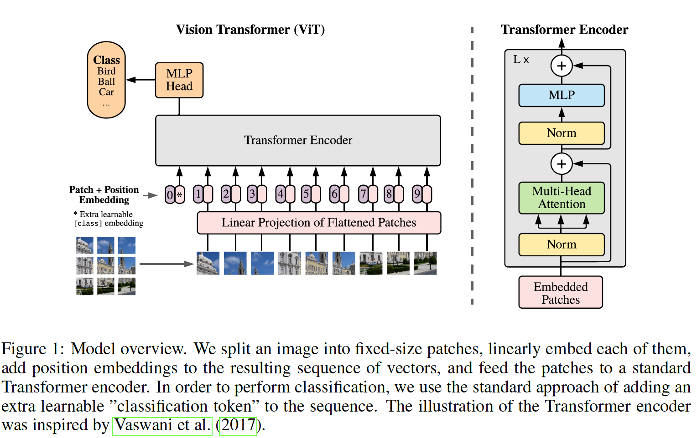

​		我们的用于图像的Transformer遵循NLP的架构设计。图1描述了这种设置。标准的Transformer接收一维token嵌入序列作为输入。为了处理2D图像，我们将图像$\mathbf{x} \in \mathbb{R}^{H \times W \times C}$调整为平坦的2D补丁序列$\mathbf{x}_p \in \mathbb{R}^{N \times (P^2 \cdot C)}$。$(H, W)$为原始图像的分辨率，$(P, P)$为每个图像补丁的分辨率。那么，$N = HW / P^2$为Transformer的有效长度。Transformer在所有层上使用恒定的宽度，因此可训练的线性投影将每个向量化补丁映射到模型维度$D$（式1），我们将其输出称为补丁嵌入。

​		与BERT的$[\mbox{class}]$token相似，我们在可嵌入的补丁序列（$\mathbf{z}_0^0 = \mathbf{x}_{\mbox{class}}$）之前添加了一个可学习的嵌入方法，该序列在Transformer编码器（$\mathbf{z}_0^L$）的输出处的状态用作图像表示$\mathbf{y}$（式4）。在预训练和微调期间，分类头部都连接到$\mathbf{z}_L^0$。

​		位置嵌入会添加到补丁嵌入中，以保留位置信息。我们探索位置嵌入的不同2D感知变体（附录C.3），但与标准的1D位置嵌入相比没有任何明显的收获。 联合嵌入用作编码器的输入。

​		Transformer编码器（Vaswani等2017）由多头自注意力（MSA，参见附录A）和MLP块（式2、3）的交替层组成。在每个block之前，使用LayerNorm（LN），并且在每个块之后使用残差连接（Wang等2019、Baevski & Auli 2019）。MLP包含具有GELU两层非线性。

$$\begin{align}\mathbf{z}_0 &= [\mathbf{x}_{\mbox{class}}; \mathbf{x}_p^1 \mathbf{E}; \cdots; \mathbf{x}_p^{N}\mathbf{E}] + \mathbf{E}_{pos}, &\mathbf{E} \in \mathbb{R}^{(P^2 \cdot C) \times D}, &\mathbf{E}_{pos} \in \mathbb{R}^{(N+1) \times D} \tag{1} \\ \mathbf{z}_{l}' &= MSA(LN(\mathbf{z}_{l-1})) + \mathbf{z}_{l-1}, &l=1,\cdots,L \tag{2} \\ \mathbf{z}_l &= MLP(LN(\mathbf{z}_l')) + \mathbf{z}_l', &l=1,\cdots,L \tag{3}\\ \mathbf{y} &= LN(\mathbf{z}_L^0) &l=1,\cdots,L \tag{4}\end{align}$$

​		**Hybrid Architecture**	作为将图像划分为补丁的替代方法，输入序列可以由ResNet的中间特征图构成。在这种混合模型中，利用ResNet的早期层替换补丁嵌入映射$\mathbf{E}$（式1）。ResNet的中间2D特征图之一被展平为一个序列，投影到Transformer维度，然后作为输入序列馈入Transformer。如上所述，将分类输入嵌入和位置嵌入添加到Transformer的输入。

#### 3.2	微调和更高分辨率

​		通常，我们在大型数据集上预训练ViT，并微调到（更小的）下游任务。为此，我们移除预训练的预测头部，并附加一个零初始化的$D \times K$前馈层，其中$K$为下游类的数量。以比预训练更高的分辨率进行微调通常是有益的（Touvron等2019； Kolesnikov等2020）。当馈入更高分辨率的图像时，我们保持补丁大小相同，这产生更有效的序列长度。Vision Transformer可以处理任意序列长度（直到内存限制），但是预训练的位置嵌入可能不在有意义。因此，我们根据预训练位置嵌入在原始图像中的位置执行2D插值。请注意，只有在分辨率调整和补丁提取中，将有关图像2D结构的inductive偏差手动注入到Vision Transformer中。

### 4	实验

​		我们评估ResNet、Vision Transformer（ViT）和混合模型的表示学习能力。为了理解每个模型的数据需求，我们在不同大小的数据集上预训练，并评估许多基准测试任务。考虑到模型预训练的计算成本时，ViT的性能非常好，可以以较低的预训练成本在大多数识别基准上达到最新水平。最后，我们使用自我监督进行了一个小实验，表明自监督的ViT在未来具有广阔的前景。

#### 4.1	设置

​		**数据集**	要探索模型的可伸缩性，我们使用具有1K类和1.3M图像的ILSVRC-2012 ImageNet数据集（后面我们成为ImageNet）、其具有21K类和14M图像的超集ImageNet-21K和具有18k类和303M高分辨率图像的JFT。遵循Kolesnikov等（2020）对预训练数据集进行去重。我们将这些数据集上训练的模型迁移到许多基准测试任务：原始验证集标签上的ImageNet、Oxford-IIIT Pets和Oxford Flowers-102。对于这些数据集，前处理步骤遵循Kolesnikov等（2020）。

​		我们还评估19个任务的VTAB分类套件。VTAB使用1000个示例评估低数据迁移到各种任务。这项任务分为三组：_Natural_—如Pets、CIFAR等的上述任务，_Specialized_—医学和卫星图像，以及_Structured_—需要几何理解的任务，例如定位。

​		**Model Variants**	我们的基本ViT配置为BERT中使用的配置（Devlin等2019）。我们用模型ViT-L/16表示“Large”变体，其具有$16 \times 16$输入补丁大小。注意：Transformer的序列长度为$\mbox{image_res}^2 / \mbox{patch_size}^2$。后缀包含“B”（Base）、“L”（Large）和“H”（Huge）；见表1。对于基线CNN，我们使用ResNet，但是将BatchNorm替换为GroupNorm，并使用标准的卷积。这些修改改进迁移（Kolesnikov等2020），并且我们将修改的ResNet表示为BiT。对于混合模型，我们将中间特征图以1个“像素”的补丁大小输入到ViT中。为了比较不同的序列长度，我们尝试（i）提取常规R50的阶段4的输出，以及（ii）删除阶段4，并在阶段3中放置相同数量的层（因此总数仍然为50），并取第三阶段的输出。选项（ii）产生更长的序列长度，以及更昂贵的ViT头部。

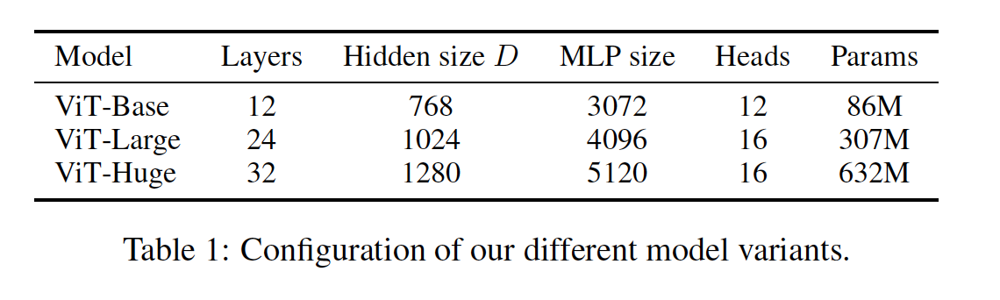

​		**训练和微调**	我们使用$\beta_1 = 0.9$、$\beta_2=0.99$、4096的批大小和0.1的高权重衰减训练所有模型，包括ResNet，我们发现对于所有模型的迁移时有用的（附录C.1证明，与常用实践相比，在我们的设置中，对于ResNet，Adam工作略为好于SGD）。我们使用线性学习率warmup和衰减，详情见附录B.1。对于微调，我们使用带momentum的SGD，批大小为512，对于所有模型，见附录B.1.1。ImageNet的结果见表2，我们在更高分辨率上微调：ViT-L/16位512，ViT-H/14位518，并且后者也使用Polyak＆Juditsky（1992）的平均系数为0.9999（Ramachandran等2019; Wang等2020b）。

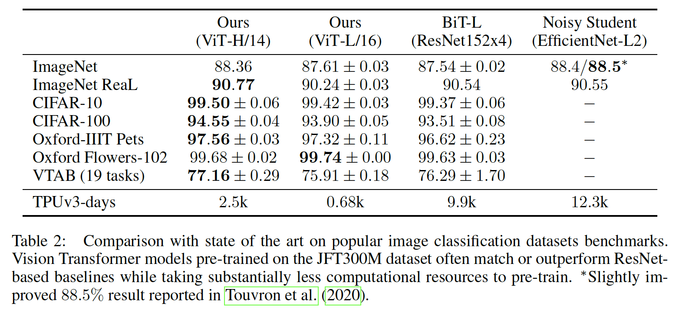

#### 4.2	与最先进方法的比较

​		我们首先比较我们的最大模型（在JFT-300M上预训练ViT-H/14和ViT-L/16）与文献中的最先进的CNN。第一个比较点为Big Transfer（BiT），其使用大型ResNet执行监督迁移学习。第二个点时Noisy Student（Xie等2020），其为使用删除标签的ImageNet和JFT-300M上的半监督学习训练的EfficientNet。目前，Noisey Student在ImageNet和BiT-L上是此处报告的其他数据集上的最新技术。我们已经在TPUv3硬件上对所有型号进行了训练，并且我们报告了对每个模型进行预训练所需的TPUv3天数。

​		表2包含结果。在所有数据集上，更小的ViT-L/16模型匹配或比BiT-L好，同时需要明显更少的训练资源来训练。更大的模型（ViT-H-14）进一步提高性能，特别是在更具挑战的数据集——ImageNet和CIFAR-100和VTAB套件。它在所有数据集上都达到或超过了最新技术水平，在某些情况下达到了相当大的幅度（例如CIFAR-100上为1％）。在ImageNet上，使用标准的噪声标签，ViT大约比“Noisy Student”低0.1％，但在更干净的ReaL标签上进行评估时，ViT优于最新技术。有趣的是，我们的模型进行预训练所需的计算量要比现有技术少得多，但是，我们注意到预训练效率不仅会受到架构选择的影响，还会受到其他参数的影响，例如训练时间表、优化器、权重衰减等。在第4.4节中，我们提供了针对不同架构的性能与计算的对比研究。

​		图2将VTAB任务分解为各自的组，并与该基准上以前的SOTA方法（BiT、VIVI（ImageNet和Youbube上的co-trained ResNet）和S4L（ImageNet上监督+半监督学习））进行了比较。在_Natural_任务中，ViT-H / 14的性能稍好于BiT-R152x4，尽管差异在重复噪声范围内。在_Specialized_ 中，ViT的性能仅优于BiT（和其他方法），但最大的好处似乎是ViT明显优越的结构化任务组。

#### 4.3	预训练数据要求

​		在大型JFT-300M数据集上进行预训练后，Vision Transformer表现良好。与ResNets相比，视觉上的归纳偏差（inductive biases）更少，数据集的大小有多重要？ 我们执行两个系列的实验。

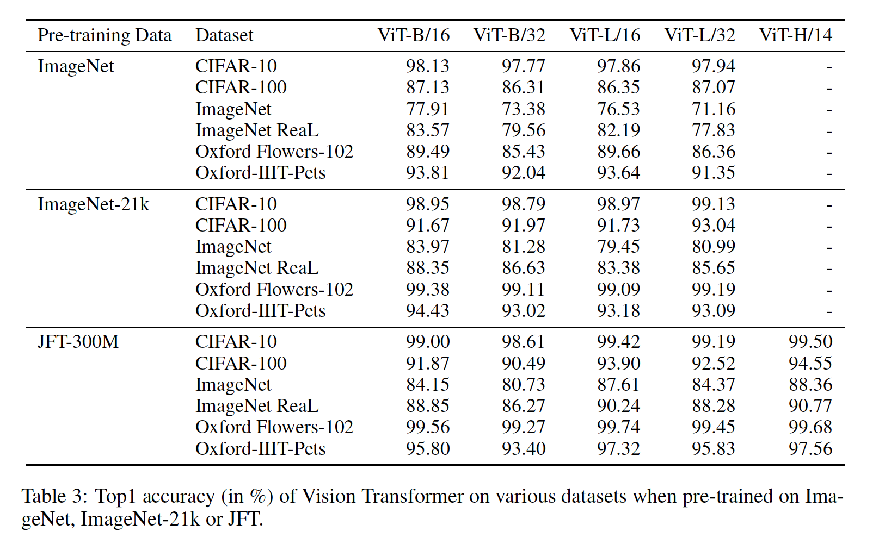

​		首先，我们在递增大小的数据集上预训练ViT模型：ImageNet、ImageNet-21K和JFT-300M。为了在更小数据集上获得最好的可能性能，我们优化三个正则参数——权重衰减、dropout和标签平滑。图3显示了微调到ImageNet之后的结果（表3中的其他数据集）。图3包含ImageNet上微调结果。当在最小的数据集（ImageNet）上预训练时，尽管使用很重的正则化，ViT-Large模型比ViT-Base模型差。但是，利用ImageNet-21K预训练，它们的性能相似。仅利用JFT-300M，我们看到更大模型的好处。图3还显示了由不同大小的BiT模型跨越的性能区域。 BiT CNN在ImageNet上的表现优于ViT（尽管进行了正则化优化），但是在数据集较大的情况下，ViT会超车。

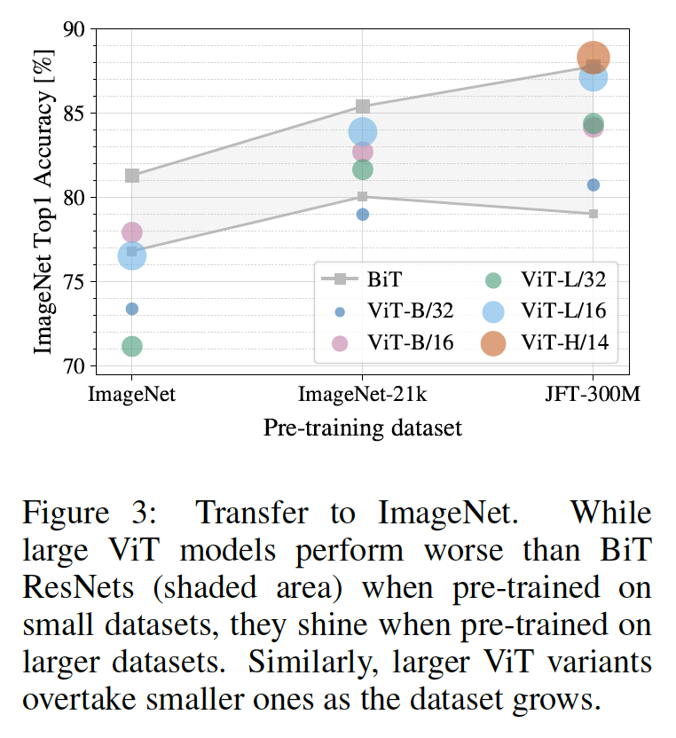

​		第二，我们JFT-300M数据集的9M、30M和90M子集以及完成数据集上训练模型。在更小的数据集上没有进行额外的正则化，并且所有设置使用相同的超参数。这样，我们评估固有模型的属性，而不是正则化的影响。但是，我们使用早停，并报告训练期间获得的最佳验证准确率。为了节约计算，我们报告了few-shot线性精度，而不是完全微调精度。图4包含了结果。在较小的数据集上，Vision Transformer比ResNets更易过拟合，并且具有可比的计算成本。例如，ViT-B/32比ResNet50略快；在9M子集上，它更加糟糕，但是在90M+子集上更好。对于ResNet152x2和ViT-L/16也是如此。这一结果进一步增强了直觉，即卷积归纳偏差对于较小的数据集很有用，但对于较大的数据集，学习相关模式就足够了，甚至是有益的。

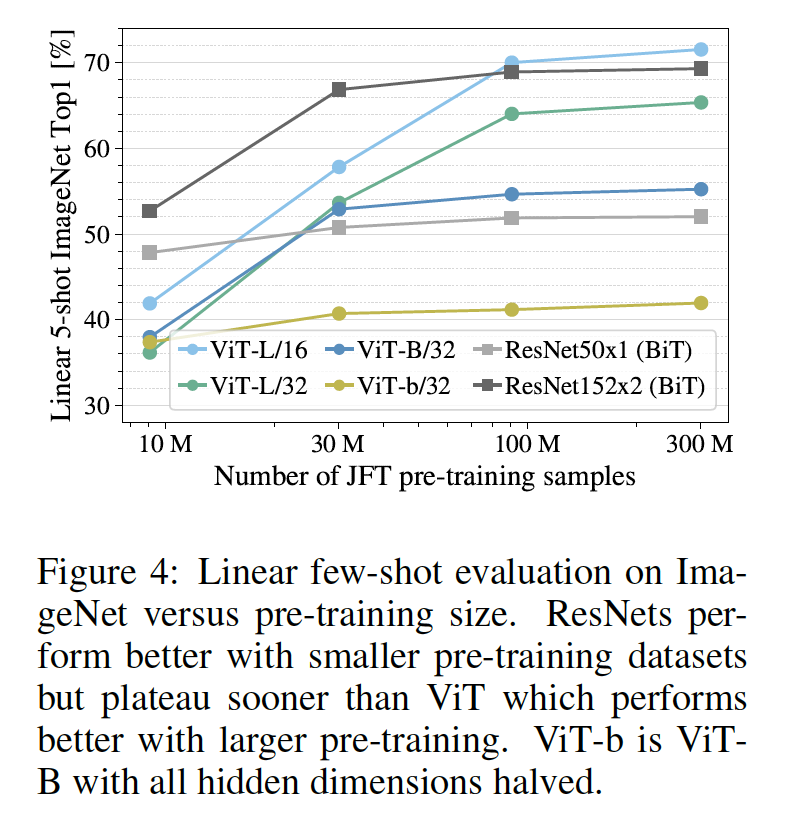

​		总体而言，ImageNet上的few-shot结果（图4）以及VTAB上的低数据结果（表2）对于极低数据迁移似乎很有前途。ViT的few-shot特性的进一步分析是未来工作的令人兴奋的方向。

#### 4.4	Scaling Study

​		我们执行不同模型的控制scaling研究。为此，我们评估来自JFT-300M的迁移性能。在JFT-300M上，数据的大小不是模型性能的瓶颈，并且我们评估性能与每个模型的预训练成本。模型设置包括：5个ResNets（R50x1、R50x2 R101x1、R152x1、R152x2），预训练7个epochs；6个Vision Transformer（ViT-B/32、B/16、L/32、L/16），预训练7个epochs；以及L/16 H/14，预训练7个epochs；4个混合模型（R50 + ViT-B/32、B/16、L/32、L/16），预训练7个周期。图5包含迁移性能与全部的预训练计算（有关计算成本计算的详细信息，请参见附录C.4）。

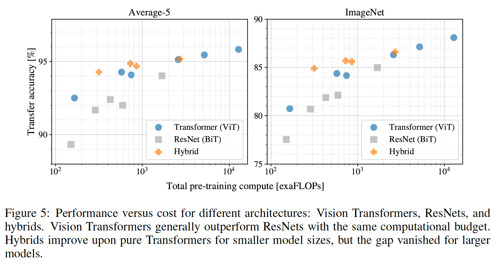

​		可以观察到少量模式。第一，在性能/计算平衡上，Vision Transformer比ResNets好。ViT使用大约少2倍的计算即可达到相同的性能（平均5个数据集）。第二，在较小的计算预算下，混合模型的性能略胜于ViT，但对于较大的混合模型，这种差异消失了。这一结果令人惊讶，因为人们可能期望卷积局部特征处理能够以任何规模辅助ViT。 第三，Vision Transformer似乎不会在尝试的范围内达到饱和，从而推动了未来的可扩展性工作。

#### 4.5	Inspecting Vision Transformer

​		为了理解Vision Transformer是如何处理图像数据，我们分析它的中间表示。Vision Transformer的第一层将平坦的补丁线性映射到更低维空间（式（1））。图7（左）显示了学习的嵌入过滤器的顶级主要组件。这些组件类似于合理的基础功能，用于在每个补丁中低维表示的精细结构。

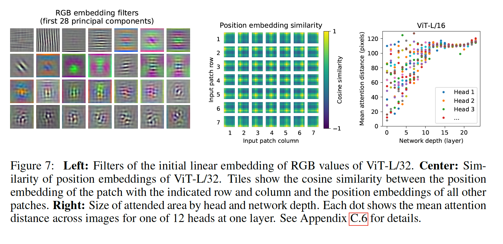

​		在映射之后，将学习的位置嵌入添加到补丁表示中。图7（中）给出，该模型学会了以位置嵌入的相似性对图像内的距离进行编码，即较近的补丁往往具有更多相似的位置嵌入。此外，此外，出现行-列结构。 同一行/列中的补丁具有相似的嵌入。最后，对于较大的网格，有时会出现正弦结构（附录C）。位置嵌入学会了表示2D图像拓扑的原因，解释了为什么手工制作的2D感知嵌入变体不能产生改进（附录C.3）。

​		自注意力使ViT甚至可以在最低层将信息整合到整个图像中。我们调查网络在多大程度上利用了此功能。具体而言，我们基于注意力权重（图7，右）计算图像空间中整合信息的平均距离。这种“注意力距离”类似CNN中的感受野大小。我们发现一些头部已经在最低层关注大部分图像，这表明模型确实使用了全局集成信息的能力。其他注意力头在底层的注意距离始终较小。这种高度局部化的注意在混合模型中不太明显，这种混合模型在Transformer之前应用ResNet（图7，右），表明它可能起到与CNN中早期卷积层相似的功能。此外，注意力距离随着网络深度而增加。 在全局范围内，我们发现该模型涉及与分类在语义上相关的图像区域（图6）。

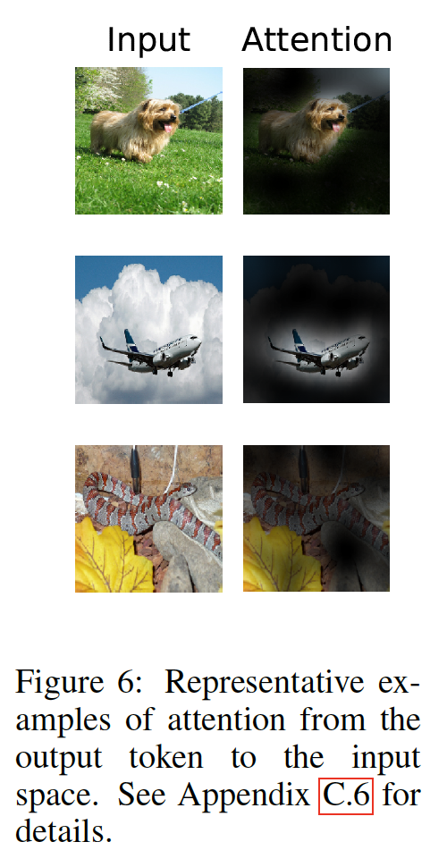

#### 4.6	自监督

​		Transformer在NLP任务中表现出令人影响深刻的性能。然而，他们的许多成功不仅源于出色的可扩展性，还源于大规模的自监督预训练（Devlin等2019;；Radford等2018）。我们还将对用于自监督的掩码补丁预测（masked patch prediction）进行初步探索，以模仿BERT中使用的掩码语言建模任务。利用自监督预训练，在ImageNet上，更小的ViT-B/16模型获得79.9%的准确率，比从头训练的模型提高2%，但是仍落后监督训练4%。附录B.1.2包含更多细节。我们将对比预训练的探索（Chen等2020b； He等2020； Bachman等2019； H´enaff等2020）用于未来的工作。

### 附录

#### A	多头自注意力

​		标准的$\mathbf{qkv}$自注意力（SA，Vaswani等2017）是流行的神经架构构建块。对于输入序列$\mathbf{z} \in \mathbb{R}^{N \times D}$中的每个元素，我们计算序列中所有值$\mathbf{v}$上的加权和。注意力权重$A_{ij}$是基于序列中两个元素与它们相应查询$\mathbf{q}^i$和键$\mathbf{k}^j$表示之间的逐对相似性。

$$\begin{align}[\mathbf{q}, \mathbf{k},\mathbf{v}] &= \mathbf{z} \mathbf{U}_{qkv} & \mathbf{U} &\in \mathbb{R}^{D \times 3D_h}, \tag{5} \\A &= \mbox{softmax}(\mathbf{q}\mathbf{k}^T / \sqrt{D_h}) & A &\in \mathbb{R}^{N \times N}, \tag{5} \\ SA(\mathbf{z}) &= A\mathbf{v}. \tag{7}\end{align}$$

多头自注意力（muilt-head self-attention：MSA）是SA的扩展，其中我们并行地运行$k$个自注意力操作，称为”heads“，并且映射它们的拼接输出。为了在更改$k$时保持计算和参数数量不变，通常将$D_h$（公式5）设置为$D/k$。

$$MSA(\mathbf{z}) = [SA_1(z); SA_2(z); \cdots; SA_k(z)] \mathbf{U}_{msa}, \mathbf{U}_{msa} \in \mathbb{R}^{k \cdot D_h \times D} \tag{8}$$

#### B	实验细节

##### B.1	训练

​		表4总结不同模型的训练设置。我们发现，在ImageNet上从头训练模型时，强力的正则化是关键。当使用dropout时，它会在$qkv$投影以外的每个密集层之后应用，并在将位置添加到补丁嵌入之后直接应用。混合模型经过与ViT副本的精确设置训练。最后，所有模型在分辨率224上完成。

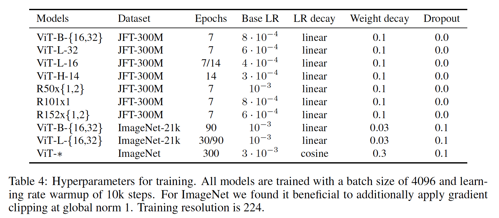

###### B.1.1	微调

​		对于VTAB，我们遵循Zhai等（2019b）的协议；对于每个任务，我们在200个示例验证集中选择两个学习率和时间表中的最佳者（表5）。 然后，我们使用最佳超参数对整个1k示例数据集进行重新训练。我们遵循Kolesnikov等（2020）使用的预处理，除了我们没有使用每任务分辨率。相反，对于所有任务，我们发现Vision Transformer从使用高分辨（$384 \times 384$）中受益最多。

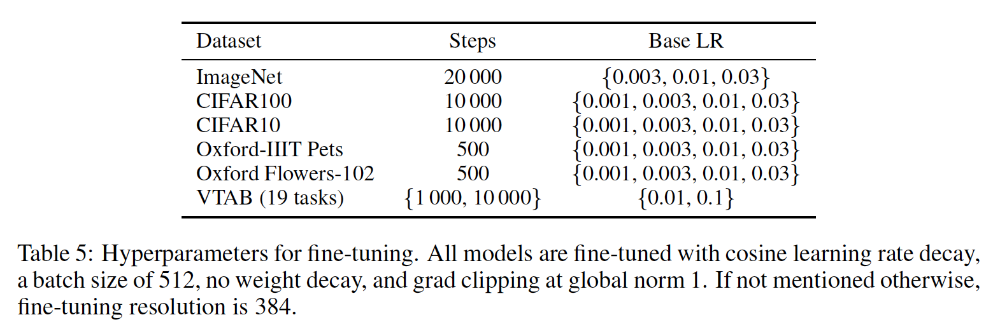

​		我们使用动量为0.9的SGD微调所有ViT模型。我们在学习率上运行小型的网格搜索，见表5中的学习率范围。为此，我们使用训练集上的子划分（对于Pes和Flowers，为10%，CIFAR为2%，ImageNet为1%）作为开发集，并在余下的数据上训练。对于最终的结果，我们在整个训练集上训练，并在对应的测试集上评估。对于微调ResNets和混合模型，我们使用完全相同的设置，唯一例外是ImageNet，在ImageNet中我们将另一个值0.06添加到学习率扫描（sweep）中。此外，对于ResNets，我们还运行Kolesinikov等（2020）的设置，并选择这次运行和sweep上的最佳结果。最后，如果没有其他说明，所有微调实验在384分辨率上运行（在不同于训练的分辨率下进行微调是常见的做法（Kolesnikov等，2020））。

​		当将ViT模型迁移到另一个数据集时，我们移除整个头部（两个线性层），然后将其替换为一个零初始化的单个线性层，输出目标数据集所需的类数。我们发现，这比简单地重新初始化最后一层强得多。

###### B.1.2	自监督

​		我们将掩膜补丁预测（masked patch prediction）目标用于初步的自监督实验。为此，我们用可学习的$[\mbox{mask}]$嵌入（80％）、随机其他补丁（10％）或仅保留了它们的原样（10％）替换它们的嵌入，从而衰减50％的补丁嵌入。 这种设置与Devlin等（2019）的语言设置非常相似。最后，我们使用其各自的补丁表示来预测每个corrupted补丁的3位平均颜色（即总共512种颜色）。

​		在JFT上，以批大小4096训练自监督模型1M步。我们使用Adam，其基学习率为$2 \cdot 10^{-4}$、10K步warmup以及余弦学习率衰减。作为预训练的预测目标，我们尝试如下设置：1）仅预测3bit颜色（即512种颜色中的1种预测），2）并行预测具有3bit颜色的$16\times16$补丁的$4\times4$缩小版本（即512种颜色中的16种预测），3）在完整的补丁上使用L2回归（即在3 RGB通道上的256个回归）。我们发现，尽管L2稍差一些，但它们都工作得很好。我们仅报告选项1）的最终结果，因为它显示出了最佳的few-shot性能。我们还试验了Devlin等人（2019）使用的15％的corruption率，但在我们的几项指标上，结果也稍差一些。

#### C	附加分析

##### C.1	SGD vs. Adam for ResNets

​		ResNets通常使用SGD进行训练，我们使用Adam作为优化器是非常规的。在这里，我们显示了激发这种选择的实验。即，我们比较利用SGD和Adam在JFT预训练上的两个ResNets（50x1和152x2）的微调性能。对于SGD，我们使用Kolesnikov等（2020）推荐的超参数。结果见表6。平均和在大多数数据集上，Adam预训练均优于SGD预训练。这证明了选择Adam作为在JFT上对ResNets进行预训练的优化器是合理的。 请注意，绝对数比Kolesnikov等（2020）报道的要低，因为我们仅预训练了7个epoch，而不是30个epoch。

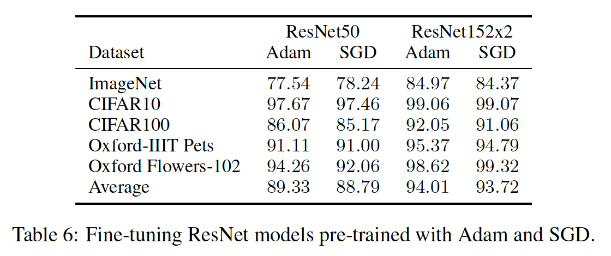

##### C.2	Transformer Shape

​		我们对缩放Transformer体系结构的不同维度进行了消融分析，以找出最适合对超大型模型进行放大的方法。图8显示了ImageNet在不同配置下的5-shot性能。所有配置基于8层、$D=1024$、$D_{MLP}=2048$以及32的补丁大小的ViT模型。我们可以看到，放大深度会带来最大的改进，直到64层都清晰可见。但是，在16层之后，收益递减已经可见。有趣的是，放大网络的宽度似乎产生最小的改变。减小补丁大小，并因此增加有效序列长度表现出令人吃惊的鲁棒性改进，二没有引入参数。我们的发现表明，与参数数量相比，计算可能是更好的性能预测指标，并且scaling应该强调深度与宽度的关系。总的来说，我们发现按比例放大所有维度都可以带来强大的改进。

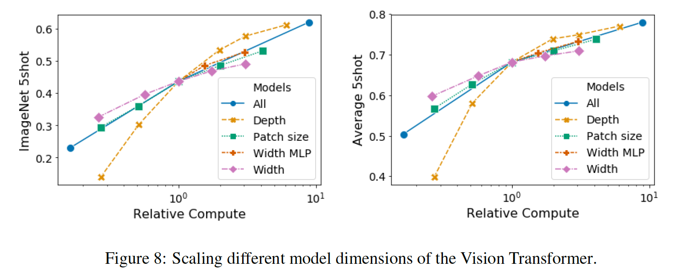

##### C.3	位置嵌入

​		我们对使用位置嵌入对空间信息进行编码的不同方式进行了消融分析。 我们尝试了以下情况：

- 没有提供位置信息：将输入视为_bag of patches_。
- 1维位置嵌入：将输入视为按栅格顺序（raster order）排列的补丁序列（本文所有其他实验均采用默认值）。
- 2维位置嵌入：将输入视为两个维度上的网格补丁（a grid of patches）。在这种情况下，学习到两组嵌入一个轴对应一个。X-嵌入和Y-嵌入，每个嵌入的大小为$D/2$。然后，基于输入中路径的坐标，我们将X和Y嵌入连接起来以获得该补丁的最终位置嵌入。
- 相关位置嵌入：考虑补丁之间的相对距离以代替其绝对位置来对空间信息进行编码。为此，我们使用1维Relative Attention，其中，我们定义补丁的所有可能对的相对距离。因此，对于每个给定的对（一个作为查询，而其他的作为注意力机制中的key/value），我们有偏移$p_q - p_k$，其中每个偏移关联一个嵌入。然后，我们仅运行额外的注意力，其中我们使用原始查询（查询内容），但是使用相对位置嵌入作为key。然后，在应用softmax之前，我们将相对注意力的logits用作偏项，并将其添加到主要注意力（基于内容的注意力）的logits。

​       除了编码空间信息的不同方式外，我们还尝试处理这种信息的不同方式。对于1维和2维空间嵌入，我们尝试三种不同的情况：（1）在模型的stem之后，在将输入提供给Transformer编码器之前，将位置嵌入添加到输入中（本文所有其他实验均采用默认设置）；（2）在每层开始时，学习并添加位置嵌入到输入；（3）在每层（层之间共享）开始时，将学习的位置嵌入添加到输入。

​		表7总结了此消融研究在ViT-B/16模型上的结果。如我们所见，虽然没有位置嵌入的模型与具有位置嵌入的模型之间的性能差距很大，但是在编码位置信息的不同方式之间几乎没有差异。我们推测，由于我们的Transformer编码器是在补丁级输入（而不是像素级）上运行的，因此对空间信息进行编码的区别不太重要。更准确地说，在补丁级输入中，空间维度远小于原始的像素级输入，例如$14\times14$，而不是$224 \times 224$，并且对于这些不同的位置编码策略，学习以这种分辨率表示空间关系同样容易。即使这样，网络学习到的位置嵌入相似性的特定模式也取决于训练超参数（图9）。

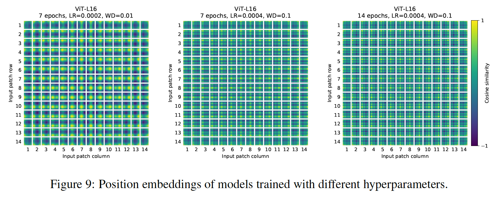

##### C.4	经验计算成本

​		我们还对硬件上架构的实际速度感兴趣，由于通道宽度和缓存大小之类的细节，理论上的FLOP并不总是能够很好地预测这种速度。为此，我们在TPUv3硬件上对感兴趣的主要模型执行推理速度的计时；推理和反向传播速度之间的差异是一个与模型无关的常数。

​		图11（左）显示了在各种输入大小下，一个核每秒可以处理多少个图像。每个点都是指在各种批次大小下测得的最高性能。如我们所见，对于尺寸最大，分辨率最高的模型，ViT的理论上以图像大小进行的bi-quadratic缩放几乎没有发生。

​		另一个令人感兴趣的数量是每个模型可以容纳到核心上的最大批处理大小，更大的批处理大小更适合缩放到大型数据集。图11（右）显示了同一组模型的数量。这表明大型ViT模型在内存效率方面比ResNet模型具有明显优势。

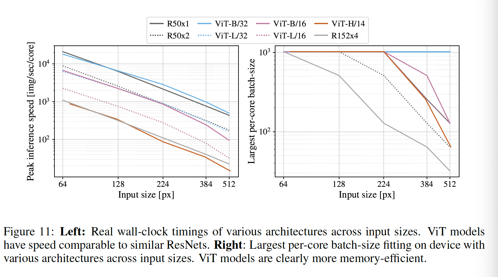

##### C.5	Axial Attention

​		Axial Attention（Huang等2020；Ho等2019）是一种简单而有效的技术，可以对以多维张量组织的大型输入进行自注意力。Axial Attention的一般思想是执行多个注意力操作，每个操作都沿输入张量的单个轴进行，而不是对输入的扁平化版本施加一维注意力。在Axial Attention中，每个注意力沿特定轴混合信息，同时独立地保留沿其他轴的信息。为此，Wang等人（2020b）提出了AxialResNet模型，其中ResNet50中所有核大小为$3\times3$的卷积都被轴向自注意力（即行和列的注意力）替换，并通过相对位置编码进行了增强。我们已经实现了AxialResNet作为基线模型。

​		此外，我们修改了ViT以处理2维形状的输入，而不是一维补丁序列，并合并了Axial Transformer块，其中除了自注意力之后没有MLP，我们还有一个行自注意力加MLP，然后是列自注意力加MLP。

​		图12展示了ImageNet 5shot linear上Axial ResNet，Axial-ViT-B / 32和Axial-ViT-B / 16在JFT数据集上进行预训练时的性能与预训练计算的关系，无论是在FLOP数量还是推理时间（每秒示例）。如我们所见，在性能方面，Axial-ViT-B/32和Axial-ViT-B/16比它们的ViT-B副本好，但这是以增加计算量为代价的。这是因为在Axial-ViT模型中，每个具有全局自注意力的Transformer块倍两个Axial Transformer块（一个带有行自注意力，一个带有列自注意力）替换，尽管在轴向情况下自注意力的序列长度较小，但每个Axial-ViT块都有一个额外的MLP。对于AxialResNet，尽管从准确性/计算权衡的角度来看，这看起来是合理的（图12，左），但是在TPU上的朴素实现速度非常慢（图12，右）。

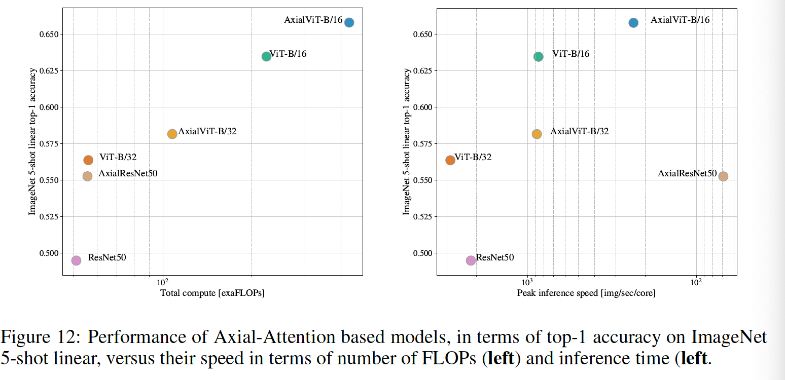

##### C.6	Attention Distance

​		为了理解ViT是如何使用自注意力来集成跨图像信息，我们分析不同层中注意力权重跨越的平均距离（图10）。这种“注意力距离”类似CNN中的感受野。平均注意力距离在较低层的各个头部之间变化很大，其中一些头部占据了大部分图像，而其他头部则占据了查询位置处或附近的小区域。随着深度增加，所有头部的注意力距离都增加。在网络的后半部分，大多数头部跨token广泛出现。

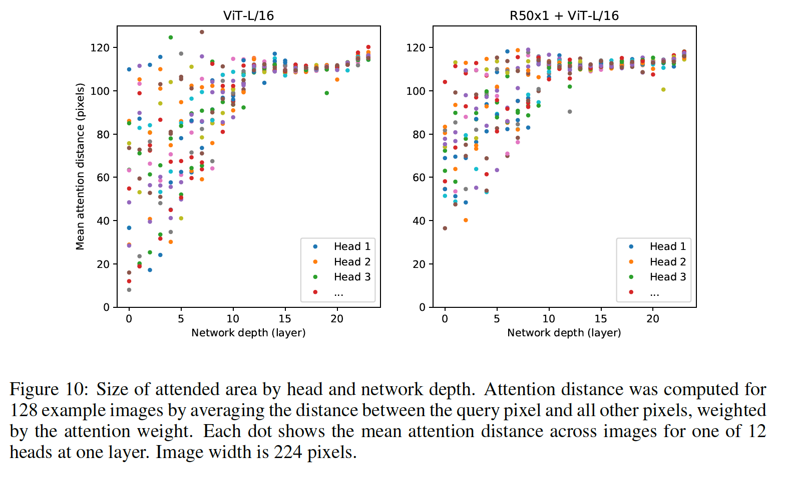

##### C.7	Attention Maps

​		为了计算从输出token到输入空间的注意力分布图（图6和13），我们使用了“注意力分布（Attention Rollout）”（Abnar＆Zuidema，2020）。简而言之，我们对所有头的ViTL / 16的注意力权重进行平均，然后递归乘以所有层的权重矩阵。这说明了贯穿所有层的token之间的注意力混合。

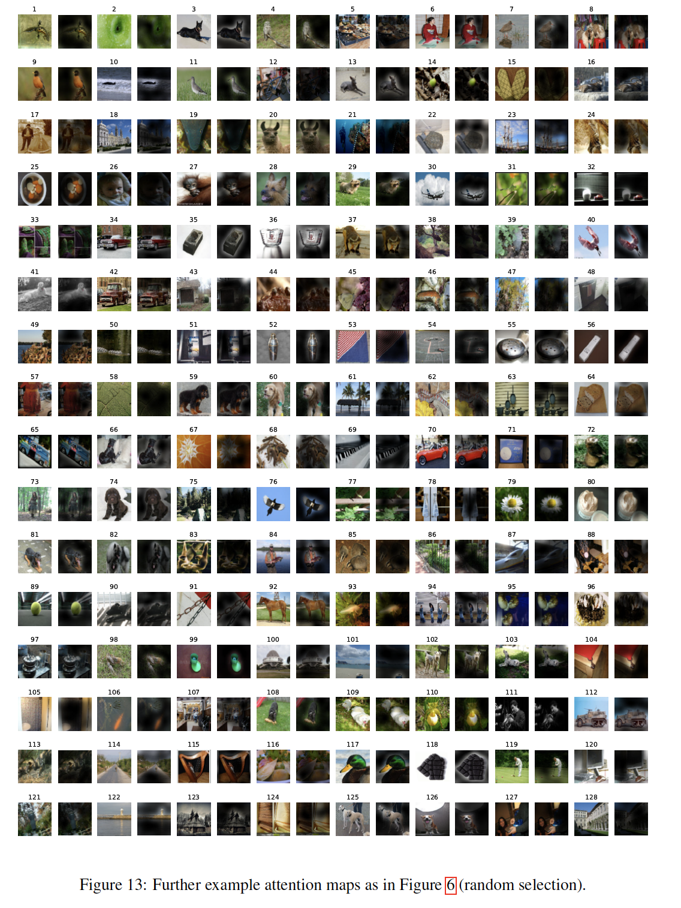

