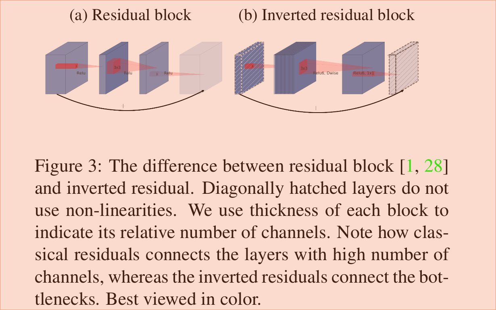
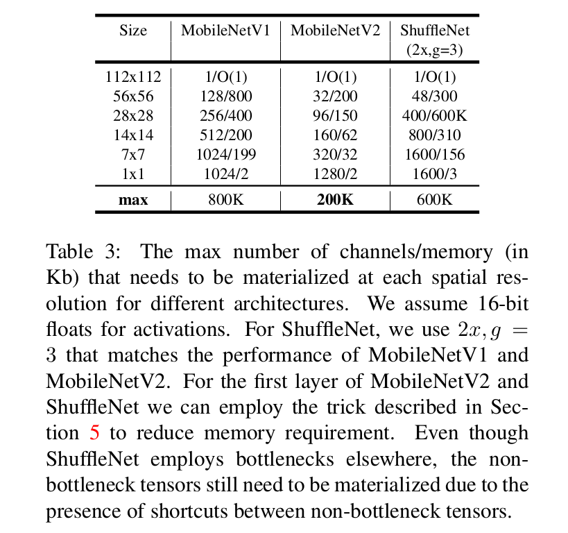
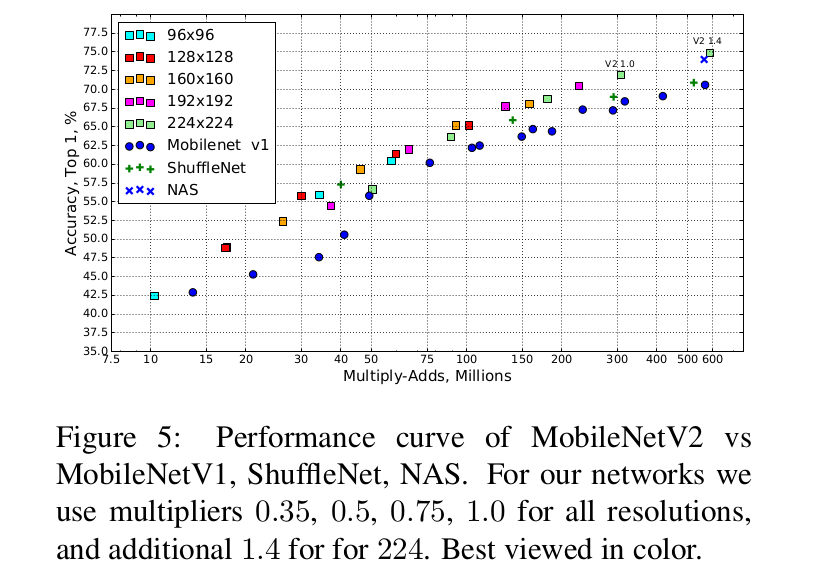
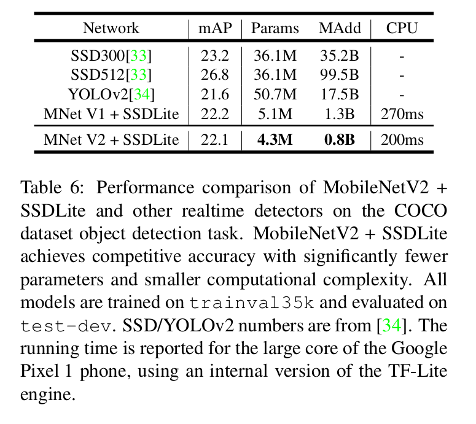

Inverted Residuals and Linear Bottlenecks: Mobile Networks for Classification, Detection and Segmentation
=

# 3. Preliminaries, discussion and intuition
## 3.1. Depthwise Separable Convolutions
深度可分离卷积是许多高效神经网络架构的关键构建块。基本思想是使用将卷积分割两层的分解版本替换完整的卷积层操作。第一层称为 Depthwise 卷，它通过将单个卷积滤波器应用到每个输入通道来执行滤波。第二层为 $1 \times 1$ 卷积，称为 Pointwise 卷积，其通过计算输入通道的线性组合构建新特征图。

标准卷积采用 $h_i \times w_i \times d_i$ 输入张量 $L_i$ ，并应用卷积核 $K \in \cal R^{k \times k \times d_i \times d_j}$ 以产生一个 $h_i \times w_i \times d_j$ 的输出张量 $L_j$ 。标准卷积层有 $h_w \cdot w_i \cdot d_i \cdot d_j \cdot k \cdot k$ 的计算成本。

对于标准卷积层来说，深度可分离卷积是一种插入式的重新布局。从经验上看，它们的工作原理几乎和常规卷积一样好，但只有成本:

$$h_i \cdot w_i \cdot d_i(k^2 + d_j) \tag 1$$

其为 depthwise 和 $1 \times 1$ 的 pointwise 卷积之和。相比传统层，高效的深度可分离卷积将计算量减小几乎为 $k^2$ 倍。MobileNetV2 使用 $k=3$ ，因此计算成本比标准卷积少 8 到 9 倍，但仅有很小的准确率减小。

## 3.2. Linear Bottlenecks
考虑由 $n$ 层 $L_i$ 组成的深度神经网络，其中每层有一个维度为 $h_i \times w_i \times d_i$ 的激活张量。在这一节中，我们将讨论这些激活张量的基本性质，我们将其视为具有 $d_i$ 维的 $h_i \times w_i$ “pixel” 的容器。形式上，对于输入真实图像的集合，我们称层激活（对于任意层 $L_i$）的集合组成一个“manifold of interest ” 。因为如此的 manifold 一般不能用解析地方法描述，所以我们将用实验的方法来研究它们的特性。例如，长期以来，人们一直认为神经网络的 manifold of interest 可以嵌入到低维子空间中。换句话说，当我们观察深度卷积层的所有单个 $d$ 通道像素时，这些值中编码的信息实际上存在于某个流形(manifold)中，而该流形又可嵌入到低维子空间中。

乍一看，这样的事实可以通过简单地减少层的维数从而减少操作空间的维数来捕获和利用。这已经被MobileNetV1[26]成功地利用，通过一个宽度乘子参数有效地在计算和精度之间进行权衡，并被整合到其他网络以及[19]的高效模型设计中。遵循这种直觉，宽度乘子运行网络减小激活空间的维度直到 manifold of interest 跨越整个空间。然而，当我们回忆起深度卷积神经网络实际上有非线性坐标变换（例如 ReLU）时，这种直觉被打破。例如，ReLU应用于一维空间中的直线会产生一个“射线（ray）”，与在 $\cal R^n$ 空间一样，它通常会产生一个具有 $n$ 个节点的分段线性曲线。

不难看出，一般情况下，如果一层的变换 $\mbox{ReLU}(Bx)$ 的具有的非零容量为 $S$ ，则映射到内部 $S$ 的点通过输入的线性变换 $B$ 得到，从而表明对应完整维度输出的输入空间的非零部分被限制为一个线性变换。换句话说，深度网络在输出域的非零容量部分仅有线性分类器的能力。

另一方面，当 ReLU 折叠激活空间时，不可避免地丢失信息。在附录 A 中，我们证明，如果输入流形可嵌入到激活空间的一个显著更低维子空间中，那么 ReLU 变换通常能保留信息，同时将所需的复杂性引入可表达函数集。

综上所述，我们强调了两个性质，它们表明了我们感兴趣的流形必须位于高维激活空间的低维子空间的要求:
1. 如果感兴趣的流形在 ReLU 变换后保留非零容量，那么对应一个线性变换。

2. ReLU能够保存输入流形的完整信息，但前提是输入流形位于输入空间的低维子空间中。

这两个见解为我们优化现有的神经结构提供了经验提示:假设感兴趣流形是低维的，那么我们能够通过插入线性瓶颈到卷积块而捕获这种信息。实验证据认为使用线性层是至关重要的，因为它阻止非线性层摧毁过多的信息。在第 6 节中，我们经验上证明，在瓶颈中使用非线性层确实损害了几个百分比的性能，从而验证我们的假设。

本文剩余的部分中，我们将实现瓶颈卷积。我们称输入瓶颈的大小和内部大小之间的比例为 _expansion ratio_ 。

## 3.3. Inverted Residuals
瓶颈块看起来类似于残差块，其中每个块包含一个输入，然后是几个瓶颈，然后是展开（expansion）[1]。然而，直觉告诉我们瓶颈实际上包含了所有必要的信息，而扩展（expansion）层仅仅作为张量非线性变换的实现细节，我们直接在瓶颈之间使用快捷方式。图 3 提供了设计差异的示意图。插入快捷方式的动机与经典的残差连接相似： 我们想要提高梯度在多个层之间传播的能力。然而，颠倒设计明显具有更高效的内存（细节见第 5 节），同时工作更好。

最后，我们的网络设计层中变得可移除的： 我们可以移除卷积块并重新连接网络的其他部分，而无需进行任何重新训练，这对准确性的代价非常小。与[29]中报告的实验结果相似。然而，关键的区别在于，在残差网络中，瓶颈层被视为高维“信息”张量的低维补充。我们参阅第6.4节了解更多细节。

**Running time and parameters count for bottleneck convolution** 基本的是实现结构如表 1 所示。对于大小为 $h \times w$ 的块，expansion factor $t$ 与具有 $d'$ 个输入通道和 $d''$ 个输出通道的核大小 $k$ ，乘法和加法的数量需要 $h \cdot w \cdot d' \cdot t(d' + k^2 + d'')$ 。与(1)相比,这个表达式有一个额外的术语,实际上我们有一个额外的 $1 \times 1$ 卷积,然而我们的网络的性质允许我们使用输入和输出尺寸小得多。在表3中，我们比较了MobileNetV1、MobileNetV2和ShuffleNet之间每个分辨率所需的大小。

## 3.4. Information flow interpretation
我们的架构的一个有趣的属性是，它在构建块（瓶颈层）输入/输出域（domain）之间提供了一种自然的间隔（separation），以及将输入转换到输出的非线性函数——层变换。前者可以视为每层网络的容量（capacity），而后者为表达能力（expressiveness）。这与传统的卷积块(规则块和可分块)形成了鲜明的对比，传统卷积块的表现力和容量都是交织在一起的，是输出层深度的函数。

特别地，在我们的例子中，当内层深度为0时，由于快捷连接，底层卷积是恒等函数。当 expansion ratio 小于 1 时，这是经典的残差卷积块。然而，为了我们的目的，我们证明 expansion ratio 大于 1 是最有用的。

这种解释使我们能够独立于容量之外研究网络的表现力，我们认为，有必要进一步探索这种 separation，以便更好地理解网络的特性。

# 4. Model Architecture
现在，我们详细描述我们的架构。如前一节所述，基本构建块为具有残差的瓶颈深度可分卷积。这个块的详细结构如表 1 所示。MobileNetV2 的架构包含初始的 32 个滤波器的全卷积层，然后是 19 个残差瓶颈层（如表2）。我们使用 ReLU6 作为非线性层，因为它低精度计算时具有鲁棒性。我们总是使用内核大小 $3 \times 3$ 是现代网络标准,和利用 dropout 和批归一化训练。

除了第一层，我们在整个网络中使用恒定的 expansion ratio 。在我们的实验中，我们发现在5到10之间的扩张率导致了几乎相同的性能曲线，较小的网络在稍微较小的扩张率下性能更好，而较大的网络在稍微较大的扩张率下性能更好。

对于我们的所有主要实验，我们使用为 6 的扩张因子，其应用于输入张量的大小。例如，对于采用 64 通道的输入张量的瓶颈层和产生 128 通道的张量，然后，中间的扩张层为 $64 \cdot 6 = 384$ 通道。

**Trade-off hyper parameters** 在[26]中，我们通过使用输入图像分辨率和宽度乘子作为可调的超参数，根据需要的精度/性能权衡来调整架构以适应不同的性能点。我们基础网络（宽度乘子为 1， $224 \times 224$）具有 300M Mult-Add 以及使用 3.4 M 参数。我们探索从 96 到 224 的输入分辨率和 0.35 到 1.4 的宽度乘子的性能权衡。网络计算成本范围为从 7 百万 Mult-Add 到 585M ，而模型大小在 1.7M 和 6.9M 参数之间变化。

一个与[26]最小的实现差异在于，我们将宽度乘子用于除了最后一个卷积层外的所有层。这提高更小模型的性能。

# 5. Implementation Notes
## 5.1. Memory efficient inference
颠倒残余瓶颈层允许特别高效的内存实现，这对于移动应用程序非常重要。以TensorFlow[30]或Caffe[31]为例的推理的标准有效实现构建了一个有向无环计算超图 $G$，由表示操作的边和表示中间计算张量的节点组成。为了最小化需要存储在内存中的张量总量，计划了计算。在最一般的情况下,它会搜索所有可信计算订单（feasible computation order） $\sum(G)$ 和选择最小化

$$M(G) = \min_{\pi \in \sum(G)} \max_{i \in 1..n} \left[\sum_{A \in R(i,\pi,G) |A|}\right] +\mbox{size}(\pi_i)$$

其中 $R(i, \pi, G)$ 为中间张量的列表，中间张量被连接到任意的 $\pi_i, \cdots, \pi_n$ 节点， $|A|$ 表示张量 $A$ 的大小，$\mbox{size}(i)$ 为操作 $i$ 中中间存储需要的内存总量。

对于仅有普通并行结构（例如残差连接）的图，仅有中非平凡的 feasible computation order，因此在计算图 $G$ 上需要进行推理的内存总量和边界可以简化为：

$$M(G) = \max_{op \in G}\left[\sum_{A\in \mbox{op}_{inp}}|A| + \sum_{B\in \mbox{op}_{out} |B| + |op|}\right] \tag 2$$

或者重新声明一下，内存的大小就是所有操作的输入和输出的总和。在下面,我们表明,如果我们把一个瓶颈残差视为一个操作(以及将内部卷积视为一次性张量)，内存的总量将会由瓶颈张量的大小主导，而非中间到瓶颈的张量大小主导。

**Bottleneck Residual Block** 瓶颈块操作器 $\cal F(x)$ 如图 3b 所示，可以表示为是三个操作的组合 $\cal F(X) = [A \circ N \circ B]x$ ，其中 $A$ 为线性变换 $A: \cal R^{s \times s \times k} \rightarrow R^{s \times s \times n}$ ，$\cal N$ 为非线性的每个通道的变换： $\cal N : R^{s \times s \times n} \rightarrow R^{s' \times s' \times n}$ ，$B$ 优势一个到输出域线性变换： $B: \cal R^{s' \times s' \times n} \rightarrow R^{s' \times s' \times k'}$ 。

我们的网络为 $\cal N = \mbox{ReLU6} \circ \mbox{dwise} \circ \mbox{ReLU6}$ ，但是结果用于任意的每个通道变换。假设输入域的大小为 $|x|$ 以及输出域的大小为 $|y|$ ，然后计算 $F(X)$ 需要的内存可以与 $|s^2k| + |s'^2k'| + O(\max(s^2, s'^2))$ 一样低。

算法基于内部张量 $\cal I$ 可以表示为 $t$ 个张量的串联的事实，其中每个大小为 $n/t$ ，我们的函数可以表示为：

$$\cal F(x) = \sum_{i=1}^t(A_i \circ N \circ B_i)(x)$$

通过累加，我们仅需要大小为 $n/t$ 的中间块始终保持在内存中。使用 $n = t$ ，我们最终不得不始终保持中间表示的单一通道。确保我们使用这种策略的两个限制为（a）内部变换(包括非线性和 depthwise)是每个通道的事实，以及（b）连续的非每通道操作符具有输入大小与输出的显着比例。对于多数传统的神经网络，如此策略不会产生显著的改善。

我们注意到，使用 t-way split 计算 $F (X)$ 所需的 Mult-Add 运算符的数量与 $t$ 无关，但是在现有的实现中，我们发现将一个矩阵乘法替换为几个较小的矩阵乘法会损害运行时性能，因为缓存丢失的增加。我们发现，当 $t$ 是一个介于 2 和 5 之间的小常数时，这种方法是最有用的。它显著地降低了内存需求，但仍然允许使用深度学习框架提供的高度优化的矩阵乘法和卷积运算符，从而最大限度地提高效率。特殊的框架级别优化是否会导致进一步的运行时改进，还有待观察。

# 6. Experiments
## 6.1. ImageNet Classification
**Training setup** 我们使用 TensorFlow 训练模型。我们使用标准的 RMSPropOptimizer ，其 decay 和 momentum 都设置为 0.9 。我们在每层都使用批归一化，标砖的权重衰减设置为 0.00004 。遵循 MobileNetV1 的设置，我们使用 0.045 的初始学习率，每个 epoch 为 0.98 的学习率衰减率。我们使用 16 GPU 异步 workers，批大小为 96 。

**Results** 我们将我们的网络与MobileNetV1、ShuffleNet和NASNet-A模型进行比较。表4显示了几个选定模型的统计信息，图5显示了完整的性能图。

## 6.2. Object Detection
我们评价和比较了MobileNetV2和MobileNetV1作为特征提取器[32]用于目标检测的性能，以及对COCO数据集[3]上的SSD (Single Shot Detector, SSD)[33]进行了改进。我们也将 YOLOv2 和原始的 SSD （VGG-16 为骨干网络）作为基线。我们没有将性能与如 Faster R-CNN 和 RFCN 的框架比较，因为我们关注的是 mobile/real-time 模型。

**SSDLite：** 本文中，我们介绍移动友好的标准的 SSD 变体。我们将 SSD 预测层中所有的标准卷积替换为可分离卷积（depthwise 后为 $1 \times 1$ 映射）。这一设计与MobileNets的整体设计相一致，被认为是更有效的计算方法。我们称其为修改版本 SSDLite 。与标准的 SSD 相比，SSDLite 极大地减少参数量和计算成本，如表 5 所示。

对于 MobileNetV1 ，我们遵循[32]的设置。对于 MobileNetV2 ，SSDLite 的第一层附加到第 15 层（输出步长为 16）expansion 之后。SSDLite 的第二和余下的层副教导最后一层的顶部（输出步长为32）。这个设置与MobileNetV1是一致的，因为第一层和第二层附加到相同输出步幅的 feature map。

两种模型都使用 Open Source TensorFlow Object Detection API 训练和评估。两个模型的输入分辨率都为 $320 \times 320$ 。结果如表 6 。

## 6.3. Semantic Segmentation
这一节中，我们对 MobileNetV1 和 MobileNetV2 作为特征提取器的 DeepLabV3 进行比较。

