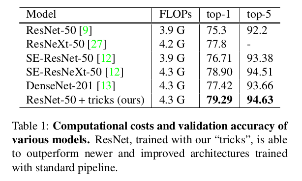
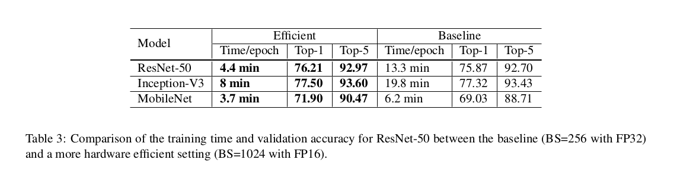
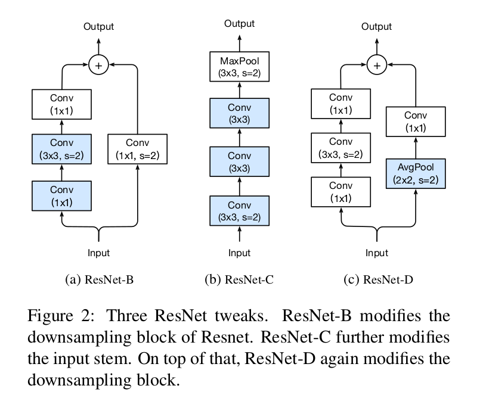
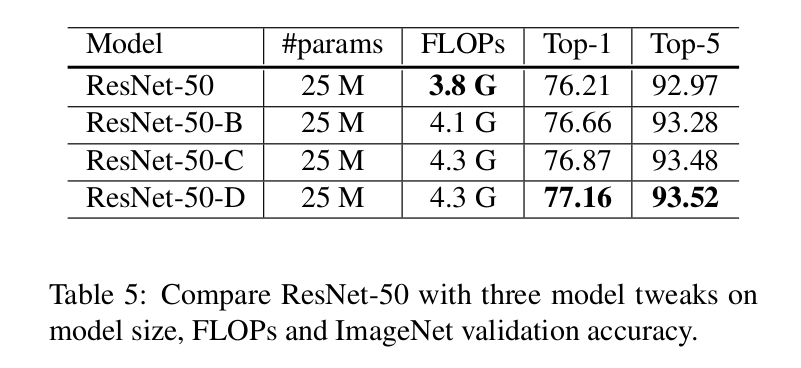
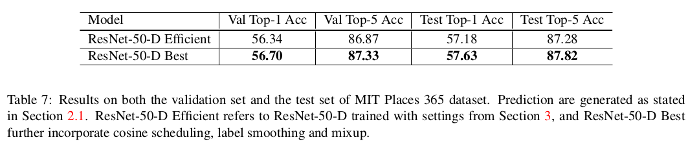
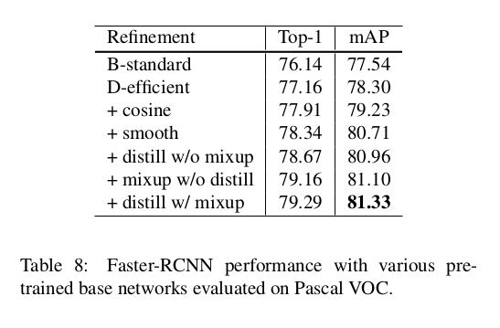

Bag of Tricks for Image Classification with Convolutional Neural Networks
=

# 1. Introduction
虽然，DCNN在图像分类任务上取得了巨大的进步，但是这些进步不仅仅是来源于模型架构的改进。训练过程的改进，包括损失函数的修改、数据预处理和优化方法也扮演着重要角色。在过去几年中已经提出了大量这样的改进，但是受到的关注相对较少。在文献中，大多数只是作为实现细节简要提及，而其他只能在源代码中找到。

本文中，我们将研究一系列训练过程和模型架构改进，以提高模型的准确性，但几乎不会改变计算复杂性。其中许多都是次要的“技巧”，比如修改特定卷积层的步幅或调整学习率计划。但总的来说，它们会产生很大的不同。 我们将在多个网络架构和数据集上对它们进行评估，并将其影响报告给最终的模型准确性。

我们的实验评估表明几种技巧导致显著的准确率提高，并将它们结合在一起能够进一步提高模型准确率。在应用所有技巧后，我们将 ResNet-50 与其他相关网络进行比较，如表 1 。

# 2. Training Procedures

在算法1中给出了训练具有小批量随机梯度下降的神经网络的模板。

## 2.1. Baseline Training Procedure
我们遵循广泛采用的 ResNet 实现作为基线。训练和验证的预处理管道是不同的。在训练期间，我们逐一执行如下步骤：  
1. 随机采样图像并将其解码为 $[0,255]$ 中的 32 位浮点原始像素值。
2. 随机剪裁以一个矩形区域，其纵横比为 $[3/4, 4/3]$ 之间的随机采样，并且面积为 $[0.08, 1.0]$ 的随机采样，然后调整剪裁区域到 $224 \times 224$ 的正方形图像。
2. 以 0.5 的概率水平翻转。
3. 使用服从 $[0.6,1.4]$ 均匀的系数来缩放色调、饱和度和亮度。
4. 添加具有从正太分布 $\cal{N}(0, 0.1)$ 中采样系数的 PCA 噪声。
5. RGB 通道通过减去 $[123.68, 116.779, 103.939]$ 并除以 $[58.393, 57.12, 57.375]$ 将图像标准化。

在验证期间，我们将每个图像的短边调整为 256 个像素，同时保持其纵横比不变。接着，我们在图像中心剪裁 $224 \times 224$ 的区域，并将 RGB 通道与训练相似的标准化。我们在验证期间不执行随增强。

卷尺和全连接层的权重都是用 Xavier 算法初始化。特别的，我们将参数设置为均匀地服从 $[-a, a]$ 之间的随机值，其中 $a = \sqrt{6/(d_{in} + d_{out})}$ 。这里 $d_{in}$ 和 ${d_{out}}$ 分别为输入和输出的通道大小。所有的偏置项设置为 0 。对于批归一化层， $\gamma$ 向量设置初始化为 1 ，$\beta$ 向量初始化为 0 。

使用 Nesterov Accelerated Gradient（NAG）descent 进行训练。每个模型在 8 个NVIDIA V100 GPU上以总批大小 256 训练 120 epoch 。学习率初始化为 0.1， 在 30、 60 和 60 epoch 时除以 10 。

## 2.2. Experiments Results
我们评估三种 CNN ： ResNet-50、 Inception-V3 和 MobileNet 。对于 Inception-V3 ， 我们将输入图像调整为 $299 \times 299$ 。使用 ISLVRC 2012 数据集进行训练。验证准确率如表 2 。可以看出，我们的ResNet-50结果略好于参考结果，而我们的基线Inception-V3和MobileNet由于不同的训练过程而在准确度上略低。

硬件，尤其是GPU，近年来发展迅速。因此，许多与性能相关的权衡的最佳选择已经改变。例如，现在，在训练期间，使用更低的数值精度和更大的批大小更有效。在本节中，我们回归了使用低精度和大批量的多种技术训练，而不牺牲模型准确率。一些技术甚至可以同时提高准确和训练速度。

## 3.1. Large-batch training
小批量 SGD 将多个样本分组到小批量中以增加并行性并降低通信成本。然而，使用大批量可能减慢训练过程。对于凸（convex）问题，收敛速率可能随批量的增加而减小[25]。换句话说，对于相同的 epoch 数，，具有大批量的训练导致与使用较小批量训练的模型相比具有降低的验证准确度的模型。

多项工作[7,14]提出了启发式方法来解决这个问题。在接下来的篇幅中，我们将研究四种启发式方法，这些方法有助于扩大单机训练的批量大小。

**Linear scaling learning rate.** 在 mini-batch SGD 中，梯度下降是一种随机过程，因为样本在每个批中是随机选择的。增加批量大小不同改变随机梯度的期望，但是会减小梯度的方差。换句话说，大批量可以减小梯度的噪声，因此，我们可能会增加学习率以使沿梯度的相反方向作出更大的进步。Goyal等[7]报告了线性增加学习从经验上对 ResNet-50 训练起作用。特别地，如果我们遵循 He[9]等人选择 0.1 作为批大小为 256 的初始学习率，然后当使用一个更大的批量 $b$ 时，我们将增加初始学习率到 $0.1 \times b / 256$ 。

**Learning rate warmup.** 在训练初期，所有的参数通常都是随机值，因此离最终的解决方案还很远。使用一个太大的学习率可能引起数值不稳定。在 warmup 启发式方法中，我们在开始时使用一个很小的学习率，然后当训练稳定时切换为初始学习率。Goyal等人[7]提出渐进的 warmup 策略，其将学习率从 0 线性地增加到初始学习率。换句话说，假设我们在前 $m$ 个批（例如 5 个数据时期）使用 warmup ，并且初始学习率为 $\eta$ ，然后在批 $i, 1 \le i \le m$ ，我们设置学习率为 $i \eta / m$ 。

**Zero $\gamma$ .** ResNet 由多个残差块组成，每个块有几个卷积层组成。给定输入 $x$ ，假设 $block(x)$ 为块中最后一层的输出，然后，这个残差块输出 $x + block(x)$ 。注意，块的最后一层可以使批归一化（BN）层。首先，批归一化层标准化其输入，表示为 $\hat{x}$ ，然后，执行缩放变换 $\gamma \hat{x} + \beta$ 。$\gamma$ 和 $\beta$ 都是可学习参数，其元素分别被初始化为 1 和 0 。在零 $\gamma$ 初始化启发式中，我们将所有 BN 层的 $\gamma$ 初始化为 0 （ $\gamma = 0$ ），BN 层位于残差块的末尾。因此，所有残差块仅返回其输入，模拟的网络层数更少，并且在初始阶段更容易学习。

**No bias decay.** 权重衰减常用于所有可学习的参数，包括权重和偏置项。它等价于将 L2 正则化用于所有参数，使其值趋于 0 。然而，如 Jia等人[14]指出，推荐仅将正则化用于权重以避免过拟合。没有偏差衰减的启发式遵循这种推荐，它仅将权重衰减用于卷积和全连接层的权重。其他参数，包括偏差与 BN 层的 $\gamma$ 和 $\beta$ ，不使用正则化。

注意， LARS 提供了逐层的自适应学习率，并报告了在极端大批量（超过 16K）上的有效性。然而，本文中，我们只局限于满足单机训练的方法，在这种情况下，批大小不超过 2K 往往带来良好的系统效率。

## 3.2. Low-precision training
神经网络通常以 32位浮点（FP32）精度训练。即，所有的数值以 FP32 格式存储，并且数学运算的输入和输出也都是 FP32 数值。然而，新的硬件可以增强的更低精度数据类型的逻辑单元。例如，前面提到的Nvidia V100在FP32中提供14 TFLOPS，在FP16中提供超过100 TFLOPS。如表 3 ，综合训练速度从 FP32 切换到 FP16 加速了 2 到 3 倍。

尽管具有性能优势，但精度降低的范围更窄，使得结果更有可能超出范围，从而影响训练进度。Micikevicius等人[19]突出以 FP16 存储所有参数和激活，并使用 FP16 计算梯度，与此同时，所有参数在 FP32 上有一个副本用以进行参数更新。此外，将标量乘以损失以更好地将梯度范围对准到FP16也是一种实用的解决方案。

## 3.3. Experiment Results
ResNet-50 的评估结果如表3所示。相比具有批大小 256 和 FP32 的基线，使用更大的 1024 批量和 FP16 将 ResNet-50 的每个时期的训练时间从 13.3 分钟降到 4.4 分钟。此外，通过堆叠所有大批量训练的启发式方法，以 1024 批量和 FP16 训练的模型与基线模型相比甚至提高了 0.5% 的 top-1 准确率。

仅通过线性缩放学习率将批量大小从256增加到1024导致 top-1 精度降低0.9％，而其余三个启发式叠加填补了这一差距。在训练结束时从FP32切换到FP16不会影响精度。

# 4. Model Tweaks
模型调整是对网络体系结构的微小调整，例如改变特定卷积层的步幅。如此的调整通常很少会改变计算复杂度，但是在模型的准确率上可能有不可忽略的影响。本节中，我们将 ResNet 作为例子来研究模型调整的影响。

## 4.1. ResNet Architecture

我们将简要介绍 ResNet 架构，特别是与模型调整相关的模块。有关详细信息，请参阅He等人[9]。 ResNet 网络由输入茎干、四个候选阶段和最终输出层组成，如图1所示。输入茎干为 64 通道和步长为 2 的 $7 \times 7$ 卷积，接着是步长也为 2 的 $3 \times 3$ 最大池化层。输入茎干将输入的宽和高减小 4 倍，而正通道数增加到 64 。

从阶段 2 开始，每个阶段以下采样块开始，然后是几个残差块。在下采样块中，有路径 A 和路径 B 。路径 A 有三个卷积层，它们的核大小分别为 $1 \times 1$ 、 $3 \times 3$ 和 $1 \times 1$ 。第一个卷积的是步长为 2 ，使得输入宽和高减半，并且最后一个卷积的输出是前两卷积的四倍，这称为瓶颈结构。路径 B 使用步长为 2 的 $1 \times 1$ 卷积将输入的形状转换为与路径 A 的输出形状相同，因此，我们能够将两个路径的输出相加以获得降采样块的输出。除了使用步长为1的卷积外，残差块与降采样快相似。

人们可以改变残差块在每个阶段的数量以获得不同的 ResNet 模型，例如 ResNet-50 和 ResNet-152，其中数字代表网络中卷积层的数量。

## 4.2. ResNet Tweaks
接下来，我们回归两种流行的 ResNet 调整，我们称它们为 ResNet-B 和 Res-C 。之后，我们提出一种新的模型调整 ResNet-D 。

**Res-B.** 这中调整首先出现 ResNet 的 Torch 实现，然后在多个工作中[7,12,27]采用。它改变 ResNet 的降采样块。该观察为，由于步长为 2 的 $1 \times 1$ 核，路径 A 中的降采样块忽略 $3/4$ 的输入特征图。 ResNet-B 将路径 A 中的前两个卷积的步长交换，如图2a所示，因此没有信息被忽略。因为第二个卷积的核大小为 $3 \times 3$ ，路径 A 的输出形状保持不变。

**ResNet-C.** 这种调整最粗在 Inception-v2 中提出，并且其可以在其他模型中发现，例如 SENet、 PSPNet、 DeepLabV3 和 ShuffleNetV2 。观察结果是卷积的计算代价是核宽或高的二次函数。因此，这种调整将 $7 \times 7$ 卷积替换为三个连续的 $3 \times 3$ 卷积的输入茎干，其如图2b所示，其第一个和第二个卷积有 32 个输出通道，并且第一个卷积的步长为 2 ，同时最后一个卷积使用 64 个输出通道。

**ResNet-D.** 受 ResNet-B 的启发，我们注意到，在降采样块路径 B 中的 $1 \times 1$ 卷积也忽略了 3/4 的输入特征图，因此我们想要修改它使得没有信息被忽略。经验上，我们发现在卷积（步长为1）之前添加一个步长为 2 $2 \times 2$ 平均池化层在实践中工作良好，并且不影响计算代价。这种调整如图 2c 。

## 4.3 Experiments Results
我们评估三种调整和第3节中描述的设置（即批大小为 1024， 精度为 FP16 ）的 ResNet-50 ，结果如表5 。

从结果可知，ResNet-B 在降采样块的路径 A 中接收到更多的信息，并且比 ResNet-50 提高了 0.5% 的准确率。将 $7 \times 7$ 卷积替换为3个 $3 \times 3$ 的卷积得到另外 0.2% 的提高。在降采样块的路径 B 中获得更多的信息提高另外 0.3% 的验证准确率。总之，ResNet-50-D 比 ResNet-50 提高了 1% 。

另一方面，这四个模型具有相同的模型大小。ResNet-D 具有最大的计算成本，但与 ResNet-50 相比，它在浮点运算方面的差异在 15％ 以内。实践中，我们观察到与 ResNet-50 相比，ResNet-50-D 的训练吞吐量仅慢3％。

# 5. Training Refinements
在本节中，我们将描述旨在进一步提高模型准确性的四项训练改进。

## 5.1. Cosine Learning Rate Decay
学习率调整对训练至关重要。在 3.1 节中的学习率 warmup 之后，我们通常从初始学习率稳定地降低学习率的值。广泛使用的策略是指数衰减学习率。He等人[9] 每30个时期降低0.1的速度，我们称之为“step decay”。Szegedy等人[26] 每两个时期降低率为0.94。

相比之下，Loshchilov等人[18]提出余弦退货策略（cosine annealing strategy）。简化版本是通过遵循余弦函数将学习率从初始值降低到0。假设批的总量为 T （warmup 阶段忽略），然后，在批 $t$ ，学习率 $\eta_t$ 计算为:
$$\eta_t = \frac{1}{2}(1 + \cos(\frac{t\pi}{T})) \eta \tag 1$$
其中 $\eta$ 是初始学习率。我们成这种计划为 “cosine decay” 。

“step decay” 与 “cosine decay” 之间的比较如图3a所示。“cosine decay” 在开始阶段缓慢的降低学习率；然后，在中间阶段几乎是线性的减小；最后阶段学习率又开始缓慢减小。与 “step decay” ，“cosine decay” 从一开始就开始衰减学习，但仍然很大，直到逐步衰减将学习率降低10倍，这可能会改善训练进度。

## 5.2. Label Smoothing
图像分类网络的最后一层通常是隐藏单元数等于标签数（用 $K$ 表示）的全连接层，其用于输出预测置信度得分。给定一幅图像，用 $z_i$ 表示类 $i$ 的预测得分。这些得分通过 softmax 标准化以获得预测概率。用 $q$ 表示softmax $q = \mbox{softmax}(z)$ 的输出，类 $i$ 的概率 $q_i$ 为：
$$q_i = \frac{\exp(z_i)}{\sum_{j=1}^K\exp(z_j)} \tag 2$$
容易看出， $q_i > 0$ 且 $\sum_{i=1}^K q_i = 1$ ，因此 $q$ 是有效的概率分布。

另一方面，假设该图像的真实标签为 $y$ ，我们可以构建一个真实概率分布， 如果 $i=y$ ， 则 $p_i = 1$ ；否则， $p_i = 0$ 。在训练期间最小化负交叉熵损失:
$$L(p,q) = - \sum_{i=1}^K p_i \log q_i  \tag 3$$
这种优化方法更新模型参数以使这两个概率分布彼此相似。特别地，通过如何构建 $p$ 的方式，我们知道 $L(p,q) = -\log p_y = -z_y + \log (\sum_{i=1}^K \exp(z_i))$ 。当其他值保持足够小时，最优解为 $z_y^\ast = \inf$ 。换句话说，它鼓励输出分数显著区别，这可能导致过度拟合。

标签平滑的思想是在训练 Inception-v2 中首先提出。它改变了真实概率的构成：
$$
q_i =
\begin{cases}
1 - \varepsilon & \mbox{ if } i = y,  \\
\varepsilon / (K - 1) & \mbox{ otherwise}
\end{cases} \tag 4
$$
其中 $\varepsilon$ 是一个很小的常量。现在，最优解变为：
$$
z_i^\ast =
\begin{cases}
\log((K-1)(1 - \varepsilon) / \varepsilon) + \alpha & \mbox{ if } i = y ,  \\
\alpha  & \mbox{ otherwise}
\end{cases} \tag 5
$$
其中 $\alpha$ 可以任意的实数。这鼓励从全连接层的有限输出，并且能够更好的泛化。

当 $\varepsilon = 0$ ，差距 $\log((K-1)(1 - \varepsilon) / \varepsilon)$ 为 $\infty$ ，并且，随着 $\varepsilon$ 的增加，差距会减小。具体地，当 $\varepsilon = (K-1)/K$ 时，所有最优值 $z_i^\ast$ 是相同的。图 4a 表明了这种差距随着 $\varepsilon$ 的移动是如何改变的（在ImageNet数据集上 $K = 1000$）。

我们通过实验比较了两个 ResNet-50-D 模型的输出值，这两个模型为使用和没有使用标签平滑训练，并且计算最大预测值和余下值的平均之间的差距。在 $\varepsilon = 0.1$ 和 $K = 1000$ 下，理论差距约为 9.1 。图 4b 表明了两个模型在 ImageNet 验证集上的差距的分布。很明显，通过标签平滑，分布中心处于理论值并具有较少的极值。

## 5.3. Knowledge Distillation
在知识蒸馏中[10]，我们使用教师模型来辅助训练当前的模型，其称为学生模型。教师模型通常为具有更高准确率的预训练模型，因此，通过模仿，学生模型能够提高其本身的准确率，同时保持模型的复杂度相同。一个例子是使用 ResNet-152 作为教师模型来帮助训练 ResNet-50 。

在训练期间，我们添加蒸馏损失来惩罚学生模型和学习模型的 softmax 输出之间的差异。给定输入，假设 $p$ 是真实概率分别，并且 $z$ 和 $r$ 分别为学生模型和教师模型的全连接层的输出。之前使用的负交叉熵损失 $L(p, \mbox{softmax}(z))$ 来衡量 $p$ 和 $z$ 之间的差异，这里，我们也使用相同的损失来蒸馏。因此，损失变为：
$$
\begin{alignat}{2}
&L(p, \mbox{softmax}(z)) \\
& + T^2 L(\mbox{softmax}(r/T), \mbox{softmax}(z/T))
\end{alignat}
\tag 6
$$
其中 $T$ 为 temperature 超参数，用以使 softmax 输出更加平滑，因此，蒸馏教师预测的标签分布的知识。

## 5.4. Mixup Training
在 2.1 节中，我们描述了图像在训练之前是如何增强的。这里，我们考虑另一种称为 mixup 的增强方法。在 mixup 中，每次随机采样两个样本 $(x_i, y_i)$ 和 $(x_j, y_j)$ 。然后，我们通过这两个样本的加权线性插值组成一个新的样本：
$$\hat{x} = \lambda x_i + (1 - \lambda) x_j  \tag 7$$
$$\hat{y} = \lambda y_i + (1 - \lambda) y_j  \tag 8$$
其中 $\lambda \in [0, 1]$ 为服从 $Beta(\alpha, \alpha)$ 分布的随机数。在 mixup 训练中，我们仅使用这个新样本 $(\hat{x}, \hat{y})$ 。

## 5.5. Experimental Results
现在，我们评估四种训练修改。我们设置 $\varepsilon = 0.1$ 用于标签平滑。对于模型蒸馏，我们使用 $T = 20$ ，具体地，将使用余弦衰减和标签平滑预训练的 ResNet-152-D 模型用作教师模型。在 mixup 训练，我们选择 $\alpha = 0.2$ 的 Beta 分别，并将时期数从 120 到 200 ，因为混合的样本需要更长的训练过程以更好的收敛。当结合 mixup 训练和蒸馏时，我们也使用 mixup 训练教师模型。

我们强调修改不仅局限于 ResNet 架构或 ImageNet 数据集。首先，我们在修改的ImageNet数据集上训练 ResNet-50-D、 Inception-V3 和 MobileNet ，验证准确率如表6 。通过堆叠余弦衰减、标签平滑和 mixup ，我们稳定地改善这三个模型。蒸馏在 ResNet 上工作良好，但是对于 Inception-V3 和 MobileNet 不起作用。我们的解释是，教师模型不是来自相同的学生家族，因此预测中有不同的分布，并给模型带来负面影响。

为了支持将我们的技巧迁移到其他数据集，我们在 MIT Places365 数据集上训练了一个 ResNet-50 模型，结果如表 7 。我们可以看到在验证集和测试集上 top-5 准确率的提高是一致的。

# 6. Transfer Learning
迁移学习是使用训练好的图像分类模型的一个主要的下游任务。在本节中，我们将研究，目前讨论的这些改进是否对于迁移学习有好处。特别地，我们选择两个重要的计算机视觉任务——目标检测和语义分割，并通过不同的基础模型评它们的性能。

## 6.1 Object Detection
目标检测的目标是定位图像中目标的边界框。我们使用 PASCAL VOC 评估性能。与 Ren 等人[22]相似，我们也使用 VOC 2007 trainval 和 VOC 2012 trainval 的并集进行训练，并使用 VOC 2007 test 进行评估。我们在这个数据集上训练 Faster-RCNN，修改包括线性 warmup 和长训练计划。Faster RCNN 的 VGG-19 基础模型替换为前面提到的不同预训练模型。我们保持其他设置相同，使得增益单独来自基础模型，mAP 结果如表 8 。

## 6.2. Semantic Segmentation

