## Bridging the Gap Between Anchor-based and Anchor-free Detection via Adaptive Training Sample Selection

### Abstract

​		几年来，基于锚点的检测器一直占据着目标检测的主导地位。最近，由于FPN和Focal Loss的提出，无锚检测器越来越流行。本文中，我们首先指出基于锚与无锚检测之间的差异实际上是**如何定义正负训练样本**，其导致它们之间的性能差距。训练期间，如果它们采用相同的正负样本定义，那么不管回归来自边界框或点，最终都不会表现出明显差异。 这表明如何选择正负训练样本对于当前的目标检测器很重要。然后，我们提出Adaptive Training Sample Selection（ATSS），其根据目标的统计特性自动选择正负样本。它明显提高基于锚和无锚检测器的性能，并弥补它们之间的差距。最后，我们讨论在图像上的每个位置平铺多个锚来检测目标的必要性。在MS COCO上执行大量实验支持我们前面的分析和结论。利用新引入的ATSS，我们将最佳检测器的AP大幅提升到50.7%，而没有引入任何开销。代码见https://github.com/sfzhang15/ATSS.

### 1	引言

​		目标检测是计算机视觉领域中的长期主题，旨在检测预定类别的目标。准确的目标检测将对包括图像识别和视频监控在内的各种应用产生深远的影响。最近几年，随着CNN的进步，目标检测由基于锚的检测器主导，它一般可以分为一阶段方法和两阶段方法。它们都首先在图像上平铺大量预设的锚，然后通过一次或几次预测类，并细化这些锚的坐标，最后输出这些精炼的锚作为检测结果。因为两阶段方法比一阶段方法多几次精炼锚，所以前者由更准确的结果，而后者计算效率更高。常用基准测试上的最佳结果仍优基于锚的检测器占据。

​		由于FPN [32]和Focal Loss [33]的出现，最近的学术注意力转向了无锚检测器。无锚检测器以不同的方式直接找出目标，而没有预设的锚。一种方式是定位几个预定义或自学习的关键点，然后限制目标的空间范围。我们称这种类型的无锚检测器为基于关键点的方法。另一种方式是，使用中心点或目标区域来定义正类，然后预测正类到目标边界的四个距离。我们称这种类型的无锚检测器为基于中心点的方法。这些无锚检测器能够消除与锚相关的超参数，并获得与基于锚检测器相似的性能，使它们在泛化能力方面更有潜能。

​		这两种无锚检测器之中，基于关键点的方法遵循标准的关键点流水线，其与基于锚的检测器不同。然而，基于中心的检测器与基于锚的检测器相似，其将点视为预设的样本，而不是将锚框视为样本。以基于锚的一阶段检测器RetinaNet和基于中心的无锚检测器FCOS为例，它们之间主要由三个差异：（1）每个位置平铺的锚数量。RetinaNet在每个位置平铺几个锚框，而FCOS在每个位置平铺一个锚点（FCOS的点等价于RetinaNet的锚框的中心）。（2）正负样本的定义。RetinaNet正负求交并比（IoU），而FCOS利用空间和尺度约束选择样本。（3）回归开始状态。RetinaNet从预设的锚框回归目标边界框，而FCOS从锚点定位目标。如[56]报告的，无锚FCOS获得得性能远好于基于锚的RetinaNet，值得研究这三个差异中的哪一个是造成性能差距的重要因素。

​		本文中，我们通过严格排除两者之间的所有实现不一致之处，以公平的方式研究基于锚的方法与无锚的方法之间的差异。根据实验结果可以总结出，这两类方法之间的关键差异是正负训练样本之间的定义，其导致它们之间的性能差距。训练期间，如果它们选择相同的正负样本，那么，无论来自框或点的回归，最终的性能之间没有明显的差距。因此，**如何选择正负训练样本值得进一步研究**。受其启发，我们提出新的Adaptive Training Sample Selection（ATSS），其基于目标统计特性自动选择正负样本。它弥补基于锚和无锚检测之间的差距。此外，通过一系列实验，得到一个结论，**在图像的每个位置平铺多个锚来检测目标是不必要的**。MS COCO[34]上的广泛实验支持我们的分析和结论。通过应用新引入的ATSS获得50.7%的AP，而没有任何开销。这项工作的主要贡献总结如下：

- 指出基于锚和无锚检测器之间的关键差异实际上是如何定义正负训练样本。
- 提出自适应训练样本选择（ATSS），其根据目标的统计特性来自动选择正负训练样本。
- 证明在图像的每个位置平铺多个锚来检测目标是无用操作。
- 在MS COCO上获得最佳性能，而没有引入额外的开销。

### 2    相关工作

​		当前基于CNN的目标检测包含基于锚的检测器和无锚检测器。前者可以分为两阶段和一阶段方法，而后者分为基于关键点和基于中心的方法。

#### 2.1. 基于锚的检测器

​		**两阶段方法**	Faster R-CNN [47]的出现确立了基于两阶段锚的检测器的主导地位。Faster R-CNN包含单独的RPN和逐区域的预测网络（R-CNN）来检测目标。之后，提出大量算法来改进其性能，包括架构重新设计和改革[4、9、5、28、30]、上下文和注意力机制[2、51、38、7、44]、多尺度训练和测试[54、41]、训练策略和损失函数[40、52、61、17]、特征融合和增强[25、32]、更好的提议和平衡[55、43]。时至今日，基于锚的两阶段方法在标准检测基准上仍保持最先进的结果。

​		**一阶段方法**	随着SSD的发明，由于基于锚的一阶段检测器的高计算效率，它吸引很多注意力。SSD在ConvNet内的多个尺度层上分布锚框，以直接预测目标类别和锚框偏移。此后，提出大量工作在不同方法提升其性能，例如融合不同层的上下文信息[24、12、69]、从头训练[50、73]、引入新的损失函数[33、6]、锚精炼和匹配[66、67]、架构重设计[21、22]、特征丰富和对齐[35、68、60、42、29]。目前，基于锚的一阶段方法可以以更快的推理速度实现与基于锚的两阶段方法接近的性能。

#### 2.2. 无锚检测器

​		**基于关键点的方法**	这类无锚方法首先定位几种与定义或自学习的关键点，然后生成边界框以检测目标。CornerNet将目标边界框检测为一对关键点（左上角和右下角），CornerNet-Liter引入CornerNet-Saccade和CornerNet-Squeeze来提高其速度。Grid R-CNN的第二阶段[39]通过预测具有FCN位置敏感性优点的网格点，然后确定由网格引导的边界框来定位目标。ExtremeNet检测四个极点（top-most、left-most、bottom-most、right-most）和一个中心点来生成目标边界框。Zhu等[70]使用关键估计来找到目标的中心点，并回归包括大小、3D位置、方向和姿态的其他所有属性。CenterNet[11]将CornerNet扩展为triplet，而不是一对角点来提高准确率和召回率。RepPoints[65]将目标表示为一组采样点，并学习以限制目标空间范围并指示语义上重要的局部区域的方式安排自身。

​		**基于中心的方法**	这类无锚的方法将目标的中心（例如中心点或部分）视为前景以定义正类，然后预测正类到目标边界框四条边的距离，以进行检测。YOLO[45]将图像分为$S \times S$的网格，包含目标中心的网格单元负责检测这个目标。DenseBox [20]使用位于对象中心的实心圆定义正值，然后预测从正值到目标边界框边界的四个距离。GA-RPN[59]将目标中心区域的像素定义为正类，从而为Faster R-CNN的目标提议预测位置、宽和高。FSAF[72]将具有在线特征选择的无锚分支附加到RetinaNet。新添加的分支将目标的中心区域定义为正类，以通过预测到其边界的四个距离来定位它。FCOS[56]将目标边界框内的所有位置视为具有四个位置的正类，并以新颖的centerness得分检测目标。CSP[37]仅将目标边界框的中心点定义为正类，从未检测具有固定纵横比的行人。FoveaBox[23]将目标的中心部分的位置视为具有四个距离的正类，从而执行检测。

### 3.	基于锚和无锚检测的差异分析

​		不失一般性，采用代表性的基于锚的RetinaNet和无锚FCOS来解剖它们的差异。本节中我们关注最后两种差异：正/负样本定义和回归开始的状态。余下的一个差异（每个位置平铺的锚的数量）将在后面章节中讨论。因此，对于RetinaNet，每个位置仅平铺一个正方形锚，这与FCOS非常相似。剩下的部分中，我们首先介绍实验设置，然后排除所有的实现不一致，最后指出基于锚和无锚检测器的关键差异。

#### 3.1. 实验设置

​		**数据集**	所有实验在MS COCO数据集（包含80个目标类）上执行。遵循常用实践[33、56]，$\mbox{trainval35k}$ 中的115K图像用于训练，$\mbox{minival}$中的5K图像用作验证，进行分析研究。我们还将主要结果提交给评估服务器，以获取test-dev的最终性能。

​		**训练细节**	我们使用ImageNet预训练的具有5级金字塔结构的ResNet-50作为骨干。新添加的层使用与[33]相同方式初始化。对于RetinaNet，5级金字塔中的每一层与具有$8 S$尺度的一个正方形锚关联，其中$S$是合计的步长。训练期间，我们调整输入图像以保持它们的短边为800，它们的较长边小于等于1333。使用SGD算法训练网络90K迭代，其中动量为0.9、权重衰减为0.0001、皮大小为16。我们将学习率设置为0.01，迭代60K和80K时，分别乘以0.1。除非其他说明，实验中使用前面的训练细节。

​		**推理细节**	在推理期间，我们将使用训练阶段相同的方式调整输入图像，然后将其馈入整个网络以输出具有预测类的边界框。此后，我们使用预设的分0.05过滤大量背景边界框，然后每个特征金字塔输出前1000个检测。最后，将IoU阈值0.6的NMS用于每个类以生成前100个可信检测。

#### 3.2. Inconsistency Removal

​		我们将每个位置仅有一个正方形锚框的RetinaNet标记为**RetinaNet（#A=1）**，其几乎与无锚检测器FCOS相同。然而，如[56]报告，FCOS在MS COCO minval子集上的AP性能大幅优于RetinaNet（#A=1），即37.1% vs. 32.5% 。此外，FCOS作出了一些新的改进，包括将centerness移动到回归分支、使用GIoU损失函数和通过对应步长规范化目标。这些改进将FCOS的性能从37.1%到37.8%，使这种差距更大。然而，基于锚的检测器（32.5%）与无锚检测器（37.8%）的AP差距部分来自FCOS提出的一些普通的改进，例如在头部添加GroupNorm、使用GIoU回归损失函数、限制ground-truth框中的正样本、引入centerness分支以及为每级特征金字塔添加可训练的标量。这些改进还可以用于基于锚的检测器，因此它们不是基于锚和无锚方法之间的关键差异。我们将它们逐个用于RetinaNet（#A=1），以排除这些实现的不一致。如表1所示，这些不相干的差异将基于锚的RetinaNet的AP提高到37.0%，这与无锚的FCOS仍有0.8%的差距。现在，在移除所有不相干的差异之后，我们可以公平地探索基于锚和无锚检测器之间的关键差异。

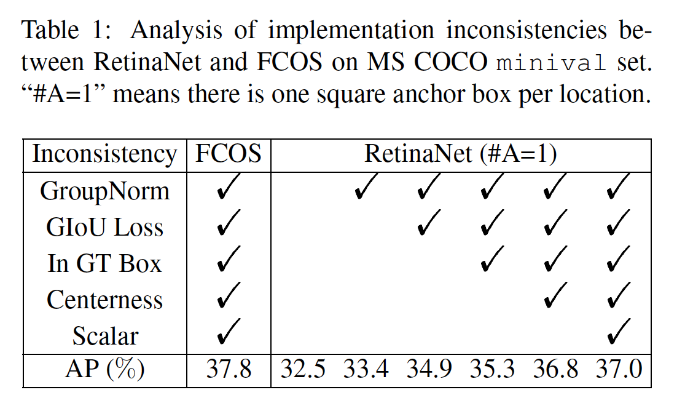

#### 3.3. Essential Difference

 		在使用这些通用改进后，这仅是基于锚的RetinaNet（#A=1）和无锚FCOS的两个差异。一个是关于检测中分类子任务，即定义正负样本的方式。另一个是关于回归任务，即从锚框或锚点回归。

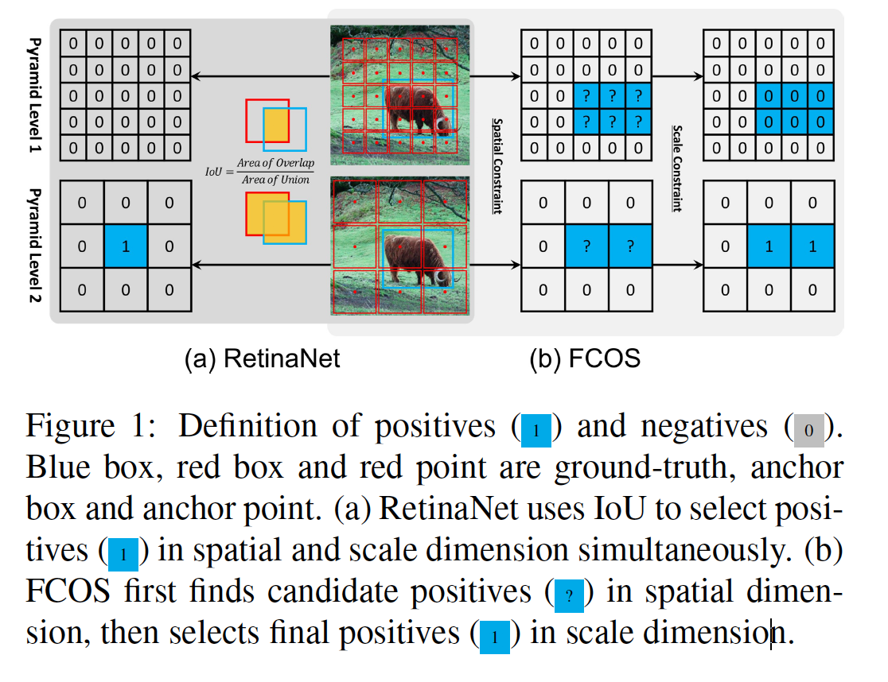

​		**分类**	如图1（a）所示，RetinaNet利用IoU将不同金字塔级的锚框分为正类和负类。它首先将每个目标的最佳锚框与$\mbox{IoU} > \theta_p$的锚框标记为正类，然后将$\mbox{IoU} < \theta_n$的锚框标记为负类，最后训练期间忽略其他锚框。如图1（b），FCOS使用空间和尺度约束来划分不同金字塔级的锚点。它首先将ground-truth框内的锚点视为候选正样本，然后基于每个金字塔级定义的尺度范围，从候选中选择最终的正样本，最后那些未选择的锚点为负样本。

​		如图1所示，FCOS首先使用空间约束来找到空间维度中的候选正样本，然后使用尺度约束来选择尺度维度中的最终正样本。相比之下，RetinaNet利用IoU以直接选择空间和尺度维度中的最终正样本。这两个不同的样本选择策略产生不同的正负样本。如表2的第一列所示，对于RetinaNet（#A=1），使用空间和尺度约束策略，而不是IoU策略将AP从37.0%提高到37.8%。对于FCOS，如果让使用IoU策略来选择正样本，AP性能从37.8%降到36.9%，如表2的第二列。这些结果证明正负样本的定义是基于锚和无锚检测器的关键差异。

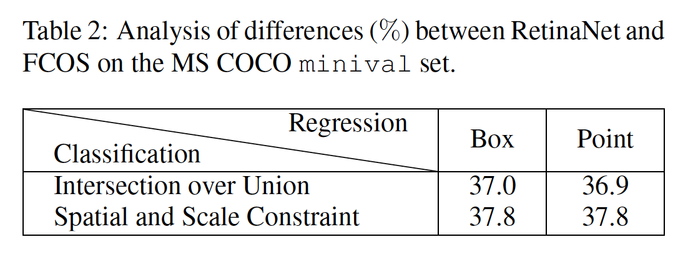

​		**回归**	在确定正负样本之后，如图2（a）所示，目标的位置从正样本回归。RetinaNet从具有（如图2（b））锚框和目标框之间的四个偏移回归目标位置，而FCOS从（如图2（c））到目标边界的四个距离回归锚点。它意味着，对于正样本，RetinaNet回归的开始状态是边界框，而FCOS为点。但是，如果表2的第一和第二行，当RetinaNet和FCOS采用相同的策略，具有一致的正负样本，无论从点或边界框开始回归，最终结果没有明显的差异，即37.0% vs. 36.9%，37.8% vs. 37.8%。这些结果表明回归开始的状态是无关差异，而不是关键差异。

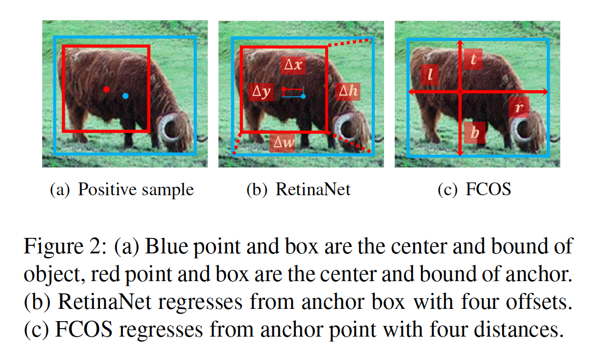

​		**总结**	根据这些公平执行的实验，我们指出基于锚的一阶段方法和基于中心的无锚检测器之间的关键差异实际上是**如何定义正负训练样本**，这对于当前的目标检测非常重要，并仍待进一步研究。

### 4. Adaptive Training Sample Selection

​		当训练目标检测器时，我们首先需要为分类定义正负样本，然后使用正样本回归。根据前面的分析，前者是关键，而无锚检测器FCOS改进了这一步。它引入定义正负样本的新方式，其获得比传统基于IoU策略更好的性能。受此启发，我们探索目标检测中的最基本问题：*如何定义正负训练样本*，并提出Adaptive Training Sample Selection（ATSS）。与那些传统策略相比，我们的方法几乎没有额外超参数，并且对不同设置具有鲁棒性。

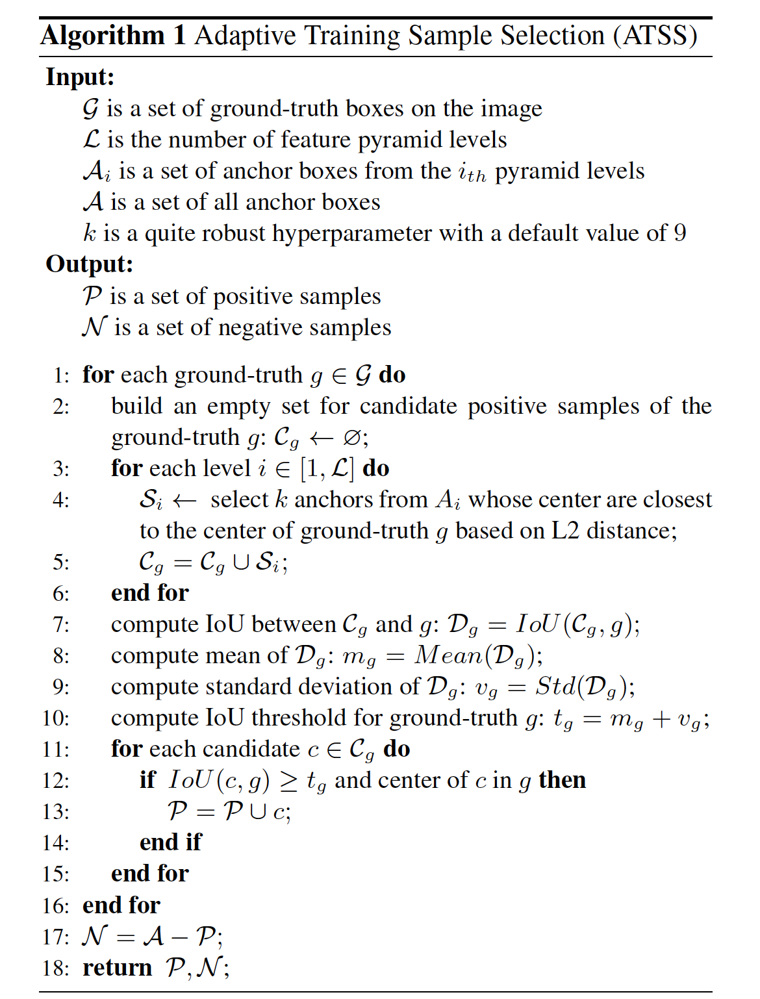

​		为此，我们提出ATSS方法，其根据目标统计量自动划分正负样本，而没有任何超参数。算法1描述所提出的方法是如何用于输入图像。对于输入图像上的每个ground-truth边界框$g$，我们首先找出其候选正样本。如第三行到第6行描述的，在每个金字塔上，基于L2距离，选择最接近$g$中心的$k$个锚框。假设有$\mathcal{L}$个特征金字塔层，那么ground-truth边界框将有$k \times \mathcal{L}$个候选正样本。之后，第7行中，我们将候选和ground-truth $g$之间的IoU计算为 $\mathcal{D}_g$，其均值和方差计算为$m_g$和$v_g$（8行和9行）。利用这些统计量，获得这个ground-truth $g$的IoU阈值为$t_g = m_g + v_g$（10行）。最后，选择候选中IoU大于或等于阈值$t_g$的锚框作为最终的正样本（11到15行）。值得注意的是，我们还将正样本的中心限制到ground-truth中（12行）。此外，如果一个锚框分配给多个ground-truth框，选择IoU最大的ground-truth框。余下的为负样本。我们的方法的一些动机解释如下。

**基于锚框和目标中心之间的距离选择候选。**对于RetinaNet，当锚框中心更接近目标中心时，IoU更大。对于FCOS，更接近目标中的锚点产生更高质量的检测。因此，更接近目标中心的锚是更好的候选。

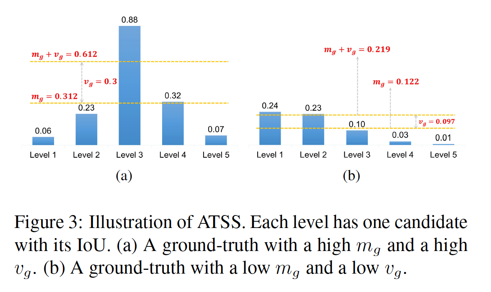

**使用均值和标准差之和作为IoU阈值。**目标的IoU均值$m_g$是该目标的预设锚的适用性衡量。如图3（a）所示的高$m_g$表明它有高质量的候选，IoU阈值应该很高。此外，如图3（b）所示的低$m_g$表明大多数候选都是低质量的，IoU阈值应当较低。此外，目标IoU的标准差$v_g$是哪一层适合检测该目标的测量。如图3（a）所示的高$v_g$表示存在一个金字塔层特别适合该目标，将$v_g$加到$m_g$获得高阈值，从而仅从该层选择正样本。如图3（b）的低$v_g$表示存在几个金字塔层适合该目标，将$v_g$加到$m_g$获得较低阈值，从而从这些层选择合适的正样本。使用均值$m_g$和标准差$v_g$之和作为IoU阈值，可以根据目标的统计特性自适应地为每个目标选择合适的金字塔层。

**将正样本的中心限制到目标之中。**目标中心之外的锚是较差的候选，并通过目标之外的特征预测，这不利于训练，应到排除。

**维持不同目标之间的公平性。**根据统计原理，理论上大于16%的样本位于置信区间$[m_g+v_g, 1]$。尽管候选的IoU不是标准的正态分布，但是统计结果表明每个目标有大约$0.2 \ast k\mathcal{L}$个正样本，它们对于尺度、纵横比和位置是不变的。相比之下，对于更大的目标，RetinaNet和FCOS的策略倾向远远更多的正样本，这导致不同目标之间的不公平。

**保持几乎没有超参数。**我们的方法仅有一个超参数$k$。随后的实验证明，它对$k$的变化非常不敏感，所提出的ATSS可以认为几乎没有超参数。

#### 4.2. Verification

**基于锚的RetinaNet**	为了验证我们的基于锚的自适应训练样本选择的有效性，我们使用ATSS替换改进的RetinaNet（#A=1）中的传统策略。如表3所示，它一致性地将$\mbox{AP}$、$\mbox{AP}_{50}$、$\mbox{AP}_{75}$、$\mbox{AP}_{S}$、$\mbox{AP}_{M}$和$\mbox{AP}_{L}$分别提高2.3%、2.4%、2.9%、2.9%、2.1%和2.7%。这些改进主要源自基于每个ground-truth的统计特性的正样本的自私应选择。因为我们的方法仅重新定义正负样本，而没有任何的额外开销，这些改进可以视为无成本的。

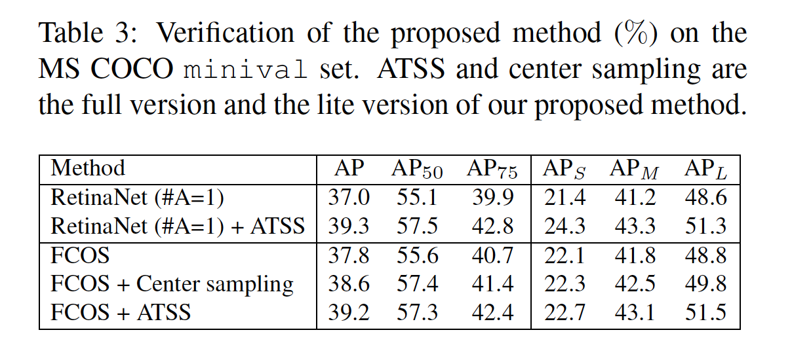

**无锚的FCOS**	所提出的方法还可以应用于两种不同版本的无锚FCOS：lite版和full版。对于lite版，我们将ATSS的一些思想用于FCOS，即将其选择候选正样本的方式替换为我们的方法。FCOS将目标框中的锚点视为候选，这导致大量的低质量正类。相比之下，我们的方法为每个目标在每个金字塔层选择前$k=9$个候选。我们方法的lite版融合官方的FCOS代码中，作为中心采样（center samping），这将FCOS的AP从37.8%提高到38.6（见表3）。但是，尺度范围的超参数仍在lite版中使用。

​		对于full版，我们令FCOS中的锚点变为具有尺度$8S$的锚框，从而定义正负样本，然后仍将这些正样本从如FCOS的锚点回归到目标。如表3所示，它将将$\mbox{AP}$、$\mbox{AP}_{50}$、$\mbox{AP}_{75}$、$\mbox{AP}_{S}$、$\mbox{AP}_{M}$和$\mbox{AP}_{L}$分别提高1.4%、1.7%、1.7%、0.6%、1.3%和2.7%。值得注意的是，这两个样本在空间维度上选择相同的候选，但是沿着尺度维度选择从候选中选择最终的正样本。如表3的最后两行，full版（ATSS）在不同的度量上大幅领先lite版（center sampling）。这些结果表明，我们的方法中的自适应方法要比FCOS中的固定方法要好，它可以沿着尺度维度从候选目标中选择正样本。

#### 4.3. 分析

​		利用提出的自适应训练样本选择来训练目标检测器仅涉及一个超参数$k$和一个相关的锚框设置。 本小节逐一分析它们。

​		**超参数$k$**

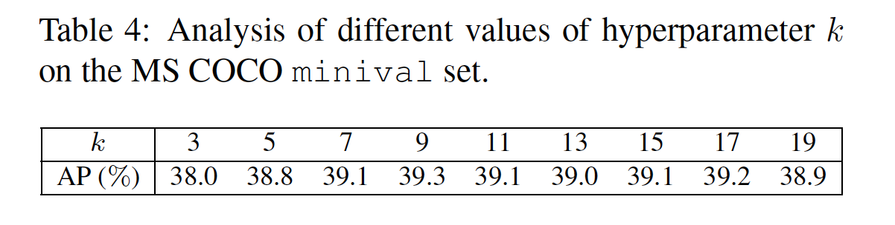

​		**锚尺寸** 	在前面的实验中，在每个位置平铺一个尺度为$8S$（$S$表示当前金字塔层的）的正方形锚。如表5所示，我们使用$[5、6、7、8、9]$中的不同尺度的方形锚进行了一些实验，性能相当稳定。

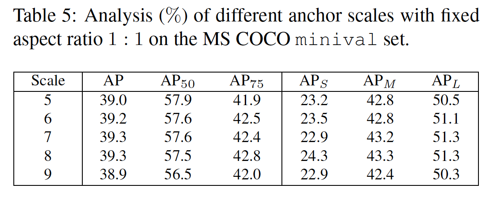

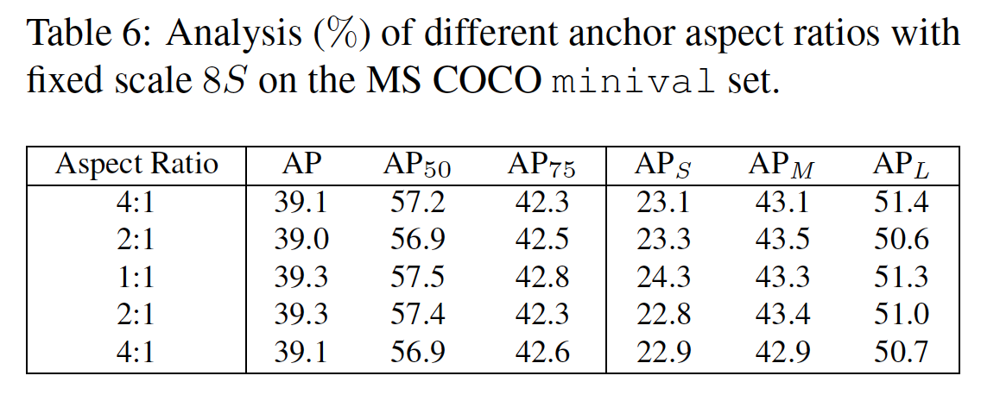

#### 4.4. 比较

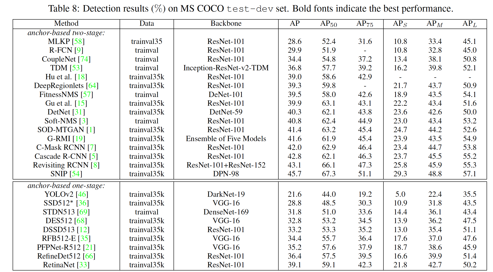

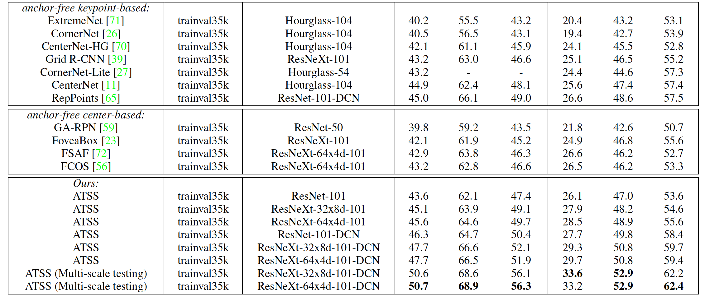

#### 4.5. 讨论

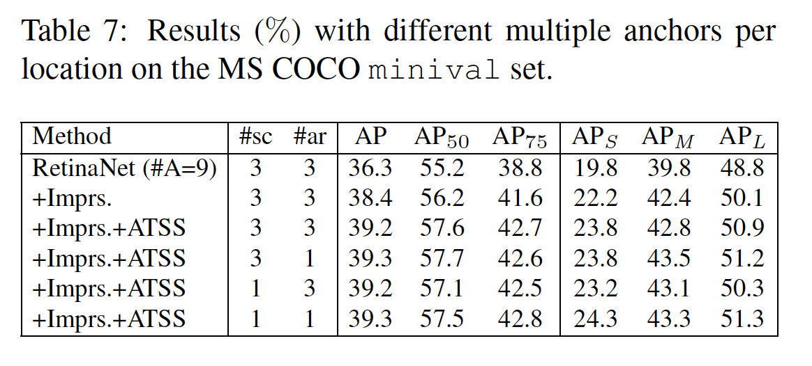

