## Augmentation for small object detection

### 摘要

​		在最近几年，目标检测取得了令人瞩目的进展。尽管取得这些进步，但是小型和大型目标检测之间的性能仍有明显差异。我们在挑战性数据集MS COCO上分析最近的最佳方法（Mask RCNN）。我们证明小型ground-truth目标与锚之间的重叠远小于期望的IoU预测。我们认为这是由于两个方面的因素：（1）仅少量图像包含小型目标，（2）小目标即使在包含它们的每个图像中看起来也不够。因此，我们提出过采样那些具有小目标的图像，并通过多次复制-粘贴小目标以增强这些图像。它允许我们平衡检测器在大型目标与小型目标上的质量。我们评估了不同的粘贴增强策略，最终，与MS COCO的当前最新方法相比，我们在实例分割方面实现了9.7％的相对改进，在小对象的对象检测方面实现了7.1％的相对改进。

### 1 引言

​		检测图像中的目标是计算机数据研究的基础，因为目标检测通常是许多实际应用的起点（包括机器人和自动驾驶汽车、卫星和航空图像分析以及医学图像中的器官定位）。这个重要的目标检测问题最近经历了很多进步。MS COCO目标检测竞赛的top-1解决方法从2015年的0.373 AP增加到2017年的0.525 AP。MS COCO实例分割挑战中也取得相似的进步。尽管取得这些改进，已有的解决方案通常在小型目标上表现欠佳，其中MS COCO中小型目标定义如表1。从大小目标检测之间的显着差距是明显的。例如，参见图1，其中列出了MS COCO实例分割挑战的最高排名提交。实例分割中也遇到相似的问题。例如，例如，图2中来自当前最新模型Mask-RCNN的样本预测，其中该模型错过了大多数小物体。

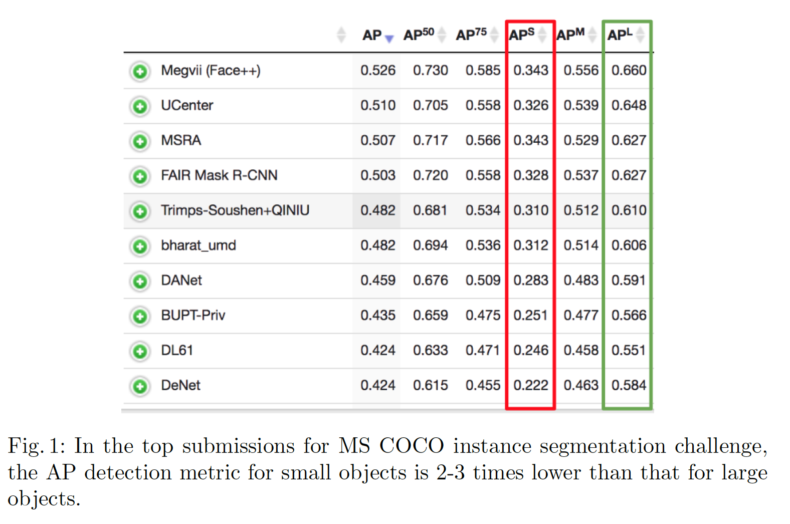

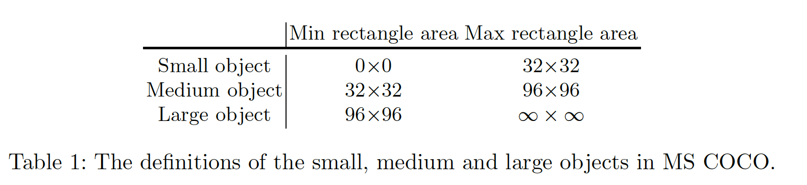

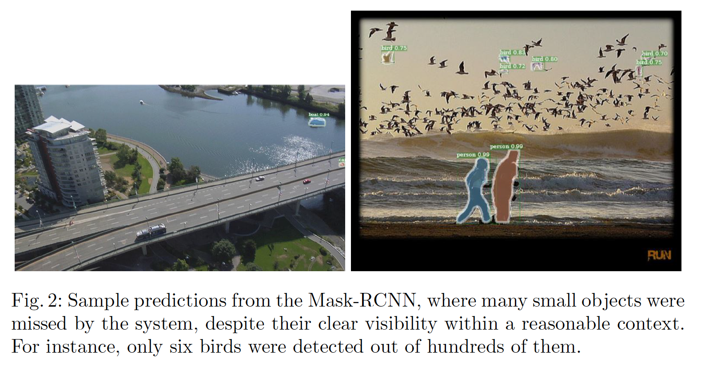

​		小型目标检测在许多下游任务中非常关键。为了安全地部署自动驾驶汽车，必须从汽车上检测高分辨率场景照片中的小物体或远处的物体。在高分辨率图像上，通常很难看到很多物体，例如交通标志[11,34]或行人[31]。在医学图像中，早期发现肿块和肿瘤对于做出准确的早期诊断至关重要，而这些元素的大小很容易只有几个像素[3、29]。通过在材料表面上可见的小缺陷的定位，自动工业检查还可以从小物体检测中受益[1、30]。 另一个应用是卫星图像分析，其中必须有效标注诸如汽车、轮船和房屋之类的物体[28、21]。这些物体的平均像素分辨率为0.5-5m，再次只有几个像素。换句话说，小型目标检测和分割需要更多关注，因为现实世界中要部署更复杂的系统。因此，我们提出一种新的方法来提高小型目标检测。

​		我们关注最佳目标检测器——Mask R-CNN——在挑战性数据集MS COCO上的表现。我们注意到，这个数据集关于小型目标的两个特性。第一，我们观察到，数据集中包含小型目标的图像相对较少，这可能会使任何检测模型偏向于将重点更多地放在中型和大型目标上。第二，小型目标覆盖的区域远远更少，这意味着小型目标的位置缺乏多样性。我们推测，这会使目标检测模型难以在测试时间内将小型目标泛化为图像中探索程度较低的部分。

​		我们通过过采样包含小型目标的图像处理第一个问题。通过在包含小型目标的每幅图像中多次复制-粘贴小型目标来处理第二个问题。在粘贴每个目标时，我们确保粘贴的目标不与任何已有的目标重叠。这增加了小型目标位置的多样性，同时确保这些目标出现在正确的场景，如图3所示。每个图像中小型目标数量的增加进一步解决了少数正匹配的锚点的问题，我们将在第3节中进行定量分析。总体而言，与MS COCO上最新的Mask R-CNN方法相比，我们实现了实例分割的相对改进为9.7%，小型对象的目标检测也达到了7.1％。

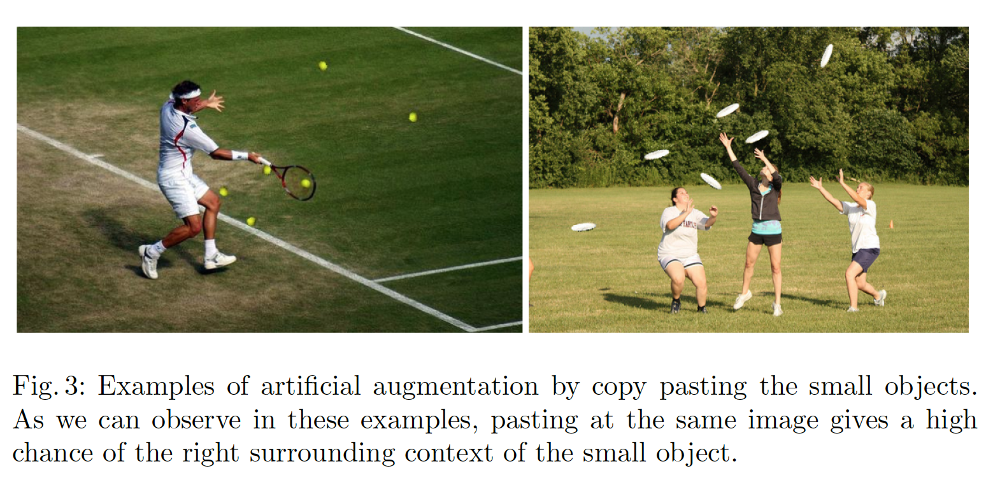

### 2	相关工作

*目标检测*	Faster R-CNN、R-FCN和SSD时目标检测的三种主要方法，而它们的不同之处在于是否附加了区域提议[20]。Faster R-CNN及其变体旨在帮助各种目标尺度，因为微分裁剪将所有建议合并为一个分辨率。但是，这种情况发生在深层卷积网络内部，并且所生成的裁剪框可能无法与目标完美对齐，这可能会损害其在实践中的性能。最近，SSD已扩展为DSSD，在解码器部分，其通过转置卷积上采样SSD的低分辨率特征，从而增加内部空间分辨率。相似地，FPN利用解码器类型的子网络扩展Faster R-CNN。

*实例分割*	实例分割超越目标检测，并且需要预测每个目标确切的掩膜。Multi-Task Network Cascades（MNC）构建级联预测和掩膜精炼。FCIS[23]是全卷积模型，其计算每个RoI共享的位置敏感得分图。[14]（也是全卷积网络）学习像素嵌入。Mask R-CNN[18]利用预测掩膜分支扩展FPN模型，并为目标检测和实例分割引入新的可微裁剪操作。

*小型目标*	通过增加输入图像分辨率[7、26]或通过将高分辨率特征与低分辨率图像的高维特征融合[36、2、5、27]可以解决检测小物体的问题。然而，这种使用更高分辨率的方法增加了计算开销，并且不能处理小型和大型目标之间的不平衡。[22]而是使用生成对抗网络（GAN）来构建卷积网络中的特征，在交通信号和行人检测的背景下，在大小物体之间的特征是无法区分的。[12]基于区域提议网络中的不同分辨率层使用不同的锚尺度。[13]将图像特征按锚大小的比例移动，以覆盖它们之间的间隙。[6、33、8、19]在裁剪小目标提议时添加上下文。

### 3	识别检测小型目标的问题

​		本节中，我们首先回顾我们实验中使用的MS COCO数据集和目标检测模型。然后，我们讨论MS COCO数据集的问题，以及训练中使用的锚匹配，这些问题助长了小型目标检测的难度。

#### 3.1 MS COCO

​		我们利用MS COCO检测数据集进行实验。MS COCO2017检测数据集包含118287张训练图像、5000张验证图像和40670张测试图像。利用ground-truth边界框和实例掩膜标注了来自80个类的860001和35781个目标。

​		在MS COCO检测挑战中，主要评估标准是平均精确率（Average Precision：AP）。通常，AP定义为所有召回值的真实阳性与所有阳性的比率的平均值。因为目标需要准确率的定位和分类，由于需要同时定位和正确分类对象，因此，只有在预测的掩膜或边界框的IoU大于0.5时，才将正确的分类算作是真正的阳性检测。AP为80个类、0.5至0.95的均匀分布上的IoU阈值上的平均。指标还包括跨不同目标尺度测量的AP。 在这项工作中，我们的主要兴趣是小物体上的AP。

### 3.2 Mask R-CNN

​		对于我们的实验，我们使用[16]实现的具有ResNet-50骨干的Mask R-CNN。并采用[17]提出的线性缩放规则来设置学习超参数。我们使用比[16]中基线更短的训练调度。我们在4张GPU上训练模型36K，并使用0.01的基学习率。对于优化，我们使用动量为0.9、权重衰减为0.001的SGD。训练期间，学习率缩小两次，分别在24k和32k迭代时完成。所有其他参数保持[16]中的Mask R-CNN+FPN+ResNet-50配置。

​		我们的研究中，网络区域提议阶段特别重要。我们使用FPN生成目标提议[24]。它从五个尺度$(32^2,64^2,128^2,256^2,512^2)$和三个纵横比$(1, 0.5, 2)$的十五个锚框预测目标提议。如果与ground-truth边界框的IoU大于0.7或者IoU为最大的IoU，那么这个锚分配到正标签。

### 3.3  Small object detection by Mask R-CNN on MS COCO

​		在MS COCO中，训练集中出现的41.3%的目标是小型目标，而仅34.4%和24.2%的目标分别是中型和大型目标。一方面，仅一半的训练图像包含小型目标，而包含中型和大型目标的图像分别为70.07%和82.8%。见表2的目标计数和图像。这证实了小型目标检测问题背后的第一个问题：关于小物体的样本很少。

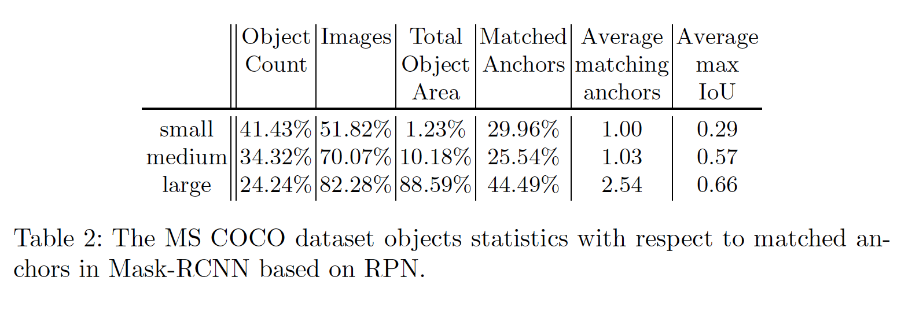

​		通过考虑每种尺寸类别的总目标面积，第二个问题立即显而易见。大约1.23%的标注像素属于小型目标。中型目标占据超过小型目标8倍的区域（基标注像素的10.18%），而82.8%的标记部分为大型目标。在此数据集上训练的任何检测器都无法跨越图像和像素看到足够多的小型目标。

​		如本节前面所述，如果来自区域提议网络的每个预测锚都具有正负边界框的最高IoU，或者与任何ground-truth框的IoU高于0.7，则该正锚会接受正标签。这一过程会严重偏向大型目标，因为跨越多个滑动窗口位置的大型目标通常与许多锚框有高IoU。如表2列出的，只有29.96％的正匹配锚与小型目标配对，而44.49％的正匹配锚点与大型目标配对。对于其他方面，它揭示了每个大型目标有2.54的匹配锚，而每个小型目标仅有一个匹配锚。此外，如*Average Max IoU*度量反应的，即使与小型目标最匹配的锚框通常有较低的IoU值。小型目标的平均max IoU仅为0.29，而中型和大型目标与最匹配的锚的平均IoU是小型目标的两倍，分别为0.57和0.66。我们通过可视化一些示例在图5中说明此现象。 这些观察结果表明，小型目标对计算区域提议损失的贡献要小得多，这会使整个网络偏向于大中型目标。

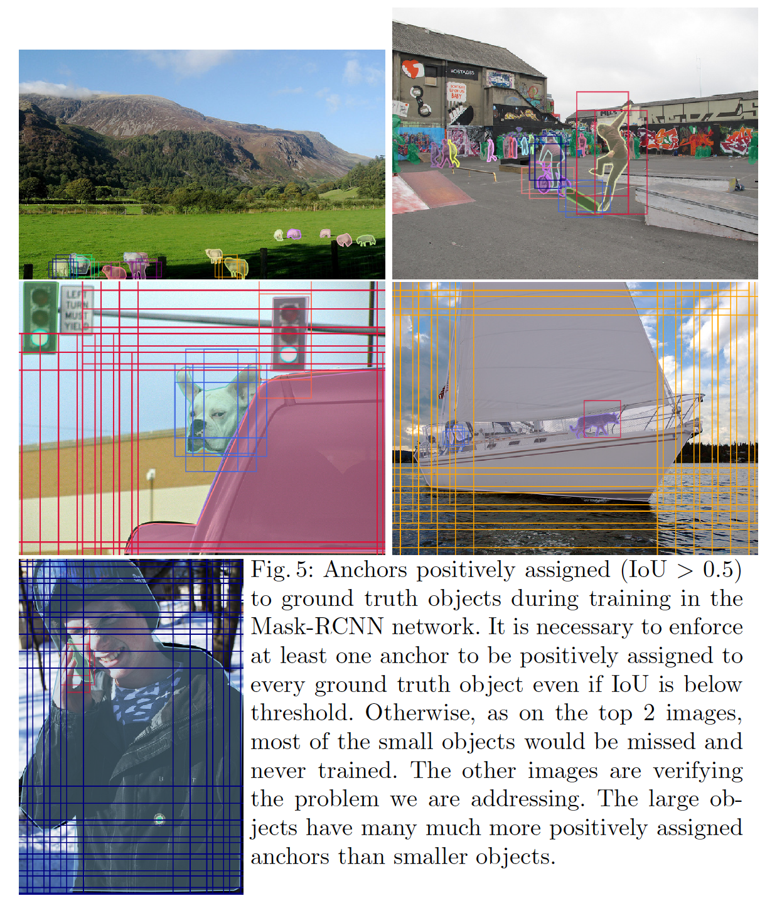

### 4	过采样和增强

​		通过显式解决我们在上一节中概述的MS COCO数据集的与小型目标相关的问题，我们改善小型目标上检测器的性能。特别地，我们过采样包含小型目标的图像，并执行小型目标数据增强来鼓励模型更聚焦小型目标。尽管我们使用Mask R-CNN评估了所提出的方法，但它通常可与任何其他目标检测网络或框架一起使用，因为过采样和增强都是作为数据预处理完成的。

​		*过采样*	我们通过在训练过程中对图像进行过采样来解决包含小型目标的图像相对较少的问题[4]。这是缓解MS COCO数据集这一问题并提高小型目标检测性能的一种高效而直接的方法。在实验中，我们改变过采样率，并研究过采样的效果，不仅在小物体检测上，而且在检测中，大型物体上也是如此。

​		*增强*	在过采样基础之上，我们还引入关注小型目标的数据增强。MS COCO数据集提供的实例风掩膜允许我们从任何目标的原始位置复制目标。然后，将复制的目标粘贴到不同位置。通过增加每幅图像中小型目标的数量，匹配到的锚的数量也增加。反过来，这会改善小目标在训练过程中对RPN损失函数的计算贡献。

​		在将目标粘贴到新位置之前，我们在小目标上使用随机变换。我们通过将目标的大小缩小$\pm20%$以及旋转$\pm15^\circ$。**我们仅考虑非遮挡的目标，因为将不相交的分割掩膜粘贴在中间而看不见的部分通常会导致图像不真实。我们确保新粘贴的对象不会与任何现有对象重叠，并且距图像边界至少五个像素。**

​		在图4中，我们以图形方式说明了所提出的增强策略，以及它如何在训练过程中增加匹配锚点的数量，从而更好地检测小物体。

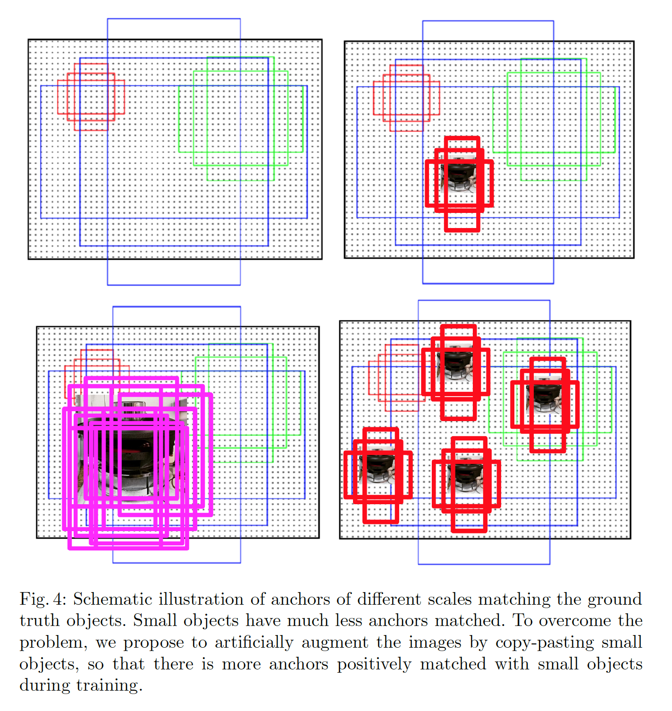

### 5	实验设置

#### 5.1	过采样

​		在第一组实验中，我们研究了对包含小物体的图像进行过采样的效果。 我们在两个、三个和四个之间改变过采样率。 代替实际的随机过采样，我们创建了多个带有小对象的图像副本，以提高效率。

#### 5.2	增强

​		在第二组实验中，我们研究使用增强对小型目标检测和分割的影响。我们将所有小物体一次复制并粘贴到每个图像中。我们还过程样具有小型目标的图像来研究过采样和增强策略的相互作用。

​		我们测试三种设置。第一种设置中，我们用具有复制-粘贴小型目标的图像替换具有小型目标的每幅图像。第二种设置中，我们复制这些增强后的图像以模仿过采样。在最后的设置中，我们既保留原始图像又保留扩展图像，这等效于将带有小对象的图像过采样两倍，同时以更多的小目标扩展重复的副本。

#### 5.3	复制-粘贴策略

​		存在不同的方式来复制-粘贴小型目标。我们考虑三种单独的策略。第一，我们在图像中选择一个小型目标，并在随机位置将其复制-粘贴多次。第二，我们选择大量小型目标，并在任意位置复制-粘贴每个目标一次。最后，我们将每个图像中的所有小目标复制并粘贴到随机位置多次。在所有情况下，我们都使用上面的第三种增强设置。 也就是说，我们保留原始图像及其增强副本。

#### 5.4	粘贴算法

​		在粘贴一个小目标的副本时，有两个事情需要考虑。第一，我们必须确定粘贴的目标是否会与任何其他目标重叠。尽管我们我们选择不引入任何重叠，但是我们通过实验验证了这是否是一个好的策略。第二，是否执行额外过程以平滑粘贴目标的边缘是一种设计选择。 我们进行实验，与没有进一步处理的情况相比，具有变化的滤波器大小的边界的高斯模糊是否可以有所帮助。

### 6	结果和分析

#### 6.1	过采样

​		通过更频繁地在训练过程采样小型目标的图像（见表3），小型目标分割和检测的AP都可以得到改善。最大的收益来自 $3 \times$ 的过采样，其将小型目标的AP增加1%（相应的提高为8.85%）。虽然中型目标尺度的性能很少受到影响，而大型目标检测和分割的性能都收到过采样的影响，这意味着过采样比例必须基于小型和大型目标之间的相关选择。

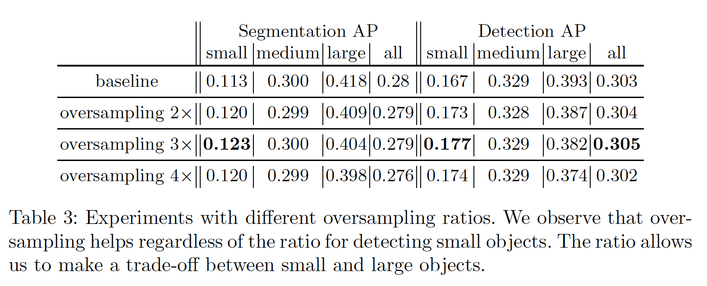

#### 6.2	增强

​		在表4中，我们提出使用数据增强和过采样策略的不同组合。当我们使用包含更多小型目标的副本替换具有小型目标的每幅图像（第二行）时，性能明显衰减。当我们对这些增强图像进行过采样两倍时，小物体的分割和检测性能恢复了其损失，尽管总体性能仍比基线差。当我们在增强的验证集上验证这个模型时，与原始的相反，我们看到小型目标增强的性能增加38%（0.161），这认为训练模型对“粘贴”的小型目标过拟合，但是对于原始小型目标时没有必要的。我们认为这是由于粘贴造成的伪影，例如不完善的目标掩膜和背景中的亮度差异，对于神经网络而言，这些伪像相对容易发现。最好的结果是通过组合过采样和以 $p = 0.5$（original + aug）的概率进行增强而实现的，原始目标与增强后的小物体的比例为 $2:1$。这种设置比单独地过采样产生的结果更好，这确认了所提出的粘贴小型目标的有效性。

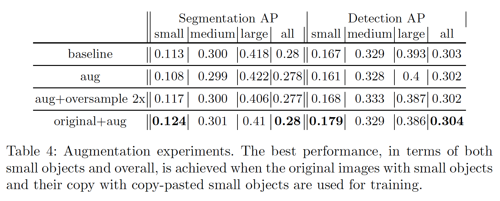

#### 6.3	复制-粘贴策略

​		*单目标粘贴*	在表5中，我们看到复制-粘贴单个目标会在小目标上产生更好的模型，但是，这是以大图像上的性能下降为代价的。这些结果本身也超过了两倍的过采样。但是，性能已经达到一或两个粘贴的峰值。 多次添加同一目标不会产生任何性能改进。

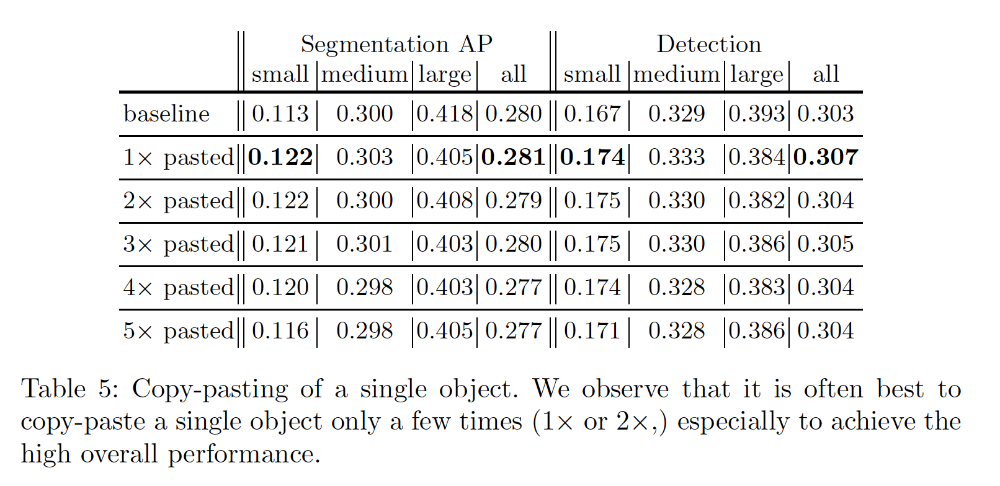

​		*多个目标的复杂-粘贴*	如表6所示，在每幅图像复制粘贴多个小目标比仅复制粘贴一个目标要好。 在这种情况下，我们看到每个目标最多粘贴3次的好处。

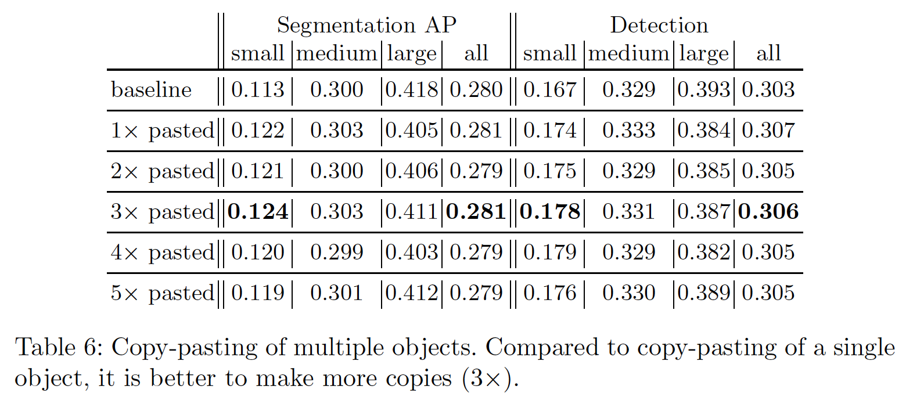

​		*复杂-粘贴所有小型目标*	最后，表7列出了复制-粘贴每幅图像中所有小对象的结果。利用所有的目标的一次增强，我们发现关于分割和检测最好的结果。 我们怀疑这可能有两个原因。第一，通过具有所有小物体的多个副本，原始与粘贴的小物体的比例迅速降低。第二，每个图像中的目标数量成倍增加，这会导致训练图像和测试图像之间出现更大的不匹配。

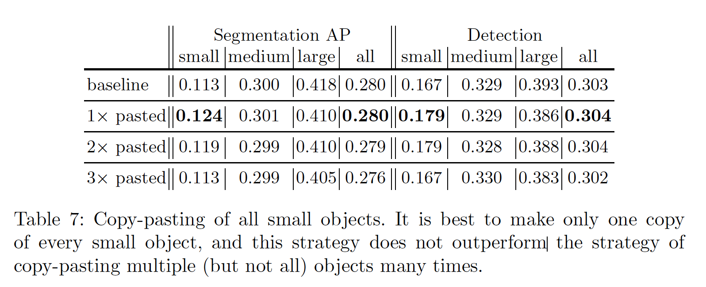

#### 6.4	粘贴算法

​		如表8所示，随机粘贴到图像中而不考虑其他目标已经占据的区域会导致小图像的性能下降。为避免在粘贴的目标和现有的目标之间出现任何重叠，我们的设计选择是合理的。此外，粘贴目标边缘的高斯模糊没有显示任何改善，表明最好按原样粘贴目标，除非在目标中采用更复杂的融合策略。

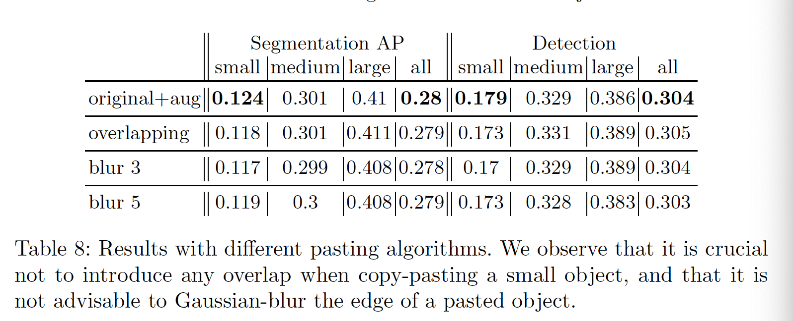