## AutoAssign: Differentiable Label Assignment for Dense Object Detection

### 摘要

​		本文提出了一种具有完全可微标签分配策略的无锚目标检测器，称为AutoAssign。它通过生成正负权重图来自动确定正/负样本，以动态修改每个位置的预测值。具体而言，我们提出中心加权模块（center weighting module）来调整类特定的先验分布（category-specific prior distribution），以及置信度加权模块（confidence weighting module）以适应每个实例的特定分配策略。整个标签分配是可微的，并不需要额外的修改便可迁移到不同数据集和任务。MS COCO上的大量实验证明，我们的方法稳定地超过其他最佳的采样策略大约1% $AP$。此外，我们的最佳模型获得52.1%的 $AP$，这比所有已有一阶段检测器好。此外，在其数据集（例如PASCAL VOC、Object365和WiderFace）上的实验也说明AutoAssign的广泛应用能力。

### 1. 引言

​		目前最先进的基于CNN的目标检测器执行密集预测的通用范式。两阶段（RPN部分）和一阶段检测器[11、20、27、26]都以规则、密集的采样方式预测每个CNN特征位置上具有不同尺度、宽高比和类别的目标。

​		这项密集的检测任务提出一个重要的问题，即在空间位置上采样正负样本，器称为_label assignment_。此外，因为现代基于CNN的检测通常采用多尺度特征（例如FPN[10]）来缓解尺度变化，所以标签分配不仅需要在特征图中选择位置，还需要选择合适尺度的特征层。

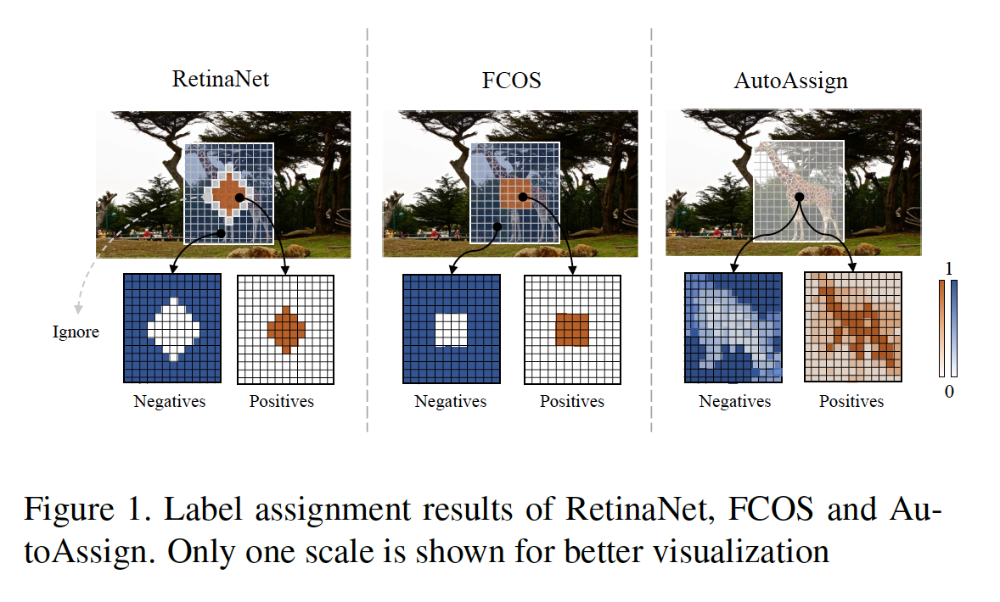

​		如图1所示，已有的检测器主要通过人类先验采样正负位置：（1）基于锚的检测器（如RetinaNet）在每个位置预设多个尺度和纵横比的锚，并借助IoU在空间和尺度水平特征图中采样正负样本。(2)如FCOS的无锚检测器采样中心区域的固定比例的样本作为每个目标的空间正位置，并通过预定义尺度约束选择FPN的某个阶段。这些检测器遵循目标的先验分布来设计它们的分配策略，这在Pascal VOC和MS COCO上已被证明有效。

​		但是，如图2所示，在现实世界中，不同目标的外观因类别和场景而异。固定中心采样可能选择目标外的位置作为正类。直觉上，目标上的采样位置比普通背景要好，因为这些位置容易产生更高的分类可信度。另一方面，尽管CNN可以学习偏移，但是当背景被采样为正类时，由于特征偏移造成的障碍可能会降低性能。

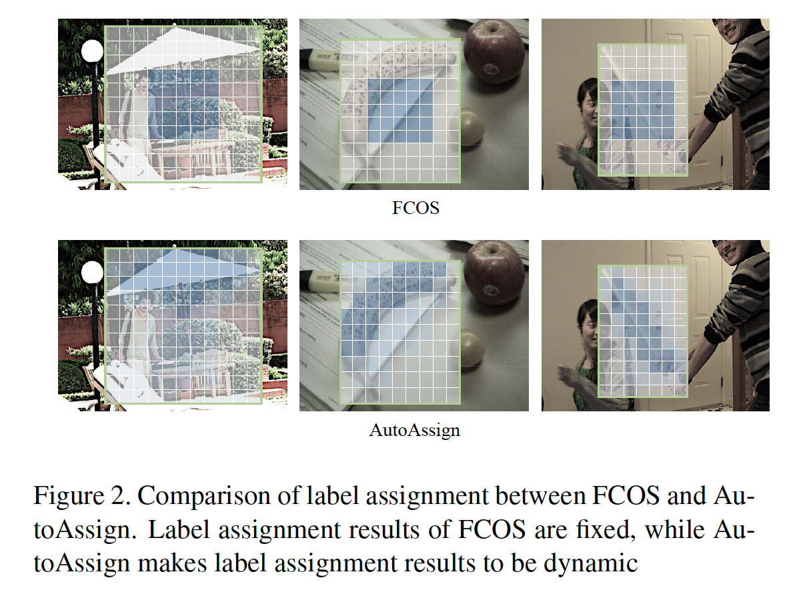

​		因此，上述的固定策略可能不能在空间和尺度维度中选择最合适的位置。除了纯人工设计的策略外，最近的工作在标签分配中引入一些部分数据依赖和动态策略。GuidedAnchoring[21]和MetaAnchor[23]在采样之前动态改变锚形状的先验，而其他方法为空间维度[27、26、9]或尺度维度[31]中的每个目标自适应地修改采样策略。这些策略只释放一部分标签分配给数据驱动，而其他部分则受到人为设计的约束，从而阻碍标签分配的进一步优化。

​		在这项工作中，我们提出完全可微的标签分配策略。如图1所示，我们首先遵循如FCOS的无锚方式来直接预测每个位置上的目标，而没有人工设计的锚。为了保留足够的位置以便进一步优化，我们首先将边界框内的所有位置作为所有尺度级别的正候选和负候选。然后，在训练损失中，我们生成正负权重图以修正预测。为了适应不同类别和领域的分布，我们提出逐类加权模块（称为Center Weighting）来学习从数据中学习每个类的分布。为了适应每个实例的外观和尺度，我们提出了一个置信度加权模块，在空间和尺度两个维度上修正位置的正、负置信度。然后，我们结合两个模块以生成所有位置的正负权重图。加权的整个过程是可微的，并能通过反向传播优化。

​		总之，这项研究的贡献如下：

1. 为密集目标检测提出一种新的可微标签分配策略，称为AutoAssign，其自动为每个实例分配正负类。此外，可学习的范式确保它能够迁移到其他数据集和任务，而无需任何修改。
2. 提出两个加权模块（即center weighting和confidence weighting）以自适应地在空间和尺度维度上调整类特定的分布以及实例特定的采样策略。
3. 在具有挑战性的MS-COCO[12]数据集和来自不同领域的其他数据集（如PASCAL VOC[3,4]、Object365[19]和WiderFace[22]上进行大量具有竞争性结果的实验，证明AutoAssign的有效性和广泛的适用性。

### 2. 相关工作

#### 2.1. Fixed Label assignment

​		经典目标检测器利用事先确定的策略采样正负类。Faster R-CNN中的RPN在每个位置预设多个尺度和纵横比的几个锚。然后，在锚匹配IoU的指导下，对每个实例在尺度和空间维度上的分配进行指导。基于锚的策略迅速主导现代检测器，并扩展到多尺度输出特征，例如YOLO、SSD和RetinaNet。最近的学术注意力关注没有锚设置的无锚检测器。FCOS及其先驱[7、25、14]丢弃先验锚设置，并将边界框中心周围的空间位置分配为正类。在尺度维度，它们在每个FPN的阶段阈定义尺度范围以分配实例。基于锚和无锚策略都遵循数据分布的_中心先验_，其表示边界框中心附近的空间位置更可能包含目标。

​		还有一些其他基于不同机制的无锚检测器[8、29、2、24、28]，其将边界框视为关键点，并将回归任务转换为热图上的分类问题。这些检测器的特点不同于基于边界框回归的检测器。因此，它们不在本文的讨论范围之内。

#### 2.2.  Dynamic Label assignment

​		因为固定分配策略对于不同的目标分布是次优的，所以最近的检测器提出自适应机制来改进标签分配。GuidedAnchoring[21]lying语义特征来指导锚设置，并动态改变锚的形状以适应不同的目标分布，而MetaAnchor[23]在训练期间随机采样任意形状的锚以覆盖不同种类的目标框。除了锚先验的修改外，一些工作直接改变每个目标的采样。FSAF[31]利用最小的训练损失将每个实例分配到合适的FPN特征层。SAPD[30]重新加权正类锚，并使用额外的meta-net来选恰当的FPN阶段。FreeAnchor[27]基于IoU为每个目标构造一个top-k候选锚，并使用一个Mean-Max函数对所选锚进行加权，而[9]设计另一个加权函数来消除噪声锚。ATSS[26]根据实例的统计特性，提出一种基于动态IoU阈值的自适应训练样本选择机制。

​		为了从更全面的角度展示现有的标签分配策略，我们将一些具有代表性的方法的关键组件按优先级和实例相关的方式组织在表1中。显然，除了RetinaNet[11]和FCOS[20]等基于启发式的方法外，所有现有的动态策略都只是使标签分配的某些组件成为数据驱动的。相比之下，其他组件仍遵循手工设计规则。

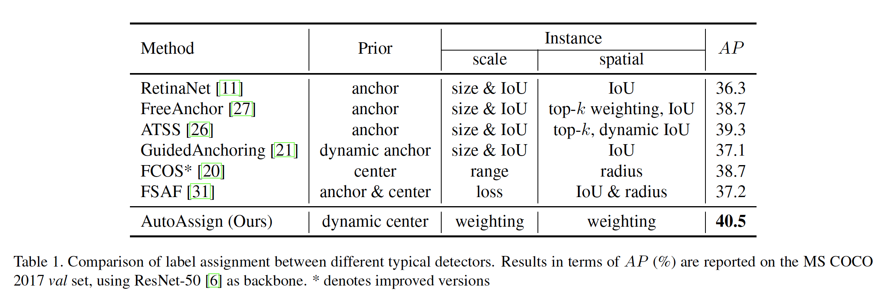

### 3. AutoAssign

#### 3.1. Overview

​		AutoAssign以完全数据驱动的方式处理标签分配。它从头构建，并没有额外的组件（例如anchor、IoU阈值、top-k或尺度范围）。它直接使用网络预测来动态调整每个位置的正/负置信度。

​		为了优化整个标签分配过程，我们提出一种完全可微的策略，其在空间和尺度维度动态调整类特定和实例特定的采样策略。我们策略的框架如图3。我们首先遵循如FCOS的无锚形式来去掉预先设计好的锚，直接预测每个特征位置上的目标。对于每个实例，我们将其边界框内的所有位置保持在所有尺度水平之间，同时作为正值和负值。然后，我们生成正负权重图$w^{+}$和$w^{-}$以在训练中准确修改正负预测。因此，我们将整个分配步骤转换为两个权重图。

​		为了适应不同类别的分布，我们提出一个逐类和数据依赖的加权模块，称为中心权重（Center Weighting）。它从标准的中心先验开始，然后从数据中学习每个类的分布。

​		为了适应每个实例的外观和尺度，我们进一步提出逐实例的加权模块（称为置信度加权（confidence weighting））。它基于每个目标的预测置信度，在空间和尺度维度上动态加权位置。

​		最后，我们结合两个加权模块以为每个位置生成正权重和负权重。给定目标$n$，在应用整个加权机制后，我们将训练损失$\mathcal{L}_n(\theta)$如下：

$$\mathcal{L}_n(\theta) = -\log(\sum_{i \in S_n}w_i^+\mathcal{P}_i^+) - \sum_{i \in S_n}\log(w_i^-\mathcal{P}_i^-), \tag{1}$$

其中$S_n$表示所有尺度层中边界框内的所有位置。对于位置$i \in S_n$，它为正负类的概率分别表示为$\mathcal{P}_i^+$和$\mathcal{P}_i^-$，其通过网络预测。$w_i^+$和$w_i^-$为由所提出的中心加权和置信度加权生成的权重图。

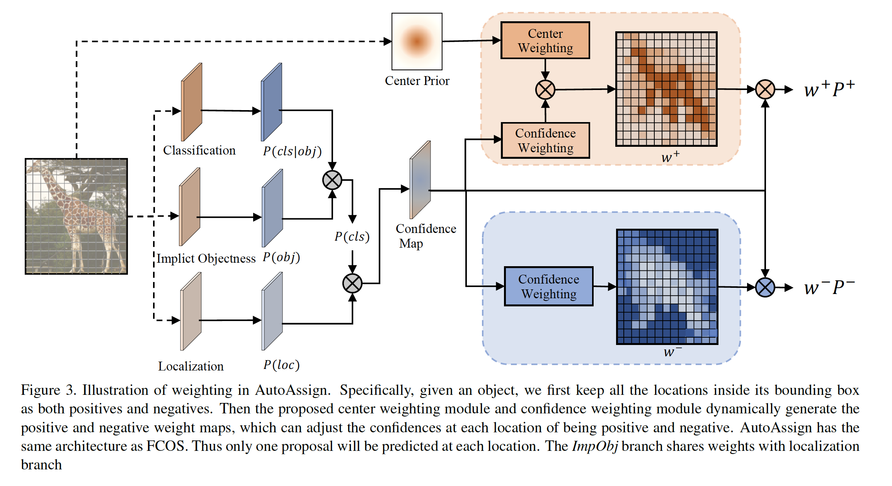

#### 3.2. Center Weighting

​		先验分布是标签分配的基本元素，特别是训练的早期阶段。通常，不同类的目标，例如长颈鹿和人，可能有不同的分布。保留中心位置不同捕获真实世界实例的不同分布。更合适地，对于不同类的目标，更需要自适应的中心分布。

​		基于中心先验，我们引入具有可学习参数的逐类（category-wise）高斯形加权函数（Gaussian-shape weighting function）$G$。“category-wise”表示每个类都有其唯一的参数$(\mu,\sigma)$，而相同类的所有目标共享相同的参数。这里，我们将$G$定义为：

$$G(\vec{d}|\vec{\mu},\vec{\sigma}) = e^{\frac{-(\vec{d} - \vec{\mu})^2}{2\vec{\sigma}^2}},\tag{2}$$

其中$\vec{d}$表示目标内的某个位置到其边界框中心的偏移（沿$x$轴和$y$轴），这意味着偏移可以是负数。$\vec{\mu}$和$\vec{\sigma}$为形状为$(K,2)$的可学习参数。$K$为数据中类的数量。每个类别在空间维度的$x$轴和$y$轴上有两个参数。因为$G$对训练损失有贡献，所以可以通过反向传播优化参数。

​		直觉上，$\vec{\mu}$控制每个类别相对于方框中心的中心偏移量。而$\vec{\sigma}$基于类的特点衡量每个位置的重要性。因此，$\vec{\sigma}$决定了在合理权重的情况下，有多少位置会有效地促进正损失。

​		还需要注意的是，$G$用于所有的FPN阶段。因为相同类的目标有任意的大小或纵横比，最合适的位置可能是任意的FPN阶段。此外，为了补偿由FPN不同的下采样率而引起的干扰，我们通过FPN阶段的降尺度比对距离$\vec{d}$进行归一化。

#### 3.3. Confidence Weighting

​		现有的动态策略[31，27，9]是基于这样一个事实而设计的：网络可以很容易地以高置信度学习合适的样本，同时对于较差的样本，倾向于预测低置信度。具体而言，置信度指标（confidence indictor）分别被证明在尺度选择（[32]损失指标）和空间分配（锚置信度[27，9]）是有效的。在置信度加权中，我们提出分类和定位的联合指标来指导空间和尺度维度上的加权策略。

##### 3.3.1	Classification Confidence

​		给定空间位置$i$，它的分类置信度可以自然地定义为$\mathcal{P}_i(cls|\theta)$，通过网络直接预测目标类的概率。$\theta$表示模型参数。然而，为了确保所有正确的位置都被考虑在内，我们首先考虑边界框内的所有空间位置。因为目标难以完整填满它的边界框，所以最初的正类集倾向包含相当大部分的背景位置。如果一个位置实际上是背景，那么该位置中的所有类预测都应该是不合理的。因此将太多较差的背景位置作为正类会损害检测性能。

​		为了抑制较差位置的false positive，我们引入新颖的_Implicit-Objectness_分支，其如图3所示。它的工作原理与RPN[17]和YOLO[14]中的Objectness一样，作为前景和背景的二元分类任务。但在这里，我们遇到另一个缺乏明确标签的问题。RPN和YOLO采用预先定义好的分配方式，同时需要动态地寻找并强调适恰当的正样本。因此，我们与分类分支一起优化Objectness，因此它不需要显式的标签。那就是为什么称为_Implicit-Objectness（ImpObj）_。对于位置$i \in S_n$，在应用_ImpObj_之后，分类置信度$\mathcal{P}_i(cls|\theta)$可以定义为：

$$\mathcal{P}_i(cls|\theta)=\mathcal{P}_i(cls|obj,\theta)\mathcal{P}_i(obj|\theta), \tag{3}$$

其中所提出的_ImpObj_为$\mathcal{P}_i(obj|\theta)$，其表示位置$i$为前景（目标）或背景的概率。$\mathcal{P}_i(cls|obj,\theta)$为位置$i$已知该位置为前景或背景时为特定类的概率。如图3所示，$\mathcal{P}_i(cls|obj,\theta)$为分类输出。它如RetinaNet的其他检测器的分类分支相同。

​		为了提供理解新颖的_ImpObj_的另一种观点，我们可以采用以前的标签分配策略以手动选择前景，即，对于正类，$\mathcal{P}_i(obj)= 1$；对于负类，设置为0。在这种情况下，分类置信度$\mathcal{P}_i(cls|\theta)=\mathcal{P}_i(cls|obj,\theta)$。而在AutoAssign中，$\mathcal{P}_i(obj|\theta)$有网络动态决定。

##### 3.3.2	Joint confidence modeling

​		为了生成每个位置对正/负的无偏估计，除了分类，我们还应包括定位置信度。定位的典型输出是边界框偏移，其难以直接衡量回归置信度。因此，我们将定位损失$\mathcal{L}_i^{loc}(\theta)$转换为似然$\mathcal{P}_i(loc|\theta)$，然后我们将分类和回归似然组合到一起以得到联合置信度$\mathcal{P}_i(\theta)$。可以损失$\mathcal{L}_i(\theta)$推导如下。不失一般性，这里，我们使用Binary Cross-Entropy（BCE）损失进行分类：

$$\begin{align}\mathcal{L}_i(\theta) &= \mathcal{L}_i^{cls}(\theta) + \lambda \mathcal{L}_i^{loc}(\theta) \tag{4}\\ &=-\log(\mathcal{P}_i(cls|\theta)) +\lambda \mathcal{L}_i^{loc}(\theta)\tag{5} \\ &=-\log(\mathcal{P}_i(cls|\theta)e^{-\lambda\mathcal{L}_i^{loc}(\theta)}) \tag{6} \\ &=-\log(\mathcal{P}_i(cls|\theta)\mathcal{P}_i(loc|\theta)) \tag{7} \\ &=-\log(\mathcal{P}_i(\theta)), \tag{8}\end{align}$$

其中$\lambda$为用以分类和定位之间平衡的损失权重。

##### 3.3.3	Weighting function

​		基于联合置信度表示$\mathcal{P}_i(\theta)$，我们提出指数形式的置信度加权函数$C(\mathcal{P}_i)$以强调包含目标的高置信度位置：

$$C(\mathcal{P}_i) = e^{\frac{\mathcal{P}_i(\theta)}{\tau}}, \tag{9}$$

其中$\tau$为温度系数（temperature coefficient），它控制着高和低置信度位置对正损失的贡献。

#### 3.4. Weight Maps

##### 3.4.1	Positive weights

​		直观上，给定目标$i$，对于其边界框中的所有位置，我们应当关注更准确预测的恰当位置。但是，训练过程开始时，随机初始化网络参数，使其预测置信度不合理。因此，先验的指导信息也至关重要。对于位置$i \in S_n$，我们将来自中心加权模块的类特定先验$G(\vec{d}_i)$与置信度模块$C(\mathcal{P}_i)$组合到一起生成正权重$w_i^+$：

$$w_i^+ = \frac{C(\mathcal{P}_i)G(\vec{d}_i)}{\sum_{j\in S_n}C(\mathcal{P}_i)G(\vec{d}_i)},\tag{10}$$

##### 3.4.2	Negative weights

​		如上所述，边界框中通常包含大量真实背景位置，我们还需要加权的负损失来抑制这些位置，并消除false positive。此外，由于框内的位置总是倾向于预测正类的高置信度，因此我们更倾向使用定位置信度来生成假阳性的无偏指示器。矛盾的是，负分类没有回归任务的梯度，这意味着不应进一步优化定位置信度。因此，我们使用每个位置预测提议和所有目标之间的IoU以生成负权重$w_i^-$：

$$w_i^- = 1 - f(\frac{1}{1 - \mbox{iou}_i}), \tag{11}$$

其中$\mbox{iou}_i$表示位置$i\in S_n$的提议与所有ground-truth边界之间的最大IoU。为了用作有效权重，我们通过函数$f$的值范围将$1/(1-\mbox{iou}_i)$归一化为范围$[0,1]$。这种转换可以使权重分布更加尖锐，并确保IoU最高的位置获得零负损失。对于边界框外的所有位置，$w_i^-$设置为1，因为它们确定为背景。

#### 3.5. Loss function

​		通过正负权重图，我们达到动态分配更合适的空间位置并为每个实例自动选择合适的FPN阶段的目的。由于权重图对训练损失作出贡献，所以AutoAssign以可微的方式处理标签分配。AutoAssign的最终损失函数定义如下：

$$\mathcal{L}(\theta) = -\sum_{n=1}^N\log(\sum_{i \in S_n} w_i^+\mathcal{P}_i^+) - \sum_{j \in S}\log(w_j^-\mathcal{P}_j^-), \tag{12}$$

其中$\mathcal{P}^- = 1 - \mathcal{P}(cls|\theta)$，$n$表示第$n$个ground-truth。为了保证至少一个位置匹配到目标$n$，我们使用所有正权重的加权和来获得最终的正置信度。$S$表示所有尺度上的所有位置。因此，对于边界框中的位置，正负损失都以不同权重计算。这是与所有其他标签分配策略的巨大差异。为了处理正负样本之间的不平衡问题，使用了Focal Loss。

​		虽然正负权重的大小可能会根据等式（10）（11）有所不同，正损失和负损失是独立计算的。

### 4. 实验

​		实验主要在MS COCO2017上评估，这个数据集包含大约118K训练图像、5k验证图像和20k测试图像。我们报告验证集傻姑娘的分析和消融研究，并在测试集上比较我们的最终结果与其他方法的结果。

#### 4.1. 实现细节

​		如果没有特别指出，我们使用具有FPN的ResNet-50作为骨干进行所有实验。我们利用ImageNet预训练的权重初始化骨干。遵循常用的实践，左右模型训练[5]中的$1\times$调度，即以初始学习率0.01进行90k迭代，然后在60k和80k迭代时除以10。权重衰减为0.0001，momentum为0.9。数据增强中使用水平图像翻转。对于所有消融研究，除非特别指出，我们800像素的图像尺度进行训练和测试。在式（9）中，我们设置$\tau = 1/3$，在式（4）中，我们设置$\lambda = 5.0$。对于负分类，我们使用$\alpha=0.25$以及$\gamma=2.0$的Focal Loss；对于边界框定位，我们使用GIoU损失。使用IoU阈值0.6的NMS来融合结果。

#### 4.2. 消融研究

##### 4.2.1	Center weighting and confidence weighting

​		为了证明两个关键组件的有效性，我们分别使用中心加权和置信度加权构建正权重$w_i^+$，同时保持副权重不变。如表2所示，可以看出中心加权带来想多明显的信息增益，这认为先验分布对于指导训练至关重要。此外，置信度加权进一步提高准确率，因为它在空间和尺度维度动态地改变每个目标的策略。

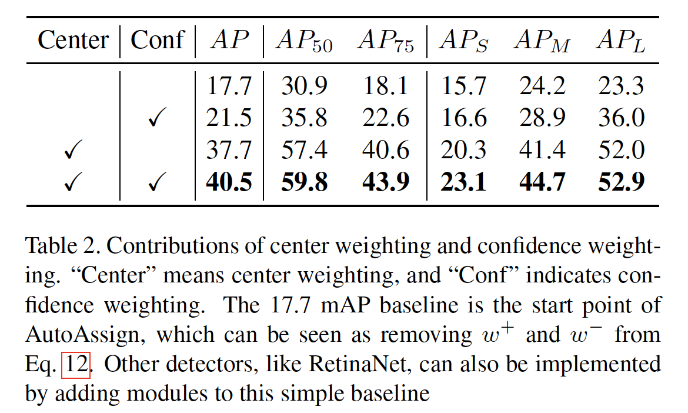

​		为了更好地 理解两个模块的工作机制，我们会从训练有素的检测器分别在每个FPN阶段可视化正权重图。根据图4，我们可以看到，将中心加权应用于FPN的所有阶段，以基于特定于类别的中心先验实现粗略加权。然后，置信度加权为每个实例执行空间和尺度分配。不同形状和不同大小的目标被自动分配到合适的空间位置和适合的尺度阶段。第三行显示结合中心加权和置信度加权的最终正类权重图。

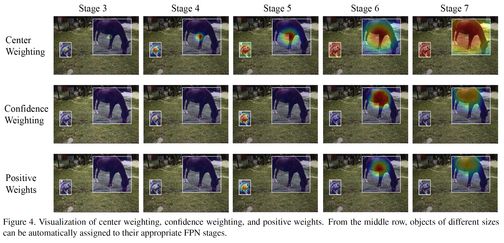

##### 4.2.2	Analysis of center weighting

​		为了分析中心加权的设计，我们比较不同的先验分布，见表3。我们没有可学习参数的高斯形函数$G$表示为“fixed”，而“shared”表示所有类共享一组学习的$\vec{u}$和$\vec{\sigma}$。在MS COCO上，与“fixed”先验相比，“shared”先验的AP略为下降0.2%，而逐类先验增加0.2%的AP。由于MS COCO包含80个类别且具有大量数据，因此其目标分布通常属于正态分布。因此，逐类先验的总体改进不是非常明显。但是，当我们研究某些具有独特分布的类（例如，熊，冲浪板和热狗）时，这些改进是值得注意的。

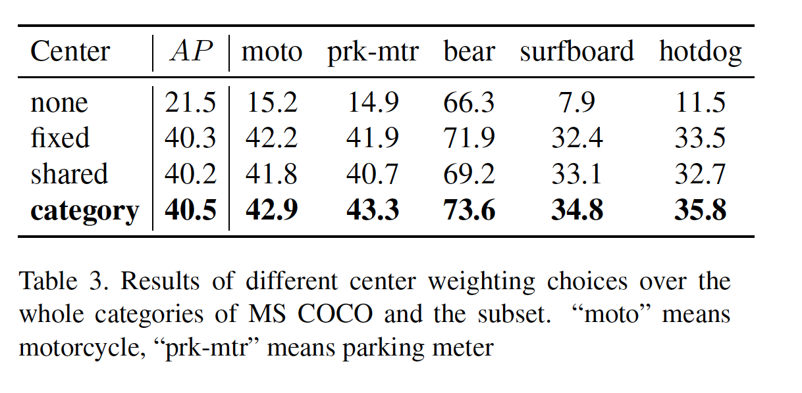

​		这也可以通过图5中每个类别的学习先验的可视化来证明。我们用白色点标记边界框的中心，红色点标记学习的先验的中心。我们可以看到，在停车收费表和热狗类别中，学习到的中心$\vec{u}$会向下移动，因为这些类别往往在下半部分具有更多必要的线索。此外，每个类的类特定的$\vec{\sigma}$也会改变。对于摩托车和冲浪板类，先验变成椭圆形以适应这些类别的形状特征。

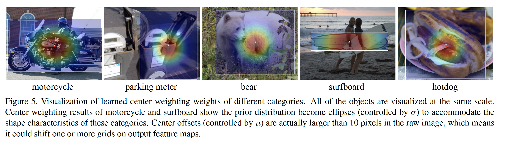

##### 4.2.3	Analysis of confidence weighting

​		我们评估分类置信度$\mathcal{P}(cls)$、定位置信度$\mathcal{P}(loc)$和$ImpObj$的有效性，见表4。在前两行中，我们在置信度加权中分别单独使用分类置信度$\mathcal{P}(cls)$和定位置信度$\mathcal{P}(loc)$。然后，在接下来两行中，我们评估Implicit-Objectness的影响。Explicit-Objectness意味着我们使用框内所有位置的一致正标签来明确地监督Objectness。从整个表中，我们可以看出分类和定位置信度的结合带来主要的改进，而Implicit-Objectness的设计也是至关重要的。

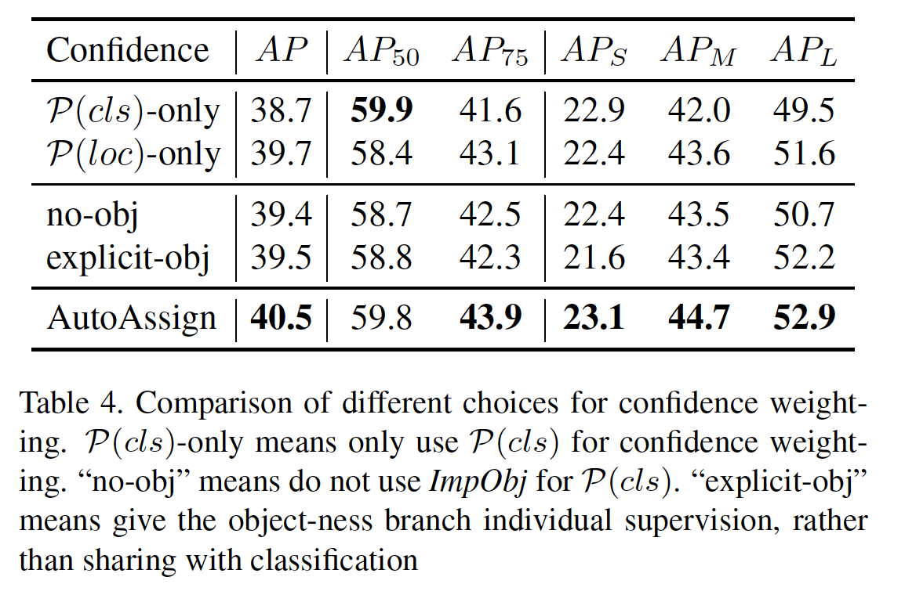

​		我们还注意到Explicit-Objectness是一种通用设计，可以应用于其他检测器。如表5所示，由于正类位置的限制（例如FreeAnchor中的top-k锚），$ImpObj$对这些检测器的贡献最小。这表明，$ImpObj$更适合完全动态的分配。

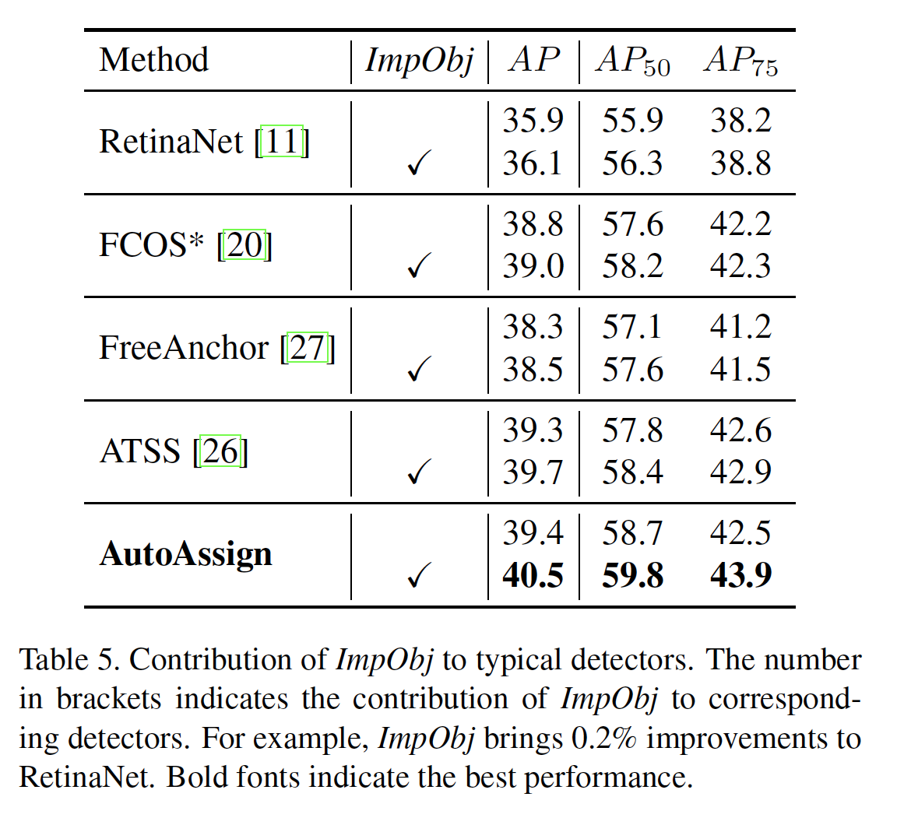

​		为了理解$ImpObj$的行为，在图6中比较用于NMS的最终分类得分。根据可视化和评估结果，召回和精度都有改进。所提出的_implicit-objecness_可以过滤掉噪声，并实现与背景的更好分离。

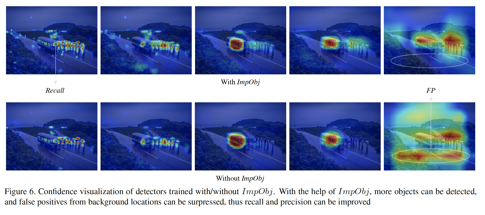

​		然后，我们研究图7中的置信度加权过程。为了简单起见，我们仅可视化两个代表性的FPN阶段。开始时，所有目标的置信度加权都很弱，因为所有位置中概率都很低。随着训练过程的进行，置信度变得更显著，并逐渐收敛到不同大小目标的合适的FPN阶段，这证明我们的可学习过程的有效性。

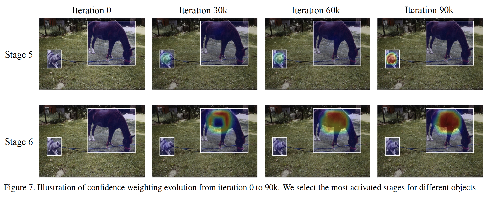

#### 4.3.	Comparison with State-of-the-art

​		我们将AutoAssign与其他最先进检测进行比较。遵循先前的工作[20、27、26]，我们采用$2\times$调度。具有ResNet-101骨干的AutoAssign的获得44.5%的AP，由于其他具有相同骨干的一阶段检测器。通过改变骨干和训练设置，我们的方法一致地优于其他副本。利用较大范围的多尺度训练和多尺度测试策略，我们的最佳方法获得52.1%的AP，其比所有的一阶段检测器都好。

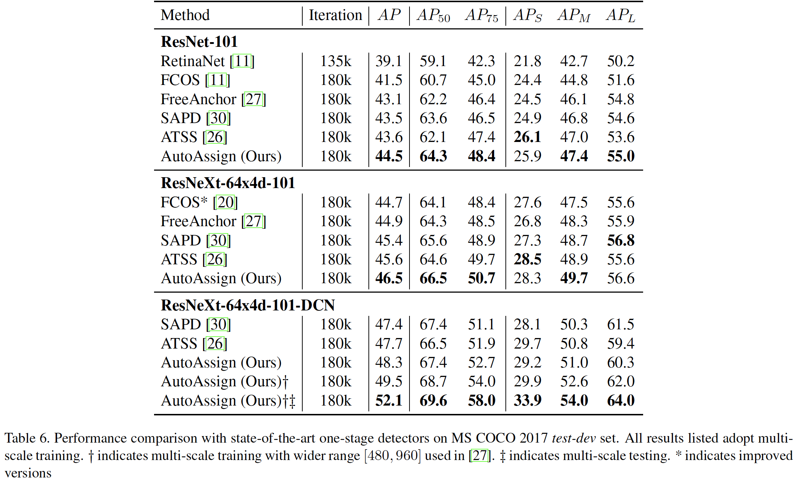

#### 4.4. 泛化

​		为了证明泛化能力，我们使用几种典型的标签分配策略对我们的自动分配进行评估，这些策略针对不同的检测任务，包括常规对象检测（PASCAL VOC [3，4]，Objects365 [19]）和面部检测（WiderFace [22]）。在这些实验中，我们保持每种方法的分配策略（如锚尺度和纵横比）不变，并且仅按照每个数据集的通用范式调整训练设置。

​		结果见表7。我们可以看到，具有固定或部分固定分配策略的其他方法的性能在不同数据集上不稳定。尽管它们在某些数据集上表现出色，但在其他数据集上的准确性可能会更差。这证明了这些方法的标签分配策略具有较低的鲁棒性，并且需要谨慎地进行调整。带有差异标签分配的AutoAssign可以适应不同的数据集，并且无需任何调整即可实现卓越的性能。

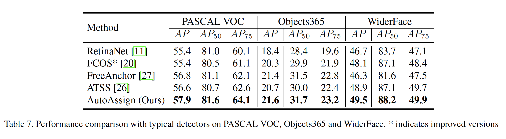