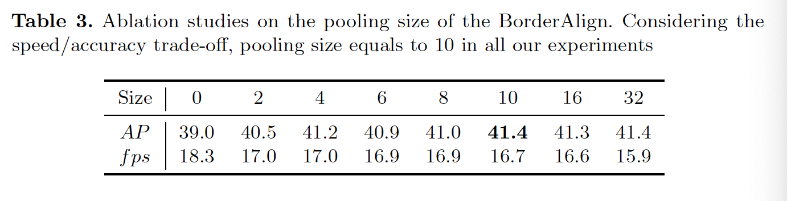
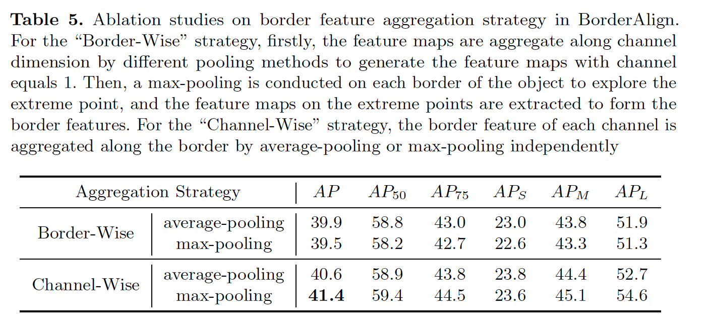

## BorderDet: Border Feature for Dense Object Detection

### 摘要

​		密集目标检测器依赖滑动窗口范式，其预测图像规则网格上的目标。同时，在网格点上的特征图被用来生产边界框预测。点特征便于使用，但可能缺少用于精确定位的显式边界信息。本文中，我们提出简单而高效的操作（称为Border-Align）来从边界的极点提取“边界特征（border feature）”，从而增强点特征。基于BorderAlign，我们设计一种新颖的检测架构（称为BorderDet），其显示利用边界信息进行更强的分类和更准确的定位。利用ResNet50骨干，我们的方法将单阶段检测器FCOS的AP提高2.8（38.6 vs 41.4）。利用ResNeXt-101-DCN骨干，我们的BorderDet获得50.3AP，好于已有的最先进方法。代码见https://github.com/Megvii-BaseDetection/BorderDet。

### 1	引言

​		在密集而规则的网格上生成边界框预测的滑动窗口的目标检测器[4、11、16-19、21、28]在现代目标检测中扮演着关键角色。大多数如SSD[17]、RetinaNet[16]和FCOS[21]的滑动窗口目标检测器采用基于点的边界框特征表示，其中有网格的每个点上的特征预测边界框，如图1的“Single Point”所示。这种单点特征便于用于目标定位和目标分类，因为没有进行额外的特征提取。

​		但是，点特征可能包含不完整的信息，无法以有限的感受野来表示整个实例。同时，它可能还缺乏目标边界信息来精准回归边界框。

​		许多研究已关注目标特征表示，例如GA-RPN[2]、RepPoints[26]和Cascade RPN[23]或基于池化的方法（如RoI Pooling和RoIAlign）。如图1所示，这些方法提出的特征比点特征更具代表性。但是，对于密集目标检测，这些方法的实现有两个局限：（1）整个边界框中提取的特征可能包含不必要的计算，并且轻易受背景影响；（2）这些方法隐式和非直接的提取边界特征。由于特征是在整个边界中自适应地区分和提取的，因此在这些方法中不会对边界特征进行特定的提取。

​		在这项工作中，我们提出强力的特征算子（称为BorderAlign），其直接利用每个边界的边界特征池化来增强原始的点特征。它与其他特征算子不同，如图图1所示，其从整个边界框中密集地提取特征。我们所提出的BorderAlign关注目标边界，并被设计为自适应地辨别目标边界的代表性部分，例如极点[29]，其如图1（e）所示。

​		我们设计BorderDet，其使用Border Alignment Modules（BAM）来精炼分类得分和边界框回归。我们的BorderDet使用的计算比相似的特征增强方法少，并且会的更好的准确率。此外，我们的方法可以轻松地集成到任何有/无锚的密集目标检测器。

​		总之，我们的贡献有如下三个方面：

1. 我们分析密集目标检测器的特征表示，并证明了用边界特征补充单点特征表示的重要性。
2. 我们提出新颖的特征提取算子（称为BorderAlign）以通过边界特征增强特征。基于BorderAlign，我们提出高效而准确的目标检测架构，称为BorderDet。
3. 我们在COCO数据集上获得了无与伦比的最新结果。我们的方法在单阶阶段方法FCOS和两阶段方法FPN上产生显著改进，分别提高2.8AP和3.6AP。我们的基于ResNeXt-101-DCN的BorderDet产生50.3AP，比已有的最佳方法好。

### 2    相关工作

​		**Sliding-window Paramdigm** 滑动窗口范式在目标检测中被广泛使用。对于一阶段目标检测器（DenseBox[11]、YOLO[18、19]、SSD、RetinaNet[16]和FCOS[21]）已经证明了有效地预测分类和定位分数的有效性。对于两阶段目标检测器，R-CNN系列（[7-10、14、15、20]）采用区域提议网络（region proposal network：RPN），其基于滑动窗口机制来生成初始提议，然后是一个包含RoIAlign[9]和R-CNN的精炼阶段来扭曲RoI特征图并生成准确的预测。

​		**目标的特征表示**	典型的滑动窗口目标检测器采用基于点的特征表示。但是，点特征很难同时保持分类和位置的强大特征表示。最近，一些工作[23、24、26]尝试改进目标检测的特征表示。Guided Anchor[24]被提出，其利用可变形卷积来增强单点特征表示。Cascade-RPN[23]提出自适应卷积来对齐特征图与它们相应的目标边界框预测。Reppoints [26]将目标边界框表示为一组代表点，并通过可变形卷积提取代表点特征。然而，这些方法中提出的特征图是从整个目标中提取的，因此特征提取是多余的，并且容易被背景特征图影响。与上述方法相比，我们的BorderDet通过边界特征直接增强单点特征，其保证对目标边界的极点有高响应，并且没有设计背景噪声。

​		**Border Localization**	有几种方法可以搜索区域或存储桶（bucket）的每一行和每一列，以准确定位目标边界。LocNet[6]和SABL[25]采用额外的目标定位阶段，其沿着X轴和Y轴聚合RoI特征图以定位目标边界，并生成每个目标边界预测的概率。但是，如此的边界定位流水线严重依赖高分辨率的RoI特征图，因此在密集目标检测器中，这项方法的实现可能受限。在这项工作中，我们旨在有效地利用边界特征进行准确地目标定位。

### 2	我们的方法

​		在本节中，我们首先研究滑动窗口目标检测器中的边界框特征表示。然后，我们提出一种新的特征提取器（称为BorderAlign），其提取边界特征来增强原始的基于点的特征表示。基于BorderAlign，我们介绍BorderDet的设计，并讨论它高效提取边界特征的机制。

#### 3.1	动机

​		滑动窗口目标检测器通常在密集、规则的特征图网格上生成边界框预测。如图2所示，在网格每个点上的特征用于预测目标的类别和位置。这种基于点的特征表示难以包含有效的边界特征，并且它可能限制目标检测器的定位能力。至于两阶段目标检测器，通过从整个边界框提取的区域特征来描述目标，其如图2（b）所示。基于区域的特征表示能够为目标分类和定位提供比基于点的特征表示基于更冗余的特征。

​		在表1中，我们提供边界框特征表示的更深入分析。首先，我们采用简单的密集目标检测器（FCOS）作为我们的基线以生成粗糙的边界框预测。接着，我们将从FCOS的倒数第二个特征图中重新提取图2所示的特征。然后，我们利用不同的特征来补偿单点特征以精炼粗糙的预测。我们在这些实验中作出如下观察：（1）区域特征比点特征更具代表性。利用区域特征增强单点特征产生1.3AP的改进。（2）当区域特征用于增强单点特征时，边界特征在区域特征起着主要作用。如果我们忽略边界的内部部分以及仅引入边界特征，性能仅减小0.3AP。（3）与密集地提取边界特征相比，有效地提取边界特征产生进一步的改进。表1第四栏中的实验表明，中间边界特征比边界特征高0.3 AP，并且与具有较少采样点的区域特征的性能相同。

​		结果，对于密集目标检测器中的特征表示，基于点的特征表示缺乏整个目标的显示特征，并且特征增强是必要条件。但是，从整个边界框提取特征是不必要和冗余的。同时，边界特征的更有效提取策略将产生更好的性能。在下一节中，基于这些概念，我们探索如何使用边界特征增强来提升密集目标检测器。

#### 3.2	Border Align

​		归功于上述观察，边界特征对于获得更好检测性能很重要。然而，由于在目标（例如，图1中的人）的边界上通常只有很少的前景和大量的背景，因此在边界上集中提取特征是没有效率的。因此，我们提出一种新颖的特征提取器（称为BorderDet）来有效地利用边界特征。

​		BorderAlign的架构如图3所示。受R-FCN[14]的启发，我们的BorderAlign采用具有$(4+1)C$个通道的_border-sensitive_的特征图$I$作为输入。特征图的$4C$通道对应四个边界（左、上、右、下），而其他$C$个通道对应原始的单点特征，如图2所示。然后，每个边界被均匀分为$N$个点，并通过最大池化聚合这$N$个点的特征值。$N$表示池化大小，本文中，$N$被默认设置为10。所提出的BorderAlign可以自适应地利用来自边界极点的代表性边界特征。

​		值得注意的是，我们的BorderAlign采用逐通道的最大池化方案，即四个边界在输入特征图的每个$C$通道内独立地进行最大池化。假设输入特征图的顺序为single point、left border、top border、right border和bottom border，输出特征图$\mathcal{F}$可以形式化为如下方程：

$$F_c(i,j) = \begin{cases}I_c(i,j) &0 \le c < C \\ \max_{0 \le k \le N-1}(I_c(x_0,y_0 + \frac{kh}{N})) & C \le c < 2C \\ \max_{0\le k \le N-1}(I_c(x_0 + \frac{kw}{N}, y_0)) &2C \le c < 3C \\ \max_{0 \le k \le N-1}(I_c(x_1, y_0 + \frac{kh}{N})) &3C \le c < 4C \\ \max_{0 \le k \le N-1}(I_c(x_0 + \frac{kw}{N}, y_1)) & 4C \le c < 5C \end{cases} \tag{1}$$

这里，$\mathcal{F}_c(i,j)$为输出特征图$\mathcal{F}$第$c$个通道的第$(i,j)$点上的特征值，$(x_0,y_0,x_1,y_1)$为点$(i,j)$上的边界框预测，$w$和$h$为$(x_0,y_0,x_1,y_1)$的宽和高。为避免量化误差，通过双线性插值[12]使用特征图上的附近特征值计算精确值$I_c$。

​		在图4中，我们可视化边界敏感特征图的每个$C$通道上的最大值。它反应$(4 +1)C$个特征图库在其对应的目标位置中被引导激活。例如，前$C$个通道在整个目标上显示出强烈的响应。同时，第2个$C$通道表现出目标左边界附近的高响应。这些对边界敏感的特征图有助于我们的BorderAlign原则上提取边界特征。

#### 3.3	网络架构

​		**BorderDet**	现在，我们介绍BorderDet的网络架构。在我们的实验中，我们采用简单的无锚目标检测器FCOS作为基线。因为BorderAlign中的边界提取过程需要边界位置作为输入，我们的BorderDet采用如图3所示的两个预测阶段。采用金字塔特征图作为输入，BorderDet首先预测粗糙的分类得分和粗糙的边界框定位。然后，粗糙的边界框定位和特征图被馈入Border Alignment Module（BAM）以生成特征图，该特征图包含显示的边界信息。最后，我们使用$1 \times 1$卷积层来预测边界分类得分和边界位置。上述两个预测将统一构成最终的预测。 应当注意，边界分类分数是类别感知的，以避免当不同类别边界之间存在重叠时的模棱两可的预测。

​		值得注意的是，尽管我们的BorderDet为目标分类和目标定位采用两个额外的预测，由于有效的结构和层共享，额外的计算是可忽略的。此外，所提出的方法可以以即插即用的方式集成到其他目标检测器中，包括RetinaNet[16]、FCOS[21]等。

​		**Border Alignment Module**	Border Alignment Module（BAM）的结构如图3的绿色框。BAM采用$C$个通道的特征图作为输入，然后是经过实例标准化的$1\times1$卷积层，以输出对边界敏感的特征图。边界敏感特征图由五个特征图组成，每个特征图具有$C$个通道，对应每个边界和单个点。因此，输出特征图的通道有$(4+1)C$个通道。在我们的实验中，对于分类分支，$C$设置为256，对于回归分支，$C$设置为128。最后，我们采用BorderAlign模块来提取从边界敏感特征图上提取边界特征，并使用$1\times1$卷积层来将$(4+1)C$通道减小会$C$通道。

​		**BorderRPN**	我们的方法还可以作为典型两阶段检测器的更好的提议生成器。我们将边界对齐模块添加到RPN，并将新结构表示为BorderRPN。BorderRPN的架构如图5所示。我们保留RPN中的回归分支以预测粗略边界框位置。利用$3 \times 3$的膨胀卷积替换RPN中的第一个$3 \times 3$卷积以增加感受野。

#### 3.4	模型训练和推理

​		**Target Assignment**	我们采用FCOS[21]作为基线来预测粗糙的分类得分和粗糙的边界框预测$(x_0,y_0,x_1,y_1)$。然后，在第二个阶段，粗糙的边界框预测会通过IoU阈值0.6被分配到ground-truth边界框$(x_0^t,y_0^t,x_1^t,y_1^t)$。并且它的回归目标$(\delta x_0,\delta y_0,\delta x_1, \delta y_1)$计算如下：

$$\delta x_0 = \frac{x_0^t - x_0}{w * \sigma} \mbox{    } \delta y_0 = \frac{y_0^t - y_0}{h * \sigma} \mbox{    } \delta x_1 = \frac{x_1^t - x_1}{w * \sigma} \mbox{    }\delta y_1 = \frac{y_1^t - y_0}{h * \sigma}, \tag{2}$$

其中$w,h$为粗糙边界框预测的宽和高，$\sigma$为提高多任务学习效果的方差（默认等于0.5）。

​		**损失函数**	所提出的BorderDet容易使用多任务损失端到端的优化。将BorderDet的输出组合，我们定义我们的训练损失函数如下：

$$\mathcal{L} = \mathcal{L}_{cls}^C + \mathcal{L}_{reg}^C + \frac{1}{\mathcal{N}_{pos}} \sum_{x,y}\mathcal{L}_{cls}^B(\mathcal{P}^B, \mathcal{C}^\ast) + \mathcal{L}_{reg_{\{\mathcal{C}^* > 0\}}}^B(\Delta, \Delta^\ast),\tag{3}$$

其中$\mathcal{L}_{cls}^C$和$\mathcal{L}_{reg}^C$为粗糙分类损失和粗糙回归损失。在实现中，分别使用focal loss[16]和IoU 损失作为分类损失和回归损失，这与FCOS[21]相同。$\mathcal{L}_{cls}^B$为边界分类及其分配的ground-truth $\mathcal{C}^\ast$之间的focal loss，通过正样本数$\mathcal{N}_{pos}$平均损失。我们使用$\mathcal{L}_1$损失作为我们的角回归损失。$\mathcal{P}^B$表示预测的边界分类得分，$\Delta$为预测的边界偏移。

​		**推理**	BorderDet预测特征图上每个像素的分类得分和边界框位置，粗糙得分和边界框得分相乘得到最终的分类得分。如上所述，通过简单的转换来计算边界框位置。最后，将来自所有级别的预测融合到阈值为0.6的非最大抑制（NMS）中。

### 4	实验

### 4.1	实现细节

​		遵循常用实践，在COCO trainval35k（11K图像）上训练笑容实验，在COCOminival（5K图像）上评估。为了与最佳方法进行比较，我们报告test-dev（20K图像）上的COCO AP。如果没有其他说明，我们使用带FPN的ResNet-50作为骨干网络进行所有实验。我们在8个GPU上使用同步随机梯度下降（SGD），每个小批量总共16张图像（每个GPU 2张图像），进行90k次迭代。在初始学习率为0.01的情况下，我们分别在60k次迭代和80k次迭代后将其降低10倍。我们使用水平翻转作为仅有的数据增强形式。使用的权重衰减为0.001，动量为0.9。我们利用ImageNet上预训练的权重初始化骨干网络。除非有说明，调整输入图像以确保它们的更短边为800，更长边小于1333。

#### 4.2	消融研究

​		我们逐渐降Border Alignment Module（BAM）添加到基线以研究所提出的BorderDet的有效性。我们首先在分类分支上使用BAM。如图2的第二行所示，BAM将产生1.1AP的增益。值得注意的是，改进主要发生在阈值较低的AP中，并且随着IoU阈值的增加而降低。低IoU阈值上的改进是因为BAM可以根据它们的边界特征重新对边界框进行评分，并且维持具有高分类得分和定位准确率的预测。由于缺少高质量的检测边界框，因此在高IoU阈值下的性能受到限制。

​		与分类分支上的BAM相反，BAM在回归分支上所做的改进主要集中在IoU阈值较高的AP上。表2的第3行表明在回归分支上执行BAM将AP从38.6提高到39.7。回归分支上的BAM可以显著提高检测到的边界框的定位准确率，并产生2.6 $AP_{90}$的增益。

​		最后，如图2的最后一行所示，在两个分支上的BAM的实现可以进一步将AP从38.6提高到41.4。并且在所有IoU阈值（从$AP_{50}$到$AP_{90}$）上都实现了改进，其中$AP_{50}$增加了2.2，$AP_{90}$增加了3.5。 值得一提的是，$AP_{90}$与基准相比提高了20％。这种剧烈的性能改进表明所提出的BorderDet的有效性，特别是针对高IoU阈值的检测。

#### 4.3	Border Align

​		**Pooling Size**	如3.2节所述，BorderAlign首先将每个边界分为几个点，然后池化每个边界以提取边界特征。BorderAlign过程中引入一个新的超参数——pooling size 。在BorderAlign中，我们比较不同pooling size的检测性能。结果如表3所示。当pooling size等于0时，实验等价于迭代地预测边界框。实验表明，池化大小的值在大范围内具有鲁棒性。由于较大的池化大小会花费额外的计算时间，而较小的池大小会导致不稳定的结果，因此将池大小设置为10作为我们的默认设置。

​		**Border-Sensitive Feature Maps**	为了分析边界敏感特征的影响，如3.2节描述的，我们还在$C$个通道的边界无关的特征图上使用BorderAlign。BorderAlign上的所有特征从相同的$C$个特征图上提取。如表4所示，边界敏感的特征图将AP从40.8提高到41.4。这是因为边界敏感特征图可以在不同通道上的不同边界的极点上被高度激活，因此促进边界特征提取。

​		**Border Feature Aggregation Strategy**	在BorderAlign中，我们采用逐通道的最大池化策略，该策略沿着边界独立地聚合每个通道上侧边界特征。我们从逐通道和逐边界上研究聚合策略的影响。如表5所示，逐通道最大池化策略获得41.4AP的最佳性能。与其他方法相比，所提出的逐通道最大池化可以提取代表性的边界特征，而不涉及背景噪声。

​		**与其他特征提取算子的比较**	提出了Cascade-RPN [23]和GA-RPN [24]，以减轻预测边界框及其对应特征之间的不对齐。两个方法都采用一些非规则的卷积，如可变形卷积[2]和自适应卷积[23]来提取边界框特征。这些非规则卷积还可以隐式地提取边界特征。为了进一步证明所提出的BorderAlign的有效性，我们直接利用自适应卷积和可变形卷积分别替换BorderAlign和BAM（图3）中的第二个卷积。为了公平比较，我们仍然使用BorderDet中的第一个具有实例标准化[22]的$1\times1$卷积。同时，我们还通过RoIAlign替换BorderAlign来比较BorderAlign与RoIAlign。表6反应BorderAlign至少比其他特征提取算子好1.0 AP。

​		我们所提出的BorderAlign可以聚焦在边界的代表性部分，如极点，并显示而有效地提取边界特征。相反，从整个边界框中提取特征的其他算子将引入冗余特征并限制检测性能。

#### 4.4	BorderDet的分析

​		**边界特征表示**	BorderAlign是通过沿边界的逐通道最大池化来实现的，该边界可确保特征提取过程围绕边界上的代表性极点进行。我们通过定量方法证明了这种观点。 具体而言，我们首先使用实例分割的标注来生成极点的位置（最顶部、最左侧、最底部、最右侧）。然后，我们在训练（5k迭代、30k迭代和90k迭代）期间计算从BorderAlign样本点到每个响应图中的极端点的归一化距离的计数，如图6所示。归一化距离的均值几乎等于零。同时，距离的方差在训练期间逐渐减小。它表示BorderDet可以自适应地学习提取极点附近的特征。这些结果进一步证明所提出的BorderDet对于边界特征提取的有效性。

​		**回归性能**	为了进一步研究目标定位中边界特征的收益，我们独立地计算具有不同IoU阈值的边界框的数量。图6展示FCOS和BorderDet中边界框预测分布的比较。我们可以看出边界框的定位准确率得到显著提高。有效预测边界（IoU耽于0.5）的数量增加大约30%。特别地，IoU大于0.9的边界框数量几乎增加两倍。如表2所示，该观察结果还可以解释$AP_{90}$的显着改善。

#### 4.5	Generalization of BorderDet

​		我们的BorderDet可以轻松地集成到许多流行的目标检测器中，例如RetinaNet和FPN。为了证明BorderDet的通用性，我们首先将所提出的边界对齐模块添加到RetinaNet。为了公平比较，没有修改RetinaNet的任何设置，我们直接从每个像素的9个预测框中选择得分最高的一个。如图7所示，BorderDet可以通过2.3 AP持续改进RetinaNet。 对于两阶段法FPN，我们的实验表明，提出的BorderRPN可以提高3.6 AP。

#### 4.6 与最佳方法的比较

​		在标准设置和高级设置下，将基于FCOS和ResNet-101主干的BorderDet与表8中的最新方法进行了比较。标准设置与4.1节中的设置相同。高级设置遵循以下设置：使用尺度$\{640、672、704、736、768、800\}$上的抖动，并且将训练迭代次数加倍至180K。表8显示了与MS-COCO test-dev上的最新检测器的比较。通过标准设置，所提出的BorderDet达到了43.2AP。 它超越了无锚方法，包括GuidedAnchoring、FSAF和CornerNet。 通过采用高级设置，BorderDet达到了50.3 AP，这是现有的一阶段方法和两阶段方法中的最新水平。

