## CBNet: A Novel Composite Backbone Network Architecture for Object Detection

### Abstract

​		在已有的基于CNN的检测器中，骨干网络对于基本特征提取非常重要，并且检测器的性能高度依赖它。本文中，我们旨在通过从现有的骨干（如ResNet和ResNeXt）构建更强的骨干以获得更好的检测性能。具体而言，我们提出了一种新颖的策略，通过相邻主干之间的复合连接（composite connection）来组装多个相同的主干，以形成功能更强大的主干，称为复合主干网（Composite Backbone Network: CBNet）。这样，CBNet会以逐步地方式将前一个主干的输出特征（即高级特征）作为输入特征的一部分，迭代地馈入后续主干，最后是最后一个主干的特征图（ 称为Lead Backbone）用于目标检测。我们证明CBNet可以非常轻松地集成到最SOTA的检测器，并明显提高它们的性能。例如，它将COCO数据集上FPN、Mask R-CNN和Cascade R-CNN的mAP提高大约1.5到3.0个百分点。与此同时，实验结果证明实例分割结果也可以提高。具体而言，通过简单地将所提出的CBNet集成到极限检测器Cascade Mask R-CNN，我们单模型可以获得COCO数据集上新的最佳结果（53.3mAP），其证明所提出的CBNet架构的极大效率。代码见https://github.com/PKUbahuangliuhe/CBNet 。

### 1	Introduction

​		目标检测是计算机视觉汇总最基础的问题之一，其可以服务于广泛的应用，例如自动驾驶、智能视频监控、远程传感器等。近年来，由于深度卷积网络的蓬勃发展（Krizhevsky、Sutskever和Hinton 2012），在目标检测方面取得了巨大进展，并且提出了一些出色的检测器，例如SSD（Liu等人，2016 ），Faster R-CNN（Ren等人2015）、Retinanet（Lin等人2018）、FPN（Lin等人2017a）、Mask R-CNN（He等人2017）、Cascade R-CNN（Cai 和 Vasconcelos 2018）等。

​		一般而言，在基于典型CNN的目标检测器中，主干网络用于提取用于检测目标的基本特征，这个主干通常设计用于图像分类任务，并且在ImageNet数据集上预训练。毫不奇怪，如果主干能够提取更多的代表性特征，则其检测器将相应地表现更好。换句话说，更强的主干可以带来更好的性能，如表1所示。因此，从AlexNet开始，最佳的检测器（例如VGG、ResNet、DenseNet、ResNeXt等）探索更深、更大的主干。尽管基于深度、大型主干的最佳检测器取得令人鼓舞的结果，但是仍存在很大的性能提升空间。此外，通过设计新的更强的骨干以及在ImageNet上预训练来获得更好的检测性能是非常昂贵的。此外，因为几乎所有现有主干网络最初设计用于图像分类任务，所以直接将它们用于提取目标检测的基特征将会产生次优性能。

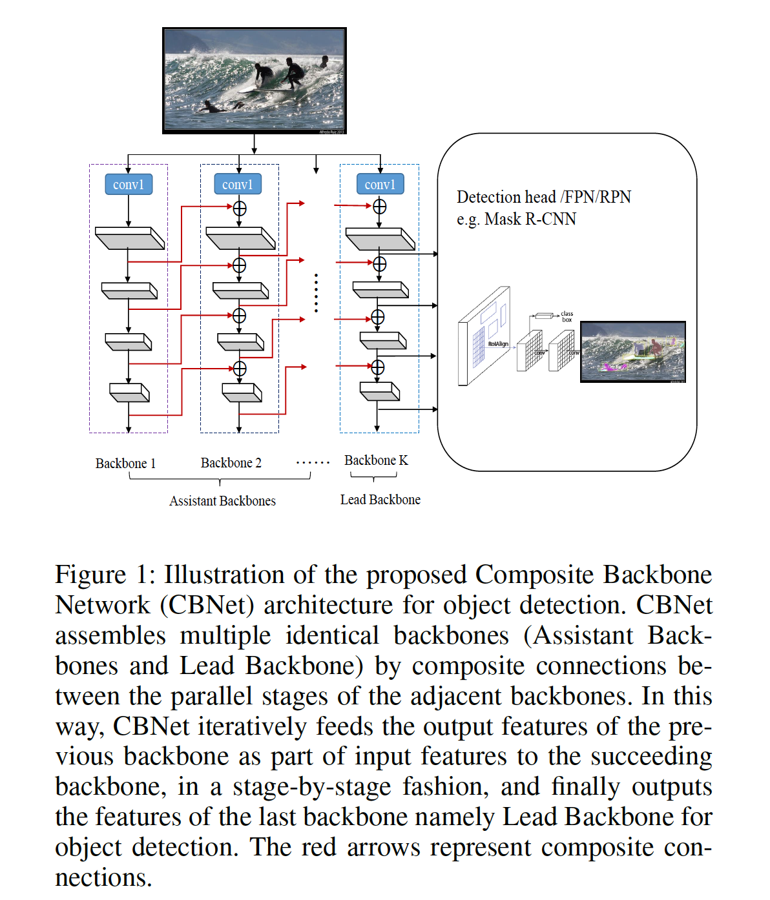

​		为了处理上述问题，如图1所示，我们提出以一种新的方式集成多个相同的主干来构建更强的目标检测主干。特别地，将集成的主干视为一个整体，其称为Composite Backbone Network（CBNet）。更具体地说，CBNet包含多个相同的骨干（称为Assistant Backbone和Lead Backbone）以及相邻骨干之间的composite connection。从左至右每个Assistant Backbone的输出（称为高级特征）作为输入的一部分，通过复合连接流到后续主干的并行阶段。 最后，最后一个称为Lead Backbone的主干的特征图用于目标检测。显然，通过CBNet提取的特征为目标检测融合了多个骨干的高级和低级特征，因此改善检测性能。值得注意的是，我们不需要预训练CBNet来训练与之集成的检测器。取而代之的是，我们只需要使用今天广泛免费使用的单个骨干的预训练模型（例如ResNet和ResNeXt）来初始化CBNet的每个集成骨干。换句话说，采用所提出的CBNet比设计新的更强的骨干和在ImageNet上预训练的骨干更加经济效率。

​		在经过广泛测试的MS-COCO基准（Lin等人，2014）上，我们通过将所提出的复合骨干网应用于几种最新的目标检测器（例如FPN、Mask R-CNN ）进行实验 。实验结果表明，所有检测器的mAP持续增加1.5％至3.0％，这证明了我们的复合骨干网的有效性。此外，借助我们的复合骨干网，实例分割的结果也得到了改善。 特别是，使用Triple-ResNeXt152，即三个ResNeXt152骨干的复合骨干网架构，我们在COCO数据集上获得了最新的最佳结果，即mAP为53.3，优于所有已发布的目标检测器。

​		总之，这项工作的主要共享有两个防霾呢：

- 我们提出一种通过集成多个骨干来构建更强目标检测的骨干的新方法，其可以显著改善不同最佳检测器的性能。
- 我们使用单个模型在MSCOCO数据集上获得了最新的最新结果，即目标检测的mAP为53.3。

### 2    Related work

​		**Object detection**	目标检测是计算机视觉的基础问题。通用目标检测的最佳方法可以简要地分为两个主要分支。第一个分支包含如YOLO、SSD、RetinaNet、FSAF和NAS-FPN的一阶段方法。另一个分支包含诸如Faster R-CNN、FPN、Mask R-CNN、Cascade R-CNN和Libra R-CNN的两阶段方法。尽管通过最近的基于CNN的检测器做出了突破，并获得令人鼓舞的结果，但是人有很大的性能提升空间。例如，在MS COCO基准测试上，最好的报告mAP仅为52.5，它是通过四个检测器的集成获得的。

​		**Backbone for Object detection**  骨干是基于CNN的检测器中提取目标检测基本特征的非常重要的组成部分。在将深度学习应用于目标检测的最初工作（例如R-CNN（Girshick等人2014）和OverFeat（Sermanet等人2013））之后，几乎所有最新的检测器都采用了预训练和微调范例，即直接使用ImageNet分类任务上预训练的网络作为它们的骨干。例如，最佳的检测器广泛采用VGG、ResNet、ResNeXt。因为这些骨干最初是用于图像分类任务，所以直接将它们用于提取目标检测的基础特征可能产生次优性能。最近，提出了两种复杂设计的骨干，即DetNet和FishNEt。这两个骨干网络专门用于目标检测任务，并且它们仍需要在训练（微调）检测器之前使用ImageNet分类任务与训练。众所周知，设计和预训练一种新的、强力骨干需要更多的人力和计算成本。作为一种替代方案，我们提出经济而高效地解决方案来构建更强的目标检测骨干，它通过集成多个相同的现有骨干实现。

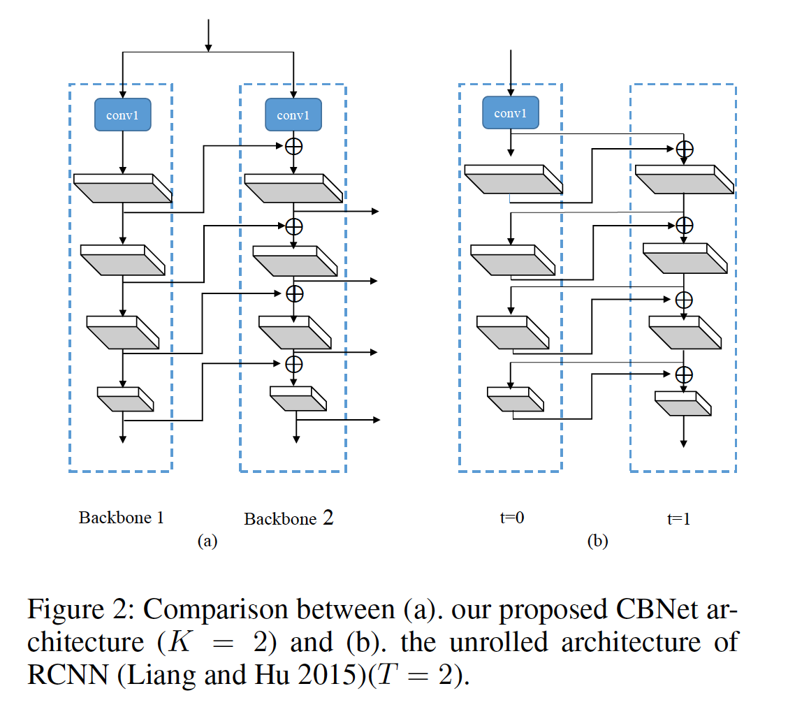

​		**Recurrent Convolution Neural Network**	如图2所示，复合骨干网络的架构在某种程度上类似于未展开的递归卷积神经网络（RCNN）（Liang and Hu 2015）架构。然而，所提出的CBNet与这个网络完全不同。第一，如图2所示，CBNet的架构实际上是完全不同的，特别是两个并行阶段的连接。第二，在RCNN中，不同时间步的并行阶段共享参数，而在所提出的CBNet中，孤帆的并行阶段并未共享参数。此外，如果我们使用RCNN作为检测器的骨干，那么我们需要在ImageNet上预训练它。然而，当我们使用CBNet时，我们没有必要预训练它。

### 3	Proposed method

#### 3.1 	Architecture of CBNet

​		所提出的CBNet架构包含$K$个相同的架构（$K\ge2$）。具体而言，我们简称$K=2$的情况为**Dual-Backbone（DB）**，$K=3$的情况为**Triple-Backbone（TB）**。

​		如图1所示，CBNet架构包含两种类型的骨干：Lead Backbone $B_k$和Assistant Backbone $B_1$、$B_2$、...、$B_{K-1}$。每个骨干包含$L$个阶段（通常$L=5$），每个阶段包含具有相同大小的特征图的几个卷积层。骨干的第$l$个阶段实现一个非线性变换$F^l(\cdot)$。

​		在传统的仅有一个骨干的卷积网络中，第$l$阶段以$l-1$阶段的输出作为输入，其可以表示为：

$$x^l=F^l(x^{l-1}), l\ge2. \tag{1}$$

与此不同，在CBNet架构中，我们新颖地利用Assistant Backbone $B_1$、$B_2$、...、$B_{K-1}$来增强Lead Backbone $B_k$的特征，这以逐阶段的方式，通过将前一层的输出作为特征的一部分迭代地馈入后续骨干。更具体地说，骨干$B_k$的第$l$阶段的输入是$B_k$的$l-1$阶段的输出（表示为$x_k^{l-1}$）和前一骨干$B_{k-1}$的并行阶段的输出（表示为$x_{k-1}^l$）的融合：

$$x_k^l = F_k^l(x_k^{l-1} + g(x_{k-1}^l)), l\ge2, \tag{2}$$

其中$g(\cdot)$表示composite connection，其包含一层$1\times1$卷积层和BN层来减小通道以及一个上采样操作。因此，$B_{k-1}$中的第$l$个阶段的输出特征转换到$B_k$中相同阶段的输入，并加到原始的输入特征图以通过相应的层。考虑到这种复合样式将前一骨干网络的相邻较高阶段的输出馈送到后续骨干网络，我们称之为Adjacent Higher-Level Composition（AHLC）。

​		对于目标检测任务，仅将Lead Backbone $x_K^l(l=2,3,\cdots,L)$用作RPN/detection头部，而Assistance Backbones的每个阶段的输出传入其相邻的骨干。此外，CBNet中的$B_1、B_2、\cdots、B_{K-1}$可以采用多种骨干架构，例如ResNet或ResNeXt，并可以直接从单个骨干的预训练模型上初始化。

#### 3.2	Other possible composite styles

**Same Level Composition（SLC）** 一种直观而简单的复合方式是融合骨干相同阶段的输出特征。Same Level Composition（SLC）操作可以表示为：

$$x_k^l = F_k^l(x_k^{l-1} + x_{k-1}^{l-1}), l\ge2.\tag{2}$$

更加具体地说，图3（b）展示$K=2$时的SLC的结构。

**Adjacent Lower-Level Composition（ALLC）** 与AHLC相反，另一种直观的复合方式是将前一骨干的相邻的更低级输出传入后一骨干。Adjacent Lower-Level Composition（ALLC）操作可以表示为：

$$x_k^l=F_k^l(x_k^{l-1} + g(x_{k-1}^{l-1})), l\ge2.\tag{4}$$

​	更加具体地说，图3（c）展示$K=2$时的SLC的结构。

**Dense Higher-Level Composition（DHLC）**在DenseNet中，每一层都会连接到所有后续层以在一个阶段中构建密集连接。受此启发，我们可以在CBNet中使用密集复合连接。DHLC可以表示为：

$$x_l^l=F_k^l(x_k^{l-1} + \sum_{i=l}^Lg_i(x_{k-1}^i)), l\ge2.\tag{5}$$

如图3（d）所示，当$K=2$时，我们集成Assistant Backbone中的所有更高级阶段的特征，并将复合特征加到Lead Backbone的前一阶段的输出特征中。

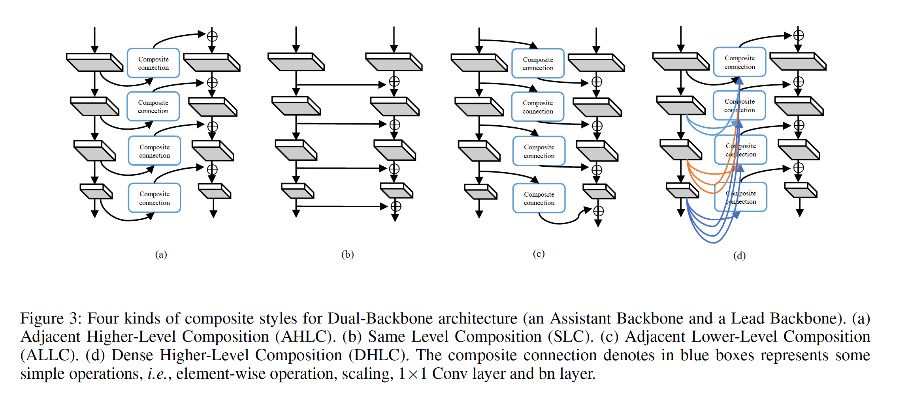

#### 3.3 Architecture of detection network with CBNet

​		CBNet可用于各种现成的目标检测器，而无需对网络体架构进行其他修改。在实践中，我们将Lead Backbone的层连接到功能网络，例如RPN（Ren等人2015）、检测头（Redmon等人2016; Ren等人2015; Zhang等人2018; Lin等人2017a; He et al.2017; Cai and Vasconcelos 2018）。

### 4	Experiments

#### 4.1	Implementation details

​		本文的基线方法时基于Detectron框架的复现。所有基线采用单尺度策略训练，但Cascade Mask R-CNN ResNeXt152除外。具体而言，图像的短边调整到800，长边限制到1333。我们在4张Nvidia Titan X GPU上进行大多数实验。此外，我们利用4张Nvidia P40 训练具有Dual-ResNeXt152 的Cascade Mask R-CNN，利用4张Nvidia V100 训练具有Triplet ResNeXt152的Cascade Mask R-CNN。数据增强仅使用水平翻转图像。对于大多数原始的基线，单个GPU上的batch size为2。由于GPU内存的限制，对于CBNet的训练，每张GPU上放一张图像。此外，将初始学习率设置为默认值的一半，训练周期数与原始基线相同。值得注意的是，除了初始学习率和batch size，没有改变基线的其他配置。

​		推理期间，我们完全使用原始基线的配置。对于不同骨干的Cascade Mask R-CNN，我们进行单尺度和多尺度测试。对于基线检测器，我进行单尺度测试，其中输入图像的短边调整到800，长边限制到1333。值得注意的是，为了公平比较，我们不使用Soft-NMS。

#### 4.2	Detection results

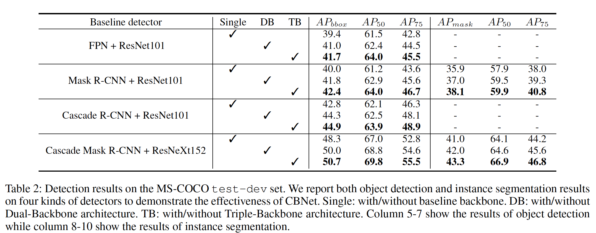

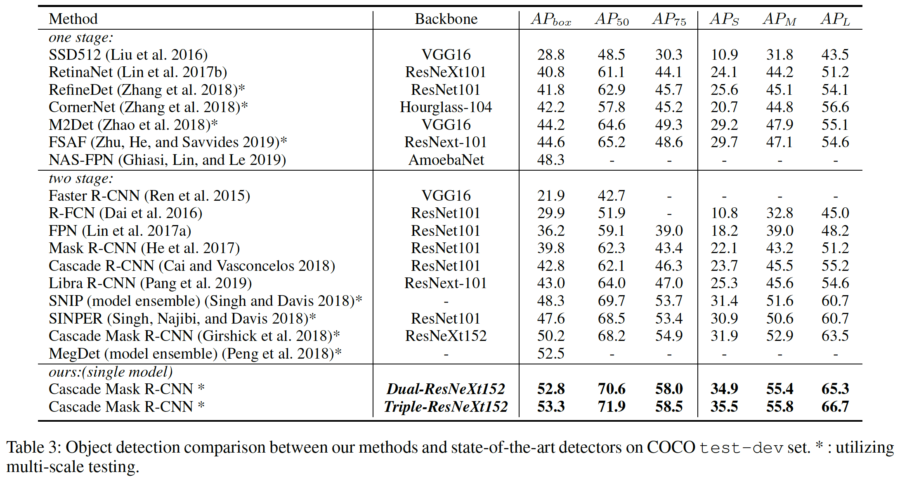

#### 4.3	Comparisons of different composite styles

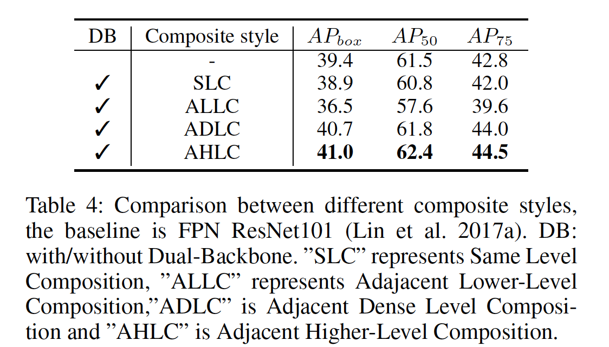

#### 4.4	Sharing weights for CBNet

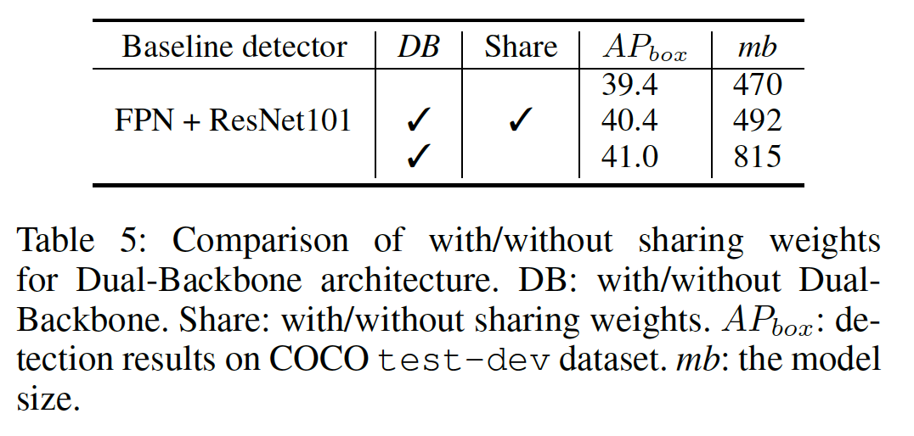

#### 4.5	Number of backbones in CBNet

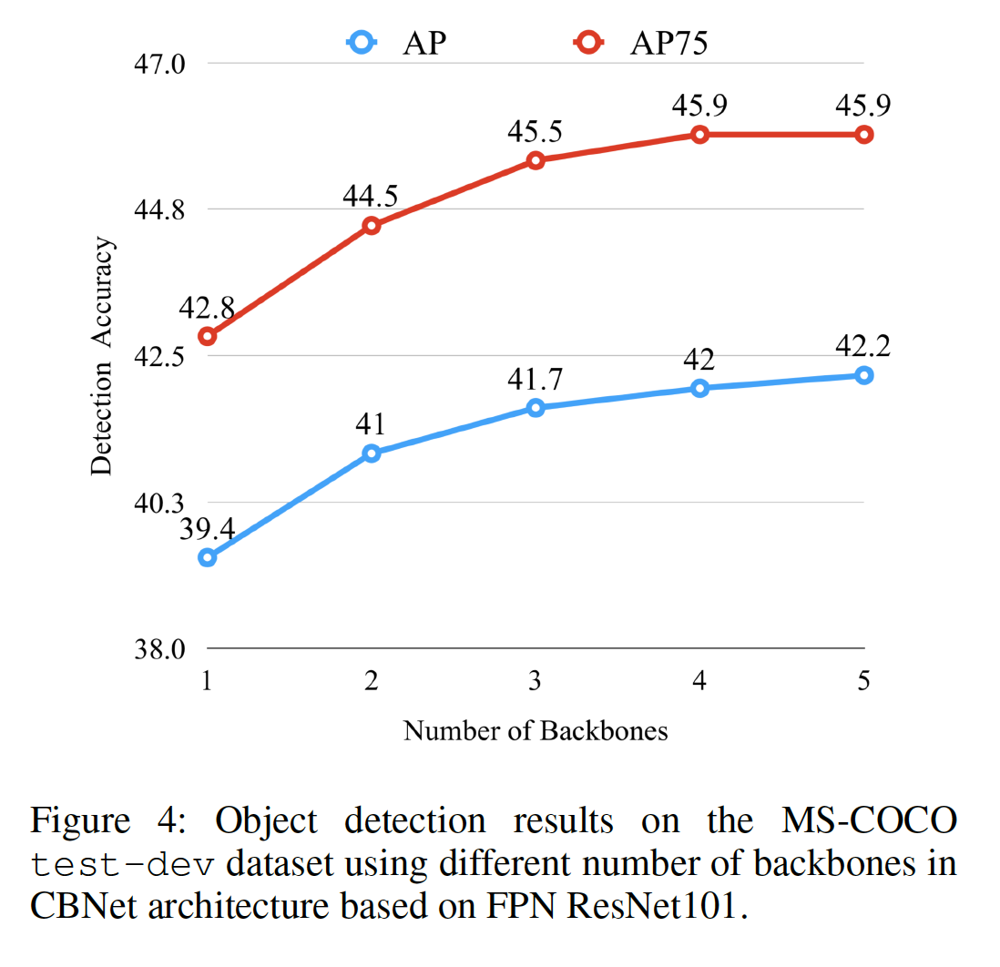

#### 4.6	An accelerated version of CBNet

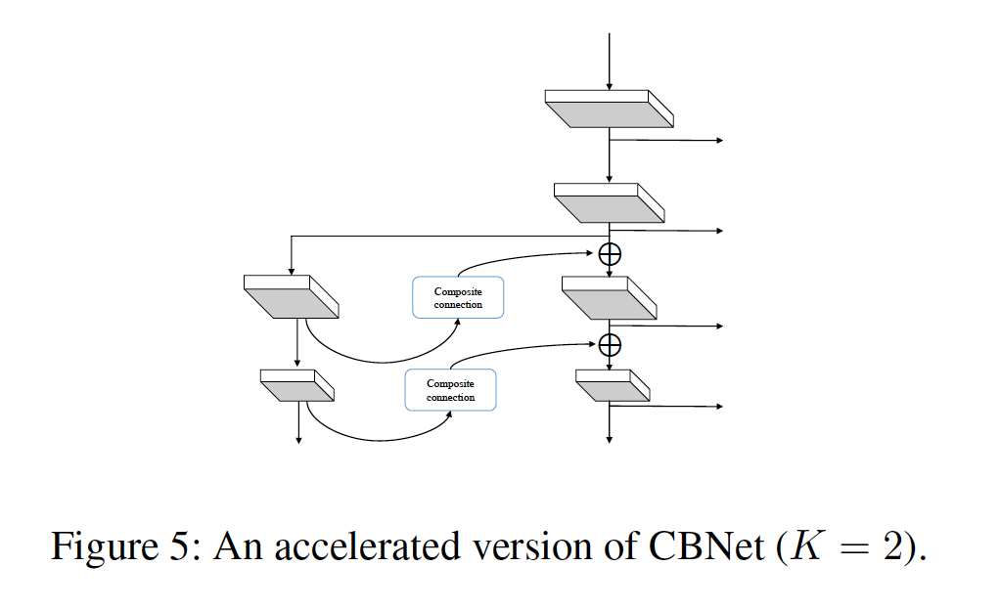

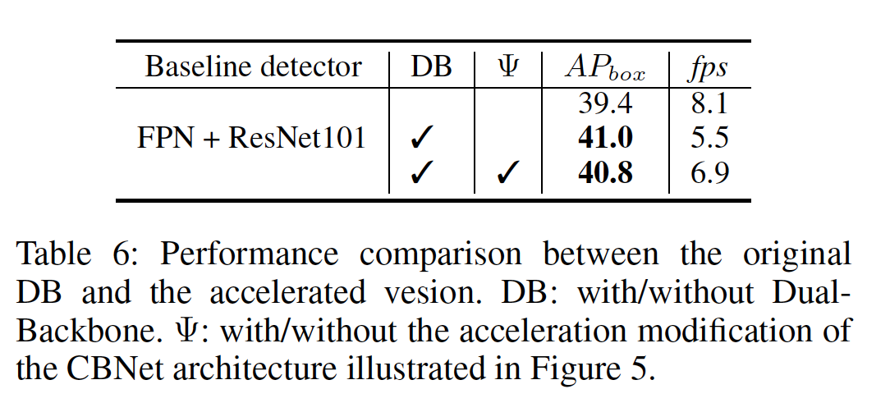

#### 4.7	Effectiveness of basic feature enhancement by CBNet

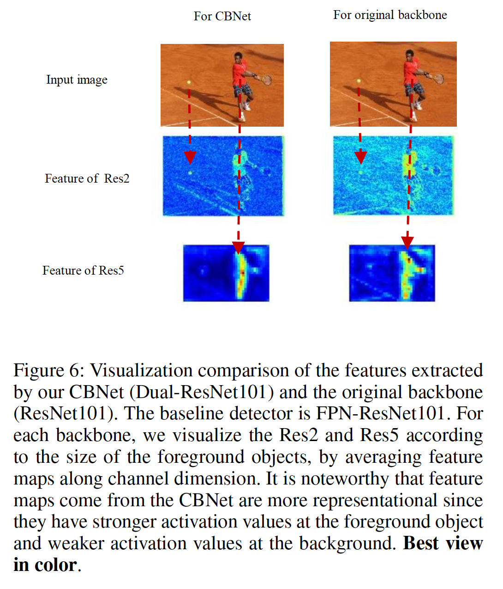