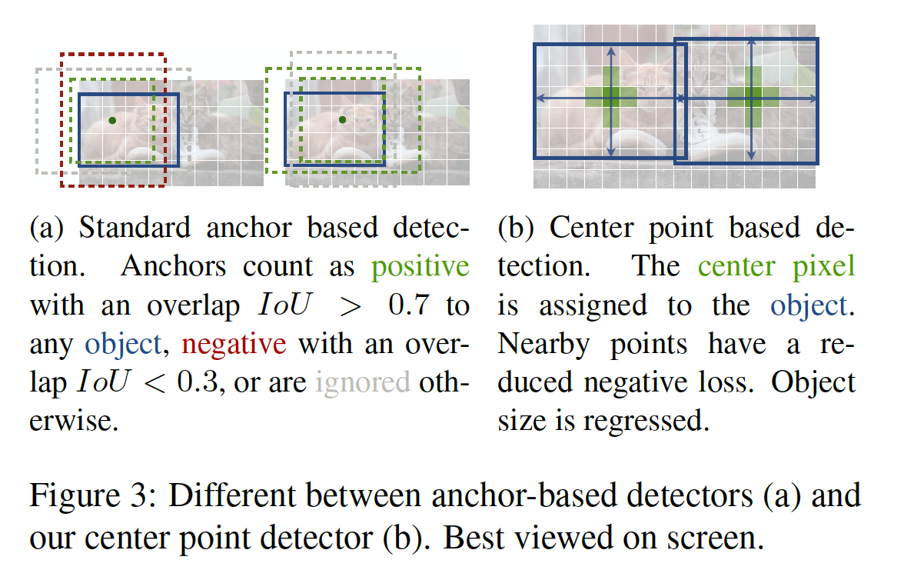
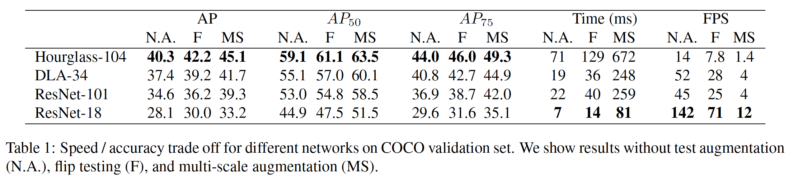
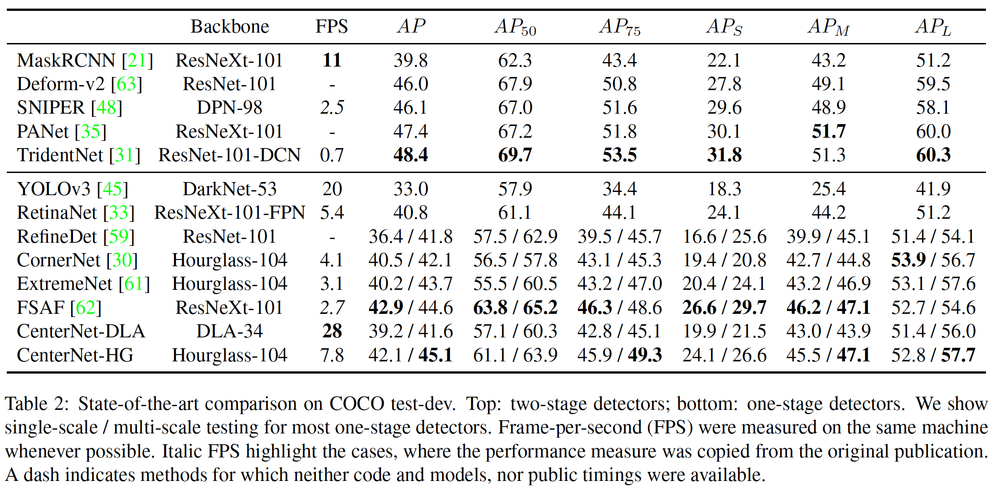
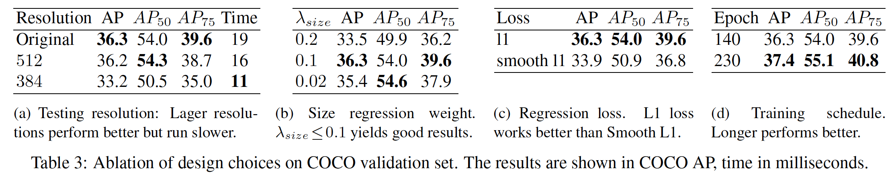
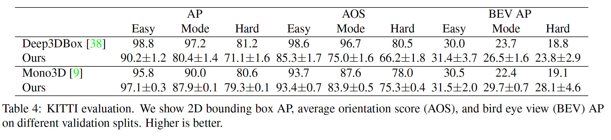
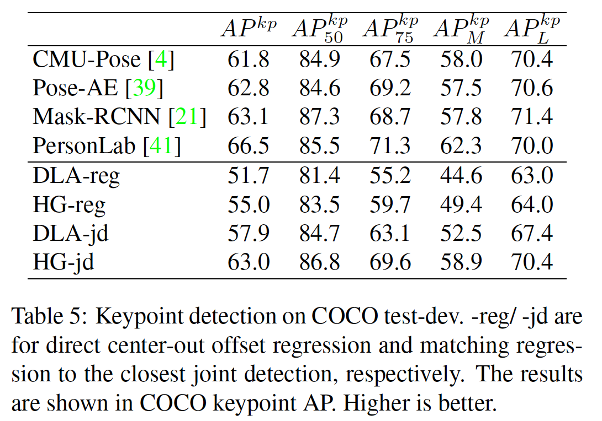
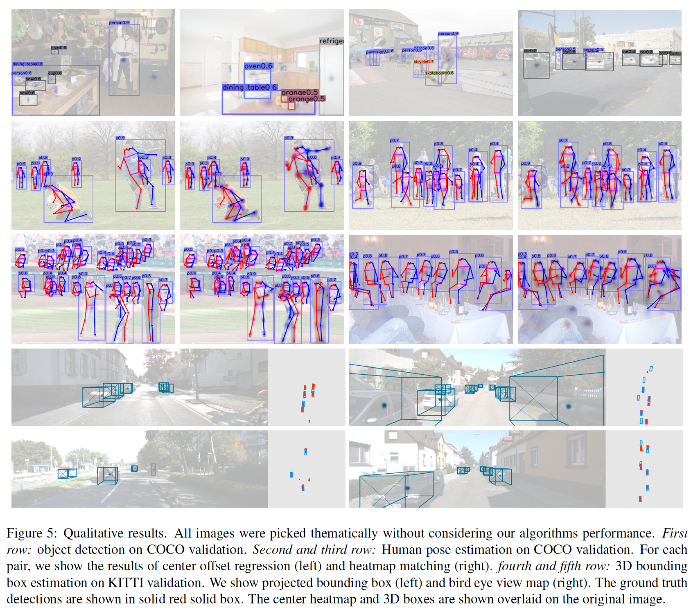
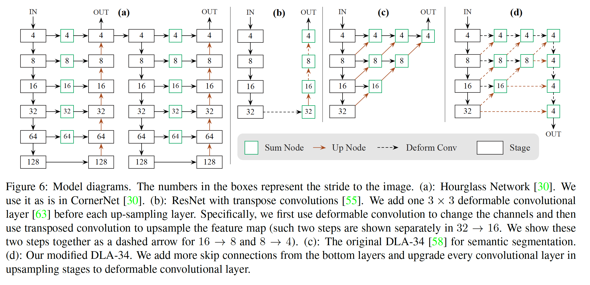
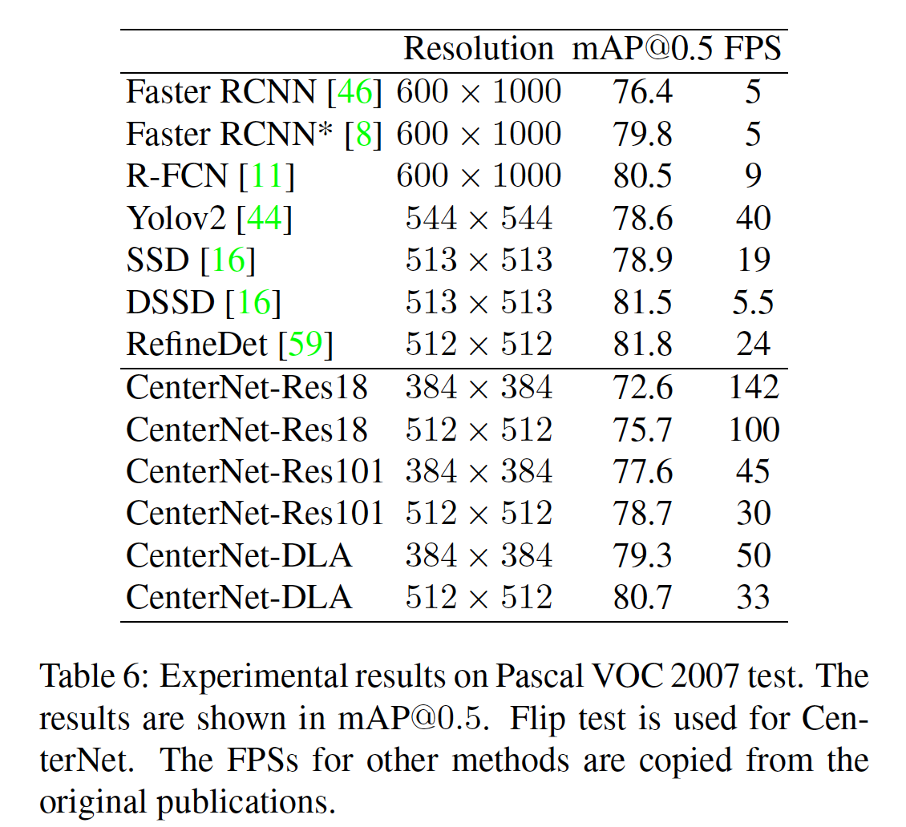
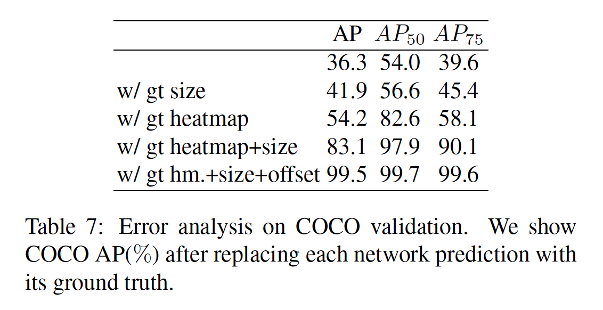

## Objects as Points

### Abstract

​		检测将目标识别为途中轴对齐的边界框。最成功的目标检测器会列举出潜在目标位置详尽的清单，并对每个目标进行分类。这是浪费的、低效的，并且需要额外的后处理。本文中，我们采用不同的方法。我们将一个目标建模为单个点——其边界框的中心点。我们的检测器使用关键点估计来找出中心点，并回归所有的其他属性，例如大小、3D位置、方向甚至姿态。我们的基于中心点的方法（CenterNet）是端到端可微的，比基于边界框的检测器更简单、更快速以及更准确。CenterNet在MS COCO数据集上获得最佳的速度准确率平衡，即142FPS获得28.1%的AP、52FPS获得37.4%的AP、多尺度测试下以1.4FPS的速度获得45.1%的AP。我们使用相同的方法估计KITTI基准测试中的3D边界框，以及COCO关键点数据集中的人体姿态。我们的方法与复杂的多阶段方法相比具有竞争优势，并且可以实时运行。

### 1. 引言

​		目标检测强化了如实例分割、姿态估计、跟踪和行为识别计算机视觉任务。它有监控、自动驾驶和视觉问题回答等下游任务。当前的目标检测器通过紧密包围目标的轴对齐边界框表示每个目标。然后，它们将目标检测简化为大量潜在目标边界框的图像分类。对于每个边界框，分类器确定图像内容是否是特定的目标或背景。单阶段检测器[33、43]在图像上滑动复杂排列的边界框（称为锚点），并在不指定框内容的情况下直接对其进行分类。两阶段检测器[18、19、46]重新计算每个潜在边界框的图像特征，然后分类这些特征。然后使用后处理（非极大值抑制）通过计算边界框IoU来删除相同实例的重复检测。这种后处理难以微分和训练[23]，因此当前的大多数检测器不是端到端可训练的。然而，过去五年，这种思想取得了良好的经验成功[12、21、25、26、31、35、47、48、56、62、63]。但是，基于滑动窗口的目标检测器有一点浪费，因为它们需要枚举所有可能的目标位置和维度。

​		本文中，我们提供更简单和更有效的替代方案。我们通过目标边界框中心的单一点表示目标（见图2）。诸如目标大小、维度、3D范围、方向和姿态的其他属性直接同中心位置的图像特征回归。然后，目标检测变成标准的关键点估计问题[3、39、60]。我们简单地将输入图像馈入到生成热图的全卷积网络[37、40]。热图中的峰值对应目标中心。每个峰值上图像特征预测目标边界框的高度和宽度。使用标准的密集监督学习训练模型[39、60]。推理是单个网络前向，没有后处理的非最大抑制。

​		我们的方法是通用的，只需少量工作即可扩展到其他任务。我们通过在每个中心点预测额外的输出，进行3D目标检测和多人姿态估计的实验（见图4）。对于3D边界框估计，我们回归目标的绝对深度、3D边界框估计和目标方向[38]。对于人体姿态估计，我们将2D关节位置视为到中心的偏移，并直接在中心点位置回归它们。

​		我们的方法CenterNet简单易用，可使其以极高的速度运行（图1）。凭借简单的Resnet-18和上采样卷积层[55]，我们的网络以142 FPS速度和28.1％的COCO边界框AP运行。利用仔细设计的关键点估计网络（DLA-34），我们的网络以52FPS的速度获得37.4%的 COCO AP。配备最佳关键点估计网络（Hourglass-104）和多尺度测试，我们的网络获得45.1%的 COCOAP，速度为1.4FPS。在3D边界框估计和人体姿态估计中，我们以更高的推理速度与最新技术竞争。代码见 https://github.com/xingyizhou/CenterNet。

### 2.  相关工作

​		**Object detection by region classification**	RCNN [19]是第一个成功的深度目标检测器之一，它从大量的区域候选中枚举目标位置，然后对其进行裁剪，并使用深度网络对其进行分类。相反，Fast-RCNN[18]裁剪图像特征以节约计算。然而，两个方法都依赖较慢的低级区域提议方法。

​		**Object detection with implicit anchors**	Faster RCNN[46]在检测网络中生成区域提议。它在低分辨率图像网格周围采样固定形状的边界框（锚），并将每个边界框分类为“前景”或“背景”。如果一个锚与任意ground-truth目标的重叠大于0.7，那么这个锚标记为前景；如果重叠小雨0.3，那么标记为背景；忽略其他锚。然后，又分类每个生成的区域提议。将提议分类器改为包含一阶段检测器的多类分类器。一阶段检测器的几种改进包括锚形状先验[44、45]、不同特征分辨率[36]和不同样本之间的损失重新加权[33]。

​		我们的方法与基于锚的一阶段方法紧密相关[33、36、43]。˙中心点可以视为单个形状无关的锚（见图3）。但是，存在几点差异。**第一，CenterNet仅根据位置而不是边界框重叠来分配“锚” [18]，没有手工阈值用于前景和背景分类。第二，每个目标仅有一个“锚”，因此不需要NMS。我们在关键点热图上仅提取局部峰值。第三，与传统的目标检测器（输出步长为16）相比，CenterNet使用更大的输出分辨率（输出步长为4）。这消除了对多个锚的需求[47]。**

​		**Object detection by keypoint estimation**	我们不是第一个使用关键点估计进行目标检测的人。CornerNet[30]将两个边界框角点检测为关键点，而ExtremeNet[61]检测所有目标的最上点、最左点、最下点、最右点和中间点。这两种方法都基于与CenterNet相同的健壮关键点估计网络。但是，他们需要在关键点检测之后进行组合分组，这会显着降低每种算法的速度。另一方面，我们的CenterNet简单地提取每个目标的单个中心点，而不需要分组或后处理。

​		**Monocular 3D object detection**	3D边界框估计为自动驾驶提供了动力[17]。Deep3Dbox [38]使用慢速RCNN [19]样式的框架，首先检测2D目标[46]，然后将每个目标馈入3D估计网络。3D RCNN[29]将额外的头部添加到Faster R-CNN，接着是3D映射。Deep Manta [6] 使用由粗到精的、经过多任务训练的Faster RCNN。我们方法与Deep3Dbox[38]或3DRCNN[29]的一阶段版本相似。因此，CenterNet比竞争方法简单得多，而且速度更快。

### 3. Preliminary

​		令 $I \in R^{W \times H \times 3}$ 为宽为 $W$ 和高为 $H$ 的输入图像。我们的目标是产生关键热图 $\hat{Y} \in [0, 1]^{\frac{W}{R} \times \frac{H}{R} \times C}$，其中 $R$ 为输出步长，$C$ 为关键点的类型数。在人体姿态估计中，关键点数为 $C=17$；在目标检测中，关键点数为 $C = 80$ 个目标类别。我们使用文献[4、40、42]中的默认输出步长 $R = 4$ 。输出步长以因子 $R$ 对输出预测进行下采样。预测 $\hat{Y}_{x,y,c} = 1$ 对应检测到的关键点，而 $\hat{Y}_{x,y,c} = 0$ 为背景。我们使用几种不同的全卷积网络编码器-解码器来从图像 $I$ 预测 $\hat{Y}$：stacked hourglass network[30、40]、up-convolutional residual network（ResNet）[22、55]和deep layer aggregation（DLA）[58]。

​		我们遵循Law和Deng [30]训练关键点预测网络。对于类 $c$ 的每个ground-truth 关键点 $p \in \mathcal{R}^2$，我们计算低分辨率的等效 $\tilde{p} = \lfloor\frac{p}{R}\rfloor$ 。然后，我们使用高斯核 $Y_{xyc} = \exp(-\frac{(x - \tilde{p}_x)^2 + (y - \tilde{p}_y)^2}{2\sigma^2_p})$（其中 $\sigma_p$为目标尺寸自适应的标准差[30]）将ground-truth关键点分配到热图 $Y \in [0,1]^{\frac{W}{R}\times\frac{H}{R}\times C}$。如果相同类的两个高斯核重叠，我们取逐元素最大[4]。训练目标是减少损失的像素点逻辑回归[33]：

$$L_k = \frac{-1}{N}\sum_{xyc}\begin{cases}(1 - \hat{Y}_{xyc}^\alpha)\log(\hat{Y}_{xyc}) &\mbox{if } Y_{xyc} = 1 \\ (1-Y_{xyc})^{\beta}(\hat{Y}_{xyc})^\alpha\log(1 - \hat{Y}_{xyc}) &\mbox{otherwise}\end{cases} \tag{1}$$

其中 $\alpha$ 和 $\beta$ 为focal loss 的超参数，$N$ 为图像 $I$ 中的关键点数。选择 $N$ 进行归一化以将所有正 focal loss 实例归一化为1。在我们的所有实验中，我们使用 $\alpha = 2$ 和 $\beta = 4$，这遵循Law和Deng [30]。

​		为了恢复由输出步长引起的离散化误差，我们还预测每个中心点的局部偏移 $\hat{O} \in \mathcal{R}^{\frac{W}{R} \times \frac{H}{R} \times 2}$。所有类 $c$ 共享相同的偏移预测。利用 L1 损失训练偏移

$$L_{off} = \frac{1}{N} \sum_p|\hat{O}_{\tilde{p}} - (\frac{p}{R} - \tilde{p})|. \tag{2}$$

监督斤在关键点位置 $\tilde{p}$ 处起作用，忽略其他位置。

​		在下一节中，我们介绍如何将关键点估计扩赞到通用的目标检测器。

### 4. Objects as Points

​		令 $(x_1^{(k)}, y_1^{(k)}, x_2^{(k)}, y_2^{(k)})$ 为类 $c_k$ 的目标 $k$ 的边界框。它的中心点位于 $p_k = (\frac{x_1^{(k)} + x_2^{(k)}}{2}, \frac{y_1^{(k)} + y_2^{(k)}}{2})$ 。我们使用关键点估计 $\hat{Y}$ 来预测所有中心点。此外，我们回归每个目标 $k$ 的目标大小 $s_k = (x_2^{(k)} - x_1^{(k)}, y_2^{(k)} - y_1^{(k)})$ 。为了限制计算负担，我们为所有目标类使用但尺寸预测 $\hat{S} \in \mathcal{R}^{\frac{W}{R} \times \frac{H}{R} \times 2}$。我们在中心点使用与目标（2）相似的 L1 损失：

$$L_{size} = \frac{1}{N}\sum_{k=1}^N|\hat{S}_{pk} - s_k|.\tag{3}$$

我们不归一化尺度，并直接使用原始的像素坐标。相反，我们通过常量 $\lambda_{size}$ 来缩放损失。整体训练目标为

$$L_{det} = L_{k} + \lambda_{size} L_{size} + \lambda_{off} L_{off} .\tag{4}$$

除非特别说明，所有实验中，我们使用 $\lambda_{size} = 0.1$ ，$\lambda_{off} = 1$ 。我们使用单个网络预测关键点 $\hat{Y}$ 、偏移 $\hat{O}$ 和尺寸 $\hat{S}$ 。网络在每个位置预测 $C+4$ 个输出。所有输出共享常用的全卷积骨干网络。对于每种模态，然后将主干的特征传递给一个单独的 $3\times 3$ 卷积、ReLU和另一个 $1 \times 1$ 卷积。图4给出了网络输出的概览。第5节和补充材料包含架构的详情。

**From points to bounding boxes**	推理时，我们首先为每个类独立的提取热图中的峰值。我们检测所有值大于或等于其8连通邻居的响应，并保持前100个峰值。令 $\hat{\mathcal{P}}_c$ 为类 $c$ 的 $n$ 个检测中心点 $\mathcal{P} = \{(\hat{x}_i, \hat{y}_i)\}_{i=1}^n$ 的集合。每个关键点由整型坐标 $(x_i, y_i)$ 给出。我们使用关键点值 $\hat{Y}_{x_iy_ic}$ 作为其检测置信度的衡量，并在位置上产生边界框 $(\hat{x}_i, \delta \hat{x}_i - \hat{w}_i / 2, \hat{y}_i + \delta \hat{y}_i - \hat{h}_i / 2, \hat{x}_i + \delta \hat{x}_i + \hat{w}_i / 2, \hat{y}_i + \delta \hat{y}_i + \hat{h}_i / 2)$ 。

其中 $(\delta \hat{x}_i, \delta \hat{y}_i) = \hat{O}_{\hat{x}_i, \hat{y}_i}$ 为偏移预测，$(\hat{w}_i,\hat{h}_i) = \hat{S}_{\hat{x_i}, \hat{y}_i}$ 为大小预测。根据关键点估计直接生成所有输出，而不需要基于IoU的NMS或其他后处理。峰值关键点提取可以作为NMS的替代方案，并且可以使用 $3 \times 3$ 最大池化操作在设备上有效地实现。

#### 4.1. 3D 检测

​		3D 检测每个目标的三维边界框，并需要每个中心点的三个额外属性。我们为它们（深度、3D维度和方向）中的每一个添加单独的头部。每个中心点的深度 $d$ 是单一的标量。但是，深度难以直接回归。相反，我们使用Eigen等 [13] 的输出变换，$d = 1 / \sigma(\hat{d}) - 1$ ，其中 $\sigma$ 为sigmoid函数。我们将深度计算为关键估计器的额外输出通道 $\hat{D} \in [0, 1]^{\frac{W}{R} \times \frac{H}{R}}$ 。它再次使用由ReLU分隔的两个卷积层。与前面的模态不同，它在输出层使用逆sigmoid变换。我们在sigmoid变换后，使用L1损失在原始深度域中训练深度估计器。

​		目标的3D维度是三个标量。我们使用单独的头部 $\hat{\Gamma} \in \mathcal{R}^{\frac{W}{R}\times\frac{H}{R}\times3}$和 L1 损失对其绝对值以米为单位直接回归。

​		默认情况下，方向是一个单一标量。但是，它难以回归。我们遵循Mousaviandeng [38] 的方法，并将方向表示为in-bin回归中的两个bin。具体而言，方向使用8个标量编码，每个bin包含4个标量。对于一个bin，使用两个标量进行softmax分类，剩下的两个标量回归每个bin中的一个角度。有关这些损失的详细信息，请参阅补充资料。

#### 4.2. 人体姿态估计

​		人体姿态估计旨在估计图像每个人体实例的 $k$ 个 2D 人体关节位置（对于COCO，$k = 17$）。我们将姿态视为中心点的 $k \times 2$ 维属性，并通过其到中心点的偏移参数化每个关键点。我们利用 L1 损失直接回归到关机偏移（像素）$\hat{J} \in \mathcal{R}^{\frac{W}{R} \times \frac{H}{R} \times k \times 2}$ 。我们通过掩膜损失忽略不可见的关键点。这产生与slow-RCNN版副本Toshev等 [51] 和 Sun等 [49] 相似的多人人体姿态估计器。

​		为了精炼关键点，我们使用标准的自下而上的多人姿态估计 [4、39、41] 估计 $k$ 个人体关键点热图 $\hat{\Phi}\in\mathcal{R}^{\frac{W}{R} \times \frac{H}{R} \times k}$。我们利用 focal loss 训练人体关节热图和与第3节中讨论的雨中心检测相关的局部像素偏移。

​		然后，我们将初始预测捕捉到此热图中最接近的检测到的关键点。这里，我们的中心偏移用作分组提示，以将各个关键点检测分配给其最接近的人物实例。具体而言，令 $(\hat{x},\hat{y})$ 为检测到的中心点。我们首先回归所有关节位置 $l_j = (\hat{x}, \hat{y}) + \hat{J}_{\hat{x}\hat{y}j}$，$j\in 1,\cdots, k$ 。我们还从相应热图 $\Phi_{\cdot\cdot j}$ 提取每个关节类型 $j$ 的置信度大于 $0.1$ 的所有关键点位置 $L_j = \{\tilde{l}_{ji}\}_{i=1}^{n_j}$ 。然后，我们仅考虑检测目标边界框内的关节检测，将每个回归位置 $l_j$ 分配给其最接近的检测到的关键点 $\arg \min_{l \in L_j}(l - l_j)^2$ 。

### 5. 实现细节

​		我们利用四种架构进行实验：ResNet-18、ResNet-101、DLA-34 和 Hourglass-104。我们使用可变形卷积层[12]修改ResNets和DLA-34，并按原样使用Hourglass网络。

​		**Hourglass**	stacked Hourglass Network将输入下采样4倍，接着是两个连续的hourglass模块。每个hourglass模块是具有skip链接的对称的5层下采样卷积网络和上采样卷积网络。这个网络非常大，但是通常产生最佳的关键点估计性能。

​		**ResNet**	Xiao等 [55] 利用三层上采样卷积网络来扩展标准的残差网络 [22] ，从而允许更高分辨率的输出（输出步长为 4）。我们首先将三个上采样层的通道分别修改为 256、128、64，从而节约计算。然后，我们在每个上采样卷积之前添加一个 $3 \times 3$ 可变性卷积层，通道分别为 256、128、64。上采样卷积核初始化为双线性插值。有关详细的架构图，请参见补充材料。

​		**DLA**	Deep Layer Aggregation（DLA）是具有层次 skip connection 的图像分类网络。我们利用DLA的全卷积上采样版进行密集预测，其使用迭代的深度聚合来对称地增加特征图的分辨率。我们利用可变性卷积来增强从更低层到输出的skip connection。具体而言，我们利用 $3 \times 3$ 可变性卷积替换每个上采样层中的原始卷积。更多细节见补充材料。

​		我们在每个输出头部之前添加一个具有 256 通道的 $3 \times 3$ 卷积层。然后，利用一个 $1 \times 1$ 卷积产生期望的输出。在补充材料中提供了更多细节。

​		**Training**	我们在 $512 \times 512$ 的输入分辨率上训练。每个模型产生 $128 \times 128$ 的输出分辨率。我们使用随机翻转、随机缩放（0.6到1.3之间）、裁剪和颜色扰动作为数据增强，并使用Adam来优化整体目标函数。训练3D估计分支时，不适用数据增强，因为裁剪或缩放会改变3D的测量。对于ResNet和DLA-34，我们利用128的batch-size（8个GPU）和5e-4的学习率训练140个周期，学习率在90和120个周期时减小10倍。对于Hourglass-104，我们遵循ExtremeNet[61]，并使用batch-size29（在5个GPU上，住GPU的Batch-size为4）以及学习率2.5e-4训练50个周期，学习率在40个周期时减小10倍。对于检测，我们从ExtremeNet[61]微调Hourglass-104以节约计算。ResNet-101和DLA-34利用ImageNet预训练的权重初始化，上采样层随机初始化。ResNet-101和DLA-34在9个TITAN-V GPU上训练2.5天，而Hourglass-104需要5天。

​		**Inference**	我们使用三种级别的测试增强：无需增强、翻转增强和翻转与多尺度（0.5、0.75、1、1.25、1.5）增强。对于翻转，我们在解码边界框之前平均网络输出。对于多尺度，我们使用NMS来融合结果。这些增强产生不同的速度-准确率平衡。

### 6. 实验

​		我们在MS COCO数据集上评估我们的目标检测的性能，这包含118k训练图像（train2017）、5k验证图像（val2017）和20k留一测试图像（test-dev）。我们在所有IoU阈值上报告平均准确率（$AP$）、IoU阈值0.5时的AP（$AP_{0.5}$）和IoU阈值0.75时的AP（$AP_{0.75}$）。

#### 6.1. 目标检测

​		表1给出不同骨干和测试选项在COCO验证上的结果，而图1将CenterNet与其他实时检测器比较。在我们的Intel Core i7-8086K CPU、Titan Xp GPU、Pytorch 0.4.1、CUDA9.0和CUDNN7.1的本地机器上测试运行时间。

​		Hourglass-104在相对较好的速度下获得更好的性能，即7.8FPS下获得42.2%的AP。在这种骨干下，CenterNet比CornerNet（4.1FPS、40.6%AP）和ExtremeNet（3.1FPS、40.3%AP）好。运行时间的增加主要来自更少的输出头部和更简单的边界框解码。更好的准确率表明，检测中心点比检测角点或极点更容易。

​		使用ResNet-101，在相同的网络主干下，我们的方法比RetinaNet好。我们仅在上采样层中使用可变性卷积，其没有影响RetinaNet。在相同的精度下，我们的速度快了两倍（CenterNet 为 34.8% AP、45 FPS（输入 $512 \times 512$ ） vs RetinaNet 为34.4% AP、18 FPS（输入为 $500 \times 800$））。最快的ResNet-18模型也获得142 FPS、和28.1% COCO AP的可接受性能。

​		DLA-34 给出最佳的sud/准确率平衡。它以52FPS的速度运行，并获得37.4% AP，这比YOLOv3快两倍，AP高4.4%。利用翻转测试，我们的模型仍比YOLOv3快，并获得与Faster-RCNN-FPN相似水平的准确率（CenterNet 39.2%

AP 、28 FPS vs Faster-RCNN 39.8% AP 、 11 FPS）。

​		**Sate-of-the-art comparison**	见表2。 

#### 6.1.1	附加实验

​		在不幸的情况下，如果两个目标完美对齐，它们可能会共享同一中心。在这种场景中，CenterNet仅会检测它们中的一个。我们从研究这种情况在实践中发生的频率开始，并将其与竞争方法的错失检测联系起来。

​		**Center point collision**	在COCO训练集中，在步长4时，有614对目标有相同的中心点。总共有860001个目标，因此CenterNet不能预测小于0.1%的目标，因为中心点冲突。这比因区域提议不完善而导致慢速或快速RCNN丢失（大约2%）的情况要少得多[52]，比由于锚放置不足而基于锚的方法丢失（对于15个锚、0.5 IoU阈值的Faster R-CNN为20%）的情况要少[46]。此外，715对目标的边界框IoU大于0.7，并分配到两个锚，因此基于中心点的分配引起更少的冲突。

​		**NMS**	为了验证CenterNet需要基于IoU的NMS，我们将NMS作为四种预测的后处理步骤。对于DLA-34（翻转测试），AP从39.2%提高到39.7%。对于Hourglass-104，AP仍未42.%。监狱风云影响很小，我们不再使用NMS

​		**训练和测试分辨率**	训练期间，我们将输入分辨率固定到 $512 \times 512$。测试期间，我们遵循CornerNet [30]来保持原始图像分辨率并将输入零填充到网络的最大步长。对于ResNet和DLA，我们最多填充32像素，最迂HourglassNet，我们使用128像素。如表3a所示，保持原始分辨率略大于固定的测试分辨率。在更低分辨率（$384 \times 384$）上的训练测试以快1.7倍的速度运行，但是准确率下降3AP。

​		**回归损失**	我们比较用于大小回归普通的L1损失和SmoothL1。表3c中的实验表明L1比Smooth L1好。在精细尺度上，它产生更好的准确率，这对于COCO评估标准是相当敏感的。在关键点回归中可以独立观察到这一点[49，50]。

​		**边界框大小权重**	我们分析本文方法对损失权重 $\lambda_{size}$ 的敏感性。表3b展示权重0.1给出较好结果。对于更大的值，AP衰减明显，这是由于损失的尺度范围从0到输入尺寸的 $w/R$ 或 $h/R$，而不是0到1。但是，对于更低的权重，没有更非常明显的衰减。

​		**训练调度**	默认情况下，我们训练关键点估计网络140个周期，学习率在90周期时下降。如果我们在衰减学习率之前加倍训练周期，性能进一步增加1.1AP（表3d）。为了节约计算资源，我们在消融实验中使用了140个周期，但与其他方法相比，DLA坚持使用230个周期。

​		最后，我们通过回归到多个目标大小，尝试了CenterNet的多个“锚定”版本。 实验没有取得任何成功。 见补充。

#### 6.2. 3D检测

​		我们在KITTI数据集上进行3D边界框估计实验，该数据集包含在驾驶场景中为车辆精心标注的3D边界框。KITTI包含7841张训练图像，我们遵循文献 [10、54] 中的标准训练和验证划分。评估指标是在IOU阈值为0.5时，汽车在11个召回率（0.0至1.0，增量为0.1）下的平均精度，与目标检测[14]相同。我们评估基于IoU的 2D边界框（AP）、方向（AOP）和鸟瞰视角边界框（Bird-eye-view）（BEV AP）。我们保持原始图像分辨率，并填充到$1280 \times 384$ 以进行训练和测试。训练在70个周期收敛，学习率在45和60个周期时衰减。我们使用DLA-34主干，并将深度、方向和维度的权重设置为1。其他所有参数与检测实验相同。

​		由于召回阈值的数量非常少，因此验证AP的波动幅度最大为10％。 因此，我们训练了5个模型，并报告了带有标准差的平均值。

​		我们将基于slow-RCNN的Deep3DBox [38]和基于Faster-RCNN的方法Mono3D [9]进行了比较，比较了它们的具体验证结果。 如表4所示，我们的方法在AP和AOS中的表现与之相当，而在BEV方面则略胜一筹。 我们的CenterNet比这两种方法快两个数量级。

#### 6.3. 姿态估计

​		最后，我们在MS COCO数据上的人体姿态估计中评估CenterNet。我们评估关键点AP，其与边界框AP相似，但是利用目标关键点相似性替换边界框IoU。我们在COCO test-dev上测试，并与其他方法比较。

​		我们利用DLA-34和Hourglass-104实验，两者都从中心点检测微调。DLA-34在320个周期时收敛（8张GPU上大约3天），Hourglass-104在150个周期时收敛（5张GPU上用了8天）。所有额外损失的权重设置为1。所有其他超参数与目标检测相同。

​		结果见表5。对关键点的直接回归是合理的，但不是最佳。 在高IoU下，它尤其艰难。将我们的输出投影到最接近的关节检测可以改善整个结果，并且可以与最佳的多人姿势估计器竞争[4、21、39、41]。这验证了CenterNet是通用的，易于适应新任务。

​			图5给出所有任务上的定性结果。

### 附录 A：模型架构

### 附录 B：3D边界框估计细节

​		我们的网络输出深度图 $\hat{D} \in R^{\frac{W}{R} \times \frac{H}{R}}$、3D维度 $\hat{\Gamma} \in R^{\frac{W}{R} \times \frac{H}{R} \times 3}$ 和方向编码 $\hat{A} \in R^{\frac{W}{R} \times \frac{H}{R} \times 8}$。对于每个目标实例 $k$ ，我们从ground-truth中心点位置的三个输出映射（$\hat{d}_k \in R$、$\hat{\gamma}_k \in R^3$、$\hat{\alpha}_k \in R^8$）中提取输出值。在将输出转换到绝对深度域之后，使用L1损失训练深度：

$$L_{dep} = \frac{1}{N} |\frac{1}{\sigma(\hat{d}_k)} - 1 - d_k| \tag{5}$$

其中 $d_k$ 为ground-truth的绝对深度（以米为单位）。相似地，3D维度使用绝对度量标准的L1损失进行训练：

$$L_{dim} = \frac{1}{N}\sum_{k=1}^N|\hat{\gamma}_k - \gamma_k| \tag{6}$$

其中 $\gamma_k$ 为目标高度、宽度和长度（以米为单位）。

​		默认情况下，方向 $\theta$ 为为单一标量。遵循 Mousavian等 [24、38]，我们使用8个标量编码以简化学习。将8个标量分为两组，每个都有一个角度bin。一个bin对应 $B_1=[-\frac{7\pi}{6}, \frac{\pi}{6}]$ 中的角度，另一个对应 $B_2 = [-\frac{\pi}{6}, \frac{7\phi}{6}]$ 中的角度。在每个bin中，标量 $b_i \in R^2$ 中的2个用于softmax分类（如果方向属于该 bin $i$ ）。其余2个标量 $a_i \in R^2$ 用于bin内偏移（到bin中心 $m_i$）的sin和cos值，即 $\hat{\alpha} = [\hat{b}_1,\hat{a}_1,\hat{b}_2,\hat{a}_2]$。利用softmax训练分类，利用 L1损失训练角度值：

$$L_{ori} = \frac{1}{N} \sum_{k=1}^N \sum_{i=1}^2(softmax(\hat{b}_i, c_i) + c_i|\hat{a}_i - a_i|) \tag{7}$$

其中 $c_i = \mathbb{1}(\theta \in B_i)$、$a_i = (\sin(\theta - m_i), \cos(\theta - m_i))$。$\mathbb{1}$ 为指示函数。从 8 标量编码中解码出预测的方向 $\theta$ :

$$\hat{\theta} = \arctan2(\hat{a}_{j1},\hat{a}_{j2}) + m_j \tag{8}$$

其中 $h$ 为bin索引，其有更大的分类得分。

### 附录 C：冲突实验细节

​		我们分析COCO训练集的标注，以给出冲突情况发生的频率。COCO训练集（train2017）包含 $N=118287$ 张图像以及 $M = 860001$ 个目标（$M_S = 356340$ 个小型目标、$M_M = 295163$ 个重型目标和 $M_L=208498$ 个大型目标）。令类 $c$ 的图像 $k$ 中的第 $i$ 个边界框为 $bb^{kci} = (x_1^{(kci)}, y_1^{(kci)}, x_2^{(kci)},y_2^{(kci)})$，在$4\times$步长后的中心为 $p^{kci} = (\lfloor \frac{1}{4} \cdot \frac{x_1^{(kci)} + x_2^{(kci)}}{2} \rfloor, \lfloor \frac{1}{4} \cdot \frac{y_1^{(kci)} + y_2^{(kci)}}{2} \rfloor)$ 。并令 $n^{(kc)}$ 为图像 $k$ 中类 $c$ 的目标的数量。中心冲突的数量计算为：

$$N_{center} = \sum_{k=1}^N\sum_{c=1}^C\sum_{i=1}^{n^{(kc)}}\sum_{j=i+1}^{n^{(kc)}} \mathbb{1}(p^{kci} = p^{kcj}) \tag{9}$$

在数据集中，我们得到 $N_{center} = 614$ 。

​		相似地，我们通过下式计算基于IoU的冲突：

$$N_{IoU@t}=\sum_{k=1}^N\sum_{c=1}^C\sum_{i=1}^{n^{(kc)}}\sum_{j=i+1}^{n^{(kc)}}\mathbb{1}(IoU(bb^{(kci)}, bb^{(kcj)}) > t) \tag{10}$$

得到 $N_{IoU@0.7} = 715$ ，$N_{IoU@0.5}=5179$。

​		**基于锚的检测器中丢失的目标**	如果锚与ground-truth边界框的IoU大于0.5，那么RetinaNet [33] 给这个锚分配这个ground-truth。如果 $IoU> 0.5$ 的任何锚都没有覆盖ground-truth边界框，则将为其分配最大IoU的锚。我们计算这种强制分配发生的频率。我们在步长 $S=16$ 上使用15个锚（5个尺寸：32、64、128、256、512，3个纵横比：0.5、1、2，这与RetinaNet [33] 相同）。对于每幅图像，将其短边调整到800后，我们将这些锚放在位置 $\{(S/2+i\times S,S/2 + j \times S\}$，其中 $i \in [0, \lfloor \frac{W - S/2}{S}\rfloor]$、 $j \in [0, \lfloor \frac{H - S/2}{S}\rfloor]$ 。$W$、$H$ 是图像的宽度和高度（更小的一个等于 800）。这产生锚集 $\mathcal{A}$ ，$|\mathcal{A}|=15 \times \lfloor \frac{W - S/2}{S} + 1\rfloor \times \frac{H - S/2}{S} + 1\rfloor$ 。我们通过下式计算强制分配的数量：

$$N_{anchor} = \sum_{k=1}^N\sum_{i=1}^{n^{(k)}}\mathbb{1}((\max_{A\in\mathcal{A}} IoU(bb^{(b\cdot i)}, A)) < 0.5) \tag{11}$$

RetinaNet需要 $N_{anchor} = 170220$ 哥强制分配：125831个用于小型目标（小型目标的35.3%）、18505个用于中型目标（中型目标的6.3%）以及25884个大型目标（大型目标中的12.4%）。

### 附录 D：PascalVOC上的实验

​		Pascal VOC 是流行的小型目标检测数据集。我们在VOC2007和VOC2012 tranval集上训练，在VOC2007测试集上测试。该数据集包含16551张训练图像和4962张测试数据集，共有20个类。评估标准是IoU阈值0.5时的mAP。

​		我们利用修改的ResNet-18、ResNet-101和 DLA-34在两种分辨率（$384 \times 384$ 和 $512\times512$）上进行实验。对于所有网络，我们利用45和60周期分别减小10倍的学习率训练70个周期。我们使用的batchsize为32，学习率为$1.25e-4$。对于ResNet-101和DLA-34，分别在 $384\times384$ 上训练，需要一个GPU 7小时/ 10小时。对于 $512\times512$，训练在两张GPU上用了相同的时间。在测试时，使用翻转增强。所有其他超参数与COCO实验相同。我们没有使用Hourglass-104，因为当从头训练时，在合理时间（2天）内没有收敛。

​		结果见表6。

### 附录 E：误差分析

​		我们通过将每个输出头替换为其ground-truth来执行误差分析。 对于中心点热图，我们使用渲染的高斯ground-truth热图。 对于边界框大小，我们对每次检测使用最接近的ground-truth大小。

​		表7中的结果表明，改善两个尺寸图都会导致适度的性能提升，而中心图的增益要大得多。如果仅无法预测关键点偏移，则最大AP达到83.1 。由于高斯热图渲染中的离散化和估计误差，整个地ground-truth丢失大约0.5％的目标。

