## Probabilistic two-stage detection

### 摘要

​		我们开发了两阶段目标检测的概率解释。我们表明，这种概率解释会激发许多常见的经验训练实践。它还建议改变两阶段检测流水线。具体而言，第一阶段应当推断恰当的object-vs-background似然，然后，其应当告知检测器的整体分数。标准区域提议网络（RPN）不能很好地推断出这种可似然，但是许多一阶段检测器可以。我们介绍如何构从任意的SOTA一阶段检测器构建概率两阶段检测器。产生的检测器比它们一阶段和两阶段先驱都快而准。我们的检测器在COCO test-dev上，利用单尺度测试下获得56.4 mAP，比所有公开结果都好。使用轻量的骨干，在Titan Xp上，我们的检测器在COCO上以33fps获得49.2 mAP，比流行的YOLOv4模型好。

### 1. 引言

​		目标检测旨在在图像中找出所有目标，并且识别它们的位置和类别似然。一阶段检测器可以在概率合理的框架中共同推断出位置和类别的似然（Lin等2017b、Liu等2016、 Redmon＆Farhadi 2017）。训练它们来最大化标注ground-truth目标的对数似然。两阶段检测器首先找出可能的目标和它们的位置，然后（第二个阶段）分类这些潜在的目标。第一阶段被设计用以最大化召回，而第二阶段最大化通过第一阶段过滤的区域的分类目标性。虽然第二阶段有一种概率解释，但是两阶段的组合没有。

​		本文中，我们开发一种两阶段检测器的概率解释。我们通过优化两个阶段的联合概率目标的下限，提出了对标准两阶段检测器训练的简单修改。概率处理建议对两阶段架构进行更改。具体而言，第一阶段需要推断一个已校准（calibrated）目标似然。当前两阶段检测器中的区域提议网络（RPN）设计用于最大化提议召回，并且没产生准确的似然。但是，完善的一阶段检测器可以。

​		我们构建在SOTA的一阶段检测器上构建两阶段检测器。对于每个一阶段检测，我们的模型提取区域级特征，并分类它们。在第二阶段中，我们使用Faster R-CNN或者级联分类器。一起训练两阶段来最大化ground-truth目标的对数似然。在推理时，我们的检测器使用这种最终的对数似然作为检测得分。

​		概率两阶段检测器比一阶段和两阶段先驱都快而准。与基于毛的两阶段检测器相比，我们的第一阶段更准确，并且运行检测器在RoI头部中使用更少的提议（256 vs. 1K），使检测器更加准确和快速。与单阶段检测器相比，我们的第一阶段使用使用学习者头部设计，并且仅有一个输出类进行密集图像级预测。类数量的急剧减少所带来的提速远远超过了第二阶段的额外成本。我们的第二阶段充分利用两阶段检测器中的多年基本，并在检测准确率方面明显比一阶段基线好。它还可以轻松扩展到大词汇量检测。

​		COCO和Objects365上的实验证明我们的概率两阶段框架可以将强CascadeRCNN模型的准确率提高1-3 mAP，同时还提高它的速度。通过使用标准的ResNeXt-101-DCN主干和CenterNet（Zhou等2019a）的第一阶段，我们的检测器在COCO testdev上达到了50.2 mAP。利用强力的Res2Net-101-DCN-BiFPN骨干和自训练，在单尺度测试下获得56.4 mAP，并公开结果好。使用小型的DLA-BiFPN骨干和更低的输入分辨率，在Titan Xp上，我们以33fps的速度获得49.1mAP，比流行的YOLOv4模型（43.5mAP 33fps）。代码和模型见https://github.com/xingyizhou/CenterNet2。

### 2. 相关工作

**一阶段检测器**可以在整个图像中密集地预测物体的输出类别和位置。RetinaNet分类一组与定义的滑动锚框，并通过每个输出的重加权损失处理前景-背景不平衡。FCOS和CenterNet消除每个像素上多个锚框的需要，并且通过定位分类前景/背景。ATSS通过改变前景和背景的定义进一步改善FCOS。GFL和Autoassign将困难的前景-背景分类变为加权的软分配。AlignDet在输出之前使用可变形卷积层以聚合更丰富的特征进行分类和回归。RepPoint和DenseRepPoint将边界框编码为一组点的轮廓，并使用点集特征进行分类。BorderDet验证边界框池化特征以进行更好的定位。大多数一阶段检测器有合理的概率解释。

​		虽然一阶段检测器获得竞争性性能，但是它们通常依赖比两阶段模型更繁重的单独分类和回归分支。事实上，如果词汇（即目标类集合）量太大（如LVIS或Objects365数据集），它们也不再比它们的两阶段副本快。同时，一阶段检测器仅使用正单元的局部特征进行回归和分类，其有时会与目标不对齐。

​		我们的概率两阶段框架保留一阶段检测器的概率解释，但是在多阶段上分解概率分布，其提高准确率和速度。

**两阶段检测器**首先使用区域提议网络（RPN）来生成粗糙的目标提议，然后使用专门的每区域头部来分类和精炼它们。Faster RCNN使用两个全连接层作为RoI头部。CascadeRCNN使用Faster RCNN的三个级联阶段，每个阶段使用不同的IoU阈值，使得后一阶段更关注定位准确率。HTC利用额外的实力和语义分割标注来增强CascadeRCNN的阶段间的特征流。TSD解藕每个RoI的分类和定位分支。

​		两阶段检测器在许多设置下仍更准确。当前，所有两阶段检测器使用相对较弱的RPN，其最大化top 1K提议的召回，并且没有在测试时使用提议得分。大量提议减慢了系统速度，并且基于召回的提议网络没有直接提供与一阶段检测器相同的清晰概率解释。我们的框架处理这个问题，并且将强类无关的一阶段目标检测器集成到后面的分类阶段。我们的第一阶段使用更少，但质量更好的区域，其产生更快的推理和更高的准确率。

**其他检测器**	目标检测器的家族通过图像中的点识别目标。CornerNet检测左上角和右下角，然后使用嵌入特征组合它们。ExtremeNet检测四个基点，并使用额外的中心点组合它们。Duan等（2019）检测中心点，并使用它们来改善角分组。Corner Proposal Net使用逐对角分组作为区域提议。CenterNet检测中心点，并从它回归边界框参数。

​		DETR和Deformable DETR在检测器中移除密集输出，相反使用Transformer直接预测一组边界框。

​		基于点的检测器、DETR和常规检测器之间的主要区别在于网络架构。基于点的检测器使用全卷积网络，通常使用对称的下采样和上采样层，并使用小型步长（即stride 4）减小特征图。DETR风格的检测器使用transform作为编码器。传统的一阶段和两阶段检测器通常使用轻量的上采样层来增强图像分类网络，并产生多尺度特征（FPN）。

### 3. Preliminaries

​		目标检测器旨在针对预定义一组类$\mathcal{C}$的任意目标$i$的位置$b_i \in \mathbb{R}^4$和类特定的似然得分$s_i \in \mathbb{R}^{|\mathcal{C}|}$。最常用轴对齐的边界框的两个角或者等价的中心+大小表示描述目标位置$b_i$。目标检测器的主要差异在于类似然的表示，反映在其架构上。

**一阶段检测器**在单一网络中联合预测目标位置和似然得分。令$L_{i,c}=1$表示目标候选$i$和类$c$的正类检测，令$L_{i,c}=0$表示背景。大多数一阶段检测器使用每个类的独立sigmoid将类似然参数化为伯努利分布：$s_i(c) = P(L_{i,c}=1)=\sigma(w_c^\top\vec{f}_i)$，其中$f_i\in\mathbb{R}^C$为有骨干产生的特征，$w_c$为类特定的权重向量。训练期间，这种概率解释允许一阶段检测器简单地最大化ground-truth标注的对数似然$\log(P(L_{i,c}))$或focal loss。在正类$\hat{L}_{i,c}=1$和负类$\hat{L}_{i,c}=0$样本的定义上，一阶段检测器各不同相同。但是，它们都优化对数似然，并使用类概率来给边界框评分。它们都直接回归边界框坐标。

**两阶段检测器**首先提取潜在目标位置，称为目标提议，其使用objectness测量$P(O_i)$。然后，它们提取每个潜在目标的特征，并将它们分类为$\mathcal{C}$个类或背景$P(C_i|O_i=1)$，$C_i \in \mathcal{C} \cup\{bg\}$，并且精炼目标位置。每个监督独立监督。在第一阶段中，RPN学习将标注的目标$b_i$分类为前景，而其他框分类为背景。这通常通过利用对数似然目标训练的二值分类器完成。但是，RPN非常保守地定义背景区域。任意与标注目标重叠大于等于30%的预测可以视为前景。该标签定义比精确率和准确率似然估计更有利于召回。许多部分目标获得了很高的提议分数。在第二阶段中，softmax分类器学习将每个提议分类为前景类或背景之一。分类器使用对数似然目标，其前景标签由带注释的目标组成，而背景标签则来自高分的第一阶段建议，而附近没有带标注的目标。训练期间，这种类别分布隐式地建立在第一阶段的正类检测上，因为仅在他们上训练和评估。第一阶段和第二阶段都有概率解释，并且在正类和负类定义下分别估计目标或类的对数似然。但是，整个目标检测器却没有。它结合了多种启发式方法和采样策略，可以分别训练第一阶段和第二阶段。最终输出包括仅第二阶段的分类得分为$s_i(c)= P(C_i|O_i = 1)$的框。

​		接着，我们开发了一种对两阶段检测器的简单概率解释，将阶段视为单个类似然估计的一部分。我们展示这是如何影响第一阶段的设计，并且如何高效地训练两个阶段。

### 4. 两阶段检测的概率解释

​		对于每幅图像，我们的目标是产生一组$K$个检测值作为边界框$b_1, \cdots, b_K$ ，并为每个目标$k$提供$c \in \mathcal{C}\cup \{bg\}$类或背景的相关类分布$s_k(c) = P(C_k = c)$。在这项工作中，我们保持边界框回归不变，并且仅关注类分布。两阶段检测器将这种分布分解为两个部分：类无关的目标似然$P(O_k)$（第一阶段）和条件类别分类$P(C_k|O_k)$（第二阶段）。这里，$O_k=1$表示第一阶段中的正类检测，而$O_k=0$对应背景。任何负的第一阶段检测$O_k=0$会导致背景$C_k = bg$分类：$P(C_k=bg | O_k=0)=1$。在多阶段检测器中，通过多个级联阶段的集成完成分类，而两阶段检测器使用单个分类器。然后两阶段模型的联合类分布为

$$P(C_k) = \sum_oP(C_k|O_k=o)P(O_k=o).\tag{1}$$

**训练目标**	我们使用最大化似然估计训练我们的检测器。对于标注目标，我们最大化

$$\log P(C_k) = \log P(C_k | O_k = 1) + \log P(O_k=1),\tag{2}$$

其分别减少了第一阶段和第二阶段的独立最大似然目标。

​		对于背景类，没有分解最大似然目标：

$$\log P(bg) = \log(P(bg|O_k=1)P(O_k=1) + P(O_k=0)).$$

该目标将第一阶段和第二阶段的概率估计值与损失和梯度计算联系在一起。准确的评估要求对所有第一阶段的输出都进行第二阶段的密集评估，这会极大地减慢训练速度。相反，我们推到出目标的两个下届，我们共同对其进行了优化。第一个下界使用Jensen不等式$\log(\alpha x_1 + (1-\alpha)x_2) \ge \alpha\log(x_1) + (1-\alpha)\log(x_2)$，且$\alpha = P(O_k=1)$、$x_1 = P(bg|O_k=1)$以及$x_2=1$：

$$\log P(bg) \ge P(O_k=1)\log(P(bg|O_k=1)).\tag{3}$$

该下界使第一阶段中任何高分目标的第二阶段背景的对数似然性最大化。对于$P(O_k=1)\rightarrow 0$或$P(bg|O_k=1)\rightarrow1$，它是紧凑的，但是对于$P(O_k = 1) > 0$和$P(bg|O_k=1)\rightarrow0$，它是任意松弛的。我们的第二个边界仅涉及第一个阶段的目标：

$$\log P(bg) \ge \log(P(O_k=0)).\tag{4}$$

它使用$P(bg|O_k=1)P(O_k=1)\ge0$，其具有对数单调性。对于$P(bg|O_k=1)$，下界是紧凑的。理想上，使用式（3）和式（4）的最大可以获得最紧凑的边界。该下界在实际目标的$\ge \log 2$之内，如补充材料中所示。但是，实际上，我们发现联合优化两个下界更好。

​		利用下界式（4）和正类目标式（2），第一阶段训练减少最大似然估计，即在带标注的目标处带有正标签，而在所有其他位置都带有负标签。它等价于训练一个二分类的一阶段检测器，或具有严格负类定义的RPN，它鼓励进行似然估计而不是召回。

**Detector design**	我们的公式和标准两阶段检测器之间的主要区别在于，在检测得分等式（1）中使用与类无关的检测$P(O_k)$。在我们的概率公式中，分类得分乘以类无关的检测得分。这需要强力的第一阶段检测器，其不仅最小化提议召回，还为每个提议预测可信赖的目标似然。在我们的实验中，我们使用强一阶段检测器来估计这种对数似然，如下一节所述。

### 5. 构建概率两阶段检测器

​		概率两阶段检测器的核心组件式强力的第一阶段。这个第一阶段需要预测准确的目标似然，该似然会告知整体检测得分，而不是最大化目标覆盖范围。基于流行的一阶段检测器，我们使用四种不同的第一阶段设计进行实验。对每种第一阶段，我们突出将它们从单阶段检测器转换到概率两阶段检测器中的第一阶段的必要设计选项。

**RetinaNet**与传统两级检测器的RPN非常相似，但有三个关键区别：更重的头部设计（4层 vs RPN中的1层）、更严格的正负锚定义和focal loss。这些组件中的每一个都增加RetinaNet产生校准一阶段检测似然的能力。我们在第一阶段的设计中使用了所有这些。RetinaNet默认使用两个单独的头部进行边界框回归和分类。在我们的第一阶段设计中，我们发现在两个任务共享一个头部是足够的，这是因为“object-or-not”分类更容易且所需的网络容量也较小。

**CenterNet**找到目标作为位于其中心的关键点，然后回归到框参数。原始的CenterNet以单尺度运行，而传统的两阶段检测器使用特征金字塔。我们使用FPN将CenterNet更新为多尺度。具体而言，我们使用RetinaNet风格的ResNet-FPN作为骨干，并且输出特征的步长从8到128（即P3-P7）。我们将4层分类分支和回归分支用于所有FPN以产生检测热图和边界框回归图。训练期间，我们在固定分配范围内根据目标大小将ground-truth标准分配给特定的FPN（Tian等2019）。受GFL的启发，我们在中心的$3\times3$邻域中添加已经产生高质量边界框（即回归损失<0.2）作为正类的位置。我们使用到边界的距离作为边界框表示，并使用gIoU损失进行边界框回归。我们评估这种架构的一阶段和概率两阶段版本。我们称其为改进的CenterNet作为$\mbox{Center}^\ast$。

**ATSS**为每个目标采用自适应IoU阈值建模一阶段检测器的类似然，并使用centerness来校准得分。在概率两阶段基线中，我们使用也使用ATSS，并将每个提议的centerness和前景分类得分相乘。我们再次融合分类和回归头部以获得轻微加速。

**GFL**使用回归质量来引导目标似然训练。在概率两阶段基线中，为了一致，我们删除基于积分的回归，并仅使用基于检测的回归，并且再次融合两个头部。

​		上述一阶段骨架推断$P(O_k)$。对于每个第一阶段，我们将它们与推断$P(C_k|O_k)$的第二阶段结合。我们在两个基础第二阶段设计（Faster RCNN和Cascade RCNN）上实验。

**超参数**	两阶段检测器通常使用FPN的P2-P6（步长4到步长64），而大多数一阶段检测器使用使用FPN的P3-P7（步长8到128）。为了使它们兼容，我们在一阶段和两阶段检测器中都使用P3-P7。这种修改略为提高基线。遵循Wang等（2019），我们增加在第二阶段中将Faster RCNN的正IoU阈值从0.5增加到0.6（对于CascadeRCNN为0.6、0.7、0.8）以补偿第二阶段中的IoU分布。除非另有说明，否则第二阶段我们最多将256个提议框用于概率两阶段检测器，对于基于RPN的模型，我们将使用默认的1K方框。我们还将概率检测器的NMS阈值从0.5增加到0.7，因为我们使用更好的提议。这些超参数变化对于概率检测器是必须的，但是在我们的实验中，我们发现它们没有提高基于RPN检测器。

​		我们基于detectron2实现我们的方法。我们的默认模型遵循detectron2中的标准设置。具体而言，我们利用SGD优化器训练网络90K迭代（1倍时间表）。两阶段检测器的基学习率为0.02，一阶段检测器的学习率为0.01，并且在60K和80K迭代时衰减10倍。我们使用短边位于$[640,800]$、长边为1333的多尺度训练。训练期间，我们将第一阶段的损失权重设置为0.5，因为一阶段检测器通常利用0.01的学习率训练。测试期间，我们使用800的固定短边，长边增加到1333。

​		我们在四种不同骨干上实例化我们的概率两阶段框架。对于大多数消融研究，我们使用默认的ResNet-50模型，然后使用ResNeXt-32X8d-101-DCN骨干，将它与SOTA方法比较，并且对于实时模型，使用轻量的DLA骨干。我们还整合了最新的进展（Zoph等2020; Tan等2020b; Gao等2019a），并为高精度方案设计了一个超大型骨干网。 有关每个骨干的更多详细信息，请参见补充。

### 6. 结果

​		我们在三种大型检测数据集（COCO、LVIS和Objects365）上评估我们的框架。每个数据集的详情见补充材料。我们使用COCO来进行消融研究，并将它与SOTA的比较。我们使用LVIS和Objects365来测试我们的框架的泛化，特别是在大词汇下。所有数据集中，我们报告标准的mAP。在具有PyTorch1.4.0和CUDA10.1的Titan Xp GPU上报告运行时。

​		表1将一阶段和两阶段检测器与通过我们的框架设计的相应的概率两阶段检测器进行了比较。表的第一块展示原始引用的两阶段检测器（FasterRCNN和CascadeRCNN）的性能。接下来的块展示四种一阶段检测器（第五节中讨论的）和相应的概率两阶段检测器的性能，这些概率是在概率两阶段框架中将各自的一阶段检测器用作第一阶段时获得的。对于每种一阶段检测器，我们展示概率两阶段模型的两种版本，一个是基于FasterRCNN，另一个是基于CascadeRCNN。

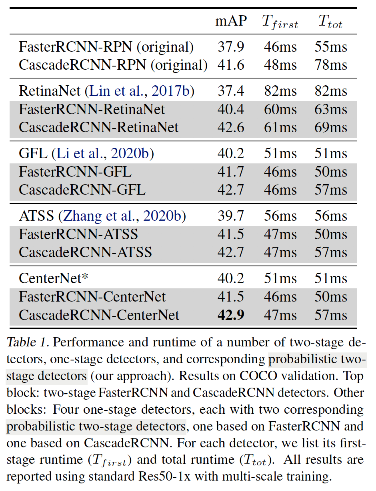

​		所有的概率两阶段检测器优越它们的一阶段和两阶段先驱。每种概率两阶段FasterRCNN模型将一阶段先驱的mAP提高到1到2个百分点，并且比原始的两阶段FasterRCNN提高3个百分点。大量的概率两阶段FasterRCNN模型比原始的两阶段FasterRCNN快，因为更有效的FPN（P3-P7 vs. P2-P6），以及使用更少提议（256 vs. 1K）的概率检测器。我们观察到与CascadeRCNN相似的倾向。

​		CascadeRCNN-CenterNet设计的表现在这种概率两阶段模型之中是最好的。因此，我们在接下来的实验中采用这种基本结构，并称之为CenterNet2。

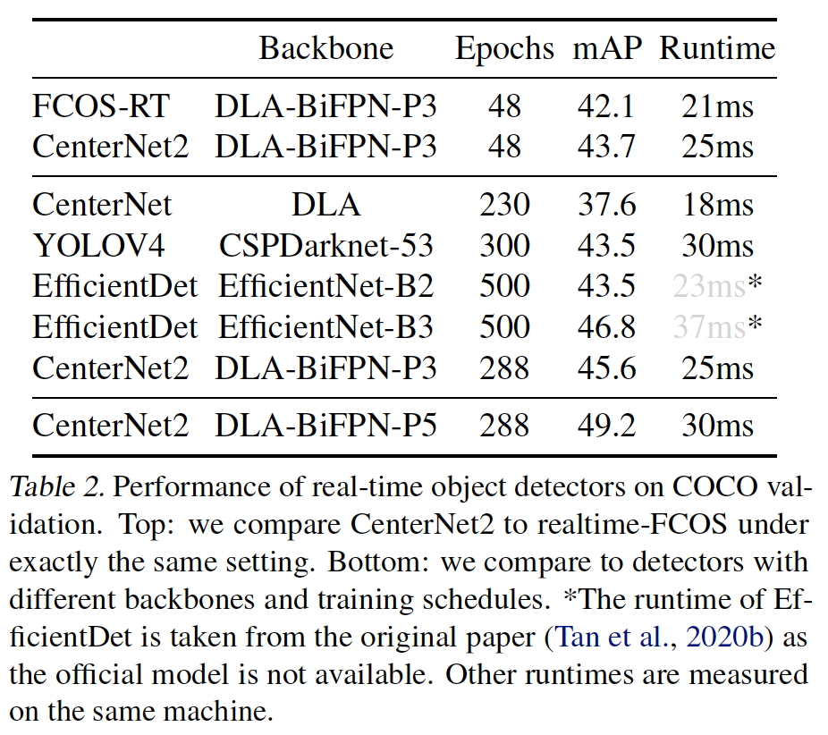

**实时模型**	表2比较我们的实时模型与其他实时检测器。在相同的骨干和训练时间表下，CenterNet2比实时FCOS好1.6 mAP，并且仅慢4ms。使用更长训练时间表的基于FCOS骨干，它将原始CenterNet的准确率提高7.7mAP，并且以40 fps的速度获得的45.6 mAP轻松胜过流行的YOLOv4（Bochkovskiy等2020）和EfficientDet-B2（Tan等2020b）检测器。

​		使用略为不同的FPN结构，并将它们与自训练结合，CenterNet2以33fps的速度获得49.2mAP。而大多数已有的实施检测器是一阶段的，这里我们证明两阶段检测器可以与一阶段设计一样快，同时获得更高的准确率。

**State-of-the-art comparison**	表3将我们的大型模型与COCO test-dev上SOTA检测器进行比较。表3中获得最好结果56.4mAP的模型，使用具有BiFPN的Res2Net、更大的输入分辨率（$128 \times 128$进行训练，$1560 \times 1560$进行测试）、重裁剪增强（0.1到2的比例）和COCO无标签图像上的更强时间表（8倍）。详细细节见补充材料。

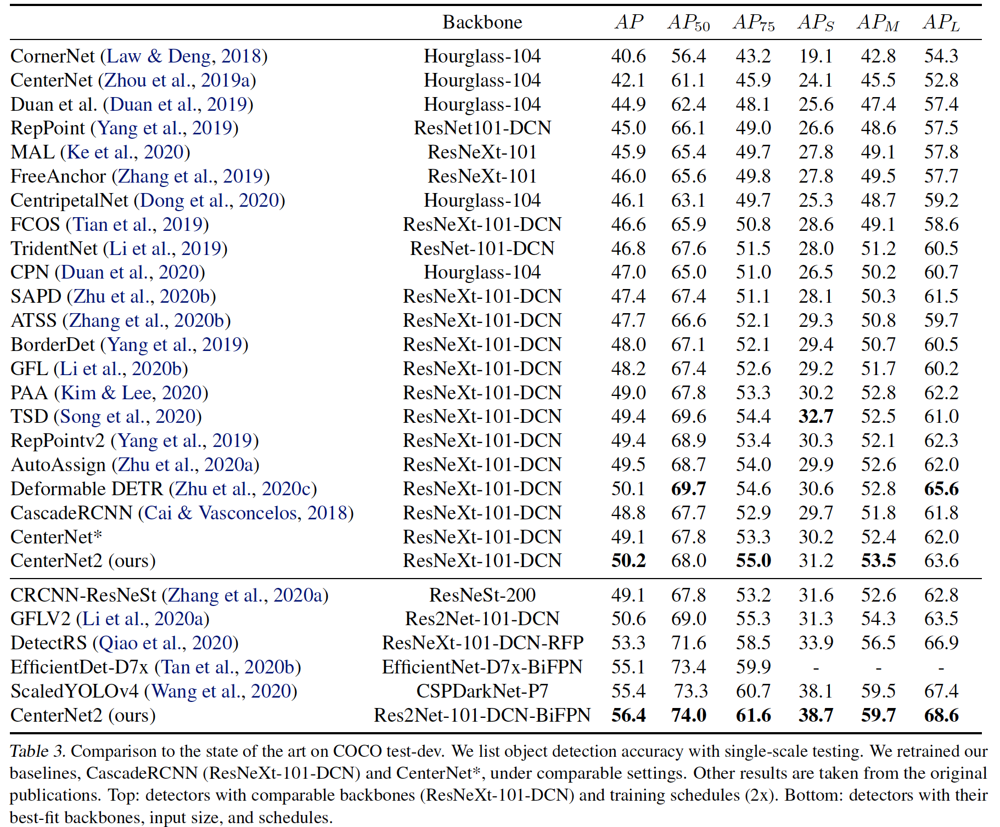

#### 6.1. 消融研究。

**从FasterRCNN-RPN到FasterRCNN-RetinaNet**	表4展示从默认RPN-FasterRCNN到以RetinaNet作为第一阶段的概率两阶段FasterRCNN的详细路线图。首先，切换为Retina风格的FPN已经给出有利的改进。但是，在这里直接乘以第一阶段的概率没有给出改进，因为原始的RPN很弱，并且没有提供桥党的似然。通过添加层使RPN更强，从而让在第二阶段中使用更少提议称为可能，但是没有提高准确率。切换成RetinaNet损失（更严格的IoU阈值和focal loss），提议质量得到改进，在原始的RPN损失上产生0.5的mAP提高。利用这种改进的提议，在我们的概率框架中纳入第一阶段的得分将准确率提升到40.4。

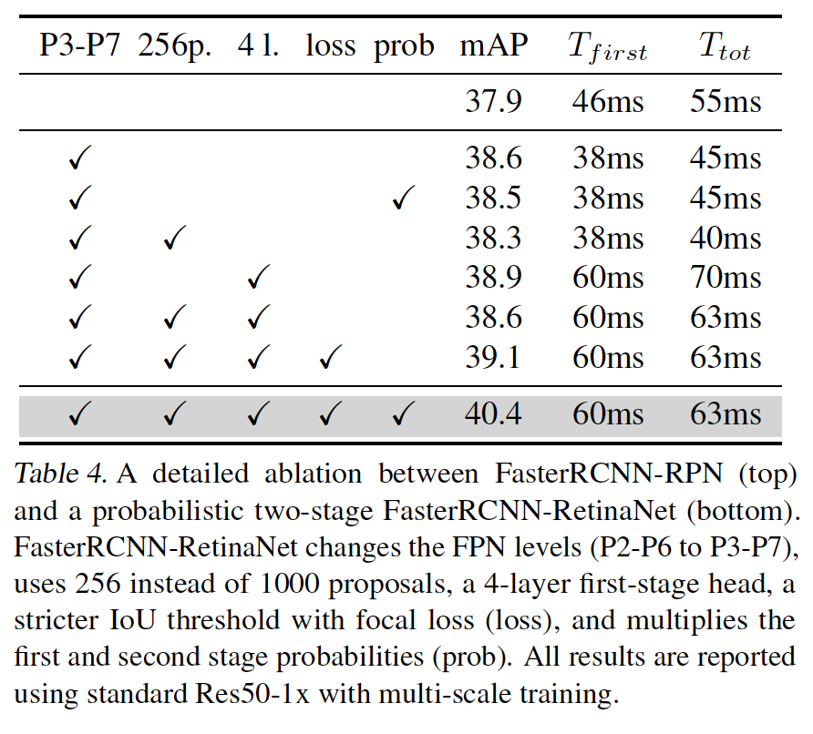

​		表5在CascadeRCNN上报告相似的消融研究。观察结果是一致的：将第一阶段的概率乘以原始的RPN没有提高准确率，而使用强一阶段检测器可以。这表明我们设计中的两个要素都是必要的：更强大的提议网络以及纳入提议得分。

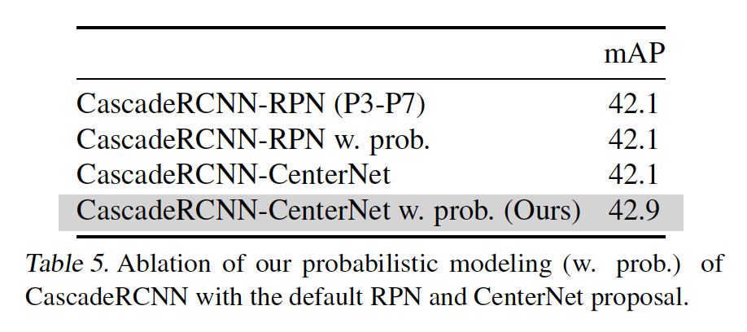

**提议数量中的平衡**	当为原始的基于RPN CascadeRCNN和CenterNet2使用不同数量的提议，表6展示mAP、提议平均召回（average recall：AR）和运行时是如何变化的。随着提议的变少，CascadeRCNN和CenterNet2变得更快。但是，原始的CascadeRNN的准确率随着提议数量的减小而陡峭地衰减。例如，当使用128而不是1000个提议时，CascadeRCNN下降1.3mAP，而CenterNet2仅衰减0.3mAP。128个CenterNet2提议的召回率比1000个RPN提议高。

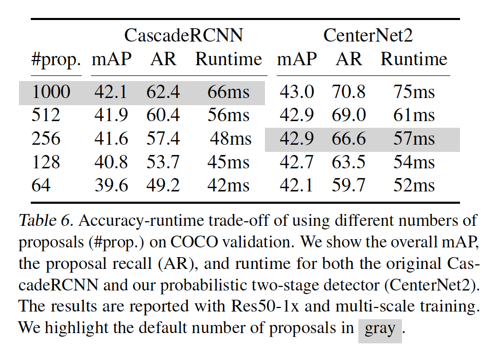

#### 6.2. 大词汇检测

​		表7和表8分别报告LVIS和Objects365上的目标检测结果。CenterNet2在LVIS上的CascadeRCNN基线提高了2.7 mAP，在Objects365上将CascadeRCNN基线提高了0.8 mAP，表明了我们方法的通用性。在两个数据集上，两阶段检测器（CascadeRCNN、CenterNet2）大幅领先一阶段设计（GFL、CenterNet）：在LVIS上为5-8mAP和Objects365上为3-4mAP。在LVIS上，相比COCO，随着类别数量从80增加到1203，一阶段检测器的运行时增加约30%。这是由于密集分类头部。另一方面，CenterNet2的运行时仅增加5%。这突出概率两阶段检测在大词汇设置上的优势。

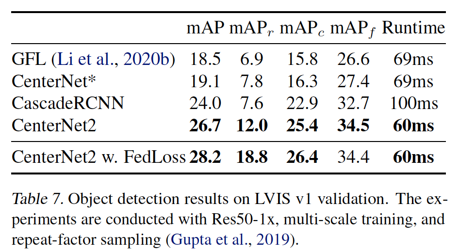

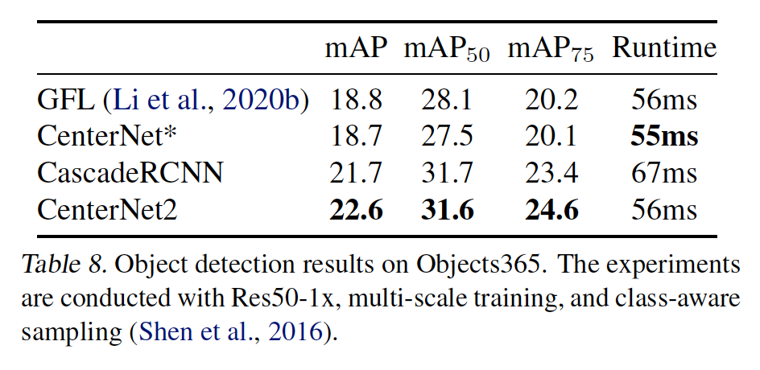

​		两阶段检测器允许在第二阶段中使用更专门的分类损失。在补充材料中，我们提出了联邦损失来处理LVIS的联邦construction。 结果在表7中突出显示。

### A. Tightness of lower bounds

​		我们简要证明，最大似然目标上的两个下限的最大值确实非常紧凑。回忆原始训练目标：

$$\log P(bg) = \log\Big(\underbrace{P(bg|O_k=1)}_{\beta} \underbrace{P(O_k=1)}_{1-\alpha} + \underbrace{P(O_k=0)}_{\alpha}\Big).$$

我们优化两个下界：

$$\log P(bg) \ge \underbrace{\log(P(O_k=0))}_{B_1}.\tag{5}$$

以及

$$\log P(bg) \ge \underbrace{P(O_k=1)\log(P(bg|O_k=1))}_{B_2} \tag{6}$$

这种组合下界为

$$\log P(bg) \ge \max(B_1, B_2).\tag{7}$$

这种组合下界在整体目标的$\log(2)$范围内：

$$\log P(bg) \le \max(B_1, B_2) + \log(2).$$

我们首先在计算有界目标与真实目标之间的差距时简化max操作：

$$\begin{align}&\log P(bg) - \max(B_1, B_2) \\&=\begin{cases}\log P(bg) - B_1 &\mbox{ if }B_1 \ge B_2 \\ \log P(bg)-B_2 &\mbox{ otherwise}\end{cases}\\&\le\begin{cases}\log P(bg) - B_1 &\mbox{ if }P(O_k=0)\ge P(bg|O_k=1)\\ \log P(bg) - B_2 &\mbox{otherwise}\end{cases}\end{align}.$$

这里，通过max（$-\max(a,b)\le -a$和$-\max(a,b)\le -b$）的定义，最后的不等式成立。令我们单独分析每种不同的情况。

**Cases 1:** $P(O_k=0) \ge P(bg|O_k=1)$，即$\alpha \ge \beta$。这里，我们分析边界：

$$\log P(bg) - B_1 = \log(\beta(1-\alpha)+\alpha)-\log\alpha$$

由于对数的单调性，对于$\beta \le \alpha$和$1 - \alpha> 0$，上述表达式的最大值是最大可能值$\beta = \alpha$。因此，对于任何值$\beta \le \alpha$，由于$\alpha > 0$，有：

$$\begin{align} \log P(bg) - B_1 &\le \log(\alpha(1-\alpha) + \alpha) -\log \alpha \\ &= \log(2-\alpha) \le \log(2), \end{align}$$

**Case 2:** $P(O_k = 0) \le P(bg|O_k=1)$，即$a \le \beta$。这里，我们分析边界：

$$\log P(bg) - B_2 = \log(\beta(1-\alpha) + \alpha) - (1-\alpha)\log\beta$$

因为$(1-\alpha) \le 1$：

$$\log P(bg) - B_2 \le \log(\beta(1-\alpha) + \alpha) - \log \beta$$

因为$\alpha \le \beta$，上式是最大值$\alpha \le \beta$时的最大值，因为$\beta \le 1$（因此在$\alpha = \beta$）:

$$\log P(bg) - B_2 \le \log(2-\beta)\le\log2$$

最大边界的两个部分都在实际目标的$\log2$之内。最有趣的是，它们仅在$\alpha = \beta \rightarrow 0$处才精确地有$\log 2$，此时目标值$\log(\beta(1-\alpha) + \alpha) \rightarrow -\infin$处于负无穷大，并且对于所有其他值而言，它们比$\log2$紧凑。

### B. Backbones and training details

**Default backbone**	我们基于detectron2实现我们的方法。我们的detectron2中的默认模型遵循标准的Res50-1x设置。具体而言，我们使用ResNet-50作为骨干，并且利用SGD优化器训练90K迭代（1x调度）。两阶段检测器的基学习率为0.02，一阶段检测器的学习率为0.01，并且在60K和80K迭代时下降10倍。我们使用短边位于$[640,800]$内、长边为1333的多尺度训练。训练期间，我们将第一阶段的损失权重设置为0.5，因为一阶段检测器通常利用0.01的学习率训练。测试期间，我们使用固定的短边800和长边1333。

**Large backbone**	遵循最近的工作，我们使用ResNeXt-32x8d-101-DCN作为大型骨干。将可变形卷积添加到Res4-Res5层。利用2x调度（在120K和160K迭代时衰减，并且迭代180K）。对于大模型，我们将尺度增强扩展到设置短边为$[480,960]$。测试尺度固定为短边为800，长边为1333。

**实时骨干**	我们尊重实时FCOS，并使用具有BiFPN的DLA。我们使用四个特征通道为160的BiFPN。输出的FPN层减小到3，步长为8-32。我们利用尺度增强训练模型，并将短边设置到$[256,608]$，长边为900。我们首先利用4倍时间表（在最后60K和20K时将学习率衰减10倍）训练，以与实时FCOS的比较。然后，我们以很长的时间表进行训练，以4倍时间表重复微调模型，以进行6个周期（即总共288个epoch）。测试期间，我们将短边设置为512，长边设置为736。对于第二阶段，我们将提议数量减少到128。其他超参数不变。

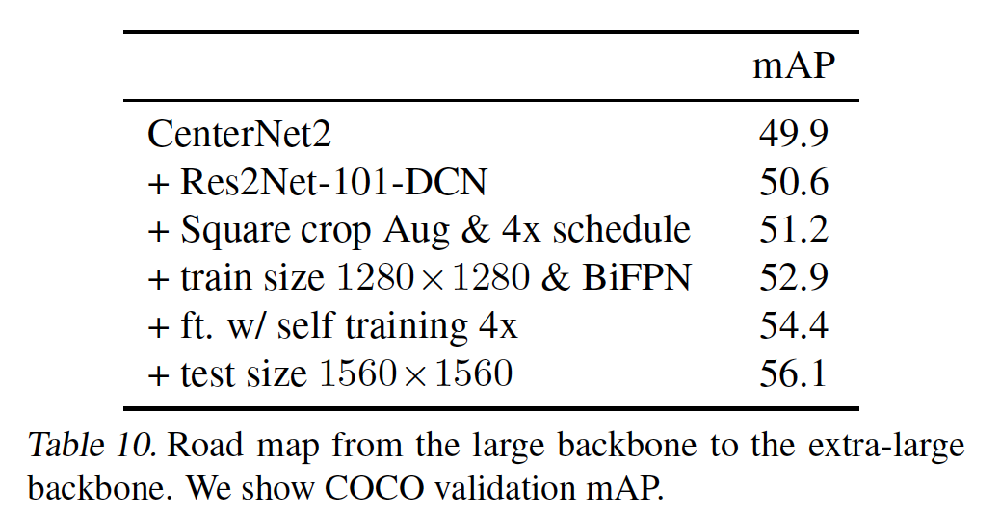

### C. Extra-large model details

​		为了推动目标检测的SOTA结果，我们将最新进步集成到我们的框架以设计一种额外的大型模型。表10概述我们的改变。除非特别提到，我们将测试分辨率保持为$800 \times 1333$，即使当训练大小变化时。我们首先将网络骨干从ResNeXt-101-DCN切换到Res2Net-101-DCN。这加速训练，并给出0.6mAP的改进。接着，我们将数据增强风格从Faster RCNN风格（随机调整短边）改为EfficientDet风格，EfficientDet涉及调整图像，并从中裁剪正方形区域。我们首先使用$896 \times 896$的裁剪大小，其接近原始的$800 \times 1333$。我们遵循Wightman（2020），使用$[0.1,2]$大型调整范围，并且训练$4\times$时间表（360K迭代）。更强的数据增强和更长的时间表一起将结果提高到51.4mAP。接着，我们将裁剪大小改为$1280 \times 1280$，并且将BiFPN添加到骨干。我们遵循EfficientDet以在BiFPN中使用288个通道和7层，其适合$1280 \times 1280$输入大小。这带来53.0 mAP。最后，我们使用Zoph等（2020）的技术，使用COCO的无标签图像进行自训练。具体而言，我们在COCO无标签图像上运行YOLOv4模型。我们将得分大于0.5的所有预测设置为伪标签（pseudo-labels）。然后，我们将这些新数据与原始的COCO训练集拼接，并且在拼接的数据集上微调先前最好的模型，共微调$4\times$时间表。利用$800 \times 1333$的测试大小，模型给出54.4mAP。当我们将测试大小增加到$1560 \times 1560$时，COCO验证集上的性能进一步提升到56.1mAP，COCO test-dev上的性能进一步提升到56.1mAP。

​		我们还在实时模型中结合了这些高级训练技术的一部分。具体而言，我们使用EfficientDet风格的正方形裁剪增强，使用原始的FPN层P3-P7（而不是P3-P5），并使用自训练。这些修改将我们的实时模型从45.6@25ms提高到49.2mAP@30ms。

### D. Federated Loss for LVIS

​		LVIS以联邦（federated）形式标注图像。即，图像仅稀疏标准。这导致远远更稀疏的梯度，特别是对于稀有类。一方面，如果我们将所有未标注的目标视为负类，结果得到的检测器将过于悲观，并忽略稀有类。另一方面，如果我们仅将损失用于标注的图像，产生的分类器不会学习足够强的背景模型。此外，两种策略都无法反映潜在测试集上正类和负类标签的自然分布。为了缓解这个问题，我们选择中间立场（middle ground），并针对每幅训练图像，将_federated  loss_用于类的子集$S$。$S$包含所有正类标注，但是仅有一随机的负类子集。

​		我们在训练集中按与负类的平方根频率成比例地对它们进行抽样，并在实验中根据经验设置$|S|= 50$。训练期间，我们在$S$的所有类上使用二分类交叉熵，并忽略$S$之外的类。每次迭代采样$S$。相同的训练图像可能在连续的迭代中处于类的不同子集中。

​		表9将所提出的联邦损失与包括LVIS v0.5挑战优胜者、EQL（equalization loss）在内的基线进行比较。对于EQL，我们遵循LVIS v0.5中的作者的设置，其忽略900个长尾类别。将模型的softmax改为sigmoid导致轻微的性能下降。但是，我们的联邦损失弥补了这一损失，并远远超过了EQL和其他基线。

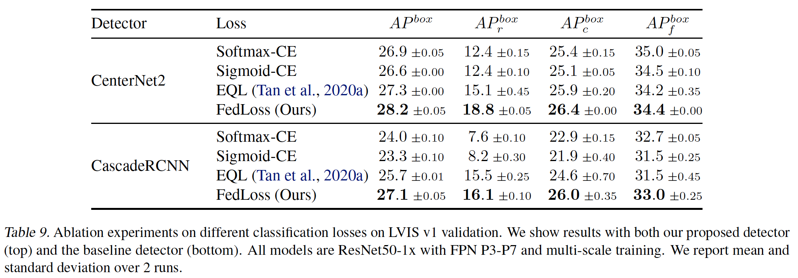

### E. 与其他提议网络的比较

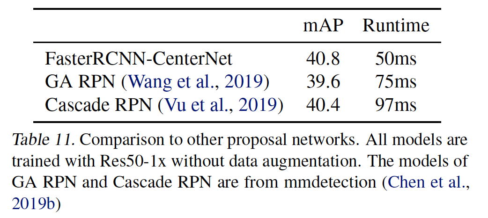