## Cheaper Pre-training Lunch: An Efficient Paradigm for Object Detection

### 摘要

​		本文中，我们提出通用而有效的预训练范式——Kigsaw预训练——进行目标检测。Jigsaw预训练仅需要目标检测数据集，同时，与广泛采用的ImageNet预训练相比，仅花费1/4的计算资源。为了构建如此有效的范式，我们通过从原始图像中提取有用的样本来减少潜在的冗余，Jigsaw形式中的集成样本作为输入，并使用ERF自适应密集分类预测进行模型预训练。这些设计不仅包括改善空间利用率的新输入模式，还包括扩大预训练模型的有效感受野的新颖学习目标。通过在MS-COCO数据集上进行的大量实验，验证了拼图（Jigsaw）预训练的效率和优越性，结果表明，与 ImageNet经过预训练的模型相比，使用Jigsaw预训练的模型能够实现同等甚至更好的检测性能。

### 1	引言

​		对分类数据集（例如ImageNet [9]）进行预训练是一种常见的做法，可以实现更好的网络初始化以进行目标检测。在这种范式之下，深度网络受益于从大规模数据中学到的有用特征表示，这促进了微调阶段模型的收敛。尽管有好处，但不应忽略额外数据所造成的负担。先前工作 [25、6、37] 已提出利用随机初始化直接从头训练检测模型的替代解决方案。但是，总是没有免费的午餐。 从头开始进行训练会导致收敛速度较慢，也就是说，需要其他训练迭代来获得竞争模型。**我们是否可以通过无需支付额外的数据或昂贵的训练费用的预训练纳入快速收敛的优点？**

​		答案是 **行** 。我们发现更便宜的午餐用于预训练。在这项工作中，我们提出新的预训练范式——Jigsaw预训练，它是仅基于检测数据集。与ImageNet预训练相比，Jigsaw预训练仅花费1/4的计算资源，而不需要额外数据，同时在目标检测任务上获得相当、甚至更好的性能。

​		Jigsaw预训练是建立在以下观察基础上的：在普通的训练过程中，模型看到的大量像素无效或信息不足，即背景区域中的大多数像素/神经元在学习过程中不会恢复原状。那些过多的背景像素不可避免地导致冗余的计算成本。为了处理这个问题，我们从检测数据集的原始图像中提取正负样本进行预训练。在馈入骨干网络之前，这些样本在考虑它们纵横比时将以拼图形式集成，从而提高空间利用率。为了进一步提高像素级的利用率，我们设计了一种ERF自适应密集分类策略，通过在学习目标中分配软(soft)标签来利用有效感受域（Effective Receptive Field：ERF）。我们的Jigsaw预训练在很大程度上考虑了模型看到的每个像素，这大大减少了冗余，并为目标检测提供了有效而通用的预训练解决方案。

​		我们的主要贡献总结如下：

​	（1）我们提出高效而通用的基于检测数据集的预训练范式，其消除额外数据集的负担。

​	（2）我们设计样本提取规则，Jigsaw集成策略和ERF自适应密集分类进行高效预训练，其极大地考虑到网络的利用率，并提高学习效率和最终的性能。

​	（3）我们在多个检测框架和骨干上验证Jigsaw预训练的有效性，并且证明所提出的预训练策略的通用性。我们希望这项工作能够启发关于目标检测器预训练的更多讨论。

### 2	相关工作

​		**Classification-based Pre-training for Object Detector**	多种检测框架[4、14、23、7、16、36、30]遵循标准的“预训练-微调”的训练过程，其中网络线在大规模数据集（例如ImageNet）上预训练，然后在目标检测数据集上微调。预训练范式主要基于分类，并且目的是学习强壮或通用的表示，其加速检测模型的收敛。许多方法致力于通过不同的学习模式来进一步扩展可迁移性的边界，例如有监督的[8]、弱有监督的[18、32]、无监督[5]的学习或利用较大规模的培训数据，例如Instagram-17k [18]和JFT-300M [28]。尽管迁移性得到改进，但是大尺度数据的相应昂贵训练成本不应当忽略。我们的Jigsaw预训练是完全基于检测数据集，其消除使用额外数据的负担。同时，预训练过程比ImageNet-1k分类训练快 $4\times$ 。

​		**目标检测器的冗余**	样本不平衡是物体检测的常见冗余来源，在其中许多属于简单负样本的背景像素没有提供有用的训练信息。为了缓解这个问题，作出了用于提高检测训练效率的几种尝试。OHEM [26] 尝试通过丢弃负样本来解决不平衡采样。Focal Loss [14] 采用权重因子来减小易分样本的损失权重。在[1]中，Chen等提出更合理的方法进行样本评估。Libra R-CNN [20] 提出 IoU平衡采样来增强难样本。SNIPER [27] 通过仅训练选择的chips（而不是整幅图像）来减小多尺度训练的计算负担。所有这些工作主要关注效率和检测框架中的性能，但它们仍然为我们工作中的样本选择提供了启发。通过仔细选择正负样本进行训练，冗余明显减少，最终加快了分类的预训练过程。

​		**从头训练目标检测器**	许多工作 [19、29、25、10、12、6、37] 提出另一种可能的范式，其从头开始训练检测器。例如，DSOD [25] 受设计预训练自由的检测器的激发，但仅限于他们设计的结构。CornerNet [10] 和 DetNet [12] 展示了他们从头开始训练的模型的结果。这种努力表明，当有合适的数据可用时，预训练可能是不必要的。此外，最近对ImageNet预训练的疑问也越来越多。He 等 [6] 和 Zhu 等 [37] 认为ImageNet预训练可能是一个历史性的解决方法。但是，尽管这些解决方案摆脱了大规模外部数据的负担，但随机初始化的检测模型仍存在收敛速度慢的问题，这是以将训练迭代次数扩展4-5倍以获得竞争模型为代价的。受这些工作的启发，我们向前迈出了一步，利用一种有效的预训练范式对检测数据进行预训练，该方法利用了快速收敛且同时没有额外数据的优势。

### 3	方法

​		所提出拼图预训练方案的流程如图1所示。给定检测数据集 $\mathcal{D}$ ，从 $\mathcal{D}$ 图像中提取正样本和负样本，并预先保存为分类数据集（第3.1节）。这些样本以Jigsaw方式集成（3.2节），并馈入检测器主干进行预训练，其中将ERF自适应损失作为损失函数（3.3节）。经过预训练后，在检测任务下，目标检测器将在 $\mathcal{D}$ 上进行微调。请注意，我们的预训练方案是可行的，可以应用于具有不同检测头和主干架构的目标检测器。

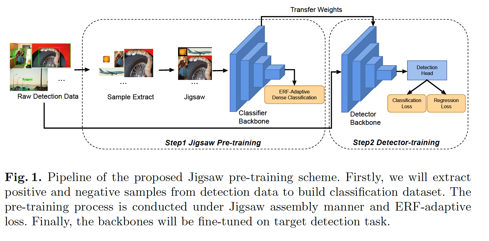

#### 3.1	样本选择

​		如先前的工作 [26、20] 证明的，平衡的样本选择对于目标检测器至关重要。为了进行有效的预训练，我们仔细选择从原始图像中提取的区域作为正样本和负样本，这些样本将被进一步集成并馈送到检测器主干中。正样本是应当分类为检测数据集中 $C$ 个前景类之一的区域，而负样本为背景区域。为了有效地选择各种重要样本，我们为样本提取建立了一些规则。

​		**正样本**	为了生成正样本，我们根据ground-truth边界框，从原始图像提取区域。考虑到上下文信息有益于学习更好的特征表示[3、35]，我们随机扩大边界框，使得正样本中包含更多的上下文。具体而言，ground-truth 边界框的左上角和右下角会随机向外移动，以便宽度/高度可以达到原始宽度/高度的2倍。超越原始图像的扩大边界将会在边缘处被截断。图2描述正样本的生成。实验结果表明，训练期间，将上下文添加到正样本给具有ResNet50主干的Faster R-CNN带来1.6% mAP增益。

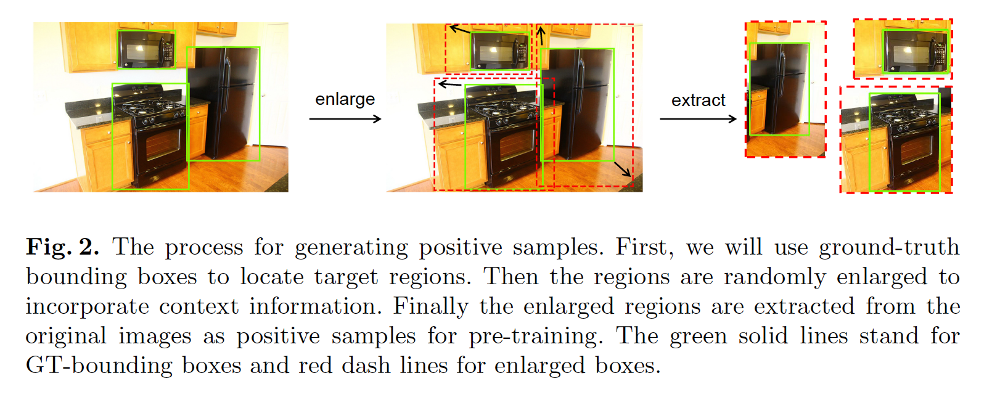

​		**负样本**	为了使预训练模型更适应检测场景，我们还将一些从背景区域生成的负样本添加到分类数据集。首先，我们随机生成一些候选提议。之后，我们需要所有样本符合 $IoU(pos,neg) = 0$ 的要求，其中 $IoU$ 为 Intersection-over-Union。以这种方式，负样本与那些正样本互斥。在我们的预训练实验中，正负样本之比为 $10:1$ 。

#### 3.2	Jigsaw Assembly

​		有不同方式来集成样本，并将它们馈入主干进行预训练。两种简单的集成方法是将样本扭曲warping（方法1）或填充padding（方法2）为预定的输入大小，例如 $224 \times 224$ 。但是，将所有样本强制扭曲到相同的大小可能摧毁纹理信息以及扭曲原始形状，而填充会引入许多没有信息的填充像素，因此给训练时间和计算资源上带来额外的成本。这两种直接方法对于预训练过程要么有害，要么是浪费。为了更有效的预训练，我们提出，在考虑目标尺度和纵横比的情况下，以Jigsaw的方式集成样本。具体而言，四个样本将被缝合到一个新图像中，然后作为预训练的输入。

​		如图3所示，与warping和padding相比，我们的Jigsaw集成不仅维持原始的纹理信息，还消除无信息的填充像素。

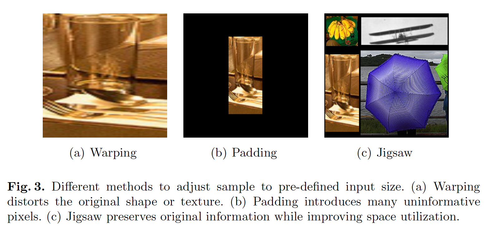

​		目标的纵横比不同。Jigsaw集成考虑这种属性，使得样本能够更自然地根据它们的纵横比缝合到一起。为此，首先根据样本的中横比分为三组，即Group S（square）、T（tall）和 W（wide）。Group S 中的样本的纵横比在0.5和1.5之间，而Group T 和 W 中的样本应当分别小于0.5和大于1.5。为了简单起见，来自Group S、T 和 W 的样本分别称为 S 样本、T 样本和 W 样本。

​		如图4所示，对于每个Jigsaw集成图像，从上述三组中随机选择 2 个 S样本、1个T样本和1个W样本，并相应地缝合到4个区域。具体来说，更小边界框面积的S样本位于左上角区域，而更大的S样本位于右下角区域。T样本和W样本分别分配给左上角和右下角区域。

​		**Pad & Crop vs Warp vs Resize**	如果样本的大小与新图像中预定义的区域大小不匹配，我们将对样本进行填充或随机裁剪，这取决于它们的尺寸小于或大于预定尺寸。注意，我们不会扭曲或调整样本，因为表1中的实验结果证明，如此操作会衰减最终性能。三种操作的可视化示例见补充材料。

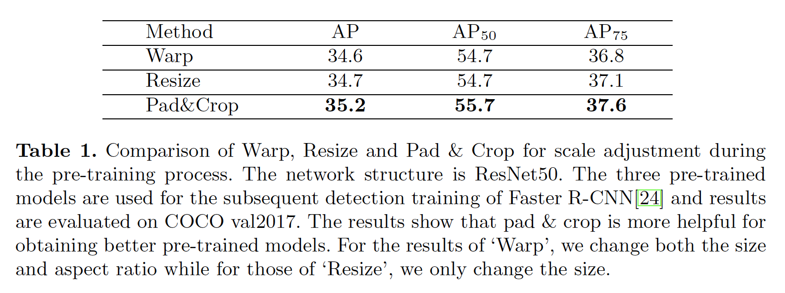

#### 3.3	ERF-adaptive Dense Classification

​		预训练期间，Jigsaw集成图像将馈入主干网络以在最终的平均池化之前获得特征图 $\mathbf{X} \in \mathbb{R}^{C \times \alpha H \times \alpha W}$ 。与传统的分类与训练相比，Jigsaw 预训练应当有不同的学习率策略，因为在集成图像中有四个样本缝合。接下来，我们讨论两种替代策略，然后介绍所提出的ERF-adaptive Dense Classification。

​		**Global classification**	如图4所示，在Jigsaw集成图像中包含4个目标。作为一种直觉策略，我们可以给整幅图像分配一个全局标签，它是根据它们区域面积的四个目标标签的加权和。这种策略可能会让人想起CutMix [34]，在该模型中，原始图像的某些区域将被另一个图像中的patch替换，并且相应的标签也将与新path的标签成比例地混合。全局分类的可视化见补充材料。

​		**Block-wise classification**	另一种直觉上的策略将针对每个块/区域单独执行，也就是说，将平均池化独立应用于对应于四个样本的特征图 $\mathbf{X}$ 的四个块，然后根据每个样本的标签进行单独分类。但是，这两种直觉上的策略将每个块的学习与相应的样本联系起来。如图6（a）和（b）所示，$\mathbf{X}$ 中的左上角区域的有效感受野（Effective Receptive Field：ERF）主要集中在相对较小的S样本的区域。如[15、11、22]所示，受约束的感受野可能会凭经验降低深层模型的性能。逐块的分类可视化见补充材料。

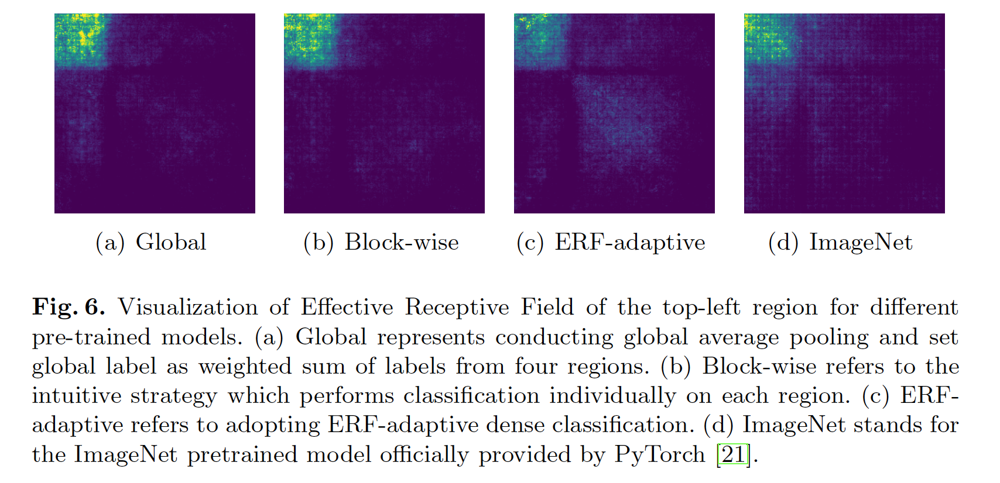

​		**我们的策略**	为了在很大程度上考虑每个可见像素，我们提出了一种ERF自适应的密集分类策略，对 $\mathbf{X}$ 上的每个位置进行分类，其软标签是根据相应的有效感受野计算的。 该过程如图5所示。

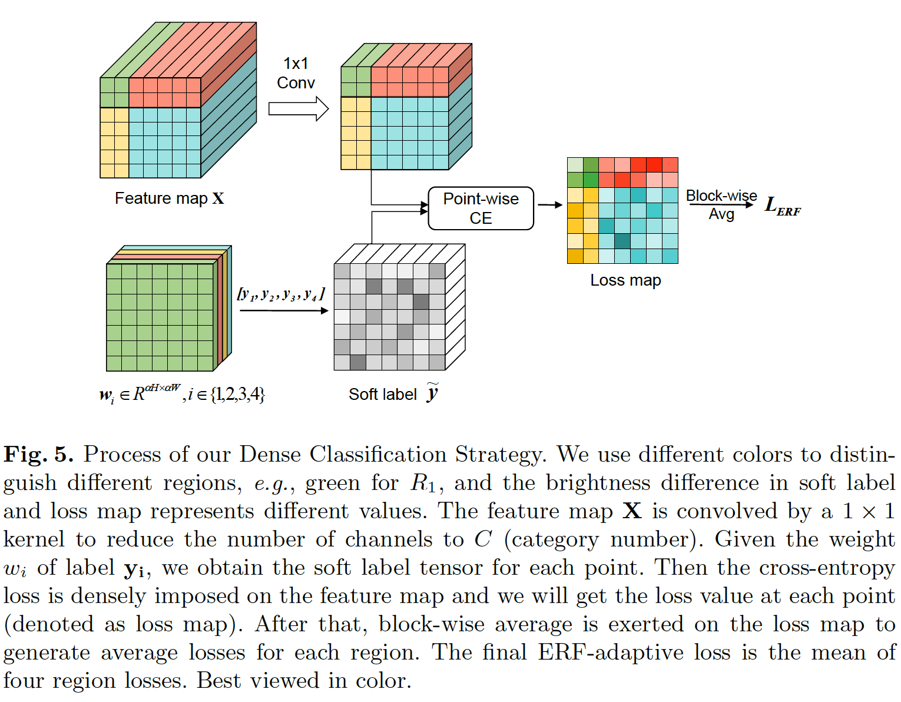

​		具体来说，对于如图4（b）的Jigsaw模板中的四个区域，我们将 $\mathbf{y}_i$ 表示为区域 $R_i$（$i=1,2,3,4$）的原始标签。

​		在特征图 $\mathbf{X}(j=1, \cdots, \alpha H,k=1,\cdots,\alpha W)$ 的位置 $(j,k)$ 处，软标签 $\tilde{\mathbf{y}}^{j,k}$ 为四个标签的加权和：

$$\tilde{\mathbf{y}}^{j,k} = \sum_{i=1}^4 w_i^{j,k}\mathbf{y}_i, \tag{1}$$

其中权重 $w_i^{j,k}$ 与其 ERF 相关。在特征图 $\mathbf{X}(j=1, \cdots, \alpha H,k=1,\cdots,\alpha W)$ 的位置 $(j,k)$ 处，我们在输入空间上获得对应的 ERF $\mathbf{G}^{j,k} \in \mathbb{R}^{H \times W}$。然后，位置 $(j,k)$ 处的标签 $\mathbf{y}_i$ 的权重 $w_i^{j,k}$ 应该与区域 $i$ 内的总激活与总激活之比成比例。此外，如果位置 $(j,k)$ 在区域 $i$ 内，那么我们根据经验为 $w_i^{j,k}$ 设置阈值 $\tau$ ，从而确保 $\mathbf{y}_i$ 在区域 $i$ 中占主导地位。因此，对于区域 $r$ 中的位置$(j,k)$ ，标签 $\mathbf{y}_i$ 的权重 $w_i^{j,k}$ 为：

$$w_i^{j,k} = \begin{cases}\max(\tau, \frac{\sum_{h=1,w=1}^{H,W}\mathbf{G}_{h,w}^{j,k} \cdot \mathbf{M}_{h,w}^i}{\sum_{h=1,w=1}^{H,W}\mathbf{G}_{h,w}^{j,k}}), & \mbox{if } i = r, \\ (1-w_r^{j,k})\frac{\sum_{h=1,w=1}^{H,W}\mathbf{G}_{h,w}^{j,k}\cdot \mathbf{M}_{h,w}^i}{\sum_{h=1,w=1}^{H,W} \mathbf{G}_{h,w}^{j,k} \cdot(1 - \mathbf{M}_{h,w}^\tau)}, &\mbox{if } i \ne r,\end{cases} \tag{2}$$

其中 $\mathbf{M}^i \in \{0,1\}^{H\times W}$ 表示在ERF中选择区域 $i$ 的二进制掩码。

​		将 $\mathbf{x}^{j,k} \in \mathbb{R}^C$ 表示为 $\mathbf{X}(j=1,\cdots,\alpha H,k=1,\cdots,\alpha W)$ 中的位置 $(j,k)$ 处的特征。在获得权重 $\{w_i^{j,k}\}_{i=1}^4$ 之后，我们在特征 $\mathbf{x}^{j,k}$ 之上进行密集分类，其中它的软标签 $\tilde{\mathbf{y}}^{j,k}$ 定义在式（1）中。在我们的实现中，将最终的全连接层替换为 $1 \times 1$ 卷积层，交叉熵损失被施加在每个位置的类别预测上。为了使不同区域之间平衡，最终的ERF自适应损失为损失图中的逐块平均，见图5的最后一步。我们还需要说明，软标签方程式（1）的权重是每5k迭代更新而不是每次迭代更新的。因此，即使采用密集分类，训练时间上的影响也是可以忽略的。

​		不同预训练策略的左上角区域的有效感受野在图6中可视化。在上述三种策略中，图6（c）中的策略的ERF最大。

​		**不同策略之间的关系**	上述三种策略在不同的尺度水平上进行分类，其中所提出的自适应分类是最细粒度的一个，而全局分类是最粗糙的。与其他两种替代策略相比，所提出的策略在 $\mathbf{X}$ 的每个位置有不同的 soft 标签。ERF自适应密集分类等价于将阈值 $\tau$ 设置为 1 的逐块分类。如果区域损失以CutMix形式重新加权，那么逐块分类野等价于全局分类。在不同的标签分配策略下，预训练模型有不同像素水平的利用率，因此表现不同。如表 2 所示，在所提出的策略下预训练的模型的性能是三种策略中最好的。

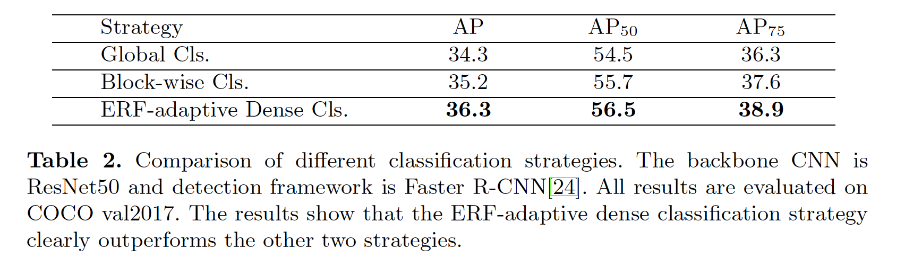

### 4	实验

#### 4.1	实现细节

​		**预训练设置**	除非其他说明，模型在8张Tesla V100 GPU上以512的batch-size预训练64k迭代。注意，batch-size 512是针对Jigsaw集成图像，因此每个batch中单独的样本数量为2048（一幅集成图像包含4个样本）。在前1250次迭代中使用warm-up，其中学习率从0.2开始，然后线性增加到0.8。此后，学习遵循cosine调度减小到0.0。权重衰减为1e-4。我们每5k次迭代更新式（2）的软标签的权重 $w_i^{j,k}$ 。式（2）中ERF自适应分类的阈值 $\tau$ 设置为 0.7 。

​		**预训练增强**	首先根据 $[0.8,1.5]$ 中随机选择的缩放比例调整样本。根据相同的比例调整高和宽，使得它的纵横比保持不变。在集成为新图像之前，以概率0.5随机水平翻转每个样本。Jigsaw集成期间，使用随机裁剪或零填充将样本调整到与定义的尺寸。在缝合之后，利用均值 $[0.485,0.456,0.406]$ 和标准差 $[0.229,0.224,0.225]$ 规范化集成图像的每个通道。

​		**检测器的训练细节**	为了公平比较，ImageNet预训练模型和Jigsaw预训练模型在检测上都采用相同的设置。在COCO train2017上训练模型。如果没有特别指出，所有模型在8张Tesla V100 GPU上以16的batch-size训练13个周期。初始学习率设置为0.02，并在9和12个周期时乘以0.1。训练期间，冻结BN层。将图像调整到 $1333 \times 800$ ，并以0.5的概率随机翻转进行增强。

#### 4.2	主要结果

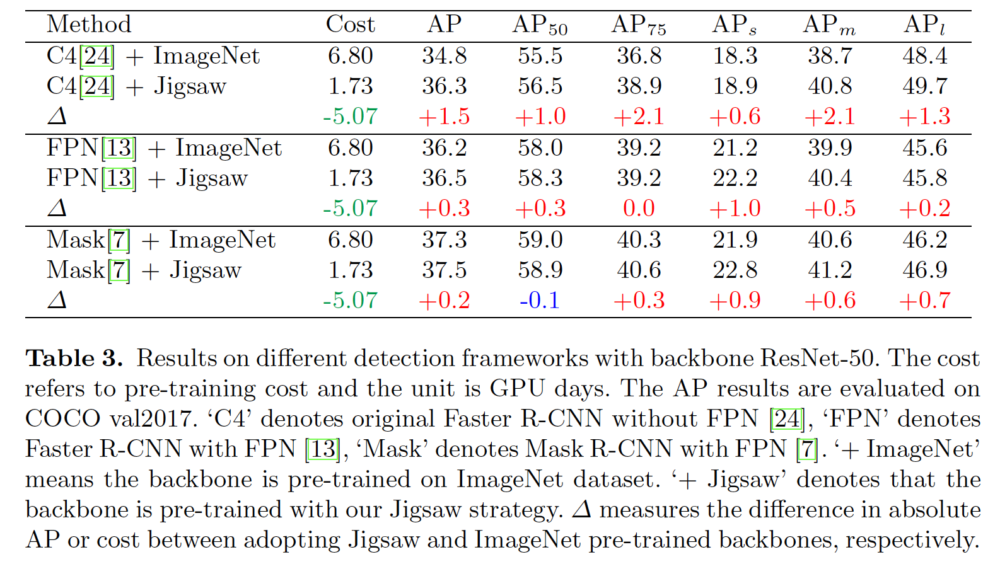

#### 4.3	消融研究

​		**ERF自适应密集分类的阈值**   见图7（a）。

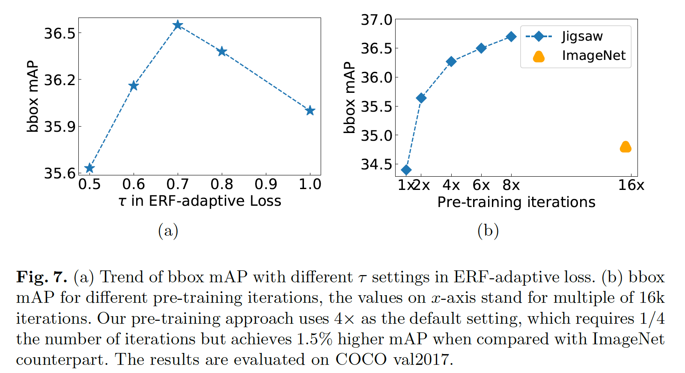

​		**预训练的迭代次数**   见图7（b）

​		**不同的骨干结构**    见表4

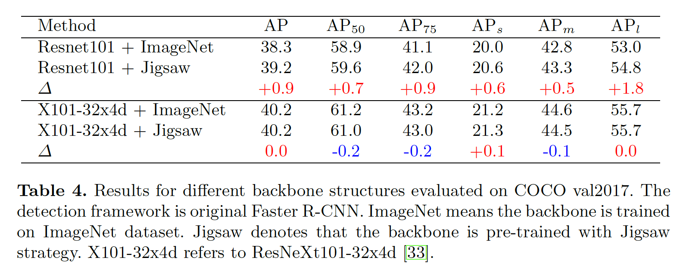

#### 4.4	与其他设计兼容性

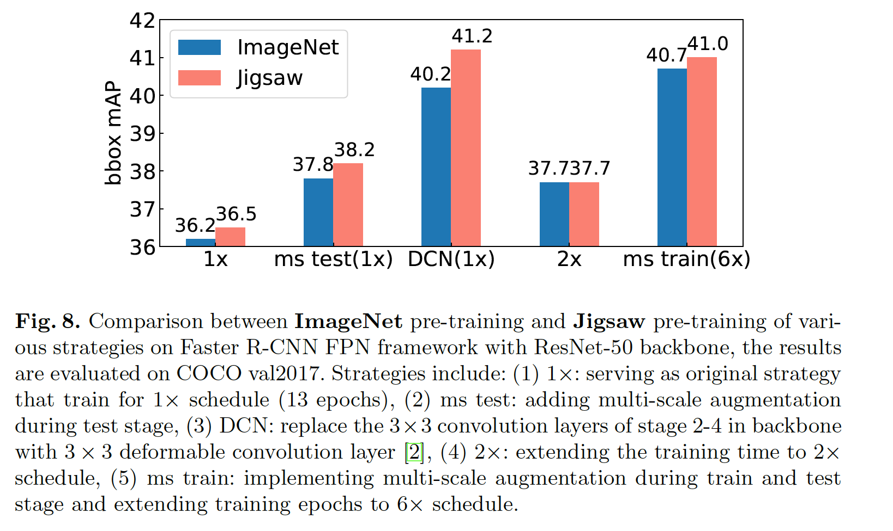

#### 4.5	与从头训练方法的比较

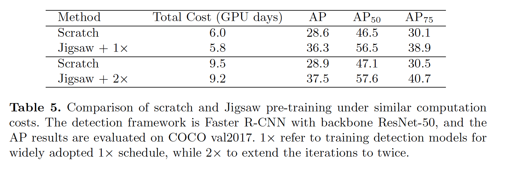

## 附录

### A	调整的样本大小的可视化示例

​		这一部分提供了用于调整样本大小的三种操作的直观示例。 示例在图A1中描述。 从示例中，我们可以看到调整大小将导致太多无用像素，并且扭曲会使图像变形。 裁剪能够保留形状并保留更多信息，这使其成为调整尺寸的更好选择。 表1中的结果还表明，与裁剪相比，扭曲和尺寸调整导致性能欠佳。

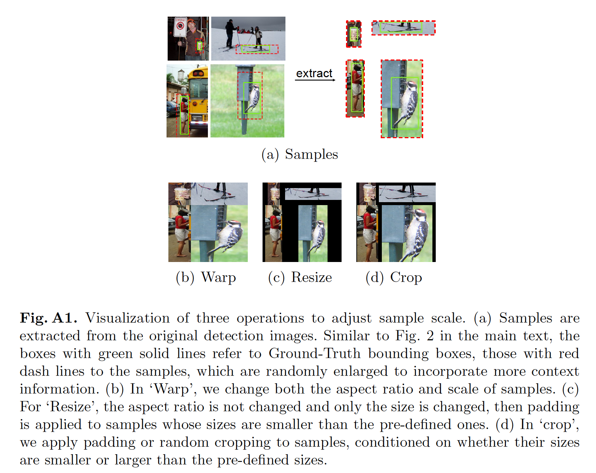

### B	全局和逐块分类策略的可视化

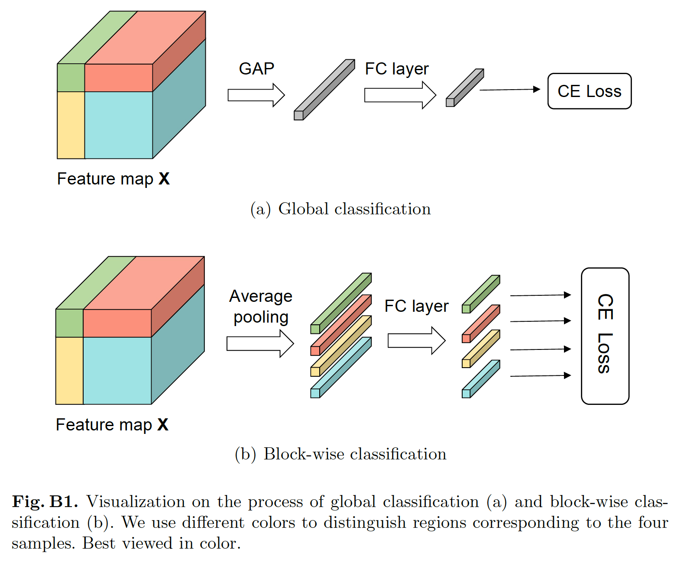