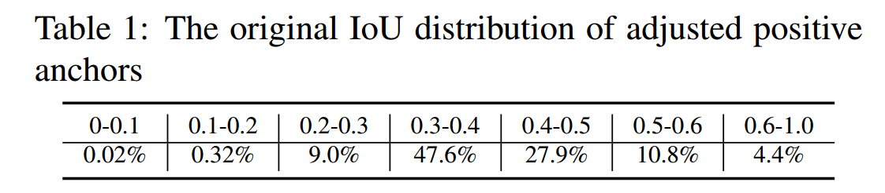
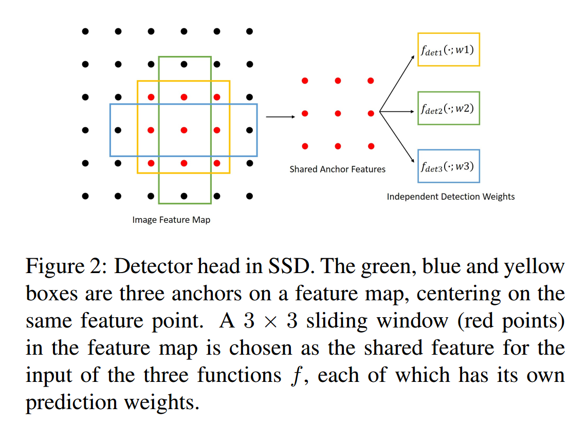
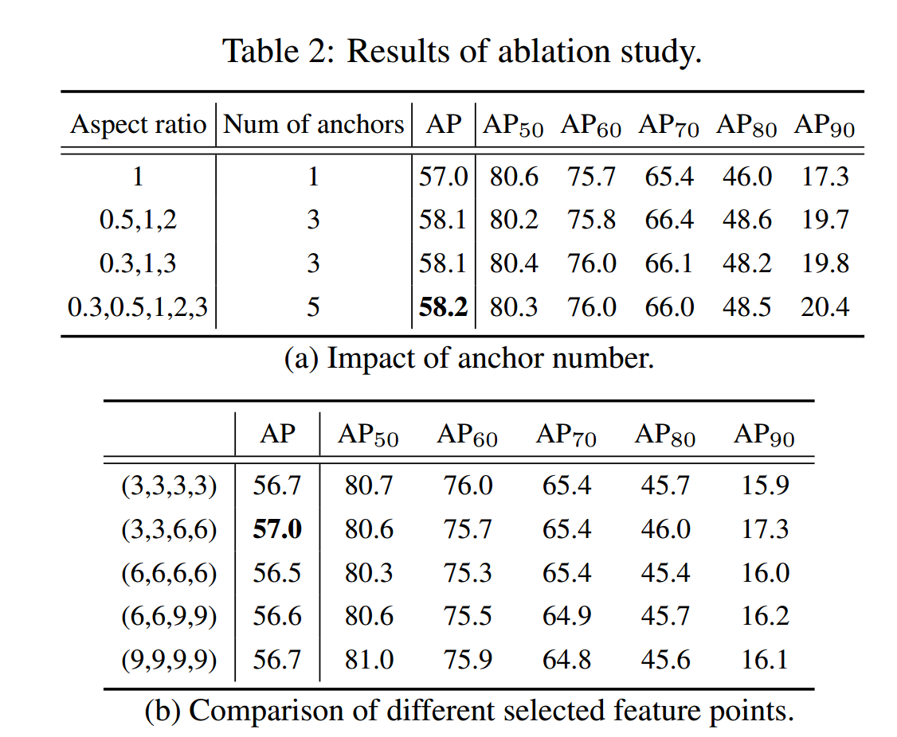
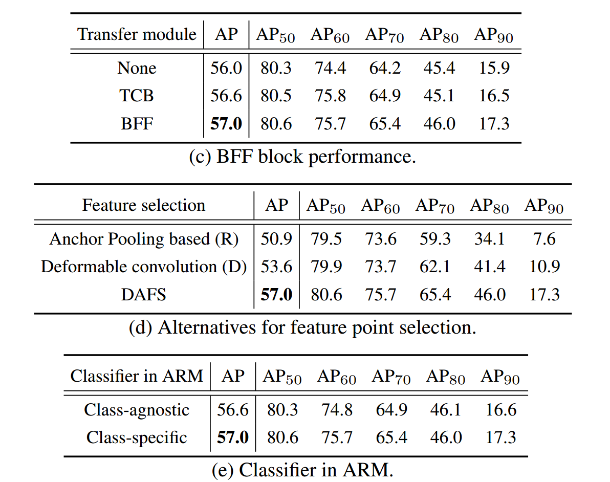
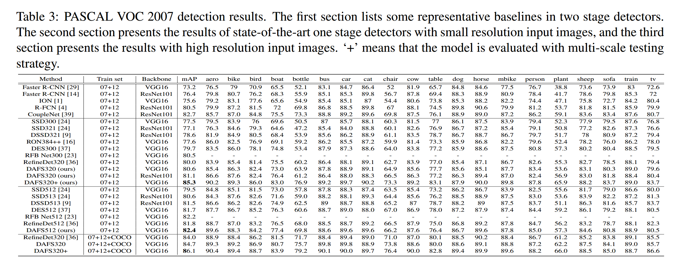
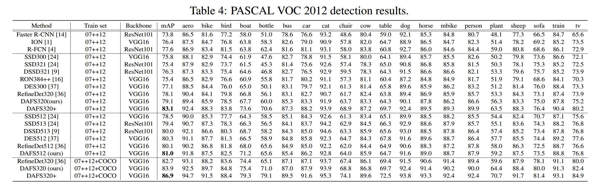
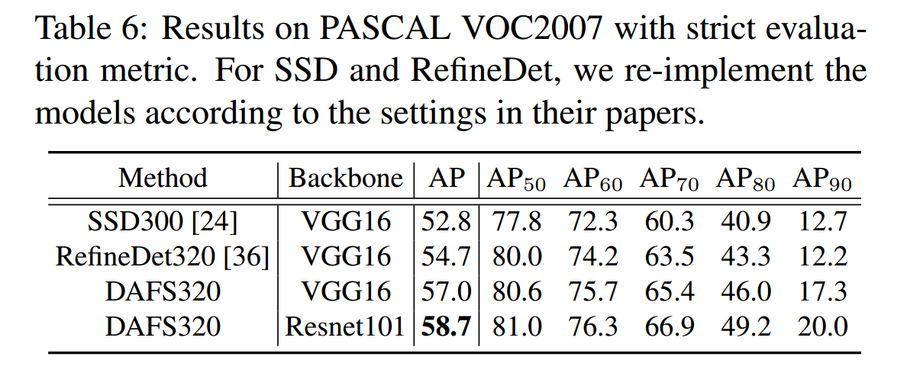
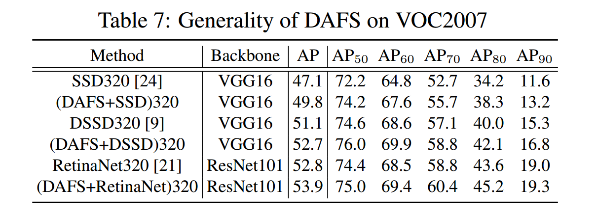

### Dynamic Anchor Feature Selection for Single-Shot Object Detection

#### 摘要

​		锚的设计对于一阶段检测来说至关重要。最近，研究人员提出锚精炼模块（anchor refinement module:  ARM）来调整默认锚的初始化，其给检测器提供了更好的锚参考。然而，这个模块带来了另一个问题：**一个特征图中的所有像素具有相同的感受野，而与每个像素关联的锚却有不同的位置和大小**。这种不相关可能产生低效的检测器。本文提出动态特征选择（dynamic feature selection）的操作，其给ARM中的每个精炼锚选择新像素。基于新的锚位置和大小选择的像素使这些像素的感受野可以很好地适应锚区域，其使得检测器（特别是回归部分）更易于优化。此外，为了增强选择的特征像素的表示能力，作者设计了组合早期和深度层特征双向特征融合模块。在PASCAL VOC和COCO上的广泛实验证明了动态锚特征选择（dynamic anchor feature selection：DAFS）操作的有效性。对于更高IoU阈值的情况，DAFS较大幅度地提高了mAP。

#### 1. 引言

​		受两阶段检测器的启发，一些研究人员在一阶段检测器中借鉴了两步级联回归方法。RefineDet就是其中之一，它使用ARM来调整锚的位置和大小，并同时过滤掉容易的负锚。实验证明真确率的增加主要产生自调整的锚。表1给出了新的正类锚的原始IoU分布（IoU > 0.5）。可以看出在精炼之后，正类锚的数量大大增加，几乎85%的正类锚来自负锚。然而，RefineDet中与每个锚关联的特征点没有改变，这导致了调整的锚和特征点感受野不关联。这种特征图每个位置的不相关相互之间是不同的，因为调整后的锚是不规则的，这使得检测器（特别是回归部分）不是最优的。

​		**既然锚位置被调整了，那么为什么不能采样与被调整的锚关联的特征点呢？**受此启发，作者提出一种简单而高效的特征选择操作，其基于被调整锚的位置和大小动态选择合适的特征点。选择的特征点可以覆盖调整锚的大部分，使这些点的感受野与新锚很好地对齐。选择的特征点与原始的一阶段检测器中的设置保持相同，这使得我们无需改变最终的分类器和回归器的结构，其意味着可以维持快速的推理速度。本文遵循与RefineDet相似的结构，但有两个不同之处：（1）在RefineDet中，第一个阶段（Anchor Refinement Module）的特征通过Transfer Connection Block（TCB）迁移到第二阶段（Object Detection Module），本文使用新设计的Bidirectional Feature Fusion Block（BFF）替换TCB。在TCB˙中，每个特征仅接受来自其上层的特征，而BFF中将上一层和下一层的特征组合以融合到当前特征图。（2）作者将ARM中类无关的分类器改为类特定的分类器，因为这种更强壮的正则化贡献了更具辨别性的特征。总而言之，本文的贡献包括两点：

​		（1）提出简单而高效的动态锚特征选择（DAFS）操作来解决调整锚形状和特征图感受野之间的不相关。（2）与TCB或FPN不同，本文通过一个top-down路径将更高层特征图融合到更低层的特征图，作者提出双向特征融合模块，其允许不同特征图相互激活，这使得每个特征可以同时捕获基本的视觉线索和高级特征。

#### 3. Dynamic Anchor Feature Selection

​		本文的网络结构见图1。在检测器头部添加特征选择操作来选择每个分类器和回归器适合的特征。还将RefineDet中TCB替换为BFF，BFF同时利用botto-up和top-down路径来组合不同层。

##### 3.1. Anchor Refinement Module

 		锚精炼模块是用于一阶段检测器的类RPN模块，其由[36]最先提出。在多尺度检测框架下，它将两个卷积层（一个回归器和一个分类器）附加到每个检测源层。ARM的主要目标是为每个锚分配一个背景/前景得分和预测调整位置。二值分类分数用于过滤容易分负样本，并将精炼锚输送到最终的目标检测模块（ODM），其与SSD中的最终检测器头部相同。根据[37]中的实验结果，性能的增益主要来自良好初始化的锚。

​		为了更好的分析检测器中ARM的影响，作者首先检测器头部中的边界框回归和分类的定义。

##### 3.2 Bounding box regression

​		对于一阶段检测器，边界框回归的任务是，使用回归器$f(x,a)$将锚$a$回归到目标边界框 $g$ 。锚 $a$ 和边界框 $g$ 使用都是用四个坐标 $(x, y, w, h)$定义。回归器 $f$ 通过优化如下函数学习：

$$R_{loc}[f]=\sum_{i=1}^N L_{loc}(f(x_i, a_i), g_i), \tag{1}$$

其中$L_{loc}$为SSD中平滑的L1损失。$x_i$为与锚$a$关联的输入。训练期间，$L_{loc}$ 优化距离向量$d=(d_x, d_y, d_w, d_h)$ 以获得回归不变性。$d$ 定义为：

$$\begin{align} d_x =(g_x - a_x) / a_w & d_y = (g_y - a_y) / a_h ,\tag{2}\\ d_w = \log(g_w/a_w) & d_h = \log(g_h / a_h) ,\tag{3} \end{align}$$

SSD中，检测特征图中的每个像素点与几种锚关联，它们具有不同的大小和纵横比。例如，在图2中，蓝色、黄色和绿色是附加在特征图上三种锚。$3 \times 3$ 红色特征点是回归器的输入$x_i$。注意，$x_i$的实际感受野不需要与锚匹配。回归器$f()$可以自动学习对边界狂$g$的特定尺度做出响应，由于在回归器的每个位置中，锚坐标$a_w$、$a_h$相同，可以将其视为常量。这意味着，对于每个种类的锚，其大小的变化的分布为0。在RefineDet中，相同的种类的锚将会偏向接近ground-truth边界框 $g$ 的不同方向。这使得距离向量 $d$ 小于SSD中距离，这看起来可以使回归器更容易优化。然而，这不是真的，因为每个种类调整的锚在ARM后有更多变化，这意味着在距离向量中 $a_w$ 和 $a_h$ 变为变量，不再是常量了。更多的，ODM中回归器的输入与原始的保持一致，所以它们不会感知调整后锚的特定形状，因为 $a_w$ 和 $a_h$ 由ARM动态预测。

##### 3.3 Classification

​		一阶段检测器中的分类器 $h(x)$ 旨在分配类上的后验分布 $M+1$ 维的估计，其中 0 表示背景，$M$为余下的类。$H(x)$ 通过最小化分类损失函数来训练：

$$R_{cls}[h] = \sum_{i=1}^N L_{cls}(h(x_i), y_i) ,\tag{4}$$

如果一个锚与任意ground box的最大IoU大于0.5，它就被定义为正类。这种度量方式在ARM和ODM中都使用。如果一些默认的负锚在ARM之后与新调整的锚的IoU大于0.5，那么它将变为正类，其可能由于是负锚而不会对ARM中的分类损失作出贡献。这可能导致次优的优化器，因为特征点与它们关联的锚太远，以至于它们的代表性不足以被分类为前景类标签。如表1所示，对于超过47%的调整锚，它们精炼之前的IoU小于0.4。

##### 3.4 Dynamic Feature Selection

​		正如上述分析可见，ARM将会引起输入特征点和他们关联的新的精炼锚之间侧不相关。这种不关联可能产生次优的检测器，特别是对于回归部分。一种简单的解决方案是基于锚的新形状，为检测器头部动态地采样特征点。以这种方式，特征点能够感知锚的存在。特征选择函数 $s$ 可以写为：

$$p = s(a_w, a_h, x, y), \tag{5}$$

其中$a_w$、$a_h$是调整后锚 $a$ 的宽度和高度。$x$、$y$ 描述与锚关联的特征图的位置。$p \in H \times W \times C$ 为检测器头部中选择的特征点的坐标。每个通道中沿着$H$ 和 $W$ 轴的坐标是相同的，因此可以将矩阵减少到 $H \times W$。RefineDet[36]和SSD[24]中，将$H$ 和 $W$ 设置为 $3 \times 3$ ，$p$ 设置为中心在 $(x, y)$ 的 $3 \times 3$ 滑动窗口。本文中，作者需要利用调整的锚的形状。受RoIAlign[13]的启发，作者将锚 $a$ 简单均匀地划分为 $H_a \times W_a$ 的子窗口。在每个子窗口中，选择中心位置 $c$ 作为这个子窗口的代表性位置。然后，有$H_a \times W_a$ 个代表性位置。每个位置的特征为特征图中其他位置特征的权重和：

$$f_c = \sum_{i=1}^N w_i \times f_i, \tag{6}$$

$$w_i = \max(1 - |x_c - x_i|, 0) \times \max(1 - |y_c - y_i|, 0), \tag{7}$$

其中 $f_i$ 为坐标位置为整型的特征点。$x_c$、$x _i$为位置 $c$ 和 $i$ 处的 $x$ 坐标。$y_c$、$y_i$为位置 $c$ 和 $i$ 处的 $y$ 坐标。$w_i$ 为分配到 $f_i$ 的权重。现在，有特征矩阵 $F \in H_a \times W_a$ 。为了拟合回归器和分类器的输入尺寸，作者使用最大池化将 $F$ 的尺寸缩小到 $H \times W$ 。

​		也有一些采样锚特征位置的替代方法。RoIPooling[10]可以基于调整的锚直接池化 $H \times W$的特征矩阵，但是它需要比较锚中的所有特征点，这非常好使。DeformConv[5]也可以利用用额外分支来预测锚的采样位置，它的输入是特征图。由于内存和计算复杂度增加，这不再是高效的。在消融研究中会执行相关的实验。

##### 3.4 Bidirectional feature fusion

​		因为ARM和ODM有不同的目标，所以在这两个模块之间直接共享特征不是一个好选择。因此，需要构建从ARM到ODM的桥梁。在RefineDet中，提出Transfer Connection Block（TCB）来构建特征金字塔，这在ODM中使用自上而下的路径实现。本文，将TCB改为图1中的Bidirectional Feature Fusion（BFF）块，其中自上而下的路径和自下而上的路径都用于融合不的层。具体而言，每层接受其上一层的抽象特征，同时从其低一层获取更多基础线索。作者发现，对TCB的这种小修改可以将检测性能进一步提高，而计算成本的增加却可以忽略不计。

#### 4. Training Settings

​		**Backbone**   使用ImageNet上预训练的VGG16[33]和ResNet101[14]

作为骨干网络。其他设置与RefineDet保持一致。对于VGG16，conv4_3、conv5_3、fc7和额外层conv6_2用作多几检测层。L2归一化[25]用于缩放conv4_3和conv5_3中的特征范数。对于ResNet101，最后的三块和额外的res6用于多尺度检测。这四个特征图的步长分别为$\{8, 16, 32, 64\}$。

​		**Anchors and matching strategy**    与每个特征图关联的锚有一个特定的大小（特征步长的4倍）。对于纵横比，作者在 $(1/2, 1/3, 1/1)$ 中

选择不同的组合，并发现使用 $1/1$ 可以达到相当的准确率。在两个阶段中，如果一个锚与ground truth的最大IoU大于0.5，将这个锚设置为正类。

​		**Loss function**   作者的特征选择操作不会改变损失函数的形式（但ARM除外），作者采用类特定的分类器。对硬负样本挖掘，作者根据损失值选择负样本以保证正负样本之间的比例为 $1:3$。Focal损失也可以使用，但不是本文所关注的。损失函数可以写为：

$$\begin{align} L(I;\theta) &=\alpha L_{arm}(a,y,p,t) + L_{odm}(a',y',p',t') \tag{8} \\ L_{arm}(a,y,p,t) &=L_{cls}(p,y)+1[y>0]L_{loc}(a,t) \tag{9} \\ L_{odm}(a',y',p',t') &=L_{cls}(p',y') + 1[y'>0]L_{loc}(a',t') \tag{10} \end{align}$$ 

其中 $I$ 为输入图像，$\{a, y, p, t\} $为默认锚的坐标、类标签、预测置信度和预测锚坐标，$\{a',y',p',t'\}$ 为调整锚的坐标、类标签、预测置信度和预测坐标。分类损失 $L_{cls}$ 设置为交叉熵损失，定位损失 $L_{loc}$ 设置为平滑的 $L_1$ 损失。所有实验中将 $\alpha$ 设置为 1 。

#### 5. Experiments

​		**Datasets.**  在两个主流数据集上执行实验：PASCAL VOC[8]和MS COCO[22]，它们分别有20个和80个类。对于VOC2007，模型在VOC2007 trainval和VOC2012 trainval的并集上训练。对于VOC2012，训练数据是VOC2007 trainval 和 2007 test + VOC2012 trainval。遵循常用的划分方法，作者使用2014 trainval35k（包含135K张图像）来训练模型，并在2015 test-dev（包含大约20K图像）上验证性能 。

​		**Experimetnal setting.**   所有数据集的batch size设置为32。将momentum固定为0.9，权重衰减设置为0.0005。在VOC数据集上，前100个epoch中学习率设置为 $10^{-3}$，另外50和30个epoch后分别设置为 $10^{-4}$ 和 $10^{-5}$ 。对于COCO数据集，由于其大尺度，学习率在前150个epoch中设置为 $10^{-3}$，并在另外40和30个epoch中衰减为 $10^{-4}$ 和 $10^{-5}$ 。训练期间，新添加层的权重初始化为服从标准方差为0.001的零均值高斯分布，其他层通过标准的VGG16或ResNet101初始化。

##### 5.1 Ablation study

​		出于快速消融研究的目的，本节的模型使用VOC2007 trainval + VOC2012 trainval训练，并在VOC2007 test上测试。作者报告了不同阈值（例如0.5、0.6、0.7、0.8、0.9）设置下所有模型的性能。

​		**Number of default anchors.**  为了验证插入DAFS时锚点数量如何影响模型性能，我们通过在特征图的每个像素处关联不同数量的锚点来设计一些实验。结果在表2a中，使用如0.5或0.6的低阈值，mAP几乎相同。但是，在更高的阈值下，增加锚的数量明显能够大幅提高mAP，这指出更多的锚有助于训练更好的回归器。

​		**Number of feature sampling points.**    注意，作者为每个锚选择 $H_a \times W_a$ 的特征点，然后将它们最大池化为 $3 \times 3$ 以适应分类器和回归器的输入大小。为了评估采样点的影响，设置了一组配置：$\{(3,3,3,3), (3,3,6,6), (6,6,6,6), (6,6,9,9), (9,9,9,9)\}$ 。每个设置中的四个值代表4个检测层中 $H_a$ 值，结果见表2b。如果没有特别指出，训练的所有模型使用 $(3, 3, 6, 6)$ 。

​		**The impact of BFF block.**  为了研究BFF的性能，作者设计另外两个模型。 一个模型是直接在ARM和ODM之间共享特征，而没有其他模块。第二个是使用BFF替换TCB，而其他与第一个模型相同。表2c给出了比较结果。第一个特征共享模型表现最差，表明它需要将第一阶段的特征迁移到第二阶段。具有BFF块的模型表现最好，证明BFF在不同层的特征融合方面优于TCB。

​		**Alternatives for feature selection.**    使用两种方法来执行特征选择过程：RoIPooling和可变形卷积，称它们为 ‘R’ 和 ‘D’ 。对于RoIPooling，比较子窗口中的所有特征像素，并选择最大的一个作为子窗口中的代表性特征点。对于可变形卷积，作者在每个检测层添加额外的层来预测每个调整锚新选择的特征位置。比较结果见表2d，可以看出，模型‘R’在更高阈值下表现最差，这背后的原因可能是RoIPooling可以引起特征和锚之间的不对齐。模型‘D’的准确率高于模型‘R’，但是仍然低于基模型。一种可能的解释是预测位置的一些可能在锚之外，这不是非常有助于训练检测器。

​		**Class-agnostic or class-specific.**   对于ARM中的分类器，作者尝试了类无关和类特定，并在表2e中给出比较结果。可以看出类特定分类器的准确率比类无关的分类器的准确率更高。理由可能是基于类特定分类器的损失函数可以为网络提供更强的监督，因此ARM中的特征可以更好地迁移到最终的检测器。

##### 5.2. Comparison with Competing Networks

​		如果没有特别指出，对于这一部分中的所有模型，四个检测层中的$H_a$ 和 $W_a$ 设置为 $(3,3,6,6)$ 和一个纵横比 $(1:1)$（由于计算资源的限制）。

​		**PASCAL VOC 2007.**    表3给出了本文模型与历史最佳模型的比较。

​		**PASCAL VOC 2012.**  见表4。

​		**PASCAL VOC with strict metric.**  见表6。

​		**MS COCO.**    见表5，速度在Titan X以批量1测试。

##### 5.3. Generality

