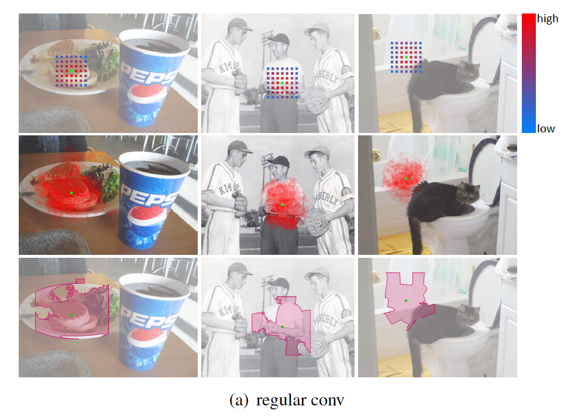
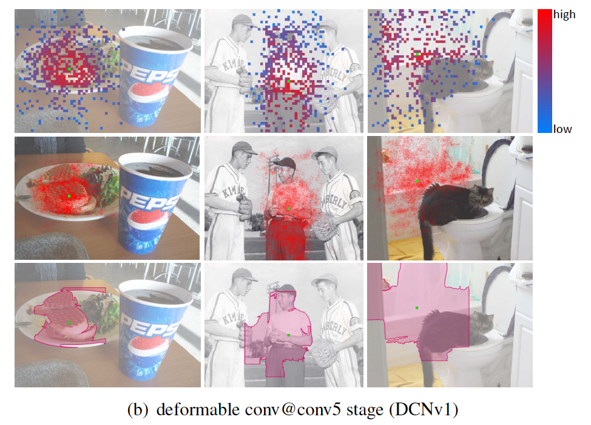
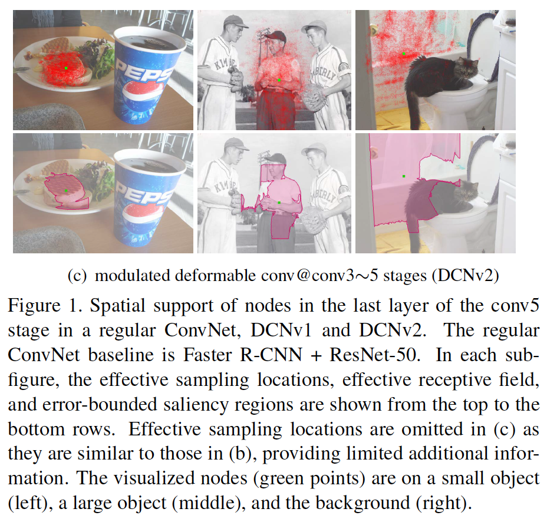
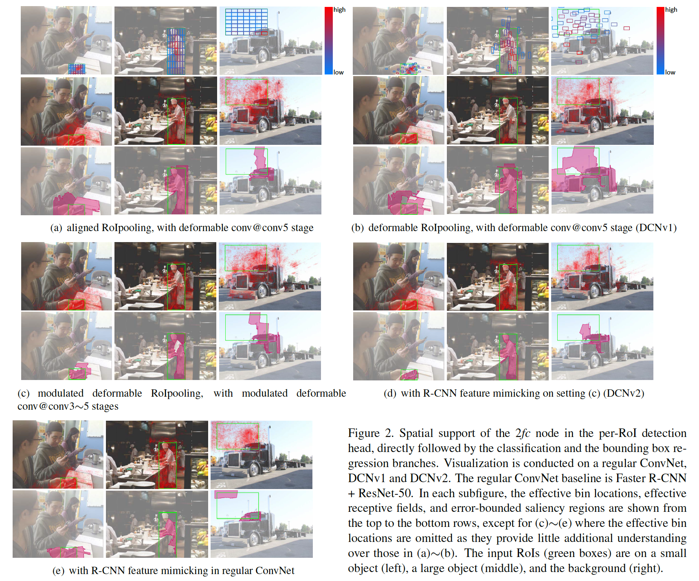
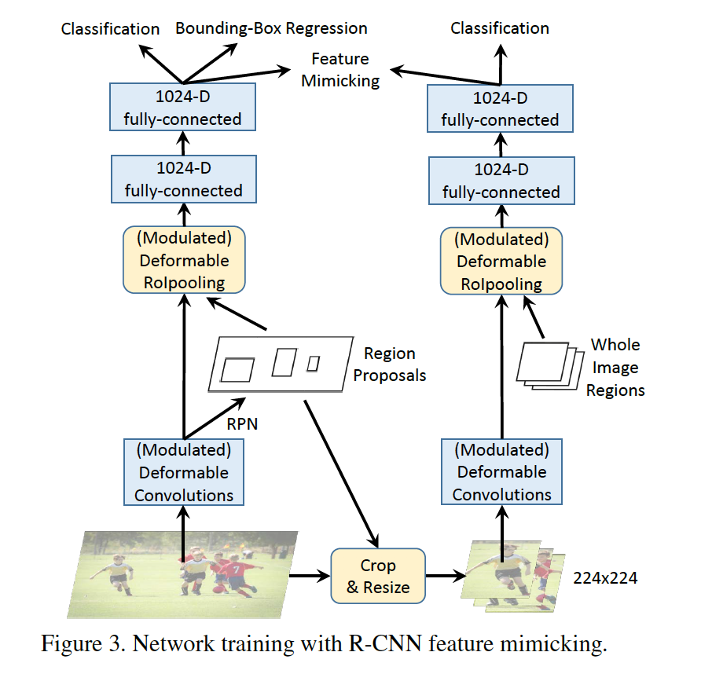

### Deformable ConvNets v2: More Deformable, Better Results

#### 摘要

​		可变形卷积网络的卓越性能源于其适应对象几何变化的能力。通过检查其适应性行为，我们观察到，尽管其神经特征的空间支持比常规的ConvNets更紧密地符合目标结构，但这种支持可能仍远远超出了感兴趣区域，从而导致特征受无关图像内容的影响 。为了解决这个问题，我们提出了可变形卷积的一种重新设计，它通过提高建模能力和更强的训练来提高卷积关注相关图像区域的能力。通过网络中可变形卷积的更全面集成，以及通过引入扩展变形建模范围的调制机制，可以增强建模能力。为了有效地利用这种丰富的建模能力，我们通过提出的特征模仿方案来指导网络训练，该方案可以帮助网络学习反映目标焦点和RCNN特征分类能力的特征。通过提议的贡献，此新版本的Deformable ConvNets在原始模型上获得了显着的性能提升，并在COCO基准测试的对象检测和实例分割中产生了领先的结果。

#### 1. 引言

​		由尺度、姿态、视角和部分形变引起的几何变化是目标识别和检测的主要挑战。当前处理这个问题的最佳方法是可变形卷积网络（DCNv1），其引入了两个模块，可帮助CNN对此类变化进行建模。这些模块之一是可变形卷积，其中标准卷积的网格采样位置对于先前的特征图学习了位移。另一个是可变形的RoIPooling，其中偏移是在RoIPooling的bin位置中学习得到的。将这些模块整合到神经网络后，它就可以使其特征表示适应目标的配置，特别是通过变形其采样和合并模式以适合目标的结构。利用这一方法，目标检测准确率获得很大的提升。

​		为了理解可变形卷积网络，作者通过排列PASCAL VOC图像中的偏移采样位置来可视化感受野中的感应变化[11]。法相激活单元的样本倾向于聚集在目标周围。但是，目标上的覆盖范围不够精确，显示出超出目标区域的样本分布。 在使用更具挑战性的COCO数据集[29]中的图像对空间支持进行更深入的分析时，我们观察到这种行为变得更加明显。这些发现表明存在更大的潜力来学习可变形卷积。

​		本文中，我们提出具有增强建模能力可用于学习可变形卷积的新版Deformable ConvNets，称为_Deformable ConvNets v2_（DCNv2）。其建模能力的提高来自两种互补形式。第一是在网络内扩展使用可变形卷积层。装备更多具有偏移学习能力的卷积层允许DCNv2控制更宽范围特征层上的采样。第二个是可变形卷积模块中的调制机制，其中每个样本不仅经历学习的偏移，而且还通过学习的特征幅度进行调制。因此，网络模块具有改变其样本的空间分布和相对影响的能力。

​		为了充分探索DCNv2的增长建模能力，高效训练是必须的。受神经网络中知识蒸馏的启发[2、22]，为这个目的使用教师网络，其中教师在训练中提供指导。我们利用R-CNN[17]作为教师。由于它在裁剪图像内容上训练网络进行分类，R-CNN学习不受RoI区域外的无关特征的影响。为了模拟此属性，DCNv2在其训练中纳入了模拟损失的特征，这有助于学习与R-CNN一致的特征。以这种方式，DCNv2因其增强的可变形采样而获得了强大的训练信号。

​		利用所提出改变，可变形模块仍然是轻量的，并可以轻松纳入已有的网络架构。具体而言，我们将DCNv2纳入具有不同骨干网络的Faster R-CNN[33]和Mask R-CNN[20]系统。COCO基准上广泛实验表现出DCNv2相对于DCNv1的进行目标检测明显改进。

### 2. 可变形卷积网络行为的分析

#### 2.1. Spatial Support Visualization

​		为了更好理解Deformable ConvNets的行为，我们通过网络节点的有效感受野[31]、有效采样位置和错误边界显着区域来可视化网络节点的空间支持。这三种方式对有助于节点响应的基础图像区域提供了不同且互补的观点。

**有效感受野**	不是网络节点感受野中的所有像素对其响应作出同等的贡献。这些贡献中的差异由_有效感受野_表示，其值被计算为与每个图像像素强度扰动对应的的节点响应的梯度[31]。我们利用有效感受野来测试网络节点中单个像素的影响，但是要注意这种测量没有反映完整图像区域的结构化影响。

**Effective sampling/bin locations**	在[8]中，可视化（堆叠的）卷积层的采样位置和RoIPooling层中采样bin以理解Deformable ConvNets的行为。但是，这些采样位置对网络节点的相对贡献并未揭示。相反，我们可视化包含这些信息的有效采样位置，其计算为与采样/bin位置相对应的网络节点的梯度，以及理解他们的贡献强度。

**Error-bounded saliency regions**	如我们最近对图像显着性的研究所证明的，如果我们删除不影响网络节点的图像区域，则网络节点的响应不会改变[41、44、13、7]。基于这种特性，我们可以将节点的支持区域确定为最小图像区域，并在很小的误差范围内提供与完整图像相同的响应。我们称这为_error-bounded saliency region_，其可以通过逐步遮盖图像的某些部分并计算所得的节点响应来找到它们，如附录中所述。error-bounded saliency region促进不同网络的支持区域的比较。

#### 2.2. Deformable ConvNets的空间支持

​		我们分析目标检测中Deformable ConvNets的可视化支持区域。我们采用规则的ConvNet作为基线，该基线包含具有Aligned RoIPooling的Faster R-CNN + ResNet50目标检测器。在整个输入图像上使用ResNet-50中的所有卷积层。conv5阶段的有效步长从32减小到16个像素，以增加特征图的分辨率。在ResNet-101的conv4特征之上添加RPN[33]头，其包含对齐的RoIPooling和两个全连接层，记者是分类和边界框回归分支。我们遵循[8]的程序以将目标检测器转换为可变形副本。conv5阶段的$3 \times 3$卷积被替换为可变形卷积层。对齐的RoIPooling层也替换为可变形RoIPooling。两个网络都在COCO基准上训练和可视化。值得一提的是，当将偏移学习率设置为0时，Deformable Faster R-CNN检测器衰退为具有AlignedRoIPooling的常规Faster R-CNN。

​		使用三种可视化模态，在图1（a）～（b）中，我们检查conv5阶段最后一层的节点的空间支持。还展示了[8]中分析的采样位置。根据这些可视化，我们作出如下总结：

1. 常规ConvNet可以一定程度上建模几何变化，如与图像内容对应的空间支持方面的变化提供的证据。由于深度ConvNets的强表示能力，学习网络权重以容纳一定程度的几何变换。
2. 通过引入可变形卷积，即使在挑战性的COCO基准上，网络建模几何变换的能力明显增强。空间支持更适合于图像内容，前景上的节点具有覆盖整个目标的支持，而背景上的节点具有扩展的支持，可以包含更大的上下文。但是，空间支持的范围可能不精确，前景节点的有效感受野和误差边界显着区域（error-bounded saliency region）包括与检测无关的背景区域。
3. 所呈现的三种类型的空间支持可视化比[8]中使用的采样位置更具信息性。例如，这可以通过常规的ConvNet看到，该ConvNet在网格上具有固定的采样位置，但实际上是通过网络权重来调整其有效的空间支持。对于可变形卷积网也是如此，其预测受学习的偏移量和网络权重共同影响。仅在[8]中进行检查，可能会导致对可变形卷积网络的误导性结论。

​    图2（a）～（b）展示每个RoI检测头部中2个fc节点的空间支持，其直接遵循分类和边界框回归分支。有效的bin位置的可视化认为，目标前景上的bin通常接受更大的梯度，因此在预测中发挥更大的影响。这种观察在Aligned RoIPooling和Deformable RoIPooling中也成立。在Deformable RoIPooling中，由于可学习的bin偏移的引入，覆盖目标前景的bin的比例远大于Aligned RoIPooling。因此，下游Fast R-CNN头可从相关的存储区获取更多信息。同时，Aligned RoIPooling和Deformable RoIPooling中的error-bounded saliency region没有充分关注目标前景，其认为RoI为的图像内容影响预测结果。根据最近的研究[6]，如此的特征推理对检测可能有害。

​		虽然很明显，与常规的ConvNet相比，可变形的ConvNets显着提高了适应几何变化的能力，但也可以看出其空间支持可能会扩展到感兴趣的区域之外。因此，我们探索更新Deformable ConvNets，使得他们可以更好地关注相关的图像内容，并带来更好的检测准确率。

### 3. More Deformable ConvNets

​		为了提高网络适应几何变化的能力，我们提出了一些更改，以增强其建模能力并帮助其充分利用这种增强的功能。

#### 3.1. Stacking More Deformable Conv Layers

​		受Deformable ConvNets可以在挑战性基准上有效建模几何变换的观察的鼓励，我们大胆地用可变形卷积替换更多规则的conv层。我们期望，通过堆叠更多可变形conv层，整个网络的几何变换的建模能力可以进一步增强。

​		本文中，在ResNet-50的conv3、conv4和conv5中的$3 \times 3$卷积层上使用可变形卷积。因此，网络中有12层可变形卷积。相比之下，[8]中仅使用3层可变形卷积，即conv5阶段中使用。在[8]中观察到，对于相对简单和小规模的PASCAL VOC基准，当堆叠三层以上时，性能会达到饱和。此外，在COCO上误导的偏移可视化效果可能会阻碍进一步探索更具挑战性的基准。在实验中，我们观察到conv3-conv5中使用可变形层在COCO目标检测上获得准确率和效率之间的最佳平衡。细节见5.2节。

#### 3.2. Modulated Deformable Modules

​		为了进一步增强可变形卷积网络操纵空间支撑区域的能力，引入了一种调制机制。利用它，可变形ConvNets模块不仅可以调整感知输入特征的偏移量，还可以调制来自不同空间位置/bin的输入特征幅度。在极端情况下，通过将特征幅度设置为零，模块可以决定不感知来自特定位置/bin的信号。因此，相应空间位置的图像内容可以明显减少，或者不影响模块的输出。因此，调节机制给网络模块提供另一种维度自由来调整它的空间支持区域。

​		给定$K$个采样位置的卷积核，令$w_k$和$p_k$表示第$k$个位置的权重和预先指定的偏移。例如，$K=9$和$p_k \in \{(-1,-1),(-1,0),\cdots,(1,1)\}$定位为膨胀为1的$3 \times 3$卷积核。令$x(p)$和$y(p)$分别表示输入特征图$x$上和输出特征图$y$上位置$p$的特征。调节可变形卷积可以表示为：

$$y(p) = \sum_{k=1}^K w_k \cdot x(p + p_k + \Delta p_k)\cdot \Delta m_k, \tag{1}$$

其中$\Delta p_k$和$\Delta m_k$分别表示可学习的偏移核调剂标量。调节标量$\Delta m$位于$[0,1]$中，而$\Delta p_k$为无约束范围的实数。由于$p + p_k + \Delta p_k$为小数，与[8]一样使用双线性插值计算$x(p + p_k + \Delta p)$。通过在相同输入特征图$x$上使用单独的卷积层获得$\Delta p_k$和$\Delta m_k$。该卷积层具有与当前卷积层相同的空间分辨率和膨胀率。输出为$3K$通道，其中前$2K$个通道与学习到的偏移$\{\Delta p_k\}_{k=1}^K$，余下的$K$个通道馈入sigmoid层以获得调节标量$\{\Delta m_l\}_{k=1}^{K}$。**在这个单独的卷积中层中的核权重初始化为0。**因此，$\Delta p_k$和$\Delta m_k$的初始值分别为0和0.5。用于偏移和调节学习的学习率设置为现有层的学习率的0.1倍。

​		调节可变形RoIPooling的设计相似。给定输入RoI，RoIPooling将它划分为$K$个空间bin（例如$7 \times 7$）。在每个bin中，使用均匀空间间隔的采样网格（例如$2 \times 2$）。平均网格上的采样值以计算bin输出。令$\Delta p_k$和$\Delta m_k$为第$k$个bin的可学习偏移和调节标量。输出bin特征$y(k)$计算为：

$$y(k) = \sum_{j=1}^{n_k}x(p_{kj} + \Delta p_k) \cdot \Delta m_k/n_k,\tag{2}$$

其中$p_{kj}$为第$k$个bin上第$j$个网格单元的采样位置，$n_k$表示采样网格单元的数量。使用双线性插值获得特征$x(p_{kj} + \Delta p_k)$。$\Delta p_k$和$\Delta m_k$的值由输入特征图上的两个分支计算。在这个分支中，RoIPooling在RoI上生成特征，接着是1024d的fc层（利用标准差为0.01的高斯分布初始化）。最重要的是，附加的fc层产生$3K$通道的输出（权重初始化为零）。前$2K$通道为归一化的可学习偏移，其中计算与RoI宽度和高度的逐元素乘法，以获得$\{\Delta p_k\}_{k=1}^K$。余下的$K$个通道由sigmoid层计算以产生$\{\Delta m_k\}_{k=1}^K$。用于偏移学习的额外$fc$层的学习率与已有层的学习率相同。

#### 3.3. R-CNN Feature Mimicking

​		如图2所示，对于常规ConvNet和可变形ConvNet，每个RoI分类节点的error-bounded saliency region可以超过RoI。因此，RoI外的图像内容可能影响提取特征，所以衰退目标检测的最终结果。

​		在[6]中，作者发现冗余上下文是Faster R-CNN检测错误的合理来源。结合其他动机（例如，在分类和边界框回归分支之间共享较少的特征），作者建议结合Faster R-CNN和R-CNN的分类分数以获得最终检测分数。由于R-CNN分类评分的重点是来自输入RoI的裁剪图像内容，因此将其合并将有助于减轻冗余上下文问题并提高检测精度。但是，由于Faster-RCNN和R-CNN分支都需要用于训练和推理，因此组合系统很慢。

​		同时，Deformable ConvNets在调整空间支持区域上是很强大的。特别是对于可变形的ConvNets v2，调制的可变形RoIpooling模块可以通过排除冗余上下文的方式简单地设置bin的调制标量。但是，5.3节中的实验表明，即使利用调节可变形模块，如此的表示不能通过标准的Faster R-CNN训练过程很好地学习。我们怀疑这是因为传统的Faster R-CNN训练损失不能有效的驱动如此表示的学习。需要额外的引导来转变训练。

​		受最近关于特征模仿的研究[2、22、28]的启发，我们在“Deformable Faster R-CNN”的每RoI特征中加入了特征模仿损失，以迫使它们与从裁剪图像中提取的R-CNN特征相似。此辅助训练目标旨在驱动Deformable Faster R-CNN，以学习更多的“聚焦”特征表示，如R-CNN。我们注意到，基于图2中的可视化空间支持区域，聚焦特征表示对于图像背景上的负类RoI可能不是最佳的。对于背景区域，可能需要考虑更多上下文信息，以免产生误报。因此，仅在与ground-truth目标充分重叠的正类RoI上强制执行模拟损失功能。

​		训练Deformable Faster R-CNN的网络架构如图3。除了Faster R-CNN网络，添加额外的R-CNN分类进行特征模仿。给定特征模仿的RoI $b$，裁剪与它对应的图像布丁，并调整到$224 \times 224$像素。在R-CNN分支中，在调整的图像补丁上运行骨干网络，并产生$14 \times 14$空间分辨率的特征图。在特征图上应用（调节）可变形RoIPooling层，其中输入RoI覆盖整个调整图像布丁（左上角位于$(0,0)$，宽和高为224像素）。此后，使用2层1024维的_fc_层，产生输入图像补丁的R-CNN特征表示。接着使用$(C+1)$路的Softmax分类器进行分类，其中$C$表示前景分类的数量，加1为背景。在R-CNN特征表示$f_{\mbox{RCNN}}(b)$与Faster R-CNN中的对应物$f_{\mbox{FRCNN}}(b)$之间也实施了特征模仿损失，后者也是1024维，由Fast R-CNN中的2个fc层产生。$f_{\mbox{RCNN}}(b)$和$f_{\mbox{FRCNN}}$之间定义的cosine相似性为特征模仿损失，计算为：

$$L_{\mbox{mimic}}=\sum_{b \in \Omega}\Big[1-\cos(f_{\mbox{RCNN}}(b), f_{\mbox{FRCNN}}(b))\Big],\tag{3}$$

其中$\Omega$表示采样用于特征模仿训练的RoI集。在SGD训练中，给定输入图像，由RPN生成的32个正区域提议倍随机采样到$\Omega$。在R-CNN分类头上施加交叉熵分类损失，它也在$\Omega$上的RoI中计算。特征模仿损失、R-CNN分类损失以及Faster R-CNN中原始损失项驱动网络训练。两个新引入的损失项的权重设置为原始Faster R-CNN损失项的0.1倍。R-CNN和Faster R-CNN分支中对应的模块之间的网络参数相同，包括骨干网络、（调节）可变形RoIPooling和2层fc头（两个分支中的分类头部不共享）。推理中，仅在测试图像使用Faster R-CNN网络，而没有辅助R-CNN分支。因此，在推理中没有引入额外的计算。

### 5. 实验

#### 5.1. 实验设置

​		在COCO 2017训练集上训练模型。在消融中，对COCO 2017验证集的5k图像进行评估。我们还在COCO 2017 test-dev集的20K图像上评估性能。不同边界框和Mask IoU处的标准平均平均精度得分分别用于测量对象检测和实例分割精度。

​		选择Faster R-CNN和Mask R-CNN作为基线系统。ImageNet预训练的ResNet50用作骨干。Faster R-FNN的实现与3.3节相同。对于Mask R-CNN，我们遵循[20]中的实现。为了将网络转向可变形卷积，将最后一组$3 \times 3$常规卷积层替换为（调节）可变形卷积层。将Aligned RoIPooling替换为（调节）可变形RoIPooling。特别是对于Mask R-CNN，两个对齐的RoIpooling层（具有$7\times7$和$14\times14$个bin）被具有相同bin数的两个（调节）可变形RoIpooling层替换。在R-CNN特征模仿中，特征模仿损失仅施加于分类（排除掩膜估计）。对于两个系统，超参数选择遵循Detectron[18]最新代码，但图像分辨率除外。在训练和推理时，调整图像使得更短边为1000像素。使用5个尺度和2个纵横比。训练和推理时，分别使用NMS生成2k和1k区域提议。在SGD训练中，采样256个锚框（正负比为$1:1$）和512个区域提议（正负比为$1:3$）进行反向传播他们的梯度。在我们的实验中，在8个GPU上训练16个周期，每个GPU2张图像。学习率最初为0.02，在第10和第14个epoch时，除以10。权重衰减和momentum分别设置为$10^{-4}$和0.9。

