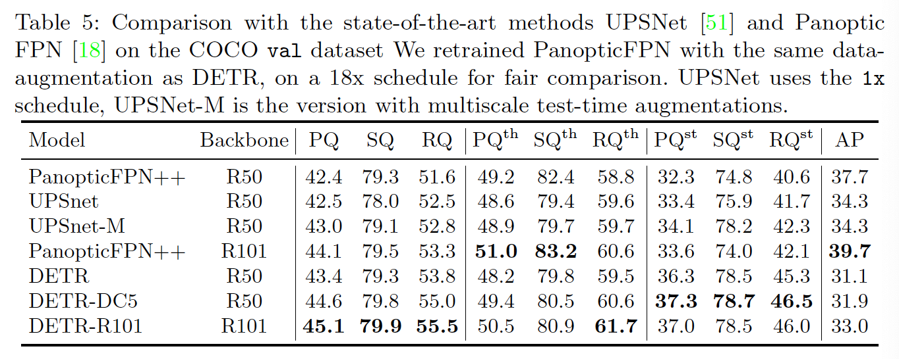

## End-to-End Object Detection with Transformers

### 摘要

​		本文提出了一种将目标检测视为直接集预测问题的新方法。我们的方法简化了检测流程，有效地消除了对许多手工设计的组件的需求，例如非最大抑制过程或锚点生成，这些组件明确编码了我们对任务的先验知识。新框架的主要部分（称为DEtection TRansformer或DETR）是基于集合的全局损失，其通过二分匹配和Transformer编码器-解码器架构强制进行唯一的预测。给定学习到的目标查询的固定小集合，DETR会考虑目标与全局图像上下文之间的关系，以直接并行地输出最终的预测集。新模型概念上简单，并且不需要特殊的库，如许多其他现代检测器使用的。DETR与具有挑战性的COCO目标检测数据集上公认的且高度优化的Faster RCNN基线具有同等的准确性和运行时性能。此外，DETR可以轻松地泛化以统一的方式生成全景分割。我们证明它明显好于竞争性极限。训练代码和预训练模型见https://github.com/facebookresearch/detr。

### 1. 引言

​		目标检测的目标是预测每个感兴趣目标的边界框和类标签集合。现代目标检测器以非直接方式处理这种集合预测任务，其通过在大量提议[37、5]、锚点[23]或窗口中心[53、46]上定义代理回归和分类问题。它们的性能明显受到后处理步骤（锚点集的设计以及启发式方法将目标框分配给锚点）的影响，这些后处理步骤使接近重复的预测崩溃了[52]。为了简化这些流水线，我们提出一种直接集预测方法来绕过代理任务。这种端到端的哲学在复杂的结构化任务（例如机器翻译或语音识别）中产生显著进步，但是没有在目标检测领域取得进步：先前尝试[43、16、4、39]要么添加其他形式的先验知识，要么没有在挑战性基准测试上表现出竞争力。本文旨在弥补这种差距。

​		我们通过将目标检测视为直接集预测问题来简化训练流水线。我们采用基于encoder-decoder架构的Transformer[47]，它是一种流行的序列预测架构。transformer自注意机制可显式地建模序列中元素之间的所有成对交互，因此这些架构特别适合于集合预测的特定约束，例如删除重复的预测。

​		我们的DEtection Transformer（DETR，见表1）一次预测所有目标，并通过设置损失函数进行端到端训练，该函数执行预测目标与ground-truth目标之间的二分匹配。DETR通过删除多个手工设计的组件来简化检测流水线，这些组件对先验知识进行编码，例如空间锚点或非最大抑制。与大多数已有的检测方法不同，DETR不需要任何自定义层，并因此可以在任何包含标准CNN和Transformer类的框架中复现。

​		我们在竞争最激烈的Faster R-CNN基线[37]上，在最流行的目标检测数据集之一COCO [24]上评估DETR。自最初发布以来，Faster RCNN经历了许多设计迭代，并且其性能得到了极大的提高。我们的实验证明，我们的新模型获得相当的性能。更具体地说，DETR在大目标上表现出明显更好的性能，这一结果很可能是由于Transformer的非局部计算而实现的。但是，在小目标上，它获得明溪县更低的性能。我们希望未来的工作将像FPN [22]的发展为Faster R-CNN一样改善这一方面。

​		DETR的训练设置与标准目标检测器有多个方面的不同。这种新模型需要额外的长时间训练，并且受益于transformer中辅助解码损失。我们将彻底探索哪些组件对演示性能至关重要。

​		DETR的设计精神很容易扩展到更复杂的任务。在我们的实验中，我们证明在预训练的DETR之上训练的简单分割头优于全景分割[19]上的竞争基线，这是一项极具挑战性的像素级识别任务，最近得到了普及。

### 2 相关工作

​		我们的工作基于几个领域的先前工作：集合预测二分匹配损失、基于Transformer的encoder-decoder架构、并行解码和目标检测方法。

#### 2.1	Set Prediction

​		没有标准的直接预测集合深度学习模型。基本的集合预测任务是多标签分类（例如，在计算机视觉的背景下，请参见[40、33]作为参考）其基线方法“一对多”不适用于诸如检测以下问题的问题： 元素（即，几乎相同的边界框）之间存在一个基础结构。这些任务的第一个困难是避免near-duplicates。大多数当前检测器使用诸如非极大值抑制的后处理来解决这个问题，但是直接集合预测是没有后处理的。它们需要见面所欲预测元素之间的全局推理方案以避免冗余。对于常量大小的集合预测，密集的全连接网络[9]是足够的，但是过于昂贵。通用方法是使用诸如RCNN的自回归序列模型。在所有情况中，损失函数都应通过预测的permutation而不变。通常的解决方案是设计基于Hungarian算法[20]的损失，从而找出ground-truth与预测之间的二分匹配。这将强制执行permutation-invariance，并确保每个目标元素都有唯一的匹配项。我们遵循二分匹配损失方法。但是，与大多数以前的工作相反，我们不使用自回归模型，而是使用具有并行解码的Transformer，我们将在下面进行描述。

#### 2.2	Transformers and Parallel Decoding

​		Transformer由Vaswani等[47]引入作为机器翻译的新的基于注意力的构建块。注意力机制[2]是从整个输入序列聚合信息的神经网络层，其（与Non-Local Neural Network[49]相似）扫描序列中的每个元素，并通过整个序列的聚合信息更新每个元素。基于注意力的模型的一个主要优势是他们的全局计算和完美的内存，这使得这类模型比RNN更适合长序列。现在，在NLP、语音识别和计算机视觉的许多问题[8、27、45、34、31]中，Transformer替换了RNN。

​		Transformer最早用于自回归模型，遵循早期的序列到序列模型[44]，一个接一个地生成输出令牌。但是，在音频、机器翻译、单词表示学习和最近的语音识别的领域中，过高的推理成本（与输出长度成比例，以及难以批处理）导致并行序列生成的发展。我们还结合transformer和并行解码相结合，以在计算成本和执行集预测所需的全局计算能力之间进行适当的权衡。

#### 2.3	目标检测

​		大多数现代目标检测方法将预测与一些处理猜测关联。两阶段检测器[37、5]预测与提议对应的边界框，而一阶段方法预测与锚或可能目标中心的网格对应的边界框。最近的工作表明这些系统的最终性能严重依赖这些初始猜测为集合的确切方式。在我们的模型中，我们能够移除这中手工后处理，并通过直接预测具有与输入图像（而不是锚）对应的绝对边界框的检测集合来简化检测过程。

​		**Set-based loss**	几项目标检测器[9、25、35]使用二分匹配损失。但是，在这些早期的深度学习模型中，不同预测之间的关系仅利用卷积或全连接层建模，并且手工设计的NMS后处理可以提高它们的性能。更多最近的检测器[37、23、53]使用ground-truth和预测之间使用非唯一分配规则以及NMS。

​		可学习的NMS方法[16、4]和关系网络[17]利用注意力显示地见面不同预测之间的关系。使用直接的集合损失，它们不需要任何后处理步骤。但是，这些方法采用额外的如提议边界框坐标的手工上下文特征来高效建模检测之间的关系，而我们寻找推断模型中编码的先验知识的解决方案。

​		**Recurrent detectors**	与我们的方法最接近的方法是用于目标检测[43]和实例分割[41、30、36、42]的集合预测。与我们的方法相似，他们使用具有基于CNN激活的encoder-decoder架构的二分匹配损失来直接产生边界框集合。但是，这些方法仅在小型数据集上评估，并没有与现代基线对比。特别地，它们基于自回归模型（更精确地说是RNN），因此它们没有利用最新的具有并行解码的Transformer。

### 3	The DETR model

​		在检测中，用于直接集预测的两个关键部分是：（1）迫使预测和ground-truth边界之间唯一匹配的集合预测损失；（2）一种架构（一次通过）来预测一组目标并对它们之间的关系进行建模。我们在图2中描述这种架构的细节。

#### 3.1	Object detection set prediction loss

​		DETR在一次通过解码器时推断出固定大小的$N$个预测集，其中$N$设置为明显大于图像中通常目标数量。训练的主要难点之一是相对于ground-truth对预测的目标（类、位置、大小）进行评分。我们的损失会在预测的和ground-truth目标之间产生最佳的二分匹配，然后优化目标特定（边界框）损失。

​		令$y$表示目标的ground-truth集，$\hat{y} = \{\hat{y}_i\}_{i=1}^N$为$N$个预测集合。假设$N$大于图像中的目标数，我们也将$y$视为利用$\varnothing$（没有目标）的大小为$N$的集合。为了找到这两个集合之间的二分匹配，我们搜索成本最低的$N$个元素$\sigma \in \mathfrak{S}_N$的排列：

$$\hat{\sigma} = {\arg \min}_{\sigma \in \mathfrak{S}_N} \sum_i^N \mathcal{L}_{\mbox{match}}(y_i,\hat{y}_{\sigma(i)}), \tag{1}$$

其中$\mathcal{L}_{\mbox{match}}(y_i, \hat{y}_{\sigma(i)})$为ground-truth $y_i$与索引为$\sigma(i)$的预测之间的逐对_matching cost_。最优的分配是利用Hungarian算法进行高效地计算，遵循先前的工作（例如[43]）。

​		matching cost同时考虑类预测和预测与ground-truth边界框之间的相似性。ground-truth集的每个元素$i$可以视为$y_i = (c_i,b_i)$，其中$c_i$为目标类标签（可能为$\varnothing$），$b_i \in [0, 1]^4$为定义在ground-truth边界框中心坐标的向量，并且它的高和宽与图像的大小相关。对于索引为$\sigma(i)$的预测，我们定义类$c_i$的概率为$\hat{p}_{\sigma(i)}(c_i)$，预测边界框为$\hat{b}_{\sigma(i)}$。利用这些符号，我们将$\mathcal{L}_{\mbox{match}}(y_i,\hat{y}_{\sigma(i)})$定义为$-\mathbf{1}_{\{c_i \ne \varnothing\}}\hat{p}_{\sigma(i)}(c_i) + \mathbf{1}_{\{c_i \ne \varnothing\}}\mathcal{L}_{\mbox{box}}(b_i, \hat{b}_{\sigma(i)})$。

​		查找匹配的过程与用于将提议[37]或锚点[22]匹配到现代探测器中的ground-truth的启发式分配规则具有相同的作用。主要差异是，我们必须为直接集找出一对一的匹配，而不能有重复。

​		第二步是计算损失函数，即前一步中匹配的所有对的_Hungarian loss_。我们将损失定义为类似于常见目标检测器的损失，即用于类预测的负对数似然和随后定义的盒损失的线性组合：

$$\mathcal{L}_{\mbox{Hungarian}}(y) = \sum_{i=1}^N\big[-\log \hat{p}_{\hat{\sigma}(i)}(c_i) + \mathbf{1}_{\{c_i \ne \varnothing\}} \mathcal{L}_{\mbox{box}}(b_i, \hat{b}_{\hat{\sigma}}(i))\big],\tag{2}$$

其中$\hat{\sigma}$为第一步（1）中计算的最优分配。事实上，我们将$c_i =\varnothing$的对数概率项权重降低10倍，以解决类别不平衡问题。这类似于Faster-RCNN训练过程中通过子采样平衡正负提议。注意，目标和$\varnothing$之间的matching cost不依赖预测，其表示在那样的情况下，cost是一个常量。在matching cost中，我们使用概率$\hat{p}_{\hat{\sigma}(i)}(c_i)$，而不是对数概率。这使类预测项与$\mathcal{L}(\cdot,\cdot)$（描述如下）相称，并且我们观察更好的实验性能。

​		**Bounding box loss**	matching cost的第二部分和Hungarian损失的给边界框评分的$\mathcal{L}(\cdot)$。不像将边界预测作为与一些初始猜测对应的$\Delta$的多数检测器，我们直接进行边界框预测。虽然如此的方法简化了实现，但是它引起与损失尺度相关的问题。对于常用的$l_1$损失，尽管小型和大型边界框之间相对误差相似，但是它们却有不同的尺度。未来缓解这个问题，我们使用$l_1$损失和尺度不变的GIoU损失$\mathcal{L}_{\mbox{iou}}(\cdot,\cdot)$的线性组合。综上所述，我们的边界框损失$\mathcal{L}_{\mbox{box}}(b_i, \hat{b}_{\sigma(i)})$定义为$\lambda_{\mbox{iou}}\mathcal{L}_{\mbox{iou}}(b_i,\hat{b}_{\sigma(i)}) + \lambda_{\mbox{L1}}\|b_i - \hat{b}_{\sigma(i)}\|_1$，其中$\lambda_{\mbox{iou}},\lambda_{\mbox{L1}} \in \mathbb{R}$为超参数。这两个损失通过批中的目标数归一化。

#### 3.2	DETR架构

​		DETR的综合结构非常简单，如图2中描述。它包含三个主要部分：提取紧凑特征表示的CNN骨干、encoder-decoder transform儿以及进行最终检测预测的简单feed forward network（FFN）。

​		与许多现代检测器不同，DETR可以在提供通用CNN主干和仅数百行的Transformer架构实现的任何深度学习框架中实现。在PyTorch[32]中，DETR的推理代码可以利用少于50行实现。我们希望我们的方法的简单性将吸引新研究人员到检测社区。

​		**Backbone**	从初始图像$s_{\mbox{img}} \in \mathbb{R}^{3 \times H_0 \times W_0}$（3个彩色通道）开始，普通的CNN骨干生成更低分辨率的激活图$f \in \mathcal{R}^{C \times H \times W}$。我们使用的典型值为$C = 2048$，$H,W = \frac{H_0}{32},\frac{W_0}{32}$。（输入图像是一个批，利用0填充以确保它们都具有与该批次的最大图像相同的尺寸$(H_0, W_0)$。)

​		**Transformer encoder**	首先，利用$1 \times 1$卷积将高级激活图$f$的通道维度从$C$减少到更小的维度$d$，从而得到新的特征图$z_0 \in \mathbb{R}^{d \times H \times W}$。encoder希望得到一个序列作为输入，因此我们将$z_0$的空间维度坍塌到一维，产生$d \times HW$的特征图。每个encoder层有一个标准的架构，并且包含多头自注意力模块和feed forward network（FFN）。因为transformer架构是排列不变的（permutation-invariant），所以我们用固定的位置编码[31,3]来补充它，该编码被添加到每个注意力层的输入中。我们将参考架构的详细定义提供给补充材料，该详细定义遵循[47]中的描述。

​		**Transformer decoder**	decoder遵循标准的transformer架构，使用多头自注意力机制和编码器-解码器注意力机制转换大小为$d$的$N$个嵌入。与原始transformer的差异是，我们的模型在每个解码器层中并行地解码$N$个目标，而Vaswani等人[47] 使用自回归模型，该模型一次预测一个元素的输出序列。我们会将不熟悉这些概念的读者推荐给补充材料。因为解码器也是排列不变的，所以这$N$个输入嵌入必须不同于产生的不同结果。这些输入嵌入是学习的位置编码，我们将其称为目标查询（_object queries_），并且类似于编码器，我们将它们添加到每个注意力层的输入中。$N$个目标查询由解码器变换到输出嵌入。然后，它们通过feed forward network独立地编码到边界框坐标和类标签（在下一节中描述），从而产生$N$个最终预测。在这些嵌入上使用自注意力和encoder-decoder注意力，该模型使用所有对象之间的成对关系来全局地考虑所有目标，同时能够将整个图像用作上下文。

​		**Prediction feed-forward networks（FFNs）**	最终的预测由具有ReLU激活函数和隐藏维度为$d$的3层感知机和一个线性映射层计算。FFN预测相对于输入图像归一化的中心坐标、高和宽，使用softmax函数预测线性层预测类。因为我们预测固定大小的$N$个边界框的集合，其中$N$通常远大于图像中感兴趣目标的实际数量，所以使用额外的特殊类标签$\varnothing$表示槽中没有检测到的目标。这个类的作用与标准目标检测方法中“背景”相似。

​		**Auxiliary decoding losses**	我们发现在训练过程中在解码器中使用辅助损耗[1]很有帮助，特别是有助于模型输出正确数量的每个类的目标。我们在每个解码器层后添加FFN和Hungarian损失。所有预测FFN共享参数。我们使用附加的共享layer-norm来标准化来自不同解码器层的预测FFN的输入。

### 4	实验

​		我们证明，在对COCO进行定量评估时，相比于Faster R-CNN，DETR取得了竞争性结果。然后，我们提供有关结构和损耗的详细消融研究，并提供见解和定性结果。最后，为了表明DETR是一种通用且可扩展的模型，我们介绍全景分割的结果，仅对固定DETR模型进行了少量扩展。 我们在https://github.com/facebookresearch/detr提供代码和经过预训练的模型来重现我们的实验。

​		**Dataset**	我们在COCO2017检测和全景分割数据集上进行实验，该数据集包含118k训练图像和5k验证图像。每个图像利用边界框和全景分割标注。训练集中，平均每幅图像由7个实例，最多有63个实例。如果没有特别提到，我们将AP报告为bbox AP，这是多个阈值的积分指标。为了与Faster R-CNN比较，我们报告最后一个训练epoch上的验证AP，对于消融研究，我们报告最后10个epoch上验证结果的中位数。

​		**技术细节**	我们利用AdamW训练，transformer的学习率为$10^{-4}$，骨干的学习率为$10^{-5}$，权重衰减设置为$10^{-4}$。所有transformer的权重利用Xavier初始化方法初始化，backbone为骨torchvision中冻结batchnorm层的ImageNet上预训练的ResNet。我们报告具有两种不同骨干（ResNet50和ResNet101）的结果。相应的模型分别称为DETR和DETR-101。遵循[21]，我们还通过将膨胀添加到backbone的最后阶段来增加特征分辨率，并移除这一阶段第一个卷积的步长。相应的模型分别称为DETR-DC5和DETR-DC5-101（膨胀C5阶段）。这种修改将分辨率增加两倍，因此提高小目标检测的性能，而encoder的自注意力中的开销增加16倍，导致计算成本增加两倍。这些模型的FLOPs与Faster R-CNN的完整比较见表1。

​		我们使用尺度增强，调整输入图像是的最短边至少为480，最大为800像素，而最长边最多为1333像素[50]。为了帮助通过编码器的自注意力来学习全局关系，我们还在训练过程中应用了随机裁剪增强，将性能提高了大约1 AP。具体而言，以概率0.5将图像裁剪为一个随机的矩形布丁，其然后再调整到800-1333。利用默认的0.1 drop rate的dropout训练transformer。同时，一些slot预测空类。为了优化AP，我们使用相应的置信度来覆盖得分第二高的类别的预测。与过滤掉空插槽相比，AP可以提高2个点。其他超参数见A.4节。对于我们的消融实验，我们使用300epoch的训练调度，学习率在200epoch后减小10倍，其中单个epoch是一次遍历所有训练图像。在16张V100 GPU上训练极限模型300epoch，耗费3天，其中每个GPU有4张图像（因此总的batchsize为64）。对于与Faster R-CNN相比更长的时间表，我们训练了500个epoch，学习速度在400个epoch之后下降。 与较短的计划相比，此计划增加了1.5 AP。

#### 4.1	与Faster R-CNN比较

​		Transfomer通常由Adam或Adagrad优化器进行训练，具有很长的训练时间表和dropout，对于DETR来说也是如此。但是，Faster R-CNN利用SGD训练，数据增加最少，而且我们还没有发现Adam或Dropout的成功应用。尽管这些差异，我们尝试使Faster R-CNN的基线更加强壮。为了与DETR对齐，我们将GIoU[38]添加到边界框损失，[13]中相同的随机裁剪增强和长期训练可改善结果。结果见表1。在顶部，我们展示了Detectron2 Model Zoo [50]针对以3倍进度表训练的模型的Faster R-CNN结果。在中间部分，我们展示了相同模型的结果（带有\“+“），但经过了9倍训练计划（109个epoch）和上述增强功能的训练，总共增加了1-2个AP。在表1的最后一部分，我们给出多个DETR模型的结果。为了参数量上的可比性，我们选择具有8个注意力头、宽度为256的6个解码器层和6个transformer的模型。与具有FPN的Faster R-CNN相似，这个模型的参数量为41.3M，其中ResNet50的参数为23.5M，transformer的参数量为17.8M。尽管利用更长的训练，Faster R-CNN和DETR都仍可能进一步提高，我们可以得出结论，在相同数量的参数下，DETR可以与Faster R-CNN竞争，在COCO val子集上达到42 AP。DETR实现此目标的方法是通过提高$AP_L$（+7.8），但是请注意，该模型仍落后于$AP_S$（-5.5）。具有相同参数量和相似FLOPs的DETR-DC5有更高的AP，但是在$AP_S$上仍落后。具有ResNet-101骨干的Faster R-CNN和DETR也表现出相当的结果。

#### 4.2	消融研究

​		Transformer解码器中的注意力机制是关键部分，其建模不同检测的特征表示之间的关系。在我们的消融分析中，我们探索架构的其他部分和损失是如何影响最终性能。对于研究，我们选择基于ResNet-50的具有6个编码器、6个解码器以及宽度为256的DETR。模型有41.3M参数，在短期和长期调度还是那个分别获得40.6和42.0AP，速度为28FPS，与具有相同骨干的Faster R-CNN-FPN相似。

​		**编码器层的数量**	我们通过更改编码器层数来评估全局图像级自注意力的重要性（表2）。没有编码器层，整体AP下降3.9个点，在大型目标上显著下降6.0AP。我们假设，通过使用全局场景推理，编码器对于解藕目标很重要。在图3中，我们可视化训练好的模型的最后一个编码器层的注意力图。编码器似乎已经分离实例，其可能简化解码器的目标提取和定位。

​		**解码器层的数量**	我们在每个解码器层后使用辅助损失（见3.2节），因此，通过设计训练预测FFN，以从每个解码器层的输出中预测目标。我们通过评估在解码的每个阶段将要预测的目标来分析每个解码器层的重要性（图4）。在每层之后，$AP$和$AP_{50}$都得到改进，第一和最后一层之间的改进非常明显，其为+8.2/9.5 $AP$。利用基于集合的损失，DETR不需要设计NMS。为了验证这一点，我们为每个解码器之后的输出运行了标准的NMS过程，并使用默认参数[50]。NMS改进了第一个解码器的预测。这可以通过以下事实来解释：Transformer的单个解码层无法计算输出元素之间的任何互相关，因此易于对同一目标进行多次预测。在第二和后续层中，激活上的自注意力机制允许模型抑制重复预测。我们观察到NMS带来的改进随着深度增加而缩小。最后一层中，我们观察到AP的少量损失，因为NMS错误地删除了真实的阳性预测。

​		

​		与可视化编码器的注意力类似，我们在图6中可视化解码器的注意力，将每个预测目标的注意力图着色为不同颜色。我们观察到解码器的注意力是相当局部的，这意味着它主要是针对诸如头或腿之类的肢体。我们假设在编码器通过全局注意力将实例分离之后，解码器仅需要注意肢体来提取类和目标边界。

​		**FFN的重要性**	Transformer中的FFN可以视为$1 \times 1$卷积层，其使编码器与注意力增强的卷积网络[3]相似。我们尝试将其完全删除，只留意Transformer层。通过将网络参数的数量从41.3M减少到28.7M，仅在transformer中留出10.8M，性能下降了2.3 AP，因此我们得出结论，FFN对于取得良好的结果很重要。

​		**位置编码的重要性**	在我们的模型中，有两种类型的位置编码（positional encoding）：spatial positional encodings 和 output positional encodings（object queries）。我们尝试了固定编码和学习编码的各种组合，结果请参见表3。输出位置编码是必须的，不可能被移除，因此我们尝试在解码器输入处传递一次，或在每个解码器注意力层添加查询。在第一个实验中，我们完全删除了空间位置编码，并在输入处传递了输出位置编码，有趣的是，该模型仍可实现32 AP以上的性能，而基线损失了7.8 AP。然后，我们像原始Transformer[47]一样，一次在输入处传递固定的正弦空间位置编码和输出编码，并且与直接传递位置编码相比，这导致1.4 AP下降。传递给注意的学习到的空间编码给出了相似的结果。令人惊讶的是，我们发现未在编码器中传递任何空间编码只会导致1.3 AP下降幅度。当我们将编码传递给注意力时，它们将在所有层之间共享，并且始终会学习输出编码（目标查询）。

​		给定这些注意力，我们得出结论，Transformer的组件：编码器中的全局自注意力、FFN、多解码器层和位置编码，都对最终的目标检测性能有显著贡献。

​		**Loss ablation**	为了评估匹配成本和损失中不同组件的重要性，我们训练几个模型来打开和关闭它们。损失有三个组件：分类损失、$l_1$边界框距离损失和GIoU损失。分类损失对于训练至关重要，不能关闭，因此我们训没有边界框距离损失的模型、没有GIoU损失的模型以及训练包含三个损失的模型，并与基线比较。结果见表4。GIoU损失是模型性能的主要部分，与具有组合损失的基准线相比仅损失了0.7 AP。仅使用$l_1$而没有GIoU的模型表现出糟糕的结果。我们仅研究不同损失（每次使用相同的加权）的简单消融研究，但是将它们组合在一起的其他方法可能会获得不同的结果。

#### 4.3 分析

​		**Decoder output slot analysis**	在图7中，我们将COCO 2017 val集中所有图像的不同位置所预测的框可视化。DETR为每个查询位置学习不同的专业知识。我们观察到，每个插槽都有几种操作模式，分别针对不同的区域和边界大小。 特别是，所有插槽均具有用于预测整个图像范围的框的模式（可视为图中中间对齐的红点）。 我们假设这与COCO中目标的分布有关。

​		**对未见过实例数的泛化**	在COCO中，某些类别无法很好地用同一张图片中的同一类别的许多实例表示。例如，训练集中的没有图像有超过13头长颈鹿。我们创建一个合成图像来验证DETR的泛化能力（请参见图5）。我们的模型能够在图像上发现所有24头长颈鹿，这显然是不合理的。 该实验表明，在每个目标查询中都没有强大的类特化。

#### 4.4	DETR for panoptic segmentation

​		全景分割[19]最近引起了计算机视觉界的广泛关注。与Faster R-CNN扩展到Mask R-CNN类似，在解码器输出之上，DETR可以通过添加mask头自然地扩展。在这一节中，我们证明可以通过统一处理stuff和thing，将这种头用于产生全景分割[19]。我们对COCO数据集的全景标注进行了实验，该数据集除80个thing类别外还具有53个stuff类别。

​		我们使用相同的配方对DETR进行训练，以预测COCO上的thing类周围的边界框。因为匈牙利的匹配是使用框之间的距离来计算的，所以预测框是可能需要的训练。我们还添加mask头，其预测每个预测到的边界框的二值掩膜，见图8。它以每个目标的transformer解码器的输出作为输入，并在编码器的输出上计算此嵌入的多头（具有$M$个头）注意力得分，从而以较小的分辨率为每个对象生成$M$个注意力热图。为了作出最终的预测，并增加分辨率，使用类似FFN的架构。我们在补充材料中更详细地描述架构。眼膜的最终分辨率的步长为4，每个掩膜使用DICE/F-1损失和Focal损失独立地监督。

​		掩膜头可以联合训练，也可以分两步训练，我们只训练边界框的DETR，然后冻结所有权重，只训练掩膜头25个epoch。在实验上，这两种方法给出的结果相似，我们使用后一种方法报告结果，因为这样可以缩短总的挂钟时间训练。

​		要预测最终的全景分割，我们只需在每个像素的掩膜得分上使用argmax，然后将相应的类别分配给生成的掩膜。 此过程可确保最终的掩膜没有重叠，因此DETR不需要通常用于对齐不同掩膜的启发式方法[19]。

​		**训练细节**	我们按照边界框检测的方法训练DETR、DETR-DC5和DETR-R101模型，以预测COCO数据集中stuff和things类侧边界框。新的掩膜头训练25个周期（细节见补充材料）。推理期间，我们首先过滤掉置信度小于85%的检测，然后计算每个像素的argmax以确定掩膜中每个像素属于的类别。然后，我们将相同stuff类别的不同掩膜预测合并为一个，然后过滤空填充预测（小于4个像素）。

​		**主要结果**	定性结果见图9。在表5中，我们比较了我们的统一全景分割方法和几种不同地对待stuff和thing的成熟方法。我们报告Panoptic Quality（PQ）、thing（$PQ^{th}$）和stuff（$PQ^{st}$）。在进行任何全景后处理之前（在我们的情况下，在采用逐像素argmax之前），我们还将报告蒙版AP（在事物类上计算）。

### A	附录

#### A.1	Preliminaries: Multi-head attention layers

​		由于我们的模型是基于Transformer架构，我们在这里提醒我们，我们用于穷举的注意力机制的一般形式。注意力机制遵循[47]，除了[7]之后的位置编码（参见公式8）的细节之外。

​		**Multi-head**	具有维度为$d$的$M$个头的多头注意力的一般形式为具有如下签名的函数（使用$d' = \frac{d}{M}$，下括号上为给定matrix/tensor的大小）：

$$\mbox{mh-attn}: \underbrace{X_q}_{d \times N_{\mathbf{\mathbf{q}}}}, \underbrace{X_{\mathbf{kv}}}_{d \times N_{\mathbf{kv}}}, \underbrace{T}_{M \times 3 \times d' \times d}, \underbrace{L}_{d \times d} \longmapsto \underbrace{\tilde{X}_{\mathbf{q}}}_{d \times N_{\mathbf{q}}} \tag{3}$$

其中$X_{\mathbf{q}}$为长度为$N_{\mathbf{q}}$的查询序列，$X_{\mathbf{kv}}$为长度为$N_{\mathbf{kv}}$的键值序列（为了简化说明，使用相同数量的通道$d$），$T$是权重张量，用于计算所谓的查询、键和值嵌入，$L$为投影矩阵。输出的大小与查询序列相同。要在提供详细信息之前固定词汇表，多头自注意力（mh-s-attn）为$X_{\mathbf{q}} = X_{\mathbf{kv}}$下的特例，即

$$\mbox{mh-s-attn}(X,T,L)=\mbox{mh-attn}(X,X,T,L).\tag{4}$$

​		多头注意只是将$M$个单注意力头与$L$一起投影的串联。常用实践是使用残差连接、dropout和layer-norm。换句话说，用$\tilde{X}_{\mathbf{q}}=\mbox{mh-attn}(X_{\mathbf{q}},X_{\mathbf{kv}},T,L)$和$\bar{X}^{(q)}$为注意力头部的拼接，我们有

$$X_\mathbf{q}'=[\mbox{attn}(X_\mathbf{q}, X_\mathbf{kv},T_1);\cdots;\mbox{attn}(X_\mathbf{q},X_\mathbf{kv},T_M)] \tag{5}$$

$$\tilde{X}_\mathbf{q}=\mbox{layernorm}(X_\mathbf{q} + \mbox{dropout}(LX_\mathbf{q}')),\tag{6}$$

其中$[;]$表示沿通道轴的拼接。

​		**Single head**	权重张量为$T' \in \mathbb{R}^{3 \times d' \times d}$的注意力头（表示为$\mbox{attn}(X_\mathbf{q}, X_{\mathbf{kv},T'})$）依赖额外的位置编码$P_{\mathbf{q}}\in\mathbb{R}^{d\times N_\mathbf{q}}$和$P_{\mathbf{kv}} \in \mathbb{R}^{d \times N_{\mathbf{kv}}}$。在添加查询和键位置编码后，开始计算所谓的查询、键和值嵌入[7]：

$$[Q;K;V] = [T_1'(X_\mathbf{q} + P_\mathbf{q});T_2'(X_{\mathbf{kv}} + P_{\mathbf{kv}}); T_3'X_{\mathbf{kv}}] \tag{7}$$

其中$T'$为$T_1'$、$T_2'$、$T_3'$的拼接。然后基于注意力权重$\alpha$计算查询和键之间点乘的softmax，使得查询序列的每个元素注意到键值序列的所有元素（$i$为查询索引，$j$为键值索引）：

$$\alpha_{i,j} = \frac{e^{\frac{1}{\sqrt{d'}}Q_i^TK_j}}{Z_i} \mbox{ where } Z_i =\sum_{j=1}{N_{\mathbf{kv}}}e^{\frac{1}{\sqrt{d'}}Q_i^TK_j}.\tag{8}$$

在我们的案例中，位置编码可能是学习的或固定的，但在给定查询/键值序列的所有注意力层之间共享，因此我们没有明确地将它们写为注意力参数。在描述编码器和解码器时，我们将提供有关其确切值的更多详细信息。最终输出为由注意力权重加权值的聚合：第$i$行由$attn(X_\mathbf{q},X_{\mathbf{kv}},T')=\sum_{j=1}^{N_{\mathbf{kv}}}\alpha_{i,j}V_j$给出。	

​		**Feed-forward network（FFN）layers**	原始transformer交替了多头注意力和所谓的FFN层[47]，它们实际上是多层$1\times1$卷积，在我们的案例中具有$Md$输入和输出通道。我们考虑的FFN由具有ReLU激活的两层$1\times1$卷积组成。在两层后还有残差连接/dropout/layernorm，与式（6）相似。

#### A.2	Losses

​		为了完整起见，我们详细介绍了我们的方法中使用的损失。所有损失由batch中的目标数规范化。分布式训练必须格外小心：由于每块GPU接收子batch，由局部batch中的目标数规范是不充分的，因为，一般而言，sub-batch在GPUs上是不平衡的。相反，由所有sub-batch中的总目标数规范化非常重要。

​		**Box loss**	与[41、36]相似，我们使用GIoU与$l_1$损失：

$$\mathcal{L}_{\mathbf{box}}(b_{\sigma(i)}, \hat{b}_i) = \lambda_{\mathbf{iou}}\mathcal{L}_{\mathbf{iou}}(b_{\sigma(i)}, \hat{b}_i) + \lambda_{\mathbf{L1}}\|b_{\sigma(i)} - \hat{b}_i\|,\tag{9}$$

其中$\lambda_{\mathbf{iou}},\lambda_{\mathbf{L1}} \in \mathbb{R}$为超参数，$\mathcal{L}_{\mathbf{iou}}(\cdot)$为GIoU[38]：

$$\mathcal{L}_{\mathbf{iou}}(b_{\sigma(i)}, \hat{b}_i) = 1-\Big(\frac{|b_{\sigma(i)} \cap\hat{b}_i|}{|b_{\sigma(i)} \cup \hat{b}_i|} - \frac{|B(b_{\sigma(i)}, \hat{b}_i)/b_{\sigma(i)}\cup \hat{b}_i|}{|B(b_{\sigma(i)}, \hat{b}_i)|}\Big).\tag{10}$$

$|\cdot|$表示“面积”，框坐标的并集和交集用作框本身的简写。并集或交集的面积由$b_{\sigma(i)}$和$\hat{b}_i$的线性函数的min/max计算，这使得随机梯度的损失足够好。$B(b_{\sigma(i)}, \hat{b}_i)$表示包含$b_{\sigma(i)},\hat{b}_i$（$B$的面积也有基于边界框坐标的线性函数的min/max计算）的最大边界框。

​		**DICE/F-1 loss**[28]	DICE稀疏与IoU最相关。如果我们用$\hat{m}$表示模型的原始掩膜logits预测，$m$为二值目标掩膜，损失定义为：

$$\mathcal{L}_{\mbox{DICE}}(m,\hat{m})=1 - \frac{2m\sigma(\hat{m}) + 1}{\sigma(\hat{m}) + m + 1}\tag{11}$$

其中$\sigma$为sigmoid函数。损失通过目标数规范化。

#### A.3	详细架构

​		图10给出了DETR中使用的transformer的详细说明，并在每个注意力层传递了位置编码。来自CNN主干的图像特征与空间位置编码一起传递到transformer编码器，空间位置编码被添加到每个多头自注意力层的查询和键中。然后，解码器接收查询（初始设置为零）、输出位置编码（目标查询）和编码器记忆，并通过多头自注意力和解码器-编码器注意力产生预测类标签和边界的最终集合。第一个解码器层中的第一个自注意力层可以被跳过。

​		**Computational complexity**	编码器中的每个自注意力的复杂度为$\mathcal{O}(d^2HW+d(HW)^2)$：$\mathcal{O}$为计算单个查询/键/值嵌入（$Md'=d$）的成本，而 $\mathcal{O}(d'(HW)^2)$为计算一个头部中的注意力权重的成本。其他计算可以忽略。在解码器中，每个自注意力的复杂度为$\mathcal{O}(d^2N +dN^2)$，编码器和解码器之间的cross-attention的计算成本为$\mathcal{O}(d^2(N+HW)+dNHW)$，其远低于编码器，因为实际上$N \ll HW$。

​		**FLOPS计算**	鉴于Faster R-CNN的FLOPS取决于图像中的提议数量，我们在COCO 2017验证集中报告了前100张图像的FLOPS平均数量。我们利用Detectron2的$\mathbf{flop\_count\_operators}$计算FLOPs。对于Detectron2模型，我们将其使用时无修改，并对其进行了扩展，以将DETR模型纳入批处理矩阵乘法（$\mathbf{bmm}$）。

#### A.4	训练超参数

​		我们利用AdamW[26]训练DETR，权重衰减为$10^{-4}$。我们还应用梯度裁剪，最大的梯度范数为0.1。骨干和transformer略有不同，现在我们讨论二值的细节。

​		**Backbone**	使用ImageNet预训练的ResNet50，丢弃掉它分类层。训练期间，冻结backbone的BN权重和统计量，这遵循目标检测中广泛使用的实践。我们使用$10^{-5}$的学习率微调骨干。我们观察到，骨干学习速率大约比网络的其余部分小一个数量级，对于稳定训练很重要，尤其是在前几个epoch中。

​		**Transformer**	我们利用$10^{-4}$的学习率训练transformer。在每个多头注意力和FFN的layernorm之前使用0.1的dropout。利用Xavier初始化方法随机初始化权重。

​		**Losses**	我们为边界框回归使用$l_1$和GIoU损失的线性组合，其中$\lambda_{\mbox{L1}}=5$，$\lambda_{\mbox{iou}}=2$。所有模型都使用$N = 100$个解码器查询槽进行训练。

​		**Baseline**	我们为边界框回归使用GIoU损失以及标准的$l_1$损失来增强Faster-RCNN+。我们进行了网格搜索以找到损失的最佳权重，最终模型仅使用权重为20和1的GIoU损失分别用于框和提议回归任务。对于基线，我们采用DETR中使用的数据增强，并训练9倍schedule（大约109个epoch）。其他所有设置与Detectron2中相同模型一样。

​		**空间位置编码**	编码器激活与相应的图像特征的空间位置关联。我们的模型中，我们使用固定的绝对编码来表示这些空间位置。我们将原始的Transformer [47]编码推广到2D情况[31]。具体而言，对于没中嵌入的两种空间坐标，我们分别使用不同频率的$\frac{d}{2}$正弦和余弦函数。然后，我们将它们串联起来以获得最终的$d$通道位置编码。

#### A.5	额外结果102 / 5000

​		DETR-R101模型的全景预测的一些额外定性结果如图11所示。

