## End-to-End Object Detection with Fully Convolution Network

### 摘要

​		基于全卷积网络的主流目标检测器已获得令人影响深刻的性能。尽管其中大多数仍然需要手动设计的非最大抑制（NMS）后处理，这阻碍了完整的端到端训练。在本文中，我们对丢弃NMS进行了分析，结果表明适当的标签分配起着至关重要的作用。为此，对于全卷积检测器，我们为分类引入Prediction-aware One-To-One（POTO）标签分配以保证端到端检测，其获得与NMS相当的性能。此外，提出简单的3D Max Filtering （3DMF）来利用多尺度特征，并改进局部区域中的卷积中的辨别性。利用这些技术，在COCO和CrowdHuman数据集上，我们的端到端框架获得与许多具有NMS的最佳检测器相当的性能。代码见 https://github.com/Megvii-BaseDetection/DeFCN。

### 1. 引言

​		目标检测是计算机视觉中基础主题，其为每幅图像预测一组具有预定义类标签的边界框。大多数主流检测器[8、20、26、49]利用一些手工设计，例如基于锚的标签分配和NMS。最近，已经提出了许多方法[42、52、5]，以通过使用基于距离感知和基于分布的标签分配来消除预定义的锚框集。尽管它们获得显著的进步和优越的性能，但是它们仍是丢弃手工设计NMS后处理的挑战，其妨碍完全的端到端训练。

​		为了处理这个问题，提出Learnable NMS[11]、Soft NMS[1]和CenterNet[5]来重复项的去除，但是它们仍没有提供有效的端到端训练策略。同时，已引入许多基于循环神经网络的方法[39、31、23、28、32]，通过使用自回归解码器来预测每个实例的边界框。这些方法很自然地给出边界框预测的序列建模。但是它们仅在一些没有现代检测器的小型数据集上进行评估，并且迭代方式使推理过程效率低下。

​		最近，DETR[3]引入基于二分匹配的训练策略和具有并行解码器的transformer来保证端到端的检测。它获得可与许多最佳检测器相竞争的性能。但是，DETR目前遭受的训练时间要长得多，而且覆盖范围较小，在小物体上的性能相对较低。为此，本文探索一种新的观点：_全卷积网络能够获得竞争性的端到端检测吗？_

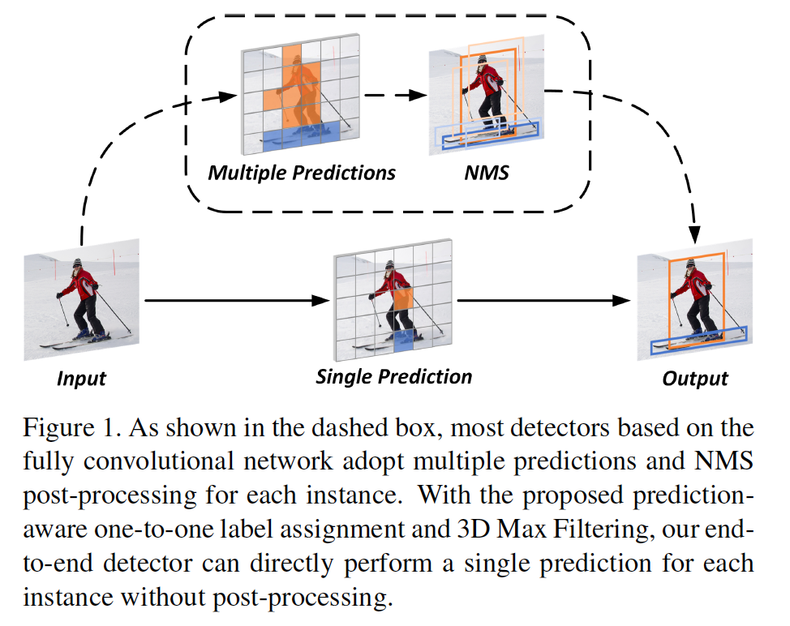

​		本文中，我们尝试在两个维度回答这个问题，即标签分配和网络架构。如图1所示，大多数全卷积检测器[20、42、46、19]采用一对多的标签分配规则，即将分配多个预测作为一个ground-truth实例的前景样本。这种规则提供足够的前景样本，以获得强壮而鲁棒的特征表示。然而，大量的前景样本导致单个实例的重复预测框，从而阻止了端到端检测。为了证明它，我们首先给出已有的不同手工设计的标签分配的经验比较。我们发现一对一的标签分配在消除重复移除之类的后处理中起着关键作用。然而，在手工设计的一对一分配中仍有一个缺点。固定的分配可能引起模棱两可，并降低特征的辨别性，因为一个实例的预定义区域可能不是训练的最佳选择。为了解决这个问题，我们提出一种预测感知的一对一（prediction-aware one-to-one）标签分配，其同时根据分类和回归的质量动态调整前景样本。

​		此外，对于现代的基于FPN的检测器[42]，已有的实验证明重复边界框主要来自跨相邻尺度上的最置信预测的附近区域。因此，我们设计了3D Max Filtering（3DMF），其可以嵌入到FPN头部作为一个可微的模块。该模块使用简单的跨相邻尺度的3D最大滤波操作，在局部区域中提高卷积的辨别性。此外，为了提供足够的特征表示学习的监督，我们修改一对多的分配作为一种辅助损失。

​		利用所提出的技术，我们的端到端检测框架获得与许多最佳检测器相竞争的性能。在COCO数据集上，我们的基于FCOS框架和ResNeXt-101骨干的端到端检测器比具有NMS的检测器好1.1% mAP。进一步地，我们的端到端检测器对于拥挤场景更鲁棒和灵活。为了证明在拥挤场景中的优越性，我们在CrowdHuman[33]数据集上构建了更多实验。在ResNet-50骨干下，相对具有NMS的FCOS基线，我们的端到端检测器增加3.1% $AP_{50}$和5.6% mMR。

### 2. 相关工作

#### 2.1. 全卷积目标检测器

​		归功于卷积网络的成功，在过去十年，目标检测已获得巨大进步。现代一阶段或两阶段检测器严重依赖锚或基于锚的提议。在这些检测器中，锚框由预定义的滑动窗口组成，其被分配具有边界框偏移的前景或背景样本。由于手工设计和独立于数据的锚框，基于锚框的检测器的训练目标通常是次优的，并需要仔细调整超参数。最近，通过引入无锚框架，FCOS[42]和CornerNet[16]给出全卷积检测器的不同观点。这些方法提供具有少手工超参数的更简单、更灵活的检测流水线，其在一些挑战数据集上，被证明出有效性。然而，这些框架仍需要手工设计的后处理来进行重复删除，即NMS。由于NMS是启发式方法，并且为所有实例采用一个常量阈值，所以需要仔细调整NMS，并且可能不是鲁棒的，特别是在拥挤场景中。相比之下，基于无锚框架，本文提出一种针对分类的预测感知的一对一分配规则来丢弃不可训练的NMS。

#### 2.2. 端到端的目标检测器

​		为了获得端到端检测，在之前的文献中探索了许多方法。具体来说，在更早的研究中，许多际遇循环神经网络的检测框架[39、31、23、28、32]尝试直接产生一组边界框。尽管它们在原则上允许端到端学习，但仅在一些小型数据集上证明了它们的有效性，而没有违背现代基准[42、7]。同时，Learnable NMS[11]通过使用非常深和复杂的网络来学习重复删除，其获得与NMS相当的性能。但是，它通过离散的组件构建，并且没有给出一种有效的解决方案来实现端到端学习。最近，关系网络[12]和DETR[3]使用注意力机制进行目标检测，其建模不同预测之间的逐对关系。通过使用一对一分配规则和直接集损失，它们不需要任何额外的后处理步骤。然而，当进行大量预测时，这些方法可能需要极昂贵的成本，使得它们不适合密集预测框架。由于缺乏图像鲜艳和多尺度融合机制，DETR也遭遇远远长于主流检测器的训练时间，同时在小目标上的检测性能更低。与上述方法不同，我们的方法是第一个保证基于全卷积网络的端到端的目标检测器。

### 3. Methodology

#### 3.1. 分析标签分配

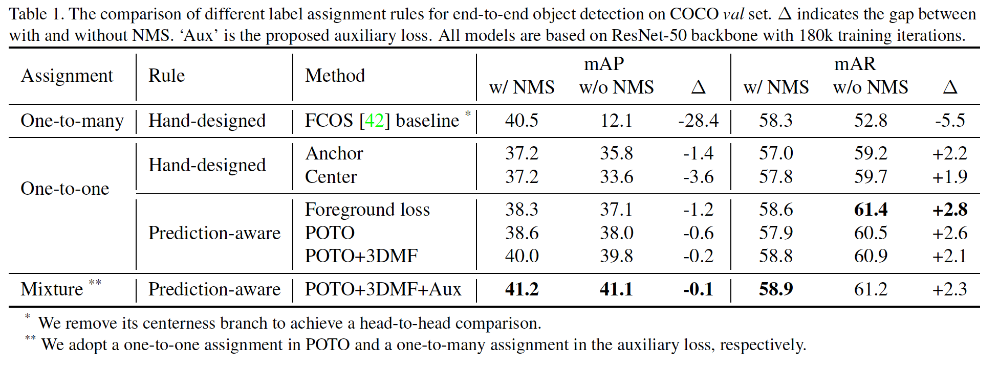

​		为了反映标签分配在端到端目标检测中的影响，在COCO数据集上，我们构建几种传统标签分配的消融研究。如表1所示，所有实验都是基于FCOS框架，它的centerness分支被移除以获得head-to-head的比较。这种结果证明在特征表示上一对多的优势，以及在丢弃NMS上一对一分配的潜力。以下各节将详细分析。

##### 3.1.1 One-to-many Label Assignment

​		由于NMS后处理被广泛用于密集预测框架[19、20、52、48、42、46]，一对多的标签分配成为分配训练目标的常用方法。充足的样本产生强壮而鲁棒的特征表示。然而，当丢弃NMS时，由于一对多标签分配的冗余前景样本，重复的假阳性预测可能引起剧烈的性能下降，例如FCOS基线上下降28.4%mAP。因此，仅依赖一对多的分配，检测器难以获得竞争性的端到端检测。

##### 3.1.2 Hand-designed One-to-one Label Assignment

​		MultiBox[41]和YOLO[26]证明了在将一对一标签分配用于密集检测框架中的潜力。本文中，我们评估了两个一对一的标签分配规则，以揭示其与丢弃NMS的关系。通过两个广泛使用的一对多标签分配来修改这些规则：Anchor Rule和Center Rule。具体来说，Anchor Rule时基于RetinaNet[20]，每个ground-truth实例仅被分配到具有最大IoU的锚。Center Rule基于FCOS[42]，在预定义的特征层中，每个ground-truth实例仅被分配与实例中心最接近的像素。此外，其他锚或像素被设置为背景样本。

​		如图1所示，与一对多的标签分配相比，一对一标签分配允许没有NMS的全卷积检测器，从而极大地减少有NMS和无NMS之间的差异，并获得合理的性能。例如，基于Center规则的检测器比FCOS基线增加21.5%mAP。此外，由于一对一的标签分配避免复杂场景中NMS的错误抑制，所以召回率得到进一步增加。然而，仍存在两个未解决的问题。第一，当使用一对一标签分配时，有NMS和无NMS检测器之间的性能差异仍不能忽略。第二，由于每个实例缺少抑制，一对一标签分配仍比FCOS基线差。

#### 3.2. 我们的方法

​		本文中，为了确保竞争性的端到端目标检测，我们提出一种混合标签分配和新的3D Max Filtering（3DMF）。混合标签分配有所提出的Prediction-aware one-to-one（POTO）标签分配和修改的一对多标签分配（辅助损失）组成。利用这些技术，我们的端到端框架可以丢弃NMS后处理，并保持强壮的特征表示。

##### 3.2.1 Prediction-aware One-to-one Label Assignment

​		手工设计的一对一标签分配遵循一种固定规则。然而，在复杂场景中，这种规则可能是最优的，例如对于偏心目标的Center规则。因此，如果强制分配过程将次优预测分配为唯一的前景样本，则网络收敛的难度可能会大大增加，从而导致更多的假阳性预测。为此，我们提出一种称为Prediction-aware One-To-One（POTO）标签分配，其根据预测质量动态分配样本。

​		令$\Psi$表示所有预测的索引集。$G$和$N$分别对应ground-truth实例和预测的数量，在密集预测中，通常有$G \ll N$。$\hat{\pi} \in \prod_G^N$表示$N$个预测的$G$个排列。我们的POTO旨在生成预测的合适排列$\hat{\pi}$作为前景样本。训练损失如式（1），其包含前景损失$\mathcal{L}_{fg}$和背景损失$\mathcal{L}_{bg}$：

$$\mathcal{L} = \sum_{i}^G \mathcal{L}_{fg}(\hat{p}_{\hat{\pi}(i)}, \hat{b}_{\hat{\pi}(i)}|c_i,b_i) + \sum_{j \in \Psi/\mathcal{R}(\hat{\pi})}\mathcal{L}_{bg}(\hat{p}_j),\tag{1}$$

其中$\mathcal{R}(\hat{\pi})$表示已分配的前景样本的相应索引集。对于第$i$个ground-truth，$c_i$和$b_i$分别为类标签和边界框坐标。同时，对于第$\hat{\pi}(i)$个预测，$\hat{p}_{\hat{\pi}(i)}$和$\hat{b}_{\hat{\pi}(i)}$分别对应其预测分类得分和预测边界框坐标。

​		为了获得竞争性的端到端检测，我们需要找出合适的标签分配$\hat{\pi}$。如式（2），以前的工作[6、3]通过使用前景损失[20、30]作为匹配成本将其视为二分匹配问题，可以通过匈牙利算法[39]快速解决：

$$\hat{\pi} = \arg\min_{\pi \in \prod_G^N}\sum_i^G\mathcal{L}_{fg}(\hat{p}_{\hat{\pi}(i)}, \hat{b}_{\hat{\pi}(i)}|c_i,b_i).\tag{2}$$

然而，前景损失通常需要额外的权重来缓解优化问题，例如不平衡的训练样本和多任务联合训练。如表1所示，这种特性使训练损失不是匹配成本的最优成本。因此，如式（2）和式（4），我们提出一种更干净而有效的方式（POTO）来寻找更好的分配：

$$\hat{\pi} = \arg\max_{\pi \in \prod_G^N} \sum_i^G Q_{i,\pi(i)},\tag{3}$$

其中

$\begin{align}Q_{i,\pi(i)} =& \underbrace{\mathbb{1}[\pi(i)\in\Omega_i]}_{\mbox{spatial prior}}\cdot \underbrace{\big(\hat{p}_{\pi(i)}(c_i)\big)^{1-\alpha}}_{classification} \cdot \\&\underbrace{\big(\mbox{IoU}(b_i,\hat{b}_{\pi(i)})\big)^{\alpha}}_{\mbox{regression}}\end{align}.\tag{4}$

这里，$\Q_{i,\pi(i)}\in [0,1]$表示第$i$个ground-truth与第$\pi(i)$个预测的所提出的匹配质量。它同时考虑空间先验、分类置信度和回归质量。$\Omega_i$表示第$i$个ground-truth的候选预测集，即空间先验（spatial prior）。训练阶段广泛使用空间先验[19、20、52、48、42、46]。例如，FCOS采用中心采样策略，其仅ground-truth实例中央部分的预测作为前景样本。我们也在POTO中使用它以获得更高的性能，但是它不是丢弃NMS的必需的（更多细节见4.2.2节）。为了获得平衡，我们通过式（4）中的分类得分$\hat{p}_{(\pi(i))}(c_i)$和回归质量$\mbox{IoU}(b_i, \hat{b}_{\pi(i)})$的加权几何平均。超参数$\alpha \in [0,1]$调整分类和回归之间的比例，其中默认使用$\alpha = 0.8$，更多消融研究在4.2.2节中介绍。如表1所示，POTO不仅弥补NMS的差距，还提高性能。

##### 3.2.2 3D Max Filtering

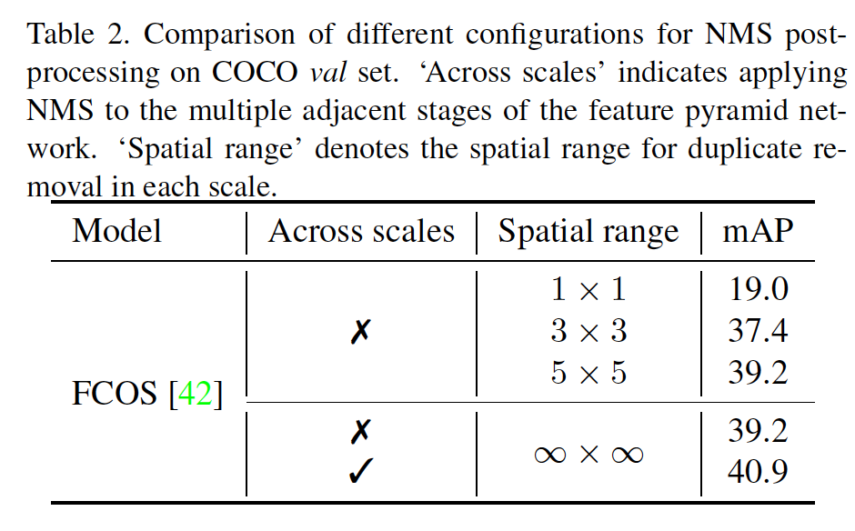

​		除了标签分配，我们还尝试设计一种高效架构来实现更竞争性的端到端检测。为此，我们首先描述重复预测的分布。如表2所示，对于基于FPN的现代检测器[42]，当将NMS单独用于每个尺度时，性能明显下降。此外，我们发现重复的预测主要来自最置信预测的相邻空间区域。因此，我们提出一种新的模块（称为3D Max Filtering（3DMF））来抑制重复预测。

​		卷积是具有平移不变性的线性运算，可在不同位置为相似模式产生相似输出。然而，这种特性是重复移除的极大障碍，由于，对于密集预测检测器，相同实例的不同预测通常有相似的特征[20]。Max filter是一种基于排名的非线性滤波器[38]，在局部区域中，其可以用于补偿卷积的辨别能力。此外，max filter已被用于基于关键点的检测器（例如CenterNet和CornerNet）作为新的后处理来替换NMS。它表现出重复移除的一些潜力，但是不可训练的形式妨碍效率和端到端训练。同时，max filter仅考虑单尺度特征，其不适合广泛使用的基于FPN检测器[20、42、46]。

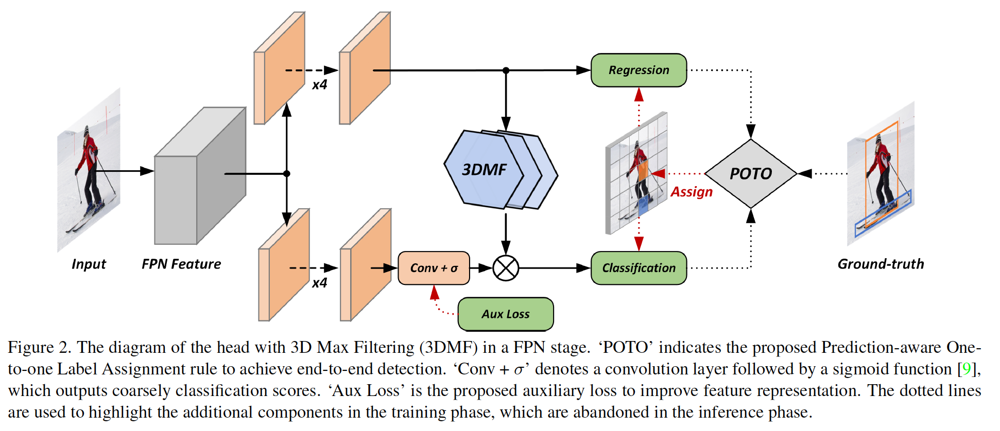

​		因此，我们将max filter扩展到多尺度版本（称为3D Max Filtering），其在FPN的每个尺度变换特征。3D Max Filtering分别用于特征图的每个通道：

$$\tilde{x}^s = \Big\{\tilde{s}^{s,k}:=\mbox{Bilinear}_{x^s}(x^k)|\forall k \in \big[s-\frac{\tau}{2}, s + \frac{\tau}{2}\big]\Big\}.\tag{5}$$

具体而言，如式（5）所示，给定FPN中尺度$s$的输入特征$x^s$，我们首先采用双线性算子，将$\tau$个相邻尺度的特征插值为输入特征$x^s$的相同大小：

$$y_i^s = \max_{k \in [s - \frac{\tau}{2},s+\frac{\tau}{2}]} \max_{j \in \mathcal{N}_i^{\phi \times \phi}}\tilde{x}_j^{s,k}.\tag{6}$$

如式（6）所示，对于尺度$s$中的空间位置$i$，然后，在具有$\tau$个尺度和$\phi \times \phi$的空间距离的预定义3D相邻立方体中获得最大值$y_i^s$。这种操作可由高效的3D max-pooling算子[24]轻松实现。

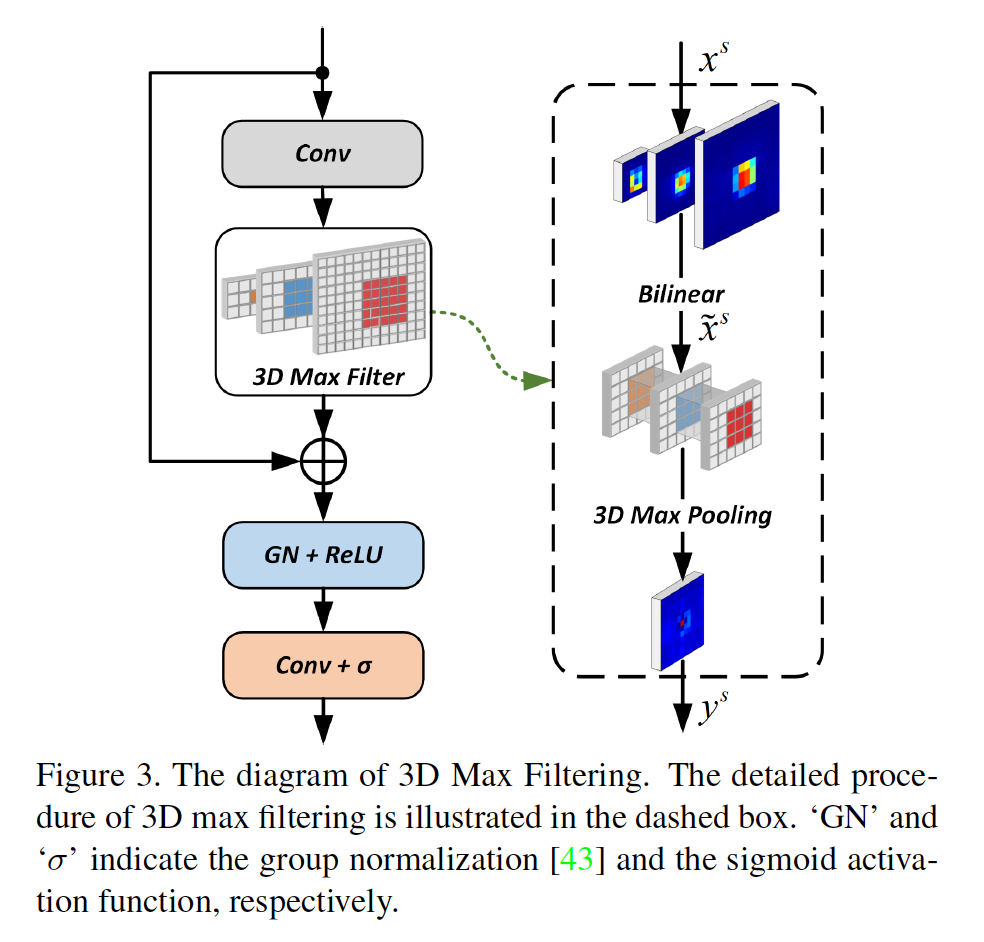

​		进一步，为了将3D Max Filtering嵌入到已有的框架，并确保端到端训练，我们提出一种新的模块，如图3所示。在局部区域中，这种模块利用max filtering来选择具有最高激活值的预测，并可以提高与其他预测的区别，其在4.2.1节中被进一步验证。归功于这种特性，如图2所示，我们采用3DMF来精炼粗糙的密集预测，并抑制重复预测。此外，通过简单的可微算子构建所有模块，并仅有轻微的计算开销。

##### 3.2.3 Auxiliary Loss

​		此外，当使用NMS时，如表1所示，POTO和3DMF的性能仍次于FCOS基线。这种现象可以归功于这样的事实：一对一标签分配可以提供更少的监督，使网络难以学习强壮和鲁棒的特征表示[40]。它进一步减少分类的辨别能力，因此引起性能上的衰减。为此，受许多先前工作的启发[40、49、50]，我们引入基于一对多的标签分配的辅助损失来提供足够的监督，如图2所示。

​		与ATSS[46]相似，我们的辅助损失采用具有改进的一对多标签分配的focal loss[20]。具体而言，首先，根据式（4）中提出的匹配质量，一对多标签分配选择前9个预测作为每个FPN阶段的候选。然后，分配候选作为前景样本，这些样本的匹配质量超过统计阈值。通过阈值通过所有候选匹配质量的均值和标准差之和计算。此外，辅助损失的一对多标签的不同形式在补充材料中详细报告。

### 4. 实验

​		本节中，才COCO和CrowdHuman数据集上，我们构建几项实验和可视化。

#### 4.1 实现细节

​		与FCOS[42]相同，我们的检测器采用一对包含4个卷积的头部分别进行分类和回归。3DMF中第一个卷积和第二个卷积侧输出通道分别为256和1。所有骨干在ImageNet上预训练，并冻结批归一化。在训练阶段，调整输入图像使得他们的较短边为800像素。所有训练超参数与Detectron2[44]的2倍调度相同。具体而言，我们冻结骨干中前两个阶段的参数，并微调网络余下部分。所有实验在8张GPU上训练，每张GPU两张图像，共迭代180K，同时使用多尺度训练。学习率最初设置为0.01，然后在120K和160K迭代时减小10倍。我们使用同步的SGD来优化所有模型，权重衰减为0.0001、动量为0.9。此外，在Tesla V100 GPU上报告运行时。

#### 4.2 Ablation Studies on COCO

##### 4.2.1 可视化

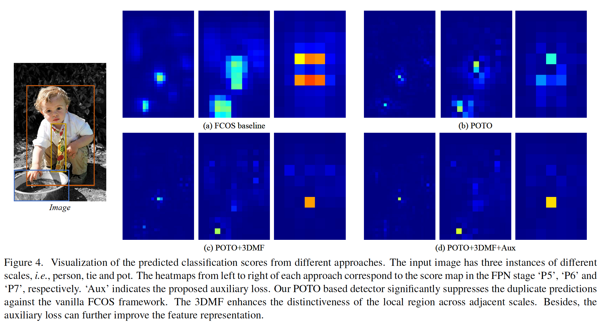

​		如图4所示，我们从FCOS基线和我们提出的框架中展示了分类得分的可视化。对于单个实例，具有一对多分配规则的FCOS基线输出大量重复预测，其被高度激活，并与最置信的一个由相当的激活得分。这些重复预测被评估为假阳性样本，并很大程度上影响性能。相比之下，通过使用所提出的POTO规则，重复样本的的得分明显得到抑制。此属性对于检测器无需NMS即可实现直接边界框预测至关重要。更多地，利用所提出的3DMF模块，这种特性得到进一步增强，尤其是最置信预测的相邻区域。此外，由于3DMF模块引入多尺度竞争机制，检测器可以很好地进行跨FPN阶段的唯一预测，例如图4，在不同阶段中，一个实例有一个高度激活得分。

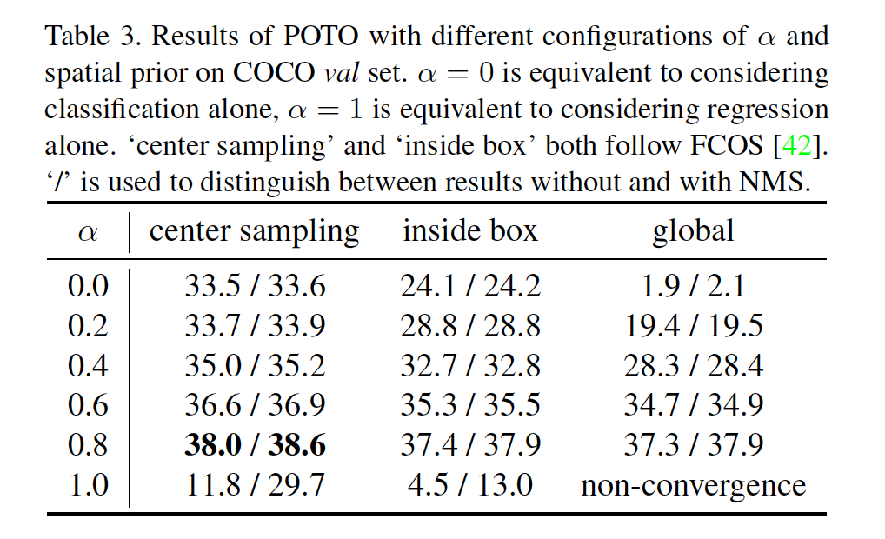

##### 4.2.2 Prediction-Aware One-to-One Label Assignment

**Spatial prior**	如表3所示，对于分配的空间范围，中心采样策略相对于COCO数据集上的内部框和全局策略要优越。它反映出图像的先验知识在现实世界中至关重要。

**Classification vs. regression**	如式（4）所示，超参数$\alpha$控制分类和回归之间重要性的比例。如表3报告，当$\alpha=1$时，与NMS的差距并未缩小。这可能归因于分类和回归的最佳位置之间的不一致。当$\alpha = 0$时，分配规则仅依赖预测的分配得分。在这种条件下，与NMS的差距相当大程度上被消除，但是绝对性能仍不能满足，其可由过拟合次优的初始化引起。相比之下，利用合适的分类和回归质量的融合，绝对性能得到显著改善。

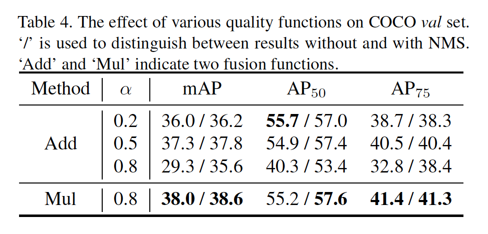

**Quality function**	我们进一步探索质量函数上不同融合方法的影响，即式（4）。如表4所示，称为“Add”的方法通过$(1 - \alpha)\cdot \hat{p}_{\pi(i)}(c_i) + \alpha\cdot\mbox{IoU}(b_i,\hat{b}_{\pi(i)})$替换原始的质量函数，其与[17]有相似的形式。然而，我们发现乘法融合（即“Mul”）更适合端到端检测，其获得比“Add”融合方法高0.7%mAP。

##### 4.2.3 3D Max Filtering

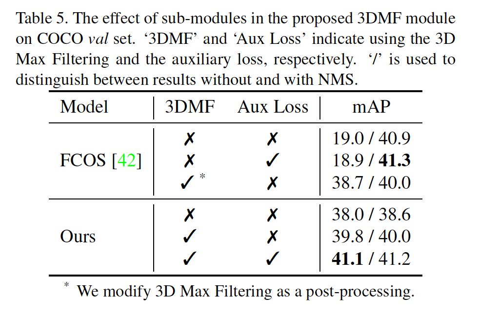

**Components**	如表5所示，没有NMS后处理，具有POTO的端到端检测器获得比原始FCOS高1.9%mAP。通过使用所提出的3DMF，性能进一步增加1.8%mAP，并且与NMS的差距缩小到0.2%mAP。如图4所示，结果表明，多尺度和局部范围抑制对于端到端目标检测至关重要。所提出的辅助损失给出足够的监督，使我们的检测器获得与具有NMS的FCOS相当的性能。

**End-to-end**	为了证明端到端训练形式的优越性，我们将3D Max Filtering替换为CenterNet [5]的2D Max Filtering，将其作为用于重复删除的新后处理。这种后处理进一步用于FCOS检测器。如表5所示，端到端方式的绝对收益提高了1.1％。

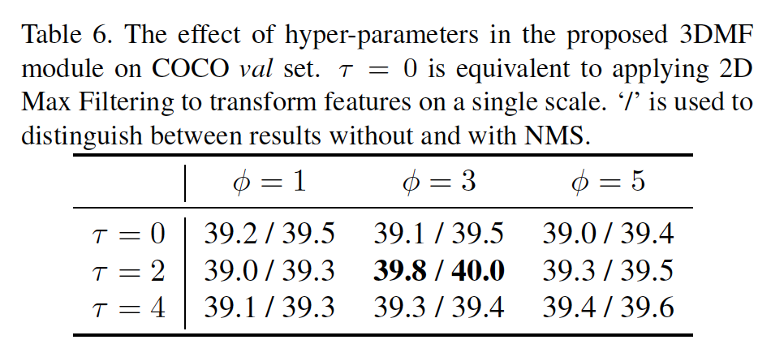

**Kernel size**	如表6所示，我们评估3DMF中不同的空间范围$\phi$和尺度范围$\tau$的设置。当$\phi=3$和$\tau=2$时，我们的方法在COCO数据集上获得最高性能。这种现象反映重复预测主要来自跨相邻尺度的局部区域，其与3.2.2节中观察的相似。

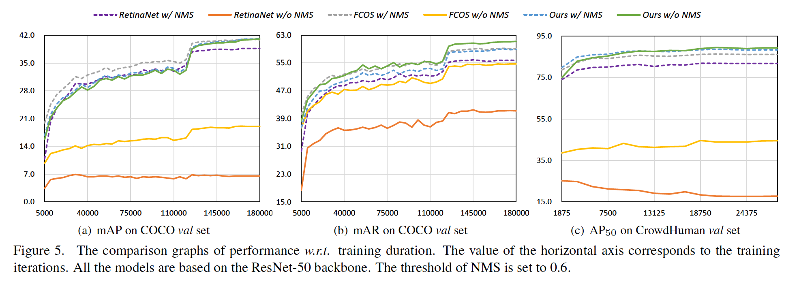

**Performance w.r.t training duration**	如图5（a）所示，在开始时，我们的端到端检测器的COCO val上的性能比具有NMS的检测器差。随着训练的进行，性能差距变得越来越小。在180k训练迭代后，我们的方法最后比具有NMS的其他检测器好。这种现象也在CrowdHuman验证集上发生，其如图5（c）所示。此外，由于手工设计的后处理的移除，图5（b）展示了我们的方法在召回率方面优于基于NMS的方法。

##### 4.2.4 Larger Backbone

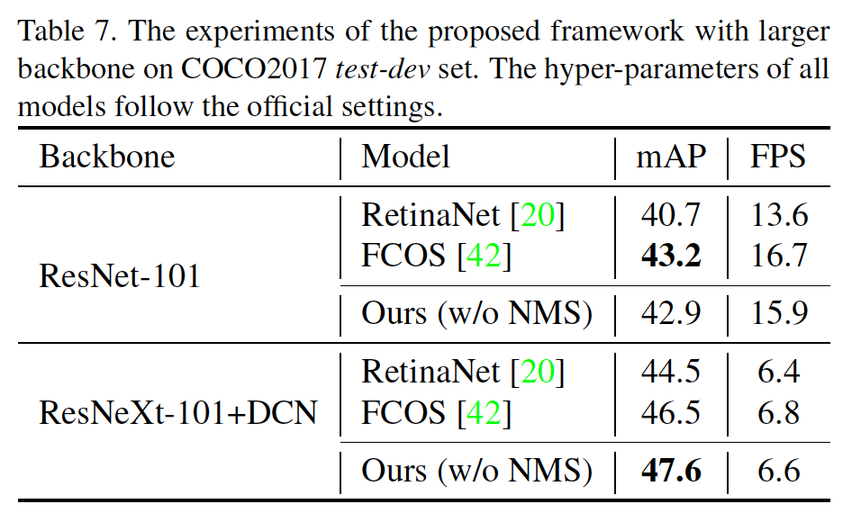

​		为了进一步证明我们的方法的鲁棒性和有效性，我们提供更大骨干的实验。详细结果见表7。具体而言，当使用ResNet-101作为骨干时，我们的方法比FCOS差0.3%mAP。但是，当引入更强的骨干，即具有可变形卷积的ResNeXt-101，我们的端到端检测器比具有NMS的FCOS高1.1%mAP。这可能是由于可变形卷积的灵活空间建模。此外，所提出的3DMF是有效的，并易于实现。如表7所示，与使用NMS的基线检测器相比，我们的3DMF模块的计算开销很小。

#### 4.3. Evaluation on CrowdHuman

​		我们在CrowdHuman数据集上评估我们的方法，其为具有不同种类遮挡的大型人体检测数据集。与COCO数据集相比，CrowdHuman有更复杂和拥挤的场景，这给常规重复项删除带来了严峻挑战。我们的端到端检测器在拥挤场景更鲁棒和灵活。如表8和图5所示，我们的方法明显好于几项具有NMS的最佳检测器，例如比FCOS好3.1%mAP和5.6%mMR。此外，我们的方法的召回率甚至好于具有NMS的ground-truth边界框。

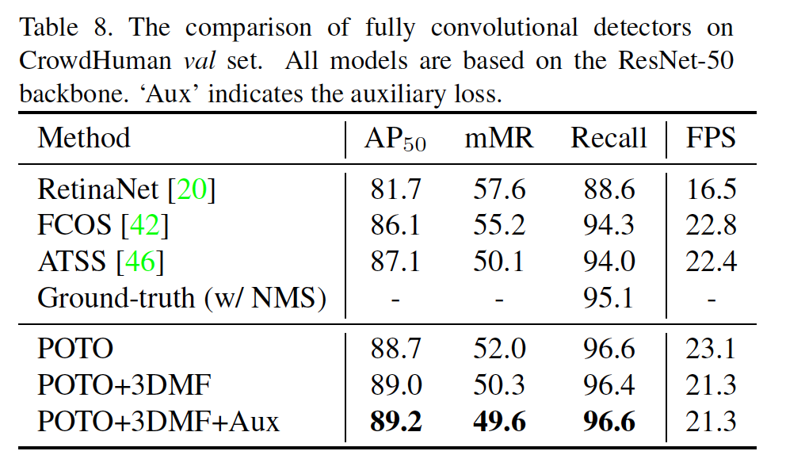

### A. Auxiliary Loss

​		本节中，我们为辅助损失评估不同的一对多的标签分配规则。详细实现描述如下：

**FCOS**	我们采用FCOS中的分配规则。

**ATSS**	我们采用ATSS中的分配规则。

**Quality-ATSS**	规则在3.2.3节中描述。

**Quality-FCOS**	与FCOS相似，将给特定FPN阶段中预定中央区域的像素分配给每个ground-truth实例。但是根据所提出的质量选择特定的FPN阶段，而不是实例大小。

**Quality-Top-$k$**	在所有FPN阶段中，每个真实实例被分配给具有前$k$个最高质量的像素。我们选择$k=9$，以与其他规则对齐。

​		如表9所示，结果证明了我们提出的预测感知质量功能优于手工设计的匹配指标。与标准的ATSS框架相比，基于质量规则可以获得1.3%mAP增益。

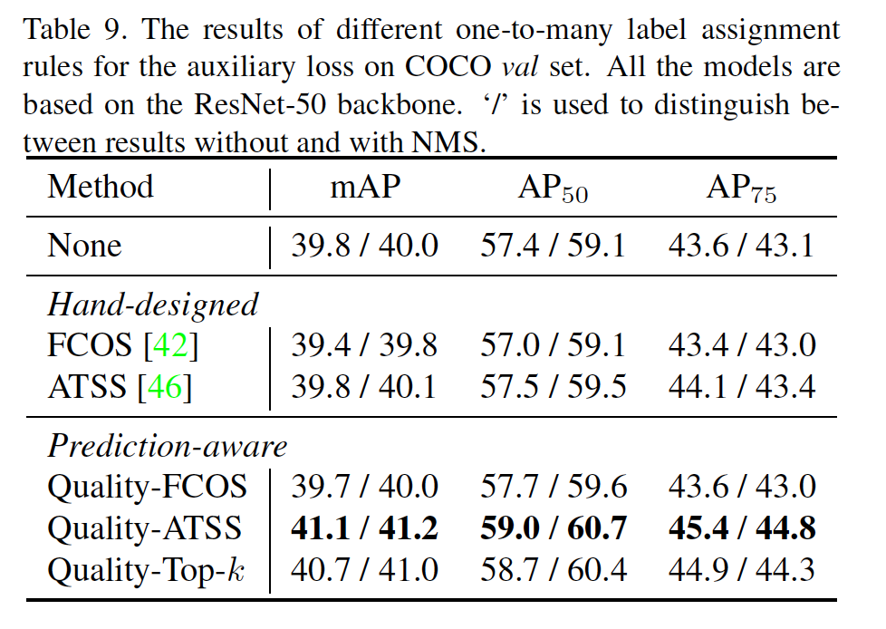