### Deformable Convolutional Networks

#### 摘要

​		由于卷积神经网络构建模块中的固定几何结构，其对于模型的几何变换有着本质上的局限。在这项工作中，我们引入两个新的模块来增强CNN的变换建模能力，这两个模块是可变形卷积和可变形RoI池化。两者都基于以下想法：在模块中增加额外偏移量的空间采样位置，并从目标任务中学习偏移量，而无需额外的监督。新模块可以轻松替换现有CNN中的普通模块，并且可以通过标准反向传播轻松进行端到端训练，从而产生可变形的卷积网络。广泛的实验验证了我们方法的性能。第一次，我们表明在深层CNN中学习密集的空间变换对于复杂的视觉任务（例如对象检测和语义分割）有效。

#### 1. 引言

​		视觉识别的一个关键挑战是如何容纳几何变化或者建模在目标尺度、字塔、视角和部分形变上的几何变化。一般而言，有两种方式。一个是构建具有充足变化的训练数据集，这通常通过已有的数据采样（例如仿射变换）来增强。从这些数据中可以学习鲁棒性的表示，但是通常具有昂贵的训练成本和复杂的模型参数。另一个是使用平移不变的特征和算法。这类方法包含许多已知的技术，例如SIFT和基于滑动窗口的目标检测范例。

​		上述方法有两个缺点。第一，几何变换假定是固定和已知的。如此的先验知识用于增强数据，并设计特征和算法。这一假设妨碍了设计未知几何变换的新任务的泛化，这些任务未能很好的建模。其次，对于过于复杂的变换，即使已知，不变的特征和算法的手工设计也可能是困难的或不可行的。

​		最近，卷积神经网络在视觉识别任务（例如图像分类、语义分割和目标检测）上获得显著的成果。然而，它们仍然具有上述两个缺点。它们建模几何变换的能力主要来自广泛的数据增强、大型建模能力和一些简单的手工模块（例如小型平移不变的最大池化）。

​		简而言之，简而言之，CNN对于大型未知变换的建模具有固有的局限。这种局限源自CNN模块的固定的几何结构：**卷积单元采样固定位置的输入特征图、池化层以固定比例减少空间分辨率、RoI池化层将RoI分割为固定的空间bins等**。它们缺少内部机制来处理几何变换。这引起值得注意的问题。例如，相同卷积层的所有几何单元的感受野是相同的。对于在空间位置上编码语义的高级CNN层，这是不希望的。**因为不同的位置可能对应不同尺度或形变的目标，对于具有精细定位的视觉识别，例如使用全卷积网络的语义分割[41]，期望获得尺度或感受野大小的自适应确定。再举一个例子，尽管近来物体检测取得了显着且快速的进展[16、52、15、47、46、40、7]，但所有方法仍依赖于基于原始边界框的特征提取。这显然不是最佳选择，尤其是对于非刚性物体。

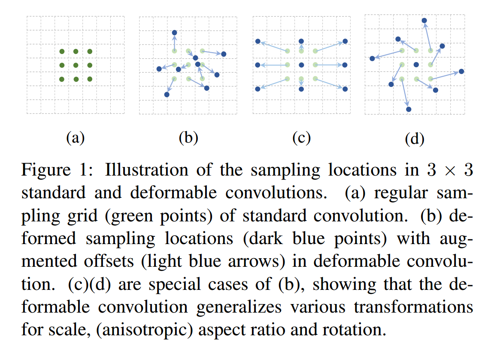

​		这项工作中，我们引入两个新模块，其极大地增强了CNN建模几何变换的能力。第一个是_可变形卷积_。它将2D偏移添加到标准卷积的规则网格采样位置。它可以使采样网格自由变形。如图1所示。偏移通过额外的卷积层从之前的特征图上学习。因此，变形是以局部、密集和自适应的方式建立在输入特征之上的。

​		第二个是_可变形RoI池化_。它为先前的RoI池化[15，7]的常规bin分区中的每个bin位置添加了偏移量。相似地，从之前的特征图和RoI中学习偏移，从而可以对具有不同形状的目标进行自适应部件定位。

​		两个模块都具有轻量权重。在偏移学习中添加了少量参数和计算。他们可以很容易地替换深层CNN中的普通副本，并且可以通过标准反向传播轻松地进行端到端的训练。产生的CNN称为_deformable convolutional networks_或者_deformable ConvNets_。

​		我们的方法与spatial transform networks和可变形组件模型有着相似的高级思想。它们都具有内在变换参数，并从数据中学习纯粹的学习如此参数。deformable ConvNets的一个关键不同之处是，它们以简单、有效、深度和端到端的方式处理密集空间变换。在3.1节中，我们详细讨论我们的工作与先前工作的关系，并分析deformable ConvNets的优越性。

#### 2. Deformable Convolutional Networks

​		CNN中的特征图和卷积是3D的。可变形卷积和RoI池化模块在2D空间域上执行。在整个通道范围内，该操作保持不变。不失一般性，为了清楚起见，此处以2D模式描述了模块。 扩展到3D很简单。

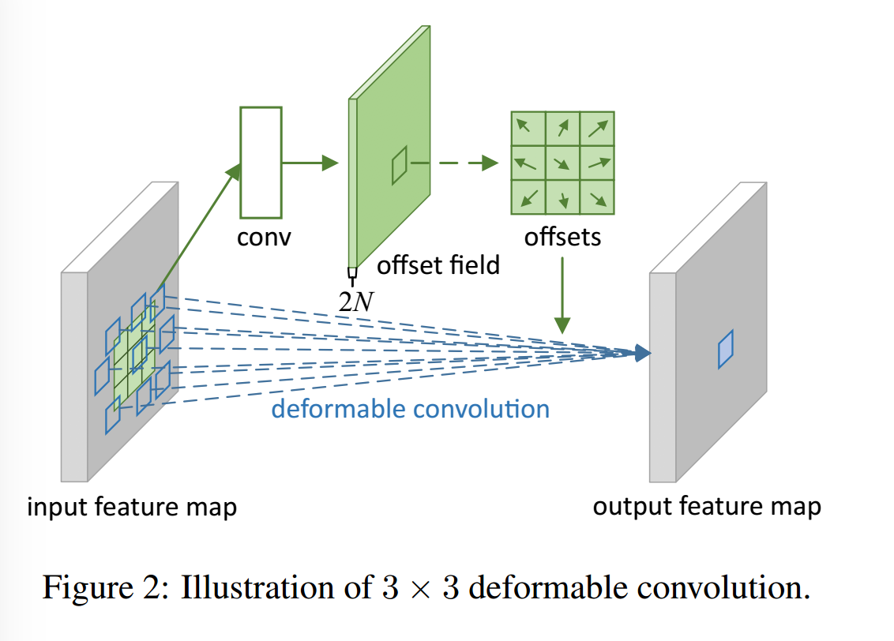

##### 2.1. Deformable Convolution

​		2D卷积包含两部：1）在特征图$\mathbf{x}$使用规则的网格$\cal{R}$采样；2）求由$\mathbf{w}$加权采样值之和。网格$\cal{R}$定义感受野大小和膨胀。例如，

$$\cal{R}=\{(-1,-1), (-1, 0), \cdots, (0, 1), (1, 1)\}$$

定义了一个膨胀率为1的$3\times3$核。

​		对于输出特征图$\mathbf{y}$上的每个位置$\mathbf{p}_0$，有

$$\mathbf{y}(\mathbf{p}_0)=\sum_{\mathbf{p}_n \in \cal{R}}\mathbf{w}(\mathbf{p}_n)\cdot\mathbf{x}(\mathbf{p}_0+\mathbf{p}_n), \tag{1}$$

其中$\mathbf{p}_n$列举了$\cal{R}$中的位置。

​		在可变形卷积中，规则网格$\cal{R}$使用偏移$\{\Delta \mathbf{p}_n|n=1,\cdots,N\}$增强，其中$N=|\cal{R}|$。等式（1）变为

$$\mathbf{y}(\mathbf{p}_0)=\sum_{\mathbf{p}_n \in \cal{R}}\mathbf{w}(\mathbf{p}_n)\cdot\mathbf{x}(\mathbf{p}_0+\mathbf{p}_n + \Delta \mathbf{p}_n), \tag{2}$$

​		现在，在非规则和偏移位置$\mathbf{p}_n+\Delta \mathbf{p}_n$上采样。由于偏移$\Delta \mathbf{p}_n$通常是分数，等式（2）通过双线性插值实现为

$$\mathbf{x}(\mathbf{p})=\sum_{\mathbf{q}}G(\mathbf{q,p})\cdot \mathbf{x(q)},\tag{3}$$

其中$\mathbf{p}$表示等式（2）中的任意（小数）位置（$\mathbf{p_0} + \mathbf{p}_n + \Delta \mathbf{p}_n$），$\mathbf{q}$枚举了特征图$\mathbf{x}$中所有的整数空间位置，而$G(\cdot,\cdot)$是双线性插值核。注意$G$是二维的，它可分离为两个一维核的乘积：

$$G(\mathbf{q,p})=g(q_x,p_x) \cdot g(q_y, p_y), \tag{4}$$

其中$g(a,b)=max(0, 1-|a-b|)$。由于$G(\mathbf{q,p})$尽在少量的$\mathbf{q}$处非零，所以公式（3）可以快速计算。

​		如图2所示，在相同输入特征图上应用卷积层获得偏移。卷积核与当前卷积层具有相同的空间分辨率和膨胀率（例如图2中的膨胀为1的$3\times 3$）。输出偏移与输入特征有相同的空间分辨率。通道维度$2N$对应$N$个2D偏移。训练期间，两个卷积核同时生成输出特征图和偏移。为了学习偏移，梯度通过公式（3）和公式（4）的双线性操作反向传播，细节见附录A。

##### 2.2. Deformable RoI Pooling

​		RoI池化用于所有基于区域提议的目标检测方法。它将输入的任意大小的矩形区域转换为固定尺寸的特征。

​		**RoI Pooling**  给定输入特征图$\mathbf{x}$、大小为$w \times h$的RoI和左上角$\mathbf{p}_0$，RoI池化将RoI划分为$k \times k$（$k$为自由参数）bin，并输出$k \times k$的特征图$\mathbf{y}$。对于第$(i,j)$个bin（$0\le i, j < k$），有

$$\mathbf{y}(i,j)=\sum_{\mathbf{p}\in bin(i,j)}\mathbf{x}(\mathbf{p}_0 +\mathbf{p}) / n_{ij}, \tag{5}$$

其中$n_{ij}$为bin中的像素数。第$(i,j)$个bin跨越$\lfloor i\frac{w}{k}\rfloor \le p_x < \lceil (i+1)\frac{w}{k} \rceil$以及$\lfloor j \frac{h}{k}\rfloor \le p_y < \lceil (j+1)\frac{h}{k} \rceil$。

​		与公式（2）相似，在可变形RoI池化中，将偏移$\{\Delta \mathbf{p}_{ij}|0 \le i, j < k\}$添加到空间bin位置。公式（5）变为

$$\mathbf{y}(i,j)=\sum_{\mathbf{p}\in bin(i,j)} \mathbf{x}(\mathbf{p}_0 + \mathbf{p} +\Delta \mathbf{p}_{ij})/n_{ij}. \tag{6}$$

通常，$\Delta \mathbf{p}_{ij}$为小数。公式（6）通过公式（3）和（4）的双线性插值实现。

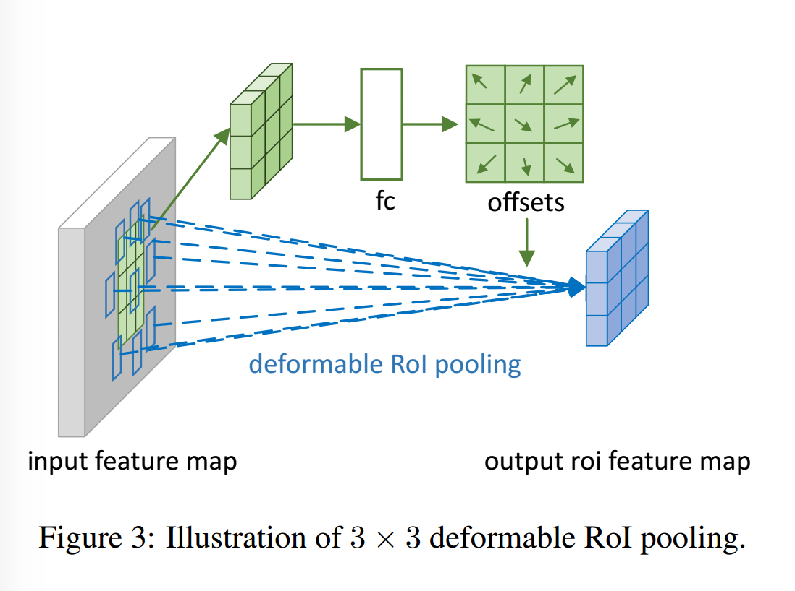

​		图3展示了如何获得偏移。首先，RoI池化（公式（5））生成池化的特征图。根据特征图，使用全连接层生成_归一化_的偏移$\Delta \mathbf{\hat{p}}_{ij}$，其然后通过与RoI的宽和高进行逐元素乘法而被转换为公式（6）中的偏移$\Delta \mathbf{p}_{ij}$，即$\Delta \mathbf{p}_{ij}=\gamma \cdot \Delta \mathbf{\hat{p}}_{ij} \circ (w, h)$。这里$\gamma$为修正偏移程度的预定义的标量。根据经验设置为$\gamma = 0.1$。偏移量归一化对于使偏移量学习对于RoI大小不变是必要的。全连接层通过反向传播学习，细节见附录A。

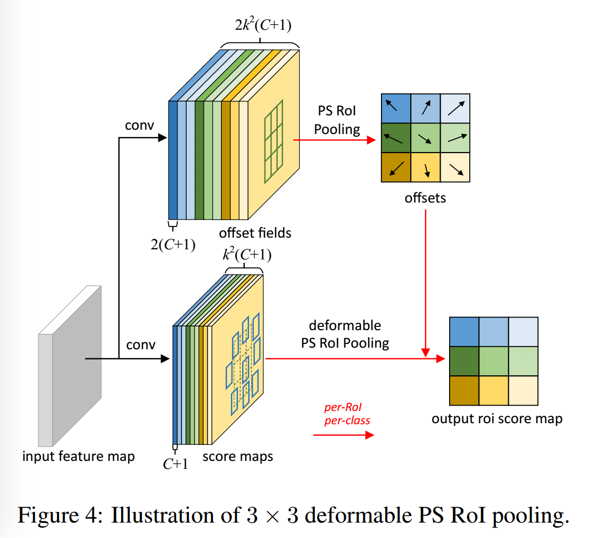

​		**Position-Sensitive (PS) RoI Pooling**  它是全卷积的，并与RoI池化不同。通过一个卷积层，首先将所有的输入特征图转换为每个类（对于$C$个目标类，共计$C+1$）的$k^2$个特征图，如图4的下分支所示。无需区分类别，这个类的得分图表示为$\{\mathbf{x}_{i,j}\}$，其中$(i,j)$枚举所有bin。在这些得分图上执行池化。通过求和第$(i,j)$个bin对应的特征图$\mathbf{x}_{i,j}$而获得第$(i,j)$个bin的输出值。简而言之，与公式（5）中的RoI池化不同的是一般的特征图$\mathbf{x}$由特定的位置敏感得分图$\mathbf{x}_{i,j}$。

​		在可变形PS RoI池化中，公式（6）仅有的变化是$\mathbf{x}$还修改为$\mathbf{x}_{i,j}$。然而，偏移学习是不同的。它遵循[7]中的“全卷积”精神，如图4所示。在上面的分支中，卷积层生成完整分辨率的偏移场。对于每个RoI（也对于每个类），PS RoI池化用于如此的场以获得_归一化_偏移$\Delta \hat{\mathbf{p}_{ij}}$，其然后以如上述可变形RoI池化相同的方式转换为真实的偏移$\Delta \mathbf{p}_{ij}$。

##### 2.3. Deformable ConvNets

​		可变形卷积和RoI池化模块与它们的朴素版本有相同的输入和输出。因此，它们可以轻易替换已有CNN中的平凡副本。在训练中，这些添加上的用于偏移学习的卷积和全连接层初始化为零。它们的学习率设置为已有层的$\beta$倍（在Faster R-CNN中，默认$\beta=1$，全卷积层中$\beta=0.01$）。反向传播通过公式（3）和（4）中的双线性插值运算来训练它们。产生的CNN称为_deformable ConvNets_。

​		为了将可变形卷积集成到最佳的CNN架构中，我们注意到这些架构包含两个阶段。第一，深度全卷积网络在整个输入图像上生成特征图。第二，一个浅层的任务特定的网络从特征上生成结果。我们在下面详细说明两个步骤。

​		**Deformable Convolution for Features Extraction** 我们采用两个最佳的特征提取架构：ResNet-101和修改的Inception-ResNet。二者都在ImageNet分类数据集上预训练。

​		最初的Inception-ResNet设计用于图像识别。它有特征不对齐问题，并且对于密集预测任务是有问题的。它被修改为修复对齐问题[20]。修改版本称为“Aligned-Inception-ResNet”，详见附录B。

​		对于ImageNet分类，两个模型包含几个卷积块、一个平均池化和1000-way的全连接层。移除平均池化和fc层。添加一层随机初始化的$1\times1$卷积来将通道维度减少到1024。正如常用实践中，将最后一个卷积块中的步幅从32个像素减小16个像素，以增加特征图的分辨率。具体而言，在最后一块的开始之处，将步幅从2改为1（ResNet和Aligned-Inception-ResNet都为“conv5”）。作为补偿，在这个块中所有卷积（核大小大于1）的膨胀率从1改为2。

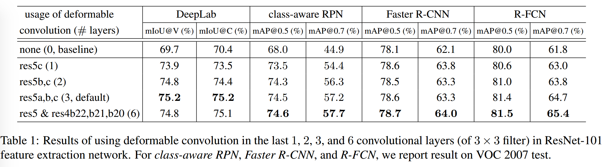

​		可选地，将可变形卷积应用于最后几个卷积层（核大小大于1）。我们利用不同层数的可变形卷积进行实验，并发现3层可变形卷积可以达到不同任务的平衡，如表1所示。

​		**Segmentation and Detection Networks**  在上述特征提取网络的输出特征图上构建一个任务特定的网络。

​		下面，$C$表示目标类的数量。

​		_DeepLab_是语义分割的最佳方法。它将$1\times1$卷积层添加到特征图上以生成$(C+1)$个用于表示每个像素类得分的特征图。然后跟一个softmax层输出每个像素的概率。

​		_Category-Aware RPN_几乎与[47]中的区域提议网络一样，除了将2分类（是否为目标）替换为$(C+1)$个类卷积分类器。它可被视为简化的SSD。

​		_Faster R-CNN_[47]是历史最佳的检测器。在我们的实验中，将RPN分支添加到conv4 block的顶部，这遵循[47]。在前面的实践[22,24]中，RoI池化层插入到ResNet-101中的conv4和conv5之间，余下10层用于计算每个RoI。这种设计获得良好的准确率，但具有较高的逐RoI计算量。相反，我们采用如[38]的简化设计，将RoI池化层添加到最后。在池化的RoI特征的顶部，添加两个1024维的fc层，接着是边界框回归核分类分支。尽管如此简化（从10层的conv5块变为2个fc层）会略微降低准确率，但是它们构成足够强的基线，并且这不是这项工作中关心的内容。

​		可选地，RoI池化层可以改变为_deformable RoI pooling_。

​		_R-FCN_[7]是另一个最佳检测器。它有可忽略的逐RoI计算成本。我们遵循原始实现。可选地，RoI池化层可以改为_deformable position-sensitive RoI pooling_。

#### 3. Understanding Deformable ConvNets

​		这项工作基于以下想法：在卷积和RoI池中增加额外的偏移量并从目标任务中学习偏移量，从而增加空间采样位置。

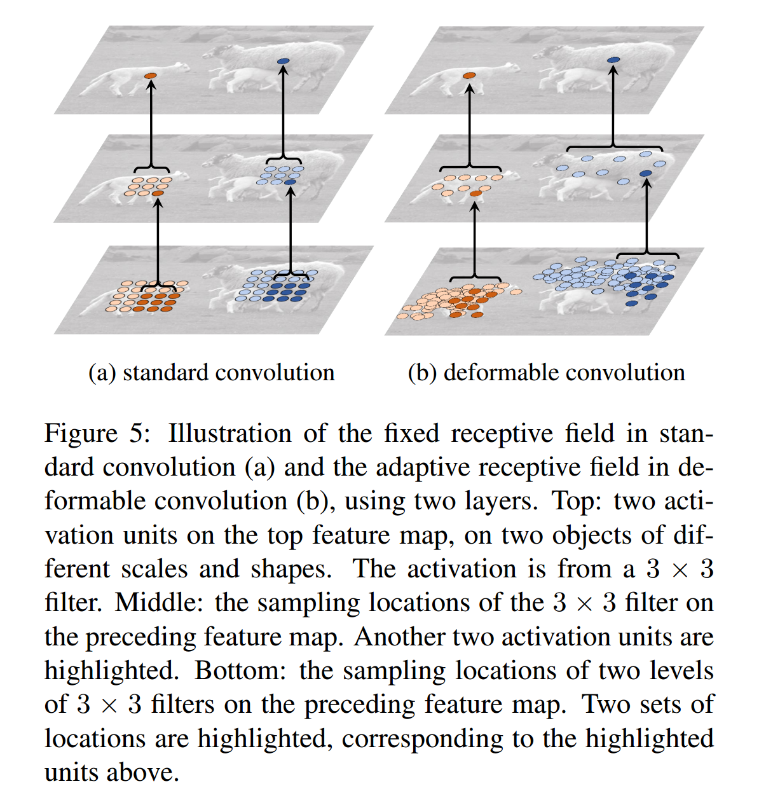

​		当将可变形卷积堆叠在一起时，复合变形的影响是深远的。这如图5。标准卷积的感受野核采样位置在所有的顶部特征图（左）中是固定的。在可变形卷积（右）中，感受根据目标的尺度和形状自适应变化。更多例子见图6。表2提供如此自适应变形的量化证据。

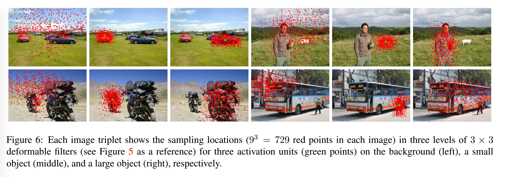

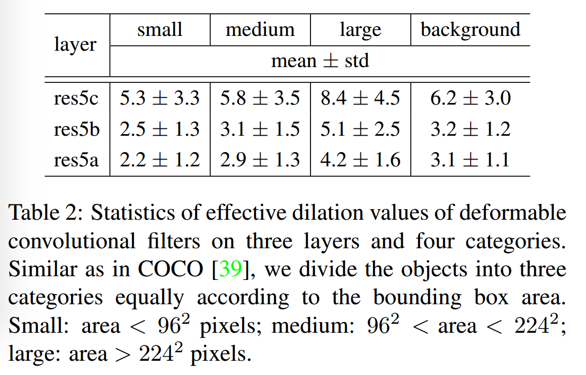

​		可变形RoI池化的影响相似，如图7所示。标准RoI池化中网格结构的规律性不再成立。相反，会部分偏离RoI bin，并且移动到目标前景区域附近。定位能力得到增强，特别对于非刚性目标。

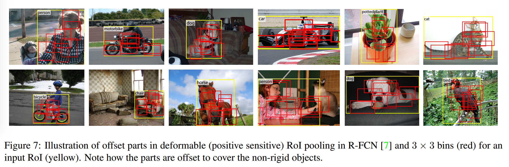

##### 3.1. In Context of Related Works

​		我们的工作与以前的工作在不同方面有关。 我们详细讨论关系和差异。

​		**Spatial Transform Network（STN）**  它的首要工作是在深度学习了框架中学习空间变换。它通过一个全局参数变换（例如纺射变换）扭曲特征图。这样的扭曲是昂贵的，并且已知学习变换参数是困难的。STN在小型尺度的图像分类问题上是成功的。inverse STN方法[37]通过有效的变换参数传播来代替昂贵的特征扭曲。

​		可变形卷积中的偏移学习可以被认为是STN中的一种非常轻量级的空间变换器[26]。然而，可变形卷积不采用全局参数变换和特征扭曲。相反，它在局部并以密集的方式采样特征图。为了集成新的特征图，它有一个权重求和步骤，这在STN中是没有的。

​		可变形卷积容易集成到任意的CNN架构中，它易于训练。已证明对于需要密集（例如语义分割）或半密集（例如目标检测）的视觉任务是有效的。这些任务对于STN来说比较困难。

​		**Active Convolution**  这项工作是现代的。它也利用偏移增强了采样位置，并通过反向传播端到端的学习偏移，其已被证明在图像分类任务上的有效性。

​		可变形卷积的两个关键区别使这项工作的通用性和适应性降低。第一，Active Convolution在所有不同空间位置上共享偏移。第二，Active Convolution的偏移是在每个任务或每个训练上学习静态模型参数。相比之下，可变形卷积中偏移是在每个图像位置上变化的_动态模型输出_。它们在图像上建模密集的空间变换，并且对于（如目标检测和语义分割的）（半-）密集预测任务是有效的。

​		**Effective Receptive Field**  [43]发现一个感受野中的所有像素不会对输出响应作出相等贡献。接近中心的像素远远更大的影响。有效感受仅占据理论感受野的一小部分，并具备高斯分布。尽管理论感受野随着卷积层的数量线性增加，令人吃惊的是，有效感受野大小随层数的平方根线性增加，因此，其速度与我们期望的要低得多。

​		这一发现表明，尽管深度CNN顶层单元可能也没有足够大的感受野。这部分地解释了为什么在视觉任务中广泛使用atrous卷积[23]（请参见下文）。它表明自适应感受野学习的必要性。

​		可变形卷积能够自适应地学习感受野，如图5、6和表2所示。

​		**Atrous Convolution** [23] 它将正常滤波器的步幅增加到大于1，并将原始权重保持在稀疏的采样位置。这增加了感受野，并在参数上保留相同的复杂度和计算量。它已被广泛用于语义分割（在[54]中也称为膨胀卷积）、目标检测和图像分类。

​		**Deformable Part Models（DPM）** [11]Deformable RoI池化与DPM相似，因为两个方法学习目标组件的空间变形以最大化分类分数。因为考虑的组件之间没有空间关系，所以可变形RoI池化更简单。

​		DPM是浅层模型，并仅有有限的建模形变的能力。虽然可以通过将距离变换视为特殊的池化操作将其推理算法转换为CNN [17]，但其训练不是端到端的，而是涉及启发式选择，例如组件和零件尺寸的选择。相比之下，Deformable ConvNets是深层，并执行端到端训练。当堆叠多个可变形模块时，建模变形的能力变得更强。

​		**DeepID-Net** [44] 它引入了一个形变约束池化层，该池化层还考虑了零件变形以进行目标检测。因此，它也与可变形RoI池化有相似的思想，但是更加复杂。这项工作高度工程化，并且基于RCNN[16]。尚不清楚如何以端到端的方式使其适应最新的最新目标检测方法[47、7]。

​		**Spatial maipulation in RoI pooling**  空间特征金字塔跨尺度使用手工池化区域。它是计算机视觉中主导方法，并且在基于深度学习的目标检测中使用。

​		学习池化区域的空间布局的研究很少。[28]中的工作从一个大型的超完备集中学习了一个稀疏的池化区域子集。大型集合是手工设计的，学习不是端到端的。

​		Deformable RoI池化首先在CNN中端到端学习池化区域。尽管当前区域的大小相同，但如空间金字塔池化[34]一样，可以扩展为多个大小。

​		**Transformation invariant features and their learning**  在设计变换不变特征上作出了巨大努力。值得注意的案例包括尺度不变特征变换（scale invariant feature transform：SIFT）和ORB（O为方向）。[36]研究了CNN表示对图像变换的不变性和等价性。一些工作利用相应的不同类型的变换来学习不变的CNN表示，例如[50]、scattering networks[3]、convolutional jungle[32]和TI-pooling[33]。一些作品致力于特定的变换，例如对称[13，9]、尺度[29]和旋转[53]。

​		如第一节中分析的，在这些工作中，变换已知是一个先验。知识（例如参数化）用于手工制作特征提取算法的结构，既可以固定在诸如SIFT中，也可以具有可学习的参数，例如基于CNN。它们可以处理新任务中的未知变换。

​		相比之下，我们的可变形模块可泛化到不同的变换（见图1）。变换不变从目标任务中学习。

​		**Dynamic Filter** [2] 与可变形卷积相似，动态滤波器也取决于输入特征并转换样本。不同之处是，仅学习滤波器的权重，而不是如我们的采样位置。这项工作用于视频和立体预测。

​		**Combination of low level filters**  高斯滤波器及其平滑导数[30]被广泛用于提取低级图像结构，例如拐角、边缘、T形结构等。在某种条件下，这样的滤波器形成了一组基础，它们的线性组合在同一组几何变换中形成了新的滤波器，例如Steerable Filters [12]中的多个方向和[45]中的多个尺度。我们注意到，尽管在[45]中使用了术语“可变形核”，但其含义与本工作中的含义不同。

​		多数CNN从头学习它们的所有卷积滤波器。最近的工作[25]证明这可能是不必要的。它通过低级滤波器（高达4阶的高斯导数）的加权组合代替了自由形式的滤波器，并学习了权重系数。当训练数据小时，滤波器函数空间的正则化可以提高泛化能力。

​		上面的工作与我们的工作有关，因为当多个滤波器（尤其是具有不同尺度的滤波器）组合在一起时，所得的滤波器可能具有复杂的权重并且类似于我们的可变形卷积滤波器。然而，可变形卷积学习采样位置而不是滤波器权重。

#### 4. Experiments

##### 4.1. Experiments Setup and Implementation

​		**Semantic Segmentation**  我们使用PASCAL VOC和CityScapes。对于PASCAL VOC有20个语义类别。遵循[19,41,4]的协议，我们使用VOC 2012数据集和额外的掩膜标注。训练集包括10582张图像。在验证集的1449张图像进行评估。对于CityScapes，遵循[5]的协议，在训练集的2975张图像上训练，在验证集的500张图像上评估。包含19个语义类别加上背景类别。

​		对于评估，我们使用定义在图像像素上的mIoU度量，对于PASCAL VOC和Cityscapes，我们分别使用mIoU@V和mIoU@C。在训练和推理时，对于PASCAL VOC将短边调整为360个像素，对于Cityscapes，将短边调整为1024个像素。在SGD训练期间，图像在每个mini-batch中随机采样。对于PASCAL VOC和Cityscapes，分别在8个GPU和每个GPU包含1的mini-batch上进行30k和45k迭代。学习率在前$\frac{2}{3}$和后$\frac{1}{3}$迭代中分别为$10^{-3}$和$10^{-4}$。

​		**Object Detection** 我们使用_PASCAL VOC_和_COCO_数据集。对于_PASCAL VOC_，遵循[15]中的协议，在VOC2007 trainval和VOC2012 trainval的并集上进行训练。在VOC2007测试集上评估。对于_COCO_，遵循标准的协议[39]，分别在trainval的120k张图像和test-dev的20k图像上训练和评估。

​		对于评估，我们使用标准的mAP得分。对于PASCAL VOC，我们使用0.5和0.7的IoU阈值来报告mAP分数。对于COCO，我们使用mAP@[0.5:0.95]的标准COCO指标，以及mAP@0.5。

​		在训练和推理中，图像的短边调整为600个像素。在SGD训练过程中，图像在每个mini-batch中随机采样。对于_class-aware RPN_，从图像中采样256个RoI。对于_Faster R-CNN_和_R-FCN_，为区域提议和目标检测网络分别采样256和128个RoI。在RoI池化中采用$7 \times 7$的bin。为了促进VOC的消融实验，我们遵循[38]的方法，并利用预先训练的固定RPN建议来训练Faster R-CNN和R-FCN，而区域提议和目标检测网络之间没有特征共享。与[47]中程序的第一阶段一样，对RPN网络进行单独训练。对于COCO，执行[48]中所述的联合训练，并启用特征共享进行训练。分别在PASCAL VOC和COCO上训练30k和240k迭代。前$\frac{2}{3}$和后$\frac{1}{3}$迭代中，学习率分别设置为$10^{-3}$和$10^{-4}$。

##### 4.2. Ablation Study

​		**Deformable Convolution** 表1使用ResNet-101特征提取网络评估了可变形卷积的效果。

​		表2报告了有效膨胀值的统计量（均值和标准层）。其结果证明：**1）可变形滤波器的感受野大小与目标大小有关，表明从图像内容学习形变时有效的；2）背景区域的滤波器的大小在中型和大型目标之间，表明较大的感受野对于识别背景区域是有效的。**

​		默认的ResNet-101模型的最后三个$3\times3$卷积层使用膨胀为2atrous卷积。我们进一步尝试了4、6和8，表3为不同膨胀率下的结果。这表明：**1）当使用更大的膨胀值时，所有任务的准确率都增加，这表明默认的网络的感受野太小；2）最优的膨胀值对于不同任务是不同的（例如DeepLab为6，而Faster R-CNN为4）；3）可变形卷积具有最佳的结果。**

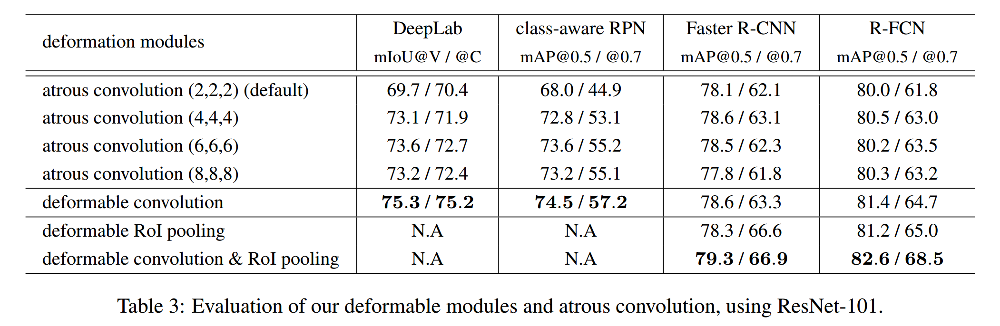

​		**Deformable RoI Pooling**  如表3。

​		**Model Complexity and Runtime** 见表4。

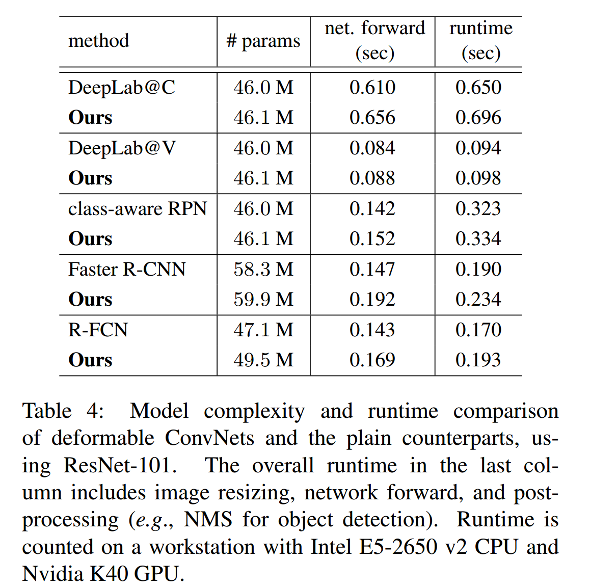

##### 4.3. Object Detection on COCO

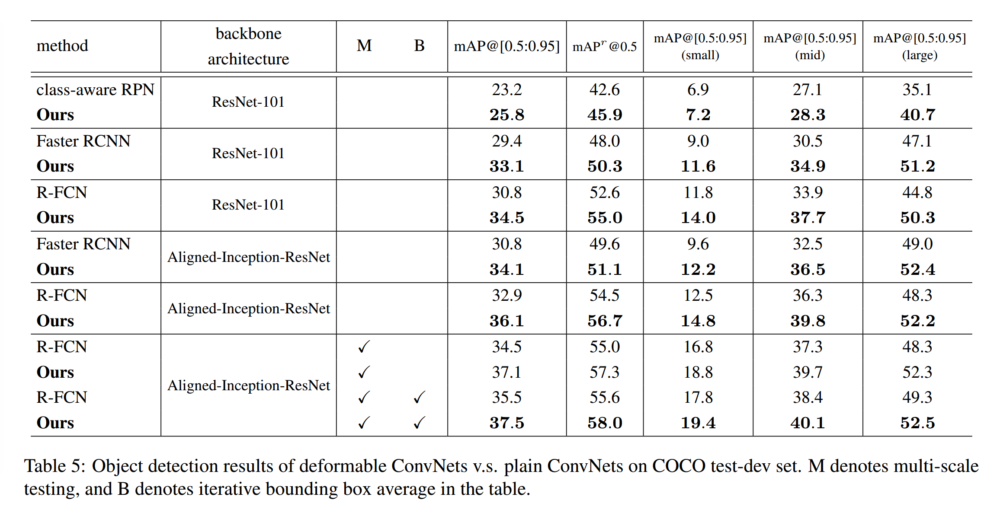

#### A. Deformable Convolution/RoI Pooling Backpropagation

​		公式（2）中的可变形卷积中，与偏移$\Delta \mathbf{p}_n$对应的梯度计算为：

$$\begin{alignat}{2}\frac{\partial \mathbf{y}(\mathbf{p}_0)}{\partial \Delta \mathbf{p}_n}&=\sum_{\mathbf{p}_n}\mathbf w(\mathbf{p}_n)\cdot \frac{\partial \mathbf{x}(\mathbf{p}_0 + \mathbf{p}_n + \Delta \mathbf{p}_n)}{\partial \Delta \mathbf{p}_n} \\ &=\sum_{\mathbf{p}_n\in\mathcal{R}}[\mathbf{w}(\mathbf{p}_n) \cdot \sum_{q}\frac{\partial G(\mathbf{q}, \mathbf{p}_0 + \mathbf{p}_n + \Delta \mathbf{p}_n)}{\partial \Delta \mathbf{p}_n}\mathbf{x}(\mathbf{q})], \tag{7}\end{alignat}$$

其中$\sum_{q}\frac{\partial G(\mathbf{q}, \mathbf{p}_0 + \mathbf{p}_n + \Delta \mathbf{p}_n)}{\partial \Delta \mathbf{p}_n}$可从公式（4）中推导。注意，偏移$\Delta \mathbf{p}_n$是二维的，为简单期间，我们使用$\partial \Delta \mathbf{p}_n$来表示$\partial \Delta p_n^x$和$\partial \Delta p_n^y$。

$$\begin{alignat}{2}\frac{\partial \mathbf{y}(i,j)}{\partial \Delta \mathbf{p}_{ij}}&=\frac{1}{n_{ij}}\sum_{\mathbf{p}\in bin_{ij}} \frac{\partial \mathbf{x}(\mathbf{p}_0 + \mathbf{p} + \Delta \mathbf{p}_{ij})}{\partial \Delta \mathbf{p}_{ij}} \\ &=\frac{1}{n_{ij}}\sum_{\mathbf{p}\in bin_{ij}}[\sum_{q}\frac{\partial G(\mathbf{q}, \mathbf{p}_0 + \mathbf{p} + \Delta \mathbf{p}_{ij})}{\partial \Delta \mathbf{p}_{ij}}\mathbf{x}(\mathbf{q})], \tag{7}\end{alignat}$$

并且与归一化的偏移$\Delta \hat{p}_{ij}$对应的梯度可以通过计算$\Delta \mathbf{p}_{ij}=\gamma \cdot \Delta\hat{\mathbf{p}}_{ij}\circ(w,h)$中的导数轻松获得。

#### B. Details of Aligned-Inception-ResNet

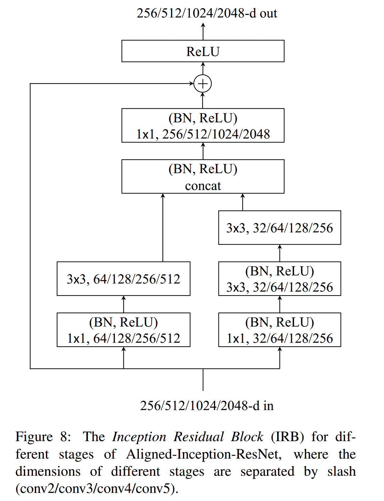

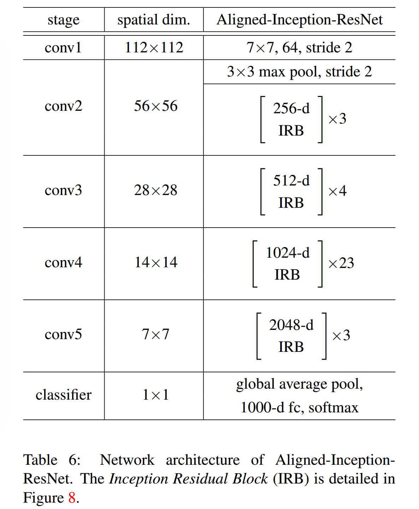

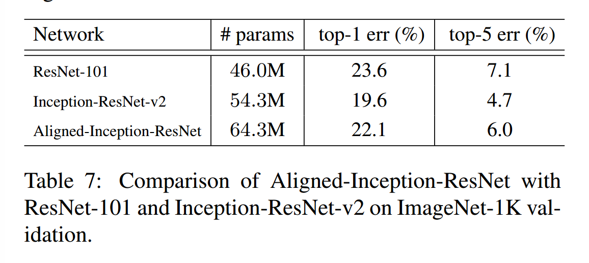