## DetectoRS: Detecting Objects with Recursive Feature Pyramid and Switchable Atrous Convolution

### 摘要

​		许多现代目标检测器通过使用两次观察和思考（looking and thinking twice）的机制，表现出出色的性能。本文中，我们在backbone中探索这种机制已进行目标检测。在宏观水平，我们提出递归特征金字塔（Recursive Feature Pyramid），它结合从特征金字塔网络到自下而上的骨干层的额外反馈连接。在微观水平，我们提出Switchable Atrous Convolution，其利用不同的atrous rate卷积特征，并聚合switch函数聚合结果。结合它们产生DetectoRS，其显著提高目标检测的性能。在COCO test-dev上，DetectoRS获得用于目标检测的54.7％的边界框AP，用于实例分割的47.1％的掩膜AP和用于全景分割的49.6％的PQ。代码见 https://github.com/joe-siyuan-qiao/DetectoRS 。

### 1. 引言

​		为了检测目标，人类视觉感知通过反馈连接传递高级语义信息来选择性地增强和抑制神经元的激活[2、19、20]。受人类视觉系统的启发，计算机视觉中确立了looking and thinking twice的机制，并表现出突出性能[5、6、58]。许多流行的两阶段目标检测器（例如Faster R-CNN[58]）首先输出目标提议，然后根据该提议提取区域特征以检测目标。遵循相同的方向，Cascade R-CNN[5]开发多阶段检测器，其中利用更多的选择性样本训练后续检测器头部。这种设计理念的成功促使我们在用于目标检测的神经网络主干设计中进行探索。特别地，我们在宏观和微观水平部署这种机制，产生我们提出的DetectoRS，其大幅提高最佳检测器HTC的性能，同时维持相似的推理速度，如表1所示。

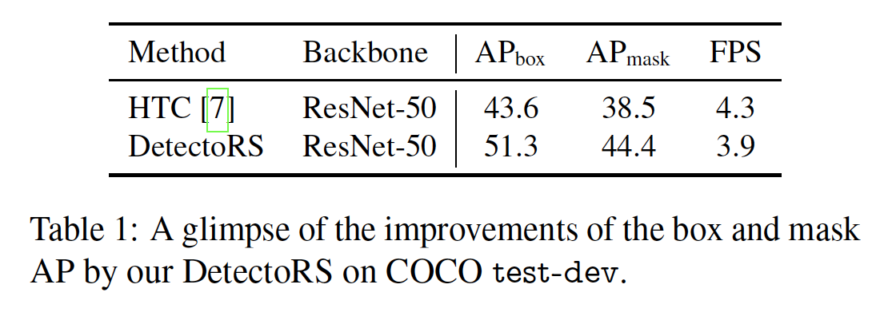

​		在宏观水平，所提出的Recursive Feature Pyramid（RFP）通过纳入从FPN层到自下而上的骨干层的额外反馈连接以构建在FPN之上，如图1a所示。将递归结构展开为顺序实现，我们获得用于目标检测器的主干，该主干可以将图像查看两次或更多次。与利用更多选择性样本中的级联检测器头部相似，我们的RFP递归增强FPN，以生成越来越强大的表示。Resembling Deeply-Supervised Nets[36]，反馈连接带来的特征（该特征直接接受从检测器头部反馈到自下而上的backbone低层的梯度）以加速训练以及提高性能。所提出的RFP实现looking and thinking twice的序列设计，其中自下而上的backbone和FPN重复运行多次，其输出特征取决于前面步骤中的特征。

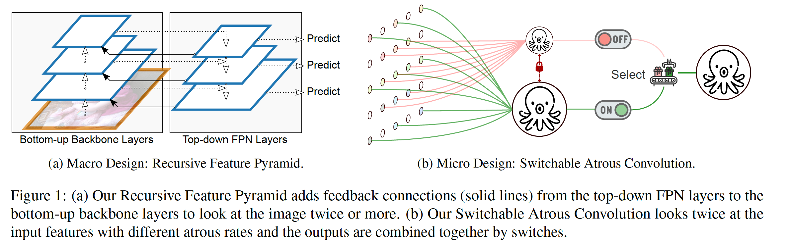

​		在微观水平，我们提出Switchable Atous Convolution（SAC），其利用不同atrous rate[11、30、53]卷积相同的输入特征，并使用switch函数聚合结果。图1b展示SAC的概念。switch函数在空间上独立的，即特征图的每个位置可能具有不同的开关（switch）以控制SAC的输出。为了在检测器中使用SAC我们将自下而上的backbone中所有标准的$3\times3$卷积层转换到SAC，其大幅提高检测器的性能。一些先前的方法采用传统卷积（例如[39、74]），它们也将不同卷积的结果组合为单个输出。与架构需要从头训练的这些方法不同，SAC提供一种机制，可以轻松地转换预训练的标准卷积网络（例如ImageNet预训练的[59]检查点）。此外，在SAC中使用新的weight locking mechanism，其中不同的atrous卷积的权重是相同的，除了可训练的差异。

​		将RFP和SAC结合产生我们的DetectoRS。为了证明其有效性，我们将DetectorRS纳入SOTA的HTC[7]。在COCO test-dev上，我们报告目标检测的box AP、实例分割的mask AP以及全景分割的PQ。ResNet50作为backone的DetectoRS将HTC的box AP提高7.7%，mask AP提高5.9%。此外，装备ResNeXt-101-32x4d的DetectoRS获得最佳的54.7% box AP和47.1% mask AP。再加上以Wide-ResNet-41 [10]为骨干的DeepLabv3 + [14]中的stuff预测，DetectoRS为全景分割创造了49.6％PQ的新记录。

### 2. 相关工作

​		**目标检测**	目标检测主要有两类：一阶段方法和两阶段方法。多阶段检测器通常更灵活和准确，但是比一阶段检测器更复杂。本文中，我们使用多阶段检测器HTC作为基线，并展示与两个类别的比较。

​		**多尺度特征**	我们的Recursive Feature Pyramid基于FPN，FPN时利用多尺度特征的搞笑目标检测系统。之前，许多目标检测器直接使用从backbone提取的多尺度特征，而FPN纳入自上而下的路径以依次结合不同尺度的特征。PANet添加在FPN之上添加另一个自下而上的路径。STDL提出通过scale-transfer模块来利用跨尺度的特征。G-FRNet添加具有gating单元的反馈。NAS-FPN和Auto-FPN使用神经架构搜索来找到最优FPN结构。EfficientDet[66]提出重复简单的BiFPN层。与它们不同，我们提出的Recursive Feature Pyramid重复地通过自下而上地backbone以丰富FPN的表示能力。此外，我们将Atrous Spatial Pyramid Pooling（ASPP）纳入到FPN以丰富特征，这与Seamless中的mini-DeepLab设计相似。

​		**Recursive Convolutional Network**	已提出许多递归方法来处理不同类型的计算机视觉问题，如[32、42、65]。最近，提出递归方法CBNet进行目标检测，其将多个backbone级联到输出特征作为FPN的输入。相比之下，我们的RFP使用建议的富含ASPP的FPN和有效的融合模块执行递归计算。

​		**条件卷积**	条件卷积网络采用动态核、宽度或深度，例如[16、39、43、48、74、77]。与它们不同，我们提出的Switchable Atrous Convolution（SAC）允许从标准卷积到条件卷积的有效转换机制，而无需更改任何预训练模型。因此，SAC是许多预训练骨干网的即插即用模块。此外，SAC使用全局上下文信息，以及新颖的weight locking 机制来使其更有效。

### 3. Recursive Feature Pyramid

#### 3.1. Feature Pyramid Networks

​		本小节介绍FPN的背景。令$\mathbf{B}_i$表示自下而上的backbone的第$i$个阶段，令$\mathbf{F}_i$表示第$i$个自上而下的FPN操作。具有FPN的backbone输出一组特征图$\{\mathbf{f}_i|i=1,\cdots,S\}$，其中$S$为阶段数。例如，图2a中的$S=3$。对于$\forall i = 1, \cdots, S$，输出特征$\mathbf{f}_i$定义为：

$$\mathbf{f}_i = \mathbf{F}_i(\mathbf{f}_{i+1}, \mathbf{x}_i), \mathbf{x}_i = \mathbf{B}_i(\mathbf{x}_{i-1}),\tag{10}$$

其中$\mathbf{x}_0$为输入图像，$\mathbf{f}_{S+1}=\mathbf{0}$。构建在FPN之上的目标检测器使用$\mathbf{f}_i$进行检测计算。

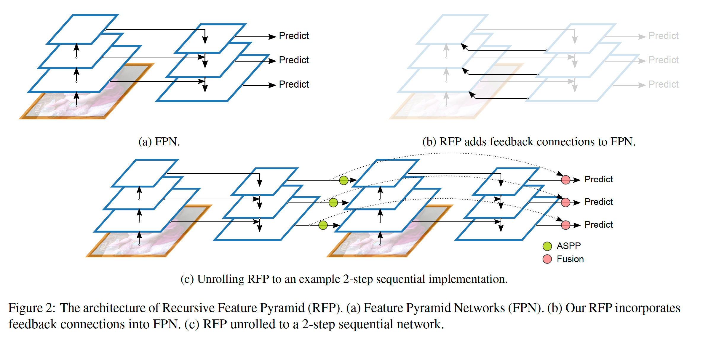

#### 3.2. Recursive Feature Pyramid

​		我们提出的Recursive Feature Pyramid（RFP）见反向连接添加到FPN，如图2b所示。令$\mathbf{R}_i$表示特征变换，然后再将其连接到自底向上的主干。然后，对于$\forall i = 1, \cdots, S$，RFP的输出特征$\mathbf{f}_i$定义为：

$$\mathbf{f}_i = \mathbf{F}_i(\mathbf{f}_{i+1},\mathbf{x}_i), \mathbf{x}_i = \mathbf{B}_i(\mathbf{x}_{i-1}, \mathbf{R}_i(\mathbf{f}_i)), \tag{2}$$

其使RFP为一个递归操作。我们将其展开为一个序列网络，即对于$\forall i =1, \cdots, S$， $t=1,\cdots,T$，有

$$\mathbf{f}_i^t=\mathbf{F}_i^t(\mathbf{f}_{i+1}^t,\mathbf{x}_i^t),\mathbf{x}_i^t=\mathbf{B}_i^t(\mathbf{x}_{i-1}^t,\mathbf{R}_i^t(\mathbf{f}_i^{t-1})), \tag{3}$$

其中$T$为展开迭代的数量，我们使用下标$t$来表示操作和展开步骤$t$中的特征。$\mathbf{f}_i^0$设置为$\mathbf{0}$。在我们的实现中，$\mathbf{F}_i^t$和$\mathbf{R}_i^t$跨不同步共享。我们在第5节的消融研究中介绍共享与不同的$\mathbf{B}_i^t$，以及不同的$T$的性能。在我们的实验中，除非特别提到，否则我们使用不同的$\mathbf{B}_i^t$，并设置$T=2$。

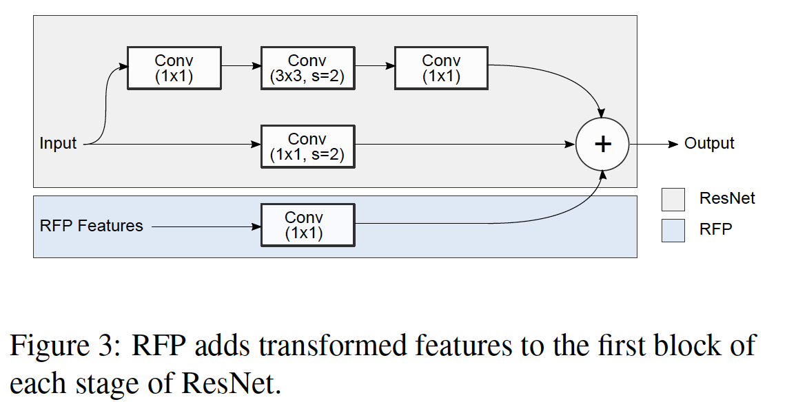

​		我们修改ResNet主干$\mathbf{B}$使其允许使用$\mathbf{x}$和$\mathbf{R}(\mathbf{f})$作为输入。ResNet有四个阶段，每个阶段包含几个相似的块。我们仅改变每个阶段的第一个块，如图3所示。这个块计算3-layer特征，并将该特征加到一个shortcut。为了使用特征$\mathbf{R}(\mathbf{f})$，我们添加另一个核为1的卷积层。该层的**权重初始化为0**，以确保，在加载预训练检查点时，不会有任何实际影响。

​		我们使用Atrous Spatial Pyramid Pooling（ASPP）[12]来实现连接模块$\mathbf{R}$，其将特征$\mathbf{f}_i^t$作为输入，并将其转换为图3中使用的RFP特征。在这个模块中，有四个以$\mathbf{f}_i^t$为输入的并行分支，然后将其输出沿着通道维度拼接一起以构成$\mathbf{R}$的最终输出。它们的是那个分支使用卷积+ReLU层，输出通达的数量为输入通道的$1/4$。最后的分子使用全局均值池化层来压缩特征，接着是$1\times1$卷积层和ReLU层将压缩特征变换为$1/4$大小（逐通道）特征。最后，调整并拼接其他三个分支的特征。这三个分支中的卷积层具有以下配置：kernel size = [1, 3, 3]、atrous rate = [1, 3, 6]、 padding = [0, 3, 6]。与原始的ASPP[12]不同，我们在级联特征之后没有卷积层，因为此处$\mathbf{R}$不会生成用于密集预测任务的最终输出。注意，四个分支的每个分支产生输入特征通道数$1/4$的特征，并拼接它们生成与$\mathbf{R}$的输入特征相同大小的特征。在第5节，我们展示有和没有ASPP模块的RFP的性能。

#### 3.4. Output Update by the Fusion Module

​		如图2c所示，我们的RFP还使用融合模块来组合$\mathbf{f}_i^t$和$\mathbf{f}_i^{t+1}$以以更新等式（3）中使用的展开阶段$t + 1$的$\mathbf{f}_i$的值。如果我们将$\mathbf{f}_i^t$视为数据序列，那么融合模块与RNN更新过程非常相似。融合模块用于从2到$T$的展开步骤。在展开步骤$t+1(t=1,\cdots,T-1)$中，融合模块以第$t$步中的特征$\mathbf{f}_i^t$和第$t+1$步中的由FPN新计算的特征$\mathbf{f}_i^{t+1}$作为其输入。融合模块使用特征$\mathbf{f}_i^{t+1}$以由卷积层+Sigmoid计算注意力图。产生的注意力图用于计算$\mathbf{f}_i^t$和$\mathbf{f}_i^{t+1}$的加权和，从而构成一个更新的$\mathbf{f}_i$。这个$\mathbf{f}_i$用作下一步中$\mathbf{f}_i^{t+1}$的计算。在第5节中消融研究中，我们将展示有和没有消融模块的RFP的性能。

### 4. Switchable Atrous Convolution

#### 4.1. Atrous Convolution

​		Atrous Convolution[11、30、53]是扩大任何卷积层中滤波器感受野的搞笑技术。特别地，atrous rate为$r$的atrous卷积在连续的滤波器值之间引入$r-1$的零，等价于将$k \times k$的核大小扩大为$k_e=k+(k-1)(r-1)$，而没有增加参数量或计算量。图1b展示将atrous率设置为1（红色）和2（绿色）的$3\times3$卷积层的例子：相同的卷积权重集可以使用不同的atrous率粗略地检测出不同尺度的同类目标。

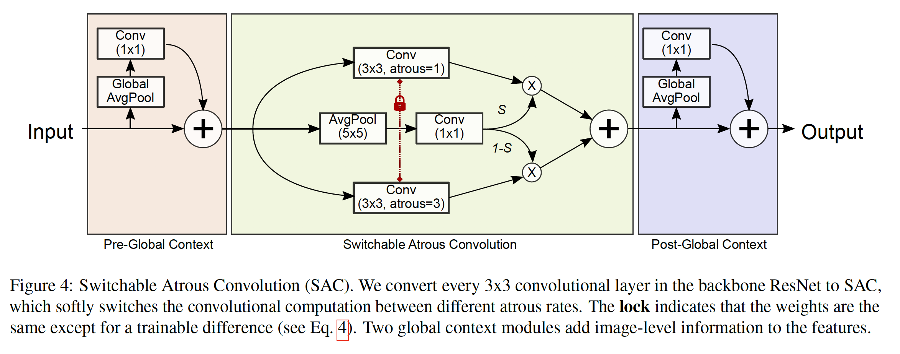

#### 4.2. Switchable Atrous Convolution

​		在本小节中，我们介绍所提出的Switchable Atrous Convolution（SAC）的细节。图4给出SAC的整体架构，其有3个主要部分：附加在SAC组件前后的两个全局上下文模块。本节关注图4中中间主要的SAC组件，并且在之后解释全局上下文模块。

​		我们使用$\mathbf{y} = \mathbf{Conv}(\mathbf{x}, \mathbf{w}, r)$ 来表示具有权重$\mathbf{w}$以及atrous rate $r$的卷积操作，其以$\mathbf{x}$作为其输入，并输出$\mathbf{y}$。然后，我们可以将卷积层转换为如下的SAC：

$$\begin{align} \mathbf{Conv}(\mathbf{x}, \mathbf{w}, 1) &\xrightarrow[\mbox{to SAC}]{\mbox{Convert}} \mathbf{S}(\mathbf{x})\cdot \mathbf{Conv}(\mathbf{x}, \mathbf{w}, 1)\\& +(1 - \mathbf{S}(\mathbf{x})) \cdot \mathbf{Conv}(\mathbf{x}, \mathbf{w + \Delta w}, r)\end{align} \tag{4}$$

其中$r$是SAC的超参数，$\mathbf{\Delta w}$为训练权重，开关函数$\mathbf{S}(\cdot)$实现为具有$5 \times 5$核的平均池化层以及一个$1 \times 1$卷积层（见图4）。开关函数取决于输入和位置。 因此，骨干模型能够根据需要适应不同的规模。在本文的实验中，除非特别说明，我们设置$r=3$。

​		我们提出Locking Mechanism，其将一个权重设置为$\mathbf{w}$，另一设置为$\mathbf{w} + \Delta \mathbf{w}$。目标检测通常使用预训练的检测点来初始化权重。但是，对于从标准卷积层转换得到的SAC层，缺少较大atrous率的权重。因为不同尺度的目标可以大致由不同atrous率的相同权重检测，因此自然地用预训练模型中的权重来初始化缺失的权重是很自然的。我们的实现为缺失权重使用$\mathbf{w} + \Delta \mathbf{w}$，其中$\mathbf{w}$为预训练的检查点，而$\Delta \mathbf{w}$初始化为$\mathbf{0}$。当固定$\Delta \mathbf{w} = 0$时，我们观察到0.1% AP的损失。但是单独使用$\Delta \mathbf{w}$，而没有locking机制，AP衰减非常大。

#### 4.3. Global Context

​		如图4所示，我们在SAC的主要组件前后插入两个global context模块。由于首先通过全局平均池化层对输入特征进行压缩，因此这两个模块是轻量级的。全局上下文模块于SENet相似，除了有两个主要差异：（1）我们仅有一个卷积层，而没有任何非线性层，（2）输出加回主流，而不是将输入乘以Sigmoid计算出的重新校准值。通过实验，我们发现在SAC组件之前添加全局上下文信息（即将全局信息添加到switch函数）对检测性能有积极影响。我们推测这是因为当全局信息可用时，$\mathbf{S}$可以做出更稳定的开关预测。然后，我们在开关函数之外移动全局信息，并将它放在主体前后，使得$\mathbf{Conv}$和$\mathbf{S}$可以从中受益。我们没有采用原始的SENet形式，因为我们发现在最终的模型AP上没有任何改进。在第5节的消融研究中，我们展示有和没有全局上下文模块的SAC的性能。

#### 4.4. 实现细节

​		在我们的实现中，我们使用可变形卷积替换式（4）中的卷积操作。它们的偏移函数不共享，当从预训练的主干加载时，将初始化它们以预测为$\mathbf{0}$。第5节中的实验将展示有和没有可变形卷积的SAC的性能比较。我们通过替换骨干网中的所有$3\times3$卷积层以在ResNet及其变体上采用SAC [28、71]。全局上下文中的权重和偏置初始化为$\mathbf{0}$。开关$\mathbf{S}$中的权重初始化为$\mathbf{0}$，偏置设置为$\mathbf{1}$。$\Delta \mathbf{w}$初始化为$\mathbf{0}$。上述初始化策略确保，当加载ImageNet上预训练的骨干时，将所有的$3 \times 3$卷积层转换为SAC不会在对COCO进行任何训练[47]之前改变输出。

### 5. 实验

#### 5.1. 实验细节

​		我们在COCO数据集上进行实验。本文介绍的所有模型都在train2017上训练，该数据集包含115k张标签图像。然后，我们在val2017和test-dev上测试模型。我们利用mmdetection上实现DetecoRS。我们的基线模型为HTC，其使用数据集中的边界框和实例分割注释。在单个NVIDIA TITAN RTX显卡上测量运行时。我们严格遵循HTC的实验设置。对于消融研究，我们训练模型12个周期，学习率在8和12个时期后乘以0.1。此外，其他训练和测试设置保持不变，也没有使用其他花里胡哨的设置。对于消融研究后的主要结果，我们使用将长边设置为133，短边从$[400,1200]$的多尺度训练。我们训练模型40个周期，学习率在36和39个周期后乘以0.1。对于测试，Soft-NMS金庸ResNeXt-101-32x4d。我们还报告有和没有测试时增强（test-time augmentation：TTA）的结果，其包含水平翻转和多尺度测试（短边设置为$[800,100,1200,1400,1600]$，长边设置为短边的1.5倍）。

#### 5.2. 消融研究

​		在本节中，表2和表3给出RFP和SAC的消融研究。表2给出以ResNet-50和FPN为骨干的基准HTC的边界框和掩膜 AP。然后，我们将所提出的RFP和SAC添加到基线HTC，其中两者都能将AP提高超过4%，而每降低速度。将它们组合到一起产生DetectoRS，其将以3FPS的速度获得49%的边界框AP以及42.1%的掩膜AP。

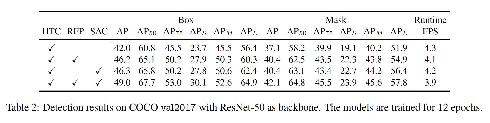

​		表3给出RFP和SAC的单独消融研究，其中我们介绍了它们的改进来源。对于RFP，我们展示“RFP+sharing”，其中$B_i^1$和$B_i^2$共享它们的权重。我们还通过展示“ RFP-aspp”和“ RFP-Fusion”中没有RFP的性能来展示ASPP模块和融合模块的改进。最后，我们将展开步骤$T$从2增加到3，并得到“RFP+3X”，其进一步将AP提高1.3%。对于SAC，我们首先在没有DCN的SAC上实验（即“SAC-DCN”）。然后，我们展示全局上下文能够能够改善“SAC-DCN-global”中的AP。“SAC-DCN-locking”打破了图4中的锁定机制，其中第二个卷积仅使用$\Delta \mathbf{w}$，证明SAC需要进行权重锁定。最后，在“SAC-DCN+DS（dual-switch）”中，我们将$\mathbf{S}(x)$和$1-\mathbf{S}(x)$替换为两个独立的开关$\mathbf{S}_1(x)$和$\mathbf{S}_2(x)$。表3中的消融研究表明，RFP和SAC的配方在我们探索的设计空间内具有最佳配置。

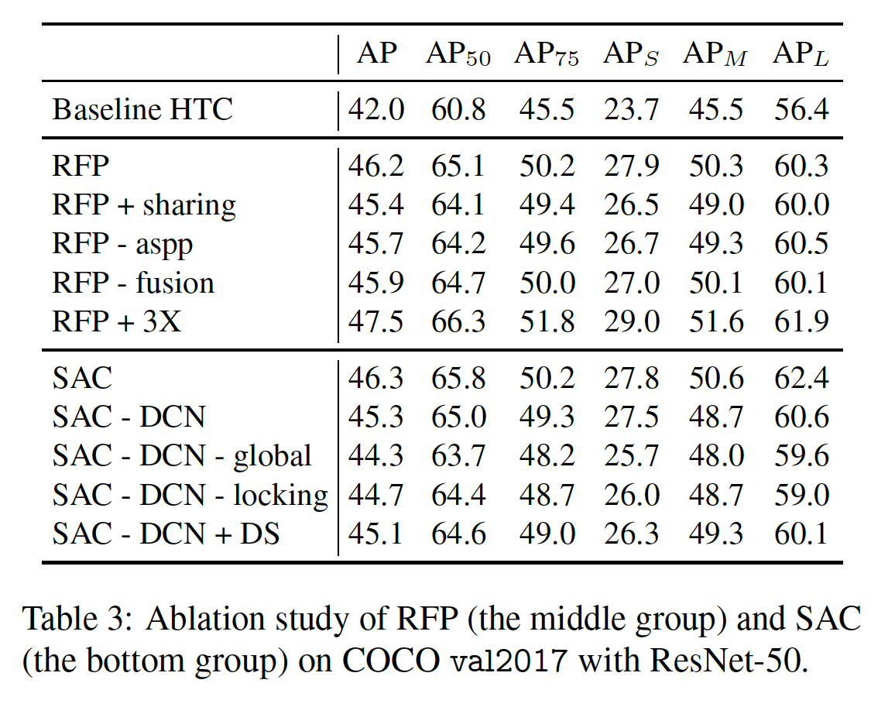

​		图6提供HTC、“HTC+RFP”和“HTC+SAC”结果的可视化。根据这种比较，我们注意到，RFP与选择性增强或抑制神经元激活的人类视觉感知类似，能够更轻松地找到被遮挡的目标，因为其附近的上下文信息则更为关键。由于SAC可以根据需要增加感受野的能力，因此它更有能力检测图像中的大目标。这也与表2中所示的SAC的结果一致，其中SAC有更高的$AP_L$。图7展示HTC、“HTC+RFP”、“HTC+SAC”和DetectoRS的训练损失。两者都能显著加速训练过程，并收敛到更低损失。

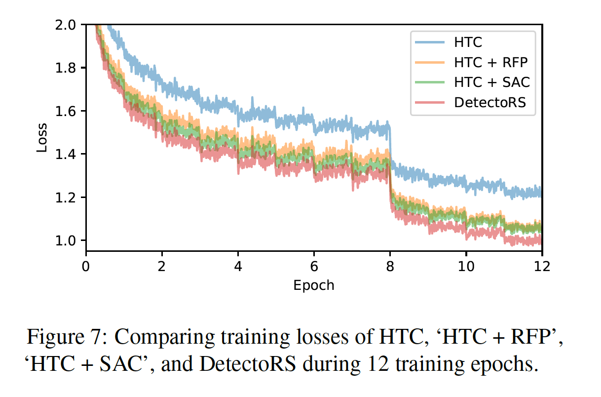

#### 5.2. 主要结果

​		在本节中，我们介绍DetectoRS的主要结果。我们装备DetectoRS的最佳检测器HTC，并使用ResNet-50和ResNeXt-101-32x4d作为DetectoRS的骨干。边界框检测结果见表4。结果分为4组。第一组为一阶段检测器。第二组为多阶段检测器。第三组为HTC，其为DetectoRS的基线。第四组为我们的结果。这种结果还可以分为简单测试结果和TTA结果，其中TTA为test-time augmentation的简称。第三列为是否使用TTA策略。注意，不同的方法使用不同的TTA策略。例如，CBNet使用强壮的TTA策略，其可以将边界框AP从50.7%提高到53.3%。当使用ResNeXt-101-32x4d时，我们的TTA策略仅带来1.4%的改进。简单测试设置还在不同的检测器之间有明显地变化。更大的输入大小倾向于带来改进（见[66]）。DetectoRS采用与HTC相同的设置。

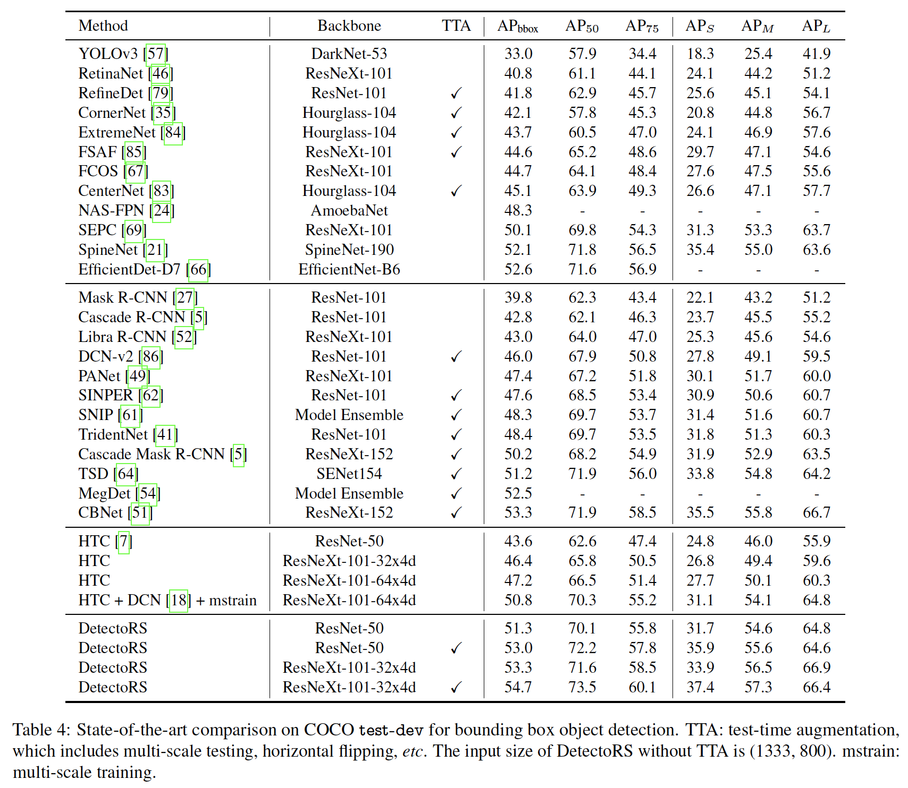

​		我们还在表5中展示实例分割结果。因为表4中的许多方法没有在它们的论文中提供掩膜AP，我们仅比较DetectoRS和其基线HTC。边界框和掩膜目标检测的实验设置相同，除了我们报告$\mbox{AP}_{\mbox{mask}}$而不是$\mbox{AP}_{\mbox{box}}$。根据表5，我们可以看出与边界框结果一致，DetectoRS还在实例分割的基线上带来重大改进。

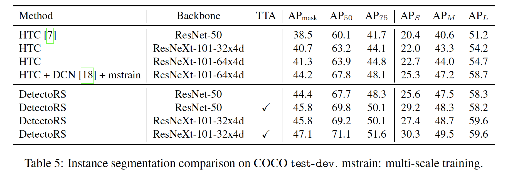

​		最后，在表6中报告全景分割结果。由于DetectoRS仅检测thing，我们通过具有骨干WideResNet-41的DeepLabV3+预测stuff。使用全景API [34]中可用的脚本来对thing和stuff的预测进行组合，而无需调整任何超参数，我们能够为COCO上的全景分割带来新的SOTA：PQ 49.6％。

#### 5.4. Visualizing Learned Switches

​		图8展示表3中“ SAC-DCN”的最后一个开关功能的输出的可视化结果。图中较暗的强度表示该区域的开关功能从较大的扰动速率中收集更多的输出。将开关输出与原始图像进行比较，我们观察到开关输出与ground-truth目标尺度良好对齐。这些结果证明Switchable Atrous Convolution的结果与我们的意图一致，当遭遇更大的目标时，其倾向于使用更大的atrous rate。

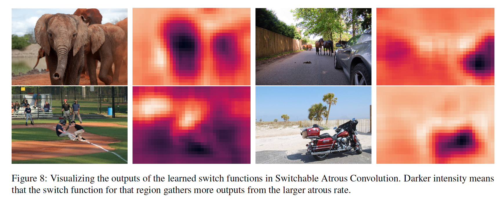