## Distance-IoU Loss: Faster and Better Learning for Bounding Box Regression

### Abstract

​		边界框回归是目标检测的关键步骤。在现有方法中，虽然 $l_n$ 范数损失广泛用于边界框回归，但是它不是为评估度量（即 IoU）量身定制的。最近，提出的 IoU 损失和 GIoU 损失对于 IoU 度量标准有好处，但是仍然存在收敛速度慢和回归不准确的问题。在本文中，我们通过纳入预测边界框和目标边界框的归一化距离，提出 Distance-IoU（DIoU）损失，它在训练中比 IoU 和 GIoU 损失收敛更快。此外，本文基于所提出的 Complete IoU（CIoU），总结了边界框回归中的三个几何因素，即重叠面积、中心点距离和纵横比，因此产生更快的收敛和更好的性能。通过将 DIoU 和 CIoU 损失结合到最佳目标检测算法，例如 YOLO v2、SSD 和 Faster R-CNN，我们在 IoU 和 GIoU 度量方面上获得显著的性能增加。而且，DIoU 可以很容易的被引入到非极大值抑制（non-maximum suppression: NMS）中作为判据，进一步促进了性能的提升。源代码和训练模型见 https://github.com/Zzh-tju/DIoU 。

### Introduction

​		目标检测是计算机视觉任务的关键议题之一，几十年来一直受到人们的广泛关注。通常，现有的目标检测方法分为：一阶段检测，例如 YOLO 系列和 SSD ；两阶段检测，例如 R-CNN 系列；甚至多阶段检测，例如 Cascade R-CNN 。尽管检测框架不同，但是边界框回归是预测矩形边界框来定位目标对象的关键步骤。

​		在边界框回归评估标准方面，IoU 是最流行的度量标准：

$$IoU = \frac{|B \cap B^{gt}|}{B\cup B^{gt}}, \tag{1}$$

其中 $B^{gt} = (x^{gt}, y^{gt}, w^{gt}, h^{gt})$ 是 ground-truth，$B = (x, y, w, h)$ 是预测边界框。通常，在 $B$ 和 $B^{gt}$ 上采用 $l_n$ 范数（ 例如 $n = 1 \mbox{ or } 2$ ）来衡量边界框之间的距离。然而，如（Yu 等；Rezatofighi 等 2019 ）建议的，$l_n$ 范数损失不是获得最佳 IoU 度量的合适选择。在（Rezatofighi 等 2019）中，提出采用 IoU 损失来提高 IoU 度量：

$${\cal{L}}_{IoU} = 1 - \frac{|B \cap B^{gt}|}{|B \cup B^{gt}|}. \tag{2}$$

然而，IoU 损失仅当边界框之间有重叠时，才有效；对于不重叠的情况下，没有提供任何梯度。然后（Rezatofighi 等 2019）通过添加惩罚项提出 GIoU 损失：

$${\cal{L}}_{GIoU} = 1 - IoU + \frac{|C-B\cup B^{gt}|}{|C|}, \tag{3}$$

其中 $C$ 是覆盖 $B$ 和 $B^{gt}$ 的最小边界框。在没有重叠的情况下，由于惩罚项的引入，预测边界框会向目标边界将移动。

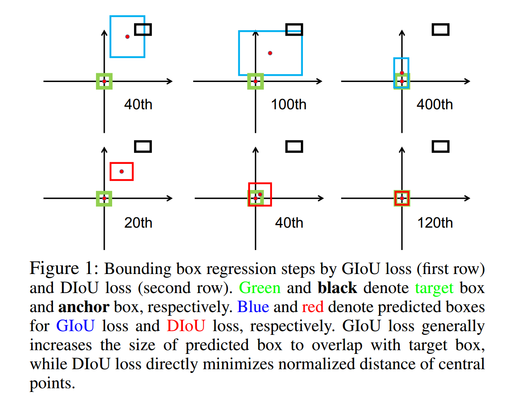

​		尽管 GIoU 可以缓解非重叠情况下梯度消失的问题，但它仍然有几个局限。通过仿真实验，我们可以评估不同边界框位置的 GIoU 损失。如图 1 所示，首先，可以看出 GIoU 损失倾向于增加预测边界框的大小；然后，式（3）中的 IoU 最大化边界框的重叠面积。根据图 2 ，GIoU 损失将完全降级为包围框的 IoU 损失。由于严重依赖 IoU 项，根据实验，GIoU 需要更多的迭代才能收敛，特别针对是水平和垂直的边界框（见图 4）。通常，在最佳检测算法中，GIoU 损失不能很好地收敛，产生不准确的检测。

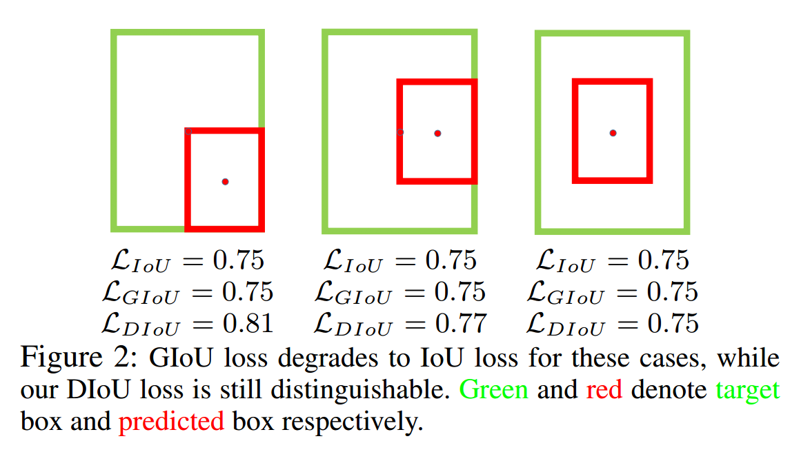

​		本文中，我们为边界框回归提出 Distance-IoU（DIoU）损失。特别地，我们在 IoU 损失上简单地添加一个惩罚项来直接最小化两个边界框中心点之间的归一化距离（normalized distance），产生远比 GIoU 损失更快的收敛速度。根据图 1 ，DIoU 损失可以部署用于直接最小化两个边界框之间的距离。并且，仅通过 120 次迭代，预测边界框与目标边界框完美匹配，而GIoU 损失甚至在 400 次迭代后都未能收敛。此外，我们认为对边界框回归好的损失函数应当考虑三个重要的几何测量：重叠面积、中心点距离和纵横比，这在相当长的一段时间中被忽略。通过将这些几何测量结合，我们为边界框回归还提出了 Complete IoU（CIoU）损失，其比 IoU 和 GIoU 损失产生更快的收敛和更好的性能。提出的损失可以很容易地纳入到最先进的目标检测算法。此外，DIoU 可以用作 NMS 的判断标准，在抑制冗余边界框时，它不仅考虑重叠面结，还考虑两个边界中心点的距离，在严重遮挡的情况下，这使得它更具鲁棒性。

​		为了评估我们提出的方法，将 DIoU 损失和 CIoU 损失纳入几种最佳检测算法（包括 YOLO v3、SSD 和 Faster R-CNN），并且在两个流行的基准测试数据集（PASCAL VOC 2007 和 MS COCO 2017）上进行测试。

​		本文的工作总结如下：

1. 为边界框回归提出 Distance-IoU 损失（即 DIoU 损失），其收敛速度比 IoU 和 GOIoU 损失更快。
2. 进一步提出 Complete IoU 损失（即 CIoU 损失），其考虑三个几何测量，即重叠面积、中心点的距离和纵横比，这更好地描述了矩形边界框的回归。
3. DIoU部署在NMS中，在抑制冗余边界框方面比原来的NMS更健壮。 
4. 所提出的方法可以轻易地纳入最佳检测算法，获得显著的性能增加。

### Related Work

​		本节中，我们简要回顾相关工作，包括目标检测方法、边界框损失函数和非极大值抑制。

**Object Detection**

​		在（Song 等 2018）中，将中轴线用于行人检测。CornerNet（Law 和 Deng 2018）建议预测一对角来代替矩形框从而定位目标。在RepPoints（Yang等2019）中，通过预测几个点构成矩形框。最近，FSAF（Zhu、He和Savvides 2019）提出无锚分支来解决在线特征选择中的非最优性问题。目标检测中还有几种损失函数，例如 focal loss、class-balanced loss、分类和边界框回归平衡的损失以及gradient flow balancing loss（Libra-RCNN）。然而，边界框回归仍然是最佳目标检测算法中最流行的方式。

**Loss Function for Bounding Box Regression**

​		$l_n$范数损失函数通常用于边界框回归，但是它对变化的尺度很敏感。YOLO v1 中，为 $w$ 和 $h$ 使用平方根来缓解这种影响，而 YOLO v3 使用 $2 - wh$ 。IoU 损失的使用源自 Unitbox，其对尺度是不变的。（Rezatofighi 等 2019）提出 GIoU 损失来处理非重叠情况下梯度消失的问题，但是仍回面对收敛速度慢和不准确的回归。相比之下，我们提出更快收敛和更高回归准确率的 DIoU 和 CIoU 损失。

**Non-Maximum Suppression**

​		NMS 是大多数目标检测算法中的最后一步，其中会移除冗余边界框以及与最高得分边界框的重叠超过阈值的边界框。Soft-NMS 通过与 IoU 对应的连续函数来惩罚相邻的检测得分，产生比原始 NMS 更软和更具鲁棒性的抑制。IoUNet 引入新的网络分支预测定位置信度以引导 NMS 。最近，提出自适应 NMS 和 Softer-NMS ，它们分别研究合适的阈值和甲醛平均测量。本文中，简单地使用 DIoU 作为原始 NMS 的判断标准，其中，在抑制冗余边界框时，同时考虑重叠面积和距离。

### Analysis to IoU and GIoU Losses

​		首先，我们分析了原始IoU损失和GIoU损失的局限性。然而，仅从检测结果分析边界框回归过程非常困难，其中不受控制的基准测试中的回归情况通常不全面，例如不同的距离、不同的尺度和不同的纵横比。相反，我们建议执行仿真实验，其中应当全面地考虑回归情况，然后可以轻松地分析给定的损失函数的问题。

**Simulation Experiment**

​		在仿真实验中，我们试图涵盖边界框之间的大部分关系，包括距离、比例和长宽比，如图 3（a）所示。特别地，我们选择7个单元框（即 $1:4$、$1:3$、$1:2$、$1:1$、$2:1$、$3:1$  和 $4:1$）作为目标框。不失一般性，将 7 个目标框的中心点固定在 $(10, 10)$ 。锚框均匀地分散在 5000 个点。（$i$）距离：选择中心位于 $(10, 10)$、半径为 35000 个点的圆形区域来放置 7 个尺度和 7 个纵横比的锚框。在这些情况中，包含了重叠和非重叠的边界框。（$ii$）尺度：对于每个点，锚框的面积设置为 0.5、0.67、0.75、1、1.33、1.5 和 2 。（$iii$）纵横比：对于给定的点和尺度，采用 7 个纵横比，即 $1:4$、$1:3$、$1:2$、$1:1$、$2:1$、$3:1$  和 $4:1$ 。所有的 $5000 \times 7 \times 7$ 个锚框应当适合每个目标框。总之，总共有 $1715000 = 7 \times 7 \times 5000$ 个回归案例。

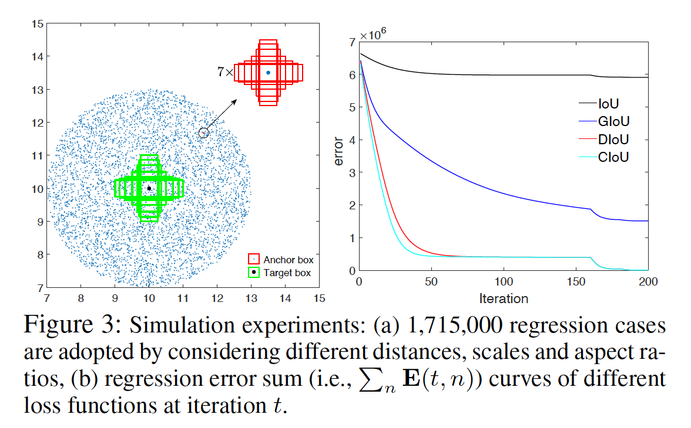

​		然后，给定损失函数 $\cal{L}$ ，我们可以使用梯度下降算法模拟每个案例的边界框回归过程。对于预测到的边界框 $B_i$ ，可以通过下式获得当前的预测：

$$B_i^t = B_i^{t-1} + \eta(2 - IoU^{t-1})\nabla B_i^{t-1}, \tag{4}$$

其中 $B_i^t$ 是每次迭代 $t$ 中的预测框，$\nabla B_i^{t-1}$ 表示迭代 $t-1$ 中与 $B_i$ 对应的损失 $\cal{L}$ 的梯度，而 $\eta$ 是步长。值得注意的是，在我们的实现中，梯度乘以 $2 - IoU_i ^ {t-1}$ 以加速收敛。边界框回归的性能使用 $l_1$ 范数评估。对于每个损失函数，当到达 $T = 200$ 次迭代时停止仿真实验，误差曲线如图 3（b）所示。

**Limitations of IoU and GIoU Losses**

​		图 4 中 ，我们可视化了第 $T$ 次迭代中 5000 个离散点的最终回归误差。由图 4（a），容易看出 IoU 损失仅对与目标框有重叠的情况有效。由于 $\nabla B$ 总是为 0，所以与目标框没有重叠的锚框没有移动。

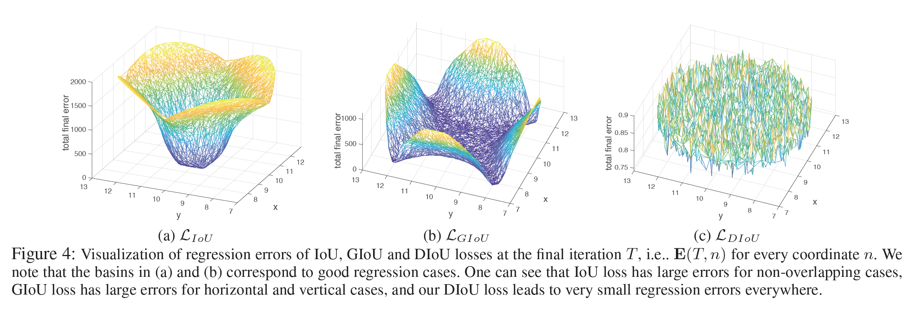

​		通过添加如式（3）的惩罚项，GIoU 损失可以更好缓解没有重叠情况的问题。由图 4（b）可知，GIoU 损失明显扩大了盆地（basin），即 GIoU 有效的区域。但是在水平和垂直方向看起来仍然有很大的误差。这是因为，GIoU 中的惩罚项用作最小化 $|C - A \cup B|$ ，而 $C - A \cup B$ 的面积通常很小或者为 0 （当两个边界框式包含关系时），并且此时，GIoU 几乎衰退为 IoU 损失。在适当的学习速率下，只要运行足够的迭代，GIoU损失就会收敛到较好的解，但收敛速度确实很慢。从几何上看，图1所示的回归步骤可以看出，GIoU实际上增加了预测边界的大小，使其与目标边界框重叠，然后IoU项将使预测边界框匹配目标边界框，产生非常慢的收敛。

​		总之，IoU 损失对于非重叠的情况，会收敛到非常差的解，而GIoU损失收敛速度较慢，特别是在水平方向和垂直方向上。当包含到目标检测管道中时，IoU和GIoU损失都不能保证回归的准确率。自然而然地问到：**首先，直接最小化预测边界框与目标边界框之间的归一化距离以达到更快的收敛速度，是否可行?其次，在与目标框有重叠甚至包含时，如何使回归更准确、更快速 ?**

### The Proposed Method

​		通常，基于 IoU 的损失定义为：

$${\cal{L}} = 1 - IoU +{\cal{R}}(B, B^{gt}), \tag{5}$$

其中 ${\cal{R}}(B, B^{gt})$ 是预测框 $B$ 和目标框 $B^{gt}$ 的惩罚项。在这一节中，通过设计合适的惩罚项，我们提出了 DIoU 损失和 CIoU 损失来回答上述问题。

**Distance-IoU Loss**

​		为了回答**第一个**问题，我们提出最小两个边界框中心点之间的归一化距离，惩罚项可以定义为：

$${\cal{R}}_{DIoU} = \frac{\rho^2(\bold{b}, \bold{b}^{gt})}{c^2}, \tag{6}$$

其中 $\bold{b}$ 和 $\bold{b}^{gt}$ 表示 $B$ 和 $B^{gt}$ 的中心点，$\rho(\cdot)$ 是欧式距离，$c$ 是覆盖两个边界框的最小包围框的对角线长度。然后，DIoU 损失可以定义为：

$${\cal{L}}_{DIoU} = 1 - IoU + \frac{\rho^2(\bold{b}, \bold{b}^{gt})}{c^2}. \tag{7}$$

如图 5 所示，DIoU 的惩罚项直接最小化两个中心点之间的距离，而 GIoU 损失旨在减小 $C - B \cup B^{gt}$ 的面积。

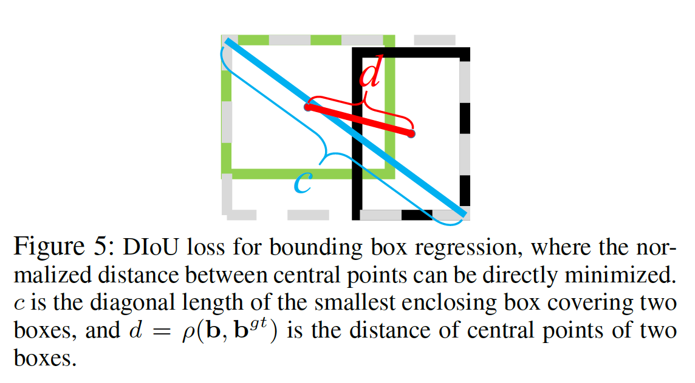

**Comparison with IoU and GIoU losses**   所提出的 DIoU 损失继承了 IoU 和 GIoU 损失的一些特性：

1. DIoU损失对回归问题的尺度仍然不变。
2. 与 GIoU 损失相似，当与目标框没有重叠时，DIoU 损失可以为边界框提供移动方向。
3. 当两个边界框完全匹配时，${\cal{L}}_{IoU} = {\cal{L}}_{GIoU} = {\cal{L}}_{DIoU} = 0$ 。当两个边界框离得很远时，${\cal{L}}_{GIoU} = {\cal{L}}_{DIoU} \rarr 2$ 。

​        而 DIoU 损失有几个 IoU 损失和 GIoU 损失没有的优点，其可以通过仿真实验评估。

1. 如图 1 所示，DIoU 损失可以直接最小化两个边界框的距离，因此收敛速度远快于 GIoU 损失。
2. 对于两个边界框在水平或垂直方向包含的情况，DIoU 损失可以使回归非常快速，而 GIoU 损失几乎衰退为 IoU 损失，即 $|C - A \cup B| \rarr 0$ 。

**Complete IoU Loss**

​		然后，我们回答**第二个**问题，建议一个好的边界框回归损失应该考虑三个重要的几何因素，即重叠面积、中心点距离和长宽比。通过统一坐标，IoU 损失考虑重叠面积，而GIoU损失严重依赖IoU损失。我们提出的DIoU损失旨在同时考虑重叠边界框的面积和中心点的距离。然而，边界框纵横比的一致性也是一个重要的几何因素。

​		因此，基于 DIoU 损失，通过增加纵横比的一致性，提出 CIoU 损失：

$${\cal{R}}_{CIoU} = \frac{\rho^2(\bold{b}, \bold{b}^{gt})}{c^2} + \alpha v, \tag{8}$$

其中 $\alpha$ 是正的平衡参数，而 $v$ 衡量纵横比的一致性：

$$v = \frac{4}{\pi^2}(\arctan\frac{w^{gt}}{h^{gt}} - \arctan\frac{w}{h})^2.\tag{9}$$

然后，损失函数定义为：

$${\cal{L}}_{CIoU} = 1 - IoU + \frac{\rho^2(\bold{b}, \bold{b}^{gt})}{c^2} + \alpha v. \tag{10}$$

平衡参数 $\alpha$ 定义为：

$$\alpha = \frac{v}{(1 - IoU) + v}, \tag{11}$$

其中重叠面积因子在回归中具有更高的优先级，特别是在非重叠的情况下。

​		最后，CIoU 损失的优化与 DIoU 损失相同，只是需要制定与 $w$ 和 $h$ 对应的 $v$ 的梯度：

$$\begin{align}\frac{\partial v}{\partial w} &= \frac{8}{\pi^2}(\arctan \frac{w^{gt}}{h^{gt}} - \arctan \frac{w}{h}) \times \frac{h}{w^2 + h^2}, \\ \frac{\partial v}{\partial h} &= -\frac{8}{\pi^2} (\arctan\frac{w^{gt}}{h^{gt}} - \arctan \frac{w}{h}) \times \frac{w}{w^2 + h^2}.\end{align}\tag{12}$$

当 $h$ 和 $w$ 在 $[0, 1]$ 之间时，分母 $w^2 + h^2$ 通常是一个很小的值，这可能产生梯度爆炸。因此，在我们的实验中，为了稳定收敛，简单地移除分母 $w^2 + h^2$ ，这通过将步长 $\frac{1}{w^2 + h^2}$ 替换为 1 来实现，梯度方向仍与式（12）一致。

**Non-Maximum Suppression using DIoU**

​		在原始的 NMS 中，使用 IoU 度量来一直冗余检测框，其中重叠面积式惟一因素，在重叠场景下，通常产生错误的抑制。本文中，我们认为 DIoU 是 NMS 的更好判断标准，因为在抑制判断标准中，不仅要考虑两个边界框的重叠面积，还要考虑两个边界框之间中心点的距离。对于具有最高得分的预测边界框，DIoU-NMS 可以公式化定义为：

$$s_i = \begin{cases}s_i, & IoU - {\cal{R}}_{DIoU}({\cal{M}}, B_i) < \varepsilon, \\0, & IoU - {\cal{R}}_{DIoU}({\cal{M}}, B_i) \ge \varepsilon, \end{cases} \tag{13}$$

其中，通过同时考虑两个边界框中心点之间的距离和 IoU 移除框 $B_i$ ，$s_i$ 是分类得分，$\varepsilon$ 是 NMS 阈值。我们认为两个中心点距离较远的边界框可能定位不同的物体，不应该被移除。此外，DIoU-NMS 仅需要几行代码就能灵活地集成到任何目标检测管道。

### Experimental Results

​	这一节中，在两个流行的基准测试（包含 PASCAL VOC 和 MS COCO）上，通过将DIoU 和 CIoU 损失纳入最佳的目标检测算法（包含一阶段检测算法（即 YOLOv3 和 SSD）和两阶段检测算法（即 Faster R-CNN））评估我们提出的 DIoU 和 CIoU 损失。

**YOLO v3 on PASCAL VOC**

​		PASCAL VOC 是最流行的目标检测数据集之一。在 PASCAL VOC 上，使用 DIoU 和 CIoU 损失训练 YOLOv3 与使用 IoU 和 GIoU 损失的 YOLOv3 进行比较。我们使用 VOC 07+12 （VOC 2017 trainva 和 VOC 2012 trainval 的并集）作为训练集（包含 20 个类，16551 张图像）。测试集为 VOC 2007 test ，其包含 4952 张图像。骨干网络为 DarkNet608 。我们严格遵循（Rezatofighi et al. 201）发布的 GDarkNet 训练协议，最大迭代设置为50K。每个损失的性能见表 1 。我们使用相同的性能测量，即 AP（不同 IoU 阈值的 10 个 mAP 的均值）=（AP50 + AP55 + ... + AP95）/ 10 和 AP75 。我们也报告了使用 GIoU 度量的评估结果。

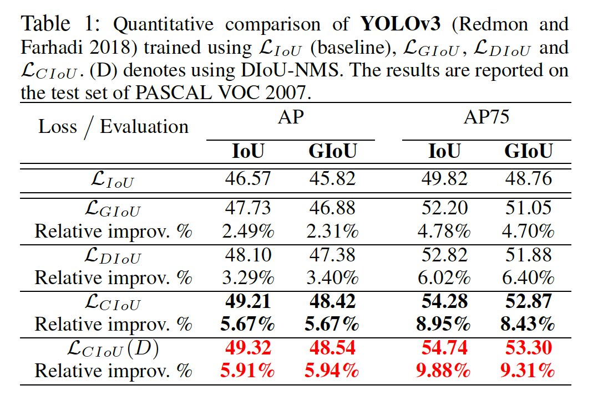

​		根据图 6 ，可以看出 CIoU 损失预测的边界框比 GIoU 损失预测的边界框更准确。

​	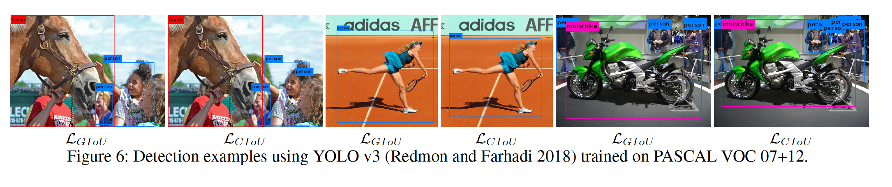

**SSD on PASCAL VOC**

​		我们使用另一个流行的方法 SSD 来进一步执行评估实验。SSD 采用最新的 PyTorch 实现。训练集和测试集与 YOLO v3 相同，最大训练迭代次数为 120K 。骨干网络为 ResNet-50-FPN 。默认的边界框回归损失为 smooth $l_1$ 范数，它与基于 IoU 的损失是不同的量级。因此，在回归损失和分类损失之间应该有一个更合适的权衡。我们观察到，对于密集锚算法，合适地增加回归损失可以增加性能。因此，为了公平比较，对于这些基于 IoU 的损失，我们将回归损失的权重固定为 5 。然后，我们使用 IoU、GIoU、DIoU 和 CIoU 损失训练模型。表 2 给出了量化比较，其中报告了 AP 和 AP75 。

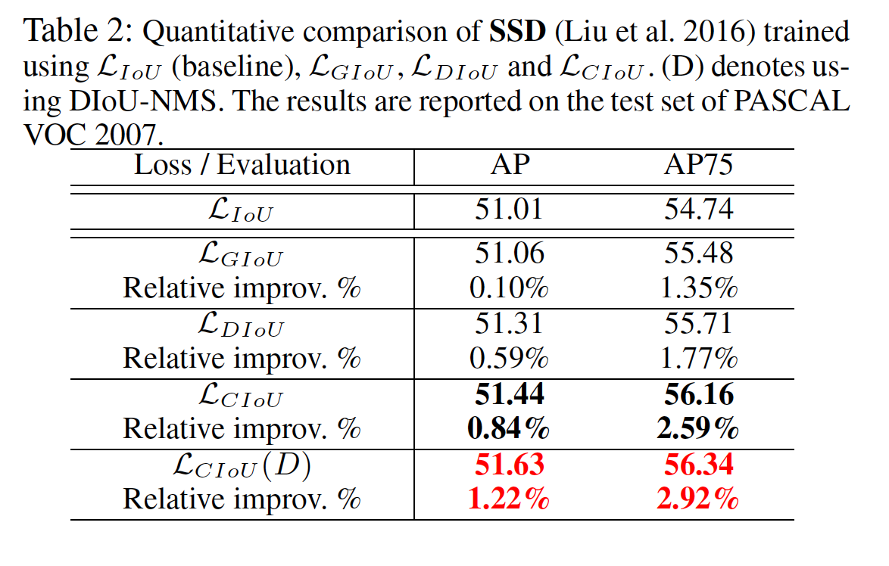

**Faster R-CNN on MS COCO**

​		我们还使用 Faster R-CNN 在另一种更困难和负责的数据集——MS COCO 2017 上评估所提出的方法。MS COCO 是大尺度数据集，包含超过 118K 的图像用于训练、5K的图像用于评估。遵循（Rezatofighi et al. 2019）相同的训练协议，我们比较用 DIoU 和 CIoU 损失训练的模型与 IoU 和 GIoU 损失训练的模型。骨干网络为 ResNet-50-FPN 。除 AP 和 AP75 度量标准外，还有大型、中型和小型尺度目标上的评估。对于回归损失的平衡权重，为了公平比较，对于所有损失，权重都设置为 12 。表 3 报告了量化比较结果。

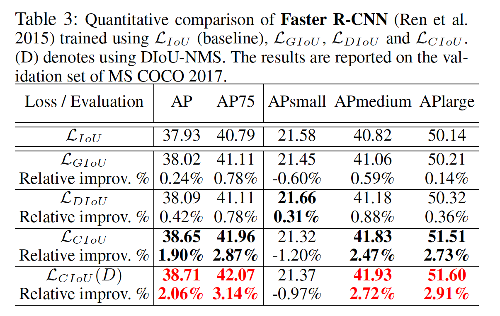

​		Faster R-CNN 是具有密集锚框的检测算法，在初始场景中通常具有高 IoU 水平。几何上讲，Faster R-CNN 上的回归情况可能位于图 4 的盆地 ，其中 IoU、GIoU 和 DIoU 损失都有好的性能。因此，GIoU损失的增加仅比基线 IoU 损失高很少，如图 3 所示。但是我们的 DIoU 和 CIoU 损失对性能作出的贡献比 IoU 和 GIoU 更高。由图 7 可知，人们可以很容易地发现 CIoU 损失比 DIoU 损失有更准确的检测框。人们可以注意到，在 $AP_{\mbox{small}}$ 方面，CIoU 损失失比原始的 IoU 损失小一点，但 DIoU 损失比其他所有损失都好。 也就是说，长宽比的一致性可能对小目标的回归精度没有贡献。实际上，对于小目标，中心点距离比长宽比更重要，这是合理的，长宽比可能会削弱两个边界框之间的归一化距离的影响。然而，对于中型和大型目标，CIoU 损失的性能远比其他损失的性能更好，而对于小型目标，副作用可以通过 DIoU-NMS 来缓解。

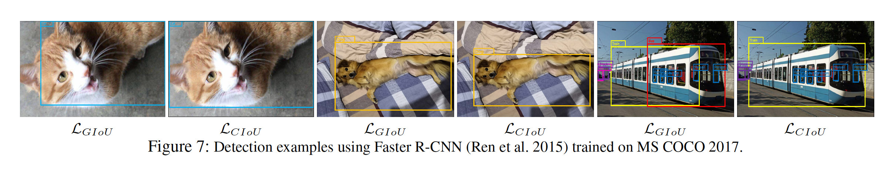

**Discussion on DIoU-NMS**

​		在表1、2和3中，我们报告了与原始 NMS（${\cal{L}}_{CIoU}$）和DIoU-NMS（${\cal{L}}_{CIoU (D)}$）合作的 CIoU 损失的结果，其中阈值遵循原始NMS的默认设置，即，对于 YOLO v3 和 SSD，$\varepsilon= 0.45$；对于 Faster R-CNN，$\varepsilon = 0.50$ 。对于大多数情况，DIoU-NMS 比原始的 NMS 产生更高的性能。图 8 展示了 DIoU-NMS 可以更好保持准确的检测边界框，其中在 PASCAL VOC 上训练的 YOLO v3 来检测 MS COCO 上的目标。为了进一步验证DIoUNMS相对于原始NMS的优越性，我们进行了对比实验，将原始NMS和DIoU-NMS与YOLO v3配合，使用CIoU loss进行SSD训练。我们在大范围阈值$[0.43,0.48]$对原始NMS和DIoU-NMS进行了比较。由图9可知，在每个阈值上，DIoU-NMS都比原始的NMS好。此外，值得注意的是，即使是最糟糕的性能的DIoU-NMS至少是可比或优于最好的性能的原始NMS。也就是说，即使不仔细调整阈值，我们的DIoU-NMS通常也能比原来的NMS表现得更好。

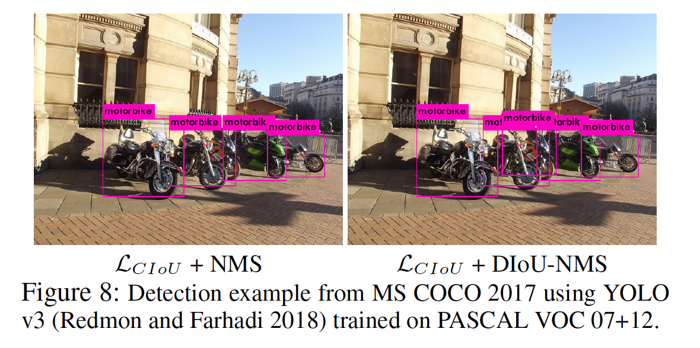

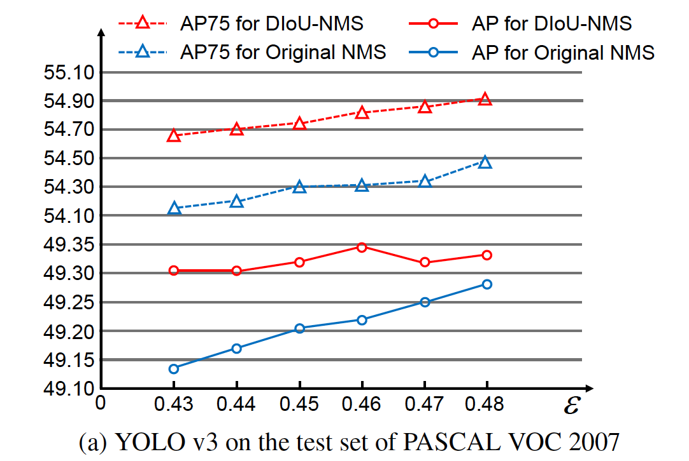

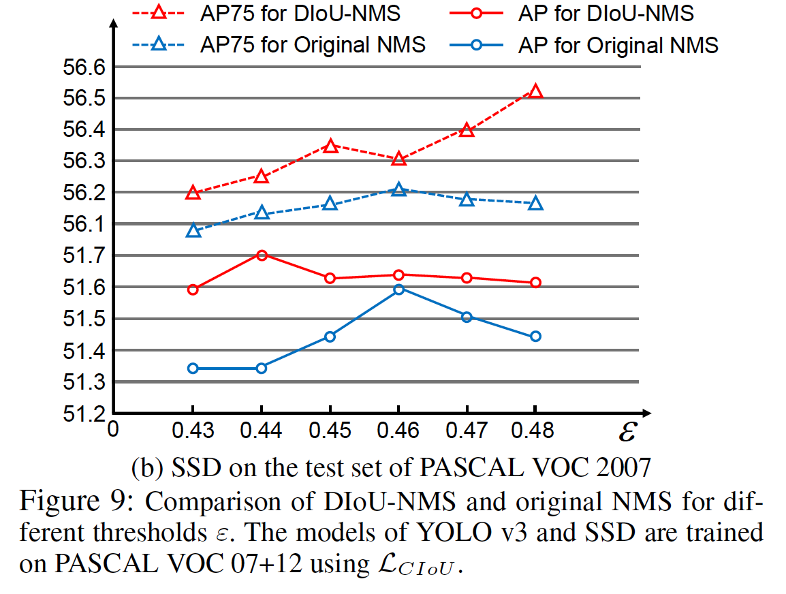