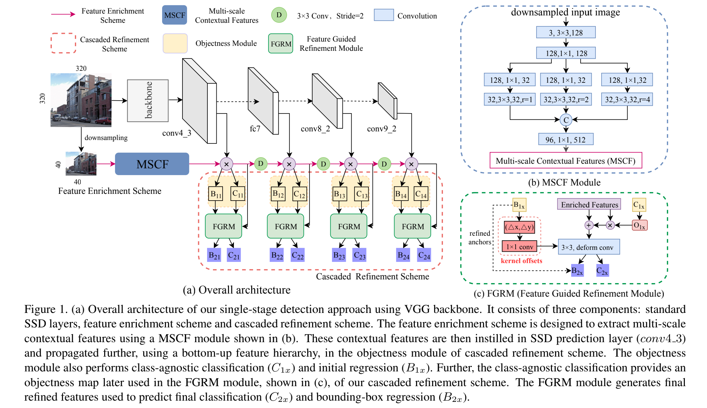
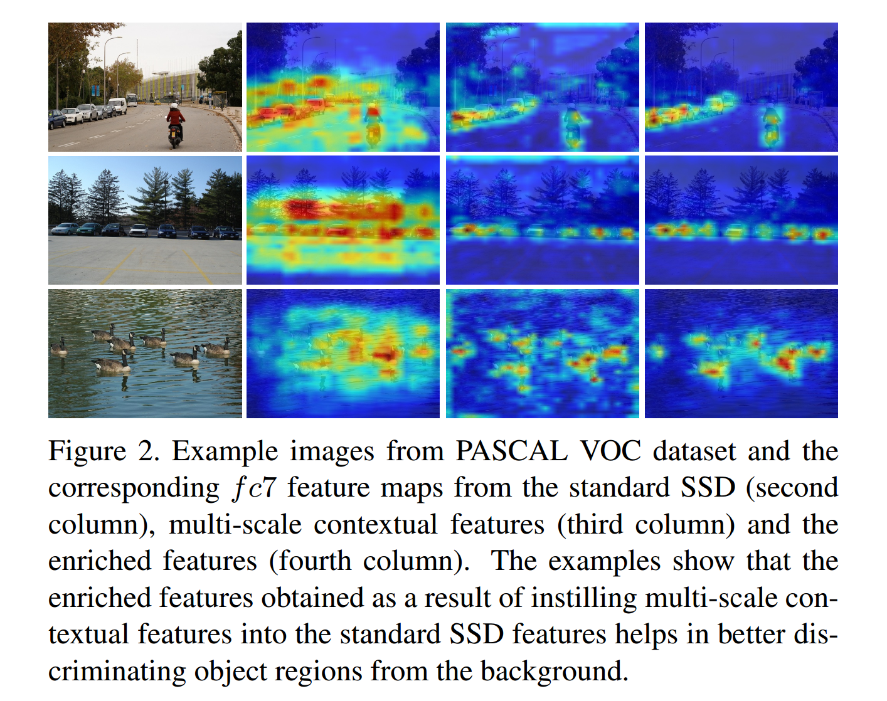
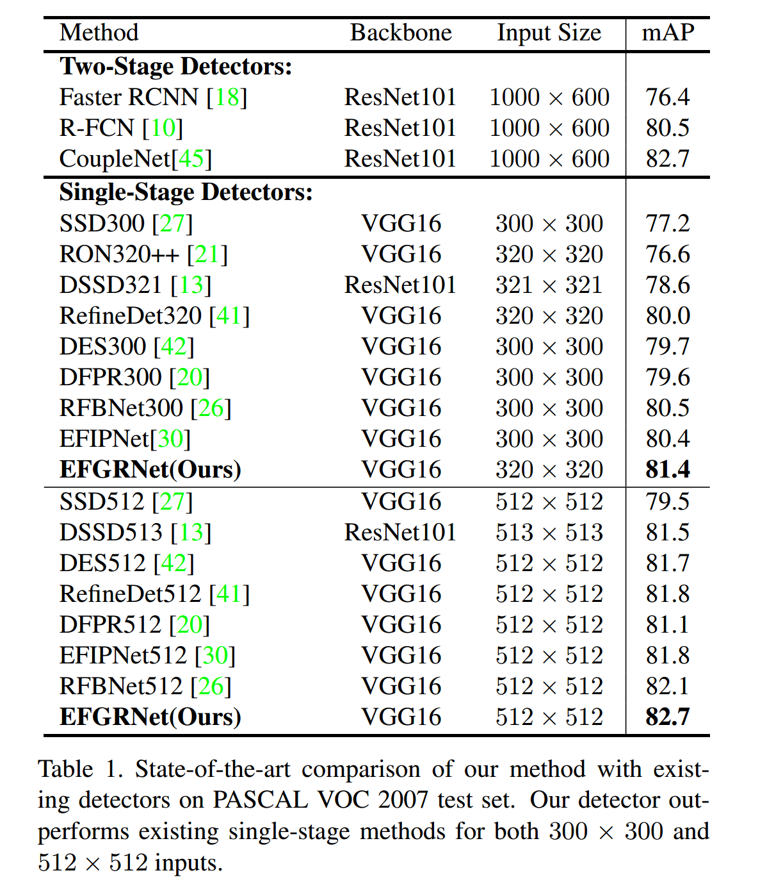
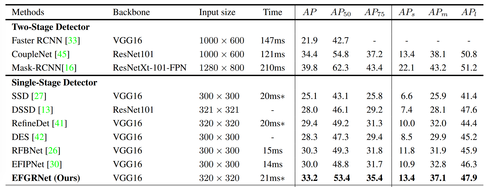
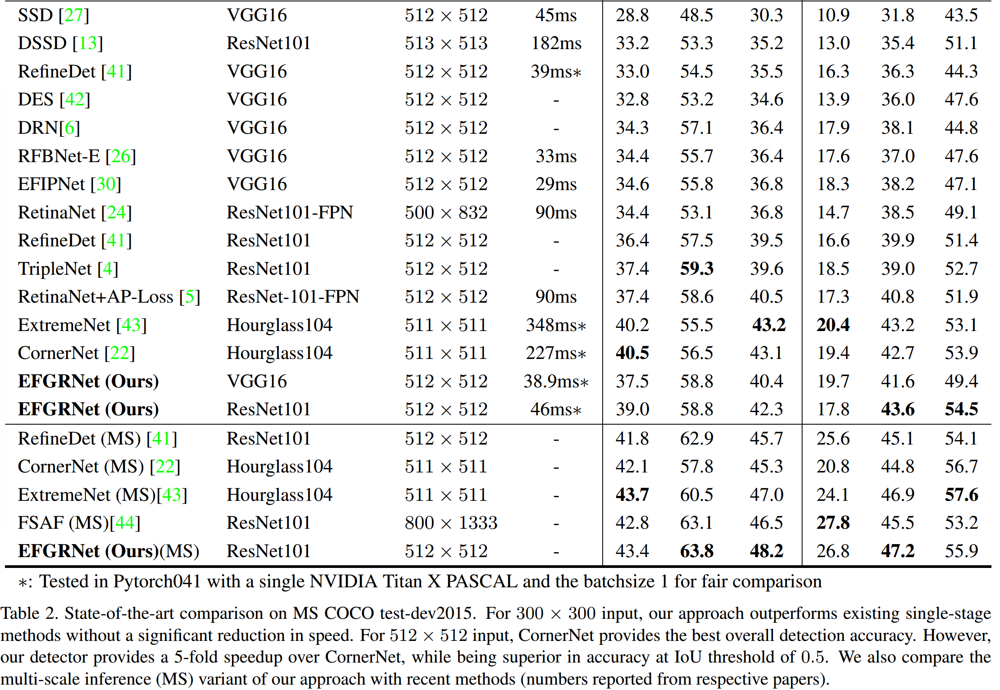
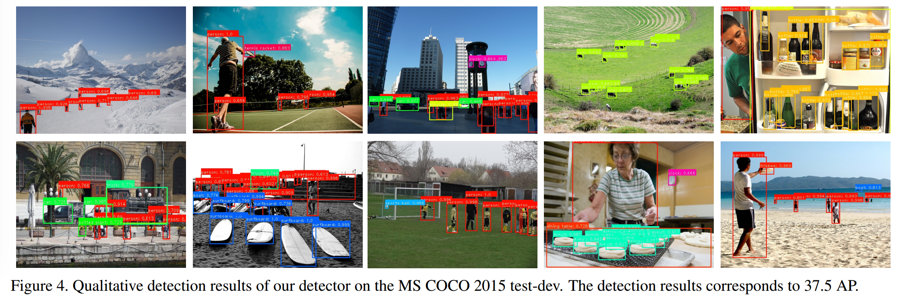
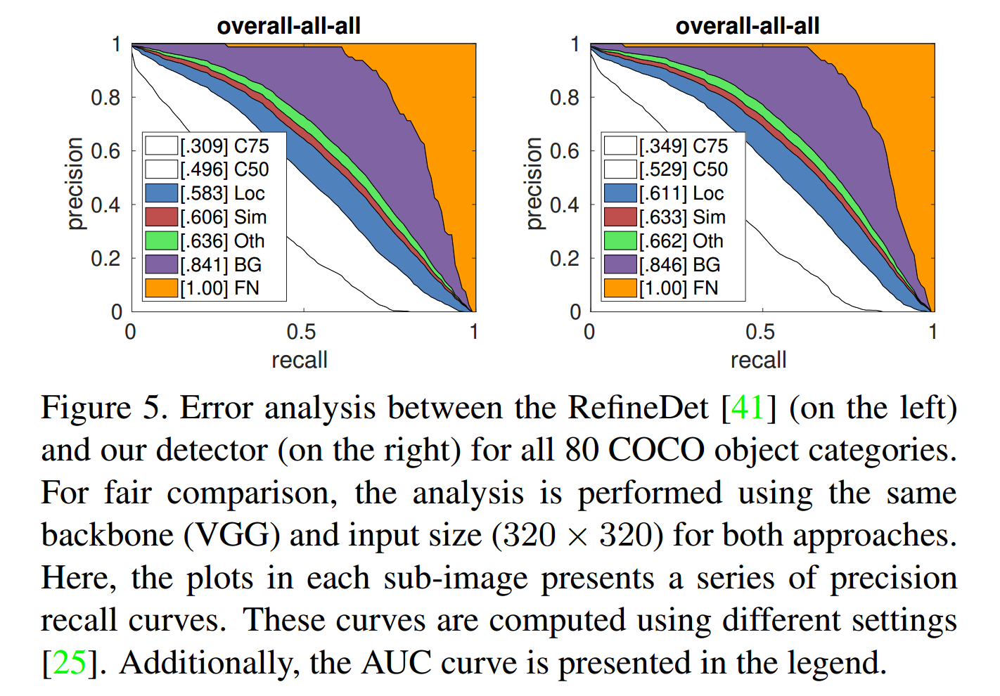
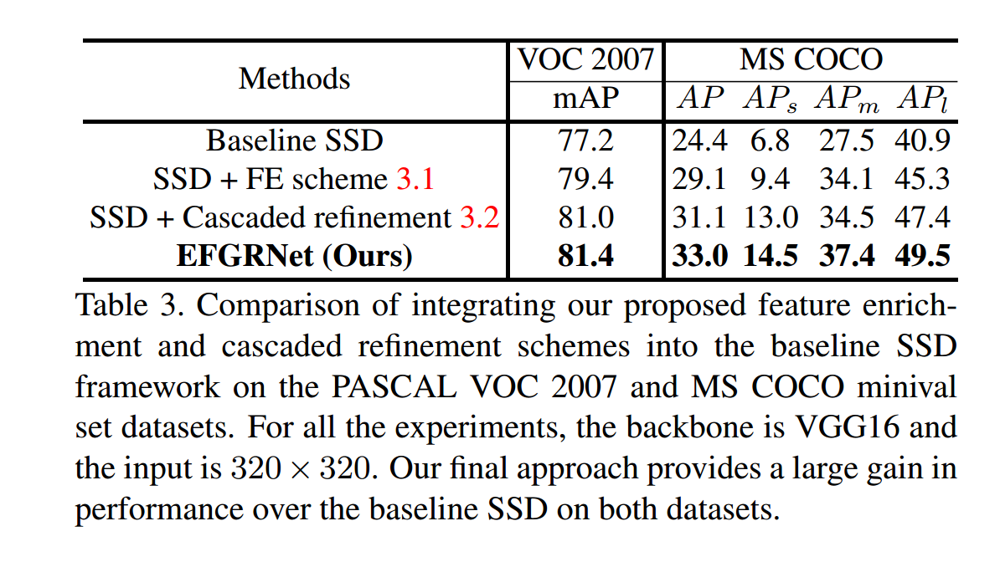
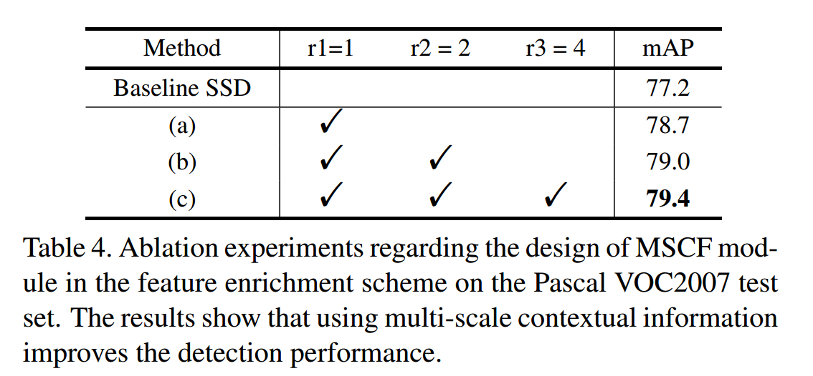
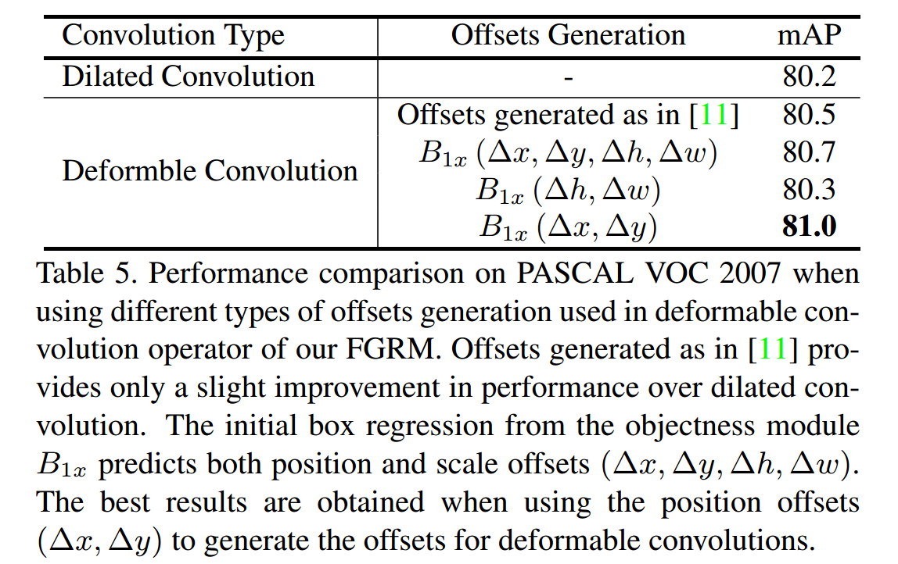

### Enriched Feature Guided Refifinement Network for Object Detection

#### 摘要

​		我们提出联合解决多尺度目标检测和类不平衡问题的一阶段检测框架。我们引入简单而有效的特征丰富方案来产生多尺度上下文特征，而不是设计更深的网络。我们进一步引入级联的精炼方案，首先将多尺度上下文特征灌输到一阶段检测器的预测层，从而丰富多尺度检测的辨别能力。接着，级联的精炼方案通过精炼锚来处理类不平衡问题，并通过丰富特征来提高分类和回归。在两个基准上进行实验：PASCAL VOC和MS COCO。对于MS COCO test-dev上的$320 \times 320$的输入，我们的检测在单尺度推理上，获得了33.2 COCO AP的最佳单阶段检测准确率，同时在Titan XP GPU推理时间为21毫秒。对于$512 \times 512$的输入，与最佳的单阶段结果相比，COCO AP增加了1.6%。

#### 1. 引言

​		本文贡献：

- 第一，我们引入一种特征丰富方案，以提高标准SSD中的预测层的判别能力。与其加深骨干模型，不如设计特征丰富方案来产生多尺度上下文特征。我们进一步引入具有双目标函数的级联精炼方案。首先，它将自下而上的金字塔特征层次结构中的多尺度上下文特征注入到标准SSD预测层中。产生的丰富的特征对尺度变化更加鲁棒。
- 第二，它通过利用丰富的特征执行与类无关的分类和边界框回归以实现精确定位，从而解决了类不平衡问题。之后，进一步利用边界框回归和二元分类来完善相关的丰富特征，以获得最终分类分数和边界框回归。

#### 3. 方法

##### 3.1. Feature Enrichment Scheme

​		在标准的SSD框架中，从深度卷积网络主干（例如VGG16或ResNet）中提取特征执行卷积和最大池操作的重复过程。尽管保留一定程度的语义信息，但是它们仍然会丢失可能有助于区分目标区域和背景区域的低级特征信息。此外，每个预测层的常量感受野仅捕获固定的上下文信息。在这项工作中，我们引入特征丰富（Feature Enrichment: FE）方案来捕获多尺度上下文信息。我们首先通过简单的池化操作对输入图像进行下采样，以使其尺寸与SSD第一个预测层的尺寸相匹配。然后，将下采样的图像传入Multi-Scale Contextual Feature（MSCF）模块。

**Multi-Scale Contextual Feature:**  所提出的MSCF模块如图1（b）中的蓝色虚线。它是由几个卷积操作组成的简单模块，并产生多尺度上下文特征。MSCF模块的结构受多分支ResNeXT体系结构的启发[39，31]，是拆分、变换和聚合策略的一种操作。MSCF模块将下采样图像作为输入，并输出上下文增强的多尺度特征。下采样的图像首先传入两个连续的核大小为$3 \times 3$和 $1\times1$的卷积层，产生最初的特征映射。然后，这些特征映射通过$1\times1$卷积层划分为三个低维度的分支。为了捕获多尺度上下文信息，在不同分支中，我们采样膨胀率为1、2和4的三个膨胀卷积。膨胀卷积操作将最初的特征映射转换为上下文增强的特征集。然后，这些转换的特征通过串联操作聚合，并传入$1\times1$卷积。MSCF输出用于我们级联精炼方案的Objectness Module（OM）。

##### 3.2. Cascaded Refinement Scheme

​		我们的精炼方案包含两个级联模块：objectness和feature guided refinement module（FGRM），如图1（a）所示。OM利用多尺度上下文信息丰富SSD特征，并确定可能的对象位置（objectness）。利用多尺度上下文信息丰富特征提高小目标上的性能，而objectness预测用于FGRM以处理类不平衡问题。

**Objectness Module：** Objectness模块首先通过逐元素乘法运算从$conv4\_3$的MCSF模块中灌入多尺度上下文特征，从而丰富了SSD的功能。然后，我们引入了一个自下而上的金字塔特征层次结构，以将丰富的特征传播到后续的SSD预测层，如图1（a）所示。OM使用步长为2的$3\times3$卷积（D），并将特征从上一层映射到与当前层相符的空间分辨率和通道数。然后通过在映射特征和SSD特征之间执行逐元素乘法而获得丰富的特征。最后，丰富的特征用于在每个预测层$x$执行二分类（$C_{1x}$）和初始的边界框回归（$B_{1x}$），这里$x=1,2,3和4$对应四个预测层。

​		图2展示了PASCAL VOC数据集上的示例图像，其对应标准SSD（第二列）、D之后的多尺度上下文特征（第三列）和丰富的特征（第四列）。示例证明利用多尺度上下文信息丰富的特征有助于更加关注包含目标实例的区域。OM的二分类$C_{1x}$输出进一步用于FGRM，并通过过滤掉大量负锚来减少正负锚之间的类不平衡。此外，$C_{1x}$输出用于生成注意力图来引导丰富的特征更关注目标，同时抑制背景。

**Feature Guided Refinement Module：** 我们的FGRM包含三步：objectness map generation、kernel offsets extraction 和local contextual information extraction（见图1（c））。接下来，我们描述这三步。

_Objectness Map Gerneration：_ OM中的二分类（$C_{1x}$）输出将每个锚预测为目标或背景，其用于生成突出可能目标位置的objectness图$O_{1x}$。我们在给定空间位置的所有锚的目标类别预测上沿通道轴执行最大池化操作，然后进行sigmoid激活。因此，产生空间Objectness图$O_{1x}$，其用于提高OM获得的丰富特征$F_{in}$：

$$F_m = F_{in} \bigodot O_{1x} + F_{in}, \tag{1}$$

其中$\bigodot$为逐元素乘法，$F_{in}$为丰富后的特征。

_Kernel Offsets Extraction：_ OM和FGRM中的边界框回归预测四个输出：$\Delta x$、$\Delta y$、$\Delta h$和$\Delta w$。前两个$(\Delta x, \Delta y)$对应空间偏移，而后两个$(\Delta w, \Delta h)$对应空间维度的尺度偏移。这里，我们使用来自$(\Delta x, \Delta y)$的空间偏移，通过估计核偏移$\Delta p_k$来引导FGRM的特征精炼：

$$\Delta p_k = f^{1\times1}(B_{1x}^{\Delta x, \Delta y}), \tag{2}$$

其中，$f^{1\times1}$表示核大小为$1\times1$的卷积层，而$B_{1x}^{\Delta x, \Delta y}$表示OM预测的空间偏移$(\Delta x, \Delta y)$。最后，核偏移用作可变形卷积的输入[11]，以引导特征采样并与精化的锚点对齐。

_Local Contextual Information：_ 为了在某个空间位置进一步增强上下文信息，我们在FGRM中使用膨胀卷积。我们在步长为8、16、32和64的SSD的预测层中将膨胀率设置为5、4、3和2。

​		总之，FGRM中的所有操作之后的最终的精炼特征$F_{rf}$公式为：

$$F_{rf}(p_0)=\sum_{p_k \in R}w(p_k)\cdot F_m(p_0+p_k\cdot d + \Delta p_k), \tag{3}$$

其中$p_0$表示最终精炼特征图$F_{rf}$中的每个空间位置，$d$为膨胀率。$R$是用于采样输入特征的规则网格（即如果核为$3\times3$，膨胀率为1，那么$R=(-1,-1),(-1,0),\cdots,(0,1),(1,1)$）。最终的精炼特征$F_{rf}$为通过$w$加权的采样值之和。$\Delta p_k$为核偏移，用于扩展常规采样网格，从而增强了CNN建模几何变换的能力。一般而言，在可变形卷积中，通过将卷积应用到相同输入特征图而生成偏移。在FGRM中，通过OM的第一个边界框回归生成偏移。为了获得精炼的锚位置，我们遵循如[41]的相似策略。我们利用OM预测的偏移（$B_{1x}$）来精炼原始的锚位置。因此，精炼的位置和精炼的特征$F_{rf}$用于执行多类别分类（$C_{2x}$）和边界框回归（$B_{2x}$）。

#### 4. 实验

##### 4.1. 数据集和评估指标

**Datasets:**  PASCAL VOC 2007 和 MS COCO。

##### 4.2. 实现细节

​		采用ImageNet上预训练的VGG-16作为骨干架构。我们为模型初始化和优化使用相同的设置。设置采用的热启动策略为，在前5个epoch中，将学习了从$10^{-6}$增加到$4\times 10^{-3}$。然后，以10倍的因子逐渐减小学习了，对于PASCAL VOC 2007数据集为150和200个epoch，对于MS COCO数据集为90、120和140。对于两个数据集，权重衰减设置为0.0005、momentum设置为0.9、批大小设置为32。实验中，PASCAL VOC 2007和MS COCO数据集分别训练250和160个epoch。除VGG-16外，还在COCO数据集上使用ResNet-101上训练。对于ResNet-101，截断的ResNet-101骨干的顶部添加两个卷积层（即$res6\_1$、$res6\_2$），并使用四个预测层（$res3$、$res4$、$res5$、$res6\_2$）进行检测。

##### 4.3. 最佳结果比较

**PASCAL VOC 2007：** 表1为PASCAL VOC 2007上的比较结果。

图3为PASCAL VOC 2007测试集上的结果。

**MS COCO：** 表2为MS COCO上的量化比较。

图4为为MS COCO2015测试集上结果

图5将RefineDet和本文的方法做了比较：

##### 4.4. 基线比较

**PASCAL VOC 2007上的消融研究：** $r1$、$r2$和$r3$表示MSCF中的分支数。

