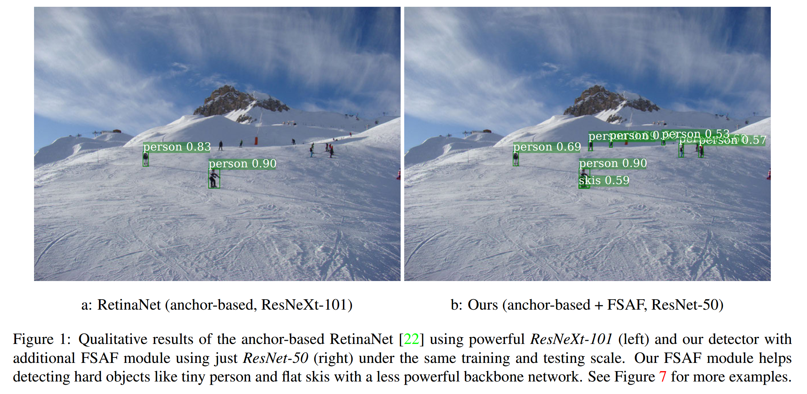
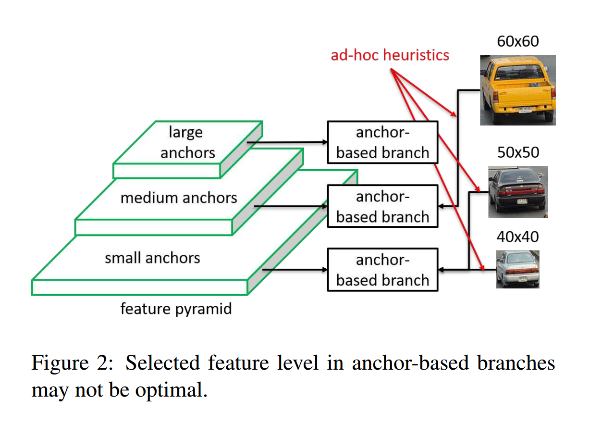
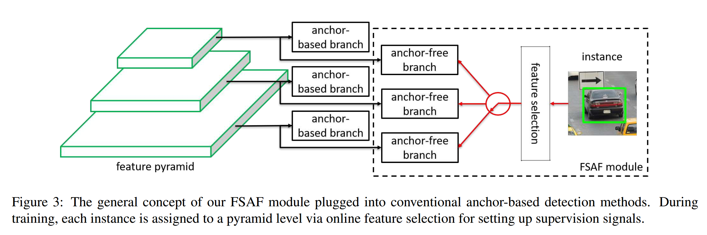
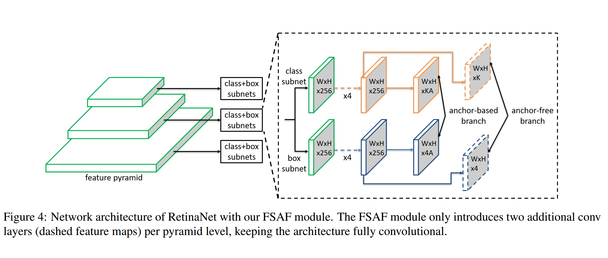
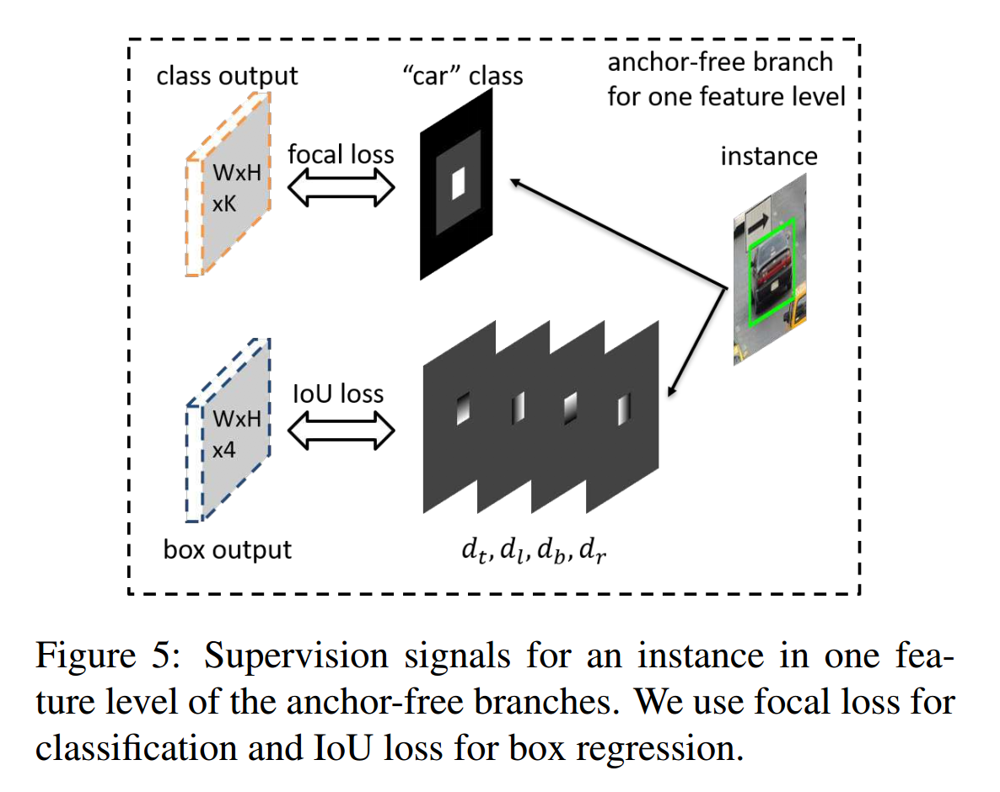
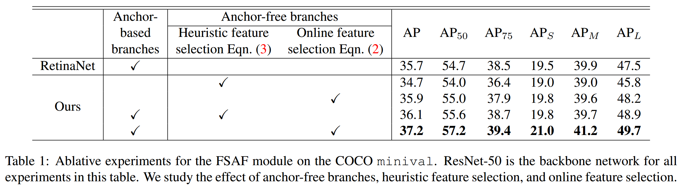
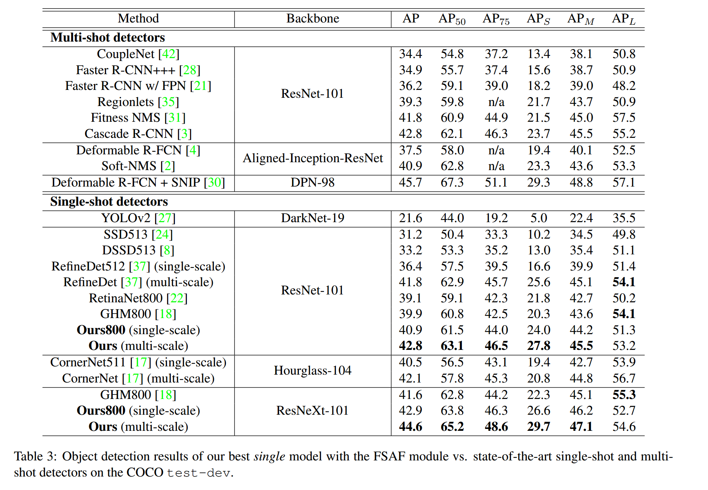

### Feature Selective Anchor-Free Module for Single-Shot Object Detection

#### Abstract

​		作者提出功能选择性免锚（Feature Selective Anchor-free：FSAF）模块，这是用于单发目标检测器的简单有效的构建块。它可以插入具有特征金字塔结构的单发检测器。FSAF模块处理由一般基于锚检测带来的两个局限：1）基于启发式的特征选择；2）基于重叠的锚采样。FSAF模块的通用概念是将在线特征选择应用到多级无锚分支的训练。具体而言，将无锚分支附加到特征金字塔的每一级，其允许在任意级上以无锚的形式进行边界框编码和解码。训练期间，作者将每个实例动态分配到最合适的特征层。在推理期间，FSAF模块可以独立工作或者与基于锚的分支联合工作。作者通过无锚分支的简单实现和在线特征选择策略来实例化此概念。COCO检测上的实验结果表明FSAF模块比基于锚的副本更准确，同速度更快。当与基于锚的分支联合使用时，FSAF模块在不同设置下大幅改善基线RetinaNet，同时引入几乎可以忽略的推理成本。并且产生的最好模型可以获得44.6%mAP的最佳结果，这优于COCO上所有已有的单发检测器。

#### 1. Introduction

​		目标检测一个长期代表型问题是尺度变化。为了获得尺度不变性，研究人员构建了特征金字塔或多级特征塔。并且并行地生成特征图的多尺度级。此外，锚框可以进一步处理尺度变化。锚框设计用于将所有可能的实例框的连续空间离散为具有预定义位置、尺度和纵横比的有限数量的框。基于IoU重叠将实例边界框分配给锚框。当与特征金字塔集成时，大型锚通常与上层特征图关联，而小型锚与更低层的特征图关联，见图2。这是基于启发似的方法，更高层特征图有更多的语义信息，适合检测大型实例，而更低层的特征图有更细粒度细节，适合检测小型实例。将锚框集成到特征图的设计在目标检测基准上获得良好的性能。

​		然而，这种设计有两个局限：**1）启发式引导的特征选择；2）基于重叠的锚采样**。训练期间，每个实例总是根据IoU重叠来匹配最接近的锚。并通过人为规则将锚框与特征图的特定级关联。因此，每个实例选择的特征级纯粹基于_ad-hoc heuristics_ 。例如，一个 $50 \times 50$ 像素的汽车实例和另一个 $60 \times 60$ 像素的相似汽车实例可能分配到两个不同的特征级，而另一个 $40 \times 40$ 的汽车实例可能被分配到与 $50 \times 50$ 实例的相同级，如图2所示。换句话说，锚匹配机制本质上是启发式引导的。这导致选择的用以训练每个实例的特征层可能不是最优的。

​		本文提出一种简单而有效的方法（称为feature selective anchor-free：FSAF）来同时处理上述两个局限。本文的动机是让每个实例自由地选择最佳的特征层来优化网络，因此，在这个模块中，应当是没有锚框来限制特征选择。相反，本文以无锚的形式编码实例，从而学习分类和回归中的参数，见图3。无锚分支构建在每个特征金字塔层还是那个，其与基于锚的分支独立。与基于锚的分支相似，包含分类子分支和回归子分支。一个实例可以分配到无锚分支的任意层。训练期间，作者基于实例内容（而不仅仅是实例框的大小）为每个实例动态选择最合适的特征层。然后，所选级别的特征将学习检测分配的实例。在推理期间，FSAF模块可以独立运行或者与基于锚的分支联合。FSAF模块与骨干网络无关，并且可以用于具有特征金字塔结构的单发检测器。此外，无锚分支的实例化和在线特征选择可以是多样的。本文中，作者可以保持FSAF模块的实现是简单的，使得其计算成本与整个网络相比是很少的。

​		COCO目标检测基准上的广泛实验证明了本文方法的有效性。FSAF模块本身优于基于锚的模块，并且运行速度更快。当与基于锚的分支机构一起工作时，FSAF模块可以在各种骨干网中大幅度提高稳定的基线，同时引入了最低的计算成本。特别是，作者使用ResNeXt-101的RetinaNet将准确率提高1.8%，而仅有6ms的推理延迟。此外，当采用多尺度测试时，最终的检测器获得了44.6%mAP的最佳结果，优于COCO上所有已有的单发检测器。

#### 3. Feature Selective Anchor-Free Module

##### 3.1. Network Architecture

​		从网络的观点，FSAF模块是令人吃惊的简单。图4展示了具有FSAF模块的RetinaNet[22]。简而言之，RetinaNet有骨干网络（图中未示出）和两个任务特定的子分支。特征金字塔有骨干网的$P_3$到$P_7$层构成，其中$l$是特征层，$P_l$为输入图像分辨率的$1/2^l$。图中仅例举了三层。金字塔的每层用于在不同尺度检测目标。为此，将分类子网络和回归子网络添加到$P_l$。它们都是小型的全卷积网络。分类子网络在每个空间位置预测$A$个锚和$K$个目标类别中每一个的概率。如果实例存在，回归子网络预测$A$个锚中每一个的4维类无关的偏移。

​		在RetinaNet的顶部，FSAF模块仅在每个特征层引入两个额外的卷积层，如图4的虚线所示。这两层负责在无锚分支中分别进行分类和回归预测。具体而言，具有$K$个滤波器的$3 \times 3$卷积层附加到分类子网络的特征图，然后附加一个sigmoid函数，与基于锚分支分类层并行。它在每个空间位置预测$K$个目标类的概率。相似地，有4个滤波器的$3 \times 3$卷积层附加到分类子网络的特征图上，后面跟一个ReLU函数。它负责预测以无锚形式编码的边界框偏移。为此，无锚和基于锚的分支以多任务的形式联合运行，其在每个金字塔层共享特征。

##### 3.2. Ground-truth and Loss

​		给定一个目标实例，已知其类标签$k$和边界框坐标$b = [x, y, w, h]$，其中$(x,y)$为边界框中心，$w, h$分别为宽和高。训练期间，实例可以分配到任意的特征层$P_l$。作者将映射边界框$b_p^l=[x_p^l,y_p^l,w_p^l,h_p^l]$ 定义为 $b$ 在特征金字塔$P_l$上映射，即$b_p^l=b/2^l$。还分别定义了由常量缩放因子$\epsilon_e$和$\epsilon_i$控制的与$b_p^l$成比例的有效边界框$b_e^l=[x_e^l,y_e^l,w_e^l,h_e^l]$和忽略边界框$b_i^l=[x_i^l,y_i^l,w_i^l,h_i^l]$，即$x_e^l=x_p^l,x_e^l=y_p^l,w_e^l=\epsilon_e w_p^l,h_e^l=\epsilon_e h_p^l,x_i^l=x_p^l,y_i^l=y_p^l,w_i^l=\epsilon_i w_p^l,h_i^l=\epsilon_ih_p^l$，其中$\epsilon_e=0.2$，$\epsilon_i=0.5$。以汽车为例的ground-truth生成的例子如图5所示。

**Classification Output:**   分类输出的ground-truth为$K$个图，其中每个图对应一个类。实例在三个方面影响第 $k$ 个ground-truth图。第一，$b_e^l$区域的有效边界框是由1填充的正类区域，如图5中“汽车”类的白色边界框，它表明了实例的存在性。第二，排除有效边界框的忽略边界框$(b_i^l - b_e^l)$如图5中的灰色区域，其意味着这个区域中的梯度不会反向传播到网络。第三，如果在相邻特征层$(b_i^{l-1},b_i^{l+1})$存在忽略边界框，那么它们也是忽略区域。注意，如果两个实例的有效边界框在同一层重叠，那么更小的实例有更高的优先级。ground-truth图的余下区域为由零填充的负（黑色）区域。将Focal Loss用作监督，超参数$\alpha = 0.25$，$\gamma = 2.0$。一幅图像中无锚分支的分类损失为所有非忽略区域的focal loss之和，这个损失值通过所有有效边界框区域中的像素数归一化。

**Box Regression Output:**   分类输出的ground-truth是与类无关的4歌偏移图。实例仅影响偏移图中的$b_e^l$区域。对于$b_e^l$中的每个像素位置$(i,j)$，将映射边界框 $b_p^l$ 表示为4维向量 $d_{i,j}^l = [d_{t_{i,j}}^l,d_{l_{i,j}}^l,d_{b_{i,j}}^l,d_{r_{i,j}}^l]$，其中 $d_t^l, d_l^l, d_b^l, d_r^l$分别为当前像素位置$(i,j)$到 $b_p^l$ 的顶部边界、左边界、底部边界和右边界的距离。然后，在位置$(i,j)$处跨越4个偏移图的4维向量设置为 $\mathbf{d}_{i,j}^l/S$，其中每个图对应一个维度。$S$ 为标准化长了，本文中通过经验选择 $S=4.0$ 。有效边界框之外的区域为灰色，其中的梯度将忽略。图像中无锚分支的全部回归损失为所有有效边界框区域的IoU损失的平均。

​		推理期间，从分类和回归输出解码预测边界框是直接的。在每个像素位置$(i,j)$，假设预测偏移为 $[\hat{o}_{t_{i,j}}, \hat{o}_{l _{i,j}},\hat{o}_{b_{i,j}},\hat{o}_{r_{i,j}}]$ 。然后，预测距离为 $[S\hat{o}_{t_{i,j}}, S\hat{o}_{l _{i,j}},S\hat{o}_{b_{i,j}},S\hat{o}_{r_{i,j}}]$。预测的映射边界框的左上角和右下角分别为 $(i - S\hat{o}_{t_{i,j}}, j - S \hat{o}_{l_{i,j}})$和$(i + S\hat{o}_{b_{i,j}}, j - S \hat{o}_{r_{i,j}})$。最后，进一步将映射边界框放大 $2^l$ 倍以获得图像平面的最终边界框。边界框的置信度得分和类别可以由输出图上位置$(i,j)$处的最大得分和分类$K$维向量的相应类别确定。

##### 3.3. Online Feature Selection

​		无锚分支的设计允许我们使用任意金字塔层 $P_l$ 的特征学习每个实例。为例找出最优的特征层，FSAF模块基于实例内容选择最佳的 $P_l$，而不是基于锚方法中的实例框的大小。

​		给定实例 $I$，将$P_l$上的分类损失和边界框回归损失分别定义为 $L_{FL}^i(l)$ 和 $L_{IoU}^I(l)$ 。通过平均有效边界框区域 $b_e^l$ 上的焦点损失和IoU损失计算损失值，即

$$\begin{align}L_{FL}^I(l) &= \frac{1}{N(b_e^l)}\sum_{i,j \in b_e^l}FL(l,i,j) \\ L_{IoU}^I(l) &= \frac{1}{N(b_e^l)}\sum_{i,j\in b_e^l}IoU(l,i,j)\end{align} \tag{1}$$

其中 $N(b_e^l)$ 为 $b_e^l$ 区域中像素数，$FL(l,i,j)$、$IoU(l,i,j)$ 分别为位置$(i,j)$处的焦点损失和IoU损失。

​		图6给出了在线特征选择过程。首先，将实例 $I$ 穿过特征金字塔的所有层。然后，在所有无锚分支中，使用公式（1）计算 $L_{FL}^I(l)$ 和 $L_{IoU}^I(l)$ 之和。最后，最佳的特征金字塔层 $P_{l*}$ 产生的最小损失之和倍用于学习实例，即

$$l^\ast = \arg\min_l L_{FL}^I(l) + L_{IoU}^I(l) \tag{2}$$

对于训练batch，针对特征相应分配的实例更新。直觉是当前所选的特征是对实例建模的最佳方式。它的损失在构成特征空间中的更低边界。并且通过训练，进一步降低了这个下界。在推理期间，因为最合适的金字塔特征层自然输出高置信度得分，所以不需要选择特征。

​		为了验证在线特征选择的重要性，作者还执行启发式特征选择过程，见4.1节中消融研究。启发式特征选择纯粹依赖边界框的大小。作者借鉴了FPN检测器的思想。实例 $I$ 通过下面的公式设计用于特征金字塔的 $P_{l'}$层：

$$l' = \lfloor l_0 + \log_2(\sqrt{wh} / 224) \rfloor \tag{3}$$

这里224为标准的ImageNet预训练大小，$l_0$ 为$w \times h = 224^2$ 的实例映射到的目标层。本文中，设置 $l_0 = 5$，因为ResNet使用第5个卷积组的特征图来做最后的分类。

##### 3.4. Joint Inference and Training

​		当将FSAF插入到ResNet时，FSAF模块可以与基于锚的分支联合工作（图4）。本文保持基于锚的分支与原始的一致，并且训练和推理中保持超参数不变。

**Inference：** FSAF模块仅仅添加了少量卷积层到全卷积的ResNet，因此推理仍然与前馈一幅图像经过网络一样简单。对于无锚分支，在使用0.05阈值化置信度得分后，从每个金字塔层的前100个得分的位置解码边界框预测。来自各个级别的这些最高预测与来自基于锚的分支的框预测合并，然后以阈值为0.5的非最大抑制进行最终检测。

**Initialization：**  骨干网络在ImageNet-1K上预训练。与RetinaNet[22]一样初始化卷积层。对于FSAF模块中卷积层，使用偏差 $-\log((1-\pi)/\pi)$ 和 $\sigma = 0.01$ 填充的高斯权重初始化分类层，其中 $\pi$ 指定了开始训练每个像素位置的输出目标性分数大约为 $\pi$ 。遵循[22]，设置 $\pi = 0.01$ 。所有的边界框回归层使用 $b$ 和 $\sigma = 0.01$ 填充的高斯权重初始化。在所有实验中，使用 $b = 0.1$ 。通过防止大量损失，初始化有助于在早期迭代中稳定网络学习。

**Optimization：** 整个网络的损失时无锚和基于锚分支的损失的组合。令 $L^{ab}$ 为原始的基于锚的RetinaNet的总损失。令 $L_{cls}^{af}$ 和 $L_{reg}^{af}$ 分别为无锚分支的全部分类和回归损失。然后，总的优化损失为 $L = L^{ab} + \lambda (L_{cls}^{af} + L_{reg}^{af})$ ，其中 $\lambda$ 控制无锚分支的权重。在所有实验中设置 $\lambda = 0.5$ 。整个网络使用随机梯度下降（SGD）法训练，所有模型使用初始学习 0.01 训练90K迭代，并在60K迭代和90K迭代时除以10。除非特别说明，仅使用水平翻转进行数据增强。权重衰减为0.0001，momentum设置为0.9。

#### 4. Experiments

​		在COCO数据集检测上执行实验。训练数据为COCO trainval35k，包含80k图像进行训练和从40k val中随机选择35K的图像。

##### 4.1. Ablation Studies

​		对于消融研究，训练和测试都使用800像素的图像尺度。

**Anchor-free branches are necessary.** 

**Online feature selection is essential.**  见表1。

**How is optimal feature selected ?**  

**FSAF module is robust and efficient.**  各种检测器使用Titan X GPU上以大小为1的批量测试。结果见表2。

##### 4.2. Comparison to State of the Art

