## Generalized Focal Loss: Learning Qualified and Distributed Bounding Boxes for Dense Object Detection

### 摘要

​		一阶段检测基本上将目标检测公式化为密集的分类和定位（即边界框回归）。分类通常使用Focal Loss优化，并且通常在Dirac delta分布下学习边界框的位置。最近的一阶段检测的倾向是引入单独的预测分支来估计定位的质量，其中预测的质量促进分类以改进检测性能。本文深入研究了以上三个基本元素的表示形式：质量估计、分类和定位。在现有的实践中发现两个问题，包括（1）训练和推理中质量估计和分类的使用的不一致（即单独训练，但是在测试时，复合使用），以及（2）当存在歧义和不确定性时（在复杂场景中通常是这种情况），定位的inflexible Dirac Delta分布。为了处理这个问题，我们为这些元素设计新的表示。具体而言，我们将质量估计融入分类预测向量以构成定位质量和分类的联合表示，并使用一个向量来表示边界框定位任意分布。改进的表示消除不一致风险，并准确描述真实数据中的灵活分布，但是对于包含连续标签，其超出Focal Loss的范畴。然后，我们提出Generalized Focal Loss（GFL），将Focal Loss从离散形式推广到连续版本，以实现成功的优化。在COCO test-dev中，GFL使用ResNet-101骨干网达到45.0％的AP，在相同的骨干网络和训练设置下，以更高或相当的推理速度超过最先进的SAPD（43.5％）和ATSS（43.6％） 。值得注意的是，我们的最佳模型可以在单个2080Ti GPU上以10 FPS的速度实现48.2％的单模型单尺度AP。 代码和预训练模型可在https://github.com/implus/GFocal获得。

### 1	引言

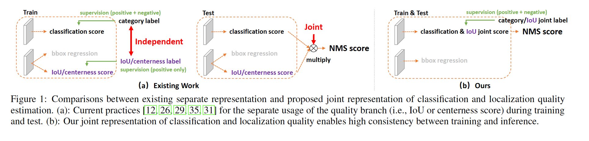

​		近来，密集检测器逐渐引领目标检测的趋势，而对边界框表示及其定位质量估计的关注引起令人鼓舞的进步。具体而言，边界框_表示_建模为简单的Dirac delta分布[10、18、32、26、31]，其在过去几年被广泛使用。正如FCOS[26]中流行的那样，在推理期间，当质量估计与与分类置信度结合（通常使用乘法）作为最终的得分进行NMS过程时，预测一个额外的定位质量（例如IoU得分[29]或centerness得分[26]）给准确率带来一致的改进。尽管它们取得成功，但是我们观察到现有的实践中存在如下问题：

**训练和推理之间定位质量估计和分类得分使用的不一致：**（1）在最新的密集检测器中，定位质量估计和分类得分通常独立训练，并在推理期间复合使用[26、29]（见表1（a））；（2）目前，定位质量估计的监督仅分配给正样本[12、11、26、29、35]，这是不可靠的，因为负类可能会获得无法控制的更高质量预测的机会（图2（a））。这两种因素在训练和测试之间产生差距，并可能在NMS中，衰减检测性能，例如具有随机得分的负实例可能排在低质量预测的正类例子的前面。

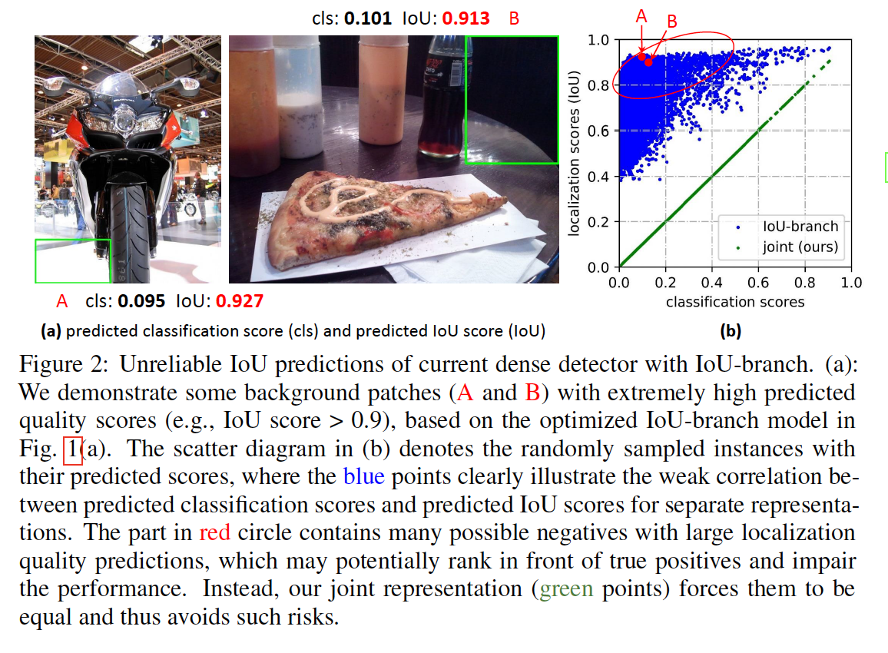

**Inflexible representation of bounding boxes：**  广泛使用的边界框表示可以视为目标边界框坐标的Dirac delta distribution[7、23、8、1、18、26、13、31]。但是，它没有考虑数据集中的模棱两可和不确定性（见图3中的不清楚的图形边界）。尽管一些最近的工作[10、4]将边界框建模为高斯分布，但是它太简单而不能捕获边界框位置的真实分布。事实上，真实分布可以有更多的任意性和灵活性，而不必像高斯函数那样对称。

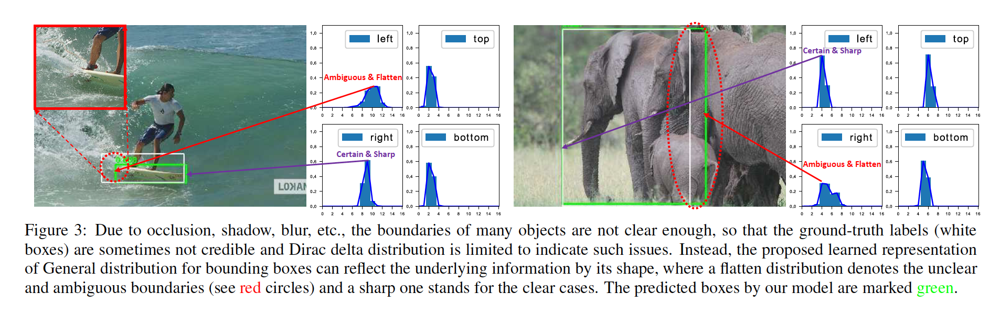

​		为了处理上述问题，我们为边界框和它们的定位质量设计了一种新的表示。**对于定位质量表示**，我们提出将定位质量融合到分类得分以构成单一和统一的表示：一种分类向量，其中它在ground-truth类别索引中的值表示其对应的定位质量（通常是预测框与对应的ground-truth框之间的IoU分数）。以这种方式，我们将分类得分和IoU得分统一到一个联合且单一的变量（表示为“classification-IoU joint representation”），其以端到端的形式训练，同时直接在推理中使用（图1（b））。因此，它消除训练-测试的不一致（图1（b）），并保证定位质量和分类之间的最强相关性（图2（b））。此外，分类利用0质量得分监督，因此整体质量预测变得更置信和可靠。对于密集的目标检测器而言，这特别有利，因为它们对整个图像中规则采样的所有候选进行排序。**对于边界框表示**，我们建议通过直接学习离散空间在其连续空间上的离散概率分布来表示边界框位置的任意分布（在本文中称为“一般分布（General distribution）”），而无需引入任何其他更强的先验条件（例如高斯[10、4]）。因此，我们可以获得更可靠和准确的边界框估计，同时感知其各种潜在分布（请参见图3和补充材料中的预测分布）。

​		然后，改进的表示形式对优化提出了挑战。传统上，对于密集检测器，分类分支利用Focal Loss（FL）优化。FL通过重塑标准的交叉熵损失处理类不平衡问题。但是，对于所提出的classification-IoU联合表示的情况，除了仍然存在的不平衡风险，我们面临连续IoU标签（0～1）作为监督的新问题，因为原始的FL仅支持离散的$\{0, 1\}$类标签。我们通过将FL从$\{0,1\}$的离散版本扩展到它的连续变体来解决这个问题，称为Generalized Focal Loss（GFL）。与FL不同，GFL考虑了一种非常普遍的情况，其中全局优化的解决方案能够针对任何所需的连续值，而不是离散的值。更具体地说，本文将GFL分为质量焦点损失（Quality Focal Loss：QFL）和分布焦点损失（Distribution Focal Loss：DFL），对于优化改进的两种表示：QFL专注于稀疏的困难样本集合，并同时在相应类别上产生其连续的0～1质量估计；DFL使网络迅速集中于学习在任意灵活分布下目标边界框连续位置周围的值的概率。

​		我们展示GFL的三个优势：（1）当通过附加的质量估计促进一阶段检测器时，它弥补了训练和测试之间的鸿沟，从而可以更简单、联合和有效地表示分类和定位质量；（2）它可以很好地建模边界框的灵活潜在分布，其提供更信息化和准确的边界框位置。在COCO test-dev上，具有ResNet-101的GFL获得45.0%的AP，比最佳的SAPD（53.5%）和ATSS（43.6%）好。我们的最佳模型可以获得48.2%的单模型单尺度AP，同时在单个2080Ti GPU上以10FPS运行。

### 2	相关工作

**定位质量的表示**	诸如Fitness NMS、IoU-Net、MS R-CNN、FCOS以及IoU-aware利用单独分支来进行以IoU或centerness得分的定位质量估计。如第1节提到的，这种单独的形式引起训练与测试之间的不一致，以及不可靠的质量预测。PISA和IoU-balance基于定位质量给分类损失分配不同的权重，其目的是增强分类得分和定位准确率之间相关性。但是，权重策略具有隐性和有限的收益，因为它不会更改分类的损失目标的最佳值。

**边界框的表示**	Dirac delta分布[7、23、8、1、18、26、13、31]控制着过去几年中边界框的表示。最近，采用高斯假设[10、4]通过引入预测方差来学习不确定性。不幸的是，已有的表示要么太严格，要么太简化，其不能反映真实数据中复杂的潜在分布。本文中，我们进一步放宽假设，直接了解边界框更任意、更灵活的一般分布，同时提供更多信息和准确信息。

### 3	方法

​		在本节中，我们首先回顾原始的Focal Loss（FL），以学习一阶段检测器的密集分类得分。接着，我们介绍定位质量估计和边界框的改进表示的细节，其通过所提出的Quality Focal Loss（QFL）和Distribution Focal Loss（DFL）成功优化。最后，我们将QFL和DFL的公式概括为统一的观点，称为Generalized Focal Loss（GFL），作为FL的灵活扩展，以促进将来的进一步推广和一般理解。

​		**Focal Loss（FL）**	最初的FL [18]被提出来解决一阶段物体检测的情况，在这种情况下，在训练期间前景和背景类别之间经常存在极端的不平衡。FL的典型形式如下（为了简化，我们忽略原始论文中的$\alpha_t$）：

$$\mathbf{FL}(p)=-(1-p_t)^\gamma\log(p_t), p_t = \begin{cases}p, &\mbox{when } y = 1 \\ 1-p, &\mbox{when }y=0\end{cases}\tag{1}$$

其中$y \in \{1, 0\}$描述ground-truth类，$p \in [0, 1]$表示标签$y=1$的类的估计概率。$\gamma$为可调整的聚焦参数。具体而言，FL包含标准的交叉熵部分$-\log(p_t)$，和动态尺度因子部分$(1-p_t)^\gamma$，其中尺度因子$(1-p_t)^\gamma$在训练期间自动降权容易样本的贡献，并迅速聚焦困难样本的建模。

​		**Quality Focal Loss（QFL）**	为了解决训练和测试阶段的不一致，我们提出定位质量（即IoU得分）和分类得分（“classification-IoU”）的联合表示，其中它的监督soften标准的“独热”类别标签，并产生对应类别的可能浮点目标$y \in [0, 1]$（请参见图4中的分类分支）。具体而言，$y=0$表示具有$0$质量得分的负表示，而$0 < y \le 1$表示具有目标IoU得分$y$的正样本。注意，定位质量标签$y$遵循[29、12]中的传统定义：训练中，预测边界框及其对应ground-truth边界框的IoU得分，其为0～1之间的动态值。遵循[18、26]，对于多类实现，我们采用基于sigmoid算子$\sigma(\cdot)$的多个二值分类。为了简单起见，sigmoid的输出标记为$\sigma$。

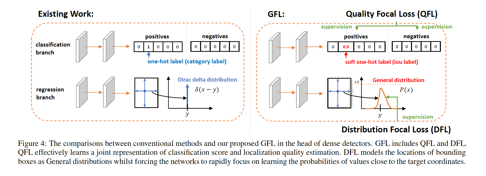

​		因为所提出的classification-IoU的联合表示需要整幅图像的联合监督，仍会发生类不平衡，必须继承FL的思想。但是，当前形式的FL仅支持$\{1, 0\}$的离散标签，但是我们的新标签包含小数。因此，我们建议扩展FL的两个部分，以在联合表示的情况下实现成功的训练：（1）交叉熵部分$-\log(p_t)$扩展到其完整版本$-((1-y)\log(1-\sigma) + y\log(\sigma))$；（2）尺度因子部分$(1 - p_t)^\gamma$泛化到估计$\sigma$及其连续标签$y$之间的绝对距离，即$|y - \sigma|^\beta(\beta \ge 0)$，这里$|\cdot|$保证非负。因此，我们结合上述两个扩展部分以构成完整的损失目标，其称为Quality Focal Loss（QFL）：

$$\mathbf{QFL}(\sigma) = -|y - \sigma|^\beta((1-y)\log(1-\sigma) + y\log(\sigma)). \tag{2}$$

注意，$\sigma = y$为QFL的全局最小解。在质$|y - \sigma|^\beta$的行为与调节因子相同：当样例的质量估计不准确以及偏离标签$y$时，调节因子相对较大，因此它更关注学习这种困难样例。随着质量估计越来越准确，即$\sigma \rarr y$，因子逐渐趋于0，良好估计得样例的损失被降权。其中参数$\beta$平滑地控制降权（在我们的实验中，$\beta=2$时，QFL最佳）。

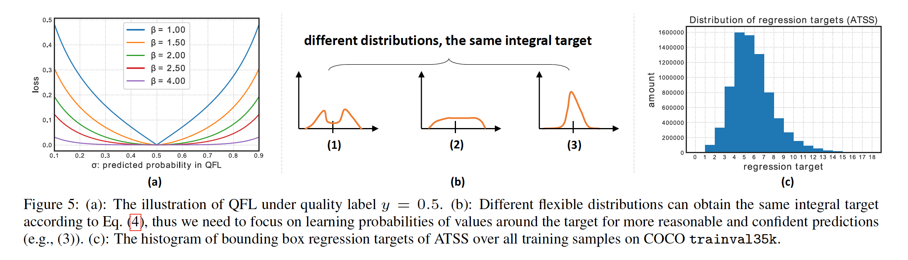

​		**Distribution Focal Loss（DFL）**	遵循[26、31]，我们采用位置到边界框四条边的相对便宜作为回归目标（见图4的回归分支）。边界框回归的传统操作将回归到的标签$y$建模为Dirac delta分布$\delta(x - y)$，其中它满足$y=\int_{-\infin}^{+\infin}\delta(x-y)x\,dx = 1.\tag{3}$

根据第1节的分析，与其使用Dirac delta[23、8、1、26、31]或Gaussian[4、10]假设，我们提出直接学习潜在的General分布$P(x)$，而没有引入任何其他先验。给定具有最小$y_0$和最大$y_n$（$y_0 \le y \le y_m, n \in \mathbb{N}^+$）的标签$y$的范围，我们可以供模型得到估计值$\hat{y}$（$\hat{y}$也符合$y_0 \le \hat{y} \le y_n$）:

$$\hat{y} = \int_{-\infin}^{+\infin}P(x)x\,dx=\int_{y_0}^{y_n}P(x)x\,dx.\tag{4}$$

为了与卷积神经网络一致，我们通过将范围$[y_0,y_n]$离散化到间隔为$\Delta$（为了简单起见，我们使用$\Delta=1$）的集合$\{y_0,y_1,\cdots,y_i,y_{i+1},\cdots,y_{n-1},y_n\}$，从而将连续域上的积分转换为离散表示。因此，给定离散分布属性$\sum_{i=0}^nP(y_i)=1$，估计的回归值$\hat{y}$可以表示为：

$$\hat{y} = \sum_{i=0}^n P(y_i)y_i.\tag{5}$$

因此，$P(x)$可以通过包含$n+1$个单元的softmax$\mathcal{S}(\cdot)$层轻松实现，为了简便，将$P(y_i)$表示为$\mathcal{S}_i$。注意，$\hat{y}$可以利用传统的损失目标（如SmoothL1、IoU损失或GIoU损失）以端到端的形式训练。但是，如图5（b）所示，存在$P(x)$的值的无限组合，可以使最终积分结果为$y$，这可能会降低学习效率。与（1）和（2）直观地比较，分布（3）是紧凑的，并且在边界框估计上趋于更加自信和精确，这促使我们通过显式地鼓励接近目标$y$的值的高概率来优化$P(x)$的形状。此外，通常情况下，最合适的可能位置（如果存在）不会远离粗糙标签。因此，我们引入Distribution Focal Loss（DFL），其迫使网络迅速关注接近标签$y$的值，这通过显示扩大$y_i$和$y_{i+1}$（最接近$y$，$y_i \le y \le y_{i+1}$）的值来实现。因为边界框的学习仅针对正样本，而没有类不平衡的风险，所以我们仅将QFL中完整的交叉熵部分应用于DFL的定义：

$$\mathbf{DFL}(\mathcal{S}_i, \mathcal{S}_{i+1}) = -((y_{i+1} - y)\log(S_i) + (y - y_i)\log(\mathcal{S}_{i+1})). \tag{6}$$

直观上，DFL旨在关注扩大目标$y$周围值（即$y_i$和$y_{i+1}$）的概率。DFL的全局最小节（即$\mathcal{S}_i = \frac{y_{i+1} - y}{y_{i+1} - y_i}$，$\mathcal{S}_{i+1}=\frac{y-y_i}{y_{i+1}-y_i}$（见补充材料））可以保证估计的回归目标$\hat{y}$无限接近相应的标签$y$，即$\hat{y} = \sum_{j=0}^n P(y_j)y_i = \mathcal{S}_i y_i + \mathcal{S}_{i+1}y_{i+1}=\frac{y_{i+1} - y}{y_{i+1} - y_i}y_i + \frac{y - y_i}{y_{i+1} - y_i} y_{i+1} = y$，这也确保了它作为损失函数的正确性。

​		**Generalized Focal Loss（GFL）**	注意，QFL和DFL可以统一到一个通用形式，其称为Generalized Focal Loss（GFL）。假设模型将两个变量$y_l,y_r(y_l < y_r)$的概率估计为$p_{y_l}, p_{y_r}$（$p_{y_l} \ge 0,p_{y_r} \ge 0, p_{y_l} + p_{y_r} = 1$），它们的线形组合的最终预测为$\hat{y} = y_l p_{y_l} + y_r p_{y_r}（y_l \le \hat{y} \le y_r）$。预测$\hat{y}$对应的连续标签$y$也满足$y_l \le y \le y_r$。采用绝对距离$|y - \hat{y}|^\beta(\beta \ge 0)$作为调节因子，GFL的特定形式可以写为：

$$\mathbf{GFL}(p_{y_l}, p_{y_r})= -\left|y - (y_l p_{y_l} + y_r p_{y_r})\right|^\beta((y_r - y)\log(p_{y_l}) + (y-y_l)\log(p_{y_r})).\tag{7}$$

​		**Properties of GFL**	$\mathbf{GFL}(p_{y_l}, p_{y_r})$达到其全局最小$p_{y_l}^\ast = \frac{y_r - y}{y_r -y_l},p_{y_r}^\ast = \frac{y - y_l}{y_r - y_l}$，其还表示估计的$\hat{y}$完美匹配连续标签$y$，即$\hat{y} = y_l p_{y_l}^\ast + y_r p_{y_r}^\ast = y$（见补充材料证明）。显然，原始的FL[18]和所提出的QFL和DFL全是GFL的_特例_（详情见补充材料）。注意，GFL可以用于任何一阶段检测器。修改的检测器与原始的检测器的不同之处有两个方面。第一，推理期间，我们直接将分类得分（与质量估计联合的表示）作为NMS得分，如果单独的质量预测（例如FCOS和ATSS的centerness）存在，也不需乘以单独的质量预测。第二，回归分支的最后一层用于预测具有$n+1$个输出的边界框位置，而不是1个输出，如图3所示，它带泪的额外计算成本可以忽略不计。

​		**Training Dense Detectors with GFL**	我们定义具有GFL的训练损失$\mathcal{L}$为：

$$\mathcal{L} = \frac{1}{N_{pos}}\sum_z\mathcal{L_{Q}} + \frac{1}{N_{pos}}\sum_{z}\mathbf{1}_{\{c_z^\ast > 0\}}(\lambda_0 \mathcal{L_B} + \lambda_1\mathcal{L_D}),\tag{8}$$

其中$\mathcal{L_Q}$为QFL，$\mathcal{L_D}$为DFL。通常，$\mathcal{L_B}$表示如[26、31]中的GIoU Loss。$N_{pos}$表示正样本的数量。$\lambda_0$（通常默认为2，与[3]相似）和$\lambda_1$（实践中为$\frac{1}{4}$，四个防线的平均）分别为$\mathcal{L_Q}$和$\mathcal{L_D}$的平衡权重。在金字塔特征图上所有位置上计算和。$\mathbf{1}_{\{c_z^\ast > 0\}}$为指示器函数，如果$c_z^\ast > 0$，那么它的值为1，否则为0。遵循官方代码[3、26、31、15]的常用实践，训练期间，我们还将质量得分用于加权$\mathcal{L_B}$和$\mathcal{L_D}$。

### 4	实验

​		我们在COCO基准测试上进行实验，其中$\mbox{trainval35k}$（115K图像）用于训练，我们使用$\mbox{minival}$（5K图像）用于验证。报告$\mbox{test-dev}$（20K图像）上的主要结果，可以从评估服务器获得。为了公平比较，在mmdetection上产生所有结果，其中使用默认超参数。除非其他说明，我们采用基于ResNet-50 [9]骨干的1x学习进度表（12个纪元），无需进行多尺度训练，即可进行以下研究。 在补充材料中可以找到更多的训练/测试详细信息。

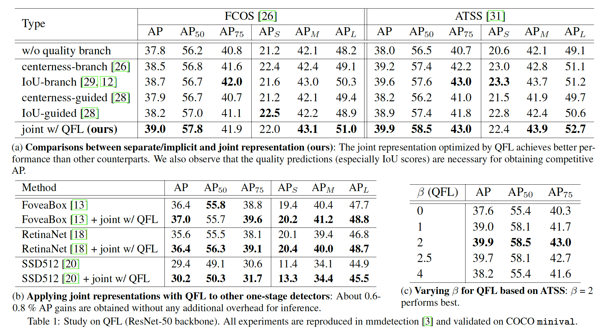

​		我们首先调查QFL的有效性（表1）。在表1（a）中，我们将所提出的联合表示与其单独或隐式副本进行比较。表示定位质量的两种替代为：在实验中也采用IoU和centerness。一般而言，我们构建四种变体，其使用单独或隐式表示，如图6所示。根据结果，我们观察到，通过QFL优化的联合表示始终比所有副本表现更好，而作为定位质量的度量IoU始终比centerness表现更好（见补充材料）。表1（b）表明QFL还可以提升其他流行的一阶段检测器的性能，而表1（c）表明$\beta=2$是QFL的最佳设置。我们通过采样实例及其联合的预测分类和IoU分支模型以及我们的IoU分数来说明联合表示的有效性，如图2（b）所示。结果表明，所提出的经过QFL训练的联合表示形式由于其更可靠的质量估计而可以使检测受益，并且根据其定义，产生分类和质量得分之间的最强相关性。事实上，子啊我们的联合表示中，预测分类得分等于估计质量得分。

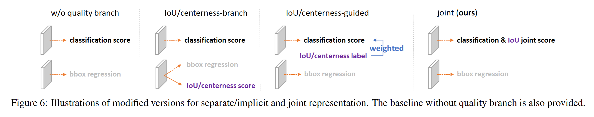

​		第二，我们研究DFL的有效性（表2）。为了快速旋转合理的$n$值，我们首先在图5（c）中给出回归目标的分布。我们在后面的实验中证明，推荐ATSS使用的$n$为14或16。在表2（a）中，我们比较边界框回归的不同数据表示的有效性。我们发现General分布获得更好或者相当的结果，同时DFL进一步提升其性能。定性比较见图7。可以看出，与高斯和Dirac delta分布相比，所提出的一般分布可以提供更准确的边界框位置，特别是在有大量遮挡的情况下（补充材料中的更多讨论）。基于通过GFL训练的改进ATSS，我们通过固定一个而变化其他设置，比较DFL中$n$和$\Delta$的影响，见表2（b）和（c）。为了展示General分布的影响，我们在图3的四个方向上绘制了几个具有分布边界框的代表性实例，其中所提出的分布示可以通过其形状有效地反映边界框的不确定性（请参阅补充材料中的更多示例）。

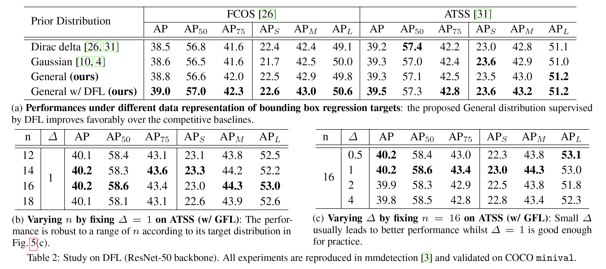

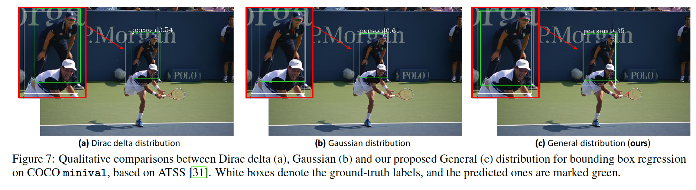

​		第三，我们在具有ResNet-50骨干的ATSS上进行消融研究，以展示QFL和DFL的相对贡献（表3）。FPS是在同一台计算机上使用单个GeForce RTX 2080Ti GPU在相同的mmdetection [3]框架下以1的批处理大小进行测量的。我们观察到DFL的改善与QFL是正交的，并且两者（即GFL）的联合使用可提高强基线ATSS 1%的AP得分。此外，根据推理速度，GFL带来的额外开销微不足道，并且被认为非常实用。

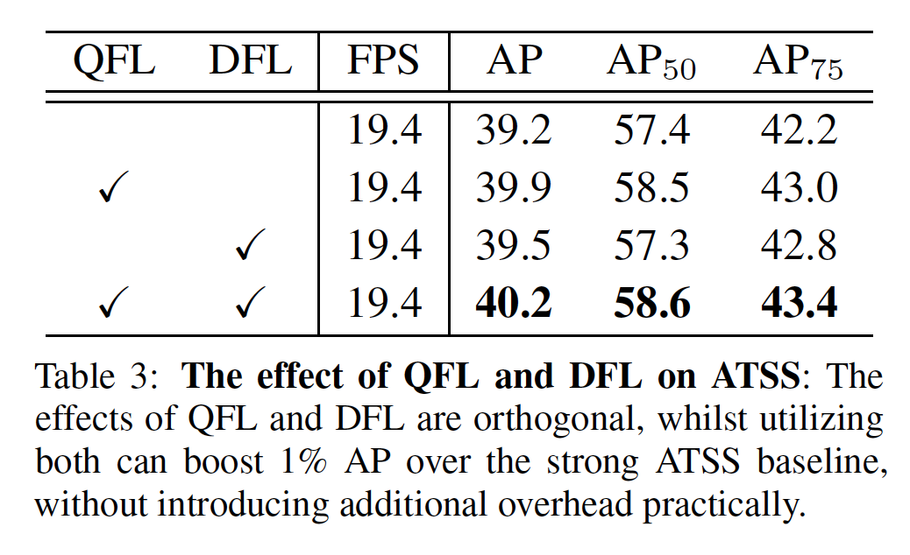

​		最后，我们比较GFL（基于ATSS）和COCO test-dev上的最先进方法，见表4。遵循先前的工作[18、26]，训练期间采用多尺度训练和2倍学习率计划（24个epoch）。为了公平比较，我们所有模型的包含单模型单尺度测试的结果，以及它们相应的推理速度（FPS）。基于ResNet-101的GFL以14.6FPS获得45.0%的AP，其比所有具有相同骨干的现有检测器好，包括SAPD [33] （43.5%） 和 ATSS [31] （43.6%）。此外，可变形卷积始终提高ResNe(X)t骨干网络的性能，其中带有ResNeXt-101-32x4d-DCN的GFL以10 FPS的速率获得了最先进的48.2％AP。图8展示准确率-速度平衡的可视化，其中可以看出，我们提出的GFL将精确度-速度边界的范围推到了很高的水平。

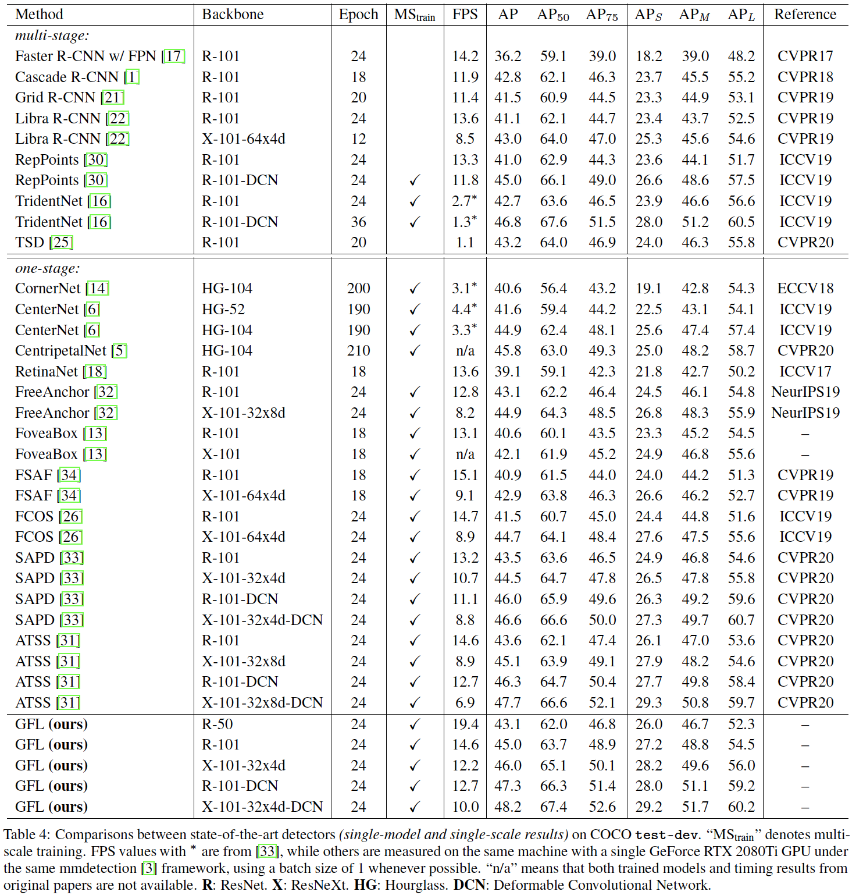

### A	More Discussions about the Distributions

​		图9描述Dirac delta、Gaussian和所提出的General distribution的思想，其中假设从网格（Dirac delta）到灵活（General）。我们还列出关于这些分布的几项关键比较，见表5。可以看出，Gaussian假设的损失目标事实上时动态加权的L2 Loss，其中它的训练权重与预测方差$\sigma$相关。在边缘级别进行优化时，它某种程度上类似于Dirac delta（标准L2损失）。此外，如何将Gaussian集成到基于IoU的损失是不清楚的，因为目标表示的表达与其优化目标严重耦合。因此，它不能享受基于IoU的优化的好处[24]，因为它在实践中被证明是非常有效的。相比之下，我们提出的General分布解藕表示和损失目标，使其对任意类型的优化（包括edge level和box level）都是灵活的。

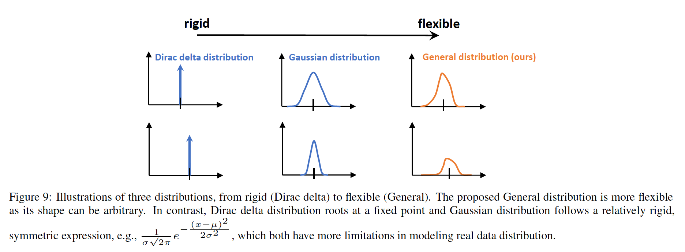

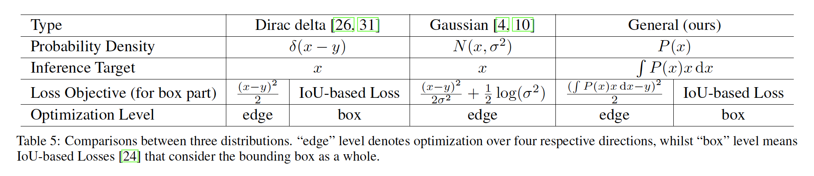

​		我们还发现Dirac delta分布（包含表5中基于Gaussian分布的分析）的边界框回归对特征扰动更敏感，使其缺乏鲁棒性以及易受噪声影响，如仿真实验（图10）所示。事实证明，General分布比其他分布享有更多的利益。

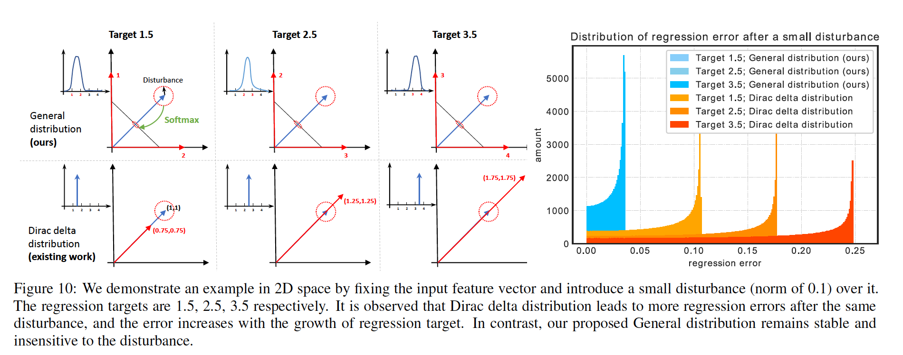

### B	Global Minimum of GFL $(p_{y_l}, p_{y_r})$

​		回顾$\mathbf{GFL}$的定义：

$$\mathbf{GFL}(p_{y_l}, p_{y_r}) = - \left|y - (y_lp_{y_l} + y_rp_{y_r})\right|^\beta((y_r - y)\log(p_{y_l}) + (y - y_l)\log(p_{y_r})), \mbox{given } p_{y_l} + p_{y_r} = 1.$$

为了简便，$\mbox{GFL}(p_{y_l}, p_{y_r})$可是扩展为：

$$\begin{align}\mathbf{GF}(p_{y_l}, p_{y_r}) &= -\left|y - (y_lp_{y_l} + y_rp_{y_r})\right|^{\beta}((y_r - y)\log(p_{y_l}) + (y - y_l)\log(p_{y_r}))\\&= \underbrace{\left\{\left|y - (y_lp_{y_l} + y_rp_{y_r})\right|^{\beta}\right\}}_{\mathbf{L}(\cdot,\cdot)}\underbrace{-((y_r - y)\log(p_{y_l}) + (y - y_l)\log(p_{y_r}))}_{\mathbf{R}(\cdot,\cdot)} \\&=\mathbf{L}(p_{y_l}, p_{y_r})\mathbf{R}(p_{y_l},p_{y_r})\end{align} $$

$$\begin{align}\mathbf{R}(p_{y_l}, p_{y_r}) &= -((y_r - y)\log(p_{y_l}) + (y - y_l)\log(p_{y_r})) \\ &=-((y_r - y)\log(p_{y_l}) + (y - y_l)\log(1 - p_{y_l})) \\ &\ge -((y_r - y)\log(\frac{y_r - y}{y_r - y_l}) + (y - y_l)\log(\frac{y - y_l}{y_r - y_l}))\\ &= \mathbf{R}(p_{y_l}^\ast, p_{y_r}^\ast) > 0, \mbox{ where } p_{y_l}^\ast = \frac{y_r - y}{y_r - y_l}, p_{y_r}^\ast=\frac{y-y_l}{y_r - y_l}.\end{align}$$

$$\begin{align}\mathbf{L}(p_{y_l}, p_{y_r}) &=\left|y - (y_l p_{y_l} + y_rp_{y_r})\right|^\beta \\ &\ge\mathbf{L}(p_{y_l}^\ast, p_{y_r}^\ast) = 0, \mbox{ where } p_{y_l}^\ast = \frac{y_r - y}{y_r - y_l}, p_{y_r}^\ast=\frac{y-y_l}{y_r - y_l}.\end{align}$$

此外，给定$\epsilon\ne0$，对于定义域中的任意变量$(p_{y_l}, p_{y_r}) = (p_{y_l}^\ast + \epsilon, p_{y_r}^\ast - \epsilon)$，我们有：

$$\mathbf{R}(p_{y_l}^\ast + \epsilon, p_{y_r}^\ast - \epsilon) > \mathbf{R}(p_{y_l}, p_{y_r}) > 0,$$

$$\mathbf{L}(p_{y_l}^\ast + \epsilon, p_{y_r}^\ast - \epsilon) = \left|\epsilon(y_r - y_l)\right|^\beta > 0 = \mathbf{L}(p_{y_l}^\ast, p_{y_r}^\ast)$$

因此，容易推导：

$$\mathbf{GFL}(p_{y_l}, p_{y_r})=\mathbf{L}(p_{y_l}, p_{y_r}) \ge \mathbf{L}(p_{y_l}^\ast, p_{y_r}^\ast)\mathbf{R}(p_{y_l}^\ast, p_{y_r}^\ast) = 0,$$

其中仅当$p_{y_l} = p_{y_l}^\ast, p_{y_r} = p_r^\ast$时，“=”成立。

​		GFL的全局最小属性以某种程度上解释为什么图6中的IoU或centernesss引导的变体没有明显的优势。事实上，加权引导实际上并没有改变原始分类损失（例如Focal Loss）的全局最小值，而其最佳分类目标仍然是独热标签。相比之下，提出的GFL确实修改了全局最小值，并迫使预测接近估计的框和真实的框之间的精确IoU，这显然对NMS的排序过程有利。

### C	FL, QFL and DFL are special cases of GFL

​		本节中，我们证明FL、QFL和DFL是如何称为GFL的特例。

**FL：**令GFL中$\beta=\gamma$，$y_l=0$，$y_r=1$，$p_{y_r} = p$以及$y \in \{1, 0\}$，我们可以获得FL：

$$\begin{align}\mathbf{FL}(p) &= \mathbf{GFL}(1-p, p)\\ &= - \left|y-p\right|^\gamma((1-y)\log(1-p) + y\log(p)), y\in \{1, 0\} \\&=-(1-p_t)^\gamma\log(p_t), p_t= \begin{cases}p, &\mbox{ when } y = 1\\ 1 -p &\mbox{ when } y = 0\end{cases}\end{align} \tag{9}$$

**QFL：**令GFL中$y_l = 0$，$y_r = 1$，$p_{y_r} = \sigma$和$p_{y_l} = 1 - \sigma$，QFL的形式可以写为：

$$\mathbf{QFL}(\sigma) = \mathbf{GFL}(1-\sigma, \sigma) = -\left|y - \sigma\right|^\beta((1-y)\log(1 - \sigma) + y\log(\sigma)).\tag{10}$$

**DFL：**在GFL中$\beta = 0$，$y_l = y_i$，$p_{y_l} = P(y_l) = P(y_i) = \mathcal{S}_i$，$p_{y_r} = P(y_r) = P(y_{i+1})=\mathcal{S}_{i+1}$，我们有DFL：

$$\mathbf{DFL}(\mathcal{S}_i, \mathcal{S}_{i+1})=\mathbf{GFL}(\mathcal{S}_i, \mathcal{S}_{i+1})=-((y_{i+1} - y)\log(\mathcal{S}_i) + (y-y_i)\log(\mathcal{S}_{i+1})).\tag{11}$$

### D	Details of Experimental Settings

**训练细节：**ImgeNet预训练的具有FPN的模型用作骨干。训练期间，调整输入图像，使其短边为800，长边小于等于1333。在消融研究中，使用SGD训练网络90K次（表示为1x schedule），SGD的动量为0.9，权重衰减为0.0001，batchsize为16。初始学习率设置为0.01，在60K和80K迭代时分布乘以0.1。

**推理细节：**推理期间，输入调整的方式与训练阶段相同。然后，使用阈值0.05过滤掉大量背景，并且每个特征金字塔输出前1000个候选检测。在每个类的IoU阈值0.6下应用NMS，以产生每个图像最终的前100个检测结果。

### E	Why is IoU-branch always superior than centerness-branch?

​		原始论文中的消融研究还表明，对于FCOS / ATSS，作为定位质量的度量，IoU的性能始终优于centerness。在这里，我们给出了令人信服的理由。我们法相centerness的主要问题是，它的定义导致不期望的小ground-truth标签，这样就很难召回一组可能的ground-truth边界框（如图11所示）。根据图12展示的标签分布，我们观察到大多数IoU标签大于0.4，而centerness标签倾向更小的值（甚至接近0）。centerness标签的小型值阻止ground-truth边界框被召回，因为他们的NMS最终分数可能很小，是由于它们的预测centerness分数已经受到这些极小的信号的监督。

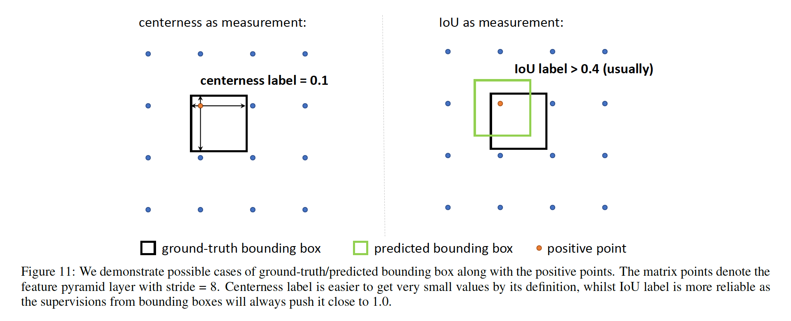

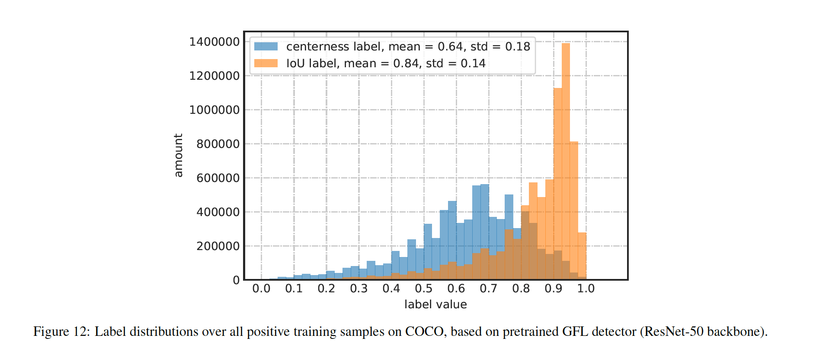

### F	More Examples of Distributed Bounding Boxes

​		我们展示通过GFL（ResNet-50骨干）预测的General分布边界框的更多例子。如图13所示，我们展示几种边界模棱两可的情况：纤细、几乎看不见的背包带是否属于行李箱（左上方）？在这些案例中，我们的模型甚至产生比ground-truth边界框更合理的边界框坐标。在图14中，显示了更多具有清晰边界和清晰总体分布的示例，其中GFL非常有信心生成准确的边界框，例如橙色和滑雪女子的底部。

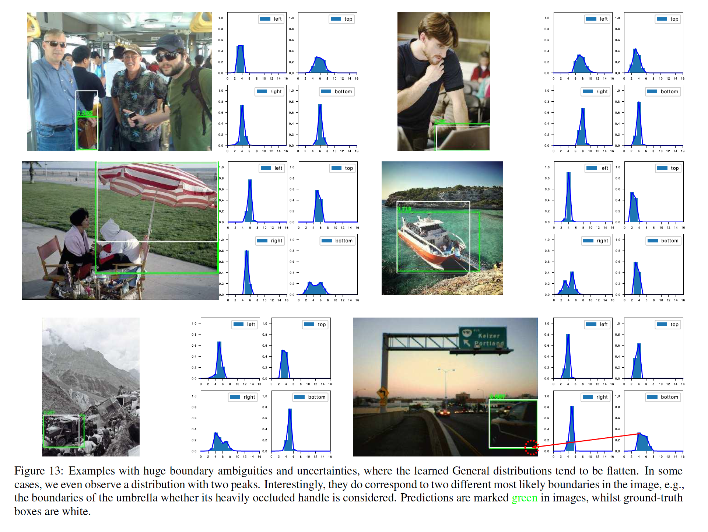

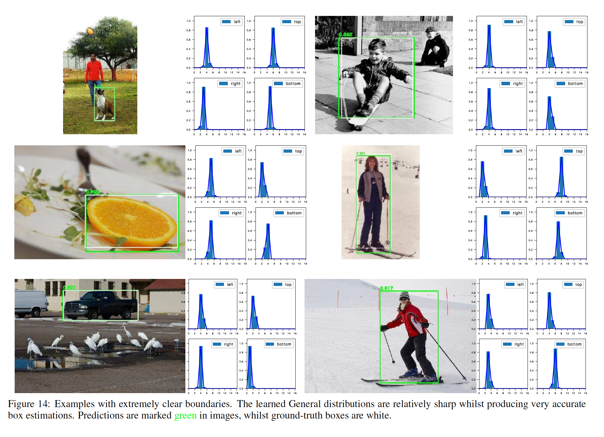