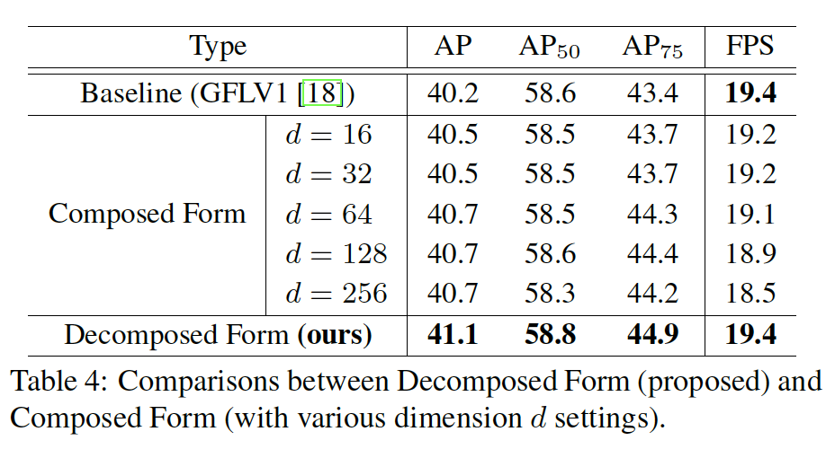
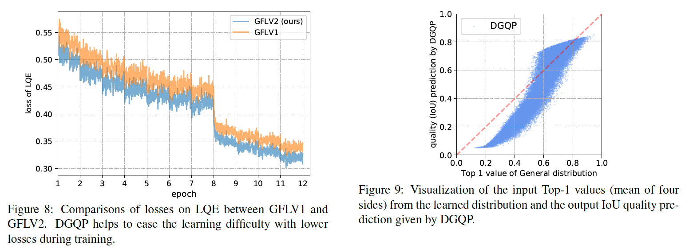

## Generalized Focal Loss V2: Learning Reliable Localization Quality Estimation for Dense Object Detection

### 摘要

​		Localization Quality Estimation（LQE）在密集对象检测器的最新进展中至关重要，并且很受欢迎，因为它可以提供准确的排名分数，从而有利于非最大抑制处理并提高检测性能。正如常用实践，大多数已有方法通过与目标分类或边界框回归共享的普通卷积特征预测LQE。本文中，我们基于边界框四个参数的学习分布，探索了一种全新的、不同的视角来进行LQE。边界框分布受到启发并在GFLV1中作为“General Distribution”引入，其很好地描述了预测的边界框的不确定性。如此的特性使边界框的分布统计量与其真实定位质量高度关联。具体而言，具有尖峰的边界框分布通常对应高定位质量，反之亦然。通过利用分布统计量和真实定位质量之间的紧密关联，我们基于GFLV1，为可信赖的LQE，开发一种相当轻量的Distribution-Guided Quality Predictor（DGQP），因此产生GFLV2。据我们所知，它是第一个在目标检测中使用高度相关的统计表示来促进LQE。大量实验证明了我们的方法的有效性。值得注意的是，在COCO test-dev上，GFLV2（ResNet101）以14.6FPS的速度获得46.2AP，比SOTA ATSS基线（14.6FPS 43.6AP）好2.6AP，而没有牺牲训练和推理的效率。代码见https://github.com/implus/GFocalV2。

### 1. 引言

​		由于直接在特征图上预测像素级目标分类和边界框的密集目标检测器的优雅和高效框架，它越来越流行。这种框架背后的一个关键技术是Localization Quality Estimation（LQE）。利用更好LQE的帮助，高质量边界框分数倾向于高于低质量的边界框，其极大地减小NMS过程错误抑制地奉献。

​		许多先前工作已探索LQE。例如，YOLO家族首先采用_Objectness_来描述定位质量，其定义为预测和ground-truth框之间的IoU。之后，IoU-Net[13]、IoU-aware[36]、PAA[14]、GFLV1[18]和VFNet[39]中已进一步探索和证明IoU的有效性。最近，FCOS和ATSS引入_Centerness_（其为与目标中心的距离）来抑制低质量的检测结果。通常，上述方法共享一个共同特点，它们都基于_vanilla convolutional features_（例如点的特征、边界货区域（见图2（a）-（g）））来估计定位质量。

​		与先前的工作不同，本文中，们通过直接利用边界框分布的统计数据，探索进行LQE的全新视角，而不是使用_vanilla convolutional features_（见图2）。在这里，边界框分布在GFLV1 [18]中被称为“General Distribution”，其中它学习了每个预测边的离散概率分布（图1（a）），用于描述边界框回归的不确定性。有趣的是，我们观察到General Distribution的统计量与其真实定位质量有很强的关系，如图1（b）所示。更具体地说，在图1（c）和（d）中，边界框分布的形状（flatness）可以清晰地反映预测结果的定位质量：分布越尖锐，预测边界框约准确，反之亦然。因此，由于输入（边界框的分布统计）和输出（LQE得分）高度相关，因此通过分布信息的指导进行更好的LQE可能更容易且非常有效。

​		受分布统计量和LQE得分之间的强相关性，我们提出了一个非常轻量级的子网，在这些分布统计信息的基础上，仅包含几十个（例如64个）隐藏单元，以产生可靠的LQE得分，从而大大提高了检测性能。重要的是，在实践中，它带来可忽略的额外计算成本，并且几乎没有影响基础目标检测器的训练/推理速度。本文中，我们称这种轻量的子网络为Distribution-Guided Quality Predictor（DGQP），因为它依赖质量预测的分布统计量的指导。

​		通过引入轻量级DGQP，它可以通过边界框分布的统计数据预测可靠的LQE得分，我们基于GFLV1框架开发一种新颖的密集目标检测器，因此称为GFLV2。为了验证GFLV2的有效性，我们在COCO上进行广泛的实验。值得注意的是，基于ResNet-101，GFLV2在相同的训练计划下，在不牺牲训练和测试效率的情况下，实现了令人印象深刻的检测性能（46.2 AP），即在COCO测试开发上比最新的ATSS基线（43.6 AP）高2.6 AP。

​		总之，我们的贡献如下：

- 据我们所知，我们的工作是第一次在端到端密集目标检测框架中连接边界框分布统计量和定位质量估计。
- 所提出的GFLV2在实践中是相当轻量和无成本的。它也可以轻松地插入大多数密集目标检测器，一致获得～2AP的增益，并且没有损失训练/推理速度。

- 我们的GFLV2（Res2Net-101-DCN）在COCO数据集的密集目标检测器中获得53.3AP（多尺度测试）。

### 2. 相关工作

**LQE的形式：**早期的流行目标检测器将分类置信度简单地视为LQE得分的形式，但是它们之间显然是不一致的，其不可避免的衰减目标检测器的性能。为了避免这个问题，AutoAssign[43]和BorderDet[27]采用额外的定位特征来重新对分类置信度评分，但是它们仍缺乏LQE的显示定义。

​		最近FCOS和ATSS引入LQE的新形式，称为_Centerness_，其描述到目标中心的距离。尽管_Centerness_有效，但是最近的研究[18、39]证明它有某种局限，并且对于LQE是次优的。SABL[35]引入粗糙定位的边界bucket，并且利用平均bucket置信度作为LQE的形式。

​		经过多年的技术迭代[28、29、30、13、34、12、36、14、18、39]，IoU已经得到了深入的研究，并作为一种出色的LQE度量方法而越来越受欢迎。在YOLO中，IoU首先被称为_Objectness_ [28、29、30]，在该网络中，对网络进行监督以在预测边界框和真实边界框之间产生估计的IoU，以减少NMS期间的排名基础。遵循相似的模式，IoU-Net、Fitness NMS、MS R-CNN、IoU-aware、PAA利用单独的分支来以IoU形式进行LQE。同时，GFLV1 [18]和VFNet [39]通过将分类评分与IoU融合以重新表示联合表示，展示了一种更有效的格式。由于其极大成功[18、39]，我们基于Classification-IoU Joint Representation[18]来构建GFLV2，并为可信LQE开发新的方法。

**LQE的输入特征：**如图2的左部分所示，先前的工作直接使用卷积特征作为LQE的输入，其仅在空间采样的方式上有不同。为了效率，大多数已有方法采用点特征（见图2（a））来产生LQE得分。IoU-Net预测基于区域特征的IoU，如图2（b）所示。BorderDet设计三种类型的边界敏感特征（见图2（c）-（e））来促进LQE。与BorderDet相似，VFNet中设计了一种星形采样形式（见图2（f））。作为替代，HSD和RepPoints关注通过可变形卷积学习到的位置上的特征。

​		前一个方法主要关注利用不同观点来提取辨别性卷积特征以进行更好的LQE。与先前的方法不同，我们所提出的GFLV2从巧妙的角度来设计：通过它直接的关联变量来预测LQE，这种变量为边界框分布的统计量（见图2有部分）。如后面的表3所示，与图2（a）-（g）所示的卷积特征相比，边界框分布的统计量同时实现了令人印象深刻的效率和高精度。

### 3. 方法

​		在这一节中，我们首先简要回顾Generalized Focal Loss（即GFLV1[18]），然后根据相关的概念和公式得出所提出的GFLV2。

#### 3.1. Generalized Focal Loss V1

**Classification-IoU Joint Representation：**这种表示是GFLV1中的关键部分，其设计用于在训练和推理期间减小定位质量估计和目标分类之间的不一致。具体来说，给定类标签$c \in \{1,2,\cdots,m\}$（$m$表示类别的总数），GFLV1利用分类分支来生成Classification和IoU的联合表示$\mathbf{J} = [J_1,J_2,\cdots,J_m]$，其满足：

$$J_i =\begin{cases}IoU(b_{pred}, b_{gt}), & \mbox{ if } i = c; \\ 0, & \mbox{otherwise},\end{cases}\tag{1}$$

其中$IoU(b_{pred},b_{gt})$表示预测边界框$b_{pred}$和ground-truth $b_{gt}$之间的IoU。

**General Distribution of Bounding Box Representation：**现代检测器[31、21、33]通常将由Dirac delta分布描述边界框回归：$y = \int_{-\infin}^{+\infin}\delta(x-y)x \mathrm{d}x$。与它们不同，GFLV1引入一种灵活的General Distribution $P(x)$来表示边界框，其中，在预定义的输出范围$[y_0,y_n]$下，边界框的每条边可以公式化为：$\hat{y} = \int_{-\infin}^{+\infin}P(x)x\mathrm{d}x = \int_{y_0}^{y_n}P(x)x\mathrm{d}x$。为了与卷积网络兼容，通过将范围$[y_0,y_n]$离散化为具有间隔$\Delta$（$\Delta = y_{i+1} - y_i,\forall i \in \{0,1,\cdots,n-1\}$）列表$[y_0,y_1,\cdots,y_i,y_{i+1},\cdots,y_{n-1},y_n]$，将连续的定义域转换为离散的定义域。因此，给定离散分布属性$\sum_{i=0}^nP(y_i) = 1$，估计的回归值$\hat{y}$表示为：

$$\hat{y} = \sum_{i=0}^n P(y_i)y_i.\tag{2}$$

​		与Dirac delta分布相比，General Distribution $P(x)$可以忠实地反映预测质量（见图1（c）-（d）），其为这项工作的里程碑。

#### 3.2. Generalized Focal Loss V2

**Decomposed Classification-IoU Representation：**尽管联合表示解决了训练和测试中目标分类和质量估计之间的不一致，但是在仅使用分类分支来预测联合表示上仍有一些局限。在这项工作中，我们利用分类$(\mathbf{C})$和回归$(\mathbf{I})$分支的信息来显示解藕联合表示：

$$\mathbf{J} = \mathbf{C} \times I,\tag{3}$$

其中$\mathbf{C} = [C_1,C_2,\cdots,C_m],C_i\in[0,1]$表示$m$个类的Classification Representative，并且$I \in [0,1]$为代表IoU表示的标量。

​		尽管$\mathbf{J}$被分解为两个部分，但我们在训练和测试阶段中都使用最终的联合表示（即$\mathbf{J}$），因此它仍可以避免GFLV1中提到的不一致问题。 具体而言，我们首先组合来自分类分支的$\mathbf{C}$和来自所提出的Distribution-Guided Quality Predictor（DGQP）的$I$到统一的形式$\mathbf{J}$。然后，训练期间，$\mathbf{J}$受Quality Focal Loss（QFL）监督，如[18]提出，并且直接用于推理中的NMS得分。

**Distribution-Guided Quality Predictor：**DGQP是GFLV2的关键部分。它将学习到的General Distribution $\mathbf{P}$的统计量传给微型的子网络（见图3的红色虚线框）来获得预测的IoU标量$I$，其有助于生成高质量Classification-IoU Joint Representation（式（3））。遵循GFLV1[18]，我们采用位置到边界框的四条边的相对偏移作为回归目标，其由Genera Distribution表示。为了方便，我们将左、有、上和下四条边标记为$\{l,r,t,b\}$，并且将$w$边的离散概率表示为$\mathbf{P}^w = [P^w(y_0),P^w(y_1),\cdots,P^w(y_n)]$，其中$w\in\{l,r,t,b\}$。

​		如图1所示，学习到的分布的平坦性与最终检测到的边界框高度关联，并且一些相关统计量可以用于反映General Distribution的平坦性。因此，如此的统计特征与定位质量有非常强的关联，其将简化训练难度，并改进估计质量。实践上，我们推荐选择Top-k值以及每个分布向量$\mathbf{P}^w$的均值，并且将它们拼接为基本统计特征$\mathbf{F}\in\mathbb{R}^{4(k+1)}$：

$$\mathbf{F} = \mbox{Concat}\Big(\Big\{\mbox{Topkm}(\mathbf{P}^w) | w \in \{l,r,t,b\}\Big\}\Big),\tag{4}$$

其中$\mbox{Topkm}(\cdot)$表示计算Top-k值和它们的均值之间的联合操作。$\mbox{Concat}(\cdot)$表示通道拼接。选择Top-k值和它们的均值作为输入统计量有两个好处：

- 因为固定$\mathbf{P}^w$之和被固定，的top-k值以及它们的均值可以本质上反映分布的平坦性：越大，越尖锐；越小，越平坦。
- top-k和平均值可使统计特征对其在分布域上的相对偏移不敏感（请参见图4），从而得到不受目标尺度影响的鲁棒表示。

​		给定General Distribution的统计特征$\mathbf{F}$作为输入，我们设计非常微型的子网络$\mathcal{F}(\cdot)$来预测最终的IoU质量估计。子网络仅有两个全连接层，其后分别为ReLU和Sigmoid。因此，IoU标量$I$可以计算为：

$$I = \mathcal{F}(\mathbf{F}) = \sigma(\mathbf{W}_2\delta(\mathbf{W}_1F)),\tag{5}$$

其中$\delta$和$\sigma$分别为ReLU和Sigmoid。$\mathbf{W}_1 \in \mathbb{R}^{p \times 4(k+1)}$和$\mathbf{W}_2 \in \mathbf{R}^{1\times p}$。$k$表示top-k参数，$p$为隐藏层的通道维度（$k=4, p =64$为我们的实验中的典型设置）。

**复杂度：**GFLV2的整体架构如图3所示。值得注意的是DGQP模块非常轻量。首先，它仅带来几千个额外参数，与整个检测模型的参数量相比，其可以忽略。例如，对于具有ResNet-50和FPN的模型，DGQP模块的额外参数量仅约为0.003%。第二，由于DGQP的极端轻量结构，它的计算开销也非常小。如表5和表8所示，DGQP模块的使用几乎没有减小原始检测器的训练和推理速度。

### 4. 实验

**实验设置：**我们在COCO基准测试上进行实验，其中具有115K图像的trainval35k用作训练，有5K图像的minval用作消融研究中的验证。此外，我们在来自评估服务器的20K图像的test-dev上获得主要结果。在mmdetection下产生所有结果，以进行公平比较，其中始终采用默认超参数。除非特别提到，在消融研究中，我们使用标准的1倍调度（12个epoch），而没有多尺度训练，并且基于ResNet-50骨干。训练/测试细节遵循先前工作[18、4]的描述。

#### 4.1. 消融研究

**输入统计量的组合**

**DGQP（即$k$、$p$）的结构**

**输入特征的类型**

**Usage of the Decomposed Form：**

**密集检测器的兼容性**

#### 4.2 与SOTA的比较

#### 4.3 分析

**DGQP改善LQE：**为了评估DGQP是否对定位质量估计有好处，我们首先获得预测的IoU（通过四个利用IoU作为质量估计目标的的代表性模型给出），以及COCO minival上的所有正类样本上的对应的真实IoU。然后，我们计算它们的Pearson Correlation Coefficient（PCC），见表6。

**DGQP Eases the Learning Difficulty：**	见图8。

**DGQP的输入/输出上的可视化**	见图9。

**训练/推理效率：**	见表8。

**定性结果：**见图7。

