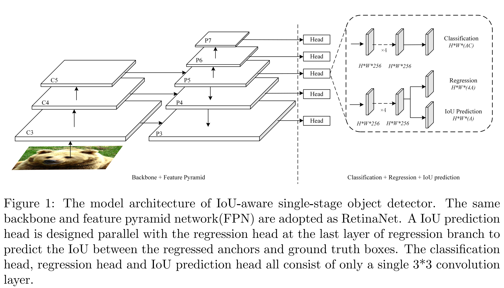
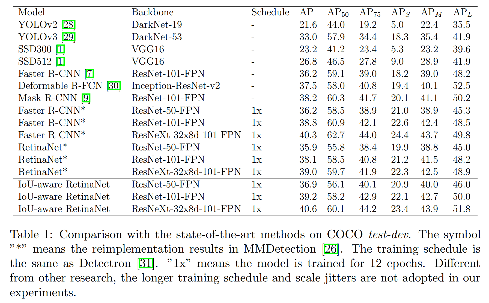

### IoU-aware Single-stage Object Detector for Accurate Localization
#### 1. Introduction

​		本文的目标是改善单阶段检测器的AP，同时保持单阶段检测器的效率。作者论证了单阶段检测分类分数和定位准确率之间的低相关性严重损害了模型的定位准确率。这种较低的相关性主要是由于使用独立的目标函数训练分类和定位子网络而彼此间没有清楚地了解。模型收敛后，分类自网络预测每个回归的锚的分类分数，但不知道定位准确度，该准确率由回归的锚和group-truth框之间的IoU表示。因此，分类分数和定位准确率之间有许多检测存在不匹配，使得高分类得分的检测有较低的IoU，较低分类得分的检测却有较高的IoU。训练期间，这些检测以两种方式损害定位准确率：**（1）在标准的NMS过程中，所有检测基于它们的分类得分排序，并且具有更高分类分数的检测会抑制与其重叠大于阈值的其他检测，所以较低分类分数而较高IoU的检测会被较低IoU而较高分类分数的检测抑制；（2）计算AP期间，所有检测也是基于分类得分排序，为了计算AP，精确率和召回率基于这些排序后的检测计算，如果具有较高分类得分而较低IoU的检测排在较低分类得分而较高IoU的检测之前，那么较高IoU阈值时的精确率将会减少，这导致较高IoU阈值时有更低的AP。**

​		为了解决上述问题，作者提出基于RetinaNet的IoU感知的单阶段检测器。将IoU预测头部并行地添加到分类分支的最后一层用以预测每个回归到的锚的IoU。训练期间，IoU预测头部与分类头部和回归头部联合训练。推理期间，检测置信度为分类得分乘以预测IoU，然后用以后续的NMS和AP计算。因为检测置信度与定位准确率高度相关，所以上述问题可以得到解决。

#### 3. Method

##### 3.1. IoU-aware single-stage object detector

​		**Model architecture.**  IoU感知的单阶段目标检测器主要是基于RetinaNet，并采用与RetinaNet相同的骨干和特征金字塔网络（FPN）（如图1）。与RetinaNet不同，作者在回归分支的最后一层设计了与回归头部并行的IoU预测头部，从而预测每个回归锚与ground truth之间的IoU，同时保持分类分支不变。为了保持模型的效率，IoU预测头部仅包含一个$3 \times 3$的卷积层，后面跟一个sigmoid激活层，确保预测的IoU在$[0, 1]$中。还有许多其他IoU预测头部设计的选择，例如设计与分类分支和回归分支相同的IoU预测分支，但是这种设计严重损害模型的效率。本文的设计仅给整个模型带来了少量计算负担，并能实质上提高模型的AP。

​		**Training.**   与RetinaNet一样，分类损失采用焦点损失，回归损失采用平滑L1损失，如公式（1）、（2）所示。由于预测IoU在$[0, 1]$之间，所以IoU预测损失采用公式（3）中的二值交叉熵。训练期间，IoU预测头部与分类头部和回归头部联合训练。其他类型的损失函数也可以考虑，例如L2损失和L1损失。不同的损失在如下的实验中比较：

$$L_{cls} = \frac{1}{N_{Pos}}(\sum_{i\in Pos}^N\mbox{FL}(p_i, \hat{p}_i) + \sum_{i\in Neg}^M\mbox{FL}(p_i,\hat{p}_i)) \tag{1}$$

$$L_{loc} = \frac{1}{N_{Pos}}\sum_{i\in Pos}^N \sum_{m \in cx, cy, w, h} \mbox{smooth}_{\mbox{L1}}(l_i^m, \hat{g}_i^m) \tag{2}$$

$$L_{IoU} = \frac{1}{N_{Pos}} \sum_{i \in Pos}^N \mbox{CE}(IoU_i, \hat{IoU}_i) \tag{3}$$

$$L_{total} = L_{cls} + L_{loc} + L_{IoU} \tag{4}$$

​		**Inference.**  推理期间，每个检测框的分类分数和预测IoU根据公式（5）计算以作为最后的检测置信度。参数$\alpha$设计用于控制分类分数和预测IoU对最终检测置信度的贡献。该检测置信度可以同时表示分类置信度和定位精度。因此，与分类分数相比，检测置信度与定位精度更相关。然后，在后续的NMS和AP计算中，使用检测置信度对所有检测排序。在这一过程中，糟糕定位的检测会被抑制。

$$S_{det} = p_i^\alpha IoU_i^{(1 - \alpha)} \tag{5}$$

#### 4. Experimets

##### 4.1 Experimental Settings

​		**Dataset and Evaluation Metrics.**  MS COCO和VOC2007与VOC2012。所有实验，使用标准的COCO风格的AP度量，其包含AP（从0.5到0.95（间隔为0.05）的IoU阈值时的平均AP）、$\mbox{AP}_{50}$（0.5 IoU阈值时的AP）、$\mbox{AP}_{75}$（0.75 IoU阈值的AP）、$\mbox{AP}_S$（小型尺度目标的AP）、$\mbox{AP}_{M}$（中型尺度目标的AP）和$\mbox{AP}_{L}$（大型尺度目标的AP）。

​		**Implementation Details.**  基于PyTorch和MMdetection实现检测模型。由于只有2个GPU可用，因此采用线性缩放规则[27]来调整训练期间的学习率。在模型的MMDetection设置下，IoU-aware的单阶段检测模型在$[800, 1333]$尺度的图像上训练12个epoch。消融分析中，具有ResNet50的IoU感知的单阶段检测器使用$[600, 1000]$的图像尺度在COCO train2017上训练和在COCO va2017上评估。对于PASCAL VOC上的实验，不同骨干网络的模型以$[600, 1000]$的图像尺度在VOC2007 trainval和VOC2012 trainval上训练，并在VOC2007 test上评估。

##### 4.2. Main Results

​		主要结果见表1。

##### 4.3. Ablation Studies

​		**IoU Prediction Loss.**  不同的IoU预测损失对检测结果的影响，见表2。

​		**Detection Confidence Computation.**  表3和表4给出了不同$\alpha$的比较。

​		**Ablation Studies on PASCAL VOC.** 

