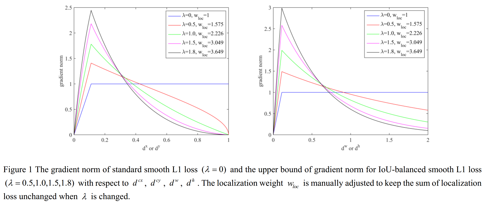
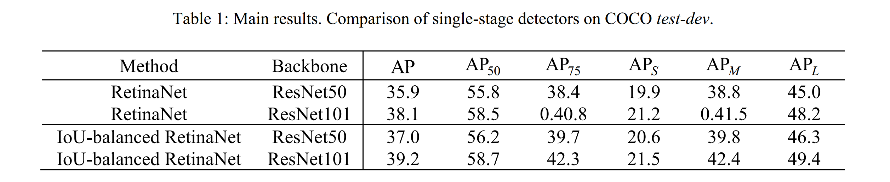
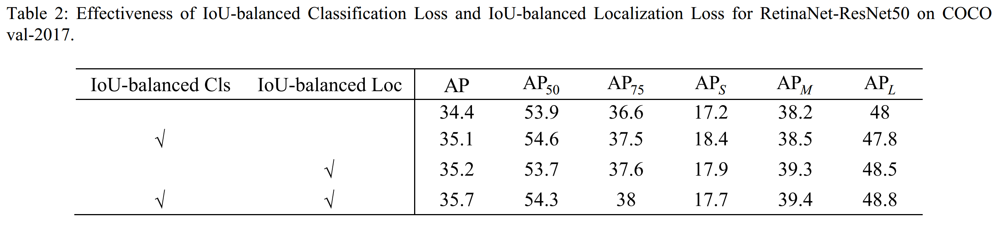
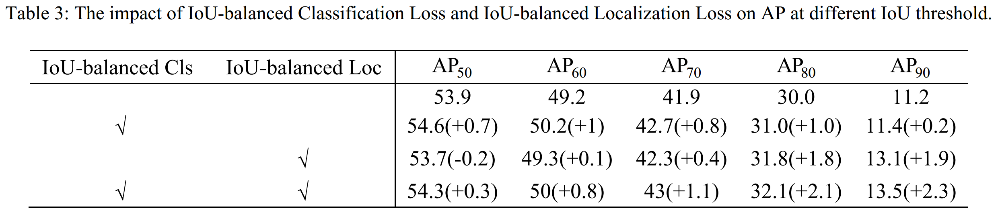
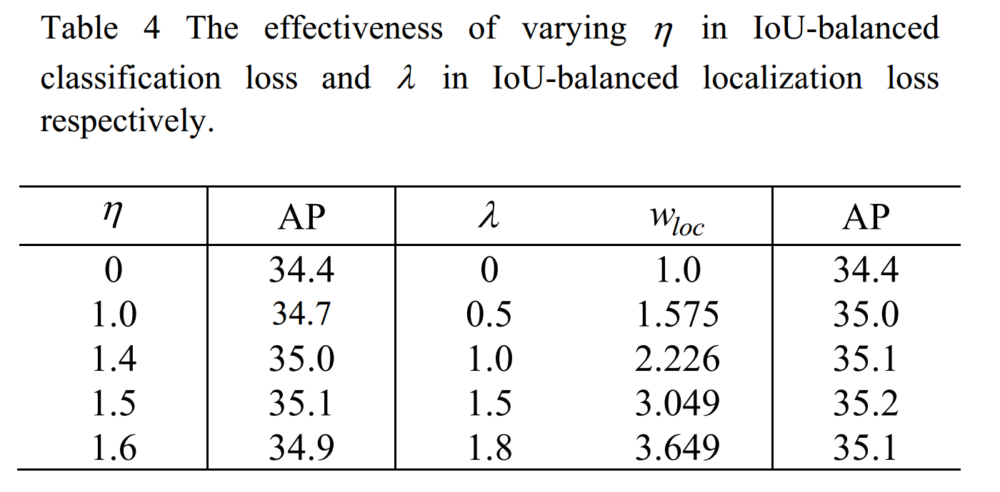
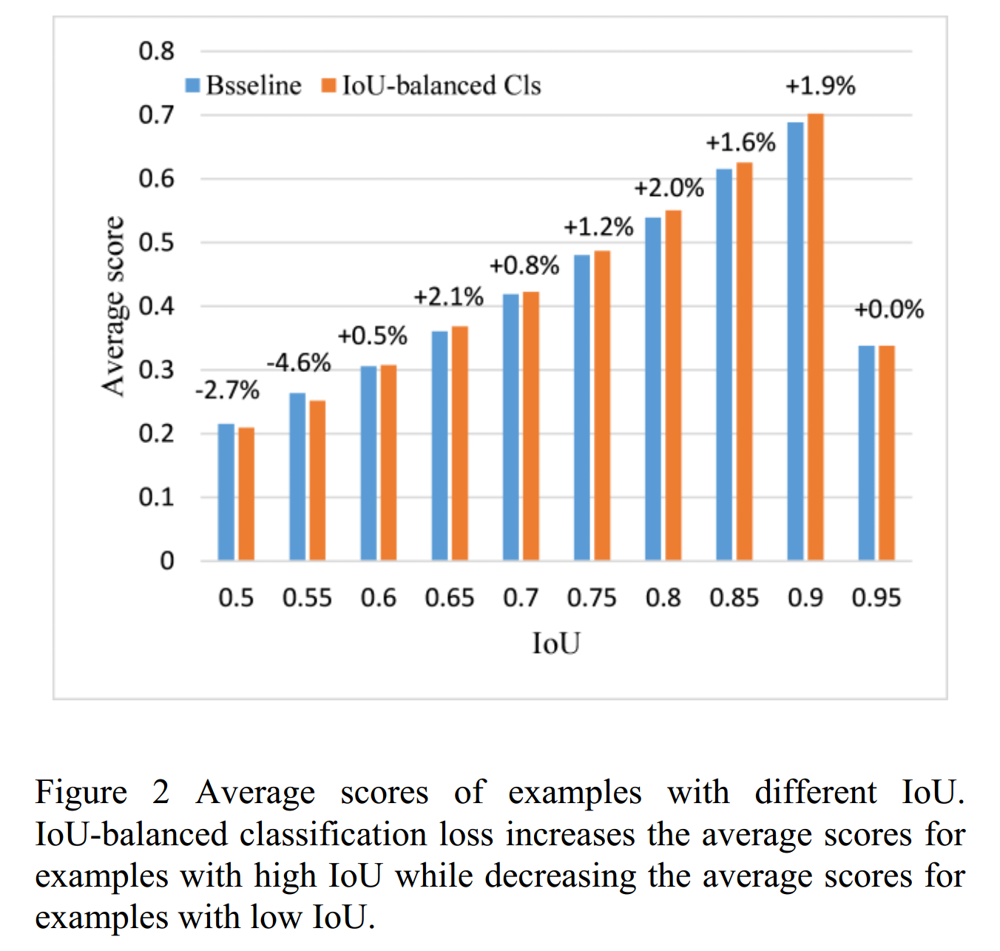
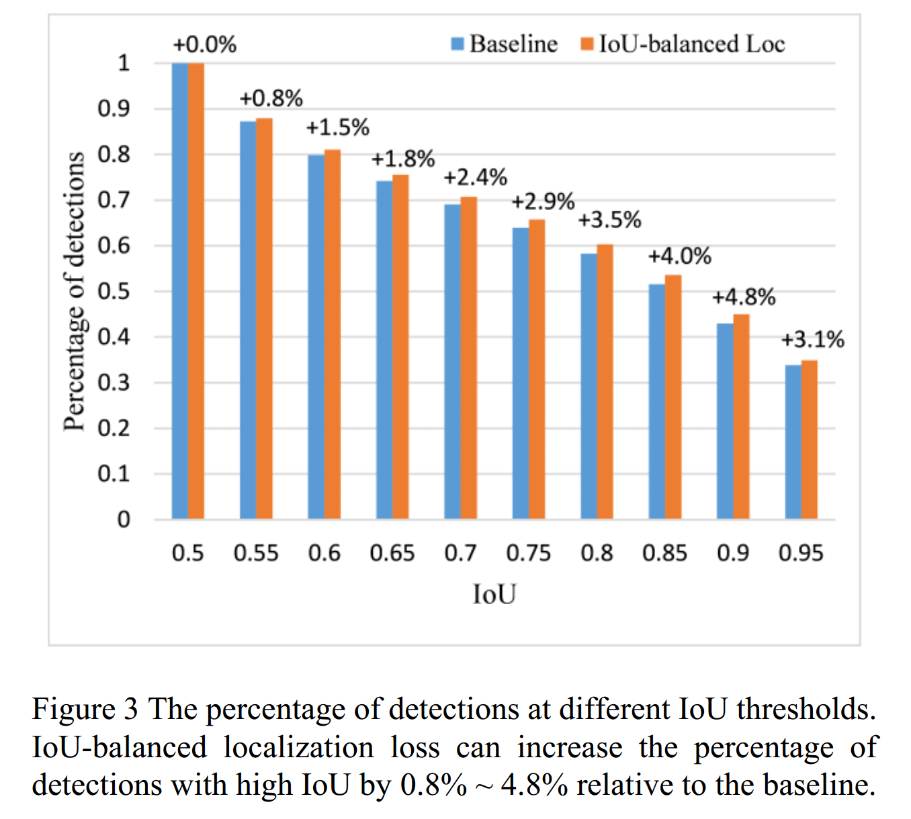

## IoU-balanced Loss Functions for Single-stage Object Detection

### Abstract

​		单阶段检测器是高效的。然而，我们发现单阶段检测器采用的损失函数不是最优的准确定位。用于分类的标准交叉熵损失与定位任务是独立的，并且不管训练过程中的定位精度如何，都促使所有正类样本学习尽可能高的分类得分。因此，将存在具有高分类得分但低 IoU 或低分类得分但高 IoU 的检测。而且，在 NMS 中，具有低分类得分而高 IoU 的检测会被高分类得分而低 IoU 的检测抑制，这损害了定位准确率。对于标准的 smooth L1 损失，具有糟糕定位准确率的异常点主导梯度，而这对于准确的定位是有害的。在这项工作中，我们提出 IoU-balanced 损失函数，其包含 IoU-balanced 分类损失和 IoU-balanced 定位损失来解决上述问题。IoU-balanced 分类损失更关注具有高 IoU 的正类样本，并且增强分类和定位任务的关系。IoU-balanced 定位损失减小具有低 IoU 的样本上产生的梯度，并增加高 IoU 样本的梯度，这可以提高模型的定位准确率。MS COCO 上的充分研究表明， IoU-balanced 分类损失和 IoU-balanced 定位损失可以为单阶段检测器带来实质性的改进。得所提出的方法可以将单阶段检测器的 AP 提高 1.1％，并且在更高 IoU 阈值的情况下，AP 的提高特别大，例如，对于 $AP_{90}$ 可以提高 2.3％。

### 1. Introduction

​		随着深度卷积网络的发展，已经开发了许多目标检测模型。所有这些模型可以分为单阶段检测器（例如 YOLO、SSD、RetinaNet）和多阶段检测器（例如 R-CNN、Fast R-CNN、Faster R-CNN、Cascade R-CNN）。对于多阶段检测器，首先生成提议，然后利用 RoIPool 或 RoIAlign 提取这些提议的特征。提取的特征用于进一步的提议回归和分类。由于多阶段的边界框回归和分类，多阶段检测器获得最佳的性能。单阶段检测器直接依靠规则、不同尺度和纵横比的密集采样锚进行分类和边界框回归。这使单阶段检测哦高度有效。然而，单阶段检测器的准确率通常落后多阶段检测器。主要原因之一是极端的类不平衡。RetinaNet 提出 focal loss 来解决这个问题。另外，由于预定义锚的定位精度低和仅使用单阶段回归，因此单阶段检测器的定位精度也较差。因此，RefineDet 提出两步回归来提高单阶段检测器的定位准确率。

​		在这项工作中，我们证明了单阶段检测器采用的分类和定位损失函数对于精确定位而言不是最优的，并且可以通过设计更好的损失函数（不对模型架构进行任何更改）来显著提高定位能力。大多数单阶段检测器采用的损失函数有两个问题。第一，分类任务和定位任务之间的关系很弱。大多数单阶段检测器采用标准的交叉熵损失进行分类，这与定位任务是独立的，并且这类分类损失为正类样本驱动模型学习尽可能高的分类分数，而与训练过程中的定位精度无关。结果，预测的分类得分与定位精度无关，并且将存在具有高分类得分但低 IoU 或低分类得分但高 IoU 的检测。当应用传统的 NMS 时，高分类得分而低 IoU 的检测将抑制低分类得分而高 IoU 的检测，这是不合理的，并且将会损害目标定位准确率。此外，在计算 COCO 度量时，高分类得分而低 IoU 的检测排在低分类得分而高 IoU 检测之前，这降低了模型的精确率。结果，我们认为增强分类和定位任务的关系对于准确定位是非常重要的。其次，异常点主导单阶段检测器的定位损失的梯度，这些异常点是具有糟糕定位准确率的样本。训练期间，这些样本妨碍模型获得高定位准确率。Fast R-CNN [5] 提出 smooth L1 损失将异常点的梯度抑制为一个有界的值，并可以有效地防止训练过程中梯度的爆炸。然而，我们认为，在更多抑制异常点值梯度的同时，增加内部点（inlier）的梯度仍然很重要。

​		受这些思想的启发，在我们的工作中，设计了 IoU-balanced 分类损失和 IoU-balanced 定位损失。IoU平衡的分类损失将更多的注意力集中在高 IoU 的正类样本上。正类样本的 IoU 越高，对分类损失作出的贡献越大。因此，更高 IoU 的正类样本将在训练中生成更高的梯度，并且更可能学习更高的分类得分，这可以增强分类和定位任务之间的关系。IoU 平衡的定位损失增加高 IoU 样本的梯度，同时抑制低 IoU 样本的梯度。COCO 上的充分实验证明 IoU 平衡的分类损失和 IoU 平衡的定位损失可以实质上提高单阶段检测器的定位准确率。

​		我们的主要贡献如下：（1）我们证明分类的标准交叉熵损失和定位的 smooth L1 损失对于准确的目标定位来说不是最优的，并且通过为单阶段检测器设计更好的损失函数可以提高定位能力。（2）我们提出 IoU 平衡的分类损失来增强分类和定位之间的关系，这可以明显提高单阶段检测器的性能。（3）我们引入 IoU 平衡的定位损失来增加 inlier 的梯度，同时抑制 outlier 的梯度，这使模型更具能力进行准确的目标定位。

### 2. Related Work

​		**Accurate object localization**	准确的目标定位是挑战而重要的主题，并且，最近几年中，提出了很多方法来提高定位准确率。多区域检测器 [10] 认为，单步回归对于准确定位是不够的，因此，提出迭代的边界框回归来精炼检测的坐标，接着是 NMS 和 边界框投票。Cascade R-CNN [7] 训练多阶段的 R-CNN ，其逐阶段的增加 IoU 阈值，因此，多阶段 R-CNN 逐渐变得更具准确定位的能力。因此，最后一个阶段的 R-CNN 可以产生最准确的定位准确率。RefineDet [9] 通过两步级联回归改善一阶段检测器。ARM 首先精炼人工设计的锚，然后， ODM 接收这些精炼的锚作为输入以进行第二阶段的回归，这对改善定位是有好处的。所有这些方法向模型添加了新的模块，因此损害效率。相反，IoU 平衡的损失函数改进定位准确率，而没有改变模型的架构，且不会影响模型的效率。

​		**Hard example mining**    为了提高模型处理困难样本的能力，为目标检测开发了许多难样本挖掘策略。RPN [6] 将困难负样本定义为与 ground-truth 边界框的 IoU 小于等于 0.3 的锚。Fast R-CNN [5] 将与 ground-truth 边界框的最大 IoU 位于 $[0.1, 0.5)$ 的锚定义为困难负样本。OHEM [11] 计算所有样本的损失，然后基于损失对样本进行排序，接着是 NMS 。最后，选择 top-B/N 的样本作为难样本以训练模型。SSD 将 IoU 小于 0.5 的锚定义为负样本，并且给予损失对负样本进行排序。选择靠前的负样本作为困难负样本。RetinaNet 设计 focal 损失来解决容易样本和困难样本之间的极端不平，其减少将预测分类得分高的容易样本，并将更多的注意力集中在预测分类得分低的困难样本上。Libra R-CNN 为负样本构建了基于 IoU 的直方图，并从直方图的每个 bin 中均匀地选择样本作为困难的负样本。与这些策略不同，IoU 平衡的损失函数没有改变采样过程，并仅基于样本的 IoU 给它们分配不同的权重。

​		**Correlation between classification and localization task**    大多数检测模型采用并行的分类和定位子网络进行分类和定位任务。并且，它们依靠独立的分类损失和定位损失来训练模型。这种体系结构导致分类和定位任务之间关系是独立，这是次优的。Fitness NMS [13] 基于回归到的边界框的 IoU 将定位准确率分为 5 个等级，并且设计子网以预测每次检测独立于或依赖于类别的每个定位等级的概率。然后，基于这些概率计算 fitness，并将其与分类得分组合以计算最终的检测得分，这增强分类和定位之间的关系。增强的检测得分用作 NMS 的输入，表示为 Fitness NMS 。相似地，IoU-Net [14] 添加与分类和定位分支并行的 IoU 预测分支来预测每个检测的 IoU，并且预测的 IoU 预定位准确率高度相关。与 Fitness-NMS 不同，预测的 IoU 直接作为 NMS 的输入，表示为 IoU-guided NMS 。MS R-CNN [15] 设计了一个 MaskIoU 头部来预测预测掩膜的 IoU，其目的是解决分类得分和掩膜质量之间较弱的相关性。推理期间，预测的掩膜 IoU 与分类得分相乘作为最终的掩膜质量。与 IoU-Net 不同，当计算 COCO AP 时，增强的掩膜置信度仅用于排序预测掩膜。PISA 提出 IoU-HLR ，其基于 IoU 对正类样本进行排序，并基于这个重要性，计算分类损失中每个正样本的权重，使得更重要的样本对分类损失作出更多的贡献。以这种方式，分类和定位之间的关系得到加强。与 PISA 相比，IoU 平衡的分类损失函数不需要 IoU 层次结构的举报排序过程，并使用正类样本的 IoU 直接计算分配个正样本的权重，这更简单、高效和优雅。

​		**Outliers during training localization subnetwork**    与 R-CNN 和 SPPNet 相比，Fast R-CNN 采用 smooth L1 损失将异常点的梯度限制为一个常量，这阻止了梯度爆炸。GHM [18] 从梯度范数分布的角度分析了单阶段检测器的样本不平衡。该分析表明，对于收敛模型的定位子网络，仍然存在大量的异常值，并且这些异常值可以主导梯度，影响了精确目标定位的训练过程。基于每个样本的梯度密度，提出了GHM-R 算法来提高简单样本的权重，降低异常值的权重。然而，梯度密度计算时耗时的，并且会大大降低训练速度。Libra R-CNN [12] 认为，在直接平衡分类和定位任务时，异常值主导平滑 L1 损失的整体梯度。因此，提出平衡的 L1 损失来增加容易样本的梯度，并保持异常值的梯度不变。与这些方法不同，IoU 平衡的定位损失基于样本的 IoU，计算每个样本的权重，并且增加高 IoU 样本的权重，而降低低 IoU 样本的权重。

### 3. Method

​		在这篇文章中，我们提出 IoU 平衡的分类损失来增强分类和定位任务的关系，而 IoU 平衡的定位损失来增加 inlier 的梯度，同时抑制异常值的梯度。这两个损失都是单阶段检测器更具准确定位的能力。这两个损失在下面章节中详细介绍。

#### 3.1. IoU-balanced Classification Loss

​		大多数目标检测模型采用的分类损失与定位任务是独立的，并且这类分类损失函数驱动模型为正类样本学习尽可能高的分类得分，而不管定位准确率。因此，检测的预测分类得分与定位准确率是独立的。这个问题会影响后续推理过程中模型的性能。首先，当应用 NMS 或者 Soft-NMS 时，会引起高分类得分而低 IoU 的检测抑制低分类得分而高 IoU 的检测。其次，计算 COCO AP 期间，基于分类得分的对所有检测进行排序，会引起高分类得分而低 IoU 的检测排在低分得分而高 IoU 的检测之前。这两个问题都会损害模型的定位准确率。因此，增强分类得分和定位准确率之间的关系对准确的目标检测有好处。

​		我们设计了 IoU 平衡的分类损失（如式（1））来增强分类和定位任务之间的关系。分配给正类样本的权重与回归的边界框和与之对应的 ground-truth 边界框之间的 IoU 呈正相关。因此，在边界框回归之后，基于它们的 IoU，自适应地增加 IoU 样本的权重，降低低 IoU 样本的权重。训练期间，更高 IoU 的样本贡献更大的梯度，因此，对于这些样本，模型容易学习到高分类得分。低 IoU 的样本的梯度的贡献被抑制。以这种方式，分类得分和定位准确率之间的关系被增强，如图 2 所示。在式（1）中，参数 $\eta$ 可以控制 IoU 平衡的分类损失在多大程度上集中于高 IoU 的样本，并抑制低 IoU 的样本。并采用规范化策略保证正类样本的分类损失之和不变。

$$\begin{align}L_{cls} = &\sum_{i\in Pos}^N w_i(iou_i) \ast CE(p_i, \hat{p}_i) + \sum_{i \in Neg}^M CE(p_i,\hat{p}_i) \tag{1} \\ &w_i(iou_i) = iou_i^\eta \frac{\sum_{i=1}^n CE(p_i, \hat{p}_i)}{\sum_{i=1}^n iou_i^\eta CE(p_i,\hat{p}_i)} \tag{2} \end{align}$$

#### 3.2. IoU-balanced Localization Loss

​		GHM [18] 证明了，即使收敛的模型，定位梯度仍被异常点的梯度主导，这些梯度的范数很大，在训练过程中，这将对模型的定位准确率有害。GHM 设计了称为 GHM-R 损失的新定位损失，并基于计算的梯度密度重新加权样本，使得异常值的梯度被抑制，增加容易样本的权重。然而，梯度密度的计算耗时，每次迭代的训练时间增加了 1.5 倍。

​		我们提出 IoU 平衡的定位损失来增加高 IoU 样本的权重，并降低低 IoU 样本的权重，这几乎没有增加计算，并且是高效而优雅的，如式（3）、（4）所示。

$$L_{loc} = \sum_{i \in Pos}^N \sum_{m \in \{cx,cy,w,h\}}w_i(iou_i)\ast smooth_{L1}(l_i^m -\hat{g}_i^m) \tag{3}$$

$$w_i(iou_i) = w_{loc} \ast iou_i^\lambda \tag{4}$$

$$w_i(iou_i) = iou_i^\lambda \ast \frac{\sum_{i \in Pos}^N \sum_{m \in \{cx,cy,w,h\}} smooth_{L1}(l_i^m - \hat{g}_i^m)}{\sum_{i \in Pos}^N \sum_{m \in \{cx,cy,w,h\}}iou_i^\lambda \ast smooth_{L1}(l_i^m - \hat{g}_i^m)} \tag{5}$$

参数 $\lambda$  设计用于控制 IoU 平衡的定位损失关注 inlier 的程度，并抑制异常值。对于训练过程的第一步，手工调整定位损失的权重 $w_{loc}$ 以保持定位损失之和不变。 规范化策略 [16] 用于保持整个训练过程中的定位损失不变，如式（5）所示。然而，实验表明，这种规范化策略比手动调整 $w_{loc}$ 要差。这可能是由训练过程中，规范化因子随着正类样本的 IoU 变大而增加引起的。因此，手动调整 $w_{loc}$ 的策略在后面的实验中使用。

​		我们限制梯度不从 $w(iou)$ 传播到 $l_i^m$ 。与 $l^m$ 对应的 IoU 平衡的smooth L1 损失的梯度表示为：

$$\begin{align}\frac{\partial w(iou) \ast smooth_{L1}}{\partial l^m} &= \frac{\partial w(iou) \ast smooth_{L1}}{\partial d} \\ &= \begin{cases} w(iou) \ast \frac{d}{\delta} & \mbox{if } |d| < \delta \\ w(iou) \ast sign(d) &\mbox{otherwise}\end{cases}\end{align} \tag{6}$$

其中 $d = l^m - \hat{g}^m$ 。IoU 函数表示 IoU 和 d 之间的关系是复杂的，Bounded IoU [14] 痛计算 IoU 函数的上界简化这个函数。我们的文章中采用相同的思想，更多细节读者可以参考 Bounded IoU 。给定锚 $b_s = (x_s, y_s, w_s, h_s)$ ，相关的ground-truth 边界框 $b_t = (x_t, y_t, w_t, h_t)$ 以及预测的边界框 $b_p = (x_p, y_p, w_p, h_p)$ ，IoU 函数的上界如下：

$$iou_B(x,b_t) = \frac{w_t - |\Delta x|}{w_t + |\Delta x|} \tag{7}$$

$$iou_B(w,b_t) = \min(\frac{w_p}{w_t}, \frac{w_t}{w_p}) \tag{8}$$

其中 $\Delta x = x_p - x_t$ 。因为有 $|d^{cx}| = |\Delta x / w_s|$ ，$|d^w| = |\log(w_p / w_t)|$ ，我们得到：

$$iou_B(x, b_t) = \frac{w_t - w_s |d^{cx}|}{w_t + w_s |d^{cx}|}\tag{9}$$

$$iou_B(w, b_t) = e^{-|d^w|} \tag{10}$$

其满足 $|d^{cx}| \le w_t/w_s$ ，从而确保 $iou_B(x, b_t) \ge 0$ 。$iou_B(y, b_t)$ 和 $iou_B(h, b_t)$ 与 $iou_B(x, b_t)$ 和 $iou_B(w, b_t)$ 相似。假设 $\delta = 0.111$ 和 $w_t = w_s$ ，对于 $d^{cx}$ 和 $d^{cy}$ ，有

$$\frac{\partial w(iou) \ast smooth_{L1}}{\partial d} = \begin{cases} w_{loc} \ast \Bigg(\frac{1 -|d|}{1 + |d|}\Bigg)^\lambda \frac{d}{\delta} & \mbox{if} |d| \le \delta \\ w_{loc} \ast \Bigg(\frac{1 -|d|}{1 + |d|}\Bigg)^\lambda \mbox{sign}(d) & \mbox{otherwise} \end{cases} \tag{11}$$

对于 $d^w$ 和 $d^h$，有

$$\frac{\partial w(iou) \ast smooth_{L1}}{\partial d} = \begin{cases} w_{loc} \ast e^{-\lambda|d|} \frac{d}{\delta} & \mbox{if} |d| \le \delta \\ w_{loc} \ast e^{-\lambda |d|} \mbox{sign}(d) & \mbox{otherwise} \end{cases} \tag{11}$$

​		标准 smooth L1 损失（ $\lambda$ ）的梯度范数和 IoU 平衡的 smooth L1 损失（$\lambda = 0.5, 1.0, 1.5, 1.8$）的梯度范数的上界如图 1 。与标准的 smooth L1 损失相比，IoU 平衡的 smooth L1 损失可以增加正常值（inlier）的梯度，减小异常值（outlier）的梯度，使模型更具准确率定位的能力。

### 4. Experiments

#### 4.1. Experimental Settings

​		**Dataset and Evaluation Metrics**	所有的实验在 MS COCO [20] 数据集上实现。该数据集包含 118k 图像进行训练（_train-2017​_）、5k 图像用于验证（_val-2017_）以及 20k 没有标签的图像用于测试。所有模型在 _train-2017_ 上训练，在 _val-2017_ 和 _test-dev_ 上评估。采用标准的 COCO 风格的 AP 度量，其包括从 0.5 到 0.95（间隔为 0.05）IoU 阈值的 AP、$\mbox{AP}_{50}$（IoU 阈值为 0.5 时的 AP）、$\mbox{AP}_{75}$（IoU 阈值为 0.75 的 AP）、$\mbox{AP}_{S}$（小型尺度的 AP）$\mbox{AP}_M$（中型尺度的 AP）以及 $\mbox{AP}_L$ （大型尺度的 AP）。

​		**Implementation Details**	所有实验基于 PyTorch 和 MMDetection [21] 实现。由于仅有 2 个 GPU 可以使用，我们采用线性缩放规则（linear scaling rule）[22] 来调整训练中的学习率。具体而言，与 MMDetection 相比，我们将初始学习率除以 4 ，并在 8 和 11 个周期后分别乘以 0.1 。对于所有消融研究，训练以 ResNet50 为骨干的 RetinaNet，并使用 $[600, 1000]$ 的图像尺度在 _val-2017_ 上进行评估。主要结果以 MMDetection [21] 提供的收敛模型作为基线。具有不同骨干的 IoU 平衡的 RetinaNet 通过 MMDetection 提供的收敛模型使用的默认设置进行训练。在 *test-dev* 上评估性能。如果没有特别提到，其他设置与 MMDetection 中的默认设置保持一致。

#### 4.2. Main Results

​		对于主要结果，报告不同骨干的 RetinaNet 的性能。如表 1 所示，IoU 平衡的损失函数可以将 RetinaNet-ResNet50 和 RetinaNet-ResNet101 的 AP 都提高 1.1 %。

##### 4.3. Ablation Experiments

**Component Analysis**	表 2 展示了 IoU 平衡的分类损失和 IoU 平衡的定位损失可以将 AP 分别提高 0.7% 和 0.8% ，将它们组合可以将 AP 提高 1.3 % 。表 3 显示，在不同的 IoU 阈值下，IoU 平衡的分类损失对 AP 的改善效果是一致的。而，IoU 平衡的定位损失对准确的目标定位特别有益，分别将 $\mbox{AP}_{80}$ 和 $AP_{90}$ 提高了 2.1% 和 2.3 % 。这说明，在准确定位过程中，更多的关注正常值和抑制异常值的定位损失是非常重要的。

**Ablation Studies on IoU-balanced Classification Loss**	IoU 平衡的分类损失中的参数 $\eta$ 控制模型关注高 IoU 样本的程度。如表 4 所示，当 $\eta$ 等于 1.5 时，模型可以获得 35.1 % 的最佳性能。如图 2 所示，IoU 平衡的分类损失可以增加高 IoU 样本的平均得分，并减小低 IoU 样本的平均得分，这证明了分类和定位任务之间的关系通过 IoU 平衡的分类损失得到增强。

**Ablation Studies on IoU-balanced Localization Loss**	如图 1 所示，IoU 平衡的定位损失中的参数 $\lambda$ 控制模型增加正常值的梯度范数和减小异常值的梯度范数的程度。当改变参数 $\lambda$ 时， 通过手动调整定位损失权重 $w_{loc}$ 来保持定位损失之和不变。如表 4 所示，当 $\lambda$ 等于 1.5 时，获得 35.2 % AP 的最佳性能。如图 3 所示，与基线模型相比，IoU 平衡定位损失使高 IoU 检测的比例增加 0.8% ~ 4.8%。这表明 IoU 平衡的定位损失对准确定位有益。

